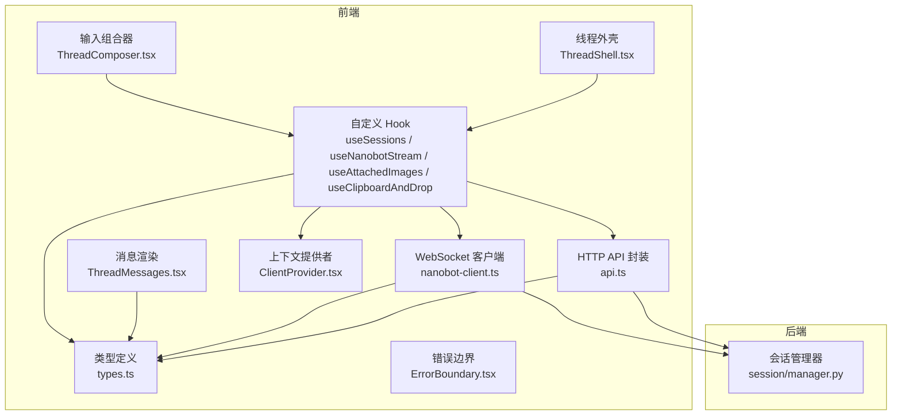
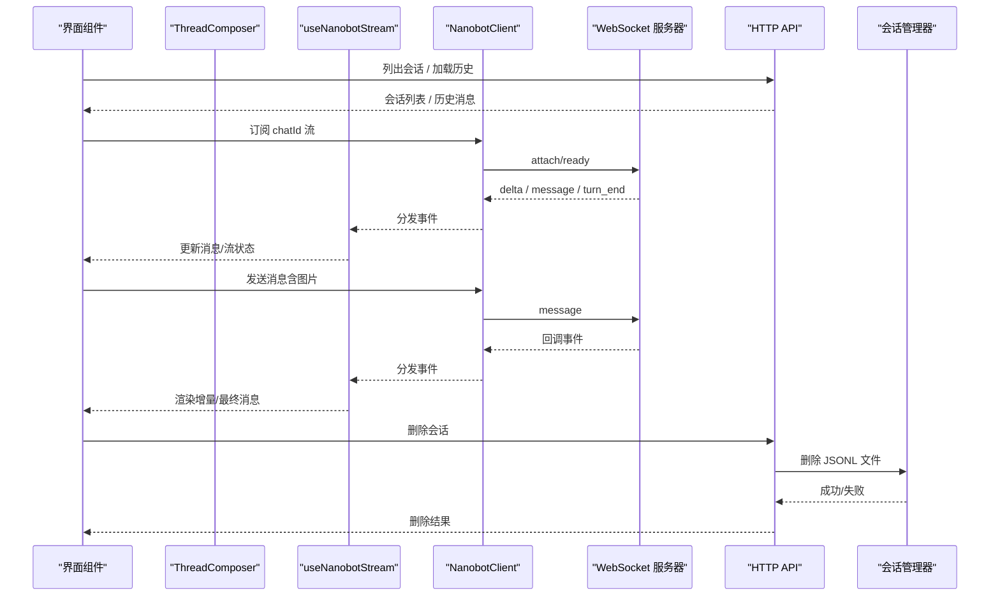
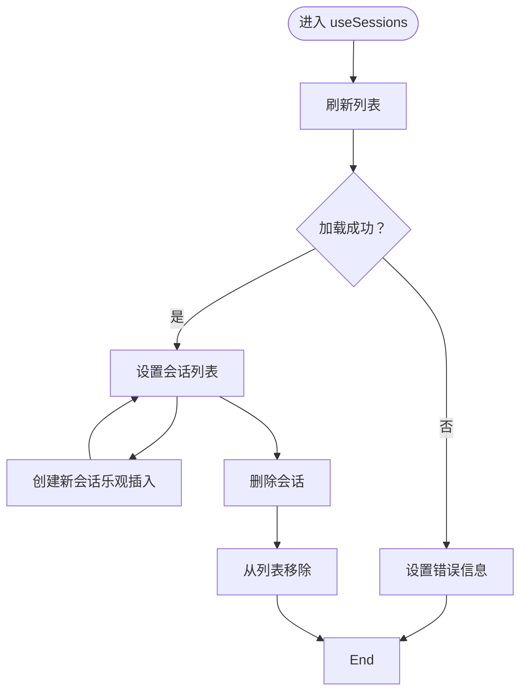
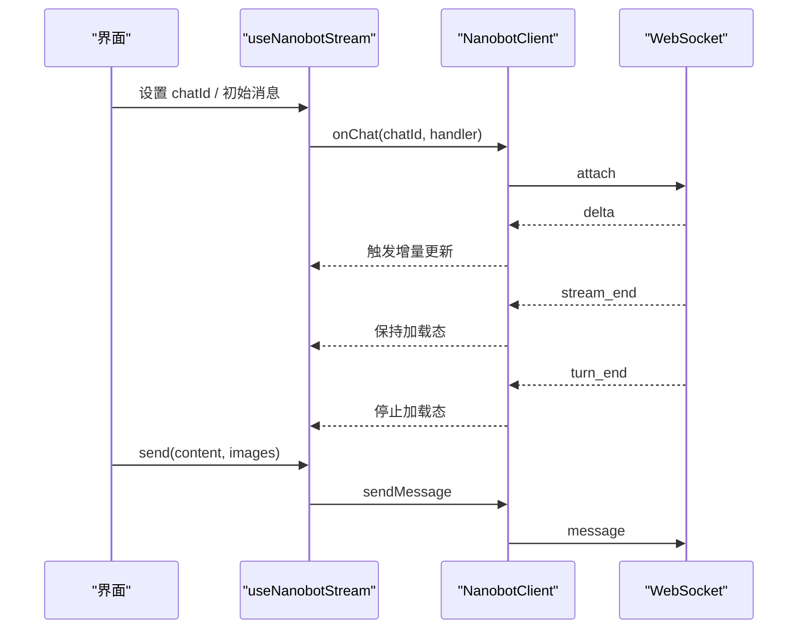
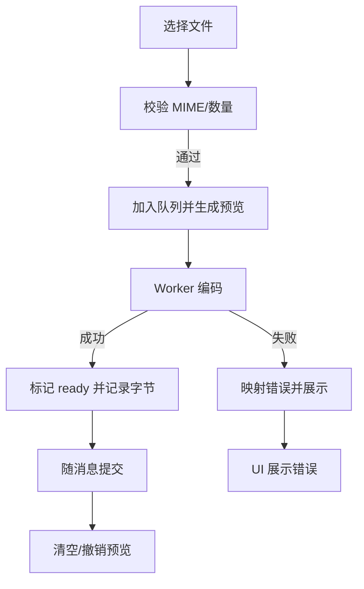
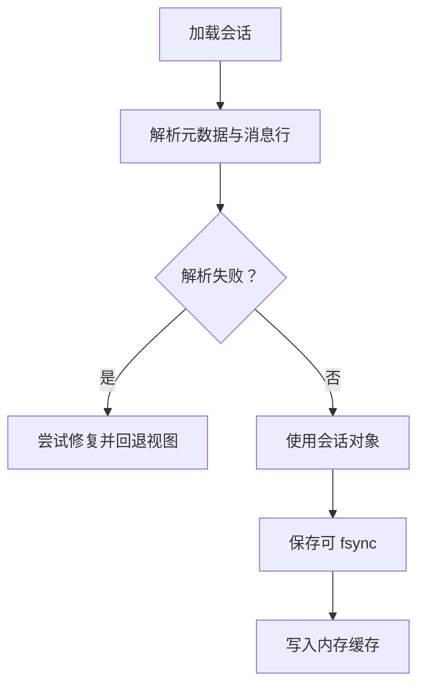
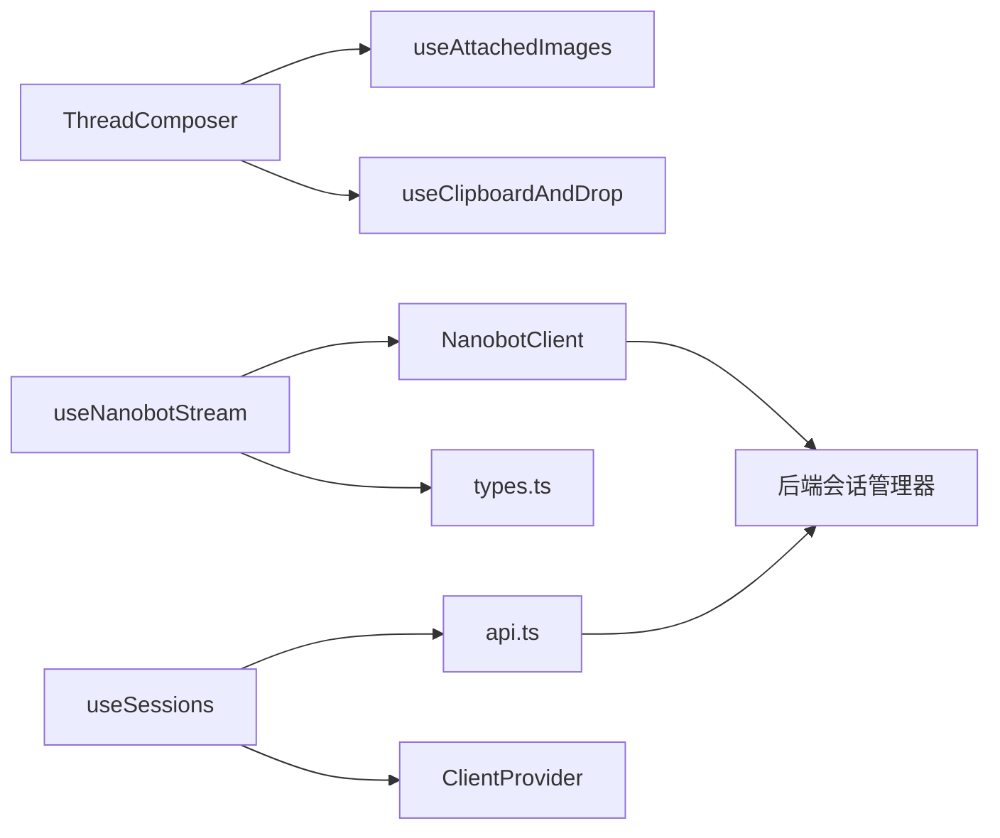

# 状态管理

<cite>
**本文引用的文件**
- [webui/src/hooks/useSessions.ts](file://webui/src/hooks/useSessions.ts)
- [webui/src/hooks/useNanobotStream.ts](file://webui/src/hooks/useNanobotStream.ts)
- [webui/src/hooks/useAttachedImages.ts](file://webui/src/hooks/useAttachedImages.ts)
- [webui/src/hooks/useClipboardAndDrop.ts](file://webui/src/hooks/useClipboardAndDrop.ts)
- [webui/src/lib/types.ts](file://webui/src/lib/types.ts)
- [webui/src/lib/nanobot-client.ts](file://webui/src/lib/nanobot-client.ts)
- [webui/src/lib/api.ts](file://webui/src/lib/api.ts)
- [webui/src/providers/ClientProvider.tsx](file://webui/src/providers/ClientProvider.tsx)
- [webui/src/components/thread/ThreadComposer.tsx](file://webui/src/components/thread/ThreadComposer.tsx)
- [webui/src/components/thread/ThreadMessages.tsx](file://webui/src/components/thread/ThreadMessages.tsx)
- [webui/src/components/thread/ThreadShell.tsx](file://webui/src/components/thread/ThreadShell.tsx)
- [webui/src/components/ErrorBoundary.tsx](file://webui/src/components/ErrorBoundary.tsx)
- [secbot/session/manager.py](file://secbot/session/manager.py)
</cite>

## 目录
1. [简介](#简介)
2. [项目结构](#项目结构)
3. [核心组件](#核心组件)
4. [架构总览](#架构总览)
5. [详细组件分析](#详细组件分析)
6. [依赖分析](#依赖分析)
7. [性能考虑](#性能考虑)
8. [故障排查指南](#故障排查指南)
9. [结论](#结论)
10. [附录](#附录)

## 简介
本文件系统性梳理本仓库中的状态管理实现，重点覆盖以下方面：
- React Hooks 在状态管理中的应用：自定义 Hook 设计、状态提升与共享策略
- 会话状态管理：聊天会话的创建、加载、更新与删除
- WebSocket 流状态管理：实时事件订阅、增量渲染、错误恢复
- 状态持久化策略：前端消息缓存与后端会话文件持久化
- 最佳实践：状态结构设计、性能优化与内存管理
- 调试工具与开发辅助：错误边界、日志与回退策略

## 项目结构
前端状态管理主要分布在以下模块：
- 自定义 Hook：会话列表与历史加载、流式事件订阅、图片附件管理、剪贴板/拖拽
- 客户端与类型：WebSocket 客户端、事件类型与媒体类型定义
- 组件层：消息渲染、输入组合器、线程外壳（含消息缓存）
- 后端会话管理：JSONL 文件持久化、迁移与修复

图表来源
- [webui/src/hooks/useSessions.ts:17-81](file://webui/src/hooks/useSessions.ts#L17-L81)
- [webui/src/hooks/useNanobotStream.ts:39-290](file://webui/src/hooks/useNanobotStream.ts#L39-L290)
- [webui/src/hooks/useAttachedImages.ts:101-233](file://webui/src/hooks/useAttachedImages.ts#L101-L233)
- [webui/src/hooks/useClipboardAndDrop.ts:60-111](file://webui/src/hooks/useClipboardAndDrop.ts#L60-L111)
- [webui/src/lib/types.ts:1-224](file://webui/src/lib/types.ts#L1-L224)
- [webui/src/lib/nanobot-client.ts:57-320](file://webui/src/lib/nanobot-client.ts#L57-L320)
- [webui/src/lib/api.ts:37-108](file://webui/src/lib/api.ts#L37-L108)
- [webui/src/providers/ClientProvider.tsx:13-37](file://webui/src/providers/ClientProvider.tsx#L13-L37)
- [webui/src/components/thread/ThreadComposer.tsx:76-490](file://webui/src/components/thread/ThreadComposer.tsx#L76-L490)
- [webui/src/components/thread/ThreadMessages.tsx:8-16](file://webui/src/components/thread/ThreadMessages.tsx#L8-L16)
- [webui/src/components/thread/ThreadShell.tsx:117-157](file://webui/src/components/thread/ThreadShell.tsx#L117-L157)
- [webui/src/components/ErrorBoundary.tsx:16-72](file://webui/src/components/ErrorBoundary.tsx#L16-L72)
- [secbot/session/manager.py:239-576](file://secbot/session/manager.py#L239-L576)

章节来源
- [webui/src/hooks/useSessions.ts:17-81](file://webui/src/hooks/useSessions.ts#L17-L81)
- [webui/src/hooks/useNanobotStream.ts:39-290](file://webui/src/hooks/useNanobotStream.ts#L39-L290)
- [webui/src/lib/nanobot-client.ts:57-320](file://webui/src/lib/nanobot-client.ts#L57-L320)
- [webui/src/lib/api.ts:37-108](file://webui/src/lib/api.ts#L37-L108)
- [webui/src/lib/types.ts:1-224](file://webui/src/lib/types.ts#L1-L224)
- [webui/src/providers/ClientProvider.tsx:13-37](file://webui/src/providers/ClientProvider.tsx#L13-L37)
- [webui/src/components/thread/ThreadComposer.tsx:76-490](file://webui/src/components/thread/ThreadComposer.tsx#L76-L490)
- [webui/src/components/thread/ThreadMessages.tsx:8-16](file://webui/src/components/thread/ThreadMessages.tsx#L8-L16)
- [webui/src/components/thread/ThreadShell.tsx:117-157](file://webui/src/components/thread/ThreadShell.tsx#L117-L157)
- [webui/src/components/ErrorBoundary.tsx:16-72](file://webui/src/components/ErrorBoundary.tsx#L16-L72)
- [secbot/session/manager.py:239-576](file://secbot/session/manager.py#L239-L576)

## 核心组件
- useSessions：负责会话列表的拉取、创建（乐观插入）、删除；以及按需懒加载某一会话的历史消息
- useNanobotStream：订阅指定 chatId 的 WebSocket 流，维护增量消息缓冲、流结束与回合结束状态、错误上报与恢复
- useAttachedImages：管理用户选择的图片附件生命周期（编码、预览、错误、清理），并与发送流程集成
- useClipboardAndDrop：统一处理粘贴与拖拽图片，避免 XSS 风险
- NanobotClient：单例 WebSocket 客户端，支持自动重连、多路复用 chat 流、错误结构化上报
- 类型系统：UIMessage、InboundEvent、OutboundMedia 等，确保前后端协议一致
- API 封装：会话列表、历史消息、删除等 HTTP 接口
- 线程外壳 ThreadShell：在聊天切换时进行消息缓存，避免闪烁与重复请求
- 错误边界 ErrorBoundary：捕获渲染异常，提供可恢复提示

章节来源
- [webui/src/hooks/useSessions.ts:17-81](file://webui/src/hooks/useSessions.ts#L17-L81)
- [webui/src/hooks/useNanobotStream.ts:39-290](file://webui/src/hooks/useNanobotStream.ts#L39-L290)
- [webui/src/hooks/useAttachedImages.ts:101-233](file://webui/src/hooks/useAttachedImages.ts#L101-L233)
- [webui/src/hooks/useClipboardAndDrop.ts:60-111](file://webui/src/hooks/useClipboardAndDrop.ts#L60-L111)
- [webui/src/lib/nanobot-client.ts:57-320](file://webui/src/lib/nanobot-client.ts#L57-L320)
- [webui/src/lib/types.ts:53-224](file://webui/src/lib/types.ts#L53-L224)
- [webui/src/lib/api.ts:37-108](file://webui/src/lib/api.ts#L37-L108)
- [webui/src/components/thread/ThreadShell.tsx:117-157](file://webui/src/components/thread/ThreadShell.tsx#L117-L157)
- [webui/src/components/ErrorBoundary.tsx:16-72](file://webui/src/components/ErrorBoundary.tsx#L16-L72)

## 架构总览
前端通过 ClientProvider 注入 NanobotClient 与令牌，各 Hook 基于 React 状态与副作用完成会话与流式交互；后端以 JSONL 文件持久化会话，提供安全的媒体签名 URL。

图表来源
- [webui/src/lib/nanobot-client.ts:134-320](file://webui/src/lib/nanobot-client.ts#L134-L320)
- [webui/src/hooks/useNanobotStream.ts:108-252](file://webui/src/hooks/useNanobotStream.ts#L108-L252)
- [webui/src/lib/api.ts:37-108](file://webui/src/lib/api.ts#L37-L108)
- [secbot/session/manager.py:472-487](file://secbot/session/manager.py#L472-L487)

## 详细组件分析

### useSessions：会话列表与历史加载
职责与行为
- 列表：首次加载会话列表，错误时返回 HTTP 状态或错误信息
- 创建：调用客户端创建新会话，采用“乐观插入”策略立即显示新会话，等待服务端持久化后刷新替换
- 删除：调用 API 删除会话，并从列表中移除
- 懒加载历史：根据 key 拉取历史消息，转换为 UI 消息格式；对 404 场景（新会话尚未持久化）视为正常，不报错

关键点
- 使用 tokenRef 保持最新令牌，避免闭包陷阱
- useSessionHistory 在 key 变更时立即清空旧消息，防止闪烁
- 对工具调用挂起状态进行识别，保证加载态正确

图表来源
- [webui/src/hooks/useSessions.ts:33-80](file://webui/src/hooks/useSessions.ts#L33-L80)

章节来源
- [webui/src/hooks/useSessions.ts:17-81](file://webui/src/hooks/useSessions.ts#L17-L81)
- [webui/src/lib/api.ts:37-108](file://webui/src/lib/api.ts#L37-L108)

### useNanobotStream：WebSocket 流状态管理
职责与行为
- 订阅指定 chatId 的流事件，维护增量消息缓冲（delta→合并文本→最终 message）
- 区分“文本段结束”（stream_end）与“回合结束”（turn_end），后者才停止加载态
- 处理 trace 行（工具提示/进度）聚合，避免 UI 过度碎片化
- 结构化错误上报（如“消息过大”），并提供 dismiss 方法
- 支持外部 onTurnEnd 回调，用于联动其他副作用

关键点
- 使用 useRef 缓冲当前正在接收的助手消息 ID 与片段序列，避免重复创建对象
- 在 chatId 切换时重置状态、清空缓冲、取消待决定时器，确保状态隔离
- 对“工具调用执行中”的场景，通过延迟关闭加载态维持体验一致性

图表来源
- [webui/src/hooks/useNanobotStream.ts:76-252](file://webui/src/hooks/useNanobotStream.ts#L76-L252)
- [webui/src/lib/nanobot-client.ts:117-246](file://webui/src/lib/nanobot-client.ts#L117-L246)

章节来源
- [webui/src/hooks/useNanobotStream.ts:39-290](file://webui/src/hooks/useNanobotStream.ts#L39-L290)
- [webui/src/lib/nanobot-client.ts:57-320](file://webui/src/lib/nanobot-client.ts#L57-L320)
- [webui/src/lib/types.ts:163-197](file://webui/src/lib/types.ts#L163-L197)

### useAttachedImages：图片附件状态管理
职责与行为
- 校验 MIME 白名单与数量上限，生成 blob 预览 URL
- 异步交给 Worker 编码，映射失败原因并反馈到 UI
- 提供移除、清空、焦点管理能力，确保内存及时回收

关键点
- 使用 imagesRef 保存最新数组，避免 enqueue 多次调用导致的闭包陈旧值
- 在卸载时统一撤销 blob URL，防止内存泄漏
- 与 ThreadComposer 协作，提交时将 data URL 同步到 wire payload 与乐观预览

图表来源
- [webui/src/hooks/useAttachedImages.ts:117-177](file://webui/src/hooks/useAttachedImages.ts#L117-L177)
- [webui/src/components/thread/ThreadComposer.tsx:213-238](file://webui/src/components/thread/ThreadComposer.tsx#L213-L238)

章节来源
- [webui/src/hooks/useAttachedImages.ts:101-233](file://webui/src/hooks/useAttachedImages.ts#L101-L233)
- [webui/src/components/thread/ThreadComposer.tsx:76-490](file://webui/src/components/thread/ThreadComposer.tsx#L76-L490)

### useClipboardAndDrop：粘贴/拖拽图片
职责与行为
- 仅提取 kind=file 且 type 以 image/ 开头的项，避免远程资源与 XSS 风险
- 维护拖拽深度计数，准确控制高亮状态
- 将图片交由上层回调处理

章节来源
- [webui/src/hooks/useClipboardAndDrop.ts:60-111](file://webui/src/hooks/useClipboardAndDrop.ts#L60-L111)

### ThreadComposer：输入与发送
职责与行为
- 整合文本输入、图片附件、斜杠命令面板、粘贴/拖拽
- 根据 canSend 控制按钮可用性，提交时将 data URL 同步到 wire 与乐观气泡
- 与 useNanobotStream 的 send 对接，触发 WebSocket 消息发送

章节来源
- [webui/src/components/thread/ThreadComposer.tsx:76-490](file://webui/src/components/thread/ThreadComposer.tsx#L76-L490)

### ThreadMessages：消息渲染
职责与行为
- 将 UIMessage 列表映射为消息气泡组件，保持顺序与键控

章节来源
- [webui/src/components/thread/ThreadMessages.tsx:8-16](file://webui/src/components/thread/ThreadMessages.tsx#L8-L16)

### ThreadShell：消息缓存与切换
职责与行为
- 在 chatId 切换时，避免在首帧写入上一个聊天的消息缓存，防止闪烁
- 将当前 messages 写入缓存，以便后续快速恢复

章节来源
- [webui/src/components/thread/ThreadShell.tsx:117-157](file://webui/src/components/thread/ThreadShell.tsx#L117-L157)

### ClientProvider：上下文注入
职责与行为
- 将 NanobotClient、令牌与模型名注入到子树，供各 Hook 使用

章节来源
- [webui/src/providers/ClientProvider.tsx:13-37](file://webui/src/providers/ClientProvider.tsx#L13-L37)

### 类型系统：UIMessage 与 InboundEvent
职责与行为
- 统一消息角色、消息种类（普通/trace）、时间戳、媒体附件、按钮等字段
- 定义 WebSocket 入站事件集合，涵盖 delta、message、turn_end、session_updated 等

章节来源
- [webui/src/lib/types.ts:53-224](file://webui/src/lib/types.ts#L53-L224)

### API 封装：会话与设置
职责与行为
- 列出会话、读取历史、删除会话、读取设置、列出斜杠命令、更新设置等
- 统一封装错误类型（ApiError），便于 UI 展示

章节来源
- [webui/src/lib/api.ts:37-187](file://webui/src/lib/api.ts#L37-L187)

### 后端会话管理：JSONL 持久化
职责与行为
- 会话以 JSONL 文件存储，元数据行包含 key、时间戳、标题等
- 提供迁移、修复、列表、读取、删除、保存（可 fsync）等能力
- 限制文件最大消息数，超过阈值进行归档与裁剪

图表来源
- [secbot/session/manager.py:285-449](file://secbot/session/manager.py#L285-L449)

章节来源
- [secbot/session/manager.py:239-576](file://secbot/session/manager.py#L239-L576)

## 依赖分析
- 组件与 Hook 的耦合
  - ThreadComposer 依赖 useAttachedImages 与 useClipboardAndDrop，形成输入层
  - useNanobotStream 依赖 NanobotClient 与类型系统，形成流式渲染层
  - useSessions 依赖 API 与 ClientProvider，形成会话管理层
- 外部依赖
  - WebSocket 客户端（NanobotClient）负责网络层与重连逻辑
  - HTTP API 负责会话与设置等非流式操作
  - 后端会话管理器负责持久化与修复

图表来源
- [webui/src/components/thread/ThreadComposer.tsx:76-490](file://webui/src/components/thread/ThreadComposer.tsx#L76-L490)
- [webui/src/hooks/useNanobotStream.ts:39-290](file://webui/src/hooks/useNanobotStream.ts#L39-L290)
- [webui/src/hooks/useSessions.ts:17-81](file://webui/src/hooks/useSessions.ts#L17-L81)
- [webui/src/lib/nanobot-client.ts:57-320](file://webui/src/lib/nanobot-client.ts#L57-L320)
- [webui/src/lib/api.ts:37-108](file://webui/src/lib/api.ts#L37-L108)
- [secbot/session/manager.py:239-576](file://secbot/session/manager.py#L239-L576)

章节来源
- [webui/src/components/thread/ThreadComposer.tsx:76-490](file://webui/src/components/thread/ThreadComposer.tsx#L76-L490)
- [webui/src/hooks/useNanobotStream.ts:39-290](file://webui/src/hooks/useNanobotStream.ts#L39-L290)
- [webui/src/hooks/useSessions.ts:17-81](file://webui/src/hooks/useSessions.ts#L17-L81)
- [webui/src/lib/nanobot-client.ts:57-320](file://webui/src/lib/nanobot-client.ts#L57-L320)
- [webui/src/lib/api.ts:37-108](file://webui/src/lib/api.ts#L37-L108)
- [secbot/session/manager.py:239-576](file://secbot/session/manager.py#L239-L576)

## 性能考虑
- 乐观 UI 与最小闪烁
  - useSessions 在创建新会话时采用乐观插入，减少等待时间
  - useNanobotStream 在 chatId 切换时重置状态，避免跨会话状态污染
  - ThreadShell 在切换首帧不写入缓存，避免闪烁
- 增量渲染与缓冲
  - useNanobotStream 使用缓冲区累积 delta，合并后再更新，降低重渲染次数
  - trace 行聚合减少 UI 细粒度更新
- 资源释放
  - useAttachedImages 在卸载时撤销所有 blob URL，防止内存泄漏
  - 发送完成后清空附件，避免残留引用
- 网络健壮性
  - NanobotClient 支持指数退避重连、结构化错误上报、队列化发送
  - API 层对 404 场景进行特殊处理，避免误报

[本节为通用指导，无需特定文件来源]

## 故障排查指南
- 渲染异常
  - 使用 ErrorBoundary 捕获未处理的渲染错误，提供重试入口与日志输出
- WebSocket 错误
  - NanobotClient 将“消息过大”等传输级错误结构化上报，UI 可通过 streamError 获取并提示
  - 若出现连接中断，检查 onReauth 是否能刷新 URL 并触发重连
- 会话历史为空
  - 新建会话但未发送第一条消息时，历史接口可能返回 404，属预期；UI 已做容错
- 图片上传失败
  - useAttachedImages 将失败原因映射为可本地化的错误文案；检查 MIME 白名单与大小限制
- 会话删除无效
  - 确认 API 返回的删除结果与前端状态一致；必要时手动刷新列表

章节来源
- [webui/src/components/ErrorBoundary.tsx:16-72](file://webui/src/components/ErrorBoundary.tsx#L16-L72)
- [webui/src/lib/nanobot-client.ts:25-31](file://webui/src/lib/nanobot-client.ts#L25-L31)
- [webui/src/hooks/useNanobotStream.ts:76-80](file://webui/src/hooks/useNanobotStream.ts#L76-L80)
- [webui/src/lib/api.ts:98-108](file://webui/src/lib/api.ts#L98-L108)
- [webui/src/hooks/useAttachedImages.ts:58-71](file://webui/src/hooks/useAttachedImages.ts#L58-L71)

## 结论
本项目在前端采用 React Hooks 实现细粒度状态管理，结合自定义 Hook 完成会话、流式事件与附件的协同；后端以 JSONL 文件提供可靠持久化。整体设计强调：
- 乐观 UI 与最小闪烁
- 增量渲染与状态隔离
- 结构化错误与可恢复重连
- 资源释放与内存管理
建议在扩展时遵循现有 Hook 设计模式与类型约束，确保前后端协议一致与状态一致性。

[本节为总结，无需特定文件来源]

## 附录
- 状态结构设计要点
  - UIMessage 明确角色、内容、时间戳、媒体与按钮等字段，trace 行独立标识
  - InboundEvent 覆盖 delta/message/stream_end/turn_end/session_updated/error 等关键事件
- 性能优化清单
  - 使用 useRef 缓存关键状态，避免不必要的重渲染
  - 在 chatId 切换时重置状态与定时器，避免交叉污染
  - 附件编码与预览在提交前完成，减少二次渲染
- 最佳实践
  - 将网络错误与业务错误分离，前者通过结构化错误上报，后者通过 UI 提示
  - 对大文件与多图场景进行容量与大小限制，提前在前端拦截
  - 严格释放 blob URL 与定时器，避免内存泄漏

[本节为通用指导，无需特定文件来源]