# 业务功能组件

<cite>
**本文引用的文件**   
- [ChatList.tsx](file://webui/src/components/ChatList.tsx)
- [ChatPane.tsx](file://webui/src/components/ChatPane.tsx)
- [Sidebar.tsx](file://webui/src/components/Sidebar.tsx)
- [MessageList.tsx](file://webui/src/components/MessageList.tsx)
- [MessageBubble.tsx](file://webui/src/components/MessageBubble.tsx)
- [Composer.tsx](file://webui/src/components/Composer.tsx)
- [ConnectionBadge.tsx](file://webui/src/components/ConnectionBadge.tsx)
- [EmptyState.tsx](file://webui/src/components/EmptyState.tsx)
- [DeleteConfirm.tsx](file://webui/src/components/DeleteConfirm.tsx)
- [ImageLightbox.tsx](file://webui/src/components/ImageLightbox.tsx)
- [LanguageSwitcher.tsx](file://webui/src/components/LanguageSwitcher.tsx)
- [CodeBlock.tsx](file://webui/src/components/CodeBlock.tsx)
- [types.ts](file://webui/src/lib/types.ts)
- [useNanobotStream.ts](file://webui/src/hooks/useNanobotStream.ts)
- [useSessions.ts](file://webui/src/hooks/useSessions.ts)
</cite>

## 目录
1. [简介](#简介)
2. [项目结构](#项目结构)
3. [核心组件](#核心组件)
4. [架构总览](#架构总览)
5. [详细组件分析](#详细组件分析)
6. [依赖关系分析](#依赖关系分析)
7. [性能考量](#性能考量)
8. [故障排查指南](#故障排查指南)
9. [结论](#结论)
10. [附录](#附录)

## 简介
本文件系统性梳理并深入解析前端 WebUI 中的核心业务组件与交互增强组件，包括聊天列表、聊天面板、侧边栏等主功能区，以及消息列表、消息气泡、消息输入框等交互组件；同时覆盖连接状态徽章、空状态、删除确认等辅助组件，以及图片灯箱、语言切换器、代码块、Markdown 渲染器等增强组件。文档从架构设计、数据流、处理逻辑、状态管理到性能优化策略进行全方位阐述，并辅以可视化图示帮助理解。

## 项目结构
WebUI 的业务组件主要位于 webui/src/components 与 webui/src/hooks 下，配合 webui/src/lib/types 定义统一的数据模型与事件类型。组件间通过 React Hooks（如 useNanobotStream、useSessions）与 Provider（ClientProvider）进行状态与通信桥接，形成清晰的分层：视图层（组件）、状态层（Hooks）、数据层（API/客户端）。

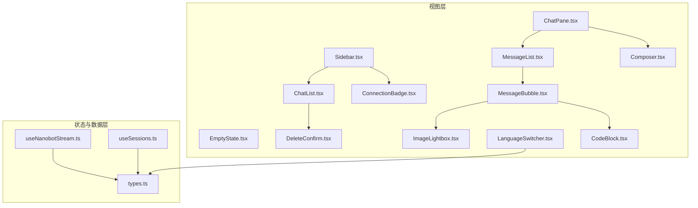

**图表来源**
- [Sidebar.tsx:26-122](file://webui/src/components/Sidebar.tsx#L26-L122)
- [ChatList.tsx:29-156](file://webui/src/components/ChatList.tsx#L29-L156)
- [ChatPane.tsx:23-117](file://webui/src/components/ChatPane.tsx#L23-L117)
- [MessageList.tsx:22-110](file://webui/src/components/MessageList.tsx#L22-L110)
- [MessageBubble.tsx:23-584](file://webui/src/components/MessageBubble.tsx#L23-L584)
- [Composer.tsx:20-125](file://webui/src/components/Composer.tsx#L20-L125)
- [ConnectionBadge.tsx:27-57](file://webui/src/components/ConnectionBadge.tsx#L27-L57)
- [EmptyState.tsx:5-27](file://webui/src/components/EmptyState.tsx#L5-L27)
- [DeleteConfirm.tsx:20-53](file://webui/src/components/DeleteConfirm.tsx#L20-L53)
- [ImageLightbox.tsx:30-200](file://webui/src/components/ImageLightbox.tsx#L30-L200)
- [LanguageSwitcher.tsx:24-68](file://webui/src/components/LanguageSwitcher.tsx#L24-L68)
- [CodeBlock.tsx:38-106](file://webui/src/components/CodeBlock.tsx#L38-L106)
- [useNanobotStream.ts:39-291](file://webui/src/hooks/useNanobotStream.ts#L39-L291)
- [useSessions.ts:17-229](file://webui/src/hooks/useSessions.ts#L17-L229)
- [types.ts:53-224](file://webui/src/lib/types.ts#L53-L224)

**章节来源**
- [Sidebar.tsx:26-122](file://webui/src/components/Sidebar.tsx#L26-L122)
- [ChatList.tsx:29-156](file://webui/src/components/ChatList.tsx#L29-L156)
- [ChatPane.tsx:23-117](file://webui/src/components/ChatPane.tsx#L23-L117)
- [MessageList.tsx:22-110](file://webui/src/components/MessageList.tsx#L22-L110)
- [MessageBubble.tsx:23-584](file://webui/src/components/MessageBubble.tsx#L23-L584)
- [Composer.tsx:20-125](file://webui/src/components/Composer.tsx#L20-L125)
- [ConnectionBadge.tsx:27-57](file://webui/src/components/ConnectionBadge.tsx#L27-L57)
- [EmptyState.tsx:5-27](file://webui/src/components/EmptyState.tsx#L5-L27)
- [DeleteConfirm.tsx:20-53](file://webui/src/components/DeleteConfirm.tsx#L20-L53)
- [ImageLightbox.tsx:30-200](file://webui/src/components/ImageLightbox.tsx#L30-L200)
- [LanguageSwitcher.tsx:24-68](file://webui/src/components/LanguageSwitcher.tsx#L24-L68)
- [CodeBlock.tsx:38-106](file://webui/src/components/CodeBlock.tsx#L38-L106)
- [useNanobotStream.ts:39-291](file://webui/src/hooks/useNanobotStream.ts#L39-L291)
- [useSessions.ts:17-229](file://webui/src/hooks/useSessions.ts#L17-L229)
- [types.ts:53-224](file://webui/src/lib/types.ts#L53-L224)

## 核心组件
- 聊天列表 ChatList：按日期分组展示会话，支持悬停菜单触发删除；在加载或空状态时显示占位文案。
- 聊天面板 ChatPane：承载历史消息、实时流式回复与输入框；无会话时展示欢迎态与可直接发起新对话的输入框。
- 侧边栏 Sidebar：包含搜索、新建会话、连接状态徽章与聊天列表；支持查询过滤。
- 消息列表 MessageList：自动贴底滚动、保留用户阅读位置、浮动“回到底部”按钮；空态提示。
- 消息气泡 MessageBubble：区分用户/助手/追踪行；支持复制、媒体附件（图片/视频/文件）、灯箱查看、工具调用追踪折叠。
- 消息输入 Composer：自适应高度、快捷键发送、禁用态与紧凑态；与 ChatPane 协作完成首次消息的“静默建会话+转发”。

**章节来源**
- [ChatList.tsx:29-156](file://webui/src/components/ChatList.tsx#L29-L156)
- [ChatPane.tsx:23-117](file://webui/src/components/ChatPane.tsx#L23-L117)
- [Sidebar.tsx:26-122](file://webui/src/components/Sidebar.tsx#L26-L122)
- [MessageList.tsx:22-110](file://webui/src/components/MessageList.tsx#L22-L110)
- [MessageBubble.tsx:23-584](file://webui/src/components/MessageBubble.tsx#L23-L584)
- [Composer.tsx:20-125](file://webui/src/components/Composer.tsx#L20-L125)

## 架构总览
整体采用“视图组件 + Hooks 状态管理 + 类型定义”的分层设计。视图组件负责渲染与交互；Hooks 将 WebSocket 流、会话列表与消息历史抽象为可复用的状态；类型定义贯穿于数据结构、事件与媒体附件，确保前后端契约一致。

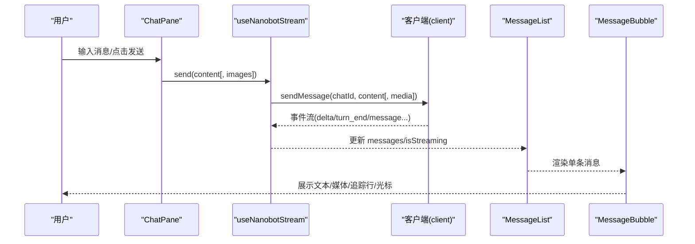

**图表来源**
- [ChatPane.tsx:32-61](file://webui/src/components/ChatPane.tsx#L32-L61)
- [useNanobotStream.ts:254-280](file://webui/src/hooks/useNanobotStream.ts#L254-L280)
- [MessageList.tsx:22-41](file://webui/src/components/MessageList.tsx#L22-L41)
- [MessageBubble.tsx:23-123](file://webui/src/components/MessageBubble.tsx#L23-L123)

## 详细组件分析

### 聊天列表 ChatList
- 功能要点
  - 加载中与空态文案国际化。
  - 会话按“今天/昨天/更早”分组，提升可读性。
  - 每项支持选择与删除操作；删除通过下拉菜单触发。
  - 标题截断与回退标题生成，避免过长标题影响布局。
- 关键实现
  - 分组算法：基于 updatedAt/createdAt 计算时间桶，三段式标签。
  - 交互：Hover 显示菜单，激活态高亮与边框阴影。
- 性能与可用性
  - 使用 ScrollArea 提供平滑滚动。
  - 标题长度限制与省略号，保证列表稳定渲染。

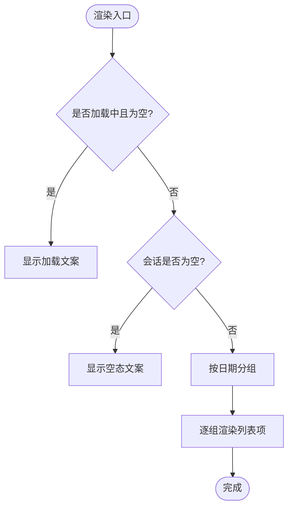

**图表来源**
- [ChatList.tsx:37-52](file://webui/src/components/ChatList.tsx#L37-L52)
- [ChatList.tsx:131-155](file://webui/src/components/ChatList.tsx#L131-L155)

**章节来源**
- [ChatList.tsx:29-156](file://webui/src/components/ChatList.tsx#L29-L156)

### 聊天面板 ChatPane
- 功能要点
  - 历史消息与实时流式消息并存，底部固定输入框。
  - 无会话时展示欢迎态，输入即静默创建会话并转发首条消息。
  - 首次消息发送前的“引导态”与并发控制（booting 锁）。
- 关键实现
  - useSessionHistory 获取历史；useNanobotStream 管理流式状态。
  - 首次消息通过 ref 存储并等待 onNewChat 返回后执行发送。
  - 会话激活后刷新本地消息队列，保持一致性。
- 可靠性
  - 异常路径：创建失败释放锁，允许重试。
  - 与客户端状态解耦，仅依赖 chatId 是否存在。

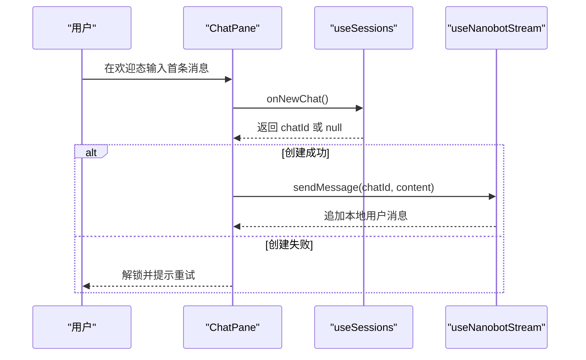

**图表来源**
- [ChatPane.tsx:63-76](file://webui/src/components/ChatPane.tsx#L63-L76)
- [ChatPane.tsx:38-61](file://webui/src/components/ChatPane.tsx#L38-L61)
- [useSessions.ts:52-70](file://webui/src/hooks/useSessions.ts#L52-L70)

**章节来源**
- [ChatPane.tsx:23-117](file://webui/src/components/ChatPane.tsx#L23-L117)
- [useSessions.ts:17-81](file://webui/src/hooks/useSessions.ts#L17-L81)

### 侧边栏 Sidebar
- 功能要点
  - 搜索过滤：对 preview、chatId、channel、key 进行拼接检索。
  - 新建会话：触发 onNewChat。
  - 底部连接状态徽章：实时反映连接状态与脉冲动画。
- 关键实现
  - 查询标准化：去空白转小写，惰性计算过滤结果。
  - 空结果文案：根据是否有查询动态切换。
- 可扩展性
  - 通过 props 注入事件回调，便于上层路由或状态管理集成。

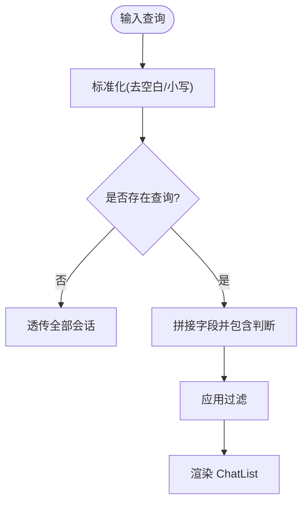

**图表来源**
- [Sidebar.tsx:28-44](file://webui/src/components/Sidebar.tsx#L28-L44)
- [Sidebar.tsx:104-114](file://webui/src/components/Sidebar.tsx#L104-L114)

**章节来源**
- [Sidebar.tsx:26-122](file://webui/src/components/Sidebar.tsx#L26-L122)

### 消息列表 MessageList
- 功能要点
  - 自动贴底：当用户处于底部附近时，新消息自动滚动到底部。
  - 保持阅读位置：用户向上滚动时暂停贴底，避免打断阅读。
  - 浮动“回到底部”按钮：检测距离阈值后显示。
- 关键实现
  - 滚动监听与距离阈值常量。
  - 平滑/瞬时滚动策略：流式期间瞬移，稳定后平滑。
- 可访问性
  - 顶部/底部渐变遮罩，改善视觉过渡。

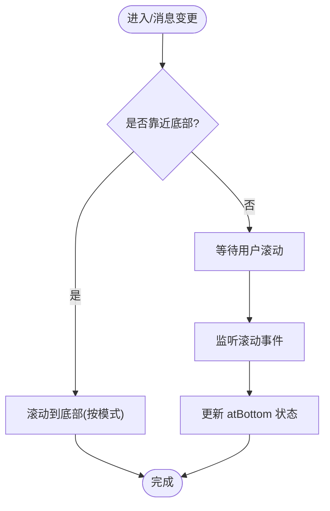

**图表来源**
- [MessageList.tsx:22-52](file://webui/src/components/MessageList.tsx#L22-L52)
- [MessageList.tsx:92-107](file://webui/src/components/MessageList.tsx#L92-L107)

**章节来源**
- [MessageList.tsx:22-110](file://webui/src/components/MessageList.tsx#L22-L110)

### 消息气泡 MessageBubble
- 功能要点
  - 用户消息：右对齐胶囊样式，支持图片预览与媒体附件。
  - 助手消息：纯 Markdown 渲染，支持复制、光标与媒体展示。
  - 追踪行：可折叠的工具调用/进度提示，支持层级 Agent 分组。
  - 媒体附件：图片灯箱、视频播放、文件图标与名称。
- 关键实现
  - 复制逻辑：Clipboard API + 状态复位定时器。
  - 灯箱：基于 Radix Dialog，预加载相邻图片，键盘导航。
  - 工具追踪：按 Agent 聚合，统计工具数量，状态指示。
- 可访问性与体验
  - 动画入场、脉冲光标、省略号与占位图提升可读性。

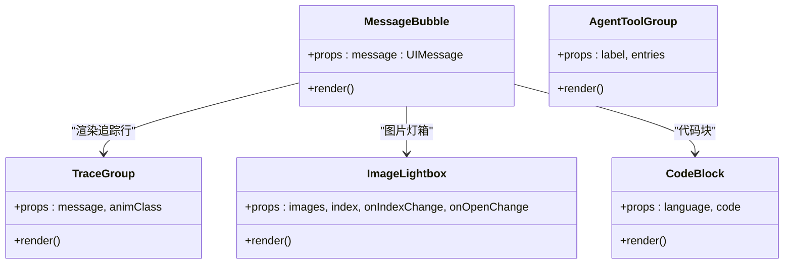

**图表来源**
- [MessageBubble.tsx:23-123](file://webui/src/components/MessageBubble.tsx#L23-L123)
- [MessageBubble.tsx:371-463](file://webui/src/components/MessageBubble.tsx#L371-L463)
- [MessageBubble.tsx:466-542](file://webui/src/components/MessageBubble.tsx#L466-L542)
- [ImageLightbox.tsx:30-200](file://webui/src/components/ImageLightbox.tsx#L30-L200)
- [CodeBlock.tsx:38-106](file://webui/src/components/CodeBlock.tsx#L38-L106)

**章节来源**
- [MessageBubble.tsx:23-584](file://webui/src/components/MessageBubble.tsx#L23-L584)
- [ImageLightbox.tsx:30-200](file://webui/src/components/ImageLightbox.tsx#L30-L200)
- [CodeBlock.tsx:38-106](file://webui/src/components/CodeBlock.tsx#L38-L106)

### 消息输入 Composer
- 功能要点
  - 自适应高度：限制最大高度，随输入增长。
  - 快捷键：Enter 发送，Shift+Enter 换行。
  - 禁用态与紧凑态：欢迎态嵌入时减少外边距。
  - 聚焦策略：挂载后延迟聚焦，保证布局稳定。
- 关键实现
  - 行数与高度计算：输入事件中重置高度并按滚动高度设置。
  - 提交流程：清理高度、恢复聚焦、清空输入。

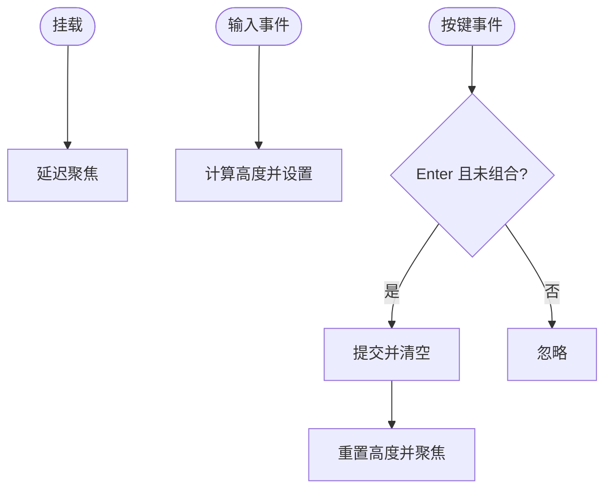

**图表来源**
- [Composer.tsx:31-38](file://webui/src/components/Composer.tsx#L31-L38)
- [Composer.tsx:61-65](file://webui/src/components/Composer.tsx#L61-L65)
- [Composer.tsx:54-59](file://webui/src/components/Composer.tsx#L54-L59)

**章节来源**
- [Composer.tsx:20-125](file://webui/src/components/Composer.tsx#L20-L125)

### 连接状态徽章 ConnectionBadge
- 功能要点
  - 实时显示连接状态（idle/connecting/open/reconnecting/closed/error）。
  - 不同状态对应不同颜色与脉冲动画。
  - 无障碍：live 区域提示状态变化。
- 关键实现
  - 状态映射表：颜色与文案。
  - 订阅客户端状态变更，响应式更新。

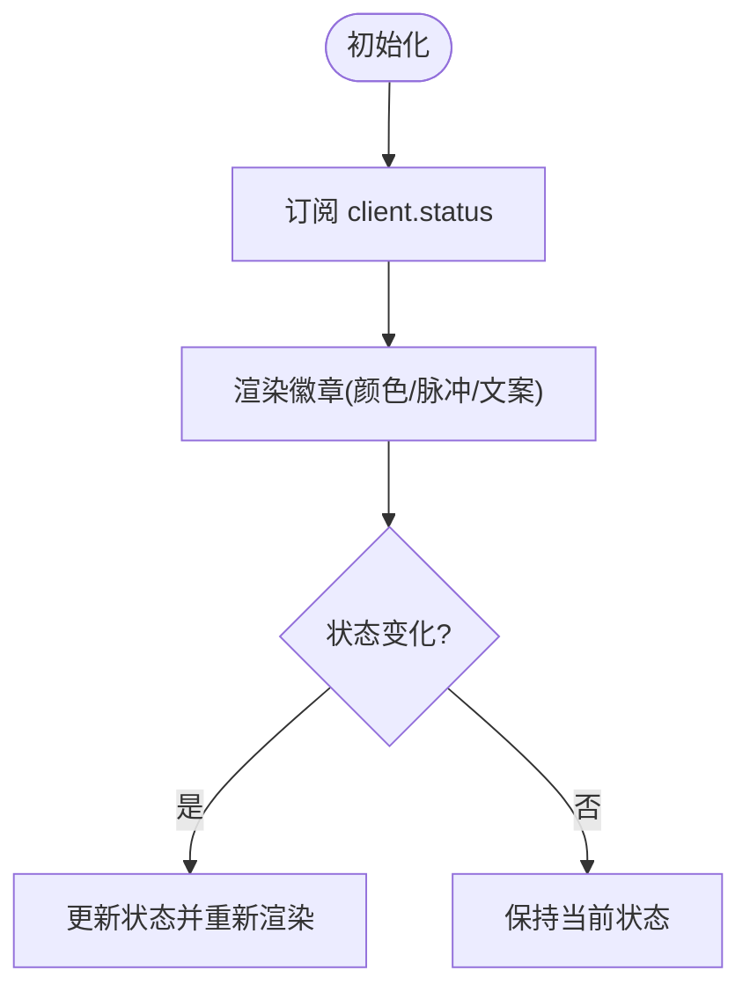

**图表来源**
- [ConnectionBadge.tsx:27-56](file://webui/src/components/ConnectionBadge.tsx#L27-L56)

**章节来源**
- [ConnectionBadge.tsx:27-57](file://webui/src/components/ConnectionBadge.tsx#L27-L57)

### 空状态 EmptyState
- 功能要点
  - 无会话时的引导卡片：图标、标题、描述与新建按钮。
- 关键实现
  - 简洁布局与语义化结构，按钮绑定新建回调。

**章节来源**
- [EmptyState.tsx:5-27](file://webui/src/components/EmptyState.tsx#L5-L27)

### 删除确认 DeleteConfirm
- 功能要点
  - 基于 AlertDialog 的确认对话框，支持取消与确认。
  - 国际化标题与描述文案。
- 关键实现
  - 打开/关闭受控，确认按钮强调色。

**章节来源**
- [DeleteConfirm.tsx:20-53](file://webui/src/components/DeleteConfirm.tsx#L20-L53)

### 图片灯箱 ImageLightbox
- 功能要点
  - 全屏图片浏览：支持左右切换、首页尾页跳转、计数显示。
  - 预加载相邻图片，保证切换流畅。
  - 键盘与触控友好：Escape、箭头键、Home/End。
- 关键实现
  - Radix Dialog 原语，自定义动画与焦点管理。
  - GPU 合成层与 will-change 提升性能。

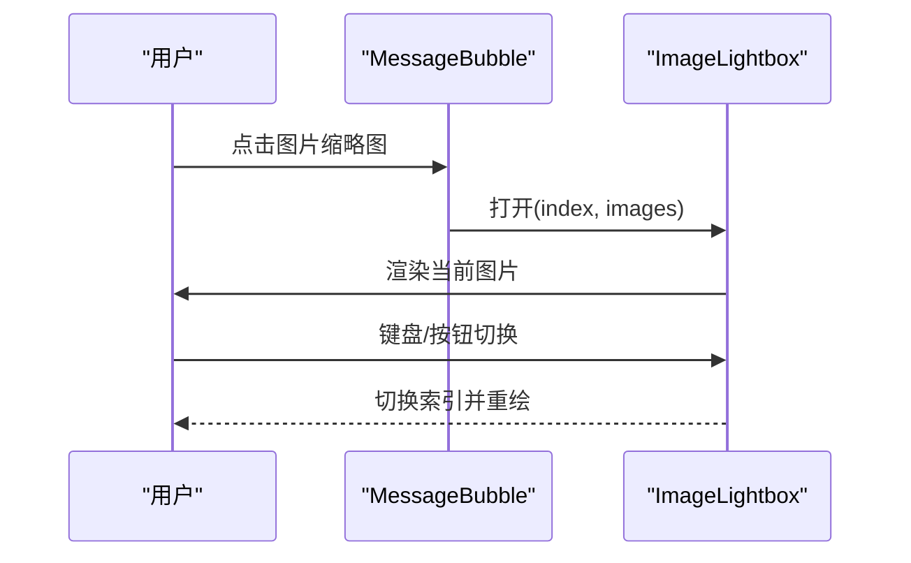

**图表来源**
- [MessageBubble.tsx:250-259](file://webui/src/components/MessageBubble.tsx#L250-L259)
- [ImageLightbox.tsx:30-173](file://webui/src/components/ImageLightbox.tsx#L30-L173)

**章节来源**
- [ImageLightbox.tsx:30-200](file://webui/src/components/ImageLightbox.tsx#L30-L200)

### 语言切换器 LanguageSwitcher
- 功能要点
  - 下拉菜单切换界面语言，显示本地化标签。
- 关键实现
  - 读取当前语言与支持列表，变更时调用 setAppLanguage。

**章节来源**
- [LanguageSwitcher.tsx:24-68](file://webui/src/components/LanguageSwitcher.tsx#L24-L68)

### 代码块 CodeBlock
- 功能要点
  - 语法高亮（暗/亮主题随系统），复制按钮与已复制反馈。
- 关键实现
  - 监听根节点 class 切换主题；复制使用 Clipboard API。

**章节来源**
- [CodeBlock.tsx:38-106](file://webui/src/components/CodeBlock.tsx#L38-L106)

## 依赖关系分析
- 组件耦合
  - ChatPane 依赖 useNanobotStream 与 useSessionHistory，形成“历史+流”的双通道。
  - MessageList 仅依赖消息数组与流状态，低耦合。
  - MessageBubble 依赖类型与媒体工具，内部聚合度高。
  - Sidebar 依赖 ChatList 与 ConnectionBadge，承担导航与状态展示。
- 外部依赖
  - 类型定义集中在 types.ts，作为跨模块契约。
  - Hooks 通过 ClientProvider 与客户端交互，解耦网络细节。

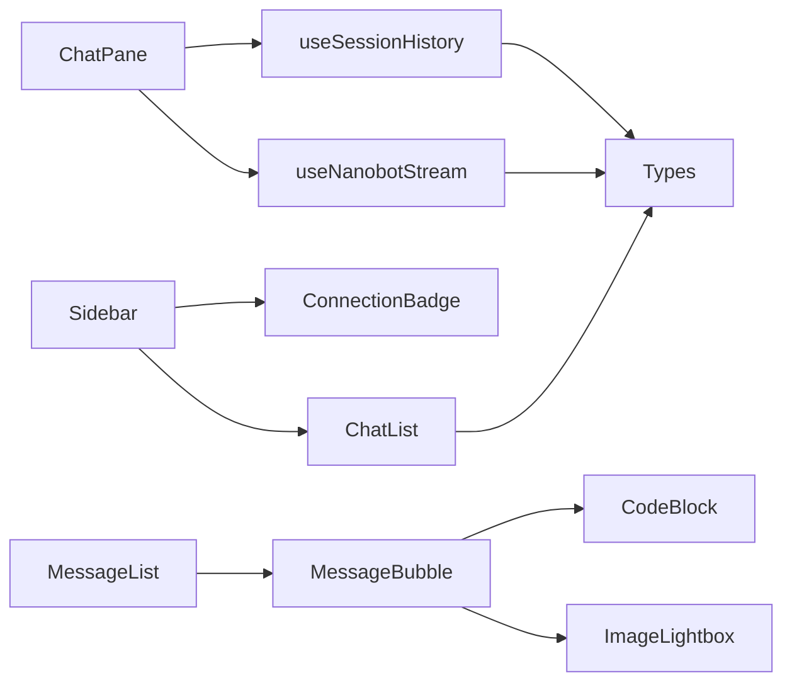

**图表来源**
- [ChatPane.tsx:23-36](file://webui/src/components/ChatPane.tsx#L23-L36)
- [useNanobotStream.ts:39-55](file://webui/src/hooks/useNanobotStream.ts#L39-L55)
- [useSessions.ts:84-105](file://webui/src/hooks/useSessions.ts#L84-L105)
- [MessageList.tsx:22-25](file://webui/src/components/MessageList.tsx#L22-L25)
- [MessageBubble.tsx:23-27](file://webui/src/components/MessageBubble.tsx#L23-L27)
- [Sidebar.tsx:26-30](file://webui/src/components/Sidebar.tsx#L26-L30)
- [types.ts:53-224](file://webui/src/lib/types.ts#L53-L224)

**章节来源**
- [types.ts:53-224](file://webui/src/lib/types.ts#L53-L224)
- [useNanobotStream.ts:39-291](file://webui/src/hooks/useNanobotStream.ts#L39-L291)
- [useSessions.ts:17-229](file://webui/src/hooks/useSessions.ts#L17-L229)

## 性能考量
- 滚动与渲染
  - MessageList 使用被动监听与阈值判断，避免频繁重排。
  - Composer 自适应高度限制最大行高，减少布局抖动。
- 流式渲染
  - useNanobotStream 使用缓冲区累积增量，减少中间态渲染次数。
  - “流结束”后短暂延时再停止指示器，避免闪烁。
- 媒体与图片
  - ImageLightbox 预加载相邻图片，Radix 动画使用 will-change 与 GPU 合成层。
  - MessageBubble 对图片缩略图懒加载与占位图，降低首屏压力。
- 主题与高亮
  - CodeBlock 主题切换监听根节点 class，避免重复计算。
- 状态与副作用
  - Hooks 内部使用 ref 缓存 token，减少闭包依赖。
  - ChatPane 首次消息发送采用 ref 与异步创建，避免竞态。

[本节为通用性能建议，不直接分析具体文件]

## 故障排查指南
- 连接状态异常
  - 现象：连接徽章持续脉冲或错误。
  - 排查：检查 ConnectionBadge 订阅与客户端状态变更；关注错误事件。
- 首次消息无法发送
  - 现象：欢迎态输入后无响应。
  - 排查：确认 onNewChat 返回 chatId；检查 booting 锁与 pendingFirstRef。
- 流式渲染卡顿
  - 现象：文本增量出现明显延迟。
  - 排查：确认 delta 事件到达顺序；检查 isStreaming 切换时机。
- 媒体附件显示异常
  - 现象：图片占位、视频不可播放或文件名缺失。
  - 排查：核对媒体类型与 URL；确认签名 URL 有效性。
- 语言切换无效
  - 现象：切换语言后未生效。
  - 排查：确认 setAppLanguage 调用与 i18n 初始化。

**章节来源**
- [ConnectionBadge.tsx:27-56](file://webui/src/components/ConnectionBadge.tsx#L27-L56)
- [ChatPane.tsx:63-76](file://webui/src/components/ChatPane.tsx#L63-L76)
- [useNanobotStream.ts:108-252](file://webui/src/hooks/useNanobotStream.ts#L108-L252)
- [MessageBubble.tsx:153-192](file://webui/src/components/MessageBubble.tsx#L153-L192)
- [LanguageSwitcher.tsx:47-48](file://webui/src/components/LanguageSwitcher.tsx#L47-L48)

## 结论
该组件体系以清晰的职责划分与稳定的类型契约为基础，结合 Hooks 抽象出流式通信、会话历史与媒体渲染等复杂场景，既保证了良好的用户体验，也兼顾了可维护性与可扩展性。通过合理的状态管理与性能优化策略，能够在多轮对话与多媒体场景下保持流畅与可靠。

## 附录
- 数据模型与事件
  - UIMessage、ChatSummary、InboundEvent、Outbound 等类型定义，确保前后端一致的交互契约。
- 媒体与附件
  - UIImage、UIMediaAttachment、OutboundMedia 等类型支撑图片预览、历史回放与签名 URL 渲染。
- 工具追踪
  - TraceEntry 与 ToolEvent 支持结构化工具调用事件，便于追踪与调试。

**章节来源**
- [types.ts:53-224](file://webui/src/lib/types.ts#L53-L224)