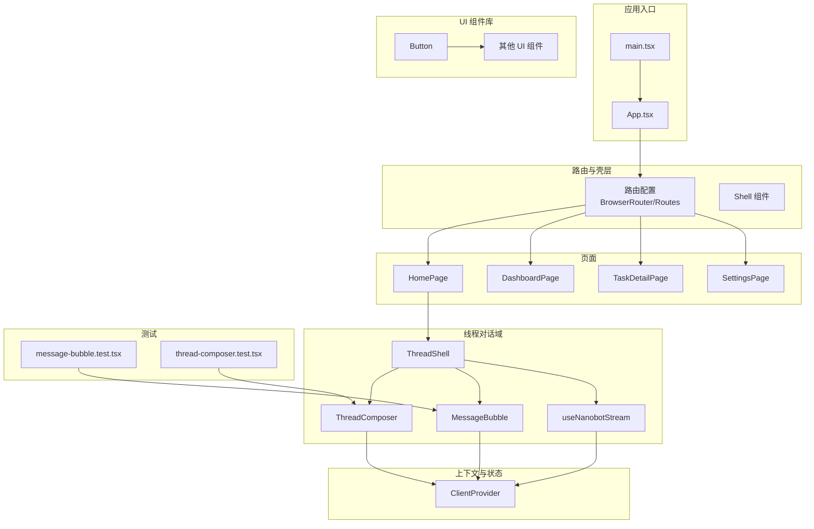
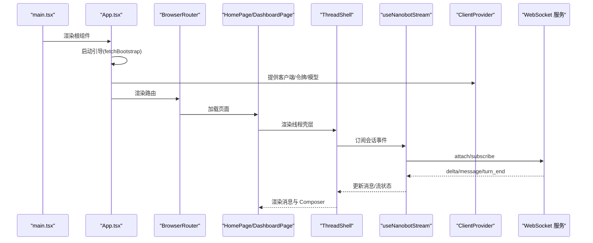
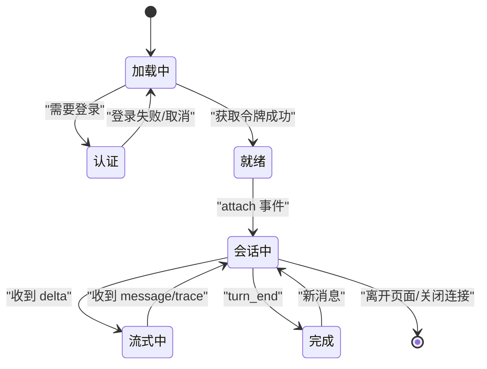
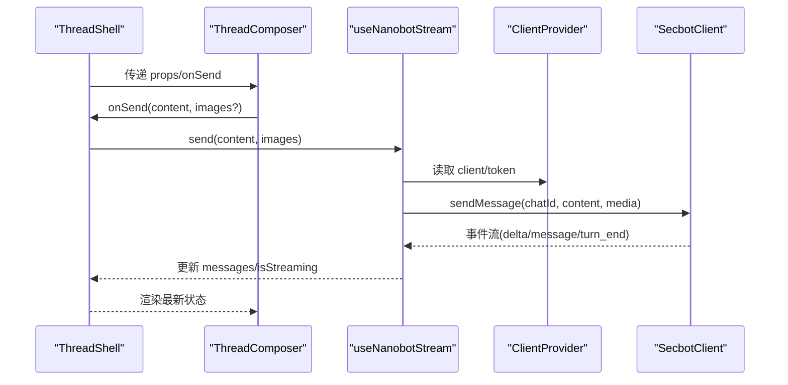
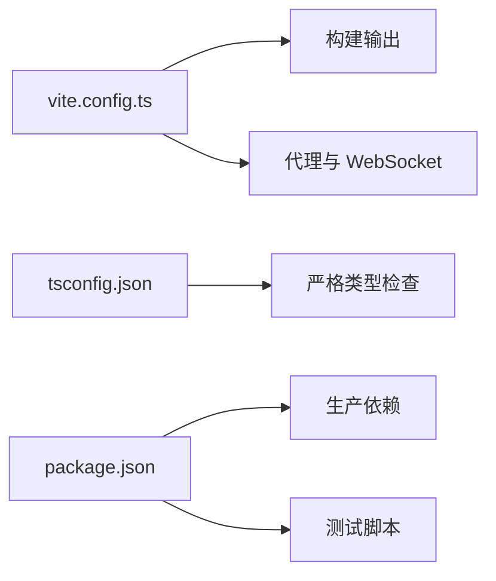

# 组件开发指南

<cite>
**本文引用的文件**
- [README.md](file://README.md)
- [App.tsx](file://webui/src/App.tsx)
- [main.tsx](file://webui/src/main.tsx)
- [package.json](file://webui/package.json)
- [tsconfig.json](file://webui/tsconfig.json)
- [vite.config.ts](file://webui/vite.config.ts)
- [ClientProvider.tsx](file://webui/src/providers/ClientProvider.tsx)
- [useNanobotStream.ts](file://webui/src/hooks/useNanobotStream.ts)
- [ThreadShell.tsx](file://webui/src/components/thread/ThreadShell.tsx)
- [button.tsx](file://webui/src/components/ui/button.tsx)
- [message-bubble.test.tsx](file://webui/src/tests/message-bubble.test.tsx)
- [thread-composer.test.tsx](file://webui/src/tests/thread-composer.test.tsx)
- [quick-start.md](file://docs/quick-start.md)
</cite>

## 目录
1. [简介](#简介)
2. [项目结构](#项目结构)
3. [核心组件](#核心组件)
4. [架构总览](#架构总览)
5. [详细组件分析](#详细组件分析)
6. [依赖分析](#依赖分析)
7. [性能考虑](#性能考虑)
8. [故障排查指南](#故障排查指南)
9. [结论](#结论)
10. [附录](#附录)

## 简介
本指南面向在本项目前端（React + TypeScript）中进行组件开发的工程师，提供从命名规范、文件组织、代码风格到生命周期管理、状态设计模式、事件处理、组件通信、测试策略、性能优化与文档编写的完整实践手册。文档结合仓库中的实际组件与测试用例，帮助团队建立一致的开发标准与最佳实践。

## 项目结构
本项目前端位于 webui 目录，采用 React + Vite + TypeScript 技术栈，组件按功能域划分在 src/components 下，页面在 src/pages，公共逻辑封装在 hooks 与 providers，测试集中在 src/tests。

**图表来源**
- [main.tsx:1-16](file://webui/src/main.tsx#L1-L16)
- [App.tsx:174-232](file://webui/src/App.tsx#L174-L232)
- [ThreadShell.tsx:54-266](file://webui/src/components/thread/ThreadShell.tsx#L54-L266)
- [useNanobotStream.ts:38-352](file://webui/src/hooks/useNanobotStream.ts#L38-L352)
- [ClientProvider.tsx:24-51](file://webui/src/providers/ClientProvider.tsx#L24-L51)
- [button.tsx:1-57](file://webui/src/components/ui/button.tsx#L1-L57)
- [message-bubble.test.tsx:1-106](file://webui/src/tests/message-bubble.test.tsx#L1-L106)
- [thread-composer.test.tsx:1-95](file://webui/src/tests/thread-composer.test.tsx#L1-L95)

**章节来源**
- [README.md:375-391](file://README.md#L375-L391)
- [package.json:1-67](file://webui/package.json#L1-L67)
- [tsconfig.json:1-33](file://webui/tsconfig.json#L1-L33)
- [vite.config.ts:1-66](file://webui/vite.config.ts#L1-L66)

## 核心组件
- 应用入口与根组件
  - 应用入口负责挂载根组件，根组件负责引导启动流程、认证与路由。
  - 参考路径：[main.tsx:11-15](file://webui/src/main.tsx#L11-L15)、[App.tsx:54-107](file://webui/src/App.tsx#L54-L107)

- 客户端上下文
  - 通过 Provider 将客户端实例、令牌、模型名称与未读数等共享给子树，避免重复订阅与重复轮询。
  - 参考路径：[ClientProvider.tsx:24-51](file://webui/src/providers/ClientProvider.tsx#L24-L51)

- 对话流钩子
  - 封装 WebSocket 事件订阅、消息缓冲、流式状态机与错误处理，暴露统一的发送与状态接口。
  - 参考路径：[useNanobotStream.ts:38-352](file://webui/src/hooks/useNanobotStream.ts#L38-L352)

- 线程壳层
  - 负责会话切换、消息缓存、快捷操作、欢迎语与 Composer 的组合，协调流式状态与历史消息。
  - 参考路径：[ThreadShell.tsx:54-266](file://webui/src/components/thread/ThreadShell.tsx#L54-L266)

- UI 组件库
  - 采用变体系统与组合子模式，提供可复用的基础 UI 组件，便于主题与样式扩展。
  - 参考路径：[button.tsx:1-57](file://webui/src/components/ui/button.tsx#L1-L57)

**章节来源**
- [App.tsx:1-233](file://webui/src/App.tsx#L1-L233)
- [ClientProvider.tsx:1-58](file://webui/src/providers/ClientProvider.tsx#L1-L58)
- [useNanobotStream.ts:1-353](file://webui/src/hooks/useNanobotStream.ts#L1-L353)
- [ThreadShell.tsx:1-267](file://webui/src/components/thread/ThreadShell.tsx#L1-L267)
- [button.tsx:1-57](file://webui/src/components/ui/button.tsx#L1-L57)

## 架构总览
前端采用“入口引导 → 路由与壳层 → 页面 → 功能域组件 → 钩子与上下文”的分层架构。组件间通过 props、Context 与事件回调进行通信；流式数据通过 WebSocket 事件驱动，配合本地状态机保证一致性。

**图表来源**
- [main.tsx:11-15](file://webui/src/main.tsx#L11-L15)
- [App.tsx:54-107](file://webui/src/App.tsx#L54-L107)
- [useNanobotStream.ts:116-314](file://webui/src/hooks/useNanobotStream.ts#L116-L314)
- [ThreadShell.tsx:68-87](file://webui/src/components/thread/ThreadShell.tsx#L68-L87)

**章节来源**
- [App.tsx:174-232](file://webui/src/App.tsx#L174-L232)
- [useNanobotStream.ts:79-114](file://webui/src/hooks/useNanobotStream.ts#L79-L114)

## 详细组件分析

### 组件命名规范与文件组织
- 命名规范
  - 组件文件使用帕斯卡命名（如 ThreadShell.tsx），导出同名函数组件。
  - UI 组件采用变体系统（如 Button），通过 props 控制外观与尺寸。
  - 页面组件以 Page 结尾（如 HomePage.tsx、DashboardPage.tsx）。
  - 钩子以 use 前缀命名（如 useNanobotStream.ts），返回状态与方法。
  - 上下文以 Provider 结尾（如 ClientProvider.tsx）。

- 文件组织
  - 功能域：src/components/thread、src/components/ui、src/components/settings 等。
  - 页面：src/pages 下按路由划分。
  - 公共逻辑：src/hooks、src/providers。
  - 测试：src/tests 下按组件或功能划分。

- 代码风格
  - TypeScript 严格模式开启，禁止未使用变量与参数。
  - 路径别名 @/* 指向 src，提升可维护性。
  - 组件导出使用 forwardRef 与 displayName，便于调试。

**章节来源**
- [button.tsx:1-57](file://webui/src/components/ui/button.tsx#L1-L57)
- [tsconfig.json:24-30](file://webui/tsconfig.json#L24-L30)
- [package.json:14-13](file://webui/package.json#L14-L13)

### 生命周期管理与状态设计模式
- App 启动阶段
  - 引导加载 → 获取令牌 → 建立客户端 → 提供上下文 → 路由渲染。
  - 错误处理区分认证失败与连接异常，分别进入登录或告警流程。
  - 参考路径：[App.tsx:54-107](file://webui/src/App.tsx#L54-L107)

- 对话流状态机
  - 通过 useNanobotStream 维护 isStreaming、消息列表、错误状态与事件订阅。
  - 事件类型包括 attached、delta、message、turn_end、session_updated、agent_event 等。
  - 参考路径：[useNanobotStream.ts:38-352](file://webui/src/hooks/useNanobotStream.ts#L38-L352)

- 线程壳层状态
  - 缓存当前会话消息、处理首次发送、合并 trace、控制 Composer 显示。
  - 参考路径：[ThreadShell.tsx:68-137](file://webui/src/components/thread/ThreadShell.tsx#L68-L137)

**图表来源**
- [useNanobotStream.ts:119-202](file://webui/src/hooks/useNanobotStream.ts#L119-L202)
- [ThreadShell.tsx:139-151](file://webui/src/components/thread/ThreadShell.tsx#L139-L151)

**章节来源**
- [App.tsx:104-124](file://webui/src/App.tsx#L104-L124)
- [useNanobotStream.ts:79-114](file://webui/src/hooks/useNanobotStream.ts#L79-L114)

### 事件处理机制与组件通信
- Props 传递
  - 线程壳层向 Composer 传递 onSend、isStreaming、placeholder、modelLabel 等。
  - 参考路径：[ThreadShell.tsx:193-238](file://webui/src/components/thread/ThreadShell.tsx#L193-L238)

- Context 共享
  - ClientProvider 向子树提供 client、token、modelName、unread 等共享状态。
  - 参考路径：[ClientProvider.tsx:24-51](file://webui/src/providers/ClientProvider.tsx#L24-L51)

- 事件总线
  - useNanobotStream 通过 client.onChat 订阅聊天事件，集中处理各类事件并更新本地状态。
  - 参考路径：[useNanobotStream.ts:305-314](file://webui/src/hooks/useNanobotStream.ts#L305-L314)

- 回调函数
  - ThreadShell 将 handleQuickAction、handleWelcomeSend 等回调向下传递，保持单向数据流。
  - 参考路径：[ThreadShell.tsx:168-191](file://webui/src/components/thread/ThreadShell.tsx#L168-L191)

**图表来源**
- [ThreadShell.tsx:193-238](file://webui/src/components/thread/ThreadShell.tsx#L193-L238)
- [useNanobotStream.ts:316-342](file://webui/src/hooks/useNanobotStream.ts#L316-L342)
- [ClientProvider.tsx:45-51](file://webui/src/providers/ClientProvider.tsx#L45-L51)

**章节来源**
- [ThreadShell.tsx:23-64](file://webui/src/components/thread/ThreadShell.tsx#L23-L64)
- [useNanobotStream.ts:54-68](file://webui/src/hooks/useNanobotStream.ts#L54-L68)

### 组件测试策略
- 单元测试
  - 使用 Vitest + @testing-library/react，测试组件渲染、交互与副作用。
  - 示例：MessageBubble 渲染用户消息、复制按钮、trace 折叠、视频媒体。
  - 示例：ThreadComposer 渲染 hero/compact 变体、快捷命令面板。
  - 参考路径：
    - [message-bubble.test.tsx:7-106](file://webui/src/tests/message-bubble.test.tsx#L7-L106)
    - [thread-composer.test.tsx:23-95](file://webui/src/tests/thread-composer.test.tsx#L23-L95)

- 集成测试
  - 通过 Vite 代理与环境变量配置，集成端到端场景（WebSocket 升级、静态资源、API 转发）。
  - 参考路径：[vite.config.ts:41-58](file://webui/vite.config.ts#L41-L58)

- 端到端测试
  - 建议在 CI 中使用 Playwright/Cypress，覆盖登录、会话创建、消息发送、流式渲染、错误恢复等场景。
  - 参考路径：[quick-start.md:53-105](file://docs/quick-start.md#L53-L105)

**章节来源**
- [message-bubble.test.tsx:1-106](file://webui/src/tests/message-bubble.test.tsx#L1-L106)
- [thread-composer.test.tsx:1-95](file://webui/src/tests/thread-composer.test.tsx#L1-L95)
- [vite.config.ts:59-66](file://webui/vite.config.ts#L59-L66)
- [quick-start.md:1-105](file://docs/quick-start.md#L1-L105)

### 组件文档编写规范与模板
- 组件文档应包含：
  - 组件用途与适用场景
  - Props 列表与类型、默认值、必填性
  - 事件回调与触发条件
  - 使用示例（以路径代替代码片段）
  - 注意事项（如 Context 限制、性能建议）

- 示例模板（以 Button 为例）：
  - 组件名称：Button
  - 用途：基础按钮，支持多种外观与尺寸
  - Props：
    - variant: 可选，支持 default、destructive、outline、secondary、ghost、link
    - size: 可选，支持 default、sm、lg、icon
    - asChild: 可选，是否以子元素渲染
    - 其他原生 button 属性
  - 使用示例：
    - [button.tsx:42-54](file://webui/src/components/ui/button.tsx#L42-L54)
  - 注意事项：
    - 使用变体系统时注意主题一致性
    - 图标按钮需设置 size 为 icon

**章节来源**
- [button.tsx:36-54](file://webui/src/components/ui/button.tsx#L36-L54)

## 依赖分析
- 构建与开发
  - Vite + React 插件，代理与 HMR 配置，构建输出至后端静态资源目录。
  - 参考路径：[vite.config.ts:10-28](file://webui/vite.config.ts#L10-L28)

- 类型与严格性
  - TypeScript 严格模式，开启 noUnusedLocals/noUnusedParameters/noFallthroughCasesInSwitch。
  - 参考路径：[tsconfig.json:17-24](file://webui/tsconfig.json#L17-L24)

- 依赖与脚本
  - 生产依赖包含 React、Radix UI、Tailwind 组件、国际化、路由、图表等。
  - 测试脚本使用 Vitest，环境为 happy-dom。
  - 参考路径：[package.json:14-66](file://webui/package.json#L14-L66)

**图表来源**
- [vite.config.ts:10-28](file://webui/vite.config.ts#L10-L28)
- [tsconfig.json:17-24](file://webui/tsconfig.json#L17-L24)
- [package.json:14-66](file://webui/package.json#L14-L66)

**章节来源**
- [vite.config.ts:1-66](file://webui/vite.config.ts#L1-L66)
- [tsconfig.json:1-33](file://webui/tsconfig.json#L1-L33)
- [package.json:1-67](file://webui/package.json#L1-L67)

## 性能考虑
- 渲染优化
  - 使用 React.memo 与 useMemo/useCallback 缓存计算与子组件，减少重渲染。
  - 参考路径：[ThreadShell.tsx:76-79](file://webui/src/components/thread/ThreadShell.tsx#L76-L79)

- 流式状态机
  - 仅在权威事件（attached、delta、message、turn_end）上更新 isStreaming，避免基于历史状态误判。
  - 参考路径：[useNanobotStream.ts:119-153](file://webui/src/hooks/useNanobotStream.ts#L119-L153)

- 资源预热
  - 在空闲时间预加载 Markdown 渲染资源，降低首屏延迟。
  - 参考路径：[App.tsx:109-124](file://webui/src/App.tsx#L109-L124)

- 代理与 HMR
  - 分离 HMR Socket 端口，避免与 WebSocket 升级冲突导致写入错误。
  - 参考路径：[vite.config.ts:37-40](file://webui/vite.config.ts#L37-L40)

**章节来源**
- [ThreadShell.tsx:105-113](file://webui/src/components/thread/ThreadShell.tsx#L105-L113)
- [useNanobotStream.ts:67-77](file://webui/src/hooks/useNanobotStream.ts#L67-L77)
- [App.tsx:118-123](file://webui/src/App.tsx#L118-L123)
- [vite.config.ts:37-40](file://webui/vite.config.ts#L37-L40)

## 故障排查指南
- 登录与认证
  - 若出现 401/403，进入登录流程；非认证类错误弹窗提示并回退到登录页。
  - 参考路径：[App.tsx:84-97](file://webui/src/App.tsx#L84-L97)

- WebSocket 连接
  - 确认代理配置仅对 WebSocket 升级生效，普通 HTTP 请求由 Vite 处理。
  - 参考路径：[vite.config.ts:44-56](file://webui/vite.config.ts#L44-L56)

- 流式渲染异常
  - 若停止按钮不显示，检查是否通过 send 触发乐观 isStreaming；关注 stream_end 与 turn_end 的时机差异。
  - 参考路径：[useNanobotStream.ts:180-202](file://webui/src/hooks/useNanobotStream.ts#L180-L202)

- 组件测试失败
  - 确保测试环境为 happy-dom，全局 setup 已加载；必要时模拟 Clipboard API。
  - 参考路径：[message-bubble.test.tsx:26-30](file://webui/src/tests/message-bubble.test.tsx#L26-L30)

**章节来源**
- [App.tsx:149-172](file://webui/src/App.tsx#L149-L172)
- [vite.config.ts:59-63](file://webui/vite.config.ts#L59-L63)
- [useNanobotStream.ts:119-153](file://webui/src/hooks/useNanobotStream.ts#L119-L153)

## 结论
本指南总结了组件开发的命名、组织、生命周期、状态与事件处理、通信方式、测试与性能优化实践。建议在团队内形成统一的组件文档模板与评审流程，持续完善测试矩阵与性能监控，确保前端体验与可维护性的平衡。

## 附录
- 快速开始与安装
  - 参考路径：[quick-start.md:53-105](file://docs/quick-start.md#L53-L105)