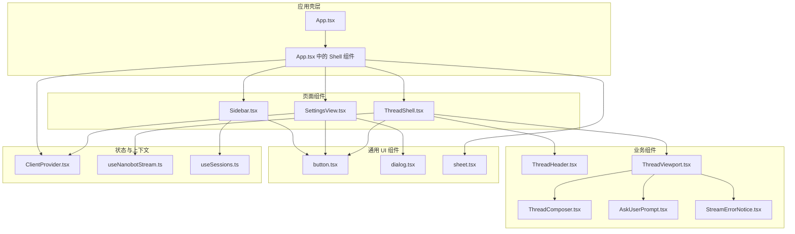
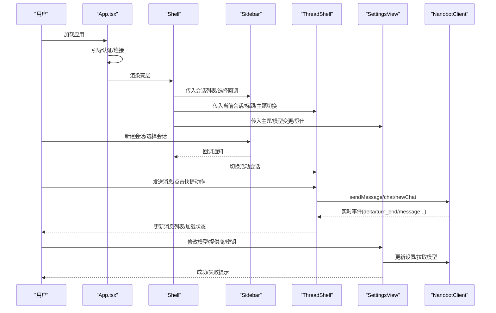
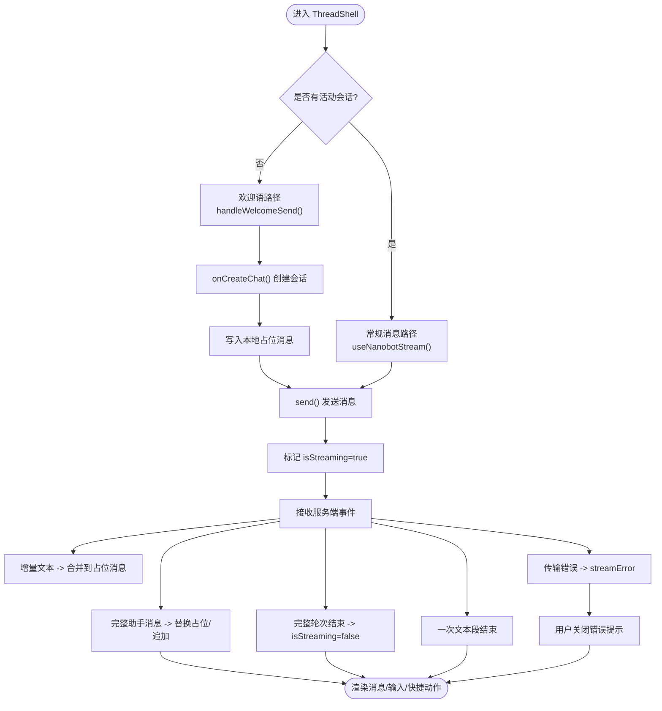
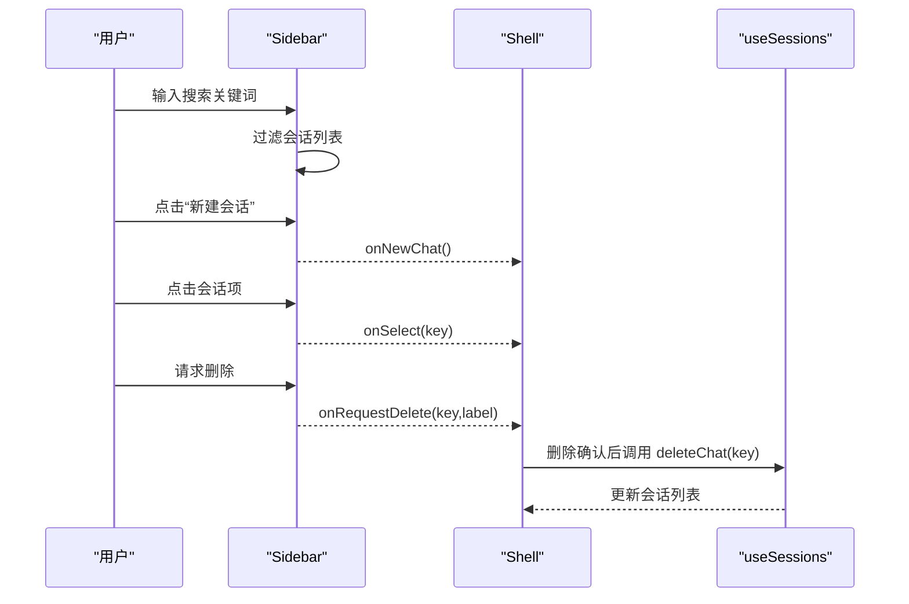
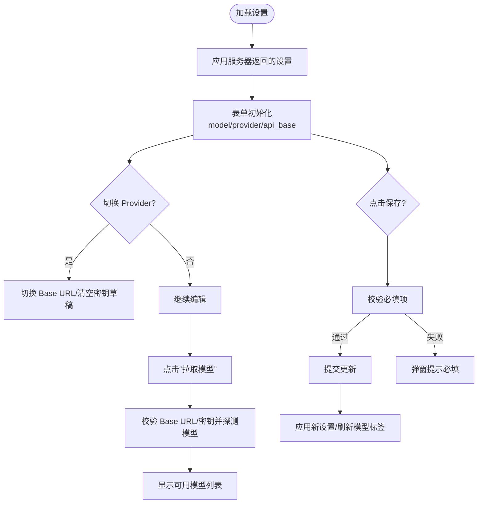
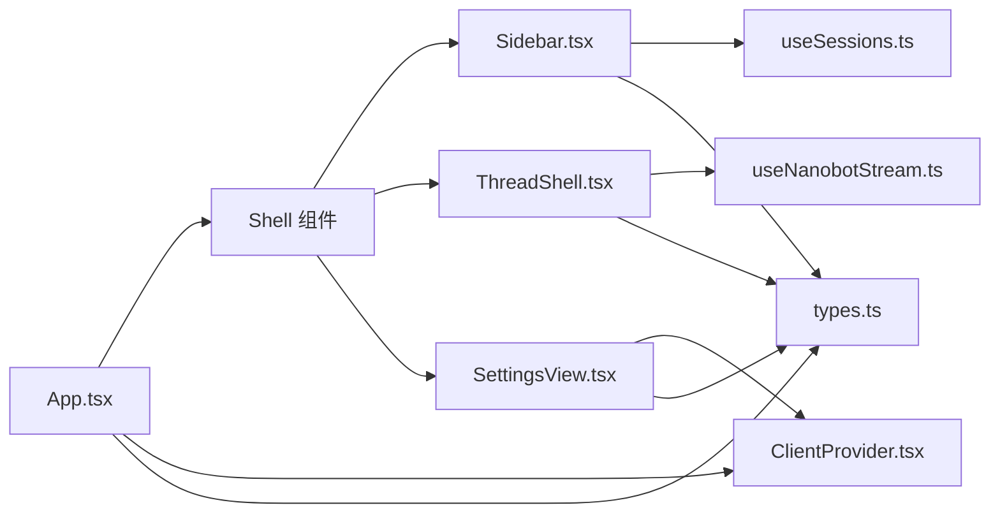

# 组件系统

<cite>
**本文档引用的文件**
- [App.tsx](file://webui/src/App.tsx)
- [ThreadShell.tsx](file://webui/src/components/thread/ThreadShell.tsx)
- [Sidebar.tsx](file://webui/src/components/Sidebar.tsx)
- [SettingsView.tsx](file://webui/src/components/settings/SettingsView.tsx)
- [button.tsx](file://webui/src/components/ui/button.tsx)
- [dialog.tsx](file://webui/src/components/ui/dialog.tsx)
- [sheet.tsx](file://webui/src/components/ui/sheet.tsx)
- [types.ts](file://webui/src/lib/types.ts)
- [ClientProvider.tsx](file://webui/src/providers/ClientProvider.tsx)
- [useNanobotStream.ts](file://webui/src/hooks/useNanobotStream.ts)
- [useSessions.ts](file://webui/src/hooks/useSessions.ts)
- [utils.ts](file://webui/src/lib/utils.ts)
- [tailwind.config.js](file://webui/tailwind.config.js)
- [package.json](file://webui/package.json)
</cite>

## 目录
1. [简介](#简介)
2. [项目结构](#项目结构)
3. [核心组件](#核心组件)
4. [架构总览](#架构总览)
5. [详细组件分析](#详细组件分析)
6. [依赖关系分析](#依赖关系分析)
7. [性能考量](#性能考量)
8. [故障排查指南](#故障排查指南)
9. [结论](#结论)
10. [附录](#附录)

## 简介
本文件系统化梳理了 WebUI 的组件系统，涵盖组件架构设计原则与分类体系（通用 UI 组件、业务组件、页面组件），重点解析核心组件（ThreadShell 聊天外壳、Sidebar 侧边栏、SettingsView 设置视图）的结构与交互，阐述组件间通信机制（props 传递、事件处理、状态共享），并提供组件开发规范、样式约定、可复用性设计建议、UI 组件库（Radix UI）集成方式、以及测试与调试策略。

## 项目结构
WebUI 采用以功能域划分的目录组织：components（通用 UI 与业务组件）、hooks（数据与状态逻辑封装）、lib（类型、工具与 API）、providers（上下文提供者）、tests（组件测试）。根组件 App.tsx 作为壳层，协调 Sidebar、ThreadShell 与 SettingsView 三类主要页面级组件，并通过 ClientProvider 提供全局客户端上下文。

图表来源
- [App.tsx:243-449](file://webui/src/App.tsx#L243-L449)
- [ThreadShell.tsx:1-302](file://webui/src/components/thread/ThreadShell.tsx#L1-L302)
- [Sidebar.tsx:1-122](file://webui/src/components/Sidebar.tsx#L1-L122)
- [SettingsView.tsx:1-608](file://webui/src/components/settings/SettingsView.tsx#L1-L608)
- [button.tsx:1-57](file://webui/src/components/ui/button.tsx#L1-L57)
- [dialog.tsx:1-117](file://webui/src/components/ui/dialog.tsx#L1-L117)
- [sheet.tsx:1-114](file://webui/src/components/ui/sheet.tsx#L1-L114)
- [ClientProvider.tsx:1-38](file://webui/src/providers/ClientProvider.tsx#L1-L38)
- [useNanobotStream.ts:1-291](file://webui/src/hooks/useNanobotStream.ts#L1-L291)
- [useSessions.ts:1-229](file://webui/src/hooks/useSessions.ts#L1-L229)

章节来源
- [App.tsx:105-241](file://webui/src/App.tsx#L105-L241)
- [package.json:1-63](file://webui/package.json#L1-L63)

## 核心组件
- ThreadShell：聊天会话外壳，负责消息流管理、欢迎语与快捷动作、错误提示、主题切换、设置入口等。通过 useNanobotStream 驱动实时消息流，结合 useSessionHistory 获取历史消息。
- Sidebar：侧边栏，展示会话列表、搜索过滤、新建会话、删除确认、连接状态徽章等；与 useSessions 协作维护会话集合。
- SettingsView：设置视图，统一管理模型、提供商、兼容端点与密钥，支持“拉取可用模型”、表单脏检查、保存与登出等。

章节来源
- [ThreadShell.tsx:56-302](file://webui/src/components/thread/ThreadShell.tsx#L56-L302)
- [Sidebar.tsx:26-122](file://webui/src/components/Sidebar.tsx#L26-L122)
- [SettingsView.tsx:21-318](file://webui/src/components/settings/SettingsView.tsx#L21-L318)

## 架构总览
组件系统遵循“页面组件 + 业务组件 + 通用 UI 组件”的分层设计，页面组件承担路由与布局职责，业务组件聚焦单一功能域，通用 UI 组件提供可复用的交互与视觉元素。状态通过 React Hooks 与 Context 共享，网络请求通过自定义 Hook 封装，类型定义集中于 lib/types.ts。

图表来源
- [App.tsx:243-449](file://webui/src/App.tsx#L243-L449)
- [ThreadShell.tsx:56-302](file://webui/src/components/thread/ThreadShell.tsx#L56-L302)
- [Sidebar.tsx:26-122](file://webui/src/components/Sidebar.tsx#L26-L122)
- [SettingsView.tsx:21-318](file://webui/src/components/settings/SettingsView.tsx#L21-L318)
- [useNanobotStream.ts:39-291](file://webui/src/hooks/useNanobotStream.ts#L39-L291)
- [useSessions.ts:17-81](file://webui/src/hooks/useSessions.ts#L17-L81)

## 详细组件分析

### ThreadShell 聊天外壳
- 职责：承载聊天头部、消息视口、消息输入与快捷动作；管理首次欢迎消息、消息缓存、流式错误提示、主题切换与设置入口。
- 关键特性：
  - 使用 useNanobotStream 管理消息流与发送；根据会话是否存在决定“欢迎语”或“常规消息”路径。
  - 通过 useSessionHistory 获取历史消息，结合内存缓存避免切会话闪烁。
  - 快捷动作区提供预设提示词，支持在无会话时自动创建新会话。
  - 流式错误通过独立 Notice 组件展示，支持手动关闭。
- 数据与状态：
  - 输入：会话信息、标题、主题模式、回调（切换侧栏、新建/创建会话、主题切换、打开设置）。
  - 输出：消息数组、是否正在流式、错误对象、消息更新器。
- 交互流程：用户发送消息 → 写入本地消息 → 触发流式标志 → 客户端推送事件 → 合并/去重占位消息 → 结束后清除流式标志。

图表来源
- [ThreadShell.tsx:56-302](file://webui/src/components/thread/ThreadShell.tsx#L56-L302)
- [useNanobotStream.ts:39-291](file://webui/src/hooks/useNanobotStream.ts#L39-L291)

章节来源
- [ThreadShell.tsx:56-302](file://webui/src/components/thread/ThreadShell.tsx#L56-L302)
- [useNanobotStream.ts:39-291](file://webui/src/hooks/useNanobotStream.ts#L39-L291)

### Sidebar 侧边栏
- 职责：展示会话列表、搜索过滤、新建会话、删除确认、连接状态徽章。
- 关键特性：
  - 搜索框对 preview、chatId、channel、key 进行小写模糊匹配。
  - 新建会话按钮触发 onNewChat；会话项点击 onSelect；删除通过 onRequestDelete 与 DeleteConfirm 对话框协作。
  - 支持桌面/移动端两种折叠态，状态持久化至 localStorage。
- 数据与状态：
  - 输入：会话数组、活动 key、加载状态、回调。
  - 输出：过滤后的会话列表、用户操作事件。

图表来源
- [Sidebar.tsx:26-122](file://webui/src/components/Sidebar.tsx#L26-L122)
- [App.tsx:328-354](file://webui/src/App.tsx#L328-L354)
- [useSessions.ts:72-78](file://webui/src/hooks/useSessions.ts#L72-L78)

章节来源
- [Sidebar.tsx:26-122](file://webui/src/components/Sidebar.tsx#L26-L122)
- [useSessions.ts:17-81](file://webui/src/hooks/useSessions.ts#L17-L81)

### SettingsView 设置视图
- 职责：统一管理 AI 模型、提供商、兼容端点与密钥；支持“拉取可用模型”、表单脏检查、保存与登出。
- 关键特性：
  - 三态 API Key：未改动（保持现有密钥）、已改动（显式输入）、隐藏占位（来自提供商配置）。
  - Provider 下拉切换即时反映 Base URL 与密钥占位，避免错误端点保存。
  - “拉取模型”基于当前 Base URL 与密钥探测可用模型，支持空结果提示。
  - 错误处理遵循项目规则：弹窗告警但不跳转错误页，保留恢复入口。
- 数据与状态：
  - 输入：主题、主题切换、回退到聊天、模型名变更、登出回调。
  - 输出：保存成功/失败、可用模型列表、表单脏值状态。

图表来源
- [SettingsView.tsx:21-318](file://webui/src/components/settings/SettingsView.tsx#L21-L318)
- [SettingsView.tsx:326-608](file://webui/src/components/settings/SettingsView.tsx#L326-L608)

章节来源
- [SettingsView.tsx:21-318](file://webui/src/components/settings/SettingsView.tsx#L21-L318)
- [SettingsView.tsx:326-608](file://webui/src/components/settings/SettingsView.tsx#L326-L608)

### 通用 UI 组件与样式体系
- Button：基于 class-variance-authority 的变体系统，支持多种尺寸与外观，适配 asChild 场景。
- Dialog：基于 Radix UI 的对话框，提供覆盖层、内容区、标题与描述等结构化组件。
- Sheet：移动端抽屉式面板，支持多方向滑入/滑出动画，适配移动端侧栏场景。
- 样式约定：Tailwind 配置集中于 tailwind.config.js，支持深色模式、主题变量、圆角与动画扩展；工具函数 utils.ts 提供 cn 合并类名与安全随机 ID 生成。

章节来源
- [button.tsx:1-57](file://webui/src/components/ui/button.tsx#L1-L57)
- [dialog.tsx:1-117](file://webui/src/components/ui/dialog.tsx#L1-L117)
- [sheet.tsx:1-114](file://webui/src/components/ui/sheet.tsx#L1-L114)
- [tailwind.config.js:1-120](file://webui/tailwind.config.js#L1-L120)
- [utils.ts:1-34](file://webui/src/lib/utils.ts#L1-L34)

## 依赖关系分析
- 组件间依赖：App.tsx 作为壳层协调 Sidebar、ThreadShell、SettingsView；ThreadShell 依赖 useNanobotStream 与 useSessionHistory；Sidebar 依赖 useSessions；SettingsView 依赖 ClientProvider 与 API 工具。
- 外部依赖：Radix UI（dialog、sheet 等）、class-variance-authority、Lucide 图标、i18n 国际化、@tanstack/react-query 等。

图表来源
- [App.tsx:243-449](file://webui/src/App.tsx#L243-L449)
- [ThreadShell.tsx:1-302](file://webui/src/components/thread/ThreadShell.tsx#L1-L302)
- [Sidebar.tsx:1-122](file://webui/src/components/Sidebar.tsx#L1-L122)
- [SettingsView.tsx:1-608](file://webui/src/components/settings/SettingsView.tsx#L1-L608)
- [useNanobotStream.ts:1-291](file://webui/src/hooks/useNanobotStream.ts#L1-L291)
- [useSessions.ts:1-229](file://webui/src/hooks/useSessions.ts#L1-L229)
- [types.ts:1-224](file://webui/src/lib/types.ts#L1-L224)
- [ClientProvider.tsx:1-38](file://webui/src/providers/ClientProvider.tsx#L1-L38)

章节来源
- [package.json:14-41](file://webui/package.json#L14-L41)

## 性能考量
- 消息缓存与懒加载：ThreadShell 在会话切换时缓存本地消息，避免重复拉取；useSessionHistory 对新 key 立即标记 loading，防止旧数据闪现。
- 流式渲染优化：useNanobotStream 使用占位消息与增量合并，减少重排；工具调用期间延迟关闭流式标志，避免闪烁。
- 会话列表优化：Sidebar 搜索采用预处理小写字符串与多字段拼接，降低渲染成本。
- 样式与资源：Tailwind 动画与主题变量按需启用，避免过度样式计算；图标与媒体资源懒加载策略已在应用层实现。

[本节为通用指导，无需列出具体文件来源]

## 故障排查指南
- 连接与认证
  - 若出现“未登录/401/403”，App.tsx 会引导输入共享密钥；保存密钥后重新引导连接。
  - 登出后清理本地存储并断开客户端连接。
- 消息流异常
  - 使用 useNanobotStream 的 streamError 字段捕获传输错误，支持 dismissStreamError 清除。
  - 若“消息过大”等错误横幅持续出现，可在 Shell 层切换会话以重置错误状态。
- 设置页问题
  - 加载失败：弹窗告警并提供“重试/登出”入口；确保令牌有效且后端可访问。
  - 保存失败：检查必填项（模型、Base URL、API Key）与网络连通性。
- 侧栏与会话
  - 新建会话后未立即出现在列表：属乐观插入，等待刷新后同步权威数据。
  - 删除会话后未回到上一个会话：Shell 会自动选择相邻会话作为回退。

章节来源
- [App.tsx:109-157](file://webui/src/App.tsx#L109-L157)
- [useNanobotStream.ts:76-106](file://webui/src/hooks/useNanobotStream.ts#L76-L106)
- [SettingsView.tsx:81-107](file://webui/src/components/settings/SettingsView.tsx#L81-L107)
- [useSessions.ts:52-78](file://webui/src/hooks/useSessions.ts#L52-L78)

## 结论
该组件系统以清晰的分层与职责划分实现了高内聚、低耦合的前端架构：页面组件负责布局与路由，业务组件聚焦领域能力，通用 UI 组件提供一致的交互体验。通过 Context 与自定义 Hook 实现状态与逻辑复用，配合 Radix UI 与 Tailwind 的组合，既保证了可维护性也兼顾了开发效率。建议在新增组件时遵循本文档的分类与通信规范，确保一致性与可扩展性。

[本节为总结性内容，无需列出具体文件来源]

## 附录

### 组件分类与设计原则
- 通用 UI 组件：仅关注视觉与交互，无业务耦合，如 Button、Dialog、Sheet。
- 业务组件：封装特定业务能力，如 ThreadHeader、ThreadViewport、AskUserPrompt。
- 页面组件：承担路由与布局，协调多个业务组件，如 ThreadShell、Sidebar、SettingsView。

### 组件通信机制
- Props 传递：父组件向子组件注入数据与回调，如 Sidebar 的 sessions、activeKey、onSelect。
- 事件处理：子组件通过回调向上游传递用户行为，如 onNewChat、onSelect、onRequestDelete。
- 状态共享：通过 ClientProvider 提供全局客户端上下文；useNanobotStream/useSessions 封装跨组件状态逻辑。

### 组件开发规范
- 类型优先：所有对外接口与状态结构在 types.ts 中定义，确保强类型约束。
- 变量与样式：使用 Tailwind 主题变量与 cn 合并类名，避免硬编码样式。
- 可复用性：通用 UI 组件尽量无副作用，支持变体与尺寸；业务组件拆分细粒度功能模块。
- 错误处理：遵循“弹窗告警不跳页”的规则，提供恢复入口与重试能力。

### UI 组件库集成
- Radix UI：Dialog、Sheet 等用于构建可访问性与动画一致的交互组件。
- Lucide：图标库提供统一的线性图标风格，便于语义表达。
- class-variance-authority：为 Button 等组件提供变体与尺寸的声明式样式组合。

### 组件测试策略与调试技巧
- 单元测试：针对 Hook（useNanobotStream、useSessions）编写独立测试，模拟事件流与异步状态。
- 组件测试：使用 Testing Library 对关键交互进行快照与行为验证（如 ThreadShell、Sidebar、SettingsView）。
- 调试技巧：利用浏览器 React DevTools 查看组件树与状态；在 useNanobotStream 中打印事件日志定位流式问题；在 SettingsView 中断言表单必填与保存流程。

章节来源
- [types.ts:1-224](file://webui/src/lib/types.ts#L1-L224)
- [tailwind.config.js:1-120](file://webui/tailwind.config.js#L1-L120)
- [package.json:14-41](file://webui/package.json#L14-L41)