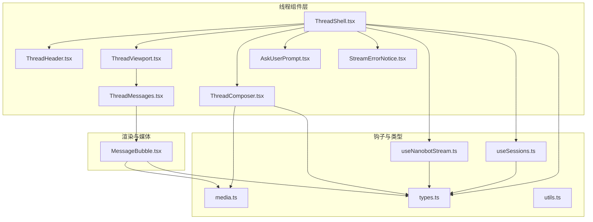
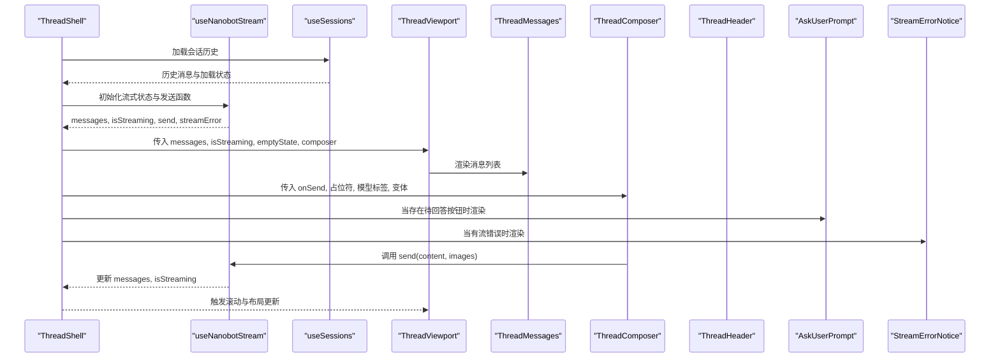
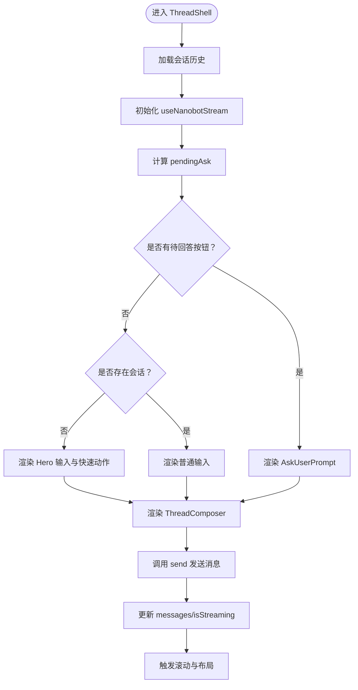
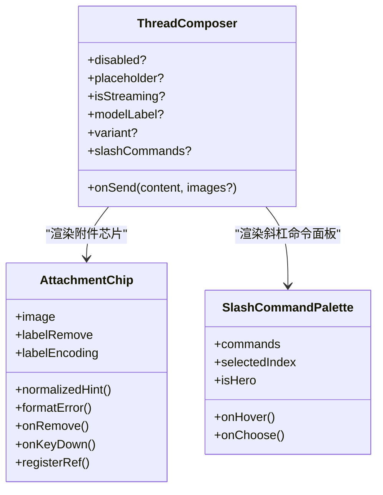
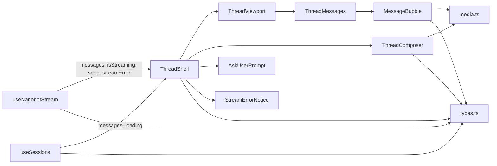

# 聊天线程组件

<cite>
**本文档引用的文件**
- [ThreadShell.tsx](file://webui/src/components/thread/ThreadShell.tsx)
- [ThreadHeader.tsx](file://webui/src/components/thread/ThreadHeader.tsx)
- [ThreadViewport.tsx](file://webui/src/components/thread/ThreadViewport.tsx)
- [ThreadMessages.tsx](file://webui/src/components/thread/ThreadMessages.tsx)
- [ThreadComposer.tsx](file://webui/src/components/thread/ThreadComposer.tsx)
- [AskUserPrompt.tsx](file://webui/src/components/thread/AskUserPrompt.tsx)
- [StreamErrorNotice.tsx](file://webui/src/components/thread/StreamErrorNotice.tsx)
- [useNanobotStream.ts](file://webui/src/hooks/useNanobotStream.ts)
- [useSessions.ts](file://webui/src/hooks/useSessions.ts)
- [types.ts](file://webui/src/lib/types.ts)
- [MessageBubble.tsx](file://webui/src/components/MessageBubble.tsx)
- [media.ts](file://webui/src/lib/media.ts)
- [utils.ts](file://webui/src/lib/utils.ts)
- [common.json](file://webui/src/i18n/locales/zh-CN/common.json)
</cite>

## 目录
1. [简介](#简介)
2. [项目结构](#项目结构)
3. [核心组件](#核心组件)
4. [架构总览](#架构总览)
5. [详细组件分析](#详细组件分析)
6. [依赖关系分析](#依赖关系分析)
7. [性能考虑](#性能考虑)
8. [故障排除指南](#故障排除指南)
9. [结论](#结论)
10. [附录](#附录)

## 简介
本文件系统性阐述聊天线程组件的设计与实现，重点解析 ThreadShell 作为主容器的架构，以及 ThreadHeader、ThreadViewport、ThreadMessages、ThreadComposer 等子组件如何协同工作。同时深入说明 AskUserPrompt 用户提示组件与 StreamErrorNotice 流错误通知组件的功能实现，解释组件间的状态传递、事件冒泡与数据流向，并提供响应式设计与用户体验优化方案，最后给出可定制性配置与扩展开发指南。

## 项目结构
聊天线程相关组件位于 webui/src/components/thread 目录，配合 hooks/useNanobotStream.ts 与 hooks/useSessions.ts 提供流式状态管理与会话历史加载能力；类型定义位于 lib/types.ts，媒体处理逻辑在 lib/media.ts，通用工具函数在 lib/utils.ts；国际化文案位于 i18n/locales/zh-CN/common.json。

**图表来源**
- [ThreadShell.tsx:1-302](file://webui/src/components/thread/ThreadShell.tsx#L1-L302)
- [ThreadViewport.tsx:1-119](file://webui/src/components/thread/ThreadViewport.tsx#L1-L119)
- [ThreadMessages.tsx:1-17](file://webui/src/components/thread/ThreadMessages.tsx#L1-L17)
- [ThreadComposer.tsx:1-682](file://webui/src/components/thread/ThreadComposer.tsx#L1-L682)
- [AskUserPrompt.tsx:1-109](file://webui/src/components/thread/AskUserPrompt.tsx#L1-L109)
- [StreamErrorNotice.tsx:1-73](file://webui/src/components/thread/StreamErrorNotice.tsx#L1-L73)
- [useNanobotStream.ts:1-291](file://webui/src/hooks/useNanobotStream.ts#L1-L291)
- [useSessions.ts:1-229](file://webui/src/hooks/useSessions.ts#L1-L229)
- [types.ts:1-224](file://webui/src/lib/types.ts#L1-L224)
- [MessageBubble.tsx:1-584](file://webui/src/components/MessageBubble.tsx#L1-L584)
- [media.ts:1-60](file://webui/src/lib/media.ts#L1-L60)
- [utils.ts:1-34](file://webui/src/lib/utils.ts#L1-L34)

**章节来源**
- [ThreadShell.tsx:1-302](file://webui/src/components/thread/ThreadShell.tsx#L1-L302)
- [ThreadViewport.tsx:1-119](file://webui/src/components/thread/ThreadViewport.tsx#L1-L119)
- [ThreadMessages.tsx:1-17](file://webui/src/components/thread/ThreadMessages.tsx#L1-L17)
- [ThreadComposer.tsx:1-682](file://webui/src/components/thread/ThreadComposer.tsx#L1-L682)
- [AskUserPrompt.tsx:1-109](file://webui/src/components/thread/AskUserPrompt.tsx#L1-L109)
- [StreamErrorNotice.tsx:1-73](file://webui/src/components/thread/StreamErrorNotice.tsx#L1-L73)
- [useNanobotStream.ts:1-291](file://webui/src/hooks/useNanobotStream.ts#L1-L291)
- [useSessions.ts:1-229](file://webui/src/hooks/useSessions.ts#L1-L229)
- [types.ts:1-224](file://webui/src/lib/types.ts#L1-L224)
- [MessageBubble.tsx:1-584](file://webui/src/components/MessageBubble.tsx#L1-L584)
- [media.ts:1-60](file://webui/src/lib/media.ts#L1-L60)
- [utils.ts:1-34](file://webui/src/lib/utils.ts#L1-L34)

## 核心组件
- ThreadShell：主容器，负责聚合头部、视口、消息列表、输入组件与提示/错误组件，协调欢迎态、快速动作、引导消息等交互。
- ThreadHeader：顶部标题栏与控制按钮，支持主题切换、设置入口与侧边栏开关。
- ThreadViewport：滚动视口，管理消息区域与输入区域的布局、滚动行为与“回到底部”提示。
- ThreadMessages：消息列表容器，遍历并渲染每个 UIMessage。
- ThreadComposer：消息输入与附件上传组件，支持多图附件、斜杠命令、粘贴拖拽、占位符与发送控制。
- AskUserPrompt：当后端返回待回答的按钮选项时，提供快速选择与自定义输入。
- StreamErrorNotice：展示流式传输错误的横幅通知，支持可访问性与可关闭。

**章节来源**
- [ThreadShell.tsx:56-302](file://webui/src/components/thread/ThreadShell.tsx#L56-L302)
- [ThreadHeader.tsx:17-119](file://webui/src/components/thread/ThreadHeader.tsx#L17-L119)
- [ThreadViewport.tsx:19-119](file://webui/src/components/thread/ThreadViewport.tsx#L19-L119)
- [ThreadMessages.tsx:8-17](file://webui/src/components/thread/ThreadMessages.tsx#L8-L17)
- [ThreadComposer.tsx:76-682](file://webui/src/components/thread/ThreadComposer.tsx#L76-L682)
- [AskUserPrompt.tsx:13-109](file://webui/src/components/thread/AskUserPrompt.tsx#L13-L109)
- [StreamErrorNotice.tsx:19-73](file://webui/src/components/thread/StreamErrorNotice.tsx#L19-L73)

## 架构总览
ThreadShell 将多个子组件组合为一个完整的聊天界面。它通过 useNanobotStream 获取消息流与发送函数，通过 useSessions 加载会话历史，再将状态与回调传递给各子组件。ThreadViewport 负责滚动与布局，ThreadMessages 负责渲染，ThreadComposer 负责输入与附件，AskUserPrompt 与 StreamErrorNotice 分别处理用户选择与错误提示。

**图表来源**
- [ThreadShell.tsx:70-298](file://webui/src/components/thread/ThreadShell.tsx#L70-L298)
- [useNanobotStream.ts:39-290](file://webui/src/hooks/useNanobotStream.ts#L39-L290)
- [useSessions.ts:84-217](file://webui/src/hooks/useSessions.ts#L84-L217)
- [ThreadViewport.tsx:19-119](file://webui/src/components/thread/ThreadViewport.tsx#L19-L119)
- [ThreadMessages.tsx:8-17](file://webui/src/components/thread/ThreadMessages.tsx#L8-L17)
- [ThreadComposer.tsx:76-490](file://webui/src/components/thread/ThreadComposer.tsx#L76-L490)
- [AskUserPrompt.tsx:13-109](file://webui/src/components/thread/AskUserPrompt.tsx#L13-L109)
- [StreamErrorNotice.tsx:19-73](file://webui/src/components/thread/StreamErrorNotice.tsx#L19-L73)

## 详细组件分析

### ThreadShell 主容器
- 职责：聚合头部、视口、消息列表、输入组件；处理欢迎态、快速动作、引导消息；维护消息缓存与会话切换状态。
- 关键点：
  - 使用 useSessionHistory 获取历史消息与加载状态。
  - 使用 useNanobotStream 获取 messages、isStreaming、send、streamError。
  - 计算 pendingAsk 并决定是否渲染 AskUserPrompt。
  - 在无会话时渲染 Hero 组件与快速动作；有会话时渲染普通输入。
  - 通过 useRef 维护消息缓存，避免切换会话时丢失本地未持久化消息。
  - 处理首次发送的欢迎消息与新会话创建流程。

**图表来源**
- [ThreadShell.tsx:70-298](file://webui/src/components/thread/ThreadShell.tsx#L70-L298)
- [useNanobotStream.ts:39-290](file://webui/src/hooks/useNanobotStream.ts#L39-L290)
- [useSessions.ts:84-217](file://webui/src/hooks/useSessions.ts#L84-L217)

**章节来源**
- [ThreadShell.tsx:56-302](file://webui/src/components/thread/ThreadShell.tsx#L56-L302)
- [useNanobotStream.ts:39-290](file://webui/src/hooks/useNanobotStream.ts#L39-L290)
- [useSessions.ts:84-217](file://webui/src/hooks/useSessions.ts#L84-L217)

### ThreadHeader 头部信息
- 职责：显示标题、侧边栏开关、主题切换、设置入口；支持最小化模式用于欢迎态。
- 特性：根据 hideSidebarToggleOnDesktop 控制桌面端侧边栏按钮可见性；根据 minimal 决定是否显示完整头部。

**章节来源**
- [ThreadHeader.tsx:17-119](file://webui/src/components/thread/ThreadHeader.tsx#L17-L119)

### ThreadViewport 视口区域
- 职责：提供滚动容器与“回到底部”按钮；根据是否有消息决定渲染消息区或空态与输入区。
- 特性：监听滚动距离 near-bottom，自动显示/隐藏回到底部按钮；平滑滚动至底部；提供渐变遮罩增强视觉层次。

**章节来源**
- [ThreadViewport.tsx:19-119](file://webui/src/components/thread/ThreadViewport.tsx#L19-L119)

### ThreadMessages 消息列表
- 职责：遍历 UIMessage 数组并渲染为 MessageBubble。
- 特性：保持简单职责，将复杂渲染交给 MessageBubble。

**章节来源**
- [ThreadMessages.tsx:8-17](file://webui/src/components/thread/ThreadMessages.tsx#L8-L17)

### ThreadComposer 消息输入组件
- 职责：文本输入、附件上传、斜杠命令、快捷键与粘贴拖拽；生成发送 payload。
- 关键点：
  - 支持多图附件，限制数量与格式，编码为 data URL 以实现乐观预览。
  - 斜杠命令过滤与高亮选择，支持键盘导航与回填。
  - 文本域自适应高度，支持 Enter 发送、Shift+Enter 换行。
  - 根据 isStreaming 切换占位符与发送按钮状态。

**图表来源**
- [ThreadComposer.tsx:76-682](file://webui/src/components/thread/ThreadComposer.tsx#L76-L682)

**章节来源**
- [ThreadComposer.tsx:76-682](file://webui/src/components/thread/ThreadComposer.tsx#L76-L682)
- [media.ts:37-58](file://webui/src/lib/media.ts#L37-L58)

### AskUserPrompt 用户提示
- 职责：当后端返回按钮选项时，提供快速选择与自定义输入；支持键盘回车提交。
- 特性：展开/收起“其他”输入框；聚焦输入框；禁用无效提交。

**章节来源**
- [AskUserPrompt.tsx:13-109](file://webui/src/components/thread/AskUserPrompt.tsx#L13-L109)

### StreamErrorNotice 流错误通知
- 职责：展示流式传输错误横幅，支持可访问性与可关闭。
- 特性：根据错误类型解析文案；提供关闭回调；使用动画入场。

**章节来源**
- [StreamErrorNotice.tsx:19-73](file://webui/src/components/thread/StreamErrorNotice.tsx#L19-L73)

## 依赖关系分析
- 组件耦合：
  - ThreadShell 与 useNanobotStream、useSessions 高度耦合，负责状态聚合与传递。
  - ThreadViewport 仅依赖传入的消息与 composer，低耦合。
  - ThreadComposer 依赖附件与斜杠命令能力，内部逻辑较复杂但对外接口清晰。
- 数据流：
  - 从 useNanobotStream 推导出 messages、isStreaming、send、streamError。
  - 从 useSessions 推导出历史消息与加载状态。
  - ThreadComposer 通过 send 将用户输入与附件推送到客户端，客户端再通过 WebSocket 推送至服务端。
- 错误处理：
  - useNanobotStream 监听客户端错误并暴露 dismissStreamError。
  - ThreadShell 将错误传递给 StreamErrorNotice 渲染。

**图表来源**
- [useNanobotStream.ts:39-290](file://webui/src/hooks/useNanobotStream.ts#L39-L290)
- [useSessions.ts:84-217](file://webui/src/hooks/useSessions.ts#L84-L217)
- [ThreadShell.tsx:70-298](file://webui/src/components/thread/ThreadShell.tsx#L70-L298)
- [ThreadViewport.tsx:19-119](file://webui/src/components/thread/ThreadViewport.tsx#L19-L119)
- [ThreadMessages.tsx:8-17](file://webui/src/components/thread/ThreadMessages.tsx#L8-L17)
- [MessageBubble.tsx:1-584](file://webui/src/components/MessageBubble.tsx#L1-L584)
- [media.ts:1-60](file://webui/src/lib/media.ts#L1-L60)
- [types.ts:1-224](file://webui/src/lib/types.ts#L1-L224)

**章节来源**
- [useNanobotStream.ts:39-290](file://webui/src/hooks/useNanobotStream.ts#L39-L290)
- [useSessions.ts:84-217](file://webui/src/hooks/useSessions.ts#L84-L217)
- [ThreadShell.tsx:70-298](file://webui/src/components/thread/ThreadShell.tsx#L70-L298)
- [ThreadViewport.tsx:19-119](file://webui/src/components/thread/ThreadViewport.tsx#L19-L119)
- [ThreadMessages.tsx:8-17](file://webui/src/components/thread/ThreadMessages.tsx#L8-L17)
- [MessageBubble.tsx:1-584](file://webui/src/components/MessageBubble.tsx#L1-L584)
- [media.ts:1-60](file://webui/src/lib/media.ts#L1-L60)
- [types.ts:1-224](file://webui/src/lib/types.ts#L1-L224)

## 性能考虑
- 滚动性能：ThreadViewport 使用被动滚动监听与平滑滚动，避免频繁重排；仅在 atBottom 时自动滚动，减少不必要的滚动计算。
- 消息渲染：ThreadMessages 仅负责遍历渲染，复杂渲染逻辑下沉至 MessageBubble，降低父组件负担。
- 附件处理：ThreadComposer 对附件进行本地编码与预览，使用 data URL 保证乐观预览一致性，避免额外网络请求。
- 状态缓存：ThreadShell 使用内存 Map 缓存不同会话的消息，避免会话切换时丢失本地未持久化消息。
- 流式状态：useNanobotStream 在 turn_end 后立即停止 isStreaming，避免长时间闪烁。

[本节为通用性能讨论，无需具体文件分析]

## 故障排除指南
- 流错误通知：
  - 若出现 StreamErrorNotice，优先检查网络连接与服务端状态；点击关闭后可通过 dismissStreamError 清除。
  - 常见错误类型：消息过大等，文案由 i18n 解析。
- 输入不可用：
  - 检查 ThreadComposer 的 disabled、isStreaming、hasErrors 状态；确保 canSend 条件满足。
- 附件失败：
  - 查看附件芯片上的错误文案，确认文件类型、大小与解码是否成功。
- 滚动异常：
  - 确认 ThreadViewport 的 atBottom 计算逻辑与滚动容器尺寸；必要时手动触发 scrollToBottom。

**章节来源**
- [StreamErrorNotice.tsx:19-73](file://webui/src/components/thread/StreamErrorNotice.tsx#L19-L73)
- [ThreadComposer.tsx:139-151](file://webui/src/components/thread/ThreadComposer.tsx#L139-L151)
- [ThreadViewport.tsx:26-56](file://webui/src/components/thread/ThreadViewport.tsx#L26-L56)
- [common.json:166-173](file://webui/src/i18n/locales/zh-CN/common.json#L166-L173)

## 结论
ThreadShell 作为主容器，通过 hooks 与子组件的清晰分工，实现了从消息加载、流式渲染、输入与附件处理到用户提示与错误通知的完整闭环。组件间通过 props 与回调传递状态，遵循单向数据流，具备良好的可维护性与扩展性。建议在扩展新功能时，优先复用现有 hooks 与类型定义，保持一致的交互与可访问性标准。

[本节为总结性内容，无需具体文件分析]

## 附录

### 响应式设计与用户体验优化
- 响应式断点：组件广泛使用 Tailwind 的 sm/lg 等断点类，确保在不同屏幕尺寸下的布局与间距合理。
- 无障碍支持：按钮与输入均提供 aria-label 与 aria-live；错误横幅使用 role="alert" 与 aria-live="assertive"。
- 动画与反馈：消息入场使用淡入与滑入动画；输入按钮在可发送时提供缩放反馈；滚动提示使用透明背景与模糊效果提升可读性。
- 快速动作：Hero 模式提供六宫格快速动作，降低首次交互成本。

**章节来源**
- [ThreadShell.tsx:199-221](file://webui/src/components/thread/ThreadShell.tsx#L199-L221)
- [ThreadHeader.tsx:27-67](file://webui/src/components/thread/ThreadHeader.tsx#L27-L67)
- [ThreadViewport.tsx:96-115](file://webui/src/components/thread/ThreadViewport.tsx#L96-L115)
- [StreamErrorNotice.tsx:24-51](file://webui/src/components/thread/StreamErrorNotice.tsx#L24-L51)
- [common.json:66-176](file://webui/src/i18n/locales/zh-CN/common.json#L66-L176)

### 可定制性配置与扩展开发指南
- 主题与外观：
  - 通过 ThreadShell 的 theme 与 onToggleTheme 控制主题；各组件使用 cn 合并样式，便于覆盖默认样式。
- 会话与历史：
  - 通过 useSessions 自定义会话列表与创建/删除逻辑；useSessionHistory 控制历史加载策略。
- 流式行为：
  - 通过 useNanobotStream 的 onTurnEnd 回调扩展回合结束后的业务逻辑；可扩展错误处理与重试机制。
- 输入扩展：
  - 在 ThreadComposer 中新增斜杠命令或附件类型时，需同步更新 COMMAND_ICONS 映射与 i18n 键值。
- 类型与媒体：
  - 新增 UIMessage 字段或媒体类型时，需在 types.ts 中声明并在 media.ts 中完善推断逻辑。
- 国际化：
  - 所有文案集中在 i18n/locales/zh-CN/common.json 中，新增文案需补充对应键值与翻译。

**章节来源**
- [ThreadShell.tsx:25-37](file://webui/src/components/thread/ThreadShell.tsx#L25-L37)
- [useSessions.ts:18-81](file://webui/src/hooks/useSessions.ts#L18-L81)
- [useNanobotStream.ts:39-55](file://webui/src/hooks/useNanobotStream.ts#L39-L55)
- [ThreadComposer.tsx:60-70](file://webui/src/components/thread/ThreadComposer.tsx#L60-L70)
- [types.ts:53-71](file://webui/src/lib/types.ts#L53-L71)
- [media.ts:37-58](file://webui/src/lib/media.ts#L37-L58)
- [common.json:103-176](file://webui/src/i18n/locales/zh-CN/common.json#L103-L176)