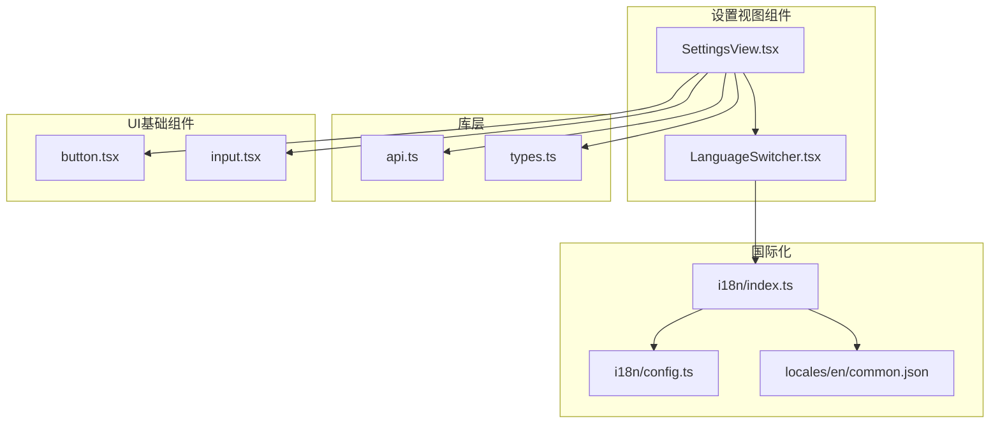
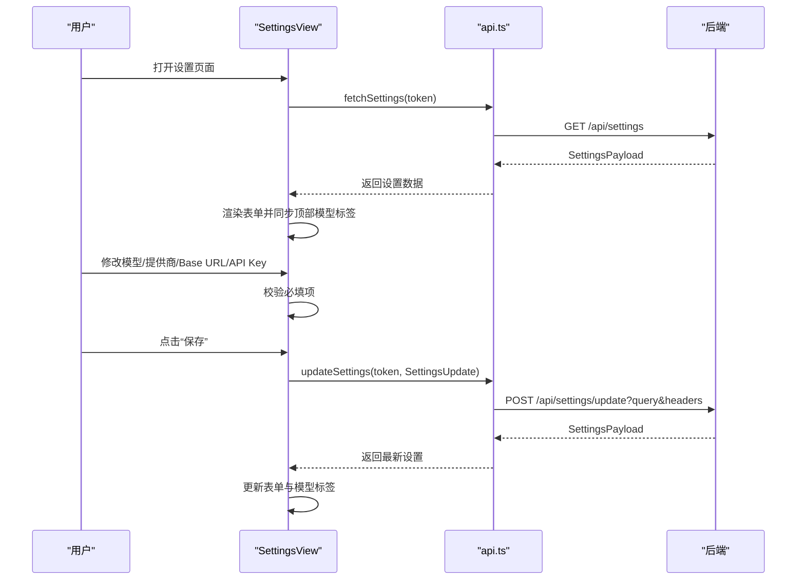
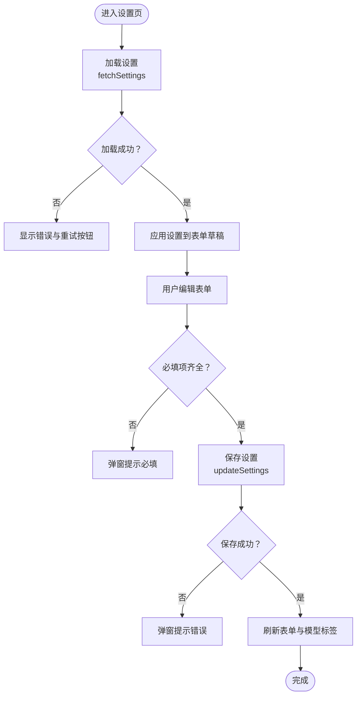
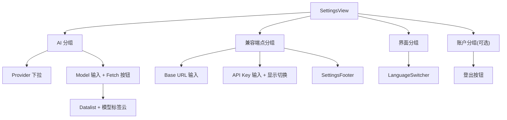
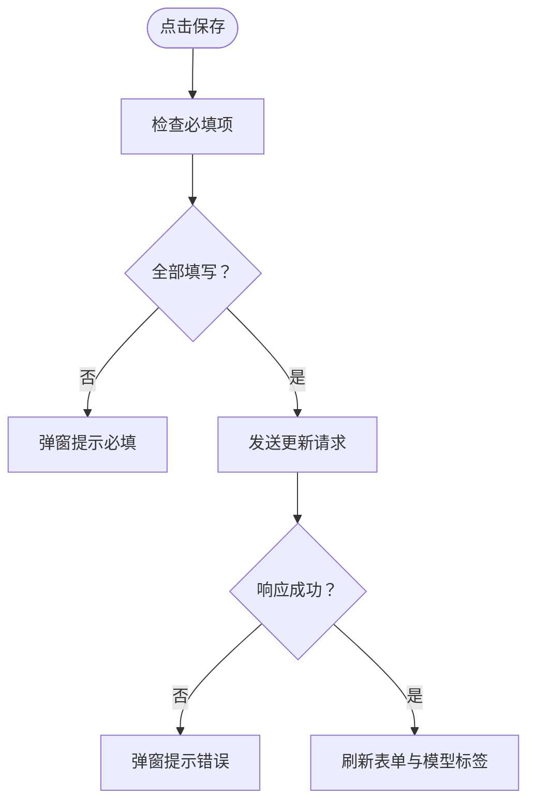
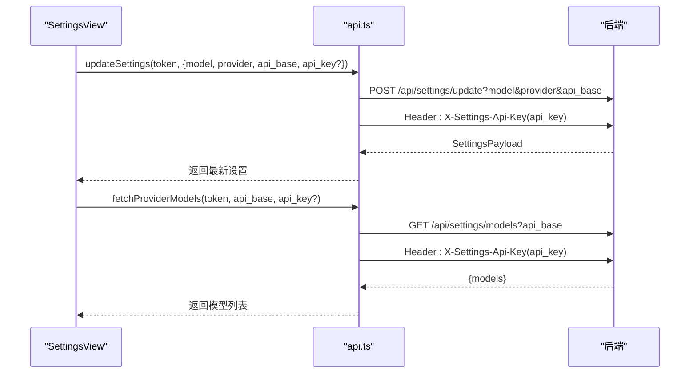
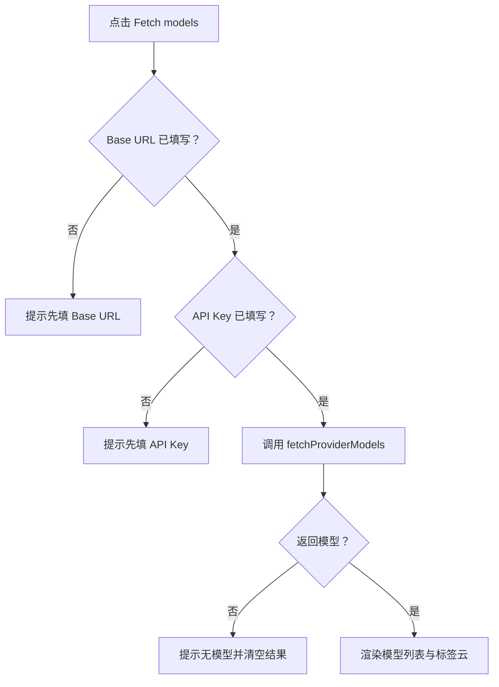
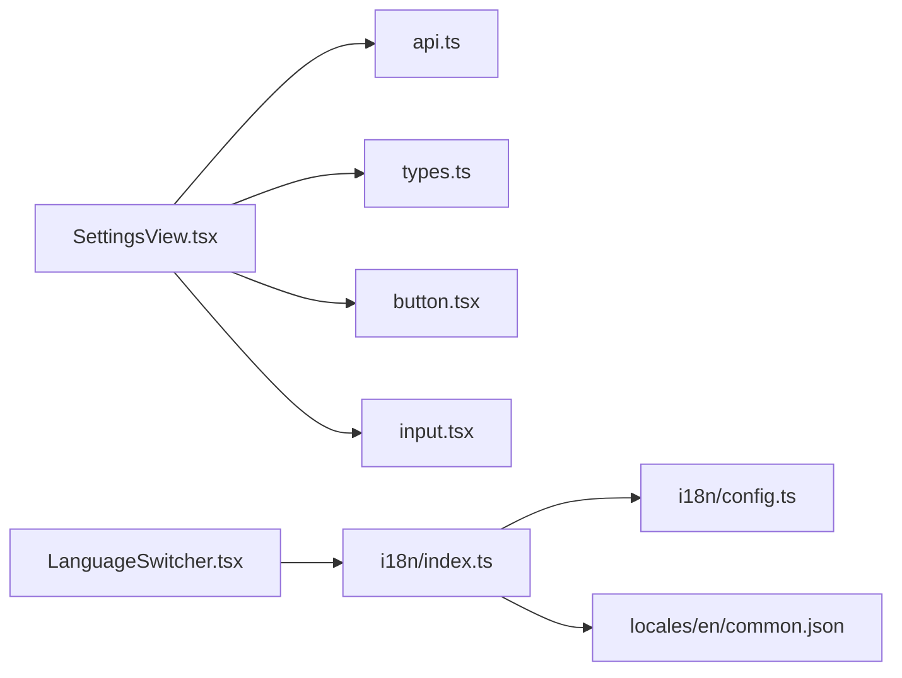

# 设置管理组件

<cite>
**本文引用的文件**
- [SettingsView.tsx](file://webui/src/components/settings/SettingsView.tsx)
- [api.ts](file://webui/src/lib/api.ts)
- [types.ts](file://webui/src/lib/types.ts)
- [index.ts](file://webui/src/i18n/index.ts)
- [config.ts](file://webui/src/i18n/config.ts)
- [LanguageSwitcher.tsx](file://webui/src/components/LanguageSwitcher.tsx)
- [common.json](file://webui/src/i18n/locales/en/common.json)
- [button.tsx](file://webui/src/components/ui/button.tsx)
- [input.tsx](file://webui/src/components/ui/input.tsx)
</cite>

## 目录
1. [简介](#简介)
2. [项目结构](#项目结构)
3. [核心组件](#核心组件)
4. [架构总览](#架构总览)
5. [详细组件分析](#详细组件分析)
6. [依赖关系分析](#依赖关系分析)
7. [性能考量](#性能考量)
8. [故障排查指南](#故障排查指南)
9. [结论](#结论)
10. [附录](#附录)

## 简介
本文件系统性解析设置管理组件，重点围绕 SettingsView 设置视图组件进行架构与实现层面的深度剖析。内容涵盖：
- 设置项的组织结构与分组展示
- 表单验证机制与必填约束
- 配置持久化策略与安全传输
- 实时模型列表获取与预览能力
- 设置组件的分类管理与权限控制
- 安全验证与敏感信息处理
- 用户体验设计原则、可访问性与国际化支持
- 扩展开发指南与自定义配置项添加方法

## 项目结构
设置管理相关代码主要位于前端 Web UI 的组件与库层：
- 组件层：SettingsView.tsx 提供设置视图与交互逻辑
- 库层：api.ts 封装设置相关的网络请求；types.ts 定义设置数据结构
- 国际化：i18n/index.ts 与 i18n/config.ts 提供多语言支持；LanguageSwitcher.tsx 提供语言切换 UI
- UI 基础组件：button.tsx、input.tsx 提供通用控件

图表来源
- [SettingsView.tsx:1-606](file://webui/src/components/settings/SettingsView.tsx#L1-L606)
- [api.ts:1-272](file://webui/src/lib/api.ts#L1-L272)
- [types.ts:103-156](file://webui/src/lib/types.ts#L103-L156)
- [index.ts:1-73](file://webui/src/i18n/index.ts#L1-L73)
- [config.ts:1-94](file://webui/src/i18n/config.ts#L1-L94)
- [LanguageSwitcher.tsx:1-68](file://webui/src/components/LanguageSwitcher.tsx#L1-L68)
- [button.tsx:1-57](file://webui/src/components/ui/button.tsx#L1-L57)
- [input.tsx:1-25](file://webui/src/components/ui/input.tsx#L1-L25)

章节来源
- [SettingsView.tsx:1-606](file://webui/src/components/settings/SettingsView.tsx#L1-L606)
- [api.ts:1-272](file://webui/src/lib/api.ts#L1-L272)
- [types.ts:103-156](file://webui/src/lib/types.ts#L103-L156)
- [index.ts:1-73](file://webui/src/i18n/index.ts#L1-L73)
- [config.ts:1-94](file://webui/src/i18n/config.ts#L1-L94)
- [LanguageSwitcher.tsx:1-68](file://webui/src/components/LanguageSwitcher.tsx#L1-L68)
- [button.tsx:1-57](file://webui/src/components/ui/button.tsx#L1-L57)
- [input.tsx:1-25](file://webui/src/components/ui/input.tsx#L1-L25)

## 核心组件
- SettingsView：设置主视图，负责加载、编辑与保存设置，提供模型列表探测、密钥显示切换、错误提示与重试等能力
- SettingsSection/SettingsGroup/SettingsRow/SettingsFooter：内部布局与交互单元，分别承担分组、行项与底部操作区
- LanguageSwitcher：语言切换 UI，基于 i18n 配置与资源
- API 层：封装设置读取、更新、模型探测与错误处理
- 类型定义：SettingsPayload、SettingsUpdate 等，统一前后端契约

章节来源
- [SettingsView.tsx:19-316](file://webui/src/components/settings/SettingsView.tsx#L19-L316)
- [SettingsView.tsx:324-544](file://webui/src/components/settings/SettingsView.tsx#L324-L544)
- [SettingsView.tsx:546-606](file://webui/src/components/settings/SettingsView.tsx#L546-L606)
- [api.ts:117-193](file://webui/src/lib/api.ts#L117-L193)
- [types.ts:103-156](file://webui/src/lib/types.ts#L103-L156)

## 架构总览
设置视图采用“组件-库-国际化-UI基础”的分层架构：
- 视图层（SettingsView）管理状态与流程控制
- 库层（api.ts）抽象网络请求与错误类型
- 类型层（types.ts）确保前后端数据契约一致
- 国际化层（i18n/index.ts + config.ts）提供本地化与语言切换
- UI 基础层（button.tsx、input.tsx）提供一致的交互体验

图表来源
- [SettingsView.tsx:79-105](file://webui/src/components/settings/SettingsView.tsx#L79-L105)
- [SettingsView.tsx:176-203](file://webui/src/components/settings/SettingsView.tsx#L176-L203)
- [api.ts:117-166](file://webui/src/lib/api.ts#L117-L166)

## 详细组件分析

### SettingsView 组件架构与数据流
- 状态管理
  - settings：服务端返回的完整设置快照
  - form：当前表单草稿（model/provider/api_base）
  - apiKeyInput/apiKeyDirty：三态 API Key 输入与脏标记
  - availableModels/fetchingModels：模型探测结果与加载状态
  - loadError/loading/saving：加载、错误与保存状态
- 数据流
  - 初始化：通过 fetchSettings 获取 SettingsPayload，并应用到表单
  - 编辑：表单字段变更触发草稿更新；仅在用户显式修改时才标记 apiKeyDirty
  - 保存：校验必填项后构造 SettingsUpdate，通过 updateSettings 持久化
  - 模型探测：调用 fetchProviderModels 获取可用模型列表，支持从已保存密钥回填
- 错误处理
  - 加载失败：弹窗提示并记录 loadError，提供重试与登出入口
  - 保存失败：弹窗提示具体错误
  - 模型探测失败：弹窗提示并清空结果

图表来源
- [SettingsView.tsx:79-105](file://webui/src/components/settings/SettingsView.tsx#L79-L105)
- [SettingsView.tsx:166-174](file://webui/src/components/settings/SettingsView.tsx#L166-L174)
- [SettingsView.tsx:176-203](file://webui/src/components/settings/SettingsView.tsx#L176-L203)

章节来源
- [SettingsView.tsx:25-77](file://webui/src/components/settings/SettingsView.tsx#L25-L77)
- [SettingsView.tsx:79-105](file://webui/src/components/settings/SettingsView.tsx#L79-L105)
- [SettingsView.tsx:166-203](file://webui/src/components/settings/SettingsView.tsx#L166-L203)

### 设置项组织结构与分组
- 分类管理
  - AI 分组：提供者、模型选择与模型探测
  - 兼容端点分组：Base URL、API Key 与密钥显示切换
  - 界面分组：语言切换
  - 账户分组：登出入口（可选）
- 行项结构
  - SettingsRow：标题 + 右侧控件区域
  - SettingsGroup：带边框与分隔线的分组容器
  - SettingsFooter：底部状态提示与保存按钮

图表来源
- [SettingsView.tsx:324-544](file://webui/src/components/settings/SettingsView.tsx#L324-L544)
- [SettingsView.tsx:546-606](file://webui/src/components/settings/SettingsView.tsx#L546-L606)

章节来源
- [SettingsView.tsx:370-544](file://webui/src/components/settings/SettingsView.tsx#L370-L544)

### 表单验证机制
- 必填项判定
  - 模型名非空
  - Base URL 非空
  - API Key：若用户已显式输入则非空；否则当前提供者已保存密钥有效
- 保存前校验
  - 若任一必填项缺失，弹窗提示并阻止保存
- 保存后反馈
  - 成功：刷新表单与模型标签
  - 失败：弹窗提示错误

图表来源
- [SettingsView.tsx:176-203](file://webui/src/components/settings/SettingsView.tsx#L176-L203)
- [SettingsView.tsx:153-164](file://webui/src/components/settings/SettingsView.tsx#L153-L164)

章节来源
- [SettingsView.tsx:153-164](file://webui/src/components/settings/SettingsView.tsx#L153-L164)
- [SettingsView.tsx:176-203](file://webui/src/components/settings/SettingsView.tsx#L176-L203)

### 配置持久化策略与安全传输
- 请求契约
  - 读取：GET /api/settings
  - 更新：POST /api/settings/update?model=&provider=&api_base=
  - 模型探测：GET /api/settings/models?api_base=
- 安全要点
  - API Key 通过请求头 X-Settings-Api-Key 传递，避免出现在 URL 或历史中
  - 未显式传入 api_key 时，后端不修改已保存密钥；传空字符串表示清除
  - 服务器不返回明文密钥，UI 以掩码形式展示并隐藏输入
- 错误类型
  - 使用 ApiError 包装 HTTP 错误，便于统一处理

图表来源
- [api.ts:145-193](file://webui/src/lib/api.ts#L145-L193)
- [types.ts:145-156](file://webui/src/lib/types.ts#L145-L156)

章节来源
- [api.ts:117-193](file://webui/src/lib/api.ts#L117-L193)
- [types.ts:103-156](file://webui/src/lib/types.ts#L103-L156)

### 实时预览与模型探测
- 模型探测流程
  - 用户点击“Fetch models”前，需先填写 Base URL 与 API Key
  - 探测接口支持复用已保存密钥或使用本次输入的密钥
  - 返回模型列表后，渲染 datalist 与标签云，支持一键填充
- 预览与交互
  - 切换提供者时自动同步 Base URL 与密钥占位
  - 密钥输入支持显示/隐藏切换，避免误泄露

图表来源
- [SettingsView.tsx:205-235](file://webui/src/components/settings/SettingsView.tsx#L205-L235)
- [api.ts:175-193](file://webui/src/lib/api.ts#L175-L193)

章节来源
- [SettingsView.tsx:205-235](file://webui/src/components/settings/SettingsView.tsx#L205-L235)
- [api.ts:175-193](file://webui/src/lib/api.ts#L175-L193)

### 权限控制与安全验证
- 认证与会话
  - 所有请求均携带 Bearer Token，未认证或会话过期将导致加载/保存失败
  - 加载失败时提供“重试”与“登出”入口，便于恢复
- 敏感信息保护
  - API Key 仅通过请求头传输，不落盘 URL
  - UI 不显示明文密钥，仅在用户显式输入时临时可见
- 会话恢复
  - 加载失败场景下，用户可选择登出重新鉴权

章节来源
- [api.ts:19-36](file://webui/src/lib/api.ts#L19-L36)
- [SettingsView.tsx:87-96](file://webui/src/components/settings/SettingsView.tsx#L87-L96)
- [SettingsView.tsx:268-272](file://webui/src/components/settings/SettingsView.tsx#L268-L272)

### 用户体验设计原则与可访问性
- 一致性
  - 使用统一的 UI 基础组件（Button、Input），保证交互与视觉一致
- 明确性
  - 必填项缺失时提供明确提示；保存状态通过底部栏反馈
- 容错性
  - 加载/保存失败弹窗提示，同时保留重试与登出选项
- 可访问性
  - 关键按钮与图标提供 aria-label
  - 输入控件禁用拼写检查与自动完成功能，减少干扰
- 语言与文化适配
  - 支持多语言切换，按浏览器与存储偏好初始化语言

章节来源
- [SettingsView.tsx:484-496](file://webui/src/components/settings/SettingsView.tsx#L484-L496)
- [SettingsView.tsx:463-464](file://webui/src/components/settings/SettingsView.tsx#L463-L464)
- [LanguageSwitcher.tsx:32-40](file://webui/src/components/LanguageSwitcher.tsx#L32-L40)
- [index.ts:45-60](file://webui/src/i18n/index.ts#L45-L60)

### 国际化支持
- 资源与配置
  - 资源文件按语言分目录存放，支持 9 种语言
  - 初始化时根据存储与浏览器语言选择初始语言，支持动态切换
- 语言切换
  - LanguageSwitcher 提供下拉菜单，支持中英文名称显示
  - 切换后同步 document.lang 并持久化到 localStorage

章节来源
- [index.ts:25-35](file://webui/src/i18n/index.ts#L25-L35)
- [config.ts:3-13](file://webui/src/i18n/config.ts#L3-L13)
- [LanguageSwitcher.tsx:42-66](file://webui/src/components/LanguageSwitcher.tsx#L42-L66)
- [common.json:46-49](file://webui/src/i18n/locales/en/common.json#L46-L49)

### 扩展开发指南与自定义配置项
- 新增设置项步骤
  - 在类型层扩展 SettingsPayload/SettingsUpdate 字段定义
  - 在 API 层新增对应 REST 端点与请求封装
  - 在 SettingsView 中新增分组与行项，绑定表单状态
  - 如涉及敏感信息，务必通过请求头传输并在 UI 中隐藏显示
- 最佳实践
  - 保持“只在显式修改时提交”的模式，避免覆盖已有配置
  - 对必填项进行前端校验并给出明确提示
  - 为新字段提供默认值与占位文案，提升易用性
  - 严格遵循安全传输规范，不将敏感信息写入 URL

章节来源
- [types.ts:103-156](file://webui/src/lib/types.ts#L103-L156)
- [api.ts:117-193](file://webui/src/lib/api.ts#L117-L193)
- [SettingsView.tsx:176-203](file://webui/src/components/settings/SettingsView.tsx#L176-L203)

## 依赖关系分析
- 组件耦合
  - SettingsView 依赖 api.ts 与 types.ts，形成清晰的数据契约
  - LanguageSwitcher 依赖 i18n 配置与资源，独立于设置业务
- 外部依赖
  - lucide-react 提供图标
  - react-i18next 提供国际化能力
  - radix-ui 与 class-variance-authority 提供 UI 变体与样式工具

图表来源
- [SettingsView.tsx:1-17](file://webui/src/components/settings/SettingsView.tsx#L1-L17)
- [api.ts:1-17](file://webui/src/lib/api.ts#L1-L17)
- [types.ts:1-10](file://webui/src/lib/types.ts#L1-L10)
- [index.ts:1-13](file://webui/src/i18n/index.ts#L1-L13)
- [config.ts:1-13](file://webui/src/i18n/config.ts#L1-L13)
- [LanguageSwitcher.tsx:1-12](file://webui/src/components/LanguageSwitcher.tsx#L1-L12)

章节来源
- [SettingsView.tsx:1-17](file://webui/src/components/settings/SettingsView.tsx#L1-L17)
- [api.ts:1-17](file://webui/src/lib/api.ts#L1-L17)
- [types.ts:1-10](file://webui/src/lib/types.ts#L1-L10)
- [index.ts:1-13](file://webui/src/i18n/index.ts#L1-L13)
- [config.ts:1-13](file://webui/src/i18n/config.ts#L1-L13)
- [LanguageSwitcher.tsx:1-12](file://webui/src/components/LanguageSwitcher.tsx#L1-L12)

## 性能考量
- 网络请求优化
  - 仅在必要时发起设置加载与模型探测请求
  - 对 Base URL 与 API Key 变更进行防抖与清理，避免陈旧结果
- UI 渲染优化
  - 使用 useMemo 与 useCallback 降低重渲染频率
  - 分组与行项组件拆分，按需渲染
- 错误与加载状态
  - 通过 loading/loadError/saving 状态位控制 UI 占位与提示，避免空白面板

## 故障排查指南
- 加载失败
  - 现象：显示“无法加载设置”，提供重试与登出按钮
  - 处理：确认网关运行与会话有效；点击重试或登出后重新登录
- 保存失败
  - 现象：弹窗提示保存失败
  - 处理：检查必填项是否完整；确认网络连通与令牌有效
- 模型探测失败
  - 现象：弹窗提示探测失败或返回空列表
  - 处理：确认 Base URL 与 API Key 正确；尝试使用已保存密钥或重新输入密钥
- 语言切换无效
  - 现象：切换语言后未生效
  - 处理：确认 i18n 初始化完成；检查 localStorage 写入与 document.lang 同步

章节来源
- [SettingsView.tsx:256-274](file://webui/src/components/settings/SettingsView.tsx#L256-L274)
- [SettingsView.tsx:198-203](file://webui/src/components/settings/SettingsView.tsx#L198-L203)
- [SettingsView.tsx:230-235](file://webui/src/components/settings/SettingsView.tsx#L230-L235)
- [index.ts:62-69](file://webui/src/i18n/index.ts#L62-L69)

## 结论
设置管理组件通过清晰的分层架构、严格的表单验证与安全传输策略，提供了稳定可靠的配置管理体验。其模块化设计便于扩展与维护，国际化与可访问性特性提升了全球用户的使用体验。建议在后续迭代中持续完善错误提示与加载状态反馈，进一步增强用户体验的一致性与可靠性。

## 附录
- API 端点一览
  - GET /api/settings：获取设置
  - POST /api/settings/update：更新设置
  - GET /api/settings/models：探测模型列表
- 关键类型
  - SettingsPayload：设置返回结构
  - SettingsUpdate：设置更新结构
- 国际化资源
  - 支持语言：英语、简体中文、繁体中文、法语、日语、韩语、西班牙语、越南语、印尼语