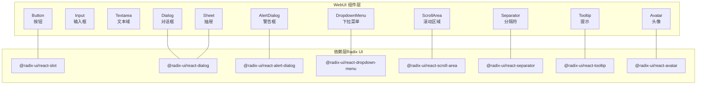
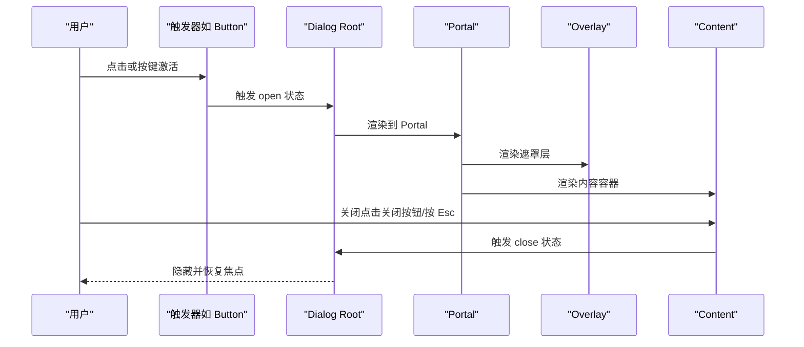
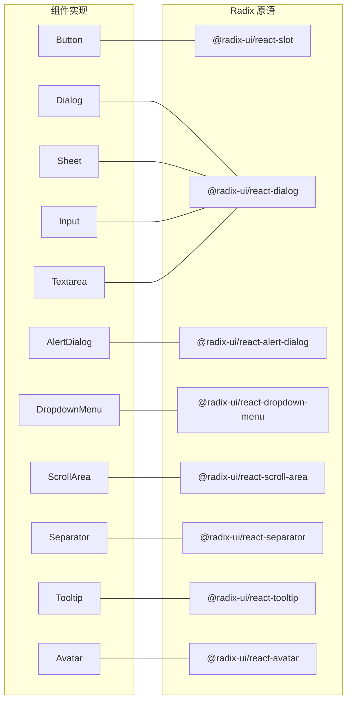

# 通用UI组件

<cite>
**本文引用的文件**
- [webui/src/components/ui/button.tsx](file://webui/src/components/ui/button.tsx)
- [webui/src/components/ui/input.tsx](file://webui/src/components/ui/input.tsx)
- [webui/src/components/ui/dialog.tsx](file://webui/src/components/ui/dialog.tsx)
- [webui/src/components/ui/alert-dialog.tsx](file://webui/src/components/ui/alert-dialog.tsx)
- [webui/src/components/ui/dropdown-menu.tsx](file://webui/src/components/ui/dropdown-menu.tsx)
- [webui/src/components/ui/textarea.tsx](file://webui/src/components/ui/textarea.tsx)
- [webui/src/components/ui/avatar.tsx](file://webui/src/components/ui/avatar.tsx)
- [webui/src/components/ui/scroll-area.tsx](file://webui/src/components/ui/scroll-area.tsx)
- [webui/src/components/ui/separator.tsx](file://webui/src/components/ui/separator.tsx)
- [webui/src/components/ui/sheet.tsx](file://webui/src/components/ui/sheet.tsx)
- [webui/src/components/ui/tooltip.tsx](file://webui/src/components/ui/tooltip.tsx)
- [webui/package.json](file://webui/package.json)
</cite>

## 目录
1. [简介](#简介)
2. [项目结构](#项目结构)
3. [核心组件](#核心组件)
4. [架构总览](#架构总览)
5. [详细组件分析](#详细组件分析)
6. [依赖分析](#依赖分析)
7. [性能考虑](#性能考虑)
8. [故障排查指南](#故障排查指南)
9. [结论](#结论)
10. [附录](#附录)

## 简介
本文件系统化梳理了基于 Radix UI 构建的通用 UI 组件库，覆盖 Button 按钮、Input 输入框、Dialog 对话框、AlertDialog 警告框、DropdownMenu 下拉菜单、Textarea 文本域、Avatar 头像、ScrollArea 滚动区域、Separator 分隔符、Sheet 抽屉、Tooltip 提示等组件。文档从设计原则、可访问性与响应式行为出发，结合属性接口、事件处理、样式定制与组合使用实践，帮助开发者在 WebUI 中高效、一致地构建用户界面。

## 项目结构
这些组件位于前端工程 webui 的组件目录中，采用按功能模块划分的组织方式，每个组件以独立文件导出，便于按需引入与复用。组件统一通过工具函数进行类名合并与样式变体管理，确保主题一致性与可扩展性。

图表来源
- [webui/src/components/ui/button.tsx:1-57](file://webui/src/components/ui/button.tsx#L1-L57)
- [webui/src/components/ui/dialog.tsx:1-117](file://webui/src/components/ui/dialog.tsx#L1-L117)
- [webui/src/components/ui/alert-dialog.tsx:1-134](file://webui/src/components/ui/alert-dialog.tsx#L1-L134)
- [webui/src/components/ui/dropdown-menu.tsx:1-178](file://webui/src/components/ui/dropdown-menu.tsx#L1-L178)
- [webui/src/components/ui/scroll-area.tsx:1-47](file://webui/src/components/ui/scroll-area.tsx#L1-L47)
- [webui/src/components/ui/separator.tsx:1-30](file://webui/src/components/ui/separator.tsx#L1-L30)
- [webui/src/components/ui/sheet.tsx:1-114](file://webui/src/components/ui/sheet.tsx#L1-L114)
- [webui/src/components/ui/tooltip.tsx:1-27](file://webui/src/components/ui/tooltip.tsx#L1-L27)
- [webui/src/components/ui/avatar.tsx:1-49](file://webui/src/components/ui/avatar.tsx#L1-L49)

章节来源
- [webui/package.json:14-41](file://webui/package.json#L14-L41)

## 核心组件
本节概述各组件的职责与共性特征：
- 设计原则：以 Radix UI 的无障碍原语为基础，保证键盘可达、焦点管理与状态动画的一致性；通过 class-variance-authority 实现变体与尺寸控制，保持风格统一。
- 可访问性：组件均遵循 ARIA 语义与键盘交互约定，提供可见与不可见的焦点指示，支持屏幕阅读器。
- 响应式行为：通过 Tailwind 类与相对单位适配不同视口；部分组件提供方向性与侧边配置，满足移动端与桌面端布局需求。
- 样式定制：统一使用 cn 工具合并类名，支持透传 className 与变体参数，便于主题与布局微调。

章节来源
- [webui/src/components/ui/button.tsx:7-34](file://webui/src/components/ui/button.tsx#L7-L34)
- [webui/src/components/ui/dialog.tsx:12-49](file://webui/src/components/ui/dialog.tsx#L12-L49)
- [webui/src/components/ui/sheet.tsx:30-57](file://webui/src/components/ui/sheet.tsx#L30-L57)
- [webui/src/components/ui/scroll-area.tsx:24-44](file://webui/src/components/ui/scroll-area.tsx#L24-L44)

## 架构总览
以下图展示组件与 Radix 原语的关系以及关键交互流程（以对话框为例）：

图表来源
- [webui/src/components/ui/dialog.tsx:7-49](file://webui/src/components/ui/dialog.tsx#L7-L49)

## 详细组件分析

### Button 按钮
- 属性接口
  - 继承原生 button 属性
  - 变体 variant：default、destructive、outline、secondary、ghost、link
  - 尺寸 size：default、sm、lg、icon
  - asChild：是否渲染为子节点（Slot）
- 事件处理
  - 支持 onClick、onKeyDown 等原生事件
  - 通过 asChild 可将 Button 包裹在 Link 或其他元素内而不改变语义
- 样式定制
  - 使用变体与尺寸生成类名，支持透传 className 进行覆盖
- 使用示例
  - 基础按钮、图标按钮、危险操作按钮、链接样式按钮
- 设计原则与可访问性
  - 默认聚焦环与禁用态透明度；支持键盘激活
- 响应式行为
  - 尺寸与内边距随 size 变化，适配移动端紧凑布局

章节来源
- [webui/src/components/ui/button.tsx:36-54](file://webui/src/components/ui/button.tsx#L36-L54)

### Input 输入框
- 属性接口
  - 继承原生 input 属性，支持 type、placeholder 等
- 事件处理
  - onChange、onFocus、onBlur 等原生事件
- 样式定制
  - 统一圆角、边框、占位符颜色与聚焦环
- 使用示例
  - 文本输入、密码输入、文件上传等
- 可访问性
  - 自动聚焦环与禁用态处理

章节来源
- [webui/src/components/ui/input.tsx:5-24](file://webui/src/components/ui/input.tsx#L5-L24)

### Dialog 对话框
- 组成部件
  - Root、Trigger、Portal、Overlay、Content、Header、Footer、Title、Description、Close
- 属性接口
  - Content 支持 className 与动画类透传
  - Header/Footer 提供对齐与间距控制
- 事件处理
  - 打开/关闭状态切换，Esc 关闭，点击遮罩可选关闭
- 样式定制
  - 内容区最大宽度、圆角、阴影与动画类
- 使用示例
  - 表单弹窗、信息展示、确认取消
- 可访问性
  - 自动聚焦到内容区，返回焦点；关闭按钮提供可读标签

章节来源
- [webui/src/components/ui/dialog.tsx:7-117](file://webui/src/components/ui/dialog.tsx#L7-L117)

### AlertDialog 警告框
- 组成部件
  - Root、Trigger、Portal、Overlay、Content、Header、Footer、Title、Description、Action、Cancel
- 属性接口
  - Action 与 Cancel 基于 Button 变体，支持 outline 取消样式
- 事件处理
  - 动作与取消回调，Esc 关闭
- 样式定制
  - 与 Dialog 相同的布局与动画策略
- 使用示例
  - 删除确认、危险操作提示

章节来源
- [webui/src/components/ui/alert-dialog.tsx:7-134](file://webui/src/components/ui/alert-dialog.tsx#L7-L134)

### DropdownMenu 下拉菜单
- 组成部件
  - Root、Trigger、Group、Portal、Sub、Content、Item、CheckboxItem、RadioItem、Label、Separator、SubTrigger、SubContent、RadioGroup
- 属性接口
  - SubTrigger 支持 inset 缩进；Item 支持 inset 与禁用态
  - SubContent 支持侧偏移
- 事件处理
  - 子菜单展开/收起、选择项变更
- 样式定制
  - 菜单最小宽度、背景、阴影与指示器图标
- 使用示例
  - 设置菜单、排序选项、分组选择

章节来源
- [webui/src/components/ui/dropdown-menu.tsx:7-178](file://webui/src/components/ui/dropdown-menu.tsx#L7-L178)

### Textarea 文本域
- 属性接口
  - 继承原生 textarea 属性
- 事件处理
  - onChange、onFocus、onBlur 等
- 样式定制
  - 统一圆角、边框、占位符与聚焦环
- 使用示例
  - 多行文本输入、评论编辑、日志输出

章节来源
- [webui/src/components/ui/textarea.tsx:5-24](file://webui/src/components/ui/textarea.tsx#L5-L24)

### Avatar 头像
- 组成部件
  - Root、Image、Fallback
- 属性接口
  - Root 控制尺寸与裁剪；Image 控制填充；Fallback 控制占位文本与背景
- 事件处理
  - 图片加载失败时显示占位
- 样式定制
  - 圆形裁剪、占位字体大小与背景色
- 使用示例
  - 用户头像、团队成员列表

章节来源
- [webui/src/components/ui/avatar.tsx:6-48](file://webui/src/components/ui/avatar.tsx#L6-L48)

### ScrollArea 滚动区域
- 组成部件
  - Root、Viewport、Corner、Scrollbar、Thumb
- 属性接口
  - Scrollbar 支持 orientation 切换垂直/水平滚动条
- 事件处理
  - 滚动事件由原语内部处理
- 样式定制
  - 滚动条宽度、边框与透明度
- 使用示例
  - 长列表、侧边栏导航、消息面板

章节来源
- [webui/src/components/ui/scroll-area.tsx:6-46](file://webui/src/components/ui/scroll-area.tsx#L6-L46)

### Separator 分隔符
- 属性接口
  - orientation：horizontal 或 vertical
  - decorative：是否作为装饰元素
- 事件处理
  - 无交互事件
- 样式定制
  - 根据方向设置高度/宽度与背景色
- 使用示例
  - 列表项分隔、表单分组分隔

章节来源
- [webui/src/components/ui/separator.tsx:6-27](file://webui/src/components/ui/separator.tsx#L6-L27)

### Sheet 抽屉
- 组成部件
  - Root、Trigger、Portal、Overlay、Content、Header、Title、Close
- 属性接口
  - Content 支持 side：top、bottom、left、right；showCloseButton 控制关闭按钮显隐
- 事件处理
  - 打开/关闭状态切换，Esc 关闭
- 样式定制
  - 侧边滑入/滑出动画、遮罩与内容区样式
- 使用示例
  - 移动端菜单、筛选面板、设置抽屉

章节来源
- [webui/src/components/ui/sheet.tsx:8-114](file://webui/src/components/ui/sheet.tsx#L8-L114)

### Tooltip 提示
- 组成部件
  - Provider、Root、Trigger、Content
- 属性接口
  - Content 支持 sideOffset 调整偏移
- 事件处理
  - 悬停/聚焦显示，失焦隐藏
- 样式定制
  - 背景色、圆角、阴影与动画类
- 使用示例
  - 操作说明、图标提示、快捷键提示

章节来源
- [webui/src/components/ui/tooltip.tsx:6-26](file://webui/src/components/ui/tooltip.tsx#L6-L26)

## 依赖分析
组件库依赖 Radix UI 原语与相关工具库，形成清晰的分层：
- 原语层：@radix-ui/react-* 提供无障碍与状态管理
- 工具层：class-variance-authority、clsx、tailwind-merge 提供变体与类名合并
- 图标与样式：lucide-react、Tailwind CSS

图表来源
- [webui/src/components/ui/button.tsx:2-3](file://webui/src/components/ui/button.tsx#L2-L3)
- [webui/src/components/ui/dialog.tsx:1-3](file://webui/src/components/ui/dialog.tsx#L1-L3)
- [webui/src/components/ui/alert-dialog.tsx:1-5](file://webui/src/components/ui/alert-dialog.tsx#L1-L5)
- [webui/src/components/ui/dropdown-menu.tsx:1-3](file://webui/src/components/ui/dropdown-menu.tsx#L1-L3)
- [webui/src/components/ui/sheet.tsx:1-4](file://webui/src/components/ui/sheet.tsx#L1-L4)
- [webui/src/components/ui/scroll-area.tsx:1-4](file://webui/src/components/ui/scroll-area.tsx#L1-L4)
- [webui/src/components/ui/tooltip.tsx:1-4](file://webui/src/components/ui/tooltip.tsx#L1-L4)
- [webui/src/components/ui/avatar.tsx:1-4](file://webui/src/components/ui/avatar.tsx#L1-L4)
- [webui/src/components/ui/separator.tsx:1-4](file://webui/src/components/ui/separator.tsx#L1-L4)
- [webui/src/components/ui/input.tsx:1-3](file://webui/src/components/ui/input.tsx#L1-L3)
- [webui/src/components/ui/textarea.tsx:1-3](file://webui/src/components/ui/textarea.tsx#L1-L3)

章节来源
- [webui/package.json:14-41](file://webui/package.json#L14-L41)

## 性能考虑
- 渲染优化
  - Portal 将内容挂载到根节点，避免层级过深导致的重排
  - 动画类仅在状态切换时生效，减少不必要的过渡
- 交互体验
  - 滚动条仅在需要时出现，降低绘制成本
  - 下拉菜单与抽屉使用最小宽度与阴影，避免过度复杂样式
- 主题与样式
  - 通过变体与尺寸集中管理样式，减少重复定义
  - 使用类名合并工具避免冗余样式叠加

## 故障排查指南
- 焦点与键盘交互
  - 若无法通过键盘打开/关闭对话框或抽屉，检查 Provider 是否正确包裹
- 动画异常
  - 若动画不生效，确认状态类 data-[state=...] 是否存在，且动画类拼写正确
- 滚动条不显示
  - 检查 ScrollArea 的子元素是否超出容器高度/宽度
- 下拉菜单错位
  - 调整 SubContent 的 sideOffset 或使用 inset 缩进
- 可访问性问题
  - 确保关闭按钮包含可读标签；对话框内容区可聚焦

章节来源
- [webui/src/components/ui/dialog.tsx:42-45](file://webui/src/components/ui/dialog.tsx#L42-L45)
- [webui/src/components/ui/sheet.tsx:82-87](file://webui/src/components/ui/sheet.tsx#L82-L87)
- [webui/src/components/ui/scroll-area.tsx:24-44](file://webui/src/components/ui/scroll-area.tsx#L24-L44)
- [webui/src/components/ui/dropdown-menu.tsx:53-65](file://webui/src/components/ui/dropdown-menu.tsx#L53-L65)

## 结论
该组件库以 Radix UI 为核心，结合变体与尺寸系统、类名合并工具与 Tailwind 样式，实现了高可访问性、可定制与跨平台一致性的 UI 基础设施。通过标准化的属性接口与组合模式，开发者可以快速搭建复杂界面并保持视觉与交互的一致性。

## 附录
- 最佳实践
  - 组合使用：对话框与抽屉配合下拉菜单实现多级交互；滚动区域用于长列表；提示用于图标与按钮增强
  - 布局模式：卡片式布局（Dialog/Sheet）、侧边抽屉（Sheet）、上下文菜单（DropdownMenu）、信息分组（Separator）
  - 主题适配：通过变体与尺寸参数快速切换主题风格；必要时透传 className 微调
- 常见问题
  - 状态同步：确保 Root 与 Trigger/Close 的状态一致
  - 可访问性：始终提供可见与不可见的焦点指示，避免仅依赖视觉提示