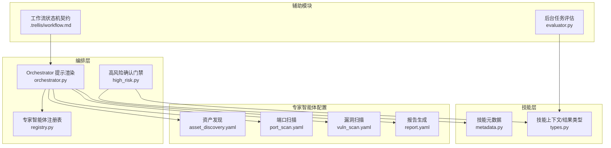
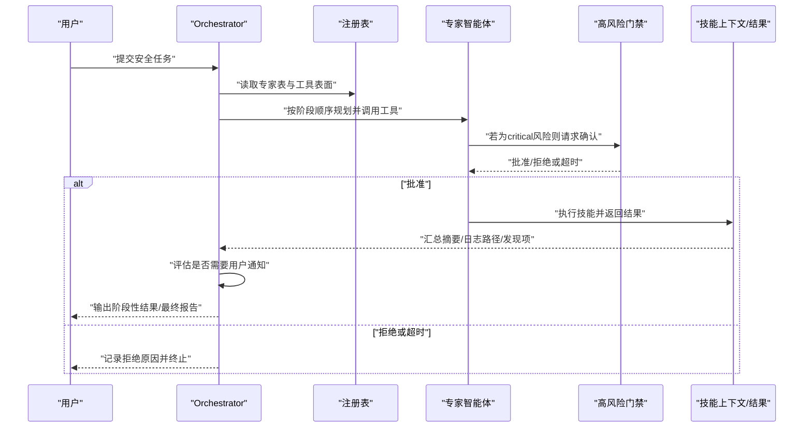
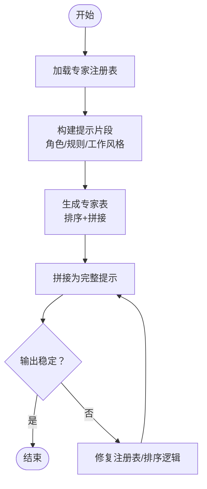
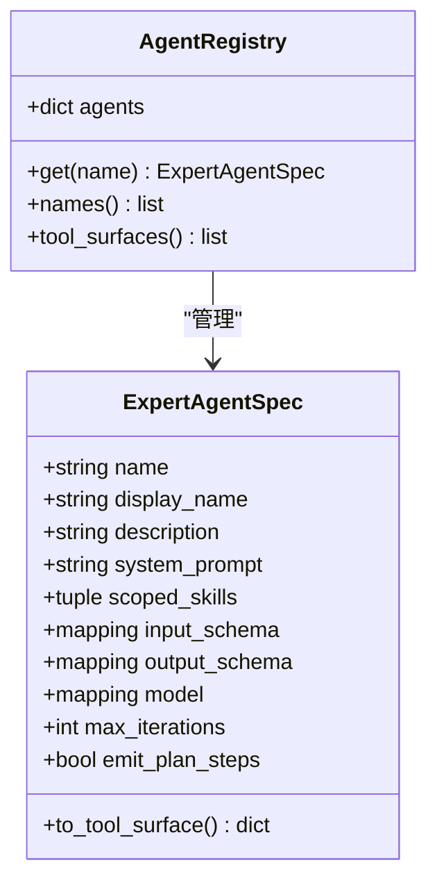
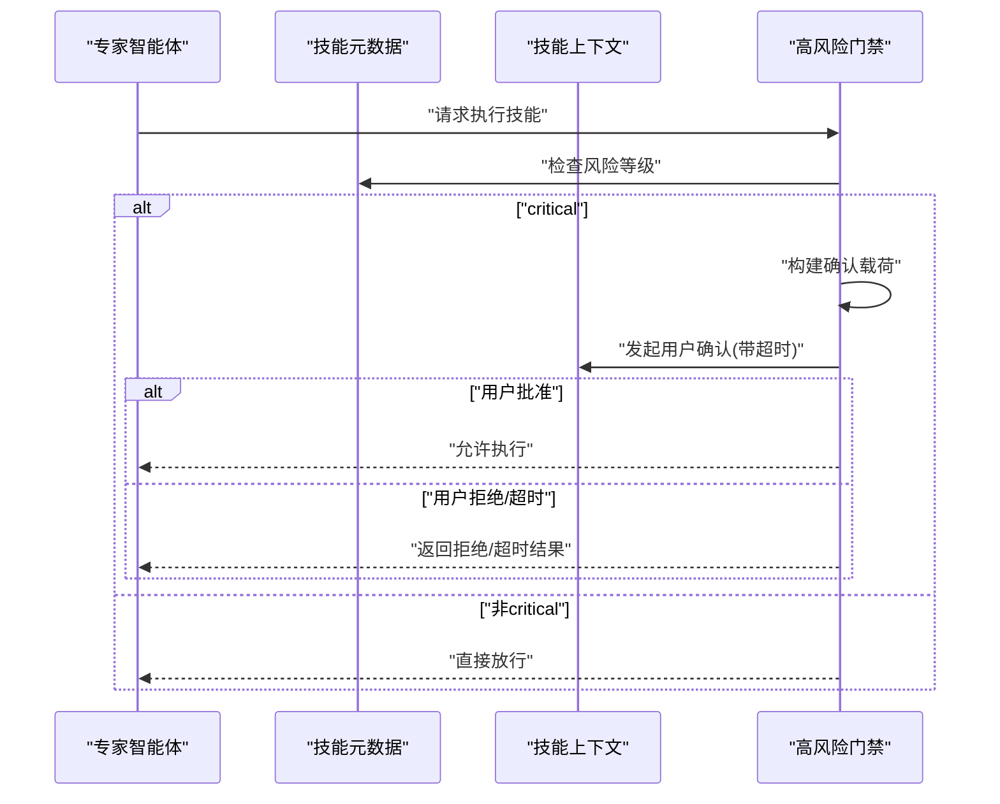
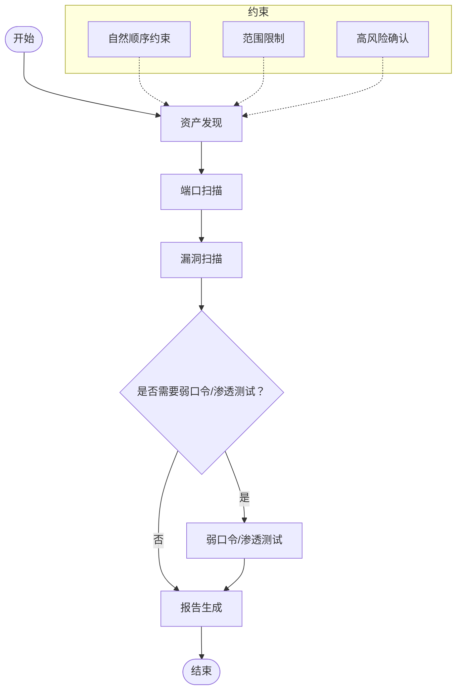
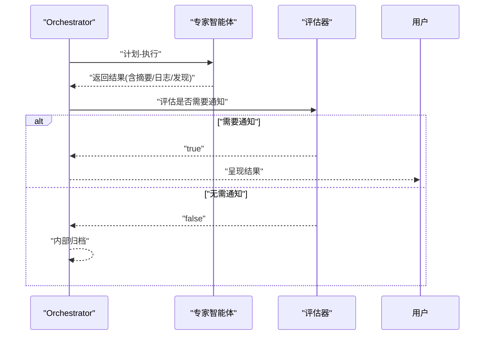
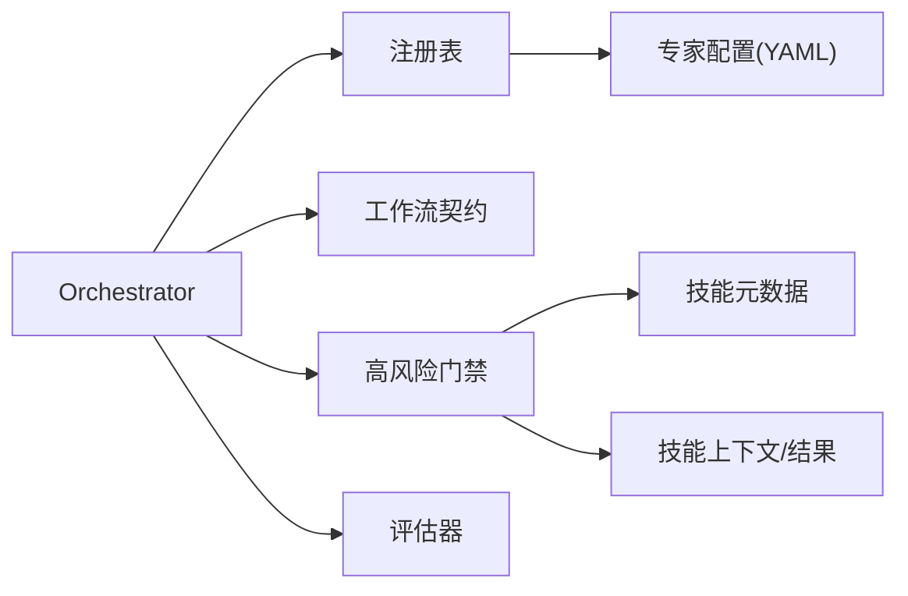

# Orchestrator调度器核心

<cite>
**本文引用的文件**
- [secbot/agents/orchestrator.py](file://secbot/agents/orchestrator.py)
- [secbot/agents/registry.py](file://secbot/agents/registry.py)
- [secbot/agents/high_risk.py](file://secbot/agents/high_risk.py)
- [secbot/skills/metadata.py](file://secbot/skills/metadata.py)
- [secbot/skills/types.py](file://secbot/skills/types.py)
- [secbot/agents/asset_discovery.yaml](file://secbot/agents/asset_discovery.yaml)
- [secbot/agents/port_scan.yaml](file://secbot/agents/port_scan.yaml)
- [secbot/agents/vuln_scan.yaml](file://secbot/agents/vuln_scan.yaml)
- [secbot/agents/report.yaml](file://secbot/agents/report.yaml)
- [secbot/utils/evaluator.py](file://secbot/utils/evaluator.py)
- [.trellis/workflow.md](file://.trellis/workflow.md)
</cite>

## 目录
1. [引言](#引言)
2. [项目结构](#项目结构)
3. [核心组件](#核心组件)
4. [架构总览](#架构总览)
5. [详细组件分析](#详细组件分析)
6. [依赖分析](#依赖分析)
7. [性能考虑](#性能考虑)
8. [故障排查指南](#故障排查指南)
9. [结论](#结论)
10. [附录](#附录)

## 引言
本文件系统化阐述Orchestrator调度器的核心机制，聚焦以下主题：
- 系统提示词渲染：锁定角色、硬性规则、可用专家智能体表、工作风格四段式提示的生成与稳定性保证
- 专家智能体表：注册表加载、校验、工具表面生成与动态展示
- 任务规划算法：基于阶段顺序约束、高风险确认与范围限制的执行策略
- 工作风格规范：计划-执行-评估循环、严重性统计与日志路径链接生成
- 扩展指南：新增规则、调整工作风格、动态更新专家智能体表
- 性能优化与调试技巧

## 项目结构
Orchestrator位于安全运营平台的“编排层”，负责将用户安全任务分解为一系列由专家智能体（Agent）执行的子任务，并在必要时进行高风险确认与范围控制。其核心文件分布如下：
- 提示词渲染与专家表：orchestrator.py、registry.py
- 高风险确认门禁：high_risk.py
- 技能元数据与上下文类型：metadata.py、types.py
- 专家智能体配置样例：asset_discovery.yaml、port_scan.yaml、vuln_scan.yaml、report.yaml
- 后台任务评估：evaluator.py
- 工作流状态机契约：.trellis/workflow.md

图表来源
- [secbot/agents/orchestrator.py:1-70](file://secbot/agents/orchestrator.py#L1-L70)
- [secbot/agents/registry.py:1-248](file://secbot/agents/registry.py#L1-L248)
- [secbot/agents/high_risk.py:1-139](file://secbot/agents/high_risk.py#L1-L139)
- [secbot/skills/metadata.py:1-147](file://secbot/skills/metadata.py#L1-L147)
- [secbot/skills/types.py:1-87](file://secbot/skills/types.py#L1-L87)
- [secbot/agents/asset_discovery.yaml:1-46](file://secbot/agents/asset_discovery.yaml#L1-L46)
- [secbot/agents/port_scan.yaml:1-50](file://secbot/agents/port_scan.yaml#L1-L50)
- [secbot/agents/vuln_scan.yaml:1-53](file://secbot/agents/vuln_scan.yaml#L1-L53)
- [secbot/agents/report.yaml:1-39](file://secbot/agents/report.yaml#L1-L39)
- [secbot/utils/evaluator.py:1-90](file://secbot/utils/evaluator.py#L1-L90)
- [.trellis/workflow.md:613-663](file://.trellis/workflow.md#L613-L663)

章节来源
- [secbot/agents/orchestrator.py:1-70](file://secbot/agents/orchestrator.py#L1-L70)
- [secbot/agents/registry.py:1-248](file://secbot/agents/registry.py#L1-L248)
- [secbot/agents/high_risk.py:1-139](file://secbot/agents/high_risk.py#L1-L139)
- [secbot/skills/metadata.py:1-147](file://secbot/skills/metadata.py#L1-L147)
- [secbot/skills/types.py:1-87](file://secbot/skills/types.py#L1-L87)
- [secbot/agents/asset_discovery.yaml:1-46](file://secbot/agents/asset_discovery.yaml#L1-L46)
- [secbot/agents/port_scan.yaml:1-50](file://secbot/agents/port_scan.yaml#L1-L50)
- [secbot/agents/vuln_scan.yaml:1-53](file://secbot/agents/vuln_scan.yaml#L1-L53)
- [secbot/agents/report.yaml:1-39](file://secbot/agents/report.yaml#L1-L39)
- [secbot/utils/evaluator.py:1-90](file://secbot/utils/evaluator.py#L1-L90)
- [.trellis/workflow.md:613-663](file://.trellis/workflow.md#L613-L663)

## 核心组件
- 系统提示词渲染器：将固定的角色、硬性规则、可用专家智能体表与工作风格拼接为稳定可复现的系统提示
- 专家智能体注册表：加载、校验、去重与工具表面生成，确保专家能力与技能边界清晰
- 高风险确认门禁：对“critical”风险技能进行阻断式用户确认，支持超时审计与拒绝记录
- 技能元数据与上下文：统一暴露技能名称、显示名、风险等级、运行时长等信息，支撑门禁与评估
- 专家智能体配置：以YAML声明各阶段专家职责、输入输出模式与可执行技能集合
- 后台任务评估：对后台执行结果进行轻量LLM评估，决定是否通知用户

章节来源
- [secbot/agents/orchestrator.py:52-70](file://secbot/agents/orchestrator.py#L52-L70)
- [secbot/agents/registry.py:65-92](file://secbot/agents/registry.py#L65-L92)
- [secbot/agents/high_risk.py:94-139](file://secbot/agents/high_risk.py#L94-L139)
- [secbot/skills/metadata.py:23-38](file://secbot/skills/metadata.py#L23-L38)
- [secbot/skills/types.py:44-87](file://secbot/skills/types.py#L44-L87)
- [secbot/agents/asset_discovery.yaml:1-46](file://secbot/agents/asset_discovery.yaml#L1-L46)
- [secbot/agents/port_scan.yaml:1-50](file://secbot/agents/port_scan.yaml#L1-L50)
- [secbot/agents/vuln_scan.yaml:1-53](file://secbot/agents/vuln_scan.yaml#L1-L53)
- [secbot/agents/report.yaml:1-39](file://secbot/agents/report.yaml#L1-L39)
- [secbot/utils/evaluator.py:42-90](file://secbot/utils/evaluator.py#L42-L90)

## 架构总览
下图展示了从用户请求到专家执行、再到高风险确认与结果评估的整体流程。

图表来源
- [secbot/agents/orchestrator.py:52-70](file://secbot/agents/orchestrator.py#L52-L70)
- [secbot/agents/registry.py:65-92](file://secbot/agents/registry.py#L65-L92)
- [secbot/agents/high_risk.py:103-139](file://secbot/agents/high_risk.py#L103-L139)
- [secbot/skills/types.py:44-87](file://secbot/skills/types.py#L44-L87)
- [secbot/utils/evaluator.py:42-90](file://secbot/utils/evaluator.py#L42-L90)

## 详细组件分析

### 组件A：系统提示词渲染器
- 设计要点
  - 四段式锁定提示：角色、硬性规则、可用专家智能体表、工作风格
  - 专家表动态生成：遍历注册表，按名称排序，拼接表格字符串
  - 输出稳定：给定相同注册表，字节级一致的提示文本
- 关键实现路径
  - 渲染函数入口与拼接逻辑：[render_orchestrator_prompt:52-70](file://secbot/agents/orchestrator.py#L52-L70)
  - 表格生成函数：[_render_agent_table:43-49](file://secbot/agents/orchestrator.py#L43-L49)

图表来源
- [secbot/agents/orchestrator.py:43-70](file://secbot/agents/orchestrator.py#L43-L70)

章节来源
- [secbot/agents/orchestrator.py:17-40](file://secbot/agents/orchestrator.py#L17-L40)
- [secbot/agents/orchestrator.py:43-70](file://secbot/agents/orchestrator.py#L43-L70)

### 组件B：专家智能体注册表
- 设计要点
  - 原子化规范：每个专家智能体的YAML包含名称、显示名、描述、系统提示文件、作用域技能、输入输出Schema、模型参数、迭代上限、是否发出计划步骤等
  - 严格校验：字段存在性、命名正则、文件存在性、JSON Schema合法性、作用域技能唯一性与归属一致性
  - 工具表面生成：将专家规格转换为LLM工具定义，供Orchestrator使用
- 关键实现路径
  - 规格类与工具表面生成：[ExpertAgentSpec:37-63](file://secbot/agents/registry.py#L37-L63)
  - 注册表容器与查询接口：[AgentRegistry:65-92](file://secbot/agents/registry.py#L65-L92)
  - 加载与校验主流程：[load_agent_registry:99-144](file://secbot/agents/registry.py#L99-L144)
  - 单个专家解析与Schema校验：[ExpertAgentSpec构造与校验:147-236](file://secbot/agents/registry.py#L147-L236)

图表来源
- [secbot/agents/registry.py:37-92](file://secbot/agents/registry.py#L37-L92)

章节来源
- [secbot/agents/registry.py:20-31](file://secbot/agents/registry.py#L20-L31)
- [secbot/agents/registry.py:37-63](file://secbot/agents/registry.py#L37-L63)
- [secbot/agents/registry.py:65-92](file://secbot/agents/registry.py#L65-L92)
- [secbot/agents/registry.py:99-144](file://secbot/agents/registry.py#L99-L144)
- [secbot/agents/registry.py:147-236](file://secbot/agents/registry.py#L147-L236)

### 组件C：高风险确认门禁
- 设计要点
  - 对“critical”风险技能进行阻断式确认；非critical直接放行
  - 结构化确认载荷：技能名、显示名、风险等级、参数、预估时长、扫描ID等
  - 审计日志：记录请求、批准、拒绝、超时事件
  - 超时保护：默认超时时间，超时返回用户拒绝的结果
- 关键实现路径
  - 结构化载荷构建：[build_confirmation_payload:65-86](file://secbot/agents/high_risk.py#L65-L86)
  - 门禁守卫逻辑：[HighRiskGate.guard:103-139](file://secbot/agents/high_risk.py#L103-139)
  - 审计记录器：[AuditLogger:30-63](file://secbot/agents/high_risk.py#L30-63)

图表来源
- [secbot/agents/high_risk.py:65-139](file://secbot/agents/high_risk.py#L65-L139)
- [secbot/skills/metadata.py:23-38](file://secbot/skills/metadata.py#L23-L38)
- [secbot/skills/types.py:57-87](file://secbot/skills/types.py#L57-L87)

章节来源
- [secbot/agents/high_risk.py:65-139](file://secbot/agents/high_risk.py#L65-L139)
- [secbot/skills/metadata.py:23-38](file://secbot/skills/metadata.py#L23-L38)
- [secbot/skills/types.py:57-87](file://secbot/skills/types.py#L57-L87)

### 组件D：任务规划与阶段顺序约束
- 设计要点
  - 明确的阶段顺序：资产发现 → 端口扫描 → 漏洞扫描 → 弱口令/渗透测试 → 报告生成
  - 可跳过条件：当用户提供前置数据或显式放弃时可跳过阶段
  - 范围限制：禁止越权操作（如未授权的第三方资产）
- 关键实现路径
  - 硬性规则定义：[硬性规则常量:22-32](file://secbot/agents/orchestrator.py#L22-L32)
  - 专家配置示例（阶段职责与输入输出）：[资产发现:1-46](file://secbot/agents/asset_discovery.yaml#L1-L46)、[端口扫描:1-50](file://secbot/agents/port_scan.yaml#L1-L50)、[漏洞扫描:1-53](file://secbot/agents/vuln_scan.yaml#L1-L53)、[报告生成:1-39](file://secbot/agents/report.yaml#L1-L39)
  - 工作流状态机契约（状态标签与钩子）：[工作流契约:613-663](file://.trellis/workflow.md#L613-L663)

图表来源
- [secbot/agents/orchestrator.py:22-32](file://secbot/agents/orchestrator.py#L22-L32)
- [secbot/agents/asset_discovery.yaml:1-46](file://secbot/agents/asset_discovery.yaml#L1-L46)
- [secbot/agents/port_scan.yaml:1-50](file://secbot/agents/port_scan.yaml#L1-L50)
- [secbot/agents/vuln_scan.yaml:1-53](file://secbot/agents/vuln_scan.yaml#L1-L53)
- [secbot/agents/report.yaml:1-39](file://secbot/agents/report.yaml#L1-L39)
- [.trellis/workflow.md:613-663](file://.trellis/workflow.md#L613-L663)

章节来源
- [secbot/agents/orchestrator.py:22-32](file://secbot/agents/orchestrator.py#L22-L32)
- [secbot/agents/asset_discovery.yaml:1-46](file://secbot/agents/asset_discovery.yaml#L1-L46)
- [secbot/agents/port_scan.yaml:1-50](file://secbot/agents/port_scan.yaml#L1-L50)
- [secbot/agents/vuln_scan.yaml:1-53](file://secbot/agents/vuln_scan.yaml#L1-L53)
- [secbot/agents/report.yaml:1-39](file://secbot/agents/report.yaml#L1-L39)
- [.trellis/workflow.md:613-663](file://.trellis/workflow.md#L613-L663)

### 组件E：工作风格规范与评估
- 计划-执行-评估循环
  - 执行前先计划：每步工具调用前生成简短计划
  - 执行后决策：根据上一步结果决定继续、重规划或询问用户
  - 严重性统计与日志链接：汇总发现并附带原始日志路径
- 后台任务评估
  - 使用轻量工具调用LLM判断是否需要通知用户
  - 失败回退：默认通知，避免重要消息被静默丢弃
- 关键实现路径
  - 工作风格定义：[工作风格常量:34-40](file://secbot/agents/orchestrator.py#L34-L40)
  - 后台任务评估：[evaluate_response:42-90](file://secbot/utils/evaluator.py#L42-90)
  - 技能结果类型（含日志路径）：[SkillResult:44-55](file://secbot/skills/types.py#L44-55)

图表来源
- [secbot/agents/orchestrator.py:34-40](file://secbot/agents/orchestrator.py#L34-L40)
- [secbot/utils/evaluator.py:42-90](file://secbot/utils/evaluator.py#L42-L90)
- [secbot/skills/types.py:44-55](file://secbot/skills/types.py#L44-L55)

章节来源
- [secbot/agents/orchestrator.py:34-40](file://secbot/agents/orchestrator.py#L34-L40)
- [secbot/utils/evaluator.py:42-90](file://secbot/utils/evaluator.py#L42-L90)
- [secbot/skills/types.py:44-55](file://secbot/skills/types.py#L44-L55)

## 依赖分析
- 组件耦合
  - Orchestrator依赖注册表生成专家表与工具表面，依赖工作风格与硬性规则
  - 高风险门禁依赖技能元数据的风险等级与上下文的确认回调
  - 评估器依赖LLM Provider与模板渲染
- 外部集成点
  - 专家智能体配置文件（YAML）作为权威来源
  - 工作流状态机契约用于状态标签与钩子绑定

图表来源
- [secbot/agents/orchestrator.py:52-70](file://secbot/agents/orchestrator.py#L52-L70)
- [secbot/agents/registry.py:99-144](file://secbot/agents/registry.py#L99-L144)
- [secbot/agents/high_risk.py:103-139](file://secbot/agents/high_risk.py#L103-L139)
- [secbot/skills/metadata.py:56-114](file://secbot/skills/metadata.py#L56-L114)
- [secbot/skills/types.py:57-87](file://secbot/skills/types.py#L57-L87)
- [secbot/utils/evaluator.py:42-90](file://secbot/utils/evaluator.py#L42-L90)
- [.trellis/workflow.md:613-663](file://.trellis/workflow.md#L613-L663)

章节来源
- [secbot/agents/orchestrator.py:52-70](file://secbot/agents/orchestrator.py#L52-L70)
- [secbot/agents/registry.py:99-144](file://secbot/agents/registry.py#L99-L144)
- [secbot/agents/high_risk.py:103-139](file://secbot/agents/high_risk.py#L103-L139)
- [secbot/skills/metadata.py:56-114](file://secbot/skills/metadata.py#L56-L114)
- [secbot/skills/types.py:57-87](file://secbot/skills/types.py#L57-L87)
- [secbot/utils/evaluator.py:42-90](file://secbot/utils/evaluator.py#L42-L90)
- [.trellis/workflow.md:613-663](file://.trellis/workflow.md#L613-L663)

## 性能考虑
- 提示词稳定性与缓存
  - 专家表排序稳定，确保提示文本字节级一致，有利于缓存命中与一致性
- 高风险确认超时
  - 合理设置超时时间，避免长时间阻塞；超时即视为拒绝，减少资源占用
- 后台任务评估
  - 使用轻量工具调用与低温度值，降低推理成本；失败回退通知，避免漏报
- 工具表面精简
  - 仅暴露必要技能，减少LLM选择开销；通过注册表集中管理，避免重复定义

## 故障排查指南
- 专家智能体注册失败
  - 检查YAML字段完整性、命名正则、系统提示文件存在性、Schema合法性
  - 排查作用域技能重复与未知技能引用
  - 参考：[注册表加载与校验:99-236](file://secbot/agents/registry.py#L99-L236)
- 高风险确认不生效
  - 确认技能元数据风险等级为“critical”
  - 检查上下文confirm回调是否被正确注入
  - 查看审计日志中请求/批准/拒绝/超时事件
  - 参考：[高风险门禁:94-139](file://secbot/agents/high_risk.py#L94-139)、[技能元数据:23-38](file://secbot/skills/metadata.py#L23-38)、[技能上下文:57-87](file://secbot/skills/types.py#L57-87)
- 后台任务未通知
  - 检查评估器返回值与异常回退逻辑
  - 参考：[评估器:42-90](file://secbot/utils/evaluator.py#L42-90)
- 阶段顺序违规
  - 核对硬性规则与专家配置中的输入输出字段
  - 参考：[硬性规则:22-32](file://secbot/agents/orchestrator.py#L22-L32)、[专家配置:1-46](file://secbot/agents/asset_discovery.yaml#L1-L46)

章节来源
- [secbot/agents/registry.py:99-236](file://secbot/agents/registry.py#L99-L236)
- [secbot/agents/high_risk.py:94-139](file://secbot/agents/high_risk.py#L94-L139)
- [secbot/skills/metadata.py:23-38](file://secbot/skills/metadata.py#L23-L38)
- [secbot/skills/types.py:57-87](file://secbot/skills/types.py#L57-L87)
- [secbot/utils/evaluator.py:42-90](file://secbot/utils/evaluator.py#L42-L90)
- [secbot/agents/orchestrator.py:22-32](file://secbot/agents/orchestrator.py#L22-L32)
- [secbot/agents/asset_discovery.yaml:1-46](file://secbot/agents/asset_discovery.yaml#L1-L46)

## 结论
Orchestrator调度器通过“锁定提示 + 动态专家表 + 阶段顺序 + 高风险确认 + 工作风格”的组合，实现了安全任务的稳健编排。其设计强调：
- 稳定性：提示渲染与注册表校验保障输出一致性与可验证性
- 安全性：高风险门禁与范围限制防止误操作
- 可观测性：审计日志、严重性统计与日志链接便于追踪与复盘
- 可扩展性：通过专家配置与工作流契约，平滑引入新阶段与新能力

## 附录

### 扩展指南
- 添加自定义硬性规则
  - 在提示渲染器中扩展“硬性规则”段落，确保规则语义清晰且与现有阶段顺序兼容
  - 参考：[硬性规则常量:22-32](file://secbot/agents/orchestrator.py#L22-L32)
- 调整工作风格
  - 修改“工作风格”段落，例如调整计划步数、评估策略或日志链接格式
  - 参考：[工作风格常量:34-40](file://secbot/agents/orchestrator.py#L34-L40)
- 动态更新专家智能体表
  - 新增或修改专家配置YAML，确保字段完整、Schema合法、作用域技能唯一
  - 重新加载注册表，验证工具表面生成与排序稳定性
  - 参考：[注册表加载:99-144](file://secbot/agents/registry.py#L99-L144)、[专家表生成:43-49](file://secbot/agents/orchestrator.py#L43-L49)

章节来源
- [secbot/agents/orchestrator.py:22-40](file://secbot/agents/orchestrator.py#L22-L40)
- [secbot/agents/registry.py:99-144](file://secbot/agents/registry.py#L99-L144)
- [secbot/agents/orchestrator.py:43-49](file://secbot/agents/orchestrator.py#L43-L49)