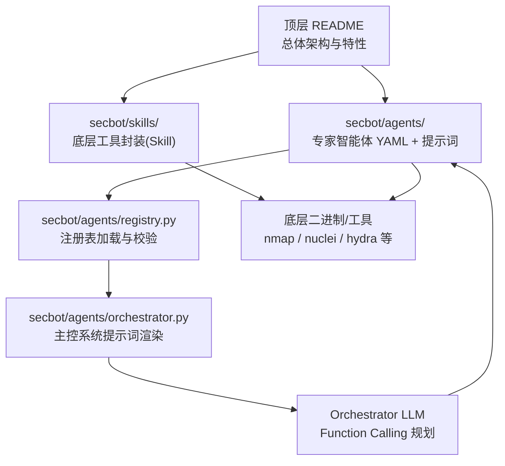
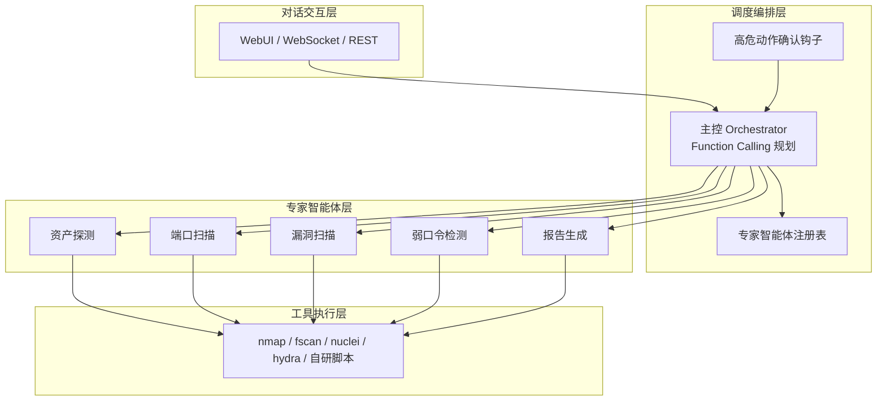
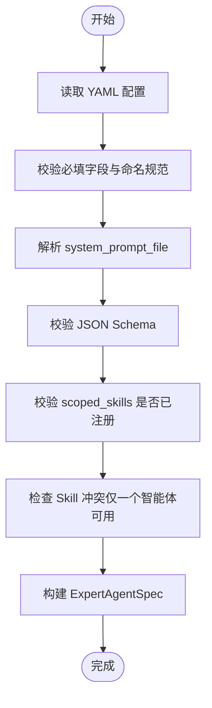
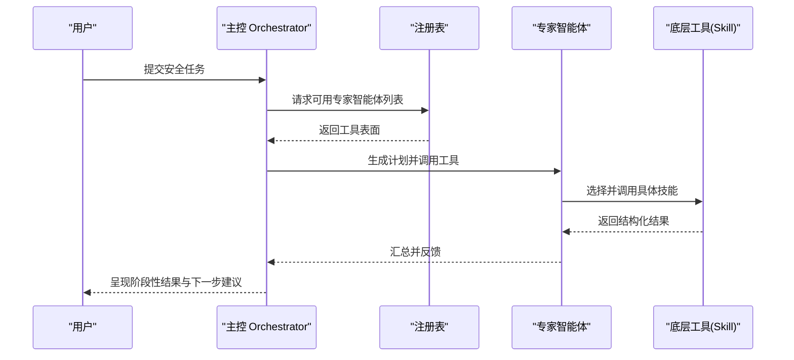
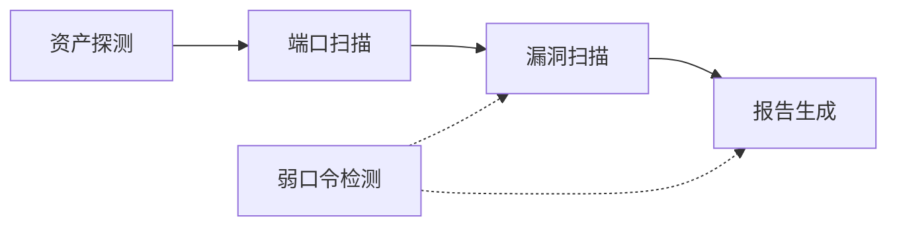
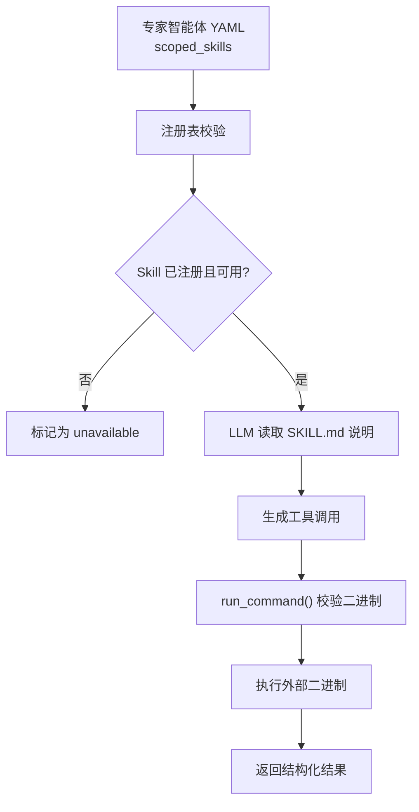
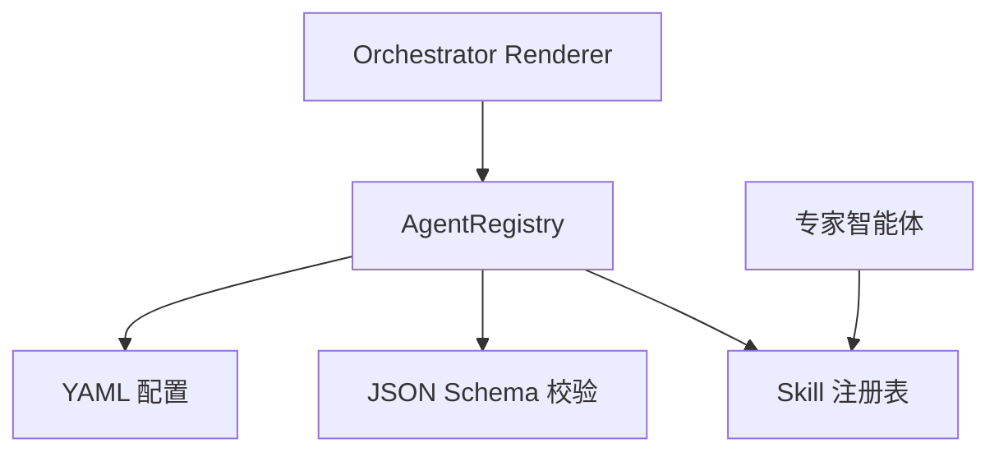

# 专家智能体开发指南

<cite>
**本文引用的文件**
- [README.md](file://README.md)
- [AGENTS.md](file://AGENTS.md)
- [docs/quick-start.md](file://docs/quick-start.md)
- [docs/configuration.md](file://docs/configuration.md)
- [secbot/agents/asset_discovery.yaml](file://secbot/agents/asset_discovery.yaml)
- [secbot/agents/port_scan.yaml](file://secbot/agents/port_scan.yaml)
- [secbot/agents/vuln_scan.yaml](file://secbot/agents/vuln_scan.yaml)
- [secbot/agents/report.yaml](file://secbot/agents/report.yaml)
- [secbot/agents/weak_password.yaml](file://secbot/agents/weak_password.yaml)
- [secbot/agents/orchestrator.py](file://secbot/agents/orchestrator.py)
- [secbot/agents/registry.py](file://secbot/agents/registry.py)
- [secbot/skills/nmap-host-discovery/SKILL.md](file://secbot/skills/nmap-host-discovery/SKILL.md)
- [secbot/skills/nmap-port-scan/SKILL.md](file://secbot/skills/nmap-port-scan/SKILL.md)
- [secbot/skills/nuclei-template-scan/SKILL.md](file://secbot/skills/nuclei-template-scan/SKILL.md)
</cite>

## 目录
1. [简介](#简介)
2. [项目结构](#项目结构)
3. [核心组件](#核心组件)
4. [架构总览](#架构总览)
5. [详细组件分析](#详细组件分析)
6. [依赖分析](#依赖分析)
7. [性能考虑](#性能考虑)
8. [故障排查指南](#故障排查指南)
9. [结论](#结论)
10. [附录](#附录)

## 简介
本指南面向希望在本项目基础上开发“专家智能体”的工程师与安全工程师，系统讲解以下内容：
- 专家智能体配置文件的编写规范（YAML 语法、字段定义、Schema 校验规则）
- 提示词设计原则（角色设定、硬性规则、可用工具清单、工作风格）
- 智能体生命周期管理（创建、注册、运行时监控）
- 智能体间协作机制与依赖关系管理
- 开发调试工具与性能优化技巧
- 示例项目与最佳实践模板

本项目采用“主控编排 + 专家智能体池”的架构，主控智能体（Orchestrator）通过 LLM Function Calling 动态规划任务，将用户诉求拆解为一系列专家智能体的有序调用，每个专家智能体由“提示词 + 工具集 + 输入/输出 Schema”构成，彼此解耦、可插拔。

章节来源
- [README.md:13-74](file://README.md#L13-L74)

## 项目结构
项目采用分层组织方式：
- 顶层 README 提供总体架构与能力概览
- secbot/agents/ 下存放专家智能体的 YAML 配置与系统提示词
- secbot/skills/ 下存放底层工具封装（Skill），含元数据与可选处理器
- secbot/agents/registry.py 实现智能体注册表加载与校验
- secbot/agents/orchestrator.py 生成主控系统提示词，锁定角色、规则与工作风格
- docs/ 提供快速开始与配置说明

图表来源
- [README.md:29-62](file://README.md#L29-L62)
- [secbot/agents/registry.py:1-248](file://secbot/agents/registry.py#L1-L248)
- [secbot/agents/orchestrator.py:1-70](file://secbot/agents/orchestrator.py#L1-L70)

章节来源
- [README.md:375-391](file://README.md#L375-L391)

## 核心组件
- 专家智能体注册表（AgentRegistry）：负责加载、校验与规范化每个专家智能体的 YAML；生成主控可见的工具表面（tool surface）
- 主控系统提示词渲染器（Orchestrator Prompt Renderer）：固定角色、硬性规则、工作风格，动态注入可用专家智能体表格
- 底层工具（Skill）：以目录形式提供元数据与可选处理器，通过白名单与 PATH 校验后被智能体引用

章节来源
- [secbot/agents/registry.py:1-248](file://secbot/agents/registry.py#L1-L248)
- [secbot/agents/orchestrator.py:1-70](file://secbot/agents/orchestrator.py#L1-L70)

## 架构总览
系统分为四层：
- 对话交互层：WebUI、WebSocket、REST
- 调度编排层：Orchestrator LLM + 高危动作确认 + 专家智能体注册表
- 专家智能体层：每个专家 = 提示词 + 工具集 + I/O Schema
- 工具执行层：nmap / fscan / nuclei / hydra 等外部二进制

图表来源
- [README.md:29-62](file://README.md#L29-L62)
- [README.md:64-74](file://README.md#L64-L74)

章节来源
- [README.md:29-62](file://README.md#L29-L62)

## 详细组件分析

### 专家智能体配置文件编写规范
- 文件命名与字段要求
  - 文件名需与 name 字段一致
  - 必填字段：name、display_name、description、system_prompt_file、scoped_skills、input_schema、output_schema
  - 可选字段：model、max_iterations、emit_plan_steps
- 字段语义
  - name：小写、数字、下划线，开头字母，唯一
  - display_name / description：展示与描述信息
  - system_prompt_file：相对路径指向系统提示词文件
  - scoped_skills：该智能体可用的工具集合（Skill 名称）
  - input_schema / output_schema：JSON Schema 2020-12，用于 LLM 参数校验与结果校验
  - model：可覆盖默认模型配置
  - max_iterations：最大迭代次数
  - emit_plan_steps：是否在提示词中要求输出计划步骤
- 加载与校验流程
  - 读取 YAML → 校验必填字段与命名规范 → 解析 system_prompt_file → 校验 JSON Schema → 校验 scoped_skills 是否存在于已注册 Skill 集合 → 去重与冲突检查（同一 Skill 不能被多个智能体共享）

图表来源
- [secbot/agents/registry.py:99-236](file://secbot/agents/registry.py#L99-L236)

章节来源
- [secbot/agents/registry.py:20-31](file://secbot/agents/registry.py#L20-L31)
- [secbot/agents/registry.py:147-236](file://secbot/agents/registry.py#L147-L236)

### 提示词设计原则
- 角色设定（Role）
  - 明确智能体职责：例如资产探测、端口扫描、漏洞扫描、弱口令检测、报告生成
- 硬性规则（Hard rules）
  - 不越权执行：仅路由给专家智能体，不自行执行扫描
  - 严格顺序：资产探测 → 端口扫描 → 漏洞扫描 → 弱口令检测 → 报告生成
  - 高危护栏：涉及高风险技能时必须经人工确认
  - 范围限制：拒绝超出授权范围或无关请求
- 可用工具列表（Available expert agents）
  - 由注册表动态生成，包含工具名称、用途与可用技能
- 工作风格（Working style）
  - 先计划再行动（1-3 步），每次工具结果后决定继续/重规划/询问用户
  - 汇总严重性统计并附带原始日志路径
  - 使用用户语言

图表来源
- [secbot/agents/orchestrator.py:52-69](file://secbot/agents/orchestrator.py#L52-L69)
- [secbot/agents/registry.py:89-91](file://secbot/agents/registry.py#L89-L91)

章节来源
- [secbot/agents/orchestrator.py:17-40](file://secbot/agents/orchestrator.py#L17-L40)
- [secbot/agents/orchestrator.py:43-49](file://secbot/agents/orchestrator.py#L43-L49)

### 智能体生命周期管理
- 创建阶段
  - 新建 YAML 配置文件，填写必要字段与 Schema
  - 准备 system_prompt_file，确保路径正确
  - 在 secbot/skills/ 下注册所需 Skill（如 nmap-host-discovery）
- 注册阶段
  - 启动时由 AgentRegistry 加载并校验，失败则中止
  - 校验 scoped_skills 是否重复、是否存在于已注册集合
- 运行阶段
  - Orchestrator 通过 LLM Function Calling 调用专家智能体
  - 每个智能体根据 input_schema 生成参数，按 output_schema 校验结果
  - 高危技能触发人工确认流程
- 监控与审计
  - 每次工具调用记录输入、输出、发起人、时间戳
  - CMDB 记录资产、漏洞、任务，支持查询与导出

章节来源
- [README.md:193-222](file://README.md#L193-L222)
- [README.md:355-362](file://README.md#L355-L362)

### 智能体间协作与依赖关系
- 顺序依赖
  - 资产探测 → 端口扫描 → 漏洞扫描 → 弱口令检测 → 报告生成
- 数据传递
  - 上游智能体的输出作为下游智能体的输入（如端口扫描的 services 作为漏洞扫描输入）
- 工具共享与冲突
  - 同一 Skill 只能被一个智能体声明，避免冲突
  - 通过注册表集中校验与去重

图表来源
- [README.md:24-26](file://README.md#L24-L26)
- [README.md:66-72](file://README.md#L66-L72)

章节来源
- [README.md:24-26](file://README.md#L24-L26)
- [README.md:66-72](file://README.md#L66-L72)

### 底层工具（Skill）注册与调用
- 目录结构
  - 每个 Skill 以目录形式存在，包含元数据文件（SKILL.md）与可选处理器（handler.py）
- 元数据字段
  - name、display_name、version、risk_level、category、external_binary、binary_min_version、network_egress、expected_runtime_sec、summary_size_hint
- 白名单与 PATH 校验
  - 通过 BINARY_WHITELIST 与 shutil.which 校验二进制可用性
  - 未通过校验的 Skill 将被标记为 unavailable
- 调用链路
  - 专家智能体通过 scoped_skills 引用 Skill
  - LLM 读取 Skill 的 SKILL.md 说明，生成工具调用
  - run_command() 检查白名单与 PATH，执行外部二进制并返回结构化结果

图表来源
- [README.md:225-337](file://README.md#L225-L337)
- [secbot/skills/nmap-host-discovery/SKILL.md:1-36](file://secbot/skills/nmap-host-discovery/SKILL.md#L1-L36)
- [secbot/skills/nmap-port-scan/SKILL.md:1-16](file://secbot/skills/nmap-port-scan/SKILL.md#L1-L16)
- [secbot/skills/nuclei-template-scan/SKILL.md:1-17](file://secbot/skills/nuclei-template-scan/SKILL.md#L1-L17)

章节来源
- [README.md:225-337](file://README.md#L225-L337)

### 示例智能体配置与 Schema
- 资产探测（asset_discovery）
  - 输入：target（CIDR/IP/域名）、label（可选）
  - 输出：assets 数组（包含 target、kind、label）
- 端口扫描（port_scan）
  - 输入：targets（IP/主机数组）、ports（可选端口范围）、rate（slow/normal/fast）
  - 输出：services 数组（host、port、protocol、service、version）
- 漏洞扫描（vuln_scan）
  - 输入：services（host/port/protocol/service）、severity_floor（info/low/medium/high/critical）
  - 输出：findings 数组（host、port、severity、title、cve_id、template）
- 弱口令检测（weak_password）
  - 输入：services（host/port/service 列表）、user_list、pass_list
  - 输出：findings 数组（host、port、service、username、password）
- 报告生成（report）
  - 输入：scan_id、format（markdown/pdf/docx）、template（可选）
  - 输出：path、format、bytes

章节来源
- [secbot/agents/asset_discovery.yaml:22-46](file://secbot/agents/asset_discovery.yaml#L22-L46)
- [secbot/agents/port_scan.yaml:18-50](file://secbot/agents/port_scan.yaml#L18-L50)
- [secbot/agents/vuln_scan.yaml:17-53](file://secbot/agents/vuln_scan.yaml#L17-L53)
- [secbot/agents/weak_password.yaml:17-53](file://secbot/agents/weak_password.yaml#L17-L53)
- [secbot/agents/report.yaml:18-39](file://secbot/agents/report.yaml#L18-L39)

## 依赖分析
- 组件内聚与耦合
  - AgentRegistry 与 YAML/Schema/注册表强相关，职责单一
  - Orchestrator Prompt Renderer 与注册表松耦合，仅依赖工具表面
  - 专家智能体与 Skill 通过 scoped_skills 解耦
- 外部依赖
  - LLM 提供商与模型配置（通过配置文件与环境变量）
  - 底层二进制工具（nmap、nuclei、hydra 等）通过白名单与 PATH 校验
- 循环依赖
  - 未发现循环导入或循环依赖

图表来源
- [secbot/agents/registry.py:99-144](file://secbot/agents/registry.py#L99-L144)
- [secbot/agents/orchestrator.py:52-69](file://secbot/agents/orchestrator.py#L52-L69)

章节来源
- [secbot/agents/registry.py:99-144](file://secbot/agents/registry.py#L99-L144)
- [secbot/agents/orchestrator.py:52-69](file://secbot/agents/orchestrator.py#L52-L69)

## 性能考虑
- 迭代上限与计划输出
  - 通过 max_iterations 控制单智能体最大迭代，避免长尾
  - emit_plan_steps 可帮助减少不必要的重复尝试
- 工具调用与二进制执行
  - 优先选择预期运行时间较短的工具组合
  - 合理设置速率参数（如 nmap 的 -T2/-T3/-T4），平衡速度与准确性
- 并行与隔离
  - 在允许的范围内并行执行独立任务（如多主机扫描）
  - 对高危动作使用人工确认，避免无效重试
- 资源与日志
  - 结果尽量结构化，减少 LLM 输出解析成本
  - 通过 CMDB 记录中间产物，避免重复计算

章节来源
- [README.md:24-26](file://README.md#L24-L26)
- [README.md:355-362](file://README.md#L355-L362)
- [secbot/skills/nmap-host-discovery/SKILL.md:20-23](file://secbot/skills/nmap-host-discovery/SKILL.md#L20-L23)

## 故障排查指南
- 启动失败（AgentRegistryError）
  - 检查 YAML 语法与字段完整性
  - 确认 name 与文件名一致、scoped_skills 唯一且已注册
  - 校验 JSON Schema 是否符合 2020-12
- 工具不可用
  - 确认 external_binary 在 PATH 中
  - 将二进制加入白名单（如不在 BINARY_WHITELIST）
  - 重启后端使变更生效
- 高危动作未触发确认
  - 确认 risk_level 为 high/critical 的 Skill 已正确标注
  - 检查高危确认钩子是否启用
- 配置问题
  - 使用配置刷新功能合并默认值，避免覆盖已有设置
  - 通过环境变量注入敏感信息，避免明文存储

章节来源
- [secbot/agents/registry.py:132-135](file://secbot/agents/registry.py#L132-L135)
- [README.md:269-337](file://README.md#L269-L337)
- [docs/configuration.md:5-27](file://docs/configuration.md#L5-L27)

## 结论
通过规范的 YAML 配置、严谨的 Schema 校验、清晰的提示词设计与严格的工具注册流程，本项目实现了可插拔、可审计、可扩展的专家智能体体系。遵循本文的开发与调试方法，可在保证安全护栏的前提下高效构建与运维多智能体协作系统。

## 附录
- 快速开始与配置
  - 安装、初始化、配置提供商与模型、启动不同入口
- Trellis 工作流与子智能体管理
  - 子智能体生命周期与并发策略

章节来源
- [docs/quick-start.md:53-105](file://docs/quick-start.md#L53-L105)
- [AGENTS.md:19-32](file://AGENTS.md#L19-L32)