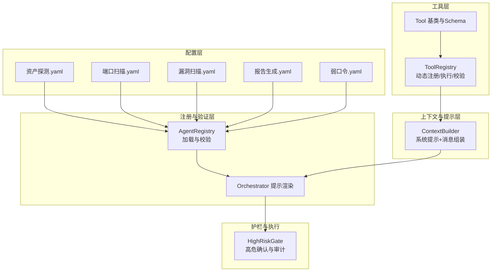
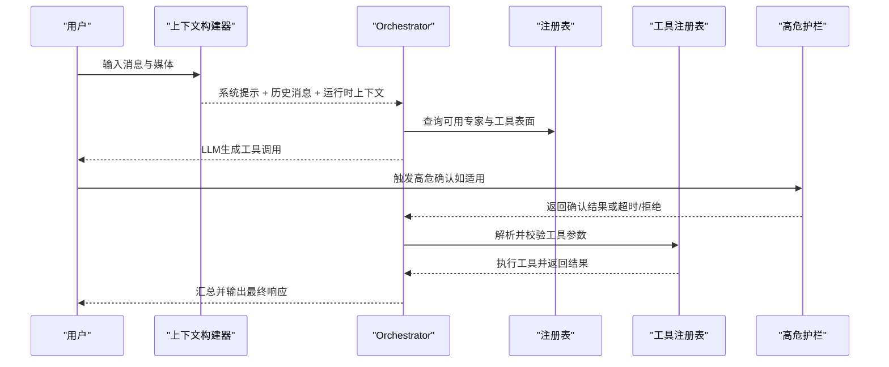
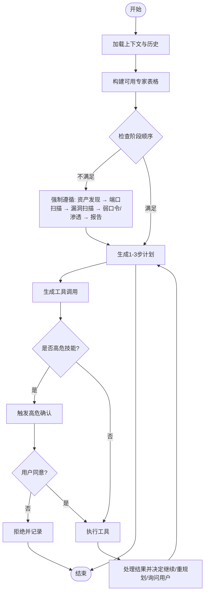
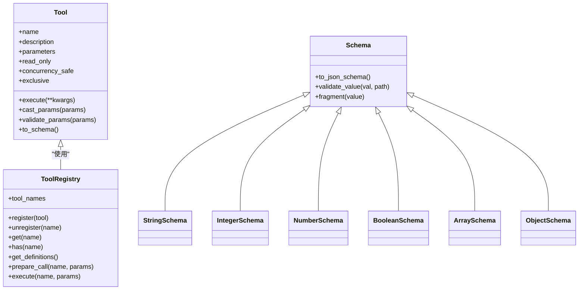
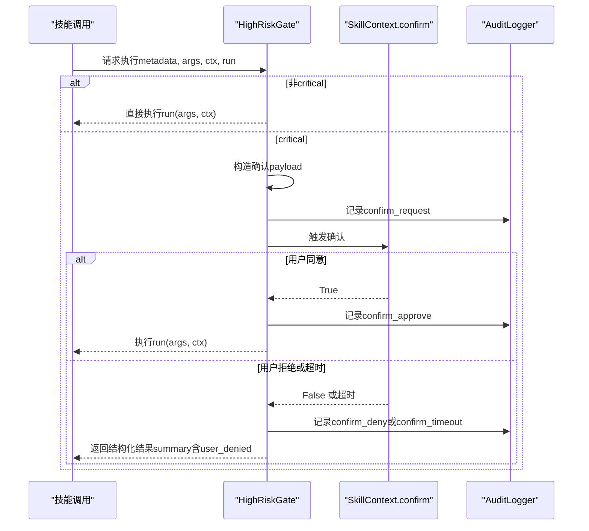
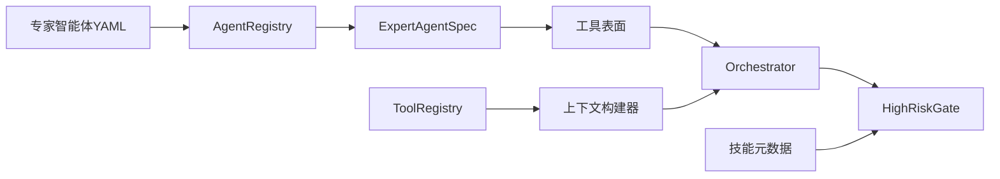

# 专家智能体系统

<cite>
**本文引用的文件**
- [secbot/agents/orchestrator.py](file://secbot/agents/orchestrator.py)
- [secbot/agents/high_risk.py](file://secbot/agents/high_risk.py)
- [secbot/agents/registry.py](file://secbot/agents/registry.py)
- [secbot/agent/tools/registry.py](file://secbot/agent/tools/registry.py)
- [secbot/agent/context.py](file://secbot/agent/context.py)
- [secbot/agent/tools/base.py](file://secbot/agent/tools/base.py)
- [secbot/agent/tools/schema.py](file://secbot/agent/tools/schema.py)
- [secbot/agents/asset_discovery.yaml](file://secbot/agents/asset_discovery.yaml)
- [secbot/agents/port_scan.yaml](file://secbot/agents/port_scan.yaml)
- [secbot/agents/vuln_scan.yaml](file://secbot/agents/vuln_scan.yaml)
- [secbot/agents/report.yaml](file://secbot/agents/report.yaml)
- [secbot/agents/weak_password.yaml](file://secbot/agents/weak_password.yaml)
- [secbot/skills/metadata.py](file://secbot/skills/metadata.py)
- [secbot/skills/types.py](file://secbot/skills/types.py)
</cite>

## 目录
1. [简介](#简介)
2. [项目结构](#项目结构)
3. [核心组件](#核心组件)
4. [架构总览](#架构总览)
5. [详细组件分析](#详细组件分析)
6. [依赖分析](#依赖分析)
7. [性能考虑](#性能考虑)
8. [故障排查指南](#故障排查指南)
9. [结论](#结论)
10. [附录](#附录)

## 简介
本文件面向VAPT3/secbot的专家智能体系统，系统性阐述专家智能体的架构设计、角色提示词（system prompt）组织方式、工具集整合策略、输入输出Schema的标准化设计，并深入解析主控智能体（Orchestrator）的动态规划算法、高危操作护栏机制（high_risk hook）、智能体配置文件（.yaml）结构与字段语义、扩展新智能体的完整流程，以及智能体间协作与上下文传递机制。文档同时提供可操作的最佳实践与参考示例路径，帮助读者快速理解并安全地扩展系统。

## 项目结构
专家智能体系统主要由以下层次构成：
- 配置层：专家智能体的YAML配置文件，定义名称、显示名、描述、系统提示文件、作用域技能集合、输入/输出Schema、迭代次数与计划步输出开关等。
- 注册与验证层：加载并校验专家智能体配置，生成规范化的专家智能体规格对象，并构建工具表面（供LLM使用的函数调用定义）。
- 上下文与提示层：组装系统提示（身份、引导文件、记忆、技能摘要、近期历史等），并支持运行时上下文注入。
- 工具层：统一的工具注册表与参数Schema校验，确保工具调用的类型安全与一致性。
- 主控智能体（Orchestrator）：渲染锁定的系统提示（角色、硬规则、可用专家、工作风格），并基于当前上下文与意图动态选择最优专家组合。
- 高危护栏：对风险等级为“critical”的技能调用进行阻断式确认，记录审计日志并处理超时与拒绝场景。

图表来源
- [secbot/agents/registry.py:99-248](file://secbot/agents/registry.py#L99-L248)
- [secbot/agents/orchestrator.py:52-70](file://secbot/agents/orchestrator.py#L52-L70)
- [secbot/agent/context.py:32-68](file://secbot/agent/context.py#L32-L68)
- [secbot/agent/tools/registry.py:48-126](file://secbot/agent/tools/registry.py#L48-L126)
- [secbot/agents/high_risk.py:93-139](file://secbot/agents/high_risk.py#L93-L139)

章节来源
- [secbot/agents/asset_discovery.yaml:1-46](file://secbot/agents/asset_discovery.yaml#L1-L46)
- [secbot/agents/port_scan.yaml:1-50](file://secbot/agents/port_scan.yaml#L1-L50)
- [secbot/agents/vuln_scan.yaml:1-53](file://secbot/agents/vuln_scan.yaml#L1-L53)
- [secbot/agents/report.yaml:1-39](file://secbot/agents/report.yaml#L1-L39)
- [secbot/agents/weak_password.yaml:1-53](file://secbot/agents/weak_password.yaml#L1-L53)

## 核心组件
- 专家智能体注册表与校验
  - 加载每个专家智能体的YAML配置，校验必填字段、命名规范、系统提示文件存在性、输入/输出Schema合法性、模型与迭代参数等。
  - 构建专家智能体规格对象（包含名称、显示名、描述、系统提示、作用域技能集合、输入/输出Schema、模型与迭代参数等），并生成工具表面（供LLM函数调用使用）。
- Orchestrator系统提示渲染
  - 固定四段式提示：角色、硬规则、可用专家表格、工作风格；其中“可用专家表格”随注册表动态变化，其余为常量。
- 工具注册与参数Schema
  - 动态注册工具，按稳定顺序缓存工具定义；提供参数类型转换与JSON Schema校验；统一执行入口并返回结构化结果。
- 上下文构建器
  - 组装系统提示（身份、引导文件、记忆、活跃技能、技能摘要、近期历史），并合并运行时上下文（时间、通道、会话摘要等）到用户消息中。
- 高危护栏
  - 对风险等级为“critical”的技能调用进行阻断式确认，超时与拒绝均以结构化结果返回，审计日志记录关键事件。

章节来源
- [secbot/agents/registry.py:99-248](file://secbot/agents/registry.py#L99-L248)
- [secbot/agents/orchestrator.py:52-70](file://secbot/agents/orchestrator.py#L52-L70)
- [secbot/agent/tools/registry.py:48-126](file://secbot/agent/tools/registry.py#L48-L126)
- [secbot/agent/context.py:32-68](file://secbot/agent/context.py#L32-L68)
- [secbot/agents/high_risk.py:93-139](file://secbot/agents/high_risk.py#L93-L139)

## 架构总览
专家智能体系统采用“配置驱动 + 注册校验 + 上下文提示 + 工具执行 + 高危护栏”的分层架构。专家智能体通过YAML配置声明其能力边界与输入输出约束；注册表负责规范化与校验；Orchestrator在每次推理中结合上下文与可用专家，动态规划出最优执行序列；工具层保证参数安全与类型一致；高危护栏确保关键动作必须经用户确认。

图表来源
- [secbot/agent/context.py:133-165](file://secbot/agent/context.py#L133-L165)
- [secbot/agents/orchestrator.py:52-70](file://secbot/agents/orchestrator.py#L52-L70)
- [secbot/agents/registry.py:89-92](file://secbot/agents/registry.py#L89-L92)
- [secbot/agent/tools/registry.py:73-126](file://secbot/agent/tools/registry.py#L73-L126)
- [secbot/agents/high_risk.py:103-139](file://secbot/agents/high_risk.py#L103-L139)

## 详细组件分析

### 专家智能体配置文件（.yaml）结构与字段语义
- 必填字段
  - name：专家智能体唯一标识，需符合命名正则，且与文件名一致。
  - display_name：展示名称。
  - description：简要描述，用于工具表面描述。
  - system_prompt_file：相对路径指向系统提示文件，内容将作为该专家的系统提示。
  - scoped_skills：非空字符串列表，表示该专家可调用的技能集合，且同一技能不能被多个专家共享。
  - input_schema / output_schema：均为合法的JSON Schema 2020-12，分别约束输入参数与输出结构。
- 可选字段
  - model：可选的模型覆盖配置（映射）。
  - max_iterations：最大迭代次数，默认值见实现。
  - emit_plan_steps：是否在对话中显式输出计划步骤，默认为true。
  - source_path：源文件路径（内部使用）。
- 示例与参考
  - 资产探测：声明作用域技能与输入/输出Schema，强调与后续阶段的顺序依赖。
  - 端口扫描：声明目标列表、端口范围、速率等输入约束。
  - 漏洞扫描：声明服务数组与严重度阈值等输入约束。
  - 报告生成：声明扫描ID、格式与模板等输入约束。
  - 弱口令：声明服务数组与用户/密码字典等输入约束，并标注所有技能为高危。

章节来源
- [secbot/agents/registry.py:22-31](file://secbot/agents/registry.py#L22-L31)
- [secbot/agents/registry.py:162-171](file://secbot/agents/registry.py#L162-L171)
- [secbot/agents/registry.py:172-186](file://secbot/agents/registry.py#L172-L186)
- [secbot/agents/registry.py:187-201](file://secbot/agents/registry.py#L187-L201)
- [secbot/agents/registry.py:202-215](file://secbot/agents/registry.py#L202-L215)
- [secbot/agents/registry.py:216-223](file://secbot/agents/registry.py#L216-L223)
- [secbot/agents/asset_discovery.yaml:1-46](file://secbot/agents/asset_discovery.yaml#L1-L46)
- [secbot/agents/port_scan.yaml:1-50](file://secbot/agents/port_scan.yaml#L1-L50)
- [secbot/agents/vuln_scan.yaml:1-53](file://secbot/agents/vuln_scan.yaml#L1-L53)
- [secbot/agents/report.yaml:1-39](file://secbot/agents/report.yaml#L1-L39)
- [secbot/agents/weak_password.yaml:1-53](file://secbot/agents/weak_password.yaml#L1-L53)

### Orchestrator系统提示与动态规划
- 系统提示组成
  - 角色：明确职责为安全运营助手，协调专家智能体完成任务。
  - 硬规则：禁止自行执行扫描、严格遵循阶段顺序、高危操作必须经确认、拒绝越权请求。
  - 可用专家：动态表格，包含工具名、用途与作用域技能集合。
  - 工作风格：计划-执行-总结-语言适配等行为准则。
- 动态规划思路
  - 输入：用户意图、上下文、可用专家集合、各专家的输入/输出Schema。
  - 选择策略：优先满足阶段顺序（资产发现 → 端口扫描 → 漏洞扫描 → 弱口令/渗透 → 报告），跳过已提供的数据或用户显式放弃的阶段。
  - 输出：生成计划步骤与工具调用，逐步推进并汇总结果。
- 关键实现点
  - 专家表格按名称排序，保证提示稳定性。
  - 硬规则与工作风格为常量，仅专家表格动态变化。

图表来源
- [secbot/agents/orchestrator.py:17-40](file://secbot/agents/orchestrator.py#L17-L40)
- [secbot/agents/orchestrator.py:43-49](file://secbot/agents/orchestrator.py#L43-L49)
- [secbot/agents/orchestrator.py:52-70](file://secbot/agents/orchestrator.py#L52-L70)
- [secbot/agents/high_risk.py:103-139](file://secbot/agents/high_risk.py#L103-L139)

章节来源
- [secbot/agents/orchestrator.py:52-70](file://secbot/agents/orchestrator.py#L52-L70)

### 工具集整合与参数Schema标准化
- 工具注册表
  - 支持动态注册/注销工具，缓存工具定义并按稳定顺序返回（内置工具前缀、MCP工具后缀）。
  - 提供参数准备与校验：类型转换、参数校验、错误信息拼接。
  - 统一执行入口，捕获异常并返回结构化错误提示。
- 参数Schema
  - Tool基类提供参数Schema的类型转换与JSON Schema校验，支持字符串/整数/数字/布尔/数组/对象等类型及枚举、长度、范围等约束。
  - Schema子类（String/Integer/Number/Boolean/Array/Object）提供可组合的Schema片段，便于声明复杂参数。
- 最佳实践
  - 在工具类上使用参数Schema装饰器，避免重复实现parameters属性。
  - 使用工具注册表集中管理工具定义，确保与LLM函数调用一致。

图表来源
- [secbot/agent/tools/base.py:117-280](file://secbot/agent/tools/base.py#L117-L280)
- [secbot/agent/tools/schema.py:20-233](file://secbot/agent/tools/schema.py#L20-L233)
- [secbot/agent/tools/registry.py:8-126](file://secbot/agent/tools/registry.py#L8-L126)

章节来源
- [secbot/agent/tools/base.py:117-280](file://secbot/agent/tools/base.py#L117-L280)
- [secbot/agent/tools/schema.py:20-233](file://secbot/agent/tools/schema.py#L20-L233)
- [secbot/agent/tools/registry.py:48-126](file://secbot/agent/tools/registry.py#L48-L126)

### 上下文构建与消息组装
- 系统提示构建
  - 身份信息（工作区路径、运行环境、平台策略、通道）。
  - 引导文件（AGENTS.md/SOUL.md/USER.md/TOOLS.md）。
  - 记忆上下文（最近未处理的历史、内存摘要）。
  - 活跃技能与技能摘要。
  - 近期历史（截断上限）。
- 消息组装
  - 将运行时上下文（时间、通道、会话摘要等）与用户内容合并，避免连续相同角色消息。
  - 支持图片等媒体内容的多模态消息块拼接。
- 最佳实践
  - 控制近期历史长度与字符上限，避免上下文溢出。
  - 使用模板化内容，保持一致性与可定制性。

章节来源
- [secbot/agent/context.py:32-68](file://secbot/agent/context.py#L32-L68)
- [secbot/agent/context.py:133-165](file://secbot/agent/context.py#L133-L165)
- [secbot/agent/context.py:167-191](file://secbot/agent/context.py#L167-L191)

### 高危操作护栏机制（high_risk hook）
- 机制概述
  - 对风险等级为“critical”的技能调用进行阻断式确认；非critical直接放行。
  - 构造结构化确认载荷（含技能名、显示名、风险等级、参数摘要、预估时长、扫描ID等），交由Surface渲染确认界面。
  - 审计日志记录请求、批准、拒绝、超时等事件。
- 关键流程
  - guard方法：若非critical直接执行；否则构造payload并调用ctx.confirm；超时或拒绝返回结构化结果；批准后执行原handler。
  - 默认确认器在单元测试中默认拒绝，确保安全。
- 配置要点
  - 技能元数据中声明risk_level为“critical”，即可自动触发护栏。
  - 可自定义摘要函数与超时秒数。

图表来源
- [secbot/agents/high_risk.py:103-139](file://secbot/agents/high_risk.py#L103-L139)
- [secbot/skills/metadata.py:23-38](file://secbot/skills/metadata.py#L23-L38)

章节来源
- [secbot/agents/high_risk.py:93-139](file://secbot/agents/high_risk.py#L93-L139)
- [secbot/skills/metadata.py:56-114](file://secbot/skills/metadata.py#L56-L114)

### 扩展新智能体的完整流程
- 步骤一：编写系统提示文件
  - 在专家智能体目录下创建系统提示文件（例如prompts/xxx.md），内容作为该专家的系统提示。
- 步骤二：编写专家智能体YAML
  - 填写name/display_name/description/system_prompt_file/scoped_skills/input_schema/output_schema等字段。
  - 若需要，设置model/max_iterations/emit_plan_steps等。
- 步骤三：编写或复用技能
  - 在skills目录下创建技能目录与SKILL.md，声明技能元数据（含risk_level等）。
  - 实现handler.run，返回结构化结果（summary/raw_log_path/findings/cmdb_writes）。
- 步骤四：注册与校验
  - 将专家智能体YAML放置于agents目录，启动时由AgentRegistry加载并校验。
  - scoped_skills必须存在于已注册技能集合中，且不可被其他专家共享。
- 步骤五：集成工具与Schema
  - 若新增工具，使用Tool基类与Schema子类定义参数Schema，并注册到ToolRegistry。
- 步骤六：测试与验证
  - 使用真实或模拟的上下文与意图，验证Orchestrator能否正确选择该专家并生成有效工具调用。
  - 对critical技能进行高危确认测试，确保护栏生效。

章节来源
- [secbot/agents/registry.py:99-248](file://secbot/agents/registry.py#L99-L248)
- [secbot/skills/metadata.py:56-114](file://secbot/skills/metadata.py#L56-L114)
- [secbot/agent/tools/base.py:117-280](file://secbot/agent/tools/base.py#L117-L280)
- [secbot/agent/tools/registry.py:19-36](file://secbot/agent/tools/registry.py#L19-L36)

### 智能体协作与上下文传递
- 协作模式
  - 专家智能体之间通过工具调用协作，Orchestrator根据阶段顺序与上下文选择下一阶段专家。
  - 各专家的输入/输出Schema标准化，便于跨专家的数据传递与校验。
- 上下文传递
  - 上下文构建器将运行时上下文（时间、通道、会话摘要等）注入到用户消息中，确保专家在推理时具备一致的上下文。
  - 近期历史与记忆摘要帮助专家理解背景与前置结果。

章节来源
- [secbot/agent/context.py:133-165](file://secbot/agent/context.py#L133-L165)
- [secbot/agents/asset_discovery.yaml:22-46](file://secbot/agents/asset_discovery.yaml#L22-L46)
- [secbot/agents/port_scan.yaml:18-50](file://secbot/agents/port_scan.yaml#L18-L50)
- [secbot/agents/vuln_scan.yaml:17-53](file://secbot/agents/vuln_scan.yaml#L17-L53)
- [secbot/agents/report.yaml:18-39](file://secbot/agents/report.yaml#L18-L39)
- [secbot/agents/weak_password.yaml:17-53](file://secbot/agents/weak_password.yaml#L17-L53)

## 依赖分析
- 专家智能体配置到注册表
  - YAML字段校验与规范化：名称、系统提示文件、输入/输出Schema、scoped_skills、模型与迭代参数等。
  - 专家规格对象生成与工具表面构建。
- Orchestrator与注册表
  - 动态生成可用专家表格，固定角色/规则/风格，保证提示稳定性。
- 工具层与上下文
  - 工具注册表提供稳定的工具定义列表，上下文构建器将运行时上下文注入消息，避免连续相同角色消息。
- 高危护栏与技能元数据
  - 依据技能元数据的风险等级决定是否触发护栏；确认流程与审计日志贯穿执行链。

图表来源
- [secbot/agents/registry.py:99-248](file://secbot/agents/registry.py#L99-L248)
- [secbot/agents/orchestrator.py:43-49](file://secbot/agents/orchestrator.py#L43-L49)
- [secbot/agent/context.py:133-165](file://secbot/agent/context.py#L133-L165)
- [secbot/agents/high_risk.py:103-139](file://secbot/agents/high_risk.py#L103-L139)
- [secbot/skills/metadata.py:56-114](file://secbot/skills/metadata.py#L56-L114)
- [secbot/agent/tools/registry.py:48-72](file://secbot/agent/tools/registry.py#L48-L72)

章节来源
- [secbot/agents/registry.py:99-248](file://secbot/agents/registry.py#L99-L248)
- [secbot/agent/tools/registry.py:48-126](file://secbot/agent/tools/registry.py#L48-L126)
- [secbot/agent/context.py:133-165](file://secbot/agent/context.py#L133-L165)
- [secbot/agents/high_risk.py:93-139](file://secbot/agents/high_risk.py#L93-L139)
- [secbot/skills/metadata.py:56-114](file://secbot/skills/metadata.py#L56-L114)

## 性能考虑
- 提示稳定性与缓存
  - Orchestrator提示中的专家表格按名称排序，有助于缓存命中与提示稳定性。
- 工具定义缓存
  - 工具注册表缓存工具定义，避免重复构建；内置工具与MCP工具分别排序后合并，提升稳定性。
- 上下文截断
  - 近期历史与字符上限控制，防止上下文过大导致延迟与成本上升。
- 并发与只读工具
  - 工具的只读与并发安全标记可用于优化并行执行策略（在系统允许范围内）。

## 故障排查指南
- 专家智能体加载失败
  - 检查YAML语法、必填字段、命名规范、系统提示文件是否存在、输入/输出Schema是否合法。
  - 确认scoped_skills中的技能名存在于已注册技能集合，且未被其他专家共享。
- 工具调用失败
  - 检查参数类型与Schema约束，确认参数已被正确转换与校验。
  - 查看工具执行异常与错误提示，必要时启用更详细的日志。
- 高危确认未触发或误触发
  - 检查技能元数据中的risk_level是否为“critical”，确认确认超时与拒绝逻辑。
  - 审核审计日志，定位确认请求、批准、拒绝或超时事件。
- 上下文异常
  - 检查运行时上下文注入是否正确，近期历史是否被截断至合理范围。

章节来源
- [secbot/agents/registry.py:147-248](file://secbot/agents/registry.py#L147-L248)
- [secbot/agent/tools/registry.py:73-126](file://secbot/agent/tools/registry.py#L73-L126)
- [secbot/agents/high_risk.py:103-139](file://secbot/agents/high_risk.py#L103-L139)
- [secbot/agent/context.py:133-165](file://secbot/agent/context.py#L133-L165)

## 结论
专家智能体系统通过“配置驱动 + 注册校验 + 上下文提示 + 工具执行 + 高危护栏”的分层设计，实现了安全、可控、可扩展的专家协作框架。Orchestrator以固定规则与动态专家表格相结合的方式，确保任务按序推进；标准化的输入/输出Schema与工具参数Schema保障了跨专家的数据一致性与类型安全；高危护栏机制在关键动作上提供了必要的用户确认与审计能力。遵循本文给出的扩展流程与最佳实践，可快速、安全地新增专家智能体与工具，持续增强系统的自动化能力。

## 附录
- 示例参考（请在仓库中查看具体文件）
  - 资产探测：[secbot/agents/asset_discovery.yaml:1-46](file://secbot/agents/asset_discovery.yaml#L1-L46)
  - 端口扫描：[secbot/agents/port_scan.yaml:1-50](file://secbot/agents/port_scan.yaml#L1-L50)
  - 漏洞扫描：[secbot/agents/vuln_scan.yaml:1-53](file://secbot/agents/vuln_scan.yaml#L1-L53)
  - 报告生成：[secbot/agents/report.yaml:1-39](file://secbot/agents/report.yaml#L1-L39)
  - 弱口令：[secbot/agents/weak_password.yaml:1-53](file://secbot/agents/weak_password.yaml#L1-L53)
- 技能元数据与类型
  - 元数据加载与校验：[secbot/skills/metadata.py:56-114](file://secbot/skills/metadata.py#L56-L114)
  - 技能结果与上下文类型：[secbot/skills/types.py:44-87](file://secbot/skills/types.py#L44-L87)
- 工具与Schema
  - 工具基类与Schema：[secbot/agent/tools/base.py:117-280](file://secbot/agent/tools/base.py#L117-L280)
  - Schema片段：[secbot/agent/tools/schema.py:20-233](file://secbot/agent/tools/schema.py#L20-L233)
  - 工具注册表：[secbot/agent/tools/registry.py:48-126](file://secbot/agent/tools/registry.py#L48-L126)
- Orchestrator与高危护栏
  - Orchestrator提示渲染：[secbot/agents/orchestrator.py:52-70](file://secbot/agents/orchestrator.py#L52-L70)
  - 高危护栏：[secbot/agents/high_risk.py:93-139](file://secbot/agents/high_risk.py#L93-L139)
- 上下文构建
  - 上下文构建器：[secbot/agent/context.py:32-68](file://secbot/agent/context.py#L32-L68)