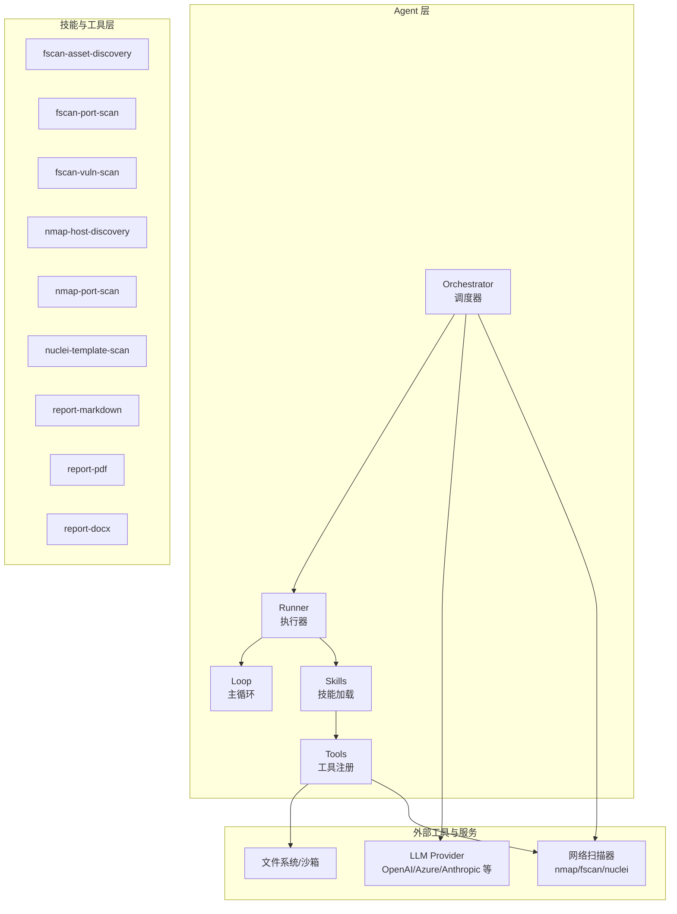
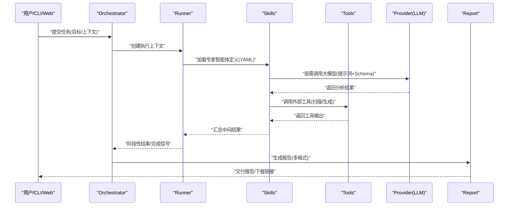
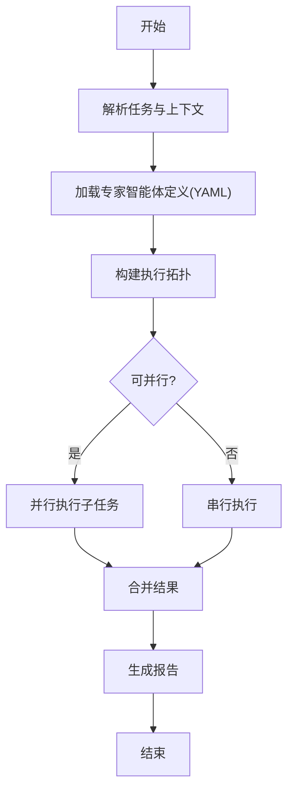
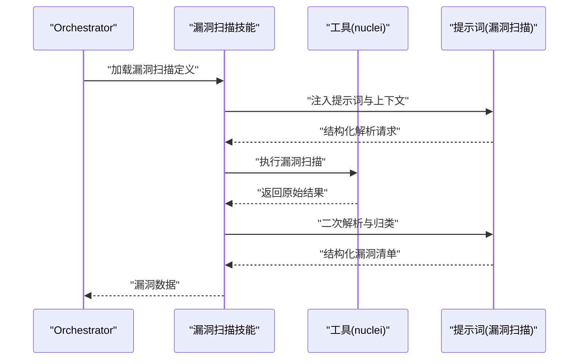
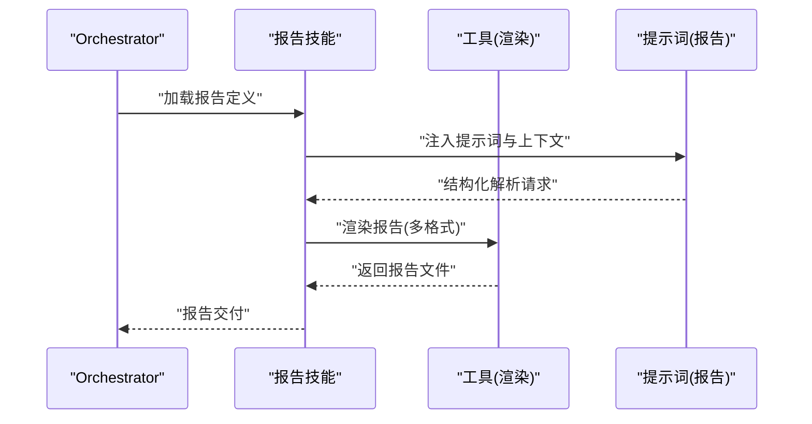
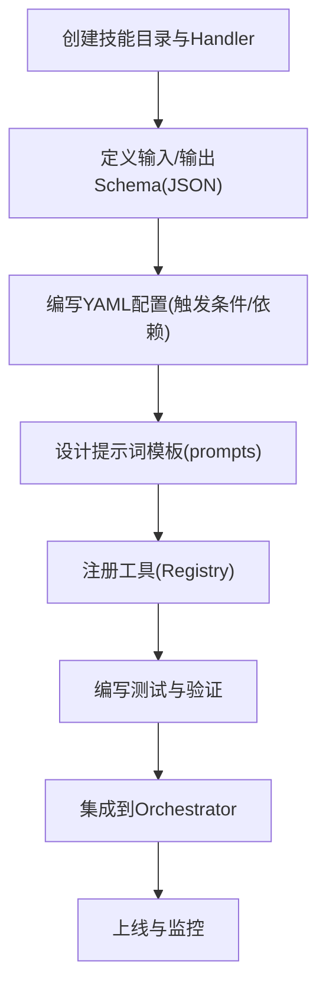
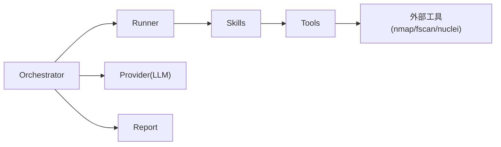

# 专家智能体系统

<cite>
**本文引用的文件**
- [secbot/agents/orchestrator.py](file://secbot/agents/orchestrator.py)
- [secbot/agents/asset_discovery.yaml](file://secbot/agents/asset_discovery.yaml)
- [secbot/agents/port_scan.yaml](file://secbot/agents/port_scan.yaml)
- [secbot/agents/vuln_scan.yaml](file://secbot/agents/vuln_scan.yaml)
- [secbot/agents/weak_password.yaml](file://secbot/agents/weak_password.yaml)
- [secbot/agents/report.yaml](file://secbot/agents/report.yaml)
- [secbot/agents/prompts/asset_discovery.md](file://secbot/agents/prompts/asset_discovery.md)
- [secbot/agents/prompts/port_scan.md](file://secbot/agents/prompts/port_scan.md)
- [secbot/agents/prompts/vuln_scan.md](file://secbot/agents/prompts/vuln_scan.md)
- [secbot/agents/prompts/weak_password.md](file://secbot/agents/prompts/weak_password.md)
- [secbot/agents/prompts/report.md](file://secbot/agents/prompts/report.md)
- [secbot/skills/fscan-asset-discovery/handler.py](file://secbot/skills/fscan-asset-discovery/handler.py)
- [secbot/skills/fscan-asset-discovery/input.schema.json](file://secbot/skills/fscan-asset-discovery/input.schema.json)
- [secbot/skills/fscan-asset-discovery/output.schema.json](file://secbot/skills/fscan-asset-discovery/output.schema.json)
- [secbot/skills/fscan-port-scan/handler.py](file://secbot/skills/fscan-port-scan/handler.py)
- [secbot/skills/fscan-port-scan/input.schema.json](file://secbot/skills/fscan-port-scan/input.schema.json)
- [secbot/skills/fscan-port-scan/output.schema.json](file://secbot/skills/fscan-port-scan/output.schema.json)
- [secbot/skills/fscan-vuln-scan/handler.py](file://secbot/skills/fscan-vuln-scan/handler.py)
- [secbot/skills/fscan-vuln-scan/input.schema.json](file://secbot/skills/fscan-vuln-scan/input.schema.json)
- [secbot/skills/fscan-vuln-scan/output.schema.json](file://secbot/skills/fscan-vuln-scan/output.schema.json)
- [secbot/skills/nmap-host-discovery/handler.py](file://secbot/skills/nmap-host-discovery/handler.py)
- [secbot/skills/nmap-host-discovery/input.schema.json](file://secbot/skills/nmap-host-discovery/input.schema.json)
- [secbot/skills/nmap-host-discovery/output.schema.json](file://secbot/skills/nmap-host-discovery/output.schema.json)
- [secbot/skills/nmap-port-scan/handler.py](file://secbot/skills/nmap-port-scan/handler.py)
- [secbot/skills/nmap-port-scan/input.schema.json](file://secbot/skills/nmap-port-scan/input.schema.json)
- [secbot/skills/nmap-port-scan/output.schema.json](file://secbot/skills/nmap-port-scan/output.schema.json)
- [secbot/skills/nuclei-template-scan/handler.py](file://secbot/skills/nuclei-template-scan/handler.py)
- [secbot/skills/nuclei-template-scan/input.schema.json](file://secbot/skills/nuclei-template-scan/input.schema.json)
- [secbot/skills/nuclei-template-scan/output.schema.json](file://secbot/skills/nuclei-template-scan/output.schema.json)
- [secbot/skills/report-markdown/handler.py](file://secbot/skills/report-markdown/handler.py)
- [secbot/skills/report-markdown/input.schema.json](file://secbot/skills/report-markdown/input.schema.json)
- [secbot/skills/report-markdown/output.schema.json](file://secbot/skills/report-markdown/output.schema.json)
- [secbot/skills/report-pdf/handler.py](file://secbot/skills/report-pdf/handler.py)
- [secbot/skills/report-pdf/input.schema.json](file://secbot/skills/report-pdf/input.schema.json)
- [secbot/skills/report-pdf/output.schema.json](file://secbot/skills/report-pdf/output.schema.json)
- [secbot/skills/report-docx/handler.py](file://secbot/skills/report-docx/handler.py)
- [secbot/skills/report-docx/input.schema.json](file://secbot/skills/report-docx/input.schema.json)
- [secbot/skills/report-docx/output.schema.json](file://secbot/skills/report-docx/output.schema.json)
- [secbot/agent/tools/registry.py](file://secbot/agent/tools/registry.py)
- [secbot/agent/tools/base.py](file://secbot/agent/tools/base.py)
- [secbot/agent/tools/schema.py](file://secbot/agent/tools/schema.py)
- [secbot/agent/context.py](file://secbot/agent/context.py)
- [secbot/agent/runner.py](file://secbot/agent/runner.py)
- [secbot/agent/memory.py](file://secbot/agent/memory.py)
- [secbot/agent/skills.py](file://secbot/agent/skills.py)
- [secbot/agent/subagent.py](file://secbot/agent/subagent.py)
- [secbot/agent/loop.py](file://secbot/agent/loop.py)
- [secbot/agent/hook.py](file://secbot/agent/hook.py)
- [secbot/agent/autocompact.py](file://secbot/agent/autocompact.py)
- [secbot/agent/memory.py](file://secbot/agent/memory.py)
- [secbot/command/router.py](file://secbot/command/router.py)
- [secbot/command/builtin.py](file://secbot/command/builtin.py)
- [secbot/cron/service.py](file://secbot/cron/service.py)
- [secbot/cron/types.py](file://secbot/cron/types.py)
- [secbot/bus/events.py](file://secbot/bus/events.py)
- [secbot/bus/queue.py](file://secbot/bus/queue.py)
- [secbot/channels/manager.py](file://secbot/channels/manager.py)
- [secbot/channels/registry.py](file://secbot/channels/registry.py)
- [secbot/channels/websocket.py](file://secbot/channels/websocket.py)
- [secbot/providers/factory.py](file://secbot/providers/factory.py)
- [secbot/providers/registry.py](file://secbot/providers/registry.py)
- [secbot/providers/base.py](file://secbot/providers/base.py)
- [secbot/report/builder.py](file://secbot/report/builder.py)
- [secbot/report/render.py](file://secbot/report/render.py)
- [secbot/utils/prompt_templates.py](file://secbot/utils/prompt_templates.py)
- [secbot/utils/tool_hints.py](file://secbot/utils/tool_hints.py)
- [secbot/utils/helpers.py](file://secbot/utils/helpers.py)
- [secbot/utils/logging_bridge.py](file://secbot/utils/logging_bridge.py)
- [secbot/security/network.py](file://secbot/security/network.py)
- [secbot/cmdb/models.py](file://secbot/cmdb/models.py)
- [secbot/cmdb/db.py](file://secbot/cmdb/db.py)
- [secbot/cli/commands.py](file://secbot/cli/commands.py)
- [secbot/cli/stream.py](file://secbot/cli/stream.py)
- [secbot/api/server.py](file://secbot/api/server.py)
- [secbot/web/__init__.py](file://secbot/web/__init__.py)
- [secbot/__init__.py](file://secbot/__init__.py)
- [secbot/secbot.py](file://secbot/secbot.py)
- [README.md](file://README.md)
</cite>

## 目录
1. [简介](#简介)
2. [项目结构](#项目结构)
3. [核心组件](#核心组件)
4. [架构总览](#架构总览)
5. [详细组件分析](#详细组件分析)
6. [依赖关系分析](#依赖关系分析)
7. [性能考虑](#性能考虑)
8. [故障排查指南](#故障排查指南)
9. [结论](#结论)
10. [附录](#附录)

## 简介
本文件面向“专家智能体系统”的使用者与开发者，系统性阐述 Orchestration 调度器的设计原理与实现机制，覆盖任务规划、动态编排与专家智能体选择策略；深入解析内置专家智能体（资产探测、端口扫描、漏洞扫描、弱口令检测、报告生成）的功能特性、输入输出 Schema、触发条件与工具依赖；并提供专家智能体的开发指南与扩展流程，包括 YAML 配置、提示词设计与工具集成；最后给出性能优化建议与最佳实践。

## 项目结构
系统采用模块化分层组织，围绕“Agent + Skills + Tools + Providers + Channels + Bus + Report”等核心子系统构建。SecBot 子系统位于 secbot/ 下，包含 Agent 调度、技能与工具、命令路由、定时任务、事件总线、通道管理、报告渲染等功能模块；Web 与 CLI 提供用户交互入口；CMDB 提供资产与配置持久化能力。

图表来源
- [secbot/agents/orchestrator.py](file://secbot/agents/orchestrator.py)
- [secbot/agent/runner.py](file://secbot/agent/runner.py)
- [secbot/agent/skills.py](file://secbot/agent/skills.py)
- [secbot/agent/tools/registry.py](file://secbot/agent/tools/registry.py)
- [secbot/skills/fscan-asset-discovery/handler.py](file://secbot/skills/fscan-asset-discovery/handler.py)
- [secbot/skills/fscan-port-scan/handler.py](file://secbot/skills/fscan-port-scan/handler.py)
- [secbot/skills/fscan-vuln-scan/handler.py](file://secbot/skills/fscan-vuln-scan/handler.py)
- [secbot/skills/nmap-host-discovery/handler.py](file://secbot/skills/nmap-host-discovery/handler.py)
- [secbot/skills/nmap-port-scan/handler.py](file://secbot/skills/nmap-port-scan/handler.py)
- [secbot/skills/nuclei-template-scan/handler.py](file://secbot/skills/nuclei-template-scan/handler.py)
- [secbot/skills/report-markdown/handler.py](file://secbot/skills/report-markdown/handler.py)
- [secbot/skills/report-pdf/handler.py](file://secbot/skills/report-pdf/handler.py)
- [secbot/skills/report-docx/handler.py](file://secbot/skills/report-docx/handler.py)

章节来源
- [secbot/agents/orchestrator.py](file://secbot/agents/orchestrator.py)
- [secbot/agent/runner.py](file://secbot/agent/runner.py)
- [secbot/agent/skills.py](file://secbot/agent/skills.py)
- [secbot/agent/tools/registry.py](file://secbot/agent/tools/registry.py)

## 核心组件
- Orchestrator 调度器：负责接收任务请求、解析目标与上下文、选择合适的专家智能体、编排执行顺序、处理结果与异常，并驱动后续动作（如生成报告）。
- Runner 执行器：承载单次任务的生命周期，协调技能加载、工具调用、上下文注入与内存管理。
- Skills 技能系统：以 YAML 描述专家智能体的能力边界、触发条件、输入输出 Schema 与提示词模板；由 Handler 实现具体逻辑。
- Tools 工具注册中心：统一注册与发现工具，校验输入输出 Schema，提供安全沙箱与平台适配。
- Providers 大模型服务工厂：抽象不同供应商的接口差异，统一流程与错误处理。
- Channels 通道与 Bus 事件总线：提供多通道接入与内部事件分发，支撑异步与可观测性。
- Report 报告构建与渲染：根据扫描结果生成多种格式报告（Markdown/PDF/DOCX）。

章节来源
- [secbot/agents/orchestrator.py](file://secbot/agents/orchestrator.py)
- [secbot/agent/runner.py](file://secbot/agent/runner.py)
- [secbot/agent/skills.py](file://secbot/agent/skills.py)
- [secbot/agent/tools/registry.py](file://secbot/agent/tools/registry.py)
- [secbot/providers/factory.py](file://secbot/providers/factory.py)
- [secbot/bus/events.py](file://secbot/bus/events.py)
- [secbot/report/builder.py](file://secbot/report/builder.py)
- [secbot/report/render.py](file://secbot/report/render.py)

## 架构总览
下图展示从任务触发到结果产出的关键交互路径，涵盖调度、技能选择、工具调用与报告生成。

图表来源
- [secbot/agents/orchestrator.py](file://secbot/agents/orchestrator.py)
- [secbot/agent/runner.py](file://secbot/agent/runner.py)
- [secbot/agent/skills.py](file://secbot/agent/skills.py)
- [secbot/agent/tools/registry.py](file://secbot/agent/tools/registry.py)
- [secbot/providers/factory.py](file://secbot/providers/factory.py)
- [secbot/report/builder.py](file://secbot/report/builder.py)
- [secbot/report/render.py](file://secbot/report/render.py)

## 详细组件分析

### Orchestrator 调度器
- 设计原则
  - 任务规划：基于目标与上下文，确定所需专家智能体集合与执行顺序。
  - 动态编排：依据前置步骤结果与失败重试策略，调整后续步骤。
  - 专家选择：通过 YAML 中的触发条件与依赖声明，选择最合适的技能与工具组合。
- 关键职责
  - 接收任务输入，解析目标范围与上下文信息。
  - 加载专家智能体定义，计算依赖与执行拓扑。
  - 协调 Runner 执行，处理异常与回滚。
  - 触发报告生成与交付。
- 典型流程
  - 初始化上下文与内存。
  - 解析 YAML 定义，构建技能图。
  - 串行/并行调度执行。
  - 汇总结果并进入报告阶段。

图表来源
- [secbot/agents/orchestrator.py](file://secbot/agents/orchestrator.py)
- [secbot/agent/skills.py](file://secbot/agent/skills.py)

章节来源
- [secbot/agents/orchestrator.py](file://secbot/agents/orchestrator.py)

### 内置专家智能体总览
- 资产探测：识别目标网络中的主机与服务，支持 fscan 与 nmap 两种实现。
- 端口扫描：对目标主机进行端口开放性扫描，支持 fscan 与 nmap。
- 漏洞扫描：基于模板引擎（nuclei）对已知漏洞进行检测。
- 弱口令检测：对常见服务进行弱口令验证（示例中未直接暴露该技能，但可通过工具链组合实现）。
- 报告生成：将扫描结果渲染为 Markdown/PDF/DOCX 多格式报告。

章节来源
- [secbot/agents/asset_discovery.yaml](file://secbot/agents/asset_discovery.yaml)
- [secbot/agents/port_scan.yaml](file://secbot/agents/port_scan.yaml)
- [secbot/agents/vuln_scan.yaml](file://secbot/agents/vuln_scan.yaml)
- [secbot/agents/weak_password.yaml](file://secbot/agents/weak_password.yaml)
- [secbot/agents/report.yaml](file://secbot/agents/report.yaml)

### 资产探测专家智能体
- 功能特性
  - 支持 fscan 与 nmap 两种实现，分别对应不同的输入输出 Schema 与触发条件。
  - 输出包含主机列表、主机指纹、开放服务等。
- 输入输出 Schema
  - fscan 实现：输入/输出 Schema 定义在对应技能目录的 JSON 文件中。
  - nmap 实现：输入/输出 Schema 定义在对应技能目录的 JSON 文件中。
- 触发条件
  - 当任务目标为网络段或域名时自动触发。
  - 可与端口扫描联动，复用资产探测结果。
- 工具依赖
  - fscan 或 nmap 命令行工具。
  - Shell 工具用于执行命令与结果解析。
- 提示词设计
  - 提示词模板位于 prompts 目录，指导 LLM 对原始扫描结果进行结构化解析与归类。

图表来源
- [secbot/agents/asset_discovery.yaml](file://secbot/agents/asset_discovery.yaml)
- [secbot/agents/prompts/asset_discovery.md](file://secbot/agents/prompts/asset_discovery.md)
- [secbot/skills/fscan-asset-discovery/handler.py](file://secbot/skills/fscan-asset-discovery/handler.py)
- [secbot/skills/nmap-host-discovery/handler.py](file://secbot/skills/nmap-host-discovery/handler.py)
- [secbot/skills/fscan-asset-discovery/input.schema.json](file://secbot/skills/fscan-asset-discovery/input.schema.json)
- [secbot/skills/fscan-asset-discovery/output.schema.json](file://secbot/skills/fscan-asset-discovery/output.schema.json)
- [secbot/skills/nmap-host-discovery/input.schema.json](file://secbot/skills/nmap-host-discovery/input.schema.json)
- [secbot/skills/nmap-host-discovery/output.schema.json](file://secbot/skills/nmap-host-discovery/output.schema.json)

章节来源
- [secbot/agents/asset_discovery.yaml](file://secbot/agents/asset_discovery.yaml)
- [secbot/agents/prompts/asset_discovery.md](file://secbot/agents/prompts/asset_discovery.md)
- [secbot/skills/fscan-asset-discovery/handler.py](file://secbot/skills/fscan-asset-discovery/handler.py)
- [secbot/skills/nmap-host-discovery/handler.py](file://secbot/skills/nmap-host-discovery/handler.py)
- [secbot/skills/fscan-asset-discovery/input.schema.json](file://secbot/skills/fscan-asset-discovery/input.schema.json)
- [secbot/skills/fscan-asset-discovery/output.schema.json](file://secbot/skills/fscan-asset-discovery/output.schema.json)
- [secbot/skills/nmap-host-discovery/input.schema.json](file://secbot/skills/nmap-host-discovery/input.schema.json)
- [secbot/skills/nmap-host-discovery/output.schema.json](file://secbot/skills/nmap-host-discovery/output.schema.json)

### 端口扫描专家智能体
- 功能特性
  - 对资产探测阶段发现的目标主机进行端口扫描。
  - 支持 fscan 与 nmap 两种实现，具备一致的输入输出 Schema。
- 输入输出 Schema
  - 输入：目标主机列表或 CIDR。
  - 输出：主机端口开放情况、服务指纹、协议类型等。
- 触发条件
  - 在资产探测完成后自动触发。
  - 可与漏洞扫描联动，复用端口扫描结果。
- 工具依赖
  - fscan 或 nmap 命令行工具。
  - Shell 工具执行命令与结果解析。
- 提示词设计
  - 提示词模板位于 prompts 目录，指导 LLM 对原始端口扫描结果进行结构化解析与归类。

图表来源
- [secbot/agents/port_scan.yaml](file://secbot/agents/port_scan.yaml)
- [secbot/agents/prompts/port_scan.md](file://secbot/agents/prompts/port_scan.md)
- [secbot/skills/fscan-port-scan/handler.py](file://secbot/skills/fscan-port-scan/handler.py)
- [secbot/skills/nmap-port-scan/handler.py](file://secbot/skills/nmap-port-scan/handler.py)
- [secbot/skills/fscan-port-scan/input.schema.json](file://secbot/skills/fscan-port-scan/input.schema.json)
- [secbot/skills/fscan-port-scan/output.schema.json](file://secbot/skills/fscan-port-scan/output.schema.json)
- [secbot/skills/nmap-port-scan/input.schema.json](file://secbot/skills/nmap-port-scan/input.schema.json)
- [secbot/skills/nmap-port-scan/output.schema.json](file://secbot/skills/nmap-port-scan/output.schema.json)

章节来源
- [secbot/agents/port_scan.yaml](file://secbot/agents/port_scan.yaml)
- [secbot/agents/prompts/port_scan.md](file://secbot/agents/prompts/port_scan.md)
- [secbot/skills/fscan-port-scan/handler.py](file://secbot/skills/fscan-port-scan/handler.py)
- [secbot/skills/nmap-port-scan/handler.py](file://secbot/skills/nmap-port-scan/handler.py)
- [secbot/skills/fscan-port-scan/input.schema.json](file://secbot/skills/fscan-port-scan/input.schema.json)
- [secbot/skills/fscan-port-scan/output.schema.json](file://secbot/skills/fscan-port-scan/output.schema.json)
- [secbot/skills/nmap-port-scan/input.schema.json](file://secbot/skills/nmap-port-scan/input.schema.json)
- [secbot/skills/nmap-port-scan/output.schema.json](file://secbot/skills/nmap-port-scan/output.schema.json)

### 漏洞扫描专家智能体
- 功能特性
  - 基于模板引擎（nuclei）对目标主机的服务进行漏洞检测。
  - 支持自定义模板与规则集。
- 输入输出 Schema
  - 输入：目标主机与端口、模板路径或标签。
  - 输出：漏洞条目、严重级别、影响描述、修复建议等。
- 触发条件
  - 在端口扫描后自动触发，或手动指定模板集。
- 工具依赖
  - nuclei 命令行工具。
  - Shell 工具执行命令与结果解析。
- 提示词设计
  - 提示词模板位于 prompts 目录，指导 LLM 对原始漏洞扫描结果进行结构化解析与风险分级。

图表来源
- [secbot/agents/vuln_scan.yaml](file://secbot/agents/vuln_scan.yaml)
- [secbot/agents/prompts/vuln_scan.md](file://secbot/agents/prompts/vuln_scan.md)
- [secbot/skills/nuclei-template-scan/handler.py](file://secbot/skills/nuclei-template-scan/handler.py)
- [secbot/skills/nuclei-template-scan/input.schema.json](file://secbot/skills/nuclei-template-scan/input.schema.json)
- [secbot/skills/nuclei-template-scan/output.schema.json](file://secbot/skills/nuclei-template-scan/output.schema.json)

章节来源
- [secbot/agents/vuln_scan.yaml](file://secbot/agents/vuln_scan.yaml)
- [secbot/agents/prompts/vuln_scan.md](file://secbot/agents/prompts/vuln_scan.md)
- [secbot/skills/nuclei-template-scan/handler.py](file://secbot/skills/nuclei-template-scan/handler.py)
- [secbot/skills/nuclei-template-scan/input.schema.json](file://secbot/skills/nuclei-template-scan/input.schema.json)
- [secbot/skills/nuclei-template-scan/output.schema.json](file://secbot/skills/nuclei-template-scan/output.schema.json)

### 弱口令检测专家智能体
- 功能特性
  - 对常见服务（SSH、FTP、数据库等）进行弱口令验证。
  - 可与资产探测/端口扫描结果联动，限定目标范围。
- 输入输出 Schema
  - 输入：目标主机、端口、用户名/密码字典。
  - 输出：认证成功记录、失败原因、服务类型等。
- 触发条件
  - 在端口扫描后自动触发，或手动指定目标与凭证集。
- 工具依赖
  - 可使用 SSH/FTP 登录工具或脚本。
  - Shell 工具执行命令与结果解析。
- 提示词设计
  - 提示词模板位于 prompts 目录，指导 LLM 对认证结果进行结构化解析与风险评估。

章节来源
- [secbot/agents/weak_password.yaml](file://secbot/agents/weak_password.yaml)
- [secbot/agents/prompts/weak_password.md](file://secbot/agents/prompts/weak_password.md)

### 报告生成专家智能体
- 功能特性
  - 将扫描与检测结果整合为多格式报告（Markdown/PDF/DOCX）。
  - 支持自定义模板与样式。
- 输入输出 Schema
  - 输入：资产清单、端口开放情况、漏洞条目、弱口令结果等。
  - 输出：报告文件或下载链接。
- 触发条件
  - 在所有扫描与检测完成后自动触发。
- 工具依赖
  - 报告渲染工具（Markdown/PDF/DOCX）。
- 提示词设计
  - 提示词模板位于 prompts 目录，指导 LLM 对最终数据进行摘要与结构化呈现。

图表来源
- [secbot/agents/report.yaml](file://secbot/agents/report.yaml)
- [secbot/agents/prompts/report.md](file://secbot/agents/prompts/report.md)
- [secbot/skills/report-markdown/handler.py](file://secbot/skills/report-markdown/handler.py)
- [secbot/skills/report-pdf/handler.py](file://secbot/skills/report-pdf/handler.py)
- [secbot/skills/report-docx/handler.py](file://secbot/skills/report-docx/handler.py)
- [secbot/skills/report-markdown/input.schema.json](file://secbot/skills/report-markdown/input.schema.json)
- [secbot/skills/report-markdown/output.schema.json](file://secbot/skills/report-markdown/output.schema.json)
- [secbot/skills/report-pdf/input.schema.json](file://secbot/skills/report-pdf/input.schema.json)
- [secbot/skills/report-pdf/output.schema.json](file://secbot/skills/report-pdf/output.schema.json)
- [secbot/skills/report-docx/input.schema.json](file://secbot/skills/report-docx/input.schema.json)
- [secbot/skills/report-docx/output.schema.json](file://secbot/skills/report-docx/output.schema.json)

章节来源
- [secbot/agents/report.yaml](file://secbot/agents/report.yaml)
- [secbot/agents/prompts/report.md](file://secbot/agents/prompts/report.md)
- [secbot/skills/report-markdown/handler.py](file://secbot/skills/report-markdown/handler.py)
- [secbot/skills/report-pdf/handler.py](file://secbot/skills/report-pdf/handler.py)
- [secbot/skills/report-docx/handler.py](file://secbot/skills/report-docx/handler.py)
- [secbot/skills/report-markdown/input.schema.json](file://secbot/skills/report-markdown/input.schema.json)
- [secbot/skills/report-markdown/output.schema.json](file://secbot/skills/report-markdown/output.schema.json)
- [secbot/skills/report-pdf/input.schema.json](file://secbot/skills/report-pdf/input.schema.json)
- [secbot/skills/report-pdf/output.schema.json](file://secbot/skills/report-pdf/output.schema.json)
- [secbot/skills/report-docx/input.schema.json](file://secbot/skills/report-docx/input.schema.json)
- [secbot/skills/report-docx/output.schema.json](file://secbot/skills/report-docx/output.schema.json)

### 工具与提示词体系
- 工具注册与基类
  - 工具注册中心统一管理工具元数据与执行约束。
  - 工具基类提供输入输出 Schema 校验、沙箱执行与平台适配。
- 提示词模板
  - 提示词模板集中于 utils 与 agents/prompts，指导 LLM 进行结构化解析与风险评估。
- 工具依赖
  - Shell 工具用于执行外部命令。
  - Sandbox 工具提供受限执行环境。
  - Web/Message 等工具用于网络抓取与消息传递。

章节来源
- [secbot/agent/tools/registry.py](file://secbot/agent/tools/registry.py)
- [secbot/agent/tools/base.py](file://secbot/agent/tools/base.py)
- [secbot/agent/tools/schema.py](file://secbot/agent/tools/schema.py)
- [secbot/utils/prompt_templates.py](file://secbot/utils/prompt_templates.py)

### 开发指南：扩展新专家智能体
- 步骤一：创建技能目录与 Handler
  - 在 secbot/skills/ 下新建目录，实现 handler.py 并导出执行函数。
  - 定义输入/输出 Schema（JSON），确保字段覆盖完整。
- 步骤二：编写 YAML 配置
  - 在 secbot/agents/ 下新增 YAML 文件，声明技能名称、触发条件、依赖与提示词引用。
  - 明确输入输出与执行顺序。
- 步骤三：设计提示词
  - 在 secbot/agents/prompts/ 下新增提示词文件，指导 LLM 结构化解析与风险评估。
- 步骤四：注册工具与测试
  - 在工具注册中心注册新工具，确保输入输出 Schema 与平台兼容。
  - 编写单元测试与集成测试，验证执行链路。
- 步骤五：集成到 Orchestrator
  - 在 Orchestrator 中更新任务规划与编排逻辑，确保新技能被正确调度。

图表来源
- [secbot/agent/tools/registry.py](file://secbot/agent/tools/registry.py)
- [secbot/agent/skills.py](file://secbot/agent/skills.py)
- [secbot/agents/orchestrator.py](file://secbot/agents/orchestrator.py)

章节来源
- [secbot/agent/tools/registry.py](file://secbot/agent/tools/registry.py)
- [secbot/agent/skills.py](file://secbot/agent/skills.py)
- [secbot/agents/orchestrator.py](file://secbot/agents/orchestrator.py)

## 依赖关系分析
- 组件耦合
  - Orchestrator 与 Runner 低耦合，通过 YAML 与上下文解耦。
  - Skills 与 Tools 通过 Schema 与注册中心耦合，便于替换与扩展。
  - Providers 与 Tools 通过统一接口耦合，屏蔽供应商差异。
- 外部依赖
  - 大模型服务（OpenAI/Azure/Anthropic 等）通过 Provider 工厂统一接入。
  - 扫描工具（nmap/fscan/nuclei）通过 Shell 工具与沙箱执行。
- 潜在环路
  - YAML 中的依赖声明应避免循环引用；建议在加载阶段进行拓扑检查。

图表来源
- [secbot/agents/orchestrator.py](file://secbot/agents/orchestrator.py)
- [secbot/agent/runner.py](file://secbot/agent/runner.py)
- [secbot/agent/skills.py](file://secbot/agent/skills.py)
- [secbot/agent/tools/registry.py](file://secbot/agent/tools/registry.py)
- [secbot/providers/factory.py](file://secbot/providers/factory.py)
- [secbot/report/builder.py](file://secbot/report/builder.py)

章节来源
- [secbot/agents/orchestrator.py](file://secbot/agents/orchestrator.py)
- [secbot/agent/runner.py](file://secbot/agent/runner.py)
- [secbot/agent/skills.py](file://secbot/agent/skills.py)
- [secbot/agent/tools/registry.py](file://secbot/agent/tools/registry.py)
- [secbot/providers/factory.py](file://secbot/providers/factory.py)

## 性能考虑
- 并行化策略
  - 对无依赖的技能（如多个主机的端口扫描）进行并行执行，缩短总时长。
  - 合理设置并发度上限，避免资源争用与超时。
- 缓存与增量
  - 对重复目标启用缓存，避免重复扫描。
  - 增量扫描仅针对变更项，减少全量扫描开销。
- 资源隔离
  - 使用沙箱与限额控制工具执行时间与内存占用。
  - 对外部工具设置超时与重试策略。
- LLM 优化
  - 控制提示词长度与上下文窗口，减少 Token 消耗。
  - 使用结构化输出 Schema，降低解析成本。
- 报告渲染
  - 分页与分块渲染，避免一次性加载大量数据。
  - 优先生成轻量格式（Markdown）作为中间态。

## 故障排查指南
- 常见问题
  - 工具不可用：检查外部工具是否安装、权限与路径配置。
  - Schema 不匹配：核对输入输出 JSON Schema，确保字段齐全。
  - LLM 返回异常：检查提示词完整性与上下文截断。
  - 并发冲突：调整并发度或增加限流策略。
- 调试建议
  - 启用详细日志与事件追踪，定位阻塞点。
  - 使用最小化任务复现问题，逐步缩小范围。
  - 校验 YAML 语法与依赖拓扑，避免循环引用。
- 监控指标
  - 执行时延、失败率、Token 消耗、资源占用。
  - 报告生成成功率与格式一致性。

章节来源
- [secbot/utils/logging_bridge.py](file://secbot/utils/logging_bridge.py)
- [secbot/agent/tools/schema.py](file://secbot/agent/tools/schema.py)
- [secbot/agent/tools/registry.py](file://secbot/agent/tools/registry.py)

## 结论
本系统通过 Orchestrator 的任务规划与动态编排，结合标准化的专家智能体与工具体系，实现了从资产探测到报告生成的自动化闭环。借助 YAML 配置与提示词模板，系统具备良好的可扩展性与可维护性。建议在生产环境中强化并行化、缓存与资源隔离策略，持续优化 LLM 与工具链的协同效率。

## 附录
- 快速参考
  - Orchestrator：任务规划与编排入口。
  - Skills：YAML 定义 + Handler 实现。
  - Tools：统一注册与执行，支持 Schema 校验与沙箱。
  - Providers：统一大模型接入与错误处理。
  - Report：多格式报告生成与交付。
- 相关文件索引
  - secbot/agents/orchestrator.py
  - secbot/agent/runner.py
  - secbot/agent/skills.py
  - secbot/agent/tools/registry.py
  - secbot/agent/tools/base.py
  - secbot/agent/tools/schema.py
  - secbot/providers/factory.py
  - secbot/report/builder.py
  - secbot/report/render.py
  - secbot/utils/prompt_templates.py
  - secbot/utils/tool_hints.py
  - secbot/utils/helpers.py
  - secbot/utils/logging_bridge.py
  - secbot/security/network.py
  - secbot/cmdb/models.py
  - secbot/cmdb/db.py
  - secbot/cli/commands.py
  - secbot/cli/stream.py
  - secbot/api/server.py
  - secbot/web/__init__.py
  - secbot/__init__.py
  - secbot/secbot.py
  - README.md