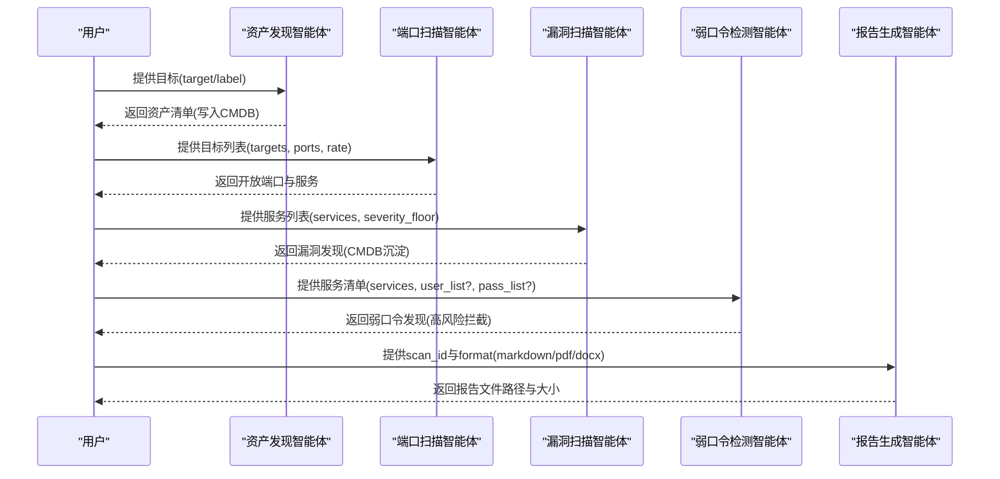
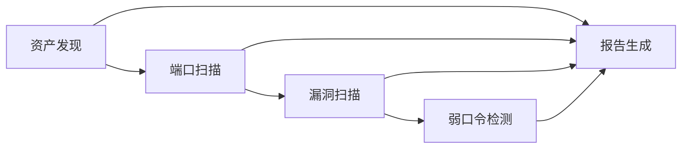

# 内置专家智能体

<cite>
**本文引用的文件**
- [secbot/agents/asset_discovery.yaml](file://secbot/agents/asset_discovery.yaml)
- [secbot/agents/port_scan.yaml](file://secbot/agents/port_scan.yaml)
- [secbot/agents/vuln_scan.yaml](file://secbot/agents/vuln_scan.yaml)
- [secbot/agents/weak_password.yaml](file://secbot/agents/weak_password.yaml)
- [secbot/agents/report.yaml](file://secbot/agents/report.yaml)
- [secbot/agents/prompts/asset_discovery.md](file://secbot/agents/prompts/asset_discovery.md)
- [secbot/agents/prompts/port_scan.md](file://secbot/agents/prompts/port_scan.md)
- [secbot/agents/prompts/vuln_scan.md](file://secbot/agents/prompts/vuln_scan.md)
- [secbot/agents/prompts/weak_password.md](file://secbot/agents/prompts/weak_password.md)
- [secbot/agents/prompts/report.md](file://secbot/agents/prompts/report.md)
- [secbot/skills/fscan-asset-discovery/input.schema.json](file://secbot/skills/fscan-asset-discovery/input.schema.json)
- [secbot/skills/fscan-asset-discovery/output.schema.json](file://secbot/skills/fscan-asset-discovery/output.schema.json)
- [secbot/skills/nmap-port-scan/input.schema.json](file://secbot/skills/nmap-port-scan/input.schema.json)
- [secbot/skills/nmap-port-scan/output.schema.json](file://secbot/skills/nmap-port-scan/output.schema.json)
- [secbot/skills/nuclei-template-scan/input.schema.json](file://secbot/skills/nuclei-template-scan/input.schema.json)
</cite>

## 目录
1. [简介](#简介)
2. [项目结构](#项目结构)
3. [核心组件](#核心组件)
4. [架构总览](#架构总览)
5. [详细组件分析](#详细组件分析)
6. [依赖关系分析](#依赖关系分析)
7. [性能考量](#性能考量)
8. [故障排查指南](#故障排查指南)
9. [结论](#结论)
10. [附录](#附录)

## 简介
本文件系统化梳理并说明内置专家智能体的体系与用法，覆盖以下五个专家智能体：
- 资产发现智能体：负责在目标网段/地址范围内探测存活主机与基础资产清单，并写入本地CMDB。
- 端口扫描智能体：对资产发现结果进行端口枚举与服务指纹识别，产出开放端口与服务信息。
- 漏洞扫描智能体：基于模板与特征的漏洞扫描，结合严重度阈值筛选，沉淀至CMDB并参与最终报告。
- 弱口令检测智能体：针对认证类服务（SSH、FTP、RDP等）进行弱口令探测，具备高风险拦截与用户确认机制。
- 报告生成智能体：从CMDB数据渲染多种格式报告（Markdown、DOCX、PDF），以Markdown为中间产物。

每个智能体均提供：
- YAML配置结构说明
- 输入/输出Schema
- 触发条件与执行顺序
- 工具依赖关系
- 参数调优与最佳实践

## 项目结构
内置专家智能体由“智能体配置 + 提示词 + 技能工具”三部分组成：
- 智能体配置：位于 secbot/agents/*.yaml，定义名称、描述、系统提示文件、可用技能集合、最大迭代次数、输入输出Schema等。
- 提示词：位于 secbot/agents/prompts/*.md，定义智能体的流程步骤、工具使用策略与输出约束。
- 技能工具：位于 secbot/skills/*/，包含具体可调用工具及其输入/输出JSON Schema。

```mermaid
graph TB
subgraph "智能体层"
AD["资产发现智能体<br/>asset_discovery.yaml"]
PS["端口扫描智能体<br/>port_scan.yaml"]
VS["漏洞扫描智能体<br/>vuln_scan.yaml"]
WP["弱口令检测智能体<br/>weak_password.yaml"]
RP["报告生成智能体<br/>report.yaml"]
end
subgraph "提示词"
P_AD["asset_discovery.md"]
P_PS["port_scan.md"]
P_VS["vuln_scan.md"]
P_WP["weak_password.md"]
P_RP["report.md"]
end
subgraph "技能工具"
S_AD1["nmap-host-discovery"]
S_AD2["fscan-asset-discovery"]
S_AD3["masscan-discovery"]
S_AD4["cmdb-add-target / cmdb-list-assets / cmdb-history-query"]
S_PS1["nmap-port-scan"]
S_PS2["nmap-service-fingerprint"]
S_PS3["fscan-port-scan"]
S_VS1["nuclei-template-scan"]
S_VS2["fscan-vuln-scan"]
S_WP1["hydra-bruteforce"]
S_WP2["fscan-weak-password"]
S_RP1["report-markdown"]
S_RP2["report-pdf"]
S_RP3["report-docx"]
end
AD --> P_AD
PS --> P_PS
VS --> P_VS
WP --> P_WP
RP --> P_RP
AD --> S_AD1
AD --> S_AD2
AD --> S_AD3
AD --> S_AD4
PS --> S_PS1
PS --> S_PS2
PS --> S_PS3
VS --> S_VS1
VS --> S_VS2
WP --> S_WP1
WP --> S_WP2
RP --> S_RP1
RP --> S_RP2
RP --> S_RP3
```

图表来源
- [secbot/agents/asset_discovery.yaml:1-46](file://secbot/agents/asset_discovery.yaml#L1-L46)
- [secbot/agents/port_scan.yaml:1-50](file://secbot/agents/port_scan.yaml#L1-L50)
- [secbot/agents/vuln_scan.yaml:1-53](file://secbot/agents/vuln_scan.yaml#L1-L53)
- [secbot/agents/weak_password.yaml:1-53](file://secbot/agents/weak_password.yaml#L1-L53)
- [secbot/agents/report.yaml:1-39](file://secbot/agents/report.yaml#L1-L39)
- [secbot/agents/prompts/asset_discovery.md:1-28](file://secbot/agents/prompts/asset_discovery.md#L1-L28)
- [secbot/agents/prompts/port_scan.md:1-24](file://secbot/agents/prompts/port_scan.md#L1-L24)
- [secbot/agents/prompts/vuln_scan.md:1-24](file://secbot/agents/prompts/vuln_scan.md#L1-L24)
- [secbot/agents/prompts/weak_password.md:1-28](file://secbot/agents/prompts/weak_password.md#L1-L28)
- [secbot/agents/prompts/report.md:1-19](file://secbot/agents/prompts/report.md#L1-L19)

章节来源
- [secbot/agents/asset_discovery.yaml:1-46](file://secbot/agents/asset_discovery.yaml#L1-L46)
- [secbot/agents/port_scan.yaml:1-50](file://secbot/agents/port_scan.yaml#L1-L50)
- [secbot/agents/vuln_scan.yaml:1-53](file://secbot/agents/vuln_scan.yaml#L1-L53)
- [secbot/agents/weak_password.yaml:1-53](file://secbot/agents/weak_password.yaml#L1-L53)
- [secbot/agents/report.yaml:1-39](file://secbot/agents/report.yaml#L1-L39)

## 核心组件
- 资产发现智能体：面向CIDR/IP/域名目标，选择合适主机发现技能，将发现的资产写入CMDB；输出标准化资产清单。
- 端口扫描智能体：接收资产发现输出的目标列表，按规模与速率策略选择扫描工具，输出开放端口与服务信息。
- 漏洞扫描智能体：对端口扫描输出的服务进行模板/特征扫描，按严重度阈值过滤，沉淀至CMDB。
- 弱口令检测智能体：对指定服务进行弱口令探测，所有技能均为高风险，需用户确认；严格限制扩展范围与锁定策略。
- 报告生成智能体：以Markdown为中间格式，导出DOCX/PDF；输出文件路径与大小。

章节来源
- [secbot/agents/asset_discovery.yaml:1-46](file://secbot/agents/asset_discovery.yaml#L1-L46)
- [secbot/agents/port_scan.yaml:1-50](file://secbot/agents/port_scan.yaml#L1-L50)
- [secbot/agents/vuln_scan.yaml:1-53](file://secbot/agents/vuln_scan.yaml#L1-L53)
- [secbot/agents/weak_password.yaml:1-53](file://secbot/agents/weak_password.yaml#L1-L53)
- [secbot/agents/report.yaml:1-39](file://secbot/agents/report.yaml#L1-L39)

## 架构总览
下图展示五个专家智能体之间的顺序依赖与数据流转：

图表来源
- [secbot/agents/asset_discovery.yaml:1-46](file://secbot/agents/asset_discovery.yaml#L1-L46)
- [secbot/agents/port_scan.yaml:1-50](file://secbot/agents/port_scan.yaml#L1-L50)
- [secbot/agents/vuln_scan.yaml:1-53](file://secbot/agents/vuln_scan.yaml#L1-L53)
- [secbot/agents/weak_password.yaml:1-53](file://secbot/agents/weak_password.yaml#L1-L53)
- [secbot/agents/report.yaml:1-39](file://secbot/agents/report.yaml#L1-L39)

## 详细组件分析

### 资产发现智能体
- 功能特性
  - 针对不同目标规模选择最优主机发现技能（小网段优先nmap，大范围优先masscan，混合场景优先fscan）。
  - 将发现的资产写入CMDB，支持查询与历史扫描对比。
  - 输出标准化资产清单，限制条目数量并分页处理。
- YAML配置要点
  - 名称、显示名、描述、系统提示文件
  - scoped_skills：nmap-host-discovery、fscan-asset-discovery、masscan-discovery、cmdb相关工具
  - max_iterations、emit_plan_steps
  - input_schema：target（必填）、label（可选）
  - output_schema：assets数组，元素含target、kind（cidr/ip/domain）、label
- 触发条件
  - 在端口扫描与漏洞扫描之前运行，确保后续阶段有稳定的资产基线。
- 工具依赖关系
  - 主机发现技能与CMDB读写工具组合使用。
- 使用场景
  - 新项目初始扫描、变更后资产盘点、渗透测试前资产测绘。
- 参数调优与最佳实践
  - 对于/24及更小网段，优先使用nmap-host-discovery以获得更细粒度结果。
  - 大范围扫描时使用masscan提升速度，再由资产发现统一收敛到CMDB。
  - 混合资产类型（IPv4/IPv6、域名）时采用fscan-asset-discovery以增强兼容性。
  - 建议为每次扫描设置label便于追踪与审计。

章节来源
- [secbot/agents/asset_discovery.yaml:1-46](file://secbot/agents/asset_discovery.yaml#L1-L46)
- [secbot/agents/prompts/asset_discovery.md:1-28](file://secbot/agents/prompts/asset_discovery.md#L1-L28)

### 端口扫描智能体
- 功能特性
  - 对资产发现输出的目标进行端口枚举与服务指纹识别。
  - 根据目标规模与速率参数选择nmap或fscan，兼顾精度与并发。
- YAML配置要点
  - scoped_skills：nmap-port-scan、nmap-service-fingerprint、fscan-port-scan
  - input_schema：targets（必填，至少1个）、ports（可选，如"1-1024"或"top-N"）、rate（slow/normal/fast，默认normal）
  - output_schema：services数组，元素含host、port、protocol(tcp/udp)、service、version
- 触发条件
  - 必须在资产发现之后、漏洞扫描之前运行。
- 工具依赖关系
  - 小目标集（≤32）：先nmap-port-scan，再nmap-service-fingerprint。
  - 大目标集：直接fscan-port-scan（内置并行）。
- 使用场景
  - 精准识别Web、数据库、协议类服务；为漏洞扫描提供服务画像。
- 参数调优与最佳实践
  - rate参数控制nmap扫描强度（-T2/-T3/-T4），避免过度扰动目标系统。
  - 默认扫描top-1000端口，若已知业务端口范围可传入ports缩小范围。
  - 大规模扫描优先fscan-port-scan，减少nmap并发压力。

章节来源
- [secbot/agents/port_scan.yaml:1-50](file://secbot/agents/port_scan.yaml#L1-L50)
- [secbot/agents/prompts/port_scan.md:1-24](file://secbot/agents/prompts/port_scan.md#L1-L24)

### 漏洞扫描智能体
- 功能特性
  - 基于模板（nuclei）与指纹（fscan）的漏洞扫描，按严重度阈值过滤。
  - 仅对HTTP/HTTPS与易受攻击协议进行扫描，避免噪声。
  - 发现结果写入CMDB，供报告阶段汇总。
- YAML配置要点
  - scoped_skills：nuclei-template-scan、fscan-vuln-scan
  - input_schema：services（必填，≥1）、severity_floor（info/low/medium/high/critical，默认medium）
  - output_schema：findings数组，元素含host、port、severity、title、cve_id、template
- 触发条件
  - 必须在端口扫描之后运行。
- 工具依赖关系
  - 默认使用nuclei-template-scan（HTTP/HTTPS），当服务列表包含nuclei覆盖不足的协议时叠加fscan-vuln-scan。
- 使用场景
  - 自动化漏洞识别与风险排序；为合规检查与修复计划提供依据。
- 参数调优与最佳实践
  - severity_floor默认medium，仅在需要降低噪声时设为info/low。
  - 对于SMB/RDP等nuclei覆盖有限的协议，建议启用fscan-vuln-scan。
  - 控制findings数量上限，避免下游处理压力。

章节来源
- [secbot/agents/vuln_scan.yaml:1-53](file://secbot/agents/vuln_scan.yaml#L1-L53)
- [secbot/agents/prompts/vuln_scan.md:1-24](file://secbot/agents/prompts/vuln_scan.md#L1-L24)

### 弱口令检测智能体
- 功能特性
  - 针对SSH、FTP、RDP、MySQL、Redis、MSSQL、Postgres、SMB、Telnet等服务进行弱口令探测。
  - 所有技能均为高风险（risk_level=critical），需用户明确确认后方可执行。
  - 严格限制扩展范围，不擅自增加未列出的端口或服务。
- YAML配置要点
  - scoped_skills：hydra-bruteforce、fscan-weak-password
  - input_schema：services（必填，≥1）、user_list（可选）、pass_list（可选）
  - output_schema：findings数组，元素含host、port、service、username、password
- 触发条件
  - 依赖端口扫描输出的认证类服务清单。
- 工具依赖关系
  - 优先使用fscan-weak-password（内置字典，更安全）；仅在用户提供自定义字典时使用hydra-bruteforce。
- 使用场景
  - 安全评估中的凭证脆弱性验证；合规审计中的弱口令识别。
- 参数调优与最佳实践
  - 严格限定输入服务清单，避免扩大攻击面。
  - 用户拒绝高风险操作时必须记录并停止，避免账户锁定。
  - 建议设置每主机最多3次拒绝即停止的锁退策略，保护目标系统。
  - 不要在LLM可见摘要中回显密码内容（通道可能被标记为redacted）。

章节来源
- [secbot/agents/weak_password.yaml:1-53](file://secbot/agents/weak_password.yaml#L1-L53)
- [secbot/agents/prompts/weak_password.md:1-28](file://secbot/agents/prompts/weak_password.md#L1-L28)

### 报告生成智能体
- 功能特性
  - 以Markdown为中间产物，再派生DOCX/PDF；避免重复查询CMDB。
  - 输出包含文件路径、格式与字节数，便于WebUI交付。
- YAML配置要点
  - scoped_skills：report-markdown、report-pdf、report-docx
  - input_schema：scan_id（必填）、format（markdown/pdf/docx）、template（可选）
  - output_schema：path、format、bytes
- 触发条件
  - 在所有扫描完成后运行，读取CMDB数据生成报告。
- 工具依赖关系
  - 先生成Markdown，再根据format选择对应渲染器。
- 使用场景
  - 交付扫描报告、归档与分享。
- 参数调优与最佳实践
  - 优先使用markdown作为中间格式，保证一致性与可编辑性。
  - 如需定制报告样式，提供模板名称以满足组织规范。

章节来源
- [secbot/agents/report.yaml:1-39](file://secbot/agents/report.yaml#L1-L39)
- [secbot/agents/prompts/report.md:1-19](file://secbot/agents/prompts/report.md#L1-L19)

## 依赖关系分析
- 执行顺序
  - 资产发现 → 端口扫描 → 漏洞扫描 → 弱口令检测 → 报告生成
- 数据流
  - 资产发现输出写入CMDB，端口扫描与漏洞扫描读取/写入CMDB，弱口令检测与报告生成基于CMDB数据。
- 工具耦合
  - 各智能体通过scoped_skills声明依赖的技能工具，工具输入/输出遵循JSON Schema约束。

图表来源
- [secbot/agents/asset_discovery.yaml:1-46](file://secbot/agents/asset_discovery.yaml#L1-L46)
- [secbot/agents/port_scan.yaml:1-50](file://secbot/agents/port_scan.yaml#L1-L50)
- [secbot/agents/vuln_scan.yaml:1-53](file://secbot/agents/vuln_scan.yaml#L1-L53)
- [secbot/agents/weak_password.yaml:1-53](file://secbot/agents/weak_password.yaml#L1-L53)
- [secbot/agents/report.yaml:1-39](file://secbot/agents/report.yaml#L1-L39)

## 性能考量
- 资产发现
  - 小网段优先nmap，大范围优先masscan，混合场景优先fscan，平衡准确度与速度。
- 端口扫描
  - 目标数≤32使用nmap-port-scan+service-fingerprint，获取更精细指纹；目标数较大使用fscan-port-scan以提升吞吐。
  - rate参数控制nmap-T等级，避免对目标造成过大影响。
- 漏洞扫描
  - 默认nuclei-template-scan，仅在必要时叠加fscan-vuln-scan，减少重复扫描。
  - 通过severity_floor过滤噪声，控制findings数量上限。
- 弱口令检测
  - 严格限制输入服务清单，避免横向扩展；对同一主机设置拒绝次数上限，防止账户锁定。
- 报告生成
  - 以Markdown为中间格式，避免重复查询CMDB，提高渲染效率。

## 故障排查指南
- 资产发现失败
  - 检查target格式是否合法（CIDR/IP/域名），必要时在提示词逻辑中进行早期校验与错误返回。
  - 若大规模扫描失败，尝试切换到masscan或fscan-asset-discovery。
- 端口扫描无结果
  - 确认目标可达性与防火墙策略；适当放宽ports范围或调整rate。
  - 对于服务指纹缺失的情况，检查nmap-service-fingerprint是否正确执行。
- 漏洞扫描无结果或过多噪声
  - 调整severity_floor，优先medium及以上；对非HTTP协议考虑启用fscan-vuln-scan。
- 弱口令检测被拦截
  - 确认用户已在运行时确认高风险操作；若多次拒绝，检查锁退策略是否生效。
- 报告生成异常
  - 确认scan_id有效且CMDB中有对应数据；检查模板名称是否正确；验证渲染器可用性。

## 结论
内置专家智能体通过清晰的执行顺序与严格的工具依赖，实现了从资产发现到报告交付的自动化闭环。合理配置各智能体参数、遵循最佳实践，可在保证安全性的同时显著提升扫描效率与质量。

## 附录

### YAML配置与Schema对照表
- 资产发现智能体
  - 输入：target（必填）、label（可选）
  - 输出：assets数组（target、kind、label）
- 端口扫描智能体
  - 输入：targets（必填，≥1）、ports（可选）、rate（slow/normal/fast，默认normal）
  - 输出：services数组（host、port、protocol、service、version）
- 漏洞扫描智能体
  - 输入：services（必填，≥1）、severity_floor（info/low/medium/high/critical，默认medium）
  - 输出：findings数组（host、port、severity、title、cve_id、template）
- 弱口令检测智能体
  - 输入：services（必填，≥1）、user_list（可选）、pass_list（可选）
  - 输出：findings数组（host、port、service、username、password）
- 报告生成智能体
  - 输入：scan_id（必填）、format（markdown/pdf/docx）、template（可选）
  - 输出：path、format、bytes

章节来源
- [secbot/agents/asset_discovery.yaml:22-46](file://secbot/agents/asset_discovery.yaml#L22-L46)
- [secbot/agents/port_scan.yaml:18-50](file://secbot/agents/port_scan.yaml#L18-L50)
- [secbot/agents/vuln_scan.yaml:17-53](file://secbot/agents/vuln_scan.yaml#L17-L53)
- [secbot/agents/weak_password.yaml:17-53](file://secbot/agents/weak_password.yaml#L17-L53)
- [secbot/agents/report.yaml:18-39](file://secbot/agents/report.yaml#L18-L39)

### 技能工具输入/输出Schema参考
- fscan-asset-discovery
  - 输入：target（字符串，长度1~64）
  - 输出：hosts_up（数组，最多500）、elapsed_sec（数字）、error（字符串）
- nmap-port-scan
  - 输入：targets（数组，最少1项，最多256）、ports（字符串，默认"1-1024"）
  - 输出：services（数组，最多500）、elapsed_sec（数字）、error（字符串）
- nuclei-template-scan
  - 输入：targets（数组，最少1项，最多256）、severity（枚举，默认"medium,high,critical"）、tags（字符串，默认"cve,exposure,misconfig"）

章节来源
- [secbot/skills/fscan-asset-discovery/input.schema.json:1-10](file://secbot/skills/fscan-asset-discovery/input.schema.json#L1-L10)
- [secbot/skills/fscan-asset-discovery/output.schema.json:1-11](file://secbot/skills/fscan-asset-discovery/output.schema.json#L1-L11)
- [secbot/skills/nmap-port-scan/input.schema.json:1-11](file://secbot/skills/nmap-port-scan/input.schema.json#L1-L11)
- [secbot/skills/nmap-port-scan/output.schema.json:1-24](file://secbot/skills/nmap-port-scan/output.schema.json#L1-L24)
- [secbot/skills/nuclei-template-scan/input.schema.json:1-31](file://secbot/skills/nuclei-template-scan/input.schema.json#L1-L31)