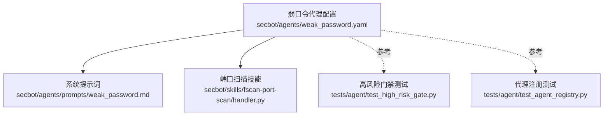
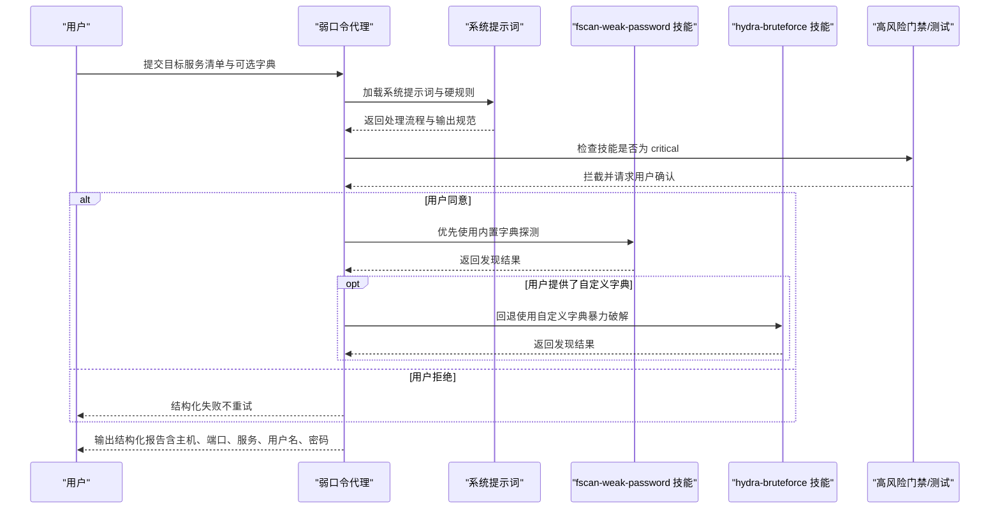
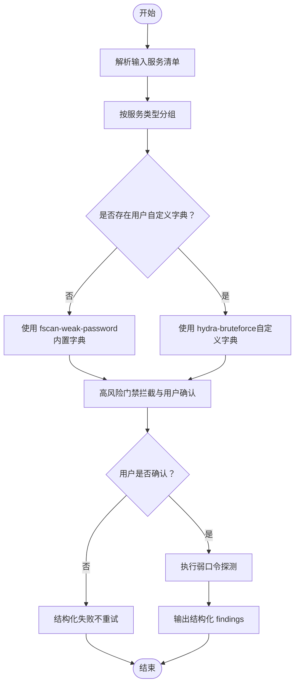
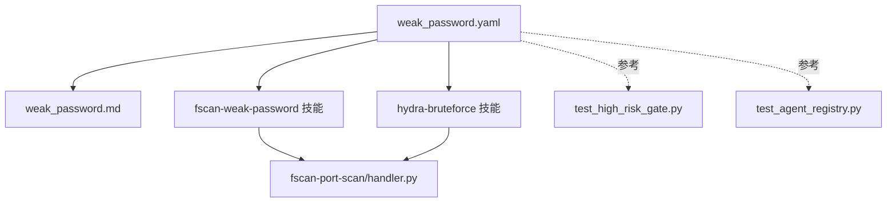

# 弱口令检测智能体

<cite>
**本文引用的文件**
- [secbot/agents/weak_password.yaml](file://secbot/agents/weak_password.yaml)
- [secbot/agents/prompts/weak_password.md](file://secbot/agents/prompts/weak_password.md)
- [secbot/skills/fscan-port-scan/handler.py](file://secbot/skills/fscan-port-scan/handler.py)
- [tests/agent/test_high_risk_gate.py](file://tests/agent/test_high_risk_gate.py)
- [tests/agent/test_agent_registry.py](file://tests/agent/test_agent_registry.py)
</cite>

## 目录
1. [简介](#简介)
2. [项目结构](#项目结构)
3. [核心组件](#核心组件)
4. [架构总览](#架构总览)
5. [详细组件分析](#详细组件分析)
6. [依赖分析](#依赖分析)
7. [性能考虑](#性能考虑)
8. [故障排除指南](#故障排除指南)
9. [结论](#结论)
10. [附录](#附录)

## 简介
本文件面向“弱口令检测智能体”，系统化阐述其在安全测试中的关键能力与实现方式，包括认证攻击模拟（弱口令探测）、密码强度评估（基于内置字典与用户自定义字典）、账户枚举与凭据窃取检测的策略与流程。文档同时说明该智能体的系统提示词认证策略、支持的服务协议（如 SSH、FTP、RDP、MySQL、Redis、MSSQL、Postgres、SMB、Telnet）、攻击载荷配置、技能实现、密码字典管理、防检测机制以及审计日志记录要求，并提供安全测试最佳实践、法律合规指导与风险控制建议。

## 项目结构
弱口令检测智能体由“代理配置”“系统提示词”“技能实现”三部分组成，配合测试用例确保高风险操作的可控性与可追溯性。下图展示与弱口令检测相关的核心文件及其关系：

**图表来源**
- [secbot/agents/weak_password.yaml:1-53](file://secbot/agents/weak_password.yaml#L1-L53)
- [secbot/agents/prompts/weak_password.md:1-28](file://secbot/agents/prompts/weak_password.md#L1-L28)
- [secbot/skills/fscan-port-scan/handler.py:1-45](file://secbot/skills/fscan-port-scan/handler.py#L1-L45)
- [tests/agent/test_high_risk_gate.py:65-128](file://tests/agent/test_high_risk_gate.py#L65-L128)
- [tests/agent/test_agent_registry.py:27-28](file://tests/agent/test_agent_registry.py#L27-L28)

**章节来源**
- [secbot/agents/weak_password.yaml:1-53](file://secbot/agents/weak_password.yaml#L1-L53)
- [secbot/agents/prompts/weak_password.md:1-28](file://secbot/agents/prompts/weak_password.md#L1-L28)
- [secbot/skills/fscan-port-scan/handler.py:1-45](file://secbot/skills/fscan-port-scan/handler.py#L1-L45)
- [tests/agent/test_high_risk_gate.py:65-128](file://tests/agent/test_high_risk_gate.py#L65-L128)
- [tests/agent/test_agent_registry.py:27-28](file://tests/agent/test_agent_registry.py#L27-L28)

## 核心组件
- 代理配置（weak_password.yaml）
  - 定义代理名称、显示名、描述、系统提示词文件、作用域技能集合、最大迭代次数、输入输出模式。
  - 输入包含服务清单（host/port/service），以及可选的用户列表与密码列表；输出为发现的弱口令凭证。
  - 支持的服务类型覆盖常见认证服务（ssh、ftp、rdp、mysql、redis、mssql、postgres、smb、telnet）。
- 系统提示词（weak_password.md）
  - 明确高风险规则：所有技能均为“critical”级别，每次调用均需用户显式确认；若拒绝则必须结构化失败且不重试。
  - 操作边界：仅对输入中明确列出的服务进行探测，不得扩大范围；默认锁定策略为每主机最多三次被拒绝后停止，避免账户锁定。
  - 处理流程：按服务类型分组；优先使用内置字典的 fscan-weak-password 技能；仅当用户提供自定义字典时才回退到 hydra-bruteforce 技能。
  - 输出规范：返回结构化结果；若通道被标记为 redacted，则不在可见摘要中包含密码。
- 技能实现
  - fscan-port-scan：用于发现开放端口并生成服务清单，供弱口令检测前置使用。
  - fscan-weak-password：内置字典的弱口令探测技能（由系统提示词优先选择）。
  - hydra-bruteforce：基于用户提供的自定义字典进行暴力破解（由系统提示词在需要时回退使用）。
- 测试与合规
  - 高风险门禁测试：验证 critical 级别技能在调用前的拦截与拒绝处理。
  - 代理注册测试：验证弱口令代理所声明的技能集合。

**章节来源**
- [secbot/agents/weak_password.yaml:1-53](file://secbot/agents/weak_password.yaml#L1-L53)
- [secbot/agents/prompts/weak_password.md:1-28](file://secbot/agents/prompts/weak_password.md#L1-L28)
- [tests/agent/test_high_risk_gate.py:65-128](file://tests/agent/test_high_risk_gate.py#L65-L128)
- [tests/agent/test_agent_registry.py:27-28](file://tests/agent/test_agent_registry.py#L27-L28)

## 架构总览
弱口令检测智能体采用“代理-技能-提示词”的分层设计，结合高风险门禁与测试用例保障安全可控。整体流程如下：

**图表来源**
- [secbot/agents/weak_password.yaml:10-15](file://secbot/agents/weak_password.yaml#L10-L15)
- [secbot/agents/prompts/weak_password.md:8-27](file://secbot/agents/prompts/weak_password.md#L8-L27)
- [tests/agent/test_high_risk_gate.py:65-128](file://tests/agent/test_high_risk_gate.py#L65-L128)

## 详细组件分析

### 组件一：弱口令代理配置（weak_password.yaml）
- 角色与职责
  - 声明代理名称、描述与系统提示词文件路径。
  - 限定作用域技能为 fscan-weak-password 与 hydra-bruteforce。
  - 设定最大迭代次数与计划步骤输出，便于可观测性与审计。
  - 输入模式严格约束服务清单字段与可选字典；输出模式固定为结构化 findings 数组。
- 协议与服务支持
  - 支持的服务类型包括 ssh、ftp、rdp、mysql、redis、mssql、postgres、smb、telnet。
- 安全与合规
  - 所有技能为 critical 级别，调用前必须经用户确认；拒绝即结构化失败，不可重试或切换其他技能。

**章节来源**
- [secbot/agents/weak_password.yaml:1-53](file://secbot/agents/weak_password.yaml#L1-L53)

### 组件二：系统提示词（weak_password.md）
- 认证策略与硬规则
  - 所有技能为 critical，调用前拦截并要求用户确认；拒绝即失败且不重试。
  - 仅对输入清单中的服务进行探测，不得扩大范围。
  - 默认锁定策略：每主机最多三次被拒绝后停止，以避免账户锁定。
- 处理流程
  - 将输入服务按服务类型分组。
  - 优先使用 fscan-weak-password（内置字典更安全）。
  - 仅当用户提供自定义 user_list/pass_list 时，才回退到 hydra-bruteforce。
- 输出规范
  - 返回结构化 findings；若通道被标记为 redacted，则不在可见摘要中包含密码。

**章节来源**
- [secbot/agents/prompts/weak_password.md:1-28](file://secbot/agents/prompts/weak_password.md#L1-L28)

### 组件三：技能实现与数据流
- fscan-port-scan（前置端口扫描）
  - 功能：对目标执行端口扫描，解析开放端口并生成服务清单。
  - 关键点：正则解析 fscan 输出，限制最大服务数量，设置超时与日志文件名，调用共享执行器。
  - 用途：为弱口令检测提供已知开放端口与服务类型的输入，减少盲目探测。
- fscan-weak-password（内置字典弱口令探测）
  - 优先策略：在系统提示词中被优先选择，使用内置字典进行安全、可控的弱口令探测。
- hydra-bruteforce（自定义字典暴力破解）
  - 回退策略：仅在用户提供自定义 user_list/pass_list 时使用，降低误判与误锁风险。

**图表来源**
- [secbot/agents/prompts/weak_password.md:19-22](file://secbot/agents/prompts/weak_password.md#L19-L22)
- [secbot/skills/fscan-port-scan/handler.py:31-44](file://secbot/skills/fscan-port-scan/handler.py#L31-L44)

**章节来源**
- [secbot/skills/fscan-port-scan/handler.py:1-45](file://secbot/skills/fscan-port-scan/handler.py#L1-L45)

### 组件四：高风险门禁与测试验证
- 高风险门禁测试
  - 验证 critical 级别技能在调用前被拦截。
  - 验证用户拒绝后的结构化失败行为，确保不重试或切换其他技能。
- 代理注册测试
  - 验证弱口令代理声明的技能集合包含 fscan-weak-password 与 hydra-bruteforce。

**章节来源**
- [tests/agent/test_high_risk_gate.py:65-128](file://tests/agent/test_high_risk_gate.py#L65-L128)
- [tests/agent/test_agent_registry.py:27-28](file://tests/agent/test_agent_registry.py#L27-L28)

## 依赖分析
弱口令检测智能体的依赖关系清晰，主要围绕代理配置、系统提示词与技能实现展开，并通过测试用例确保高风险控制与功能正确性。

**图表来源**
- [secbot/agents/weak_password.yaml:10-15](file://secbot/agents/weak_password.yaml#L10-L15)
- [secbot/skills/fscan-port-scan/handler.py:31-44](file://secbot/skills/fscan-port-scan/handler.py#L31-L44)
- [tests/agent/test_high_risk_gate.py:65-128](file://tests/agent/test_high_risk_gate.py#L65-L128)
- [tests/agent/test_agent_registry.py:27-28](file://tests/agent/test_agent_registry.py#L27-L28)

**章节来源**
- [secbot/agents/weak_password.yaml:10-15](file://secbot/agents/weak_password.yaml#L10-L15)
- [secbot/skills/fscan-port-scan/handler.py:31-44](file://secbot/skills/fscan-port-scan/handler.py#L31-L44)
- [tests/agent/test_high_risk_gate.py:65-128](file://tests/agent/test_high_risk_gate.py#L65-L128)
- [tests/agent/test_agent_registry.py:27-28](file://tests/agent/test_agent_registry.py#L27-L28)

## 性能考虑
- 端口扫描规模控制：端口扫描技能限制最大服务数量，避免过量输出导致后续处理压力。
- 超时与资源限制：端口扫描设置较长超时时间，适合大规模网络扫描场景；同时注意与系统资源配额协调。
- 字典选择策略：优先内置字典可显著降低网络与服务器负载，减少误判与误锁风险。
- 并发与节流：系统提示词中默认锁定策略限制每主机的拒绝次数，有助于在大规模扫描中避免账户锁定与服务压力。

[本节为通用性能讨论，无需特定文件来源]

## 故障排除指南
- 用户拒绝高风险操作
  - 现象：技能调用被拦截并等待用户确认，用户拒绝后结构化失败。
  - 排查：检查高风险门禁测试用例与代理配置中的 critical 标记。
- 自定义字典未生效
  - 现象：仍使用内置字典而非自定义字典。
  - 排查：确认输入中提供了 user_list/pass_list，系统提示词逻辑会据此回退到 hydra-bruteforce。
- 输出中缺少密码
  - 现象：摘要中未显示密码。
  - 排查：若通道被标记为 redacted，系统提示词要求不在可见摘要中包含密码。
- 端口扫描结果异常
  - 现象：未发现预期服务或服务过多。
  - 排查：检查端口扫描正则解析、最大服务数量限制与目标范围。

**章节来源**
- [tests/agent/test_high_risk_gate.py:65-128](file://tests/agent/test_high_risk_gate.py#L65-L128)
- [secbot/agents/prompts/weak_password.md:14-15](file://secbot/agents/prompts/weak_password.md#L14-L15)
- [secbot/skills/fscan-port-scan/handler.py:17-28](file://secbot/skills/fscan-port-scan/handler.py#L17-L28)

## 结论
弱口令检测智能体通过严格的系统提示词与高风险门禁机制，确保在弱口令探测过程中具备明确的边界、可控的风险与可追溯的输出。其优先使用内置字典的策略兼顾效率与安全性，仅在必要时回退到自定义字典暴力破解。配合测试用例与结构化输出，该智能体能够满足企业安全测试与合规审计的需求。

[本节为总结性内容，无需特定文件来源]

## 附录

### 攻击载荷与字典管理
- 内置字典：优先使用 fscan-weak-password 技能，内置常用弱口令与默认口令组合，降低误判与误锁风险。
- 自定义字典：当用户提供 user_list/pass_list 时，系统提示词指示回退到 hydra-bruteforce 技能，以满足特定业务场景需求。
- 字典更新与维护：建议定期更新内置字典，结合行业漏洞与弱口令趋势调整策略。

[本节为通用指导，无需特定文件来源]

### 审计日志与合规
- 日志记录：端口扫描技能使用固定日志文件名，便于审计与复盘。
- 输出规范：统一结构化 findings，支持在不同渠道中按需脱敏（redacted）。
- 合规要求：所有 critical 级别操作必须获得用户显式确认，拒绝即结构化失败，不可重试或切换其他技能。

**章节来源**
- [secbot/skills/fscan-port-scan/handler.py:41-41](file://secbot/skills/fscan-port-scan/handler.py#L41-L41)
- [secbot/agents/prompts/weak_password.md:26-27](file://secbot/agents/prompts/weak_password.md#L26-L27)
- [tests/agent/test_high_risk_gate.py:65-128](file://tests/agent/test_high_risk_gate.py#L65-L128)