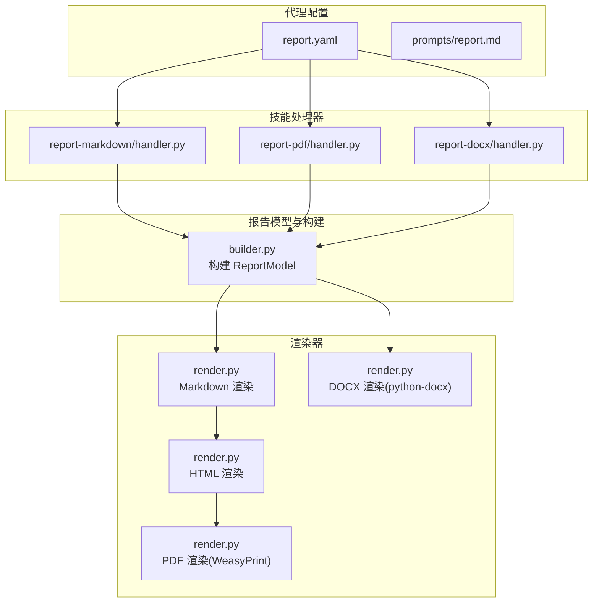
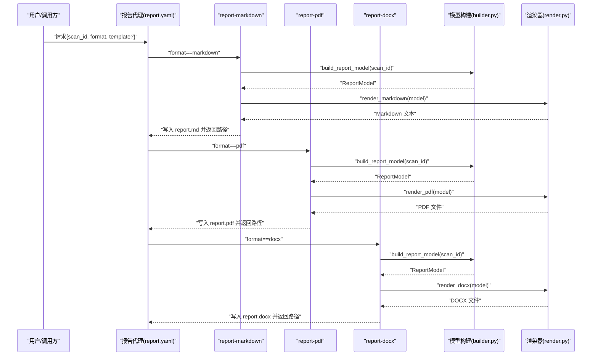
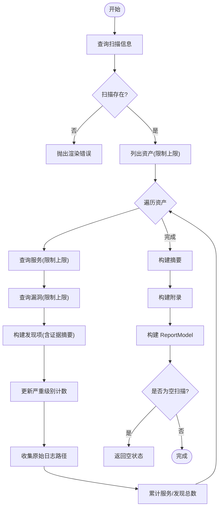
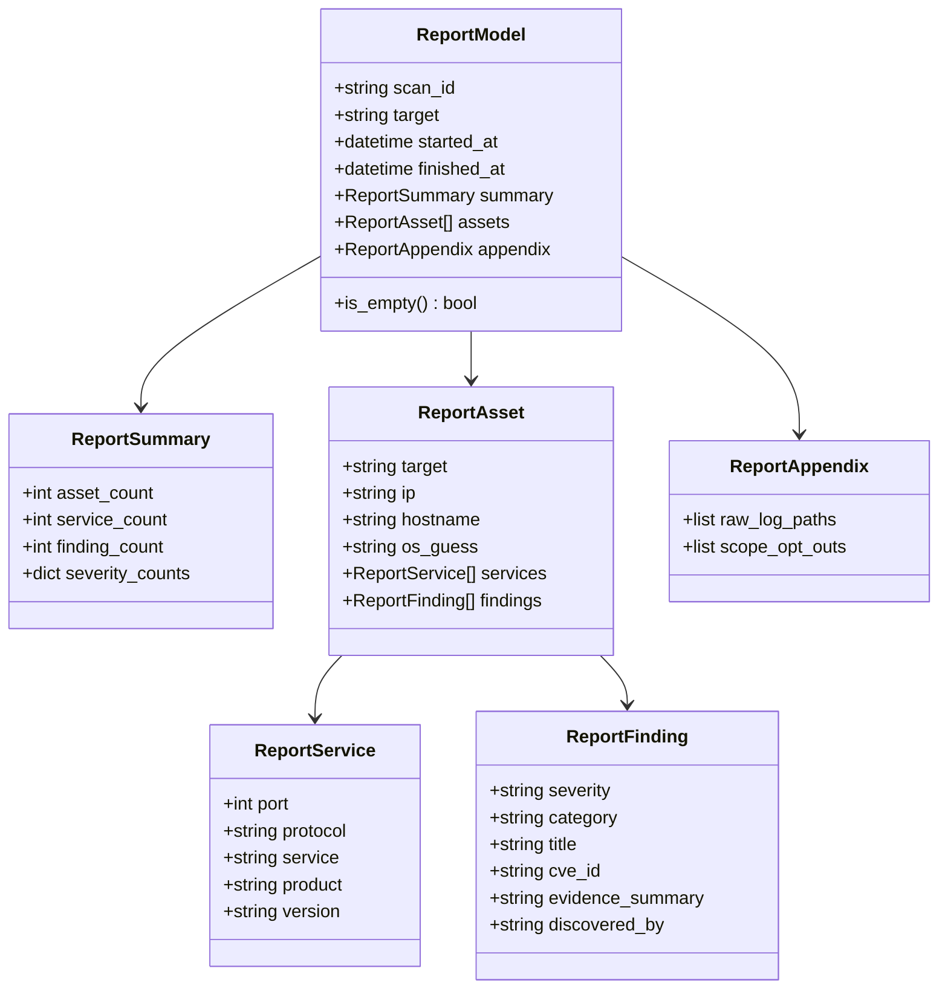
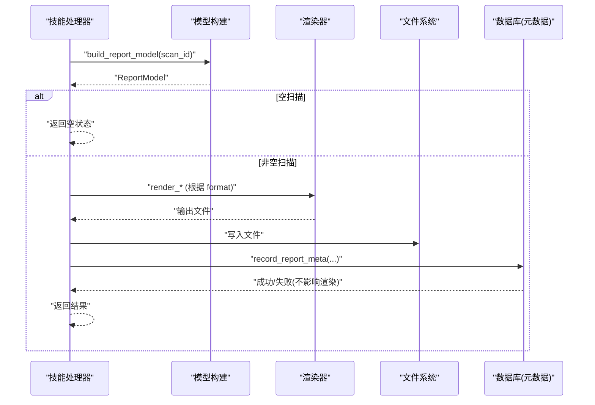
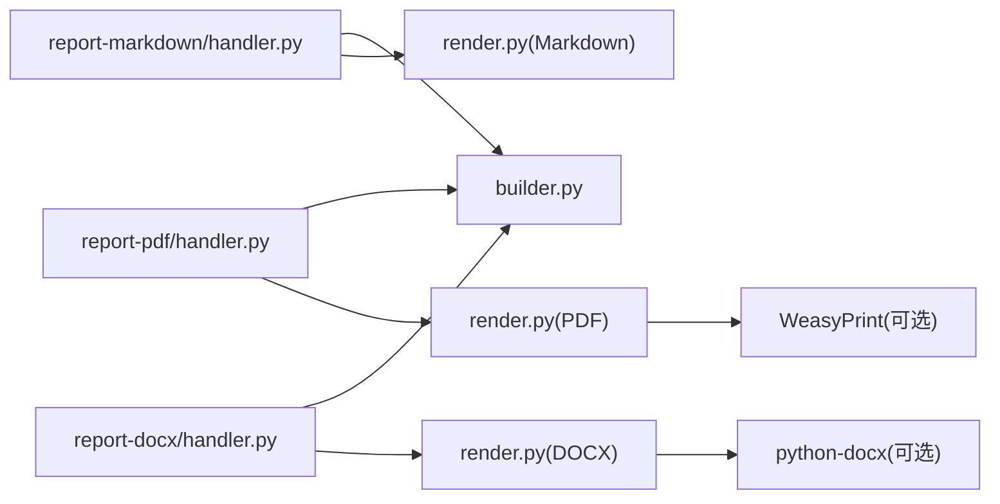

# 报告生成智能体

<cite>
**本文引用的文件**
- [builder.py](file://secbot/report/builder.py)
- [render.py](file://secbot/report/render.py)
- [report.yaml](file://secbot/agents/report.yaml)
- [report.md](file://secbot/agents/prompts/report.md)
- [report-markdown/SKILL.md](file://secbot/skills/report-markdown/SKILL.md)
- [report-markdown/handler.py](file://secbot/skills/report-markdown/handler.py)
- [report-pdf/SKILL.md](file://secbot/skills/report-pdf/SKILL.md)
- [report-pdf/handler.py](file://secbot/skills/report-pdf/handler.py)
- [report-docx/SKILL.md](file://secbot/skills/report-docx/SKILL.md)
- [report-docx/handler.py](file://secbot/skills/report-docx/handler.py)
</cite>

## 目录
1. [简介](#简介)
2. [项目结构](#项目结构)
3. [核心组件](#核心组件)
4. [架构总览](#架构总览)
5. [详细组件分析](#详细组件分析)
6. [依赖分析](#依赖分析)
7. [性能考虑](#性能考虑)
8. [故障排查指南](#故障排查指南)
9. [结论](#结论)
10. [附录](#附录)

## 简介
本文件面向“报告生成智能体”，系统化阐述其核心能力与实现方式，包括：
- 多格式报告输出：Markdown、HTML、PDF、DOCX
- 数据可视化：以表格与徽章形式呈现严重级别分布与资产详情
- 摘要生成：按严重级别统计与汇总指标
- 合规性检查：基于 CMDB 的扫描数据一致性校验与元数据持久化
- 系统提示词与模板系统：以“先 Markdown 再派生”的流程确保一致性
- 样式定制：HTML/CSS 徽章颜色与 Markdown 表格风格
- 自动化配置：通过技能与代理配置实现一键生成

## 项目结构
围绕报告生成的模块划分清晰，采用“模型构建 + 渲染器 + 技能处理器 + 代理配置”的分层设计：
- 模型与构建：从 CMDB 查询扫描、资产、服务与漏洞，组装统一的报告模型
- 渲染器：将模型渲染为 Markdown、HTML、DOCX、PDF
- 技能处理器：封装各格式的生成逻辑与错误处理
- 代理配置：定义输入/输出模式、系统提示词与可选模板参数

图示来源
- [builder.py:90-180](file://secbot/report/builder.py#L90-L180)
- [render.py:40-112](file://secbot/report/render.py#L40-L112)
- [render.py:120-181](file://secbot/report/render.py#L120-L181)
- [render.py:189-210](file://secbot/report/render.py#L189-L210)
- [render.py:218-281](file://secbot/report/render.py#L218-L281)
- [report-markdown/handler.py:17-62](file://secbot/skills/report-markdown/handler.py#L17-L62)
- [report-pdf/handler.py:18-68](file://secbot/skills/report-pdf/handler.py#L18-L68)
- [report-docx/handler.py:14-55](file://secbot/skills/report-docx/handler.py#L14-L55)
- [report.yaml:1-39](file://secbot/agents/report.yaml#L1-L39)
- [report.md:1-19](file://secbot/agents/prompts/report.md#L1-L19)

章节来源
- [report.yaml:1-39](file://secbot/agents/report.yaml#L1-L39)
- [report.md:1-19](file://secbot/agents/prompts/report.md#L1-L19)

## 核心组件
- 报告模型与构建
  - 从 CMDB 获取扫描、资产、服务、漏洞等数据，构造统一模型；统计严重级别计数、服务与发现总数，并收集原始日志路径
  - 提供空扫描检测与元数据持久化辅助函数
- 渲染器
  - Markdown：作为“规范中间格式”，输出结构化标题、摘要表与资产明细
  - HTML：内联 CSS，生成徽章样式，便于 PDF 导出
  - PDF：调用 WeasyPrint 将 HTML 转换为 PDF
  - DOCX：使用 python-docx 构建标题、段落与表格
- 技能处理器
  - report-markdown：生成 Markdown 并写入扫描目录
  - report-pdf：在已有模型基础上生成 PDF
  - report-docx：在已有模型基础上生成 DOCX
- 代理与提示词
  - 代理定义输入/输出字段、可选模板参数与最大迭代次数
  - 系统提示词明确“先 Markdown 再派生”的流程与输出约束

章节来源
- [builder.py:33-87](file://secbot/report/builder.py#L33-L87)
- [builder.py:90-180](file://secbot/report/builder.py#L90-L180)
- [render.py:40-112](file://secbot/report/render.py#L40-L112)
- [render.py:120-181](file://secbot/report/render.py#L120-L181)
- [render.py:189-210](file://secbot/report/render.py#L189-L210)
- [render.py:218-281](file://secbot/report/render.py#L218-L281)
- [report-markdown/handler.py:17-62](file://secbot/skills/report-markdown/handler.py#L17-L62)
- [report-pdf/handler.py:18-68](file://secbot/skills/report-pdf/handler.py#L18-L68)
- [report-docx/handler.py:14-55](file://secbot/skills/report-docx/handler.py#L14-L55)
- [report.yaml:1-39](file://secbot/agents/report.yaml#L1-L39)
- [report.md:1-19](file://secbot/agents/prompts/report.md#L1-L19)

## 架构总览
下图展示“报告生成智能体”的端到端流程：代理接收请求后，按系统提示词顺序调用相应技能，技能内部复用统一的模型构建与渲染器。

图示来源
- [report.yaml:10-16](file://secbot/agents/report.yaml#L10-L16)
- [report.md:6-12](file://secbot/agents/prompts/report.md#L6-L12)
- [report-markdown/handler.py:17-40](file://secbot/skills/report-markdown/handler.py#L17-L40)
- [report-pdf/handler.py:18-47](file://secbot/skills/report-pdf/handler.py#L18-L47)
- [report-docx/handler.py:14-34](file://secbot/skills/report-docx/handler.py#L14-L34)
- [builder.py:90-180](file://secbot/report/builder.py#L90-L180)
- [render.py:40-112](file://secbot/report/render.py#L40-L112)
- [render.py:189-210](file://secbot/report/render.py#L189-L210)
- [render.py:218-281](file://secbot/report/render.py#L218-L281)

## 详细组件分析

### 报告模型与数据聚合
- 数据来源
  - 扫描：用于填充扫描标识、目标与时间范围
  - 资产：目标、IP、主机名、操作系统猜测
  - 服务：端口、协议、服务名、产品与版本
  - 漏洞：严重级别、类别、标题、CVE、证据摘要、发现工具
- 聚合逻辑
  - 统计每项严重级别的数量，汇总资产、服务与发现总数
  - 收集原始日志路径，用于附录
  - 空扫描检测：当资产计数为零时，直接返回空状态
- 元数据持久化
  - 成功渲染后尝试写入报告元数据表，失败仅记录警告不回滚渲染结果

图示来源
- [builder.py:90-180](file://secbot/report/builder.py#L90-L180)

章节来源
- [builder.py:29-31](file://secbot/report/builder.py#L29-L31)
- [builder.py:76-87](file://secbot/report/builder.py#L76-L87)
- [builder.py:90-180](file://secbot/report/builder.py#L90-L180)

### 渲染器与多格式输出
- Markdown
  - 输出标题、扫描元信息、摘要表与按资产分组的发现列表
  - 使用固定表格列与严重级别标签映射
- HTML
  - 内联 CSS，生成徽章样式，适配 WeasyPrint
  - 与 Markdown 结构一致，便于 PDF 导出
- PDF
  - 依赖 WeasyPrint，缺失依赖或系统库时抛出渲染错误
- DOCX
  - 使用 python-docx 构建标题、段落与表格，设置表格样式

图示来源
- [builder.py:33-87](file://secbot/report/builder.py#L33-L87)

章节来源
- [render.py:27-33](file://secbot/report/render.py#L27-L33)
- [render.py:40-112](file://secbot/report/render.py#L40-L112)
- [render.py:120-181](file://secbot/report/render.py#L120-L181)
- [render.py:189-210](file://secbot/report/render.py#L189-L210)
- [render.py:218-281](file://secbot/report/render.py#L218-L281)

### 技能处理器与质量控制
- report-markdown
  - 生成 Markdown 并写入扫描目录下的 report/report.md
  - 最佳努力持久化报告元数据，失败仅记录日志
- report-pdf
  - 在已有模型上生成 PDF；捕获渲染错误并返回错误摘要
  - 成功后持久化元数据
- report-docx
  - 在已有模型上生成 DOCX；成功后持久化元数据
- 质量控制要点
  - 空扫描快速返回
  - 渲染异常隔离，不影响其他步骤
  - 元数据持久化失败不回滚已生成文件

图示来源
- [report-markdown/handler.py:17-62](file://secbot/skills/report-markdown/handler.py#L17-L62)
- [report-pdf/handler.py:18-68](file://secbot/skills/report-pdf/handler.py#L18-L68)
- [report-docx/handler.py:14-55](file://secbot/skills/report-docx/handler.py#L14-L55)
- [builder.py:90-180](file://secbot/report/builder.py#L90-L180)
- [render.py:40-112](file://secbot/report/render.py#L40-L112)
- [render.py:189-210](file://secbot/report/render.py#L189-L210)
- [render.py:218-281](file://secbot/report/render.py#L218-L281)

章节来源
- [report-markdown/handler.py:17-62](file://secbot/skills/report-markdown/handler.py#L17-L62)
- [report-pdf/handler.py:18-68](file://secbot/skills/report-pdf/handler.py#L18-L68)
- [report-docx/handler.py:14-55](file://secbot/skills/report-docx/handler.py#L14-L55)

### 系统提示词与模板系统
- 系统提示词
  - 明确“先 Markdown 再派生”的流程，避免重复查询 CMDB
  - 输出严格返回包含路径与格式的对象
- 模板参数
  - 代理输入支持可选模板名称，便于扩展自定义模板目录
- 流程约束
  - 限定最大迭代次数，避免无限循环
  - 禁用计划步骤输出，聚焦最终交付物

章节来源
- [report.md:6-18](file://secbot/agents/prompts/report.md#L6-L18)
- [report.yaml:8-16](file://secbot/agents/report.yaml#L8-L16)
- [report.yaml:18-31](file://secbot/agents/report.yaml#L18-L31)

### 支持的输出格式与样式定制
- 输出格式
  - Markdown：规范中间格式
  - HTML：内联 CSS，用于 PDF 导出
  - PDF：WeasyPrint 转换
  - DOCX：python-docx 生成
- 样式定制
  - HTML 徽章颜色与字体、表格样式可调整
  - Markdown 表格列与严重级别标签映射可扩展
  - DOCX 表格样式可通过 python-docx 设置

章节来源
- [render.py:125-136](file://secbot/report/render.py#L125-L136)
- [render.py:227-240](file://secbot/report/render.py#L227-L240)
- [render.py:263-264](file://secbot/report/render.py#L263-L264)

### 报告模板定制指南
- 可选模板参数
  - 代理输入支持 template 字段，用于选择模板目录中的模板名称
- 建议实践
  - 在模板目录中维护不同风格的 Markdown 模板
  - 保持与系统提示词一致的渲染顺序，确保派生格式的一致性
  - 对于 PDF/DOCX，建议优先基于 Markdown 模板进行二次加工

章节来源
- [report.yaml:28-30](file://secbot/agents/report.yaml#L28-L30)

### 自动化报告配置
- 代理配置
  - 输入：scan_id、format、template（可选）
  - 输出：path、format、bytes
  - 最大迭代次数与禁用计划步骤
- 技能配置
  - report-markdown：本地 CMDB 查询，无网络与子进程
  - report-pdf：依赖 WeasyPrint 与系统库
  - report-docx：本地 CMDB 查询，无网络与子进程

章节来源
- [report.yaml:18-39](file://secbot/agents/report.yaml#L18-L39)
- [report-markdown/SKILL.md:13-14](file://secbot/skills/report-markdown/SKILL.md#L13-L14)
- [report-pdf/SKILL.md:13-15](file://secbot/skills/report-pdf/SKILL.md#L13-L15)
- [report-docx/SKILL.md:13-14](file://secbot/skills/report-docx/SKILL.md#L13-L14)

### 质量保证最佳实践
- 数据一致性
  - 以 Markdown 为规范中间格式，确保 PDF/DOCX 一致性
- 错误隔离
  - 渲染错误独立捕获，不影响元数据持久化流程
- 元数据可靠性
  - 元数据插入失败仅记录警告，不回滚已生成文件
- 性能优化
  - 限制查询上限，避免超大数据集导致内存压力
  - 空扫描快速返回，减少无效计算

章节来源
- [report.md:8-12](file://secbot/agents/prompts/report.md#L8-L12)
- [report-pdf/handler.py:40-47](file://secbot/skills/report-pdf/handler.py#L40-L47)
- [builder.py:103-104](file://secbot/report/builder.py#L103-L104)
- [builder.py:112-115](file://secbot/report/builder.py#L112-L115)

## 依赖分析
- 组件耦合
  - 技能处理器依赖统一的模型构建与渲染器，降低重复逻辑
  - 渲染器对第三方库（WeasyPrint、python-docx）有可选依赖
- 外部依赖
  - WeasyPrint：PDF 渲染
  - python-docx：DOCX 渲染
- 潜在风险
  - 缺少系统库或 Python 包会导致渲染失败
  - 查询上限与数据规模需结合实际场景调整

图示来源
- [report-markdown/handler.py:12-13](file://secbot/skills/report-markdown/handler.py#L12-L13)
- [report-pdf/handler.py:9-14](file://secbot/skills/report-pdf/handler.py#L9-L14)
- [report-docx/handler.py:9-10](file://secbot/skills/report-docx/handler.py#L9-L10)
- [render.py:196-201](file://secbot/report/render.py#L196-L201)
- [render.py:220-225](file://secbot/report/render.py#L220-L225)

章节来源
- [report-markdown/handler.py:12-13](file://secbot/skills/report-markdown/handler.py#L12-L13)
- [report-pdf/handler.py:9-14](file://secbot/skills/report-pdf/handler.py#L9-L14)
- [report-docx/handler.py:9-10](file://secbot/skills/report-docx/handler.py#L9-L10)
- [render.py:196-201](file://secbot/report/render.py#L196-L201)
- [render.py:220-225](file://secbot/report/render.py#L220-L225)

## 性能考虑
- 查询限制
  - 资产、服务、漏洞查询均设置上限，防止大规模数据导致内存与 I/O 压力
- 渲染成本
  - PDF 渲染依赖 WeasyPrint，需安装系统库；DOCX 渲染依赖 python-docx
- I/O 优化
  - 输出文件统一写入扫描目录下的 report 子目录，便于管理与清理

章节来源
- [builder.py:103-104](file://secbot/report/builder.py#L103-L104)
- [builder.py:112-115](file://secbot/report/builder.py#L112-L115)
- [builder.py:150-151](file://secbot/report/builder.py#L150-L151)
- [render.py:208-209](file://secbot/report/render.py#L208-L209)
- [render.py:279-280](file://secbot/report/render.py#L279-L280)

## 故障排查指南
- 渲染错误
  - WeasyPrint 缺失或系统库加载失败：检查依赖安装与系统库
  - python-docx 缺失：安装对应包
- 空扫描
  - 返回空状态，无需进一步处理
- 元数据持久化失败
  - 记录警告但不回滚渲染文件，确认数据库连接与权限

章节来源
- [render.py:196-205](file://secbot/report/render.py#L196-L205)
- [render.py:220-225](file://secbot/report/render.py#L220-L225)
- [report-pdf/handler.py:40-47](file://secbot/skills/report-pdf/handler.py#L40-L47)
- [builder.py:221-228](file://secbot/report/builder.py#L221-L228)

## 结论
报告生成智能体通过“模型构建 + 渲染器 + 技能处理器 + 代理配置”的分层设计，实现了从 CMDB 数据到多格式报告的高效产出。其以 Markdown 为规范中间格式，确保 PDF/DOCX 的一致性；通过严格的错误隔离与元数据持久化策略，保障交付质量与可观测性。配合系统提示词与可选模板参数，可在满足合规性要求的同时灵活定制样式与内容。

## 附录
- 关键流程回顾
  - 代理接收请求 → 依据格式调用对应技能 → 技能复用统一模型与渲染器 → 成功写入文件并持久化元数据
- 建议扩展方向
  - 引入更多模板与样式变量
  - 增强摘要生成与合规性检查规则
  - 提供批量扫描与定时生成能力