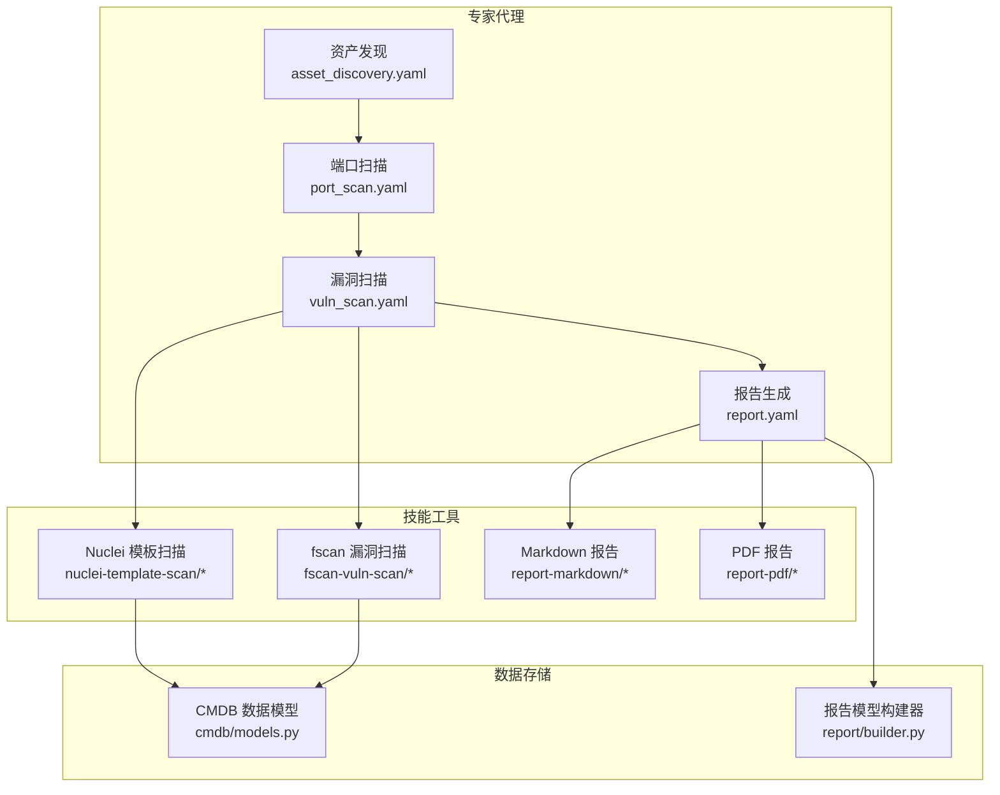
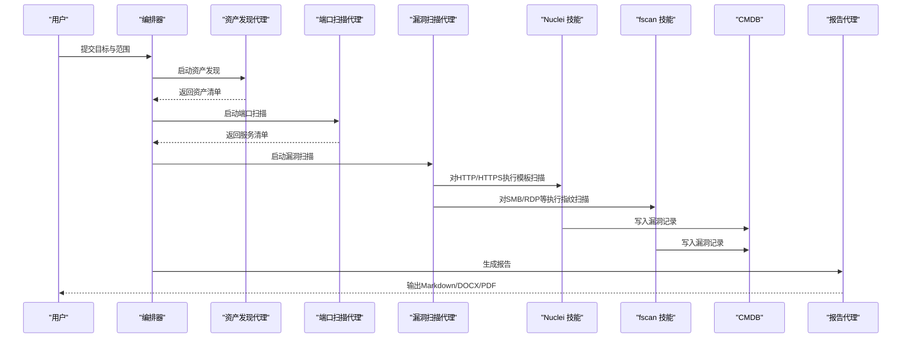
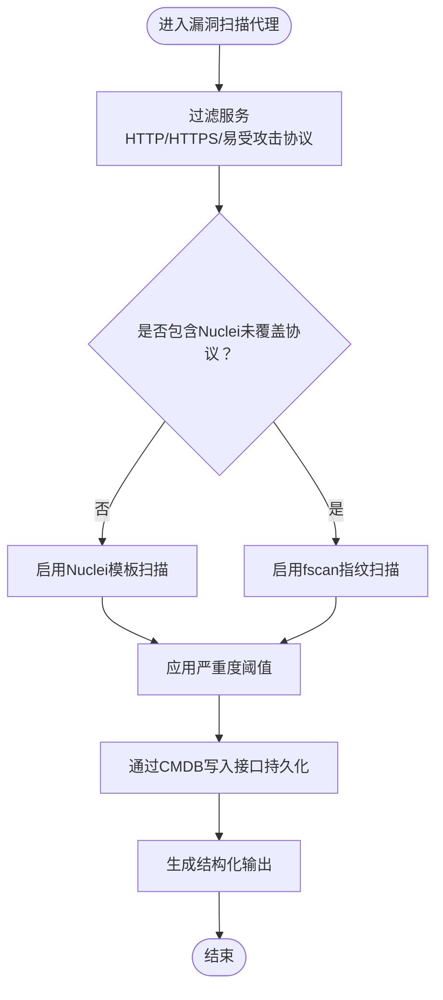
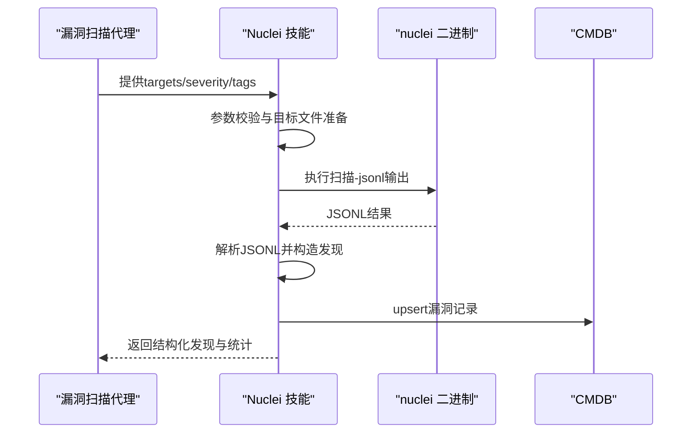
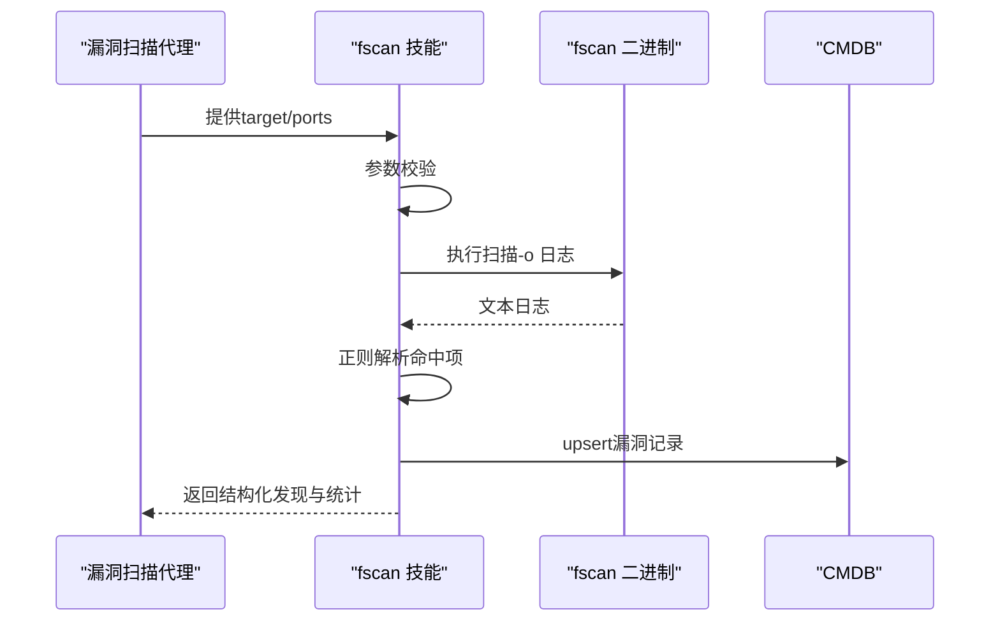
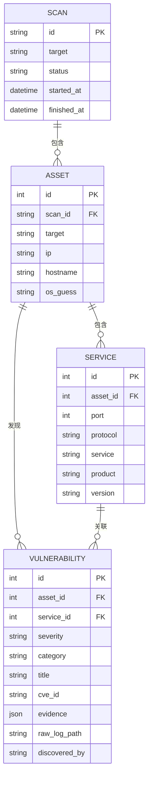
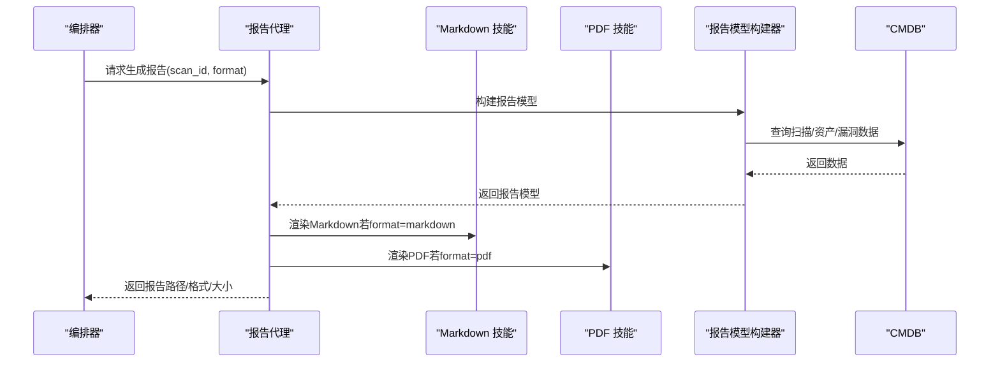
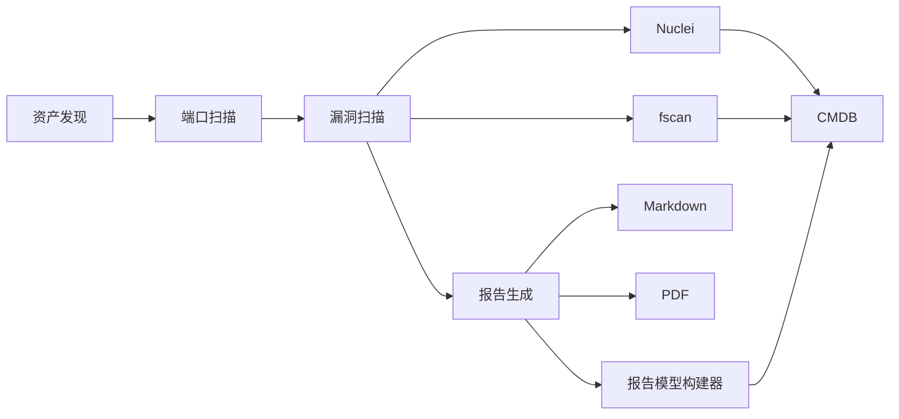

# 漏洞扫描智能体

<cite>
**本文引用的文件**
- [secbot/agents/vuln_scan.yaml](file://secbot/agents/vuln_scan.yaml)
- [secbot/agents/prompts/vuln_scan.md](file://secbot/agents/prompts/vuln_scan.md)
- [secbot/skills/fscan-vuln-scan/SKILL.md](file://secbot/skills/fscan-vuln-scan/SKILL.md)
- [secbot/skills/fscan-vuln-scan/handler.py](file://secbot/skills/fscan-vuln-scan/handler.py)
- [secbot/skills/nuclei-template-scan/SKILL.md](file://secbot/skills/nuclei-template-scan/SKILL.md)
- [secbot/skills/nuclei-template-scan/handler.py](file://secbot/skills/nuclei-template-scan/handler.py)
- [secbot/agents/orchestrator.py](file://secbot/agents/orchestrator.py)
- [secbot/cmdb/models.py](file://secbot/cmdb/models.py)
- [secbot/report/builder.py](file://secbot/report/builder.py)
- [secbot/agents/report.yaml](file://secbot/agents/report.yaml)
- [secbot/skills/report-markdown/SKILL.md](file://secbot/skills/report-markdown/SKILL.md)
- [secbot/skills/report-pdf/SKILL.md](file://secbot/skills/report-pdf/SKILL.md)
- [secbot/agents/port_scan.yaml](file://secbot/agents/port_scan.yaml)
- [secbot/agents/asset_discovery.yaml](file://secbot/agents/asset_discovery.yaml)
</cite>

## 目录
1. [简介](#简介)
2. [项目结构](#项目结构)
3. [核心组件](#核心组件)
4. [架构总览](#架构总览)
5. [详细组件分析](#详细组件分析)
6. [依赖分析](#依赖分析)
7. [性能考虑](#性能考虑)
8. [故障排查指南](#故障排查指南)
9. [结论](#结论)
10. [附录](#附录)

## 简介
本文件面向“漏洞扫描智能体”的设计与实现，系统性阐述其核心能力：CVE漏洞检测、风险评估、漏洞验证与安全报告生成。文档聚焦以下方面：
- 系统提示词中的漏洞扫描策略与执行流程
- 支持的漏洞检测引擎与扫描规则配置（Nuclei、fscan）
- 智能体技能组合、漏洞分类体系与风险等级评估算法
- 报告模板与输出格式集成
- 配置指南、误报处理策略与扫描效率优化建议

## 项目结构
漏洞扫描智能体位于 secbot 子系统中，采用“专家代理 + 技能工具”的分层架构：
- 专家代理层：按阶段编排任务（资产发现 → 端口扫描 → 漏洞扫描 → 报告生成）
- 技能工具层：封装外部二进制（nuclei、fscan）与本地CMDB写入逻辑
- 数据模型层：统一的CMDB数据模型，支撑漏洞持久化与报告构建

图表来源
- [secbot/agents/asset_discovery.yaml:1-46](file://secbot/agents/asset_discovery.yaml#L1-L46)
- [secbot/agents/port_scan.yaml:1-50](file://secbot/agents/port_scan.yaml#L1-L50)
- [secbot/agents/vuln_scan.yaml:1-53](file://secbot/agents/vuln_scan.yaml#L1-L53)
- [secbot/agents/report.yaml:1-39](file://secbot/agents/report.yaml#L1-L39)
- [secbot/skills/nuclei-template-scan/SKILL.md:1-17](file://secbot/skills/nuclei-template-scan/SKILL.md#L1-L17)
- [secbot/skills/fscan-vuln-scan/SKILL.md:1-16](file://secbot/skills/fscan-vuln-scan/SKILL.md#L1-L16)
- [secbot/skills/report-markdown/SKILL.md:1-15](file://secbot/skills/report-markdown/SKILL.md#L1-L15)
- [secbot/skills/report-pdf/SKILL.md:1-16](file://secbot/skills/report-pdf/SKILL.md#L1-L16)
- [secbot/cmdb/models.py:1-178](file://secbot/cmdb/models.py#L1-L178)
- [secbot/report/builder.py:1-178](file://secbot/report/builder.py#L1-L178)

章节来源
- [secbot/agents/asset_discovery.yaml:1-46](file://secbot/agents/asset_discovery.yaml#L1-L46)
- [secbot/agents/port_scan.yaml:1-50](file://secbot/agents/port_scan.yaml#L1-L50)
- [secbot/agents/vuln_scan.yaml:1-53](file://secbot/agents/vuln_scan.yaml#L1-L53)
- [secbot/agents/report.yaml:1-39](file://secbot/agents/report.yaml#L1-L39)

## 核心组件
- 漏洞扫描专家代理（vuln_scan）
  - 输入：由端口扫描产出的服务清单（host/port/protocol/service），以及可选的严重度阈值
  - 输出：结构化漏洞发现列表（host/port/severity/title/cve_id/template）
  - 执行策略：优先使用Nuclei模板扫描（HTTP/HTTPS/常见易受攻击协议），必要时补充fscan指纹扫描（SMB/RDP/内部RPC等）
  - 严重度过滤：默认不低于“中危”，避免噪声
  - 结果持久化：通过CMDB写入接口，不直接操作数据库
- 漏洞检测引擎
  - Nuclei：基于模板集（CVE/配置错误/暴露）扫描，高风险模板仅返回中高危及以上结果；解析JSONL输出并结构化写入
  - fscan：内置POC检查，解析文本日志，提取命中项并写入CMDB
- 报告生成
  - 基于CMDB数据构建报告模型，支持Markdown/DOCX/PDF导出；PDF通过WeasyPrint渲染
  - 报告包含资产、服务、漏洞汇总与证据摘要

章节来源
- [secbot/agents/vuln_scan.yaml:1-53](file://secbot/agents/vuln_scan.yaml#L1-L53)
- [secbot/agents/prompts/vuln_scan.md:1-24](file://secbot/agents/prompts/vuln_scan.md#L1-L24)
- [secbot/skills/nuclei-template-scan/SKILL.md:1-17](file://secbot/skills/nuclei-template-scan/SKILL.md#L1-L17)
- [secbot/skills/fscan-vuln-scan/SKILL.md:1-16](file://secbot/skills/fscan-vuln-scan/SKILL.md#L1-L16)
- [secbot/agents/report.yaml:1-39](file://secbot/agents/report.yaml#L1-L39)
- [secbot/skills/report-markdown/SKILL.md:1-15](file://secbot/skills/report-markdown/SKILL.md#L1-L15)
- [secbot/skills/report-pdf/SKILL.md:1-16](file://secbot/skills/report-pdf/SKILL.md#L1-L16)

## 架构总览
漏洞扫描智能体在编排器的统一调度下，遵循“资产发现 → 端口扫描 → 漏洞扫描 → 报告生成”的顺序执行。编排器定义硬性规则与工作风格，确保任务按序进行且高风险操作需经确认。

图表来源
- [secbot/agents/orchestrator.py:1-70](file://secbot/agents/orchestrator.py#L1-L70)
- [secbot/agents/asset_discovery.yaml:1-46](file://secbot/agents/asset_discovery.yaml#L1-L46)
- [secbot/agents/port_scan.yaml:1-50](file://secbot/agents/port_scan.yaml#L1-L50)
- [secbot/agents/vuln_scan.yaml:1-53](file://secbot/agents/vuln_scan.yaml#L1-L53)
- [secbot/agents/report.yaml:1-39](file://secbot/agents/report.yaml#L1-L39)
- [secbot/skills/nuclei-template-scan/handler.py:1-154](file://secbot/skills/nuclei-template-scan/handler.py#L1-L154)
- [secbot/skills/fscan-vuln-scan/handler.py:1-116](file://secbot/skills/fscan-vuln-scan/handler.py#L1-L116)
- [secbot/cmdb/models.py:1-178](file://secbot/cmdb/models.py#L1-L178)

## 详细组件分析

### 漏洞扫描代理（vuln_scan）
- 角色与职责
  - 作为专家代理，负责对端口扫描产出的服务执行漏洞检测
  - 依据协议类型选择Nuclei或fscan，并应用严重度阈值过滤
  - 将发现以结构化形式返回，并通过CMDB写入接口持久化
- 输入/输出模式
  - 输入：services 数组（host/port/protocol/service），severity_floor（默认 medium）
  - 输出：findings 数组（host/port/severity/title/cve_id/template）
- 执行流程
  - 过滤服务：优先HTTP/HTTPS与常见易受攻击协议；跳过无模板覆盖的原始TCP banner
  - 引擎选择：默认Nuclei模板扫描；当存在Nuclei覆盖不足的协议（如SMB/RDP/内部RPC）时补充fscan
  - 严重度控制：根据 severity_floor 进行过滤，避免噪声
  - 结果写入：通过 CMDB 写入接口，不直接调用数据库
- 关键提示词策略
  - 明确扫描顺序与职责边界，强调“不自行执行扫描”
  - 输出限制：最多500条，单条字符串截断至512字符

图表来源
- [secbot/agents/prompts/vuln_scan.md:1-24](file://secbot/agents/prompts/vuln_scan.md#L1-L24)
- [secbot/agents/vuln_scan.yaml:1-53](file://secbot/agents/vuln_scan.yaml#L1-L53)

章节来源
- [secbot/agents/vuln_scan.yaml:1-53](file://secbot/agents/vuln_scan.yaml#L1-L53)
- [secbot/agents/prompts/vuln_scan.md:1-24](file://secbot/agents/prompts/vuln_scan.md#L1-L24)

### Nuclei 模板扫描技能
- 功能概述
  - 使用预选模板集（CVE/配置错误/暴露）对目标执行扫描
  - 高风险模板仅返回中危及以上结果
  - 解析JSONL输出，结构化为发现并写入CMDB
- 关键参数
  - targets：目标列表（最大256个）
  - severity：严重度过滤集合（允许值见验证逻辑）
  - tags：模板标签过滤（默认包含cve/exposure/misconfig）
- 处理流程
  - 参数校验（目标格式、严重度、标签）
  - 写入目标文件并调用nuclei执行扫描
  - 解析JSONL逐行提取字段，构造发现与CMDB写入
  - 记录耗时、错误码与发现数量

图表来源
- [secbot/skills/nuclei-template-scan/handler.py:1-154](file://secbot/skills/nuclei-template-scan/handler.py#L1-L154)
- [secbot/skills/nuclei-template-scan/SKILL.md:1-17](file://secbot/skills/nuclei-template-scan/SKILL.md#L1-L17)

章节来源
- [secbot/skills/nuclei-template-scan/handler.py:1-154](file://secbot/skills/nuclei-template-scan/handler.py#L1-L154)
- [secbot/skills/nuclei-template-scan/SKILL.md:1-17](file://secbot/skills/nuclei-template-scan/SKILL.md#L1-L17)

### fscan 漏洞扫描技能
- 功能概述
  - 使用内置POC对目标执行漏洞扫描
  - 解析文本日志，提取命中项并写入CMDB
- 关键参数
  - target：目标主机/IP
  - ports：端口列表（默认包含常见高危端口）
- 处理流程
  - 参数校验（目标与端口规范）
  - 调用fscan执行扫描并将日志落盘
  - 正则匹配日志中的漏洞命中行，解析主机与端口
  - 构造发现与CMDB写入，记录耗时与错误

图表来源
- [secbot/skills/fscan-vuln-scan/handler.py:1-116](file://secbot/skills/fscan-vuln-scan/handler.py#L1-L116)
- [secbot/skills/fscan-vuln-scan/SKILL.md:1-16](file://secbot/skills/fscan-vuln-scan/SKILL.md#L1-L16)

章节来源
- [secbot/skills/fscan-vuln-scan/handler.py:1-116](file://secbot/skills/fscan-vuln-scan/handler.py#L1-L116)
- [secbot/skills/fscan-vuln-scan/SKILL.md:1-16](file://secbot/skills/fscan-vuln-scan/SKILL.md#L1-L16)

### CMDB 数据模型与报告构建
- 数据模型要点
  - Vulnerability 表：记录漏洞的严重度、类别、标题、CVE编号、证据、原始日志路径与发现来源
  - 支持的严重度集合与漏洞类别集合在模型中显式声明
- 报告模型构建
  - 从CMDB读取扫描、资产、服务与漏洞数据，聚合严重度计数与证据摘要
  - 生成报告模型（含摘要、资产列表、附录）

图表来源
- [secbot/cmdb/models.py:1-178](file://secbot/cmdb/models.py#L1-L178)

章节来源
- [secbot/cmdb/models.py:1-178](file://secbot/cmdb/models.py#L1-L178)
- [secbot/report/builder.py:1-178](file://secbot/report/builder.py#L1-L178)

### 报告生成代理与技能
- 报告生成代理
  - 输入：scan_id 与目标格式（markdown/pdf/docx）
  - 输出：报告文件路径、格式与字节数
- 报告技能
  - Markdown：从CMDB读取数据渲染为Markdown
  - PDF：基于WeasyPrint将Markdown转PDF（需cairo/pango）
- 流程
  - 读取CMDB数据构建报告模型
  - 渲染目标格式并输出

图表来源
- [secbot/agents/report.yaml:1-39](file://secbot/agents/report.yaml#L1-L39)
- [secbot/skills/report-markdown/SKILL.md:1-15](file://secbot/skills/report-markdown/SKILL.md#L1-L15)
- [secbot/skills/report-pdf/SKILL.md:1-16](file://secbot/skills/report-pdf/SKILL.md#L1-L16)
- [secbot/report/builder.py:1-178](file://secbot/report/builder.py#L1-L178)

章节来源
- [secbot/agents/report.yaml:1-39](file://secbot/agents/report.yaml#L1-L39)
- [secbot/skills/report-markdown/SKILL.md:1-15](file://secbot/skills/report-markdown/SKILL.md#L1-L15)
- [secbot/skills/report-pdf/SKILL.md:1-16](file://secbot/skills/report-pdf/SKILL.md#L1-L16)
- [secbot/report/builder.py:1-178](file://secbot/report/builder.py#L1-L178)

## 依赖分析
- 代理间依赖
  - 资产发现 → 端口扫描 → 漏洞扫描 → 报告生成（编排器强制顺序）
- 技能间依赖
  - 漏洞扫描代理同时依赖Nuclei与fscan技能
  - 报告生成代理依赖Markdown/PDF技能与报告模型构建器
- 外部依赖
  - Nuclei与fscan为外部二进制，需要在运行环境中可用
  - PDF生成依赖WeasyPrint及系统库（cairo/pango）

图表来源
- [secbot/agents/orchestrator.py:1-70](file://secbot/agents/orchestrator.py#L1-L70)
- [secbot/agents/asset_discovery.yaml:1-46](file://secbot/agents/asset_discovery.yaml#L1-L46)
- [secbot/agents/port_scan.yaml:1-50](file://secbot/agents/port_scan.yaml#L1-L50)
- [secbot/agents/vuln_scan.yaml:1-53](file://secbot/agents/vuln_scan.yaml#L1-L53)
- [secbot/agents/report.yaml:1-39](file://secbot/agents/report.yaml#L1-L39)
- [secbot/skills/nuclei-template-scan/SKILL.md:1-17](file://secbot/skills/nuclei-template-scan/SKILL.md#L1-L17)
- [secbot/skills/fscan-vuln-scan/SKILL.md:1-16](file://secbot/skills/fscan-vuln-scan/SKILL.md#L1-L16)
- [secbot/skills/report-markdown/SKILL.md:1-15](file://secbot/skills/report-markdown/SKILL.md#L1-L15)
- [secbot/skills/report-pdf/SKILL.md:1-16](file://secbot/skills/report-pdf/SKILL.md#L1-L16)
- [secbot/cmdb/models.py:1-178](file://secbot/cmdb/models.py#L1-L178)
- [secbot/report/builder.py:1-178](file://secbot/report/builder.py#L1-L178)

章节来源
- [secbot/agents/orchestrator.py:1-70](file://secbot/agents/orchestrator.py#L1-L70)
- [secbot/agents/asset_discovery.yaml:1-46](file://secbot/agents/asset_discovery.yaml#L1-L46)
- [secbot/agents/port_scan.yaml:1-50](file://secbot/agents/port_scan.yaml#L1-L50)
- [secbot/agents/vuln_scan.yaml:1-53](file://secbot/agents/vuln_scan.yaml#L1-L53)
- [secbot/agents/report.yaml:1-39](file://secbot/agents/report.yaml#L1-L39)

## 性能考虑
- 扫描并发与资源控制
  - 两类技能均设置超时时间（约900秒），避免长时间占用
  - 发现上限控制（最大1000条），防止输出膨胀
- 输出裁剪与体积控制
  - 结构化输出字段长度限制（标题/证据等），减少传输与存储开销
- 模板与标签优化
  - Nuclei通过标签过滤（如cve/exposure/misconfig）与严重度阈值降低噪声
- I/O与日志管理
  - 将扫描日志落盘，便于后续审计与重放
- 报告渲染
  - 先生成Markdown再衍生PDF，减少重复计算

## 故障排查指南
- 常见问题定位
  - 外部二进制缺失：Nuclei或fscan不可用将触发异常；检查环境与安装
  - 参数非法：目标格式不符、严重度或标签非法会抛出参数错误
  - 超时与取消：技能执行超时或被取消时返回相应摘要信息
- 数据一致性
  - CMDB写入采用upsert策略，重复发现会合并并保留最高严重度
  - 严重度与类别枚举受控，非法值会被拒绝
- 报告为空
  - 若扫描未发现任何资产或服务，报告模型为空；检查上游资产发现与端口扫描阶段

章节来源
- [secbot/skills/nuclei-template-scan/handler.py:36-48](file://secbot/skills/nuclei-template-scan/handler.py#L36-L48)
- [secbot/skills/fscan-vuln-scan/handler.py:93-98](file://secbot/skills/fscan-vuln-scan/handler.py#L93-L98)
- [secbot/cmdb/models.py:173-177](file://secbot/cmdb/models.py#L173-L177)
- [secbot/report/builder.py:87-98](file://secbot/report/builder.py#L87-L98)

## 结论
漏洞扫描智能体通过明确的阶段划分与技能组合，实现了从资产发现到报告生成的闭环。其策略强调“模板优先、指纹补充、严格阈值、结构化输出与CMDB持久化”。结合CMDB与报告模型构建器，最终形成可审计、可导出的标准化安全报告。建议在生产环境中配合严格的网络策略、参数校验与日志归档，持续优化扫描模板与阈值以提升准确率与效率。

## 附录
- 漏洞分类体系
  - 类别：cve、weak_password、misconfig、exposure
  - 严重度：critical、high、medium、low、info
- 风险等级评估算法（基于CMDB）
  - 以严重度计数与资产/服务规模为基础，生成报告摘要
- 报告模板集成
  - Markdown为基准，PDF通过WeasyPrint渲染；支持自定义模板名称（可选）

章节来源
- [secbot/cmdb/models.py:173-177](file://secbot/cmdb/models.py#L173-L177)
- [secbot/report/builder.py:23-24](file://secbot/report/builder.py#L23-L24)
- [secbot/agents/report.yaml:28-30](file://secbot/agents/report.yaml#L28-L30)