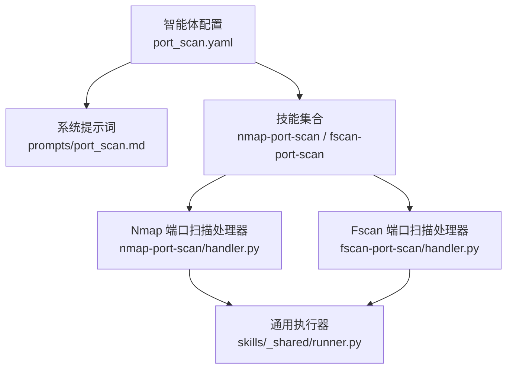
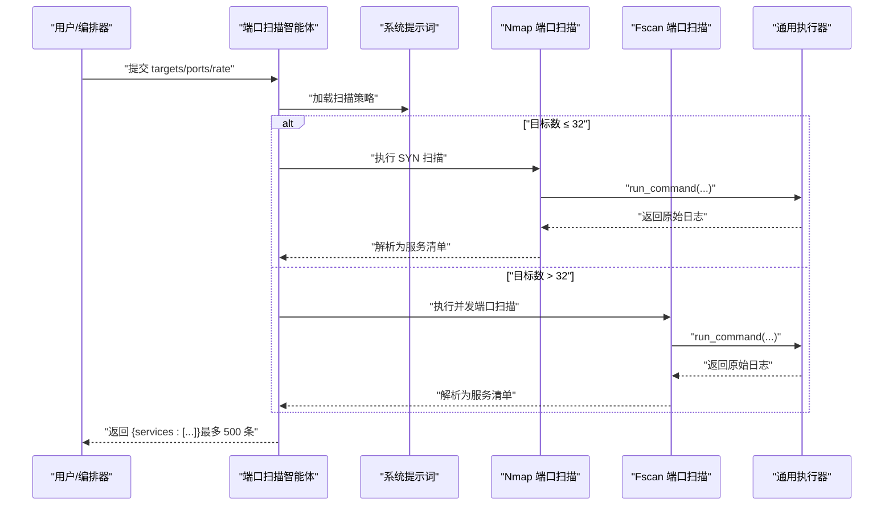
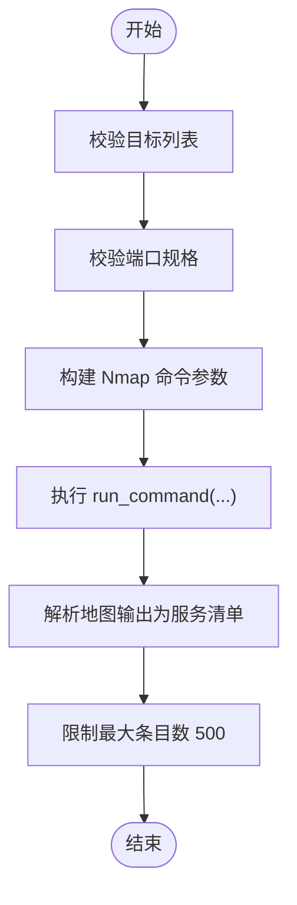
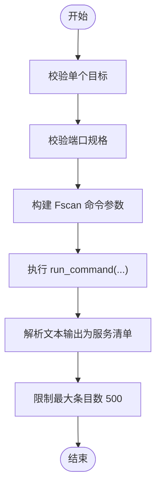
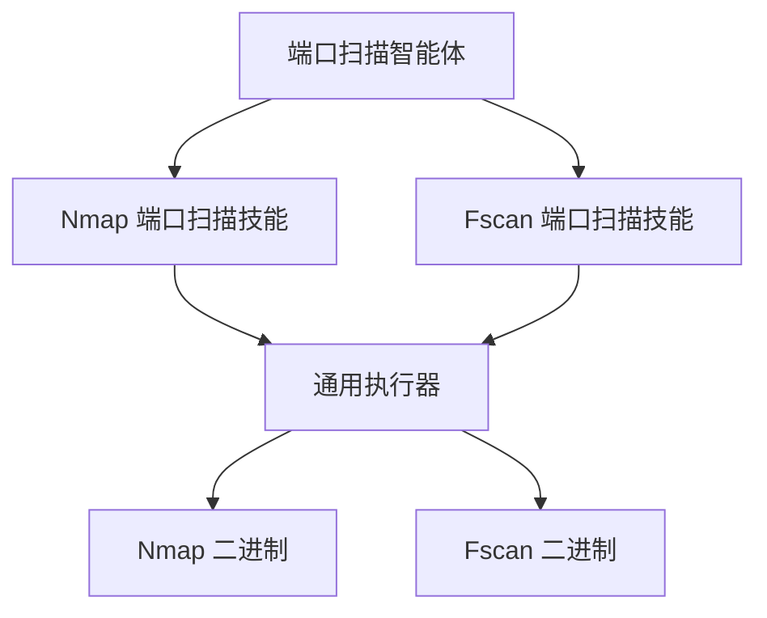

# 端口扫描智能体

<cite>
**本文引用的文件**
- [secbot/agents/port_scan.yaml](file://secbot/agents/port_scan.yaml)
- [secbot/agents/prompts/port_scan.md](file://secbot/agents/prompts/port_scan.md)
- [secbot/skills/nmap-port-scan/SKILL.md](file://secbot/skills/nmap-port-scan/SKILL.md)
- [secbot/skills/nmap-port-scan/handler.py](file://secbot/skills/nmap-port-scan/handler.py)
- [secbot/skills/nmap-port-scan/input.schema.json](file://secbot/skills/nmap-port-scan/input.schema.json)
- [secbot/skills/nmap-port-scan/output.schema.json](file://secbot/skills/nmap-port-scan/output.schema.json)
- [secbot/skills/fscan-port-scan/SKILL.md](file://secbot/skills/fscan-port-scan/SKILL.md)
- [secbot/skills/fscan-port-scan/handler.py](file://secbot/skills/fscan-port-scan/handler.py)
- [secbot/skills/fscan-port-scan/input.schema.json](file://secbot/skills/fscan-port-scan/input.schema.json)
- [secbot/skills/fscan-port-scan/output.schema.json](file://secbot/skills/fscan-port-scan/output.schema.json)
- [secbot/skills/_shared/runner.py](file://secbot/skills/_shared/runner.py)
</cite>

## 目录
1. [简介](#简介)
2. [项目结构](#项目结构)
3. [核心组件](#核心组件)
4. [架构总览](#架构总览)
5. [详细组件分析](#详细组件分析)
6. [依赖分析](#依赖分析)
7. [性能考虑](#性能考虑)
8. [故障排查指南](#故障排查指南)
9. [结论](#结论)
10. [附录](#附录)

## 简介
本文件面向“端口扫描智能体”，系统性说明其功能特性与实现方式，包括：
- TCP/UDP 端口枚举与开放端口识别
- 服务指纹识别与服务名称提取
- 端口状态分析与网络服务发现
- 扫描策略与扫描模式选择（基于目标规模）
- 目标范围与端口规格配置
- 技能依赖与外部工具集成（Nmap、Fscan）
- 结果解析与过滤机制
- 扫描参数调优与性能优化建议
- 常见扫描场景最佳实践

## 项目结构
端口扫描智能体由“智能体配置 + 提示词 + 技能集合”构成，核心文件如下：
- 智能体定义与输入输出约束：[secbot/agents/port_scan.yaml](file://secbot/agents/port_scan.yaml)
- 智能体系统提示词与流程策略：[secbot/agents/prompts/port_scan.md](file://secbot/agents/prompts/port_scan.md)
- 技能：Nmap 端口扫描、Fscan 端口扫描、Nmap 服务指纹识别（在智能体中被声明为可用）
- 技能执行器与通用运行器：[secbot/skills/nmap-port-scan/handler.py](file://secbot/skills/nmap-port-scan/handler.py)、[secbot/skills/fscan-port-scan/handler.py](file://secbot/skills/fscan-port-scan/handler.py)、[secbot/skills/_shared/runner.py](file://secbot/skills/_shared/runner.py)

图表来源
- [secbot/agents/port_scan.yaml:1-50](file://secbot/agents/port_scan.yaml#L1-L50)
- [secbot/agents/prompts/port_scan.md:1-24](file://secbot/agents/prompts/port_scan.md#L1-L24)
- [secbot/skills/nmap-port-scan/handler.py:1-48](file://secbot/skills/nmap-port-scan/handler.py#L1-L48)
- [secbot/skills/fscan-port-scan/handler.py:1-45](file://secbot/skills/fscan-port-scan/handler.py#L1-L45)
- [secbot/skills/_shared/runner.py:1-83](file://secbot/skills/_shared/runner.py#L1-L83)

章节来源
- [secbot/agents/port_scan.yaml:1-50](file://secbot/agents/port_scan.yaml#L1-L50)
- [secbot/agents/prompts/port_scan.md:1-24](file://secbot/agents/prompts/port_scan.md#L1-L24)

## 核心组件
- 智能体定义与输入输出约束
  - 输入包含目标列表、可选端口规格、速率等级；输出为服务清单（主机、端口、协议、服务名等），并限制最大条目数。
  - 参考路径：[secbot/agents/port_scan.yaml:18-50](file://secbot/agents/port_scan.yaml#L18-L50)
- 系统提示词与扫描策略
  - 明确先资产发现、后漏洞扫描的顺序；根据目标数量选择不同扫描技能；速率映射到 Nmap 的时序策略级别。
  - 参考路径：[secbot/agents/prompts/port_scan.md:10-18](file://secbot/agents/prompts/port_scan.md#L10-L18)
- 技能集合
  - 已声明技能：nmap-port-scan、nmap-service-fingerprint、fscan-port-scan。
  - 参考路径：[secbot/agents/port_scan.yaml:10-13](file://secbot/agents/port_scan.yaml#L10-L13)
- 外部工具与能力
  - Nmap：支持 SYN 扫描、主机/端口/协议/服务信息提取。
  - Fscan：多主机并发端口扫描，适合较大网段。
  - 参考路径：[secbot/skills/nmap-port-scan/SKILL.md:1-16](file://secbot/skills/nmap-port-scan/SKILL.md#L1-L16)、[secbot/skills/fscan-port-scan/SKILL.md:1-15](file://secbot/skills/fscan-port-scan/SKILL.md#L1-L15)

章节来源
- [secbot/agents/port_scan.yaml:10-16](file://secbot/agents/port_scan.yaml#L10-L16)
- [secbot/agents/prompts/port_scan.md:10-18](file://secbot/agents/prompts/port_scan.md#L10-L18)
- [secbot/skills/nmap-port-scan/SKILL.md:1-16](file://secbot/skills/nmap-port-scan/SKILL.md#L1-L16)
- [secbot/skills/fscan-port-scan/SKILL.md:1-15](file://secbot/skills/fscan-port-scan/SKILL.md#L1-L15)

## 架构总览
端口扫描智能体的工作流分为三步：
1) 接收目标与参数（目标列表、端口规格、速率）
2) 根据目标规模选择技能（小规模用 Nmap，大规模用 Fscan）
3) 解析原始输出，生成标准化服务清单并返回

图表来源
- [secbot/agents/prompts/port_scan.md:12-18](file://secbot/agents/prompts/port_scan.md#L12-L18)
- [secbot/skills/nmap-port-scan/handler.py:32-47](file://secbot/skills/nmap-port-scan/handler.py#L32-L47)
- [secbot/skills/fscan-port-scan/handler.py:31-44](file://secbot/skills/fscan-port-scan/handler.py#L31-L44)
- [secbot/skills/_shared/runner.py:38-82](file://secbot/skills/_shared/runner.py#L38-L82)

## 详细组件分析

### 智能体配置与输入输出
- 输入
  - targets：主机或 IP 列表（必填）
  - ports：端口规格字符串（如连续范围或“top-N”风格，非必填）
  - rate：扫描速率（slow/normal/fast）
- 输出
  - services：标准化服务数组，每项包含 host、port、protocol、service 等字段
  - 最大条目数限制为 500
- 参考路径
  - [secbot/agents/port_scan.yaml:18-50](file://secbot/agents/port_scan.yaml#L18-L50)

章节来源
- [secbot/agents/port_scan.yaml:18-50](file://secbot/agents/port_scan.yaml#L18-L50)

### 系统提示词与扫描策略
- 步骤
  - 若未指定端口，采用 top-1000
  - 小目标列表（≤32）：先 Nmap 端口扫描，再对开放端口进行服务指纹识别
  - 大目标列表（>32）：直接使用 Fscan 并发扫描
  - 速率映射：slow→-T2，normal→-T3，fast→-T4；不超出该智能体的限制
- 参考路径
  - [secbot/agents/prompts/port_scan.md:10-23](file://secbot/agents/prompts/port_scan.md#L10-L23)

章节来源
- [secbot/agents/prompts/port_scan.md:10-23](file://secbot/agents/prompts/port_scan.md#L10-L23)

### Nmap 端口扫描技能
- 能力概述
  - 使用 SYN 扫描（-sS）枚举开放 TCP 端口，结合主机存活与端口/协议/服务信息提取
- 关键实现点
  - 命令行参数：-sS -Pn -oG -p <ports> targets...
  - 输出解析：从 Nmap 地图格式中提取主机、端口、协议、服务名
  - 参数校验：目标与端口规格正则校验
  - 超时与计时：超时时间与执行耗时记录
- 参考路径
  - [secbot/skills/nmap-port-scan/handler.py:12-47](file://secbot/skills/nmap-port-scan/handler.py#L12-L47)
  - [secbot/skills/nmap-port-scan/input.schema.json:1-11](file://secbot/skills/nmap-port-scan/input.schema.json#L1-L11)
  - [secbot/skills/nmap-port-scan/output.schema.json:1-24](file://secbot/skills/nmap-port-scan/output.schema.json#L1-L24)

图表来源
- [secbot/skills/nmap-port-scan/handler.py:32-47](file://secbot/skills/nmap-port-scan/handler.py#L32-L47)
- [secbot/skills/_shared/runner.py:38-82](file://secbot/skills/_shared/runner.py#L38-L82)

章节来源
- [secbot/skills/nmap-port-scan/handler.py:12-47](file://secbot/skills/nmap-port-scan/handler.py#L12-L47)
- [secbot/skills/nmap-port-scan/input.schema.json:1-11](file://secbot/skills/nmap-port-scan/input.schema.json#L1-L11)
- [secbot/skills/nmap-port-scan/output.schema.json:1-24](file://secbot/skills/nmap-port-scan/output.schema.json#L1-L24)

### Fscan 端口扫描技能
- 能力概述
  - 针对多主机并发端口扫描，适合 /16 或更大网段
- 关键实现点
  - 命令行参数：-h <target> -p <ports> -nopoc -nobr
  - 输出解析：从文本中匹配“IP:端口 open”行，提取主机与端口，协议默认为 tcp
  - 参数校验：目标与端口规格正则校验
  - 超时与计时：超时时间与执行耗时记录
- 参考路径
  - [secbot/skills/fscan-port-scan/handler.py:12-44](file://secbot/skills/fscan-port-scan/handler.py#L12-L44)
  - [secbot/skills/fscan-port-scan/input.schema.json:1-11](file://secbot/skills/fscan-port-scan/input.schema.json#L1-L11)
  - [secbot/skills/fscan-port-scan/output.schema.json:1-24](file://secbot/skills/fscan-port-scan/output.schema.json#L1-L24)

图表来源
- [secbot/skills/fscan-port-scan/handler.py:31-44](file://secbot/skills/fscan-port-scan/handler.py#L31-L44)
- [secbot/skills/_shared/runner.py:38-82](file://secbot/skills/_shared/runner.py#L38-L82)

章节来源
- [secbot/skills/fscan-port-scan/handler.py:12-44](file://secbot/skills/fscan-port-scan/handler.py#L12-L44)
- [secbot/skills/fscan-port-scan/input.schema.json:1-11](file://secbot/skills/fscan-port-scan/input.schema.json#L1-L11)
- [secbot/skills/fscan-port-scan/output.schema.json:1-24](file://secbot/skills/fscan-port-scan/output.schema.json#L1-L24)

### 通用执行器与错误处理
- 统一执行流程
  - 校验目标与端口规格
  - 通过沙箱执行二进制命令，捕获原始日志
  - 调用解析器生成结构化结果
  - 记录耗时、退出码、异常信息
- 错误处理
  - 超时、取消、二进制缺失、解析异常均有明确分支
- 参考路径
  - [secbot/skills/_shared/runner.py:28-82](file://secbot/skills/_shared/runner.py#L28-L82)

章节来源
- [secbot/skills/_shared/runner.py:28-82](file://secbot/skills/_shared/runner.py#L28-L82)

## 依赖分析
- 智能体依赖
  - 依赖 Nmap 与 Fscan 外部二进制
  - 依赖通用执行器完成命令执行与日志捕获
- 技能依赖
  - Nmap 端口扫描：Nmap 二进制、地图输出解析
  - Fscan 端口扫描：Fscan 二进制、文本输出解析
- 外部依赖与网络策略
  - 技能声明为需要网络出站权限
  - 参考路径：[secbot/skills/nmap-port-scan/SKILL.md:7-9](file://secbot/skills/nmap-port-scan/SKILL.md#L7-L9)、[secbot/skills/fscan-port-scan/SKILL.md:7-8](file://secbot/skills/fscan-port-scan/SKILL.md#L7-L8)

图表来源
- [secbot/agents/port_scan.yaml:10-13](file://secbot/agents/port_scan.yaml#L10-L13)
- [secbot/skills/nmap-port-scan/SKILL.md:7-9](file://secbot/skills/nmap-port-scan/SKILL.md#L7-L9)
- [secbot/skills/fscan-port-scan/SKILL.md:7-8](file://secbot/skills/fscan-port-scan/SKILL.md#L7-L8)
- [secbot/skills/_shared/runner.py:38-82](file://secbot/skills/_shared/runner.py#L38-L82)

章节来源
- [secbot/agents/port_scan.yaml:10-13](file://secbot/agents/port_scan.yaml#L10-L13)
- [secbot/skills/nmap-port-scan/SKILL.md:7-9](file://secbot/skills/nmap-port-scan/SKILL.md#L7-L9)
- [secbot/skills/fscan-port-scan/SKILL.md:7-8](file://secbot/skills/fscan-port-scan/SKILL.md#L7-L8)
- [secbot/skills/_shared/runner.py:38-82](file://secbot/skills/_shared/runner.py#L38-L82)

## 性能考虑
- 目标规模与技能选择
  - 小目标（≤32）：优先 Nmap，便于后续服务指纹识别与更细粒度控制
  - 大目标（>32）：优先 Fscan，并发优势明显
- 速率与时序策略
  - slow→-T2，normal→-T3，fast→-T4；避免过高探测强度导致漏报或触发防护
- 超时与资源
  - Nmap 默认约 600 秒，Fscan 默认约 900 秒；可根据网络环境调整
- 输出上限
  - 服务清单最多 500 条，避免过大数据量影响下游处理

[本节为通用性能建议，无需特定文件引用]

## 故障排查指南
- 常见问题与定位
  - 目标或端口规格非法：检查输入是否符合正则约束
  - 二进制缺失：确认 Nmap/Fscan 是否安装且可执行
  - 超时：增大超时阈值或缩小目标/端口范围
  - 解析失败：查看原始日志文件，确认输出格式是否变化
- 相关实现参考
  - 参数校验与异常类型：[secbot/skills/_shared/runner.py:28-36](file://secbot/skills/_shared/runner.py#L28-L36)
  - 执行与错误分支：[secbot/skills/_shared/runner.py:62-82](file://secbot/skills/_shared/runner.py#L62-L82)
  - Nmap 输出解析失败回退：[secbot/skills/nmap-port-scan/handler.py:17-29](file://secbot/skills/nmap-port-scan/handler.py#L17-L29)
  - Fscan 输出解析失败回退：[secbot/skills/fscan-port-scan/handler.py:17-28](file://secbot/skills/fscan-port-scan/handler.py#L17-L28)

章节来源
- [secbot/skills/_shared/runner.py:28-36](file://secbot/skills/_shared/runner.py#L28-L36)
- [secbot/skills/_shared/runner.py:62-82](file://secbot/skills/_shared/runner.py#L62-L82)
- [secbot/skills/nmap-port-scan/handler.py:17-29](file://secbot/skills/nmap-port-scan/handler.py#L17-L29)
- [secbot/skills/fscan-port-scan/handler.py:17-28](file://secbot/skills/fscan-port-scan/handler.py#L17-L28)

## 结论
端口扫描智能体通过“策略驱动 + 多技能协同”的方式，在不同目标规模下自动选择最优扫描方案，并以统一的结构化输出支撑后续服务发现与漏洞扫描。其关键优势在于：
- 明确的扫描策略与速率控制
- 对 Nmap/Fscan 的深度集成与稳健解析
- 强约束的输入输出与安全的执行环境
- 可扩展的错误处理与性能调优空间

[本节为总结性内容，无需特定文件引用]

## 附录

### 扫描模式与策略速览
- 目标规模判定
  - 小于等于 32 个目标：Nmap 端口扫描 + 服务指纹识别
  - 大于 32 个目标：Fscan 并发端口扫描
- 速率映射
  - slow → -T2
  - normal → -T3
  - fast → -T4
- 端口规格
  - 支持连续范围与“top-N”风格（Nmap 默认 top-1000）

章节来源
- [secbot/agents/prompts/port_scan.md:12-18](file://secbot/agents/prompts/port_scan.md#L12-L18)

### 输入输出规范摘要
- 输入
  - targets：主机/IP 数组（必填）
  - ports：端口规格字符串（非必填）
  - rate：slow/normal/fast（默认 normal）
- 输出
  - services：数组，元素含 host、port、protocol、service 等
  - 最大条目数：500

章节来源
- [secbot/agents/port_scan.yaml:18-50](file://secbot/agents/port_scan.yaml#L18-L50)