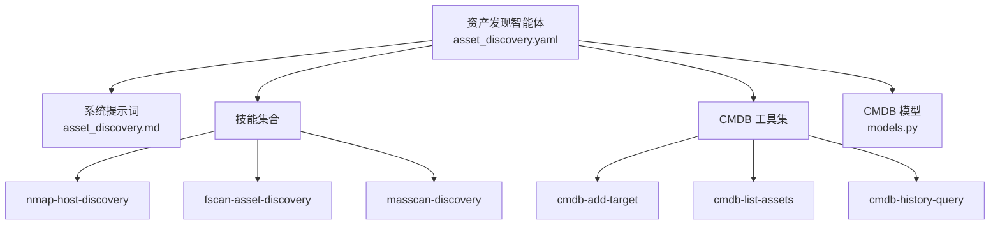
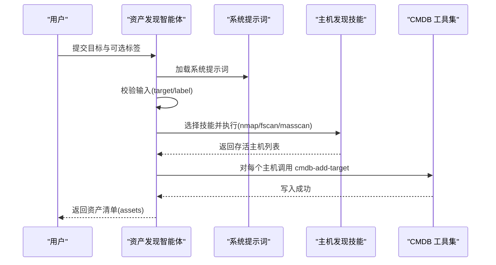
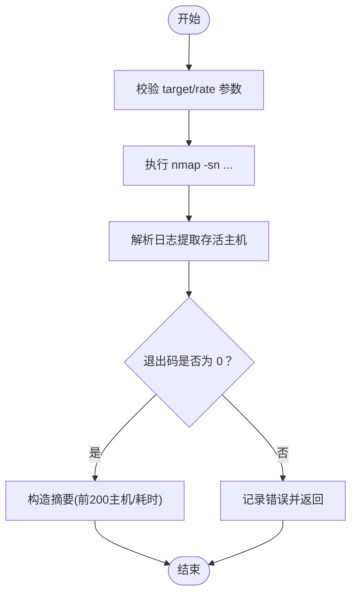
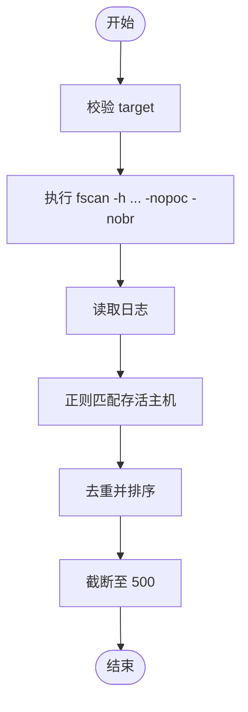
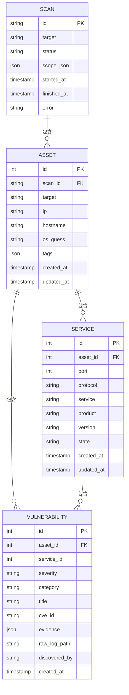
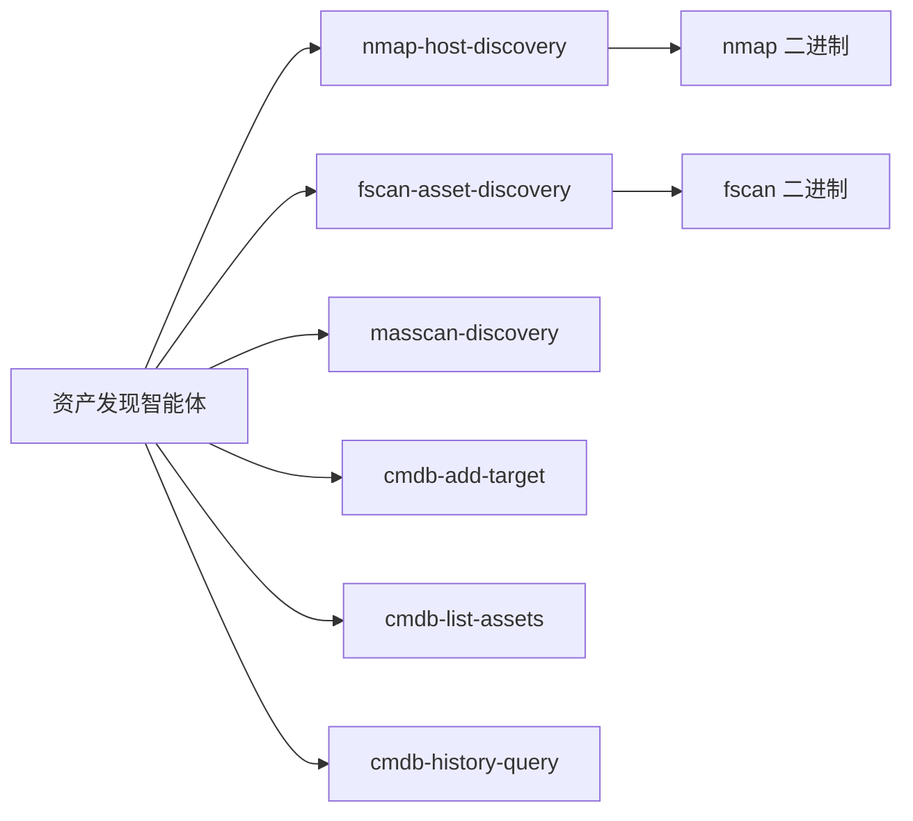

# 资产发现智能体

<cite>
**本文引用的文件**
- [secbot/agents/asset_discovery.yaml](file://secbot/agents/asset_discovery.yaml)
- [secbot/agents/prompts/asset_discovery.md](file://secbot/agents/prompts/asset_discovery.md)
- [secbot/skills/nmap-host-discovery/SKILL.md](file://secbot/skills/nmap-host-discovery/SKILL.md)
- [secbot/skills/nmap-host-discovery/handler.py](file://secbot/skills/nmap-host-discovery/handler.py)
- [secbot/skills/nmap-host-discovery/input.schema.json](file://secbot/skills/nmap-host-discovery/input.schema.json)
- [secbot/skills/nmap-host-discovery/output.schema.json](file://secbot/skills/nmap-host-discovery/output.schema.json)
- [secbot/skills/fscan-asset-discovery/handler.py](file://secbot/skills/fscan-asset-discovery/handler.py)
- [secbot/cmdb/models.py](file://secbot/cmdb/models.py)
</cite>

## 目录
1. [简介](#简介)
2. [项目结构](#项目结构)
3. [核心组件](#核心组件)
4. [架构总览](#架构总览)
5. [详细组件分析](#详细组件分析)
6. [依赖关系分析](#依赖关系分析)
7. [性能考量](#性能考量)
8. [故障排查指南](#故障排查指南)
9. [结论](#结论)
10. [附录](#附录)

## 简介
资产发现智能体是 VAPT 流程中的前置环节，负责在网络范围内发现存活主机、识别服务与生成基础资产清单，并将结果写入本地 CMDB。其核心职责包括：
- 网络拓扑探测：基于不同扫描器策略对目标进行主机存活探测
- 主机存活检测：从扫描结果中提取存活主机列表
- 服务识别：为后续端口扫描与漏洞扫描提供目标清单
- 基本资产清单生成：标准化输出资产条目，供编排器分页与后续流程消费
- CMDB 集成：将发现的资产写入本地数据库，支持查询与历史扫描追踪

该智能体在端口扫描与漏洞扫描之前运行，确保后续阶段仅针对已确认的存活主机执行，从而提升整体效率与准确性。

## 项目结构
资产发现智能体由“智能体定义 + 系统提示词 + 技能集合 + CMDB 模型”四部分组成：
- 智能体定义：声明输入输出模式、可选技能、最大迭代次数等元数据
- 系统提示词：定义执行流程、工具使用策略与输出规范
- 技能集合：包含三种主机发现技能与三项 CMDB 辅助工具
- CMDB 模型：定义扫描、资产、服务、漏洞等实体及字段约束

图表来源
- [secbot/agents/asset_discovery.yaml:1-46](file://secbot/agents/asset_discovery.yaml#L1-L46)
- [secbot/agents/prompts/asset_discovery.md:1-28](file://secbot/agents/prompts/asset_discovery.md#L1-L28)
- [secbot/cmdb/models.py:1-178](file://secbot/cmdb/models.py#L1-L178)

章节来源
- [secbot/agents/asset_discovery.yaml:1-46](file://secbot/agents/asset_discovery.yaml#L1-L46)
- [secbot/agents/prompts/asset_discovery.md:1-28](file://secbot/agents/prompts/asset_discovery.md#L1-L28)
- [secbot/cmdb/models.py:1-178](file://secbot/cmdb/models.py#L1-L178)

## 核心组件
- 智能体定义与元数据
  - 名称与显示名：资产探测
  - 描述：在目标 CIDR/IP/域名下发现存活主机、服务与基础资产清单；先于端口扫描与漏洞扫描；同时暴露本地 CMDB 的读写辅助工具
  - 可用技能：nmap-host-discovery、fscan-asset-discovery、masscan-discovery、cmdb-add-target、cmdb-list-assets、cmdb-history-query
  - 输入模式：target（必填，字符串，支持 CIDR/IP/域名），label（可选，人类标签）
  - 输出模式：assets 数组，每项包含 target、kind（cidr/ip/domain）、label
  - 迭代限制：最多 8 次
  - 计划步骤：开启计划步骤输出
- 系统提示词
  - 工具集合：主机发现技能与 CMDB 辅助工具
  - 执行流程：校验输入形状 → 基于目标规模选择技能 → 对每个发现的主机调用 cmdb-add-target → 一旦存活主机列表稳定即停止
  - 输出规范：返回符合输出模式的 JSON，列表截断至前 200 条，编排器通过 CMDB 分页

章节来源
- [secbot/agents/asset_discovery.yaml:1-46](file://secbot/agents/asset_discovery.yaml#L1-L46)
- [secbot/agents/prompts/asset_discovery.md:1-28](file://secbot/agents/prompts/asset_discovery.md#L1-L28)

## 架构总览
资产发现智能体的执行路径如下：
- 接收用户输入（目标与可选标签）
- 校验输入合法性
- 根据目标规模选择合适的主机发现技能
- 执行技能并解析扫描日志，提取存活主机
- 将每个存活主机写入 CMDB
- 返回标准化资产清单

图表来源
- [secbot/agents/asset_discovery.yaml:1-46](file://secbot/agents/asset_discovery.yaml#L1-L46)
- [secbot/agents/prompts/asset_discovery.md:1-28](file://secbot/agents/prompts/asset_discovery.md#L1-L28)

## 详细组件分析

### 系统提示词与执行流程
- 工具集合：nmap-host-discovery、fscan-asset-discovery、masscan-discovery、cmdb-add-target、cmdb-list-assets、cmdb-history-query
- 执行步骤：
  1) 校验目标形状（CIDR/IP/域名），拒绝明显非法输入
  2) 基于目标规模选择技能：
     - /24 或更小：优先 nmap-host-discovery
     - 更大范围：优先 masscan-discovery（更快）
     - 多类混合资产：优先 fscan-asset-discovery
  3) 对每个发现的主机调用 cmdb-add-target 一次
  4) 一旦存活主机列表稳定即停止，不再重复扫描
- 输出：返回符合输出模式的 JSON，列表截断至前 200 条

章节来源
- [secbot/agents/prompts/asset_discovery.md:1-28](file://secbot/agents/prompts/asset_discovery.md#L1-L28)

### 技能一：Nmap 主机发现（nmap-host-discovery）
- 功能概述：使用 nmap -sn（Ping 扫描）在 ICMP Echo、TCP SYN（80/443）、ICMP 时间戳、ARP（本地链路）等条件下探测存活主机
- 参数
  - target：CIDR、单个 IP 或主机名
  - rate：slow/normal/fast → 映射到 -T2/-T3/-T4
- 输出摘要结构：包含 hosts_up（最多 200 个）、elapsed_sec、error（如有）
- 安全与合规：需要网络出站权限；超时或取消会返回相应状态；二进制缺失将抛出异常
- 日志：原始 nmap 输出保存在工作目录下的日志文件中，LLM 仅看到摘要

图表来源
- [secbot/skills/nmap-host-discovery/handler.py:35-81](file://secbot/skills/nmap-host-discovery/handler.py#L35-L81)
- [secbot/skills/nmap-host-discovery/input.schema.json:1-19](file://secbot/skills/nmap-host-discovery/input.schema.json#L1-L19)
- [secbot/skills/nmap-host-discovery/output.schema.json:1-16](file://secbot/skills/nmap-host-discovery/output.schema.json#L1-L16)

章节来源
- [secbot/skills/nmap-host-discovery/SKILL.md:1-36](file://secbot/skills/nmap-host-discovery/SKILL.md#L1-L36)
- [secbot/skills/nmap-host-discovery/handler.py:35-81](file://secbot/skills/nmap-host-discovery/handler.py#L35-L81)
- [secbot/skills/nmap-host-discovery/input.schema.json:1-19](file://secbot/skills/nmap-host-discovery/input.schema.json#L1-L19)
- [secbot/skills/nmap-host-discovery/output.schema.json:1-16](file://secbot/skills/nmap-host-discovery/output.schema.json#L1-L16)

### 技能二：Fscan 资产发现（fscan-asset-discovery）
- 功能概述：使用 fscan -nopoc -nobr 快速多协议存活探测（含 ICMP），适合 /16-/24 子网
- 参数
  - target：CIDR/IP/域名
- 输出摘要结构：包含 hosts_up（最多 500 个）
- 解析逻辑：从日志中提取 “Target X.X.X.X is alive” 形式的行，去重并排序后取前 500

图表来源
- [secbot/skills/fscan-asset-discovery/handler.py:24-36](file://secbot/skills/fscan-asset-discovery/handler.py#L24-L36)

章节来源
- [secbot/skills/fscan-asset-discovery/handler.py:24-36](file://secbot/skills/fscan-asset-discovery/handler.py#L24-L36)

### 技能三：Masscan 发现（masscan-discovery）
- 说明：作为大规模网段的快速主机发现技能，适用于更大范围的目标
- 使用策略：当目标规模大于 /24 时优先选择该技能以提升速度

章节来源
- [secbot/agents/prompts/asset_discovery.md:17-20](file://secbot/agents/prompts/asset_discovery.md#L17-L20)

### CMDB 集成能力
- cmdb-add-target：将发现的主机写入 CMDB，记录扫描关联、IP、主机名、操作系统猜测、标签等
- cmdb-list-assets：列出当前 CMDB 中的资产
- cmdb-history-query：查询历史扫描记录与资产变化
- 数据模型概览
  - Scan：扫描任务表，包含目标、状态、时间戳、错误信息
  - Asset：资产表，包含扫描关联、目标、IP、主机名、操作系统猜测、标签、时间戳
  - Service：服务表，包含资产关联、端口、协议、服务名、产品、版本、状态
  - Vulnerability：漏洞表，包含资产/服务关联、严重级别、类别、标题、CVE 编号、证据、原始日志路径、发现来源

图表来源
- [secbot/cmdb/models.py:38-178](file://secbot/cmdb/models.py#L38-L178)

章节来源
- [secbot/cmdb/models.py:1-178](file://secbot/cmdb/models.py#L1-L178)

## 依赖关系分析
- 智能体对技能的依赖
  - 资产发现智能体在执行前根据目标规模选择具体技能（nmap/fscan/masscan）
  - 每个技能封装了外部二进制调用、参数校验、日志解析与摘要生成
- 智能体对 CMDB 的依赖
  - 在发现主机后调用 cmdb-add-target 写入资产
  - 通过 cmdb-list-assets 与 cmdb-history-query 支持查询与历史追踪
- 外部依赖
  - nmap：需要安装并满足最低版本要求
  - fscan：需要安装并具备执行权限
  - 网络出站：技能执行需要网络访问

图表来源
- [secbot/agents/asset_discovery.yaml:11-17](file://secbot/agents/asset_discovery.yaml#L11-L17)
- [secbot/skills/nmap-host-discovery/SKILL.md:7-8](file://secbot/skills/nmap-host-discovery/SKILL.md#L7-L8)
- [secbot/skills/fscan-asset-discovery/SKILL.md:7](file://secbot/skills/fscan-asset-discovery/SKILL.md#L7)

章节来源
- [secbot/agents/asset_discovery.yaml:11-17](file://secbot/agents/asset_discovery.yaml#L11-L17)
- [secbot/skills/nmap-host-discovery/SKILL.md:7-8](file://secbot/skills/nmap-host-discovery/SKILL.md#L7-L8)
- [secbot/skills/fscan-asset-discovery/SKILL.md:7](file://secbot/skills/fscan-asset-discovery/SKILL.md#L7)

## 性能考量
- 选择合适技能
  - 小型网段（/24 或更小）：优先 nmap-host-discovery，准确度高
  - 大型网段：优先 masscan-discovery，速度快
  - 混合资产：优先 fscan-asset-discovery，覆盖多协议
- 输出截断
  - 单次返回最多 200 条资产，编排器通过 CMDB 分页查询完整清单
- 超时与取消
  - nmap-host-discovery 设置了合理的超时时间；取消或超时会返回相应状态，避免长时间阻塞
- 日志与解析
  - 技能将原始输出写入日志文件，LLM 仅消费摘要，降低令牌消耗与噪声

章节来源
- [secbot/agents/prompts/asset_discovery.md:17-27](file://secbot/agents/prompts/asset_discovery.md#L17-L27)
- [secbot/skills/nmap-host-discovery/handler.py:57-60](file://secbot/skills/nmap-host-discovery/handler.py#L57-L60)
- [secbot/skills/nmap-host-discovery/output.schema.json:8-10](file://secbot/skills/nmap-host-discovery/output.schema.json#L8-L10)

## 故障排查指南
- 常见问题
  - 目标格式不合法：系统提示词会拒绝明显无效输入；请检查是否为 CIDR/IP/域名
  - 二进制缺失：nmap 或 fscan 未安装或不可执行；请按技能说明准备环境
  - 网络受限：技能需要网络出站权限；请检查安全策略
  - 超时或取消：大规模扫描可能超时；可调整目标范围或速率参数
- 定位方法
  - 查看技能输出摘要中的 error 字段与 elapsed_sec
  - 检查工作目录中的原始日志文件，定位具体失败原因
- 建议
  - 先用小范围目标验证流程，再扩展到大网段
  - 对混合资产场景优先使用 fscan-asset-discovery
  - 使用 CMDB 查询接口核对写入结果与历史扫描

章节来源
- [secbot/agents/prompts/asset_discovery.md:15-16](file://secbot/agents/prompts/asset_discovery.md#L15-L16)
- [secbot/skills/nmap-host-discovery/handler.py:57-80](file://secbot/skills/nmap-host-discovery/handler.py#L57-L80)
- [secbot/skills/nmap-host-discovery/input.schema.json:6-16](file://secbot/skills/nmap-host-discovery/input.schema.json#L6-L16)

## 结论
资产发现智能体通过明确的系统提示词与技能选择策略，在 VAPT 流程中承担关键的前置角色。它能够根据目标规模自动选择最适合的主机发现技能，稳定地提取存活主机并写入 CMDB，为后续端口扫描与漏洞扫描提供高质量的目标清单。配合 CMDB 的查询与历史追踪能力，该智能体实现了从“发现—记录—分页—复用”的闭环。

## 附录

### 配置参数说明
- 智能体输入
  - target：必填，字符串，支持 CIDR/IP/域名
  - label：可选，字符串，写入 CMDB 的人类标签
- nmap-host-discovery
  - target：必填，字符串
  - rate：可选，枚举 slow/normal/fast，默认 normal
- fscan-asset-discovery
  - target：必填，字符串

章节来源
- [secbot/agents/asset_discovery.yaml:22-32](file://secbot/agents/asset_discovery.yaml#L22-L32)
- [secbot/skills/nmap-host-discovery/input.schema.json:6-16](file://secbot/skills/nmap-host-discovery/input.schema.json#L6-L16)
- [secbot/skills/fscan-asset-discovery/handler.py:24-35](file://secbot/skills/fscan-asset-discovery/handler.py#L24-L35)

### 使用示例（步骤说明）
- 示例一：对 /24 子网进行资产发现
  - 步骤：提交 target 为 CIDR（如 10.0.0.0/24），label 可选
  - 智能体：选择 nmap-host-discovery 执行，解析日志提取存活主机
  - 结果：返回前 200 条资产清单，CMDB 中写入对应主机
- 示例二：对大型网段进行快速发现
  - 步骤：提交 target 为较大 CIDR（如 10.0.0.0/16）
  - 智能体：选择 masscan-discovery 执行，快速得到存活主机
  - 结果：返回前 200 条资产清单，CMDB 中写入对应主机
- 示例三：混合资产场景
  - 步骤：提交 target 为域名或较大范围
  - 智能体：选择 fscan-asset-discovery 执行，覆盖多协议探测
  - 结果：返回前 500 条存活主机（技能上限），CMDB 中写入对应主机

章节来源
- [secbot/agents/prompts/asset_discovery.md:17-22](file://secbot/agents/prompts/asset_discovery.md#L17-L22)
- [secbot/skills/nmap-host-discovery/output.schema.json:8-10](file://secbot/skills/nmap-host-discovery/output.schema.json#L8-L10)
- [secbot/skills/fscan-asset-discovery/handler.py:20-21](file://secbot/skills/fscan-asset-discovery/handler.py#L20-L21)

### 最佳实践建议
- 目标规模与技能匹配：小网段用 nmap，大网段用 masscan，混合用 fscan
- 输出截断与分页：单次返回最多 200 条，完整清单通过 CMDB 分页查询
- 环境准备：确保 nmap/fscan 可用且具备网络出站权限
- 错误处理：关注技能摘要中的 error 字段，结合原始日志定位问题
- 标签管理：为每次扫描设置 label，便于后续检索与审计

章节来源
- [secbot/agents/prompts/asset_discovery.md:17-27](file://secbot/agents/prompts/asset_discovery.md#L17-L27)
- [secbot/skills/nmap-host-discovery/output.schema.json:8-14](file://secbot/skills/nmap-host-discovery/output.schema.json#L8-L14)
- [secbot/skills/fscan-asset-discovery/handler.py:20-21](file://secbot/skills/fscan-asset-discovery/handler.py#L20-L21)