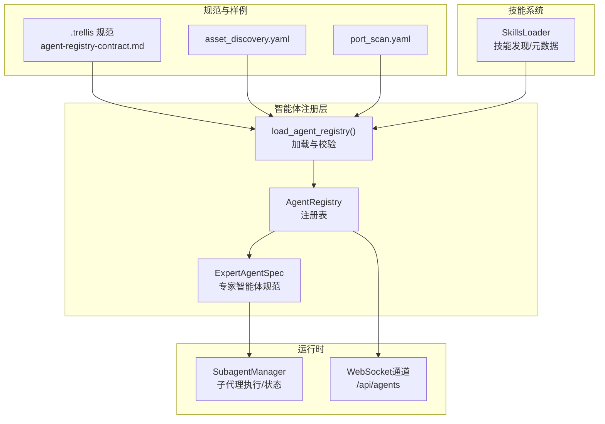
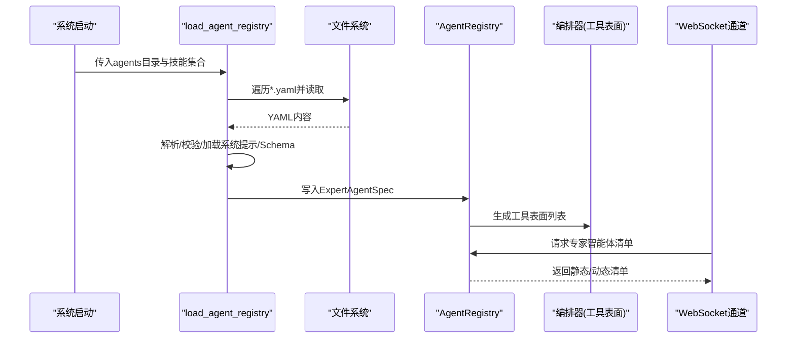
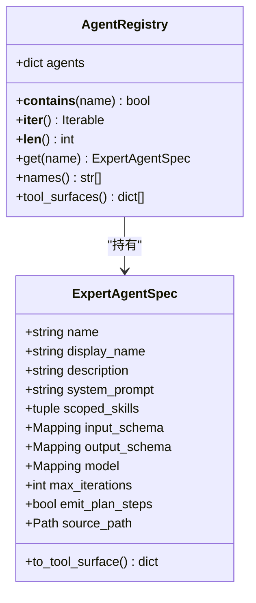
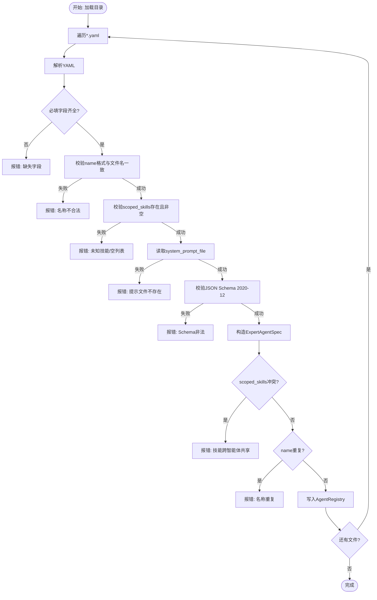
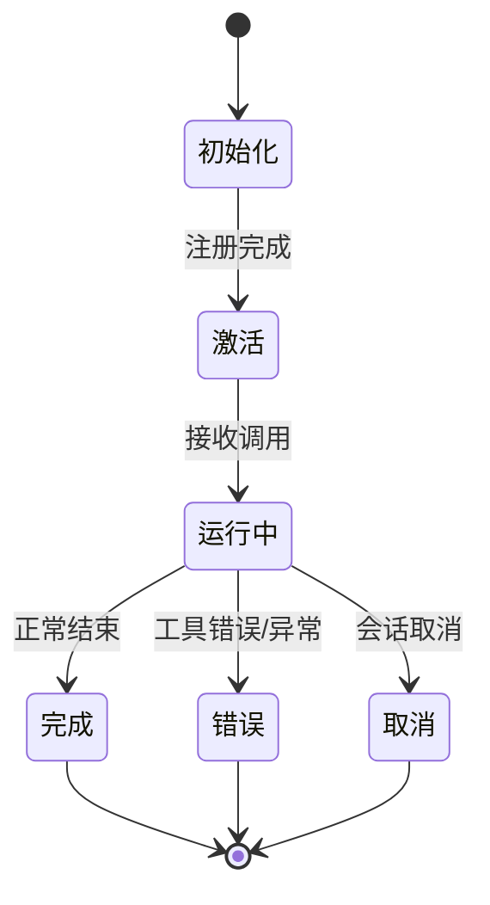
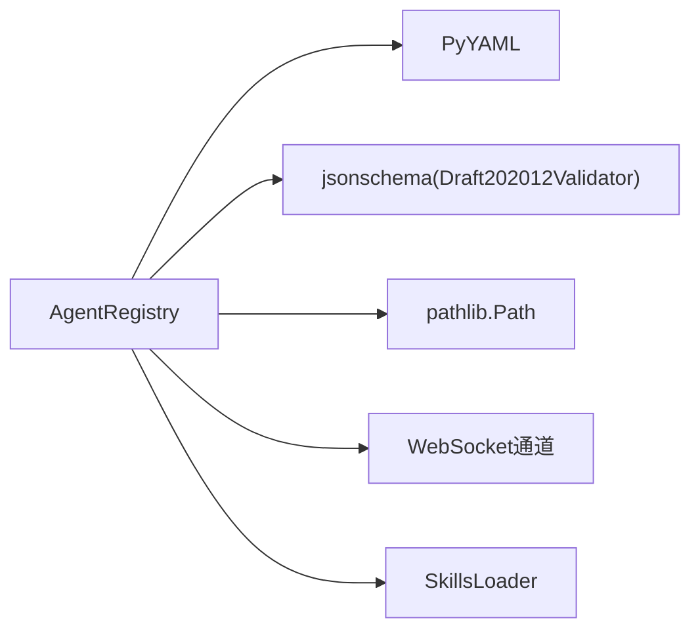

# 智能体注册与发现

<cite>
**本文引用的文件**
- [secbot/agents/registry.py](file://secbot/agents/registry.py)
- [secbot/agents/__init__.py](file://secbot/agents/__init__.py)
- [.trellis/spec/backend/agent-registry-contract.md](file://.trellis/spec/backend/agent-registry-contract.md)
- [secbot/agents/asset_discovery.yaml](file://secbot/agents/asset_discovery.yaml)
- [secbot/agents/port_scan.yaml](file://secbot/agents/port_scan.yaml)
- [secbot/agent/skills.py](file://secbot/agent/skills.py)
- [secbot/agent/subagent.py](file://secbot/agent/subagent.py)
- [secbot/channels/websocket.py](file://secbot/channels/websocket.py)
- [tests/agent/test_agent_registry.py](file://tests/agent/test_agent_registry.py)
- [secbot/secbot.py](file://secbot/secbot.py)
</cite>

## 目录
1. [简介](#简介)
2. [项目结构](#项目结构)
3. [核心组件](#核心组件)
4. [架构总览](#架构总览)
5. [详细组件分析](#详细组件分析)
6. [依赖分析](#依赖分析)
7. [性能考虑](#性能考虑)
8. [故障排查指南](#故障排查指南)
9. [结论](#结论)
10. [附录](#附录)

## 简介
本文件面向VAPT3平台的“智能体注册系统”，围绕AgentRegistry类与ExpertAgentSpec数据结构展开，系统性说明智能体的发现、加载、验证与注册流程；阐述智能体间依赖关系与冲突处理；解释智能体生命周期（初始化、激活、停用、卸载）在当前架构中的体现；并提供扩展与自定义开发指南及查询检索能力说明。

## 项目结构
- 智能体注册与规范：
  - 注册表实现：secbot/agents/registry.py
  - 公开导出入口：secbot/agents/__init__.py
  - 合约与规范：.trellis/spec/backend/agent-registry-contract.md
- 智能体声明样例：
  - secbot/agents/*.yaml（如资产发现、端口扫描等）
- 技能系统：
  - secbot/agent/skills.py（技能发现与元数据解析）
- 子代理执行与生命周期：
  - secbot/agent/subagent.py（子代理管理器与状态）
- 查询与暴露：
  - secbot/channels/websocket.py（对外暴露静态/动态注册表）

图表来源
- [secbot/agents/registry.py:99-144](file://secbot/agents/registry.py#L99-L144)
- [.trellis/spec/backend/agent-registry-contract.md:88-119](file://.trellis/spec/backend/agent-registry-contract.md#L88-L119)
- [secbot/agents/asset_discovery.yaml:1-46](file://secbot/agents/asset_discovery.yaml#L1-L46)
- [secbot/agents/port_scan.yaml:1-50](file://secbot/agents/port_scan.yaml#L1-L50)
- [secbot/agent/skills.py:21-142](file://secbot/agent/skills.py#L21-L142)
- [secbot/agent/subagent.py:70-168](file://secbot/agent/subagent.py#L70-L168)
- [secbot/channels/websocket.py:1341-1394](file://secbot/channels/websocket.py#L1341-L1394)

章节来源
- [secbot/agents/registry.py:1-248](file://secbot/agents/registry.py#L1-L248)
- [.trellis/spec/backend/agent-registry-contract.md:1-140](file://.trellis/spec/backend/agent-registry-contract.md#L1-L140)
- [secbot/agents/asset_discovery.yaml:1-46](file://secbot/agents/asset_discovery.yaml#L1-L46)
- [secbot/agents/port_scan.yaml:1-50](file://secbot/agents/port_scan.yaml#L1-L50)
- [secbot/agent/skills.py:1-243](file://secbot/agent/skills.py#L1-L243)
- [secbot/agent/subagent.py:1-360](file://secbot/agent/subagent.py#L1-L360)
- [secbot/channels/websocket.py:1341-1394](file://secbot/channels/websocket.py#L1341-L1394)

## 核心组件
- AgentRegistry：内存中按名称索引的专家智能体注册表，提供查询、工具表面生成与迭代能力。
- ExpertAgentSpec：经过验证与归一化的专家智能体数据结构，包含名称、显示名、描述、系统提示、作用域技能集合、输入/输出JSON Schema、模型参数、最大迭代次数、是否渲染步骤等字段，并可生成供编排器使用的工具表面。
- load_agent_registry：从目录批量加载与校验专家智能体YAML，构建注册表；同时进行技能归属冲突检查与重复名称检测。
- SkillsLoader：技能发现与元数据解析，用于在注册阶段对scoped_skills进行解析与可用性检查。
- SubagentManager：子代理执行与状态管理，体现智能体生命周期中的“运行中/完成/错误”等状态转换。
- WebSocket通道：对外暴露专家智能体注册表，支持静态清单与带运行时状态的动态清单。

章节来源
- [secbot/agents/registry.py:37-91](file://secbot/agents/registry.py#L37-L91)
- [secbot/agents/registry.py:99-144](file://secbot/agents/registry.py#L99-L144)
- [secbot/agent/skills.py:21-142](file://secbot/agent/skills.py#L21-L142)
- [secbot/agent/subagent.py:28-100](file://secbot/agent/subagent.py#L28-L100)
- [secbot/channels/websocket.py:1341-1394](file://secbot/channels/websocket.py#L1341-L1394)

## 架构总览
专家智能体通过YAML声明，由注册表在系统启动时一次性加载并校验，随后以“单一工具”的形式向编排器暴露。技能作为实现细节被封装在智能体内部，避免路由歧义。运行时通过子代理管理器执行具体任务，状态通过消息总线回传至主循环。

图表来源
- [secbot/agents/registry.py:99-144](file://secbot/agents/registry.py#L99-L144)
- [.trellis/spec/backend/agent-registry-contract.md:88-119](file://.trellis/spec/backend/agent-registry-contract.md#L88-L119)
- [secbot/channels/websocket.py:1341-1394](file://secbot/channels/websocket.py#L1341-L1394)

## 详细组件分析

### AgentRegistry 类与 ExpertAgentSpec 数据结构
- AgentRegistry
  - 字段：agents（名称到ExpertAgentSpec映射）
  - 方法：__contains__/__iter__/__len__/get/names/tool_surfaces
  - 工具表面：to_tool_surface将ExpertAgentSpec转为编排器可见的函数工具定义
- ExpertAgentSpec
  - 关键字段：name/display_name/description/system_prompt/scoped_skills/input_schema/output_schema/model/max_iterations/emit_plan_steps/source_path
  - 行为：to_tool_surface生成LLM工具面

图表来源
- [secbot/agents/registry.py:65-91](file://secbot/agents/registry.py#L65-L91)
- [secbot/agents/registry.py:37-62](file://secbot/agents/registry.py#L37-L62)

章节来源
- [secbot/agents/registry.py:37-91](file://secbot/agents/registry.py#L37-L91)

### 注册流程与验证规则
- 发现与加载
  - 遍历agents目录下所有*.yaml
  - 逐个解析YAML并进行字段完整性与类型校验
  - 校验name格式、与文件名一致、scoped_skills非空且全部存在于已知技能集合
  - 校验system_prompt_file存在并可读取
  - 校验input_schema与output_schema为合法JSON Schema 2020-12
  - 可选字段：model（映射）、max_iterations（正整数）、emit_plan_steps（布尔）、display_name/description非空
- 冲突与重复
  - scoped_skills跨智能体不可共享（见合约第5条），否则抛出错误
  - 智能体name重复则抛出错误
- 工具表面生成
  - 将每个ExpertAgentSpec转为编排器可见的函数工具定义（name/description/parameters）

图表来源
- [secbot/agents/registry.py:147-236](file://secbot/agents/registry.py#L147-L236)
- [.trellis/spec/backend/agent-registry-contract.md:76-119](file://.trellis/spec/backend/agent-registry-contract.md#L76-L119)

章节来源
- [secbot/agents/registry.py:99-144](file://secbot/agents/registry.py#L99-L144)
- [secbot/agents/registry.py:147-236](file://secbot/agents/registry.py#L147-L236)
- [.trellis/spec/backend/agent-registry-contract.md:76-119](file://.trellis/spec/backend/agent-registry-contract.md#L76-L119)

### 智能体间依赖关系与冲突解决
- 依赖关系
  - 专家智能体通过scoped_skills声明其能力边界，这些技能来自技能系统（secbot/skills/<name>/SKILL.md）
  - 注册阶段会基于提供的技能集合校验scoped_skills有效性
- 冲突解决
  - 合约明确禁止跨智能体共享同一技能，注册阶段即刻失败，避免路由歧义
  - 建议：若多个智能体需要共同能力，应将其抽象为独立的专家智能体或通过工具/上下文共享而非技能共享

章节来源
- [.trellis/spec/backend/agent-registry-contract.md:125-132](file://.trellis/spec/backend/agent-registry-contract.md#L125-L132)
- [secbot/agents/registry.py:128-142](file://secbot/agents/registry.py#L128-L142)

### 生命周期管理（初始化、激活、停用、卸载）
- 初始化
  - 系统启动时一次性加载注册表（启动时加载，不支持热重载）
- 激活
  - 注册完成后，专家智能体以“单一工具”形式进入编排器工具面，供LLM调用
- 运行期执行
  - 实际任务由子代理管理器（SubagentManager）异步执行，维护任务状态（初始化/等待工具/工具完成/最终响应/完成/错误）
- 停用/取消
  - 支持按会话取消（cancel_by_session），清理运行中任务并回调收尾
- 卸载
  - 当前实现未提供动态卸载接口；注册表在进程生命周期内保持不变

图表来源
- [secbot/agent/subagent.py:70-168](file://secbot/agent/subagent.py#L70-L168)
- [secbot/agent/subagent.py:154-255](file://secbot/agent/subagent.py#L154-L255)

章节来源
- [secbot/agent/subagent.py:70-168](file://secbot/agent/subagent.py#L70-L168)
- [secbot/agent/subagent.py:154-255](file://secbot/agent/subagent.py#L154-L255)

### 查询与检索功能
- 静态清单
  - WebSocket通道提供专家智能体静态清单（名称、显示名、描述、作用域技能）
- 动态状态
  - 可选include_status=true时，返回每个智能体的运行状态、当前任务ID、进度与心跳时间
- 注册表查询
  - AgentRegistry提供names()/tool_surfaces()/get()等方法，便于上层系统检索与展示

章节来源
- [secbot/channels/websocket.py:1341-1394](file://secbot/channels/websocket.py#L1341-L1394)
- [secbot/agents/registry.py:80-91](file://secbot/agents/registry.py#L80-L91)

### 开发指南：扩展与自定义
- 接口与规范
  - 遵循合约规范（agent-registry-contract.md），确保YAML字段完整、命名规范、Schema合法
- 注册流程
  - 在secbot/agents/目录新增*.yaml，声明name/display_name/description/system_prompt_file/scoped_skills/input_schema/output_schema等
  - 确保scoped_skills对应的实际技能存在（secbot/skills/<name>/SKILL.md）
- 测试方法
  - 使用测试用例验证缺失字段、名称不匹配、非法名称、空scoped_skills、未知技能、提示文件缺失、非法Schema、技能共享冲突、负迭代次数等场景
- 最佳实践
  - 保持scoped_skills唯一性，避免跨智能体共享同一技能
  - 输入/输出Schema严格遵循JSON Schema 2020-12
  - 使用稳定的工具表面（Sorted names）保证提示稳定性

章节来源
- [.trellis/spec/backend/agent-registry-contract.md:24-119](file://.trellis/spec/backend/agent-registry-contract.md#L24-L119)
- [tests/agent/test_agent_registry.py:107-173](file://tests/agent/test_agent_registry.py#L107-L173)
- [secbot/agent/skills.py:21-142](file://secbot/agent/skills.py#L21-L142)

## 依赖分析
- 组件耦合
  - AgentRegistry依赖YAML文件与JSON Schema校验库
  - 注册流程依赖技能系统（SkillsLoader）进行scoped_skills解析
  - WebSocket通道依赖AgentRegistry提供静态/动态清单
- 外部依赖
  - YAML解析（PyYAML）
  - JSON Schema校验（jsonschema.Draft202012Validator）
  - 文件系统路径解析（pathlib.Path）

图表来源
- [secbot/agents/registry.py:147-247](file://secbot/agents/registry.py#L147-L247)
- [secbot/agent/skills.py:21-142](file://secbot/agent/skills.py#L21-L142)
- [secbot/channels/websocket.py:1341-1394](file://secbot/channels/websocket.py#L1341-L1394)

章节来源
- [secbot/agents/registry.py:147-247](file://secbot/agents/registry.py#L147-L247)
- [secbot/agent/skills.py:21-142](file://secbot/agent/skills.py#L21-L142)
- [secbot/channels/websocket.py:1341-1394](file://secbot/channels/websocket.py#L1341-L1394)

## 性能考虑
- 启动时一次性加载：注册表在启动时完成构建，避免运行时频繁I/O
- Schema校验：使用Draft202012Validator进行离线校验，减少运行时开销
- 工具表面排序：按名称排序保证提示稳定，有利于缓存命中
- 子代理并发：SubagentManager限制最大并发并维护状态，避免资源争用

## 故障排查指南
- 常见错误与定位
  - 缺少必填字段：检查YAML字段完整性
  - 名称不合法或与文件名不一致：修正name与文件名
  - scoped_skills为空或未知：确认技能目录与名称
  - system_prompt_file不存在：确认相对路径与文件存在
  - JSON Schema非法：修正input_schema/output_schema
  - 技能跨智能体共享：拆分或抽象为独立智能体
  - max_iterations非正整数：修正为正整数
- 测试辅助
  - 使用测试用例覆盖上述场景，快速定位问题

章节来源
- [tests/agent/test_agent_registry.py:107-173](file://tests/agent/test_agent_registry.py#L107-L173)
- [secbot/agents/registry.py:147-247](file://secbot/agents/registry.py#L147-L247)

## 结论
VAPT3的智能体注册系统以YAML声明为核心，通过严格的加载与校验流程，在启动时构建不可变的注册表，并以单一工具面暴露给编排器。技能作为实现细节被封装在智能体内，避免路由歧义；运行时通过子代理管理器实现任务的生命周期管理。该设计在可扩展性、稳定性与安全性之间取得平衡，适合持续演进与增量扩展。

## 附录
- 示例智能体YAML
  - 资产发现：secbot/agents/asset_discovery.yaml
  - 端口扫描：secbot/agents/port_scan.yaml
- 技能系统
  - secbot/agent/skills.py提供技能发现、元数据解析与可用性检查
- 启动集成
  - secbot/secbot.py展示了如何从配置构建AgentLoop，注册表在启动阶段完成加载

章节来源
- [secbot/agents/asset_discovery.yaml:1-46](file://secbot/agents/asset_discovery.yaml#L1-L46)
- [secbot/agents/port_scan.yaml:1-50](file://secbot/agents/port_scan.yaml#L1-L50)
- [secbot/agent/skills.py:1-243](file://secbot/agent/skills.py#L1-L243)
- [secbot/secbot.py:36-91](file://secbot/secbot.py#L36-L91)