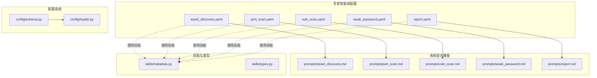
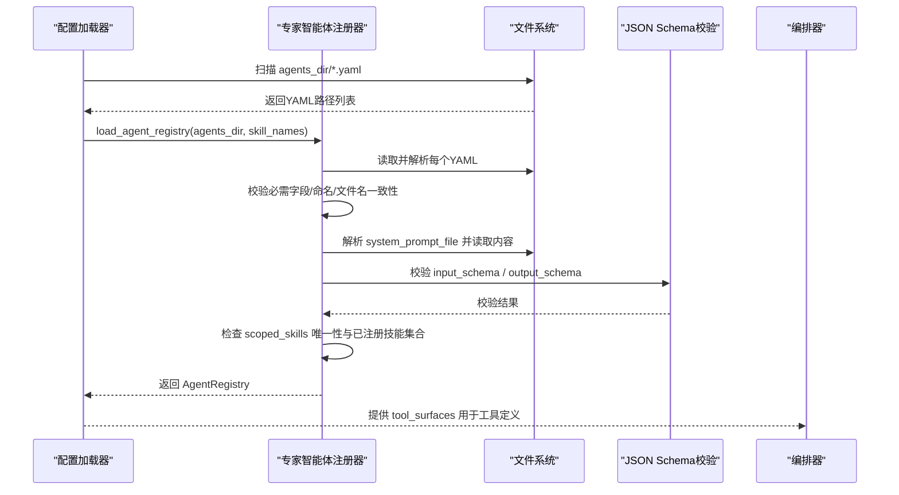
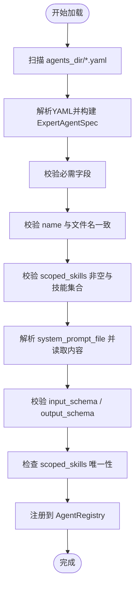
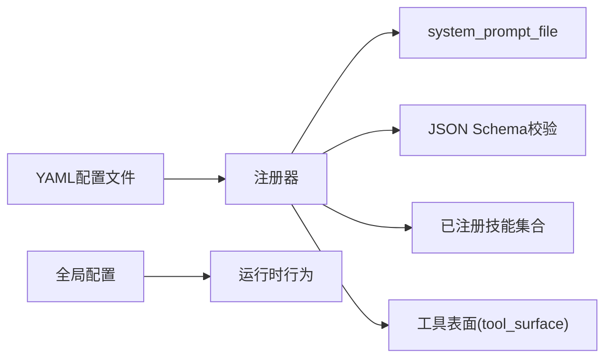

# 智能体配置与管理

<cite>
**本文引用的文件**
- [secbot/agents/asset_discovery.yaml](file://secbot/agents/asset_discovery.yaml)
- [secbot/agents/port_scan.yaml](file://secbot/agents/port_scan.yaml)
- [secbot/agents/vuln_scan.yaml](file://secbot/agents/vuln_scan.yaml)
- [secbot/agents/weak_password.yaml](file://secbot/agents/weak_password.yaml)
- [secbot/agents/report.yaml](file://secbot/agents/report.yaml)
- [secbot/agents/registry.py](file://secbot/agents/registry.py)
- [secbot/agents/prompts/asset_discovery.md](file://secbot/agents/prompts/asset_discovery.md)
- [secbot/agents/prompts/port_scan.md](file://secbot/agents/prompts/port_scan.md)
- [secbot/agents/prompts/vuln_scan.md](file://secbot/agents/prompts/vuln_scan.md)
- [secbot/agents/prompts/weak_password.md](file://secbot/agents/prompts/weak_password.md)
- [secbot/agents/prompts/report.md](file://secbot/agents/prompts/report.md)
- [secbot/skills/metadata.py](file://secbot/skills/metadata.py)
- [secbot/skills/types.py](file://secbot/skills/types.py)
- [secbot/config/schema.py](file://secbot/config/schema.py)
- [secbot/config/loader.py](file://secbot/config/loader.py)
</cite>

## 目录
1. [简介](#简介)
2. [项目结构](#项目结构)
3. [核心组件](#核心组件)
4. [架构总览](#架构总览)
5. [详细组件分析](#详细组件分析)
6. [依赖关系分析](#依赖关系分析)
7. [性能考量](#性能考量)
8. [故障排查指南](#故障排查指南)
9. [结论](#结论)
10. [附录](#附录)

## 简介
本文件面向VAPT3专家智能体配置系统的使用者与维护者，系统性阐述专家智能体配置文件（.yaml）的结构、字段定义、内置智能体配置示例、注册与校验流程、最佳实践与常见错误处理，以及配置文件的语法规范与字段约束。读者可据此安全、正确地扩展或修改专家智能体，并在生产环境中稳定运行。

## 项目结构
专家智能体配置位于 secbot/agents 下，每个智能体以独立的 YAML 文件存在，并配套系统提示模板（system prompt）。技能元数据由 secbot/skills/metadata.py 解析，技能运行时类型与异常由 secbot/skills/types.py 定义。全局配置采用 Pydantic 模型，加载与环境变量解析由 secbot/config/loader.py 提供。

图表来源
- [secbot/agents/asset_discovery.yaml:1-46](file://secbot/agents/asset_discovery.yaml#L1-L46)
- [secbot/agents/port_scan.yaml:1-50](file://secbot/agents/port_scan.yaml#L1-L50)
- [secbot/agents/vuln_scan.yaml:1-53](file://secbot/agents/vuln_scan.yaml#L1-L53)
- [secbot/agents/weak_password.yaml:1-53](file://secbot/agents/weak_password.yaml#L1-L53)
- [secbot/agents/report.yaml:1-39](file://secbot/agents/report.yaml#L1-L39)
- [secbot/agents/prompts/asset_discovery.md:1-28](file://secbot/agents/prompts/asset_discovery.md#L1-L28)
- [secbot/agents/prompts/port_scan.md:1-24](file://secbot/agents/prompts/port_scan.md#L1-L24)
- [secbot/agents/prompts/vuln_scan.md:1-24](file://secbot/agents/prompts/vuln_scan.md#L1-L24)
- [secbot/agents/prompts/weak_password.md:1-28](file://secbot/agents/prompts/weak_password.md#L1-L28)
- [secbot/agents/prompts/report.md:1-19](file://secbot/agents/prompts/report.md#L1-L19)
- [secbot/skills/metadata.py:1-147](file://secbot/skills/metadata.py#L1-L147)
- [secbot/skills/types.py:1-87](file://secbot/skills/types.py#L1-L87)
- [secbot/config/schema.py:1-376](file://secbot/config/schema.py#L1-L376)
- [secbot/config/loader.py:1-173](file://secbot/config/loader.py#L1-L173)

章节来源
- [secbot/agents/asset_discovery.yaml:1-46](file://secbot/agents/asset_discovery.yaml#L1-L46)
- [secbot/agents/port_scan.yaml:1-50](file://secbot/agents/port_scan.yaml#L1-L50)
- [secbot/agents/vuln_scan.yaml:1-53](file://secbot/agents/vuln_scan.yaml#L1-L53)
- [secbot/agents/weak_password.yaml:1-53](file://secbot/agents/weak_password.yaml#L1-L53)
- [secbot/agents/report.yaml:1-39](file://secbot/agents/report.yaml#L1-L39)
- [secbot/agents/registry.py:1-248](file://secbot/agents/registry.py#L1-L248)
- [secbot/skills/metadata.py:1-147](file://secbot/skills/metadata.py#L1-L147)
- [secbot/skills/types.py:1-87](file://secbot/skills/types.py#L1-L87)
- [secbot/config/schema.py:1-376](file://secbot/config/schema.py#L1-L376)
- [secbot/config/loader.py:1-173](file://secbot/config/loader.py#L1-L173)

## 核心组件
- 专家智能体配置文件：定义智能体名称、显示名、描述、系统提示文件、作用域内技能列表、输入/输出JSON Schema、最大迭代次数、是否输出计划步骤等。
- 注册器与校验：负责加载、校验、去重、冲突检查、工具表面生成。
- 技能元数据与类型：提供技能风险等级、网络策略、运行时异常等契约。
- 全局配置：Pydantic模型定义默认参数、提供者配置、工具配置等，支持环境变量解析与迁移。

章节来源
- [secbot/agents/registry.py:37-92](file://secbot/agents/registry.py#L37-L92)
- [secbot/skills/metadata.py:23-38](file://secbot/skills/metadata.py#L23-L38)
- [secbot/skills/types.py:44-87](file://secbot/skills/types.py#L44-L87)
- [secbot/config/schema.py:68-113](file://secbot/config/schema.py#L68-L113)
- [secbot/config/loader.py:32-56](file://secbot/config/loader.py#L32-L56)

## 架构总览
专家智能体配置系统通过注册器统一加载与校验所有 YAML 配置，确保字段完整性、命名规范、技能归属唯一性与 JSON Schema 合法性。注册后的智能体规格被转换为工具表面（tool surface），供编排器注入到大模型工具调用上下文中。

图表来源
- [secbot/agents/registry.py:99-144](file://secbot/agents/registry.py#L99-L144)
- [secbot/agents/registry.py:147-236](file://secbot/agents/registry.py#L147-L236)
- [secbot/agents/registry.py:239-248](file://secbot/agents/registry.py#L239-L248)

## 详细组件分析

### 通用字段与语法规则
- 必需字段
  - name：小写字母开头，仅允许小写字母、数字、下划线；必须与文件名 stem 一致。
  - display_name：非空字符串。
  - description：非空字符串。
  - system_prompt_file：相对路径指向提示模板文件，最终会被解析为绝对路径并读取内容。
  - scoped_skills：非空字符串数组，表示该智能体作用域内的技能清单；同一技能不能同时被多个智能体声明。
  - input_schema / output_schema：均为合法的 JSON Schema 2020-12 映射。
- 可选字段
  - model：映射（可选），用于覆盖默认模型配置。
  - max_iterations：正整数，默认值见注册器实现。
  - emit_plan_steps：布尔值，默认值见注册器实现。
- 字段约束
  - 文件名与 name 必须一致。
  - scoped_skills 非空且必须全部存在于已注册技能集合中（当提供技能集合时）。
  - JSON Schema 必须通过 Draft202012Validator 校验。
  - system_prompt_file 指向的文件必须存在且可读。

章节来源
- [secbot/agents/registry.py:20-31](file://secbot/agents/registry.py#L20-L31)
- [secbot/agents/registry.py:162-171](file://secbot/agents/registry.py#L162-L171)
- [secbot/agents/registry.py:172-185](file://secbot/agents/registry.py#L172-L185)
- [secbot/agents/registry.py:187-195](file://secbot/agents/registry.py#L187-L195)
- [secbot/agents/registry.py:197-200](file://secbot/agents/registry.py#L197-L200)
- [secbot/agents/registry.py:202-214](file://secbot/agents/registry.py#L202-L214)
- [secbot/agents/registry.py:216-222](file://secbot/agents/registry.py#L216-L222)
- [secbot/agents/registry.py:239-248](file://secbot/agents/registry.py#L239-L248)

### 资产发现（asset_discovery）
- 触发词与用途：在目标网段/IP/域名范围内发现存活主机、服务与基础资产清单，作为后续端口扫描与漏洞扫描的前提。
- 关键字段
  - name/display_name/description/system_prompt_file：见通用规则。
  - scoped_skills：包含主机发现与CMDB辅助技能。
  - input_schema：要求提供 target（字符串，支持CIDR/IP/域名），label 可选（写入CMDB的人类标签）。
  - output_schema：返回 assets 数组，元素含 target、kind（cidr/ip/domain）、label。
- 运行要点
  - 根据目标规模选择合适发现技能（如 /24 或更小范围优先 nmap，更大范围优先 masscan，混合场景优先 fscan）。
  - 对每个发现的主机调用 CMDB 写入接口，避免重复扫描。
- 提示模板要点
  - 明确工具集与执行流程，输出限制在前200条以便分页。

章节来源
- [secbot/agents/asset_discovery.yaml:1-46](file://secbot/agents/asset_discovery.yaml#L1-L46)
- [secbot/agents/prompts/asset_discovery.md:1-28](file://secbot/agents/prompts/asset_discovery.md#L1-L28)

### 端口扫描（port_scan）
- 触发词与用途：对资产发现产出的主机进行开放端口枚举与服务指纹识别，为漏洞扫描准备目标。
- 关键字段
  - scoped_skills：包含端口扫描与服务指纹技能。
  - input_schema：targets（必填，字符串数组，至少一项），ports（可选，端口规范如“1-1024”或“top-1000”），rate（可选，枚举 slow/normal/fast，默认 normal）。
  - output_schema：返回 services 数组，元素含 host、port（整数）、protocol（tcp/udp）、service、version。
- 运行要点
  - 小目标列表（≤32）优先 nmap-port-scan + nmap-service-fingerprint；大列表优先 fscan-port-scan。
  - 根据 rate 参数调整扫描强度，避免过度激进。
- 提示模板要点
  - 输出限制在500条以内，原始输出保存在扫描目录供编排器引用。

章节来源
- [secbot/agents/port_scan.yaml:1-50](file://secbot/agents/port_scan.yaml#L1-L50)
- [secbot/agents/prompts/port_scan.md:1-24](file://secbot/agents/prompts/port_scan.md#L1-L24)

### 漏洞扫描（vuln_scan）
- 触发词与用途：基于模板（nuclei）与指纹（fscan）对端口扫描发现的服务进行漏洞扫描，结果写入CMDB并在报告中呈现。
- 关键字段
  - scoped_skills：包含模板扫描与弱点检查技能。
  - input_schema：services（必填，至少一项），每项含 host、port、protocol、service；severity_floor（可选，枚举 info/low/medium/high/critical，默认 medium）。
  - output_schema：返回 findings 数组，元素含 host、port、severity、title、cve_id、template。
- 运行要点
  - 优先 nuclei 对 HTTP(S) 扫描；对nuclei覆盖不足的协议（如SMB、RDP）补充 fscan。
  - 应用严重度阈值，避免噪声。
- 提示模板要点
  - 输出限制在500条以内，单条摘要字符串截断至512字符。

章节来源
- [secbot/agents/vuln_scan.yaml:1-53](file://secbot/agents/vuln_scan.yaml#L1-L53)
- [secbot/agents/prompts/vuln_scan.md:1-24](file://secbot/agents/prompts/vuln_scan.md#L1-L24)

### 弱口令检测（weak_password）
- 触发词与用途：针对认证服务（SSH、FTP、RDP、MySQL、Redis 等）探测弱口令或默认凭证。
- 关键字段
  - scoped_skills：包含暴力破解与弱口令检测技能。
  - input_schema：services（必填，至少一项），每项含 host、port、service（枚举 ssh/ftp/rdp/mysql/redis/mssql/postgres/smb/telnet）；user_list/pass_list（可选，自定义字典）。
  - output_schema：返回 findings 数组，元素含 host、port、service、username、password。
- 运行要点
  - 所有技能风险等级为 critical，每次调用均需用户显式确认；拒绝后必须结构化失败，不得重试或扩大范围。
  - 默认每主机最多3次确认拒绝以避免账户锁定。
  - 优先使用内置字典（fscan-weak-password），仅在用户提供自定义字典时启用外部工具（hydra）。
- 提示模板要点
  - 在通道标记为 redacted 的情况下，避免在可见摘要中包含密码。

章节来源
- [secbot/agents/weak_password.yaml:1-53](file://secbot/agents/weak_password.yaml#L1-L53)
- [secbot/agents/prompts/weak_password.md:1-28](file://secbot/agents/prompts/weak_password.md#L1-L28)

### 报告生成（report）
- 触发词与用途：从本地CMDB数据渲染交付报告，支持 Markdown、DOCX、PDF 三种格式；Markdown 为中间标准格式。
- 关键字段
  - scoped_skills：包含 Markdown、PDF、DOCX 报告渲染技能。
  - input_schema：scan_id（必填，ULID）、format（必填，枚举 markdown/pdf/docx）、template（可选，模板名称）。
  - output_schema：返回 path（文件系统路径）、format（输出格式）、bytes（字节数）。
- 运行要点
  - 始终先生成 Markdown 中间产物，再由 DOCX/PDF 报告技能基于该 Markdown 派生。
  - 输出严格返回路径而非内嵌内容，便于前端下载。

章节来源
- [secbot/agents/report.yaml:1-39](file://secbot/agents/report.yaml#L1-L39)
- [secbot/agents/prompts/report.md:1-19](file://secbot/agents/prompts/report.md#L1-L19)

### 注册机制与配置验证流程
- 加载与校验
  - 读取 agents_dir 下所有 *.yaml，逐个解析并执行字段校验。
  - 校验顺序：必需字段、name 命名与文件名一致性、scoped_skills 非空与技能集合匹配、system_prompt_file 存在性、input/output JSON Schema 合法性、可选字段类型校验。
- 唯一性与冲突
  - scoped_skills 不得跨智能体共享；同一智能体不可重复声明相同 name。
- 工具表面生成
  - 将 ExpertAgentSpec 转换为函数式工具定义，供编排器注入到 LLM 的工具列表中。

图表来源
- [secbot/agents/registry.py:99-144](file://secbot/agents/registry.py#L99-L144)
- [secbot/agents/registry.py:147-236](file://secbot/agents/registry.py#L147-L236)
- [secbot/agents/registry.py:239-248](file://secbot/agents/registry.py#L239-L248)

章节来源
- [secbot/agents/registry.py:99-144](file://secbot/agents/registry.py#L99-L144)
- [secbot/agents/registry.py:147-236](file://secbot/agents/registry.py#L147-L236)
- [secbot/agents/registry.py:239-248](file://secbot/agents/registry.py#L239-L248)

### 技能契约与运行时
- 技能元数据
  - 包含 name、display_name、version、risk_level、category、external_binary、network_egress、expected_runtime_sec、summary_size_hint 等字段，其中 risk_level 与 network_egress 有枚举约束。
- 技能运行时
  - SkillResult：包含 summary、raw_log_path、findings、cmdb_writes。
  - SkillContext：包含 scan_id、scan_dir、cancel_token、confirm、progress 等，提供写进度与取消能力。
  - 异常类型：SkillError 及其子类（二进制缺失、超时、取消、参数非法）。

章节来源
- [secbot/skills/metadata.py:23-114](file://secbot/skills/metadata.py#L23-L114)
- [secbot/skills/types.py:44-87](file://secbot/skills/types.py#L44-L87)

### 全局配置与环境变量解析
- 全局配置
  - 使用 Pydantic 模型定义 agents.defaults、providers、tools、gateway、api 等配置段。
  - 支持 camelCase 与 snake_case 键名互换别名。
- 配置加载
  - 从用户主目录下的 .secbot/config.json 加载，支持迁移旧格式字段。
  - 提供环境变量解析功能，支持 ${VAR} 占位符替换，未设置时报错。
- 安全策略
  - SSRF 白名单应用到网络模块，减少横向攻击面。

章节来源
- [secbot/config/schema.py:68-113](file://secbot/config/schema.py#L68-L113)
- [secbot/config/schema.py:267-376](file://secbot/config/schema.py#L267-L376)
- [secbot/config/loader.py:32-56](file://secbot/config/loader.py#L32-L56)
- [secbot/config/loader.py:86-127](file://secbot/config/loader.py#L86-L127)
- [secbot/config/loader.py:150-173](file://secbot/config/loader.py#L150-L173)

## 依赖关系分析
- 智能体配置文件依赖于系统提示模板文件，注册器在加载时会解析并读取提示内容。
- 注册器依赖 JSON Schema 校验器，确保输入/输出模式合法。
- 智能体与技能之间通过 scoped_skills 关联，注册器会检查技能归属唯一性与已注册集合。
- 全局配置影响运行时行为（如模型、工具限制、SSRF 白名单），但不直接参与智能体配置的校验。

图表来源
- [secbot/agents/registry.py:187-195](file://secbot/agents/registry.py#L187-L195)
- [secbot/agents/registry.py:197-200](file://secbot/agents/registry.py#L197-L200)
- [secbot/agents/registry.py:180-185](file://secbot/agents/registry.py#L180-L185)
- [secbot/config/loader.py:32-56](file://secbot/config/loader.py#L32-L56)

章节来源
- [secbot/agents/registry.py:187-195](file://secbot/agents/registry.py#L187-L195)
- [secbot/agents/registry.py:197-200](file://secbot/agents/registry.py#L197-L200)
- [secbot/agents/registry.py:180-185](file://secbot/agents/registry.py#L180-L185)
- [secbot/config/loader.py:32-56](file://secbot/config/loader.py#L32-L56)

## 性能考量
- 扫描策略优化
  - 资产发现阶段根据目标规模选择不同发现工具，避免对大规模网段使用低效工具。
  - 端口扫描阶段依据目标数量选择 nmap 或 fscan，合理设置 rate 以平衡速度与稳定性。
- 输出裁剪
  - 各智能体输出列表均有限额（如资产200、服务500、漏洞500），防止大体量数据冲击编排器与下游存储。
- 迭代次数控制
  - 通过 max_iterations 控制最大工具调用轮次，避免长尾任务占用资源。
- 风险控制
  - 弱口令检测对 critical 风险技能强制用户确认，降低误操作带来的资源消耗与安全风险。

## 故障排查指南
- 常见错误与定位
  - YAML 解析失败：检查文件编码与缩进，确保顶层为映射。
  - 缺少必需字段：核对 name、display_name、description、system_prompt_file、scoped_skills、input_schema、output_schema 是否齐全。
  - 名称不一致：确保 name 与文件名 stem 完全一致。
  - scoped_skills 非法：确认列表非空，且所有技能名存在于已注册技能集合中。
  - system_prompt_file 不存在：确认相对路径解析后对应文件存在。
  - JSON Schema 不合法：使用在线 JSON Schema 验证工具检查 input_schema 与 output_schema。
  - 技能重复声明：检查是否在同一注册过程中出现跨智能体共享同一技能的情况。
- 环境变量解析失败
  - 检查 ${VAR} 引用的环境变量是否已设置，未设置将导致解析报错。
- 配置加载失败
  - 查看配置文件 JSON 格式与字段名是否符合当前版本，必要时执行迁移逻辑。

章节来源
- [secbot/agents/registry.py:148-155](file://secbot/agents/registry.py#L148-L155)
- [secbot/agents/registry.py:156-161](file://secbot/agents/registry.py#L156-L161)
- [secbot/agents/registry.py:162-171](file://secbot/agents/registry.py#L162-L171)
- [secbot/agents/registry.py:172-185](file://secbot/agents/registry.py#L172-L185)
- [secbot/agents/registry.py:187-195](file://secbot/agents/registry.py#L187-L195)
- [secbot/agents/registry.py:197-200](file://secbot/agents/registry.py#L197-L200)
- [secbot/agents/registry.py:239-248](file://secbot/agents/registry.py#L239-L248)
- [secbot/config/loader.py:86-127](file://secbot/config/loader.py#L86-L127)

## 结论
VAPT3专家智能体配置系统通过严格的字段校验、唯一的技能归属与合法的JSON Schema保障了配置的可靠性与一致性。结合提示模板与技能契约，系统实现了从资产发现、端口扫描、漏洞扫描、弱口令检测到报告生成的完整闭环。遵循本文档的语法规则、最佳实践与故障排查建议，可在保证安全的前提下高效扩展与维护专家智能体。

## 附录
- 最佳实践
  - 保持 scoped_skills 清晰且唯一，避免跨智能体共享同一技能。
  - 输入/输出 Schema 严格遵循 JSON Schema 2020-12，明确字段类型、枚举与约束。
  - 使用 system_prompt_file 统一管理提示模板，确保提示内容与智能体职责一致。
  - 合理设置 max_iterations 与 emit_plan_steps，兼顾可控性与可观测性。
  - 对 critical 风险技能（如弱口令检测）务必启用用户确认流程。
- 自定义智能体配置建议
  - 新增智能体时，先在 skills 目录下完善技能元数据与运行时契约，再编写对应的 YAML 与提示模板。
  - 通过 AgentRegistry 的工具表面能力，将新智能体无缝注入到编排器的工具列表中。
  - 在生产环境部署前，使用注册器的校验流程进行全面测试，确保无遗漏字段与非法配置。