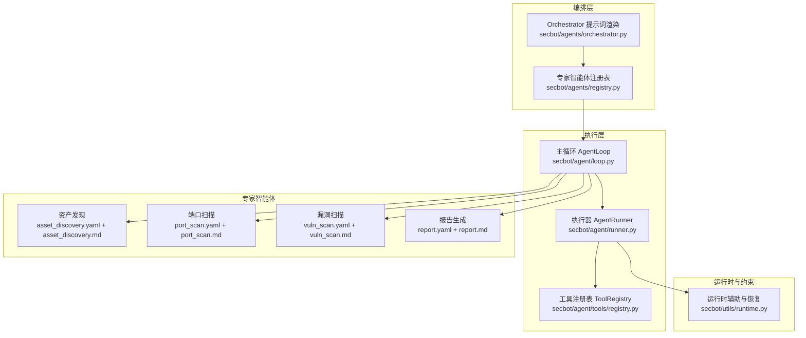
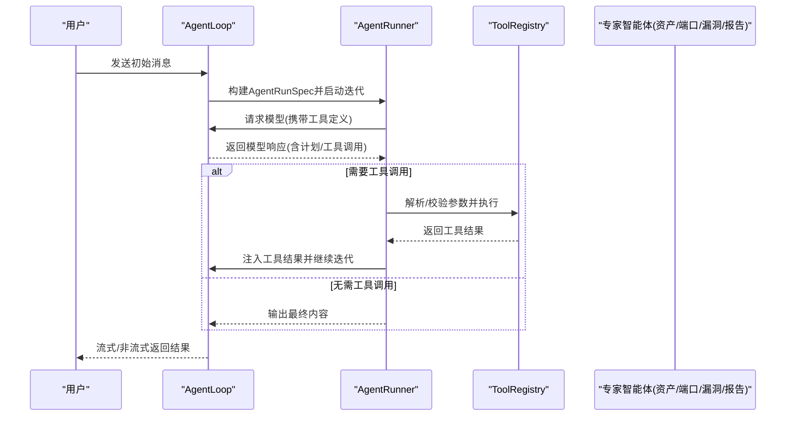
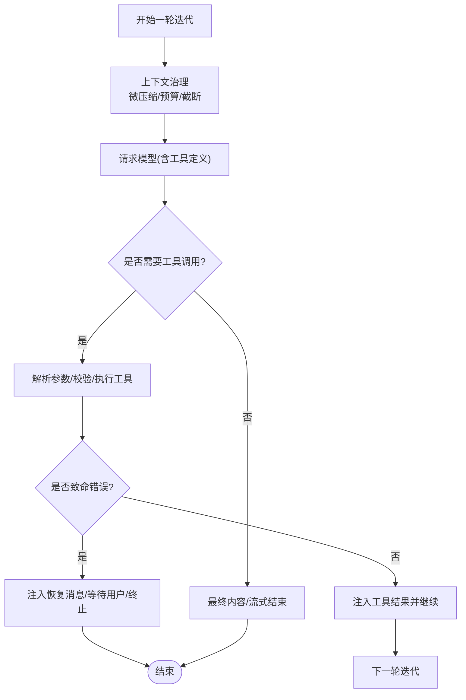
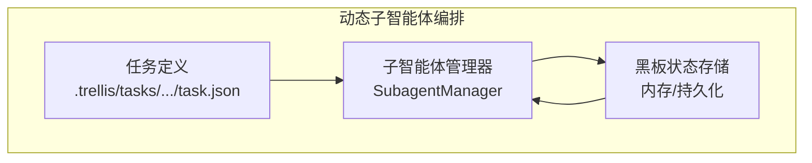
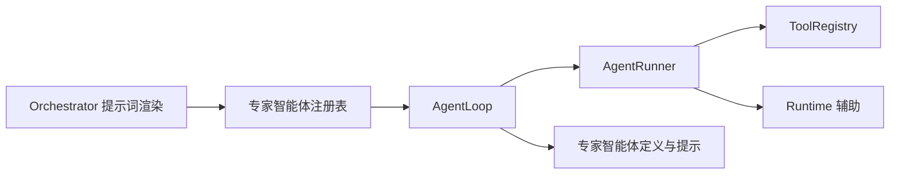

# 编排引擎与调度算法

<cite>
**本文引用的文件**
- [secbot/agents/orchestrator.py](file://secbot/agents/orchestrator.py)
- [secbot/agents/registry.py](file://secbot/agents/registry.py)
- [secbot/agent/runner.py](file://secbot/agent/runner.py)
- [secbot/agent/loop.py](file://secbot/agent/loop.py)
- [secbot/agent/tools/registry.py](file://secbot/agent/tools/registry.py)
- [secbot/utils/runtime.py](file://secbot/utils/runtime.py)
- [secbot/agents/asset_discovery.yaml](file://secbot/agents/asset_discovery.yaml)
- [secbot/agents/port_scan.yaml](file://secbot/agents/port_scan.yaml)
- [secbot/agents/vuln_scan.yaml](file://secbot/agents/vuln_scan.yaml)
- [secbot/agents/report.yaml](file://secbot/agents/report.yaml)
- [secbot/agents/prompts/asset_discovery.md](file://secbot/agents/prompts/asset_discovery.md)
- [secbot/agents/prompts/port_scan.md](file://secbot/agents/prompts/port_scan.md)
- [secbot/agents/prompts/vuln_scan.md](file://secbot/agents/prompts/vuln_scan.md)
- [secbot/agents/prompts/report.md](file://secbot/agents/prompts/report.md)
- [.trellis/tasks/05-08-dynamic-subagent-orchestration/task.json](file://.trellis/tasks/05-08-dynamic-subagent-orchestration/task.json)
</cite>

## 目录
1. [简介](#简介)
2. [项目结构](#项目结构)
3. [核心组件](#核心组件)
4. [架构总览](#架构总览)
5. [详细组件分析](#详细组件分析)
6. [依赖分析](#依赖分析)
7. [性能考虑](#性能考虑)
8. [故障排查指南](#故障排查指南)
9. [结论](#结论)
10. [附录](#附录)

## 简介
本文件面向VAPT3的智能体编排引擎，聚焦“Orchestrator主控智能体”的系统提示词设计与调度算法，解释以下要点：
- 系统提示词的四个锁定部分（角色、硬规则、可用专家智能体、工作风格）的设计原理与稳定性保障
- 基于用户意图、上下文与可用智能体资源的动态规划式任务序列选择策略
- 智能体间协作模式：任务分解、结果传递、状态同步
- 工作风格规范：1-3步计划制定、工具调用后的决策循环、结果总结
- 性能优化与错误处理机制

## 项目结构
围绕编排引擎的关键代码分布在以下模块：
- 提示词渲染与注册表：orchestrator.py、registry.py
- 执行循环与工具执行：agent/runner.py、agent/loop.py、agent/tools/registry.py
- 运行时约束与恢复：utils/runtime.py
- 专家智能体定义与提示：agents/*.yaml、agents/prompts/*.md
- 动态子智能体编排相关任务：.trellis/tasks/...

图表来源
- [secbot/agents/orchestrator.py:52-69](file://secbot/agents/orchestrator.py#L52-L69)
- [secbot/agents/registry.py:65-91](file://secbot/agents/registry.py#L65-L91)
- [secbot/agent/loop.py:276-425](file://secbot/agent/loop.py#L276-L425)
- [secbot/agent/runner.py:234-567](file://secbot/agent/runner.py#L234-L567)
- [secbot/agent/tools/registry.py:8-71](file://secbot/agent/tools/registry.py#L8-L71)
- [secbot/utils/runtime.py:18-65](file://secbot/utils/runtime.py#L18-L65)
- [secbot/agents/asset_discovery.yaml:1-46](file://secbot/agents/asset_discovery.yaml#L1-L46)
- [secbot/agents/port_scan.yaml:1-50](file://secbot/agents/port_scan.yaml#L1-L50)
- [secbot/agents/vuln_scan.yaml:1-53](file://secbot/agents/vuln_scan.yaml#L1-L53)
- [secbot/agents/report.yaml:1-39](file://secbot/agents/report.yaml#L1-L39)

章节来源
- [secbot/agents/orchestrator.py:1-70](file://secbot/agents/orchestrator.py#L1-L70)
- [secbot/agents/registry.py:1-248](file://secbot/agents/registry.py#L1-L248)
- [secbot/agent/runner.py:1-800](file://secbot/agent/runner.py#L1-L800)
- [secbot/agent/loop.py:1-800](file://secbot/agent/loop.py#L1-L800)
- [secbot/agent/tools/registry.py:1-126](file://secbot/agent/tools/registry.py#L1-L126)
- [secbot/utils/runtime.py:1-171](file://secbot/utils/runtime.py#L1-L171)
- [secbot/agents/asset_discovery.yaml:1-46](file://secbot/agents/asset_discovery.yaml#L1-L46)
- [secbot/agents/port_scan.yaml:1-50](file://secbot/agents/port_scan.yaml#L1-L50)
- [secbot/agents/vuln_scan.yaml:1-53](file://secbot/agents/vuln_scan.yaml#L1-L53)
- [secbot/agents/report.yaml:1-39](file://secbot/agents/report.yaml#L1-L39)

## 核心组件
- Orchestrator系统提示词渲染器：将“角色、硬规则、可用专家智能体、工作风格”四段锁定内容拼接为稳定提示词，其中“可用专家智能体”表格基于注册表动态生成。
- 专家智能体注册表：加载、校验、去重、规范化专家智能体定义，并生成工具表面（供模型函数调用）。
- 主循环与执行器：统一的迭代执行框架，负责消息构建、模型请求、工具调用、结果注入、流式输出、最大迭代限制、长度截断恢复、空响应兜底等。
- 工具注册表：动态注册/注销工具，提供参数类型转换与校验、执行与错误包装。
- 运行时约束与恢复：对外部重复查询、工作区越界访问进行限流与拦截；对输出截断、空响应、模型错误进行恢复与兜底。

章节来源
- [secbot/agents/orchestrator.py:52-69](file://secbot/agents/orchestrator.py#L52-L69)
- [secbot/agents/registry.py:65-91](file://secbot/agents/registry.py#L65-L91)
- [secbot/agent/runner.py:234-567](file://secbot/agent/runner.py#L234-L567)
- [secbot/agent/loop.py:276-425](file://secbot/agent/loop.py#L276-L425)
- [secbot/agent/tools/registry.py:8-71](file://secbot/agent/tools/registry.py#L8-L71)
- [secbot/utils/runtime.py:18-65](file://secbot/utils/runtime.py#L18-L65)

## 架构总览
编排引擎以“Orchestrator主控智能体”为核心，通过系统提示词约束其行为，借助注册表动态暴露可用专家智能体，由主循环与执行器驱动工具调用与结果注入，形成“计划-工具-反思-再计划”的闭环。

图表来源
- [secbot/agent/runner.py:234-567](file://secbot/agent/runner.py#L234-L567)
- [secbot/agent/loop.py:644-786](file://secbot/agent/loop.py#L644-L786)
- [secbot/agent/tools/registry.py:100-114](file://secbot/agent/tools/registry.py#L100-L114)

## 详细组件分析

### Orchestrator系统提示词与四段锁定
- 角色（Role）：明确主控智能体定位为安全运营助手，负责编排专家智能体完成用户安全任务。
- 硬规则（Hard rules）：强制性约束，包括不自行执行扫描、严格顺序（资产发现→端口扫描→漏洞扫描→弱口令/渗透→报告）、高风险确认、拒绝越权请求等。
- 可用专家智能体（Available expert agents）：动态表格，包含工具名、用途、限定技能集合，按名称排序保证提示词快照稳定。
- 工作风格（Working style）：要求先做1-3步计划，工具结果后决策（继续/重计划/询问用户），总结发现并链接原始日志路径，使用用户语言。

提示词渲染流程与稳定性：
- 四段内容拼接为固定结构，仅“可用专家智能体”表格随注册表变化而变化。
- 表格按名称排序，确保相同注册表输入产生字节级一致的提示词输出，便于缓存与一致性验证。

章节来源
- [secbot/agents/orchestrator.py:17-69](file://secbot/agents/orchestrator.py#L17-L69)

### 专家智能体注册表与工具表面
- 加载与校验：遍历agents目录下的YAML，校验必需字段、名称格式、系统提示文件存在、JSON Schema有效性、技能唯一性与互斥性。
- 工具表面：将每个专家智能体的输入Schema转为函数调用定义，供模型在系统提示词中作为工具暴露。
- 动态约束：同一技能不能被多个专家智能体声明，避免职责重叠与冲突。

章节来源
- [secbot/agents/registry.py:99-247](file://secbot/agents/registry.py#L99-L247)

### 主循环与执行器：迭代执行与错误恢复
- 迭代控制：支持最大迭代次数、流式输出、进度回调、注入回调（用于中途中断注入用户消息）。
- 上下文治理：历史消息微压缩、工具结果预算、历史截断、孤儿/缺失结果修复，保证上下文窗口与稳定性。
- 工具执行：批量分组、并发执行、错误分类与拦截（外部重复查询、工作区越界、参数错误等），必要时触发“询问用户”中断。
- 结果注入与恢复：对输出截断、空响应、模型错误分别注入恢复提示，尝试最终化回复或终止。
- 终止条件：达到最大迭代、模型错误、空最终响应、工具错误等。

图表来源
- [secbot/agent/runner.py:251-567](file://secbot/agent/runner.py#L251-L567)
- [secbot/utils/runtime.py:81-171](file://secbot/utils/runtime.py#L81-L171)

章节来源
- [secbot/agent/runner.py:234-567](file://secbot/agent/runner.py#L234-L567)
- [secbot/agent/loop.py:644-786](file://secbot/agent/loop.py#L644-L786)

### 工具注册表：参数准备、校验与执行
- 参数准备：解析工具名与参数，进行类型转换与校验，返回工具实例、参数与错误信息。
- 执行与包装：异步执行工具，捕获异常并返回带建议的错误消息，避免直接抛出内部异常。
- 定义缓存：工具定义按内置与MCP两类排序缓存，保证提示词稳定与可复用。

章节来源
- [secbot/agent/tools/registry.py:73-114](file://secbot/agent/tools/registry.py#L73-L114)

### 专家智能体定义与提示：任务分解与输出约定
- 资产发现：输入目标（CIDR/IP/域名），按规模选择不同技能，写入CMDB，输出资产列表上限约束。
- 端口扫描：接收主机列表，按规模选择扫描与指纹策略，尊重速率参数，输出服务列表上限约束。
- 漏洞扫描：过滤协议，优先模板扫描，辅以指纹检查，按严重度阈值筛选，输出发现列表上限与摘要字段。
- 报告生成：以Markdown为中间产物，按需导出PDF/DOCX，输出路径、格式与大小。

章节来源
- [secbot/agents/asset_discovery.yaml:1-46](file://secbot/agents/asset_discovery.yaml#L1-L46)
- [secbot/agents/port_scan.yaml:1-50](file://secbot/agents/port_scan.yaml#L1-L50)
- [secbot/agents/vuln_scan.yaml:1-53](file://secbot/agents/vuln_scan.yaml#L1-L53)
- [secbot/agents/report.yaml:1-39](file://secbot/agents/report.yaml#L1-L39)
- [secbot/agents/prompts/asset_discovery.md:1-28](file://secbot/agents/prompts/asset_discovery.md#L1-L28)
- [secbot/agents/prompts/port_scan.md:1-24](file://secbot/agents/prompts/port_scan.md#L1-L24)
- [secbot/agents/prompts/vuln_scan.md:1-24](file://secbot/agents/prompts/vuln_scan.md#L1-L24)
- [secbot/agents/prompts/report.md:1-19](file://secbot/agents/prompts/report.md#L1-L19)

### 动态子智能体编排与黑板共享（概念性）
当前仓库中存在关于“动态子智能体编排与黑板共享机制”的任务条目，表明该能力处于规划阶段。该机制预期支持：
- 子智能体的动态创建与生命周期管理
- 多智能体之间的状态共享与结果传播
- 在编排过程中对黑板状态的读写与同步

图表来源
- [.trellis/tasks/05-08-dynamic-subagent-orchestration/task.json:1-26](file://.trellis/tasks/05-08-dynamic-subagent-orchestration/task.json#L1-L26)

## 依赖分析
- Orchestrator依赖注册表生成可用专家智能体表格，注册表负责技能唯一性与Schema校验。
- 主循环依赖执行器进行迭代，执行器依赖工具注册表执行工具，同时受运行时约束保护。
- 各专家智能体通过YAML定义与提示文件描述其职责、输入输出与流程步骤，形成稳定的编排契约。

图表来源
- [secbot/agents/orchestrator.py:52-69](file://secbot/agents/orchestrator.py#L52-L69)
- [secbot/agents/registry.py:65-91](file://secbot/agents/registry.py#L65-L91)
- [secbot/agent/loop.py:276-425](file://secbot/agent/loop.py#L276-L425)
- [secbot/agent/runner.py:234-567](file://secbot/agent/runner.py#L234-L567)
- [secbot/agent/tools/registry.py:8-71](file://secbot/agent/tools/registry.py#L8-L71)
- [secbot/utils/runtime.py:18-65](file://secbot/utils/runtime.py#L18-L65)

章节来源
- [secbot/agents/orchestrator.py:52-69](file://secbot/agents/orchestrator.py#L52-L69)
- [secbot/agents/registry.py:65-91](file://secbot/agents/registry.py#L65-L91)
- [secbot/agent/runner.py:234-567](file://secbot/agent/runner.py#L234-L567)
- [secbot/agent/loop.py:276-425](file://secbot/agent/loop.py#L276-L425)
- [secbot/agent/tools/registry.py:8-71](file://secbot/agent/tools/registry.py#L8-L71)
- [secbot/utils/runtime.py:18-65](file://secbot/utils/runtime.py#L18-L65)

## 性能考虑
- 并发工具执行：执行器支持并发工具调用，减少整体等待时间，但遵循批内串行与致命错误短路原则。
- 上下文治理：微压缩、预算与截断降低长历史带来的Token开销，提升吞吐。
- 最大迭代限制：防止无限循环，结合“空响应/截断/错误”恢复策略，平衡鲁棒性与性能。
- 工具定义缓存：工具定义按内置/MCP两类排序缓存，避免重复计算，提高提示词稳定性与加载效率。
- 运行时限流：对外部重复查询与工作区越界访问进行限流与拦截，避免无效重试与越权操作。

章节来源
- [secbot/agent/runner.py:701-740](file://secbot/agent/runner.py#L701-L740)
- [secbot/agent/runner.py:251-264](file://secbot/agent/runner.py#L251-L264)
- [secbot/agent/tools/registry.py:48-71](file://secbot/agent/tools/registry.py#L48-L71)
- [secbot/utils/runtime.py:13-171](file://secbot/utils/runtime.py#L13-L171)

## 故障排查指南
- 工具执行错误：参数类型不符、参数校验失败、工具未找到、执行异常等，均会被包装为可读错误并附带建议。
- 外部重复查询阻断：对web_search/web_fetch设置小预算的重复访问阻断，避免噪声与资源浪费。
- 工作区越界拦截：对路径类工具的越界访问进行签名化统计，超过阈值后返回明确的拦截提示。
- 输出截断与空响应：当模型输出被截断或为空时，注入恢复提示并尝试最终化回复；若仍失败则返回兜底消息。
- 模型错误与超时：对模型错误与超时进行兜底处理，必要时触发恢复流程或终止并注入提示。

章节来源
- [secbot/agent/tools/registry.py:100-114](file://secbot/agent/tools/registry.py#L100-L114)
- [secbot/utils/runtime.py:81-171](file://secbot/utils/runtime.py#L81-L171)
- [secbot/agent/runner.py:391-567](file://secbot/agent/runner.py#L391-L567)

## 结论
VAPT3的编排引擎通过“四段锁定”的系统提示词与专家智能体注册表，实现了稳定可控的主控智能体行为；借助统一的执行循环与工具执行框架，结合运行时约束与恢复策略，形成了高鲁棒性的任务执行闭环。未来随着动态子智能体编排与黑板共享机制的落地，将进一步增强多智能体协作与状态同步能力。

## 附录
- 动态子智能体编排任务参考：见“.trellis/tasks/05-08-dynamic-subagent-orchestration/task.json”。