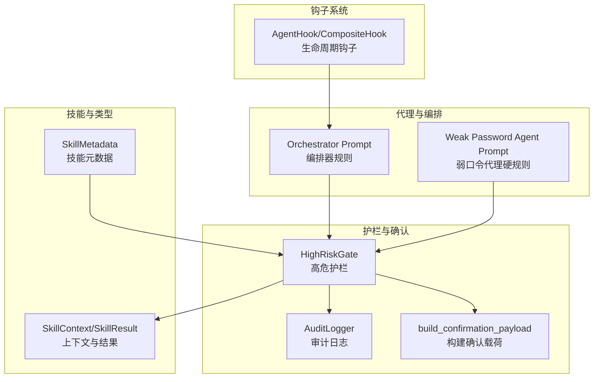
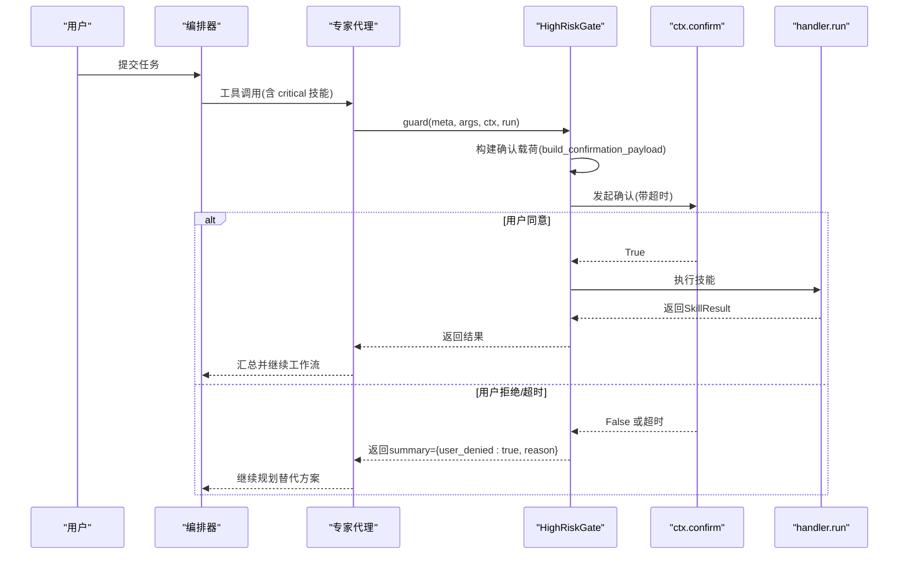
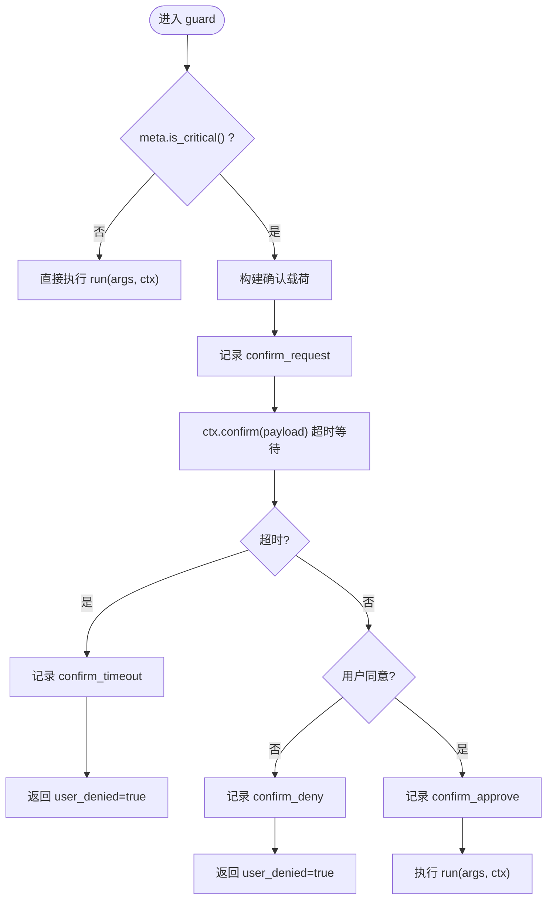
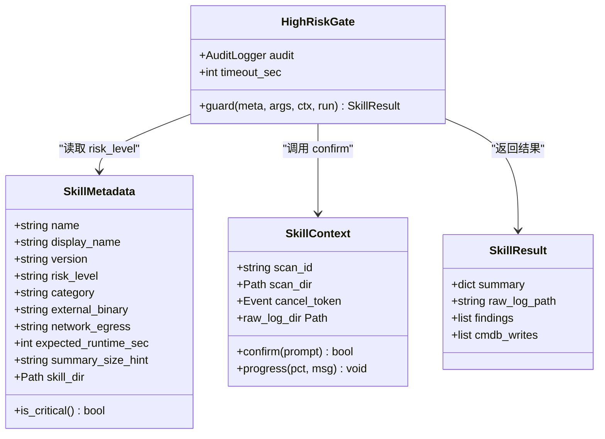
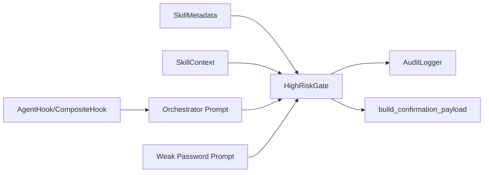

# 高危操作护栏机制

<cite>
**本文引用的文件**
- [secbot/agents/high_risk.py](file://secbot/agents/high_risk.py)
- [.trellis/spec/backend/high-risk-confirmation.md](file://.trellis/spec/backend/high-risk-confirmation.md)
- [secbot/skills/metadata.py](file://secbot/skills/metadata.py)
- [secbot/skills/types.py](file://secbot/skills/types.py)
- [tests/agent/test_high_risk_gate.py](file://tests/agent/test_high_risk_gate.py)
- [secbot/agents/prompts/weak_password.md](file://secbot/agents/prompts/weak_password.md)
- [secbot/agents/orchestrator.py](file://secbot/agents/orchestrator.py)
- [secbot/agent/hook.py](file://secbot/agent/hook.py)
- [.trellis/tasks/archive/2026-05/05-07-cybersec-agent-platform/research/security-tool-functions.md](file://.trellis/tasks/archive/2026-05/05-07-cybersec-agent-platform/research/security-tool-functions.md)
- [webui/src/gap/platform-settings.md](file://webui/src/gap/platform-settings.md)
</cite>

## 目录
1. [引言](#引言)
2. [项目结构](#项目结构)
3. [核心组件](#核心组件)
4. [架构总览](#架构总览)
5. [详细组件分析](#详细组件分析)
6. [依赖分析](#依赖分析)
7. [性能考虑](#性能考虑)
8. [故障排查指南](#故障排查指南)
9. [结论](#结论)
10. [附录](#附录)

## 引言
本文件系统化阐述 VAPT3 中“高危操作护栏”机制的设计与实现，重点覆盖以下方面：
- 高危操作识别与分类：明确哪些技能被定义为高危（如系统级扫描、网络攻击性工具、弱口令暴力破解等），并给出分类依据与风险评估模型。
- 护栏 Hook 工作原理：拦截条件判断、用户确认流程、超时与拒绝的短路机制、审计日志记录。
- 与智能体系统的集成：前置检查、阻断机制、日志记录、专家代理与编排器的协同。
- 最佳实践与安全策略：如何配置高危技能、如何设置默认禁用与二次确认、如何通过平台配置强化治理。
- 实战案例：真实拦截流程与处理步骤。

## 项目结构
围绕高危护栏的关键代码与规范分布如下：
- 高危护栏核心：secbot/agents/high_risk.py
- 风险等级与确认规范：.trellis/spec/backend/high-risk-confirmation.md
- 技能元数据与类型：secbot/skills/metadata.py、secbot/skills/types.py
- 专家代理与编排器：secbot/agents/orchestrator.py、secbot/agents/prompts/weak_password.md
- 钩子系统：secbot/agent/hook.py
- 技能清单与风险等级参考：.trellis/tasks/archive/2026-05/05-07-cybersec-agent-platform/research/security-tool-functions.md
- 平台配置缺口：webui/src/gap/platform-settings.md
- 单元测试：tests/agent/test_high_risk_gate.py

图表来源
- [secbot/agents/high_risk.py:1-139](file://secbot/agents/high_risk.py#L1-L139)
- [secbot/skills/metadata.py:1-147](file://secbot/skills/metadata.py#L1-L147)
- [secbot/skills/types.py:1-87](file://secbot/skills/types.py#L1-L87)
- [secbot/agents/orchestrator.py:1-70](file://secbot/agents/orchestrator.py#L1-L70)
- [secbot/agents/prompts/weak_password.md:1-28](file://secbot/agents/prompts/weak_password.md#L1-L28)
- [secbot/agent/hook.py:1-124](file://secbot/agent/hook.py#L1-L124)

章节来源
- [secbot/agents/high_risk.py:1-139](file://secbot/agents/high_risk.py#L1-L139)
- [.trellis/spec/backend/high-risk-confirmation.md:1-94](file://.trellis/spec/backend/high-risk-confirmation.md#L1-L94)
- [secbot/skills/metadata.py:1-147](file://secbot/skills/metadata.py#L1-L147)
- [secbot/skills/types.py:1-87](file://secbot/skills/types.py#L1-L87)
- [secbot/agents/orchestrator.py:1-70](file://secbot/agents/orchestrator.py#L1-L70)
- [secbot/agents/prompts/weak_password.md:1-28](file://secbot/agents/prompts/weak_password.md#L1-L28)
- [secbot/agent/hook.py:1-124](file://secbot/agent/hook.py#L1-L124)
- [.trellis/tasks/archive/2026-05/05-07-cybersec-agent-platform/research/security-tool-functions.md:73-115](file://.trellis/tasks/archive/2026-05/05-07-cybersec-agent-platform/research/security-tool-functions.md#L73-L115)
- [webui/src/gap/platform-settings.md:1-28](file://webui/src/gap/platform-settings.md#L1-L28)

## 核心组件
- 高危护栏 HighRiskGate
  - 作用：对风险等级为 critical 的技能，在执行前发起用户确认；支持超时与拒绝的短路；记录审计事件。
  - 关键行为：当 meta.is_critical() 为真时，构造确认载荷并调用 ctx.confirm；根据用户响应决定是否执行 run。
- 审计日志 AuditLogger
  - 作用：记录 confirm_request、confirm_approve、confirm_deny、confirm_timeout 四类事件，用于合规与追溯。
- 确认载荷 build_confirmation_payload
  - 作用：标准化高危确认事件的结构，包含技能名、显示名、风险等级、摘要、参数、预估时长、破坏性标记、扫描ID等。
- 技能元数据 SkillMetadata
  - 作用：从 SKILL.md 解析并校验技能元数据，提供 is_critical() 判断。
- 技能上下文与结果 SkillContext/SkillResult
  - 作用：传递扫描ID、回调 confirm、取消令牌、进度回调等；封装技能返回的摘要、原始日志路径、发现项、CMDB 写入等。
- 专家代理与编排器
  - Orchestrator Prompt：强调“必须在调用高危技能前请求确认”，禁止绕过护栏。
  - Weak Password Agent Prompt：明确该代理下所有技能均为 critical，必须二次确认，且不得重试已拒绝的技能。

章节来源
- [secbot/agents/high_risk.py:93-139](file://secbot/agents/high_risk.py#L93-L139)
- [secbot/skills/metadata.py:23-37](file://secbot/skills/metadata.py#L23-L37)
- [secbot/skills/types.py:44-87](file://secbot/skills/types.py#L44-L87)
- [secbot/agents/orchestrator.py:22-32](file://secbot/agents/orchestrator.py#L22-L32)
- [secbot/agents/prompts/weak_password.md:6-16](file://secbot/agents/prompts/weak_password.md#L6-L16)

## 架构总览
高危护栏贯穿“编排器 → 专家代理 → 护栏 → 技能执行”的主链路，确保所有 critical 技能在首次副作用发生前均经过用户确认。

图表来源
- [.trellis/spec/backend/high-risk-confirmation.md:23-61](file://.trellis/spec/backend/high-risk-confirmation.md#L23-L61)
- [secbot/agents/high_risk.py:103-139](file://secbot/agents/high_risk.py#L103-L139)
- [secbot/skills/types.py:57-87](file://secbot/skills/types.py#L57-L87)

## 详细组件分析

### 高危护栏 HighRiskGate
- 拦截条件
  - 当技能元数据 risk_level 为 critical 时触发确认；否则直接执行。
- 用户确认流程
  - 构造确认载荷后调用 ctx.confirm(payload)，支持超时（默认 120 秒）。
  - 用户同意：记录 confirm_approve，继续执行 run(args, ctx)。
  - 用户拒绝：记录 confirm_deny，返回 summary={user_denied:true, reason:"denied"}。
  - 超时：记录 confirm_timeout，返回 summary={user_denied:true, reason:"confirm_timeout"}。
- 审计日志
  - AuditLogger 严格限定 action 集合，避免伪造；记录 scan_id、skill、action、payload、时间戳。

图表来源
- [secbot/agents/high_risk.py:103-139](file://secbot/agents/high_risk.py#L103-L139)
- [secbot/agents/high_risk.py:30-63](file://secbot/agents/high_risk.py#L30-L63)

章节来源
- [secbot/agents/high_risk.py:93-139](file://secbot/agents/high_risk.py#L93-L139)
- [tests/agent/test_high_risk_gate.py:42-97](file://tests/agent/test_high_risk_gate.py#L42-L97)
- [tests/agent/test_high_risk_gate.py:100-140](file://tests/agent/test_high_risk_gate.py#L100-L140)

### 技能元数据与类型
- SkillMetadata
  - 提供 is_critical() 判断；从 SKILL.md 解析并校验字段（名称、显示名、版本、风险等级、类别、外部二进制、网络出站策略、预期运行时长、摘要大小提示、技能目录）。
- SkillContext/SkillResult
  - SkillContext 包含 scan_id、scan_dir、cancel_token、confirm 回调、progress 回调等；默认 confirm 拒绝以保证安全。
  - SkillResult 封装 summary、raw_log_path、findings、cmdb_writes 等。

图表来源
- [secbot/skills/metadata.py:23-37](file://secbot/skills/metadata.py#L23-L37)
- [secbot/skills/types.py:44-87](file://secbot/skills/types.py#L44-L87)
- [secbot/agents/high_risk.py:93-139](file://secbot/agents/high_risk.py#L93-L139)

章节来源
- [secbot/skills/metadata.py:19-114](file://secbot/skills/metadata.py#L19-L114)
- [secbot/skills/types.py:19-87](file://secbot/skills/types.py#L19-L87)

### 专家代理与编排器
- 编排器规则
  - 明确要求：在调用 critical 技能前必须请求高危确认；禁止绕过护栏。
- 弱口令代理硬规则
  - 该代理下的所有技能均为 critical，必须二次确认；不得重试已被拒绝的技能；默认锁定策略防止账户锁定。

章节来源
- [secbot/agents/orchestrator.py:22-32](file://secbot/agents/orchestrator.py#L22-L32)
- [secbot/agents/prompts/weak_password.md:6-16](file://secbot/agents/prompts/weak_password.md#L6-L16)

### 钩子系统与生命周期
- AgentHook/CompositeHook
  - 提供 before_iteration、on_stream、on_stream_end、before_execute_tools、after_iteration 等钩子点，便于在不同阶段插入自定义逻辑（如审计、限速、白名单检查等）。
- SDKCaptureHook
  - 记录工具使用与最终消息列表，辅助回放与调试。

章节来源
- [secbot/agent/hook.py:30-124](file://secbot/agent/hook.py#L30-L124)

### 高危操作分类与风险评估模型
- 风险等级定义
  - low：只读、内部数据（如列出资产、生成报告）。
  - medium：外部扫描、非侵入性（如主机发现、端口扫描）。
  - high：外部扫描、侵入但观察性（如模板化漏洞扫描）。
  - critical：主动利用/暴力破解/针对外部资产的数据变更（如弱口令暴力破解、未来 Metasploit 攻击）。
- 典型高危技能
  - fscan-weak-password、hydra-ssh/rdp/ftp/smb/http/db-bruteforce 等。
- 风险评估要点
  - 破坏性：是否可能造成账户锁定、服务中断、数据泄露。
  - 可逆性：是否可快速回滚。
  - 影响面：目标范围与潜在影响范围。
  - 合规性：是否满足组织与法规要求。

章节来源
- [.trellis/spec/backend/high-risk-confirmation.md:8-20](file://.trellis/spec/backend/high-risk-confirmation.md#L8-L20)
- [.trellis/tasks/archive/2026-05/05-07-cybersec-agent-platform/research/security-tool-functions.md:96-115](file://.trellis/tasks/archive/2026-05/05-07-cybersec-agent-platform/research/security-tool-functions.md#L96-L115)
- [.trellis/tasks/archive/2026-05/05-05-07-cybersec-agent-platform/research/security-tool-functions.md:374-475](file://.trellis/tasks/archive/2026-05/05-07-cybersec-agent-platform/research/security-tool-functions.md#L374-L475)

### 护栏与智能体系统的集成
- 前置检查
  - 编排器在工具调用前确保 critical 技能会触发确认；专家代理在自身提示中声明 critical 规则。
- 阻断机制
  - 拒绝或超时路径直接短路，不启动子进程；仅在同意时才执行 run。
- 日志记录
  - 审计日志记录 confirm_request、confirm_approve、confirm_deny、confirm_timeout；支持后续审计与合规追踪。

章节来源
- [.trellis/spec/backend/high-risk-confirmation.md:23-77](file://.trellis/spec/backend/high-risk-confirmation.md#L23-L77)
- [secbot/agents/high_risk.py:30-63](file://secbot/agents/high_risk.py#L30-L63)

### 实战拦截案例与处理流程
- 案例：critical 技能被拒绝
  - 触发：meta.risk_level 为 critical，用户拒绝确认。
  - 处理：记录 confirm_deny；返回 summary={user_denied:true, reason:"denied"}；专家代理规划替代方案或停止。
- 案例：critical 技能超时
  - 触发：用户未在 120 秒内响应。
  - 处理：记录 confirm_timeout；返回 summary={user_denied:true, reason:"confirm_timeout"}。
- 案例：critical 技能同意
  - 触发：meta.risk_level 为 critical，用户同意确认。
  - 处理：记录 confirm_approve；执行 run(args, ctx) 并返回结果。

章节来源
- [tests/agent/test_high_risk_gate.py:61-97](file://tests/agent/test_high_risk_gate.py#L61-L97)
- [tests/agent/test_high_risk_gate.py:100-140](file://tests/agent/test_high_risk_gate.py#L100-L140)

## 依赖分析
- 组件耦合
  - HighRiskGate 依赖 SkillMetadata 的 is_critical() 与 SkillContext 的 confirm 回调。
  - 审计日志与 CMDB 表结构约定一致（规范中定义了审计字段）。
- 外部依赖
  - 编排器与专家代理通过系统提示约束护栏使用，避免绕过。
  - 钩子系统为护栏扩展提供插槽（如在 before_execute_tools 插入白名单检查）。

图表来源
- [secbot/skills/metadata.py:23-37](file://secbot/skills/metadata.py#L23-L37)
- [secbot/skills/types.py:57-87](file://secbot/skills/types.py#L57-L87)
- [secbot/agents/high_risk.py:93-139](file://secbot/agents/high_risk.py#L93-L139)
- [secbot/agents/orchestrator.py:22-32](file://secbot/agents/orchestrator.py#L22-L32)
- [secbot/agents/prompts/weak_password.md:6-16](file://secbot/agents/prompts/weak_password.md#L6-L16)
- [secbot/agent/hook.py:58-104](file://secbot/agent/hook.py#L58-L104)

章节来源
- [secbot/skills/metadata.py:19-114](file://secbot/skills/metadata.py#L19-L114)
- [secbot/skills/types.py:19-87](file://secbot/skills/types.py#L19-L87)
- [secbot/agents/high_risk.py:30-139](file://secbot/agents/high_risk.py#L30-L139)
- [secbot/agent/hook.py:30-124](file://secbot/agent/hook.py#L30-L124)

## 性能考虑
- 确认超时
  - 默认 120 秒，避免长时间阻塞；可在平台配置中调整（见平台配置缺口）。
- 审计日志
  - 使用内存列表存储审计条目，单元测试场景适用；生产环境应接入持久化存储（如 CMDB 表）。
- 执行路径
  - 拒绝/超时路径短路，不产生额外资源消耗；仅同意路径才会启动外部工具。

[本节为通用指导，不直接分析具体文件]

## 故障排查指南
- 症状：critical 技能未触发确认
  - 检查技能元数据 risk_level 是否为 critical；确认编排器与专家代理未绕过护栏。
- 症状：确认对话未出现
  - 检查 Surface（WebUI/CLI）是否正确渲染高危确认事件；确认 ctx.confirm 回调可用。
- 症状：审计日志缺失
  - 确认 AuditLogger 的 action 为允许集合；检查生产环境是否接入 CMDB 持久化。
- 症状：超时频繁
  - 调整平台配置中的默认超时；优化前端交互与网络延迟。

章节来源
- [.trellis/spec/backend/high-risk-confirmation.md:52-77](file://.trellis/spec/backend/high-risk-confirmation.md#L52-L77)
- [webui/src/gap/platform-settings.md:1-28](file://webui/src/gap/platform-settings.md#L1-L28)

## 结论
VAPT3 的高危护栏通过“元数据驱动 + 编排器约束 + 生命周期钩子 + 审计日志”的组合，实现了对 critical 技能的强控制与可观测性。其设计强调“先确认、后执行”，并通过严格的拦截与短路机制，有效降低误操作与滥用风险。建议结合平台配置与组织策略，持续完善护栏能力与合规基线。

[本节为总结性内容，不直接分析具体文件]

## 附录
- 平台配置缺口
  - 建议新增 /api/platform/config 端点，支持获取与更新平台全局配置（如并发、默认超时、通知 webhook、保留天数、critical 是否需要审批等），并自动写入审计日志。
- 最佳实践
  - 将 critical 技能默认禁用，仅在明确审批后启用。
  - 为每个 critical 技能编写清晰的 summary_for_user，明确目标与最坏影响。
  - 在 before_execute_tools 钩子中加入白名单/黑名单检查与速率限制。
  - 对高频拒绝的技能引入“锁定策略”（如每主机最多 N 次拒绝后自动停用）。

章节来源
- [webui/src/gap/platform-settings.md:1-28](file://webui/src/gap/platform-settings.md#L1-L28)
- [secbot/agents/prompts/weak_password.md:12-16](file://secbot/agents/prompts/weak_password.md#L12-L16)
- [secbot/agent/hook.py:58-104](file://secbot/agent/hook.py#L58-L104)