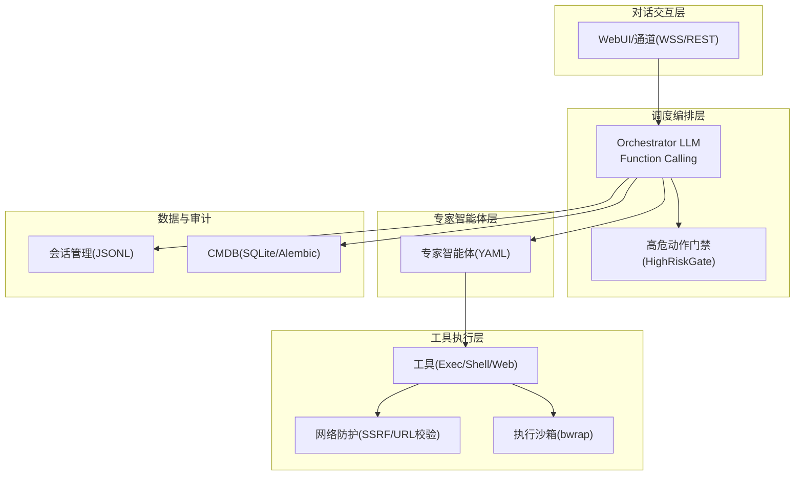
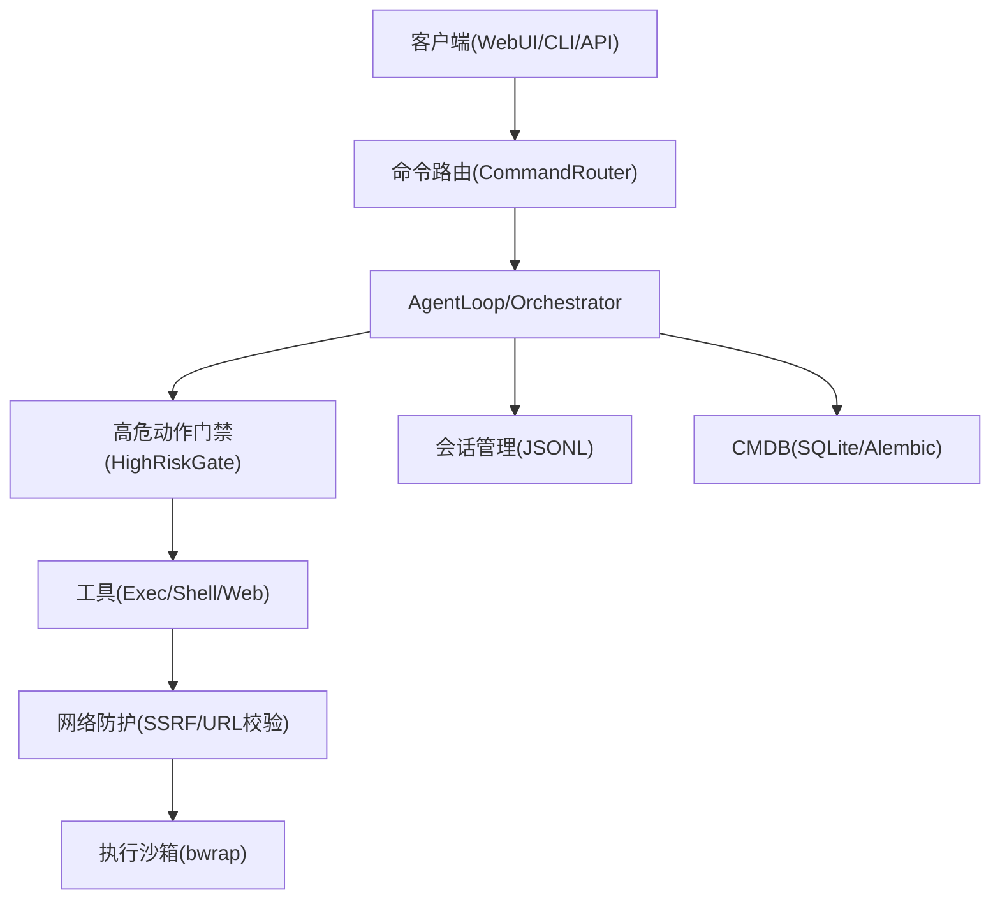
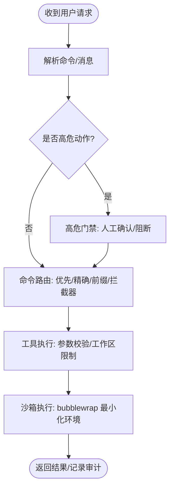
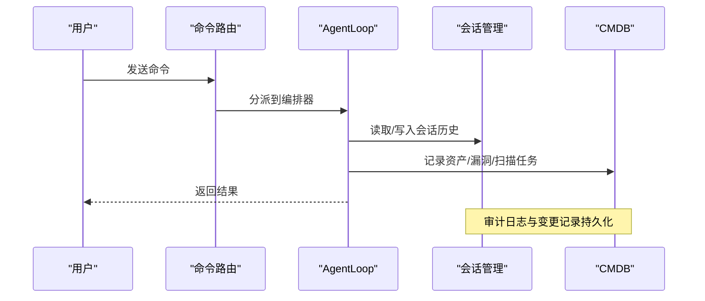
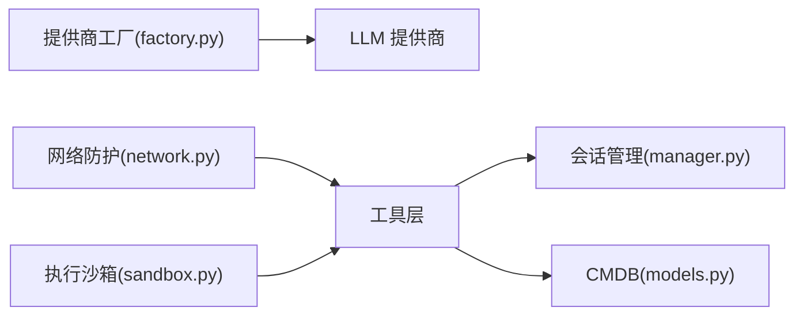

# 合规要求与最佳实践

<cite>
**本文引用的文件**
- [README.md](file://README.md)
- [configuration.md](file://docs/configuration.md)
- [deployment.md](file://docs/deployment.md)
- [network.py](file://secbot/security/network.py)
- [manager.py](file://secbot/session/manager.py)
- [models.py](file://secbot/cmdb/models.py)
- [factory.py](file://secbot/providers/factory.py)
- [base.py](file://secbot/agent/tools/base.py)
- [sandbox.py](file://secbot/agent/tools/sandbox.py)
- [helpers.py](file://secbot/utils/helpers.py)
- [router.py](file://secbot/command/router.py)
- [test_security_network.py](file://tests/security/test_security_network.py)
- [test_sandbox.py](file://tests/security/test_sandbox.py)
- [test_exec_security.py](file://tests/tools/test_exec_security.py)
</cite>

## 目录
1. [引言](#引言)
2. [项目结构](#项目结构)
3. [核心组件](#核心组件)
4. [架构总览](#架构总览)
5. [详细组件分析](#详细组件分析)
6. [依赖分析](#依赖分析)
7. [性能考虑](#性能考虑)
8. [故障排查指南](#故障排查指南)
9. [结论](#结论)
10. [附录](#附录)

## 引言
本指南面向 secbot 在网络安全与合规领域的应用，聚焦以下目标：
- 授权管理机制：用户权限分配、角色管理与访问控制策略
- 责任追踪系统：操作审计、变更记录与责任归属
- 数据保护措施：数据加密、隐私保护与敏感信息处理
- 安全配置要求：网络隔离、防火墙设置与访问控制列表
- 合规性检查清单与认证标准对照
- 安全事件响应流程与应急处理预案
- 定期安全评估与风险评估的指导方案

本指南结合代码库中的安全实现与文档，提供可落地的最佳实践与操作指引。

## 项目结构
secbot 采用分层架构，围绕“对话交互层—调度编排层—专家智能体层—工具执行层”组织模块，同时在安全层面引入网络防护、沙箱执行、会话与审计、CMDB 资产库等能力，确保高危动作受控、操作可追溯、数据可治理。

图表来源
- [README.md: 29-63:29-63](file://README.md#L29-L63)
- [network.py: 1-120:1-120](file://secbot/security/network.py#L1-L120)
- [manager.py: 239-576:239-576](file://secbot/session/manager.py#L239-L576)
- [models.py: 38-178:38-178](file://secbot/cmdb/models.py#L38-L178)

章节来源
- [README.md: 29-63:29-63](file://README.md#L29-L63)

## 核心组件
- 网络安全与 SSRF 防护：通过 URL 解析、DNS 解析与私有地址白名单，阻断内部/私网地址访问与重定向风险。
- 执行沙箱：以 bubblewrap 构建最小化执行环境，限制工作目录与只读媒体目录挂载，降低命令注入与越权风险。
- 会话与审计：会话持久化与历史裁剪，时间戳标注与消息边界校验，支持审计导出与责任归属。
- CMDB 资产库：统一建模资产、端口、漏洞与扫描任务，带 actor_id 多租户预留字段，便于合规审计与责任划分。
- 提供商工厂：集中化配置与校验，避免密钥泄露与错误配置导致的未授权访问。
- 工具参数校验：基于 JSON Schema 的参数类型、长度、枚举与必填项校验，减少误用与注入风险。
- 命令路由与拦截：优先级命令、精确匹配与前缀匹配，以及拦截器，保障关键命令的可控性。

章节来源
- [network.py: 11-120:11-120](file://secbot/security/network.py#L11-L120)
- [sandbox.py: 14-56:14-56](file://secbot/agent/tools/sandbox.py#L14-L56)
- [manager.py: 239-576:239-576](file://secbot/session/manager.py#L239-L576)
- [models.py: 38-178:38-178](file://secbot/cmdb/models.py#L38-L178)
- [factory.py: 21-92:21-92](file://secbot/providers/factory.py#L21-L92)
- [base.py: 21-115:21-115](file://secbot/agent/tools/base.py#L21-L115)
- [router.py: 27-99:27-99](file://secbot/command/router.py#L27-L99)

## 架构总览
下图展示 secbot 的安全相关架构要点：从入口到执行，层层设防，确保高危动作受控、网络访问受限、执行环境隔离、会话与审计可追溯。

图表来源
- [router.py: 27-99:27-99](file://secbot/command/router.py#L27-L99)
- [network.py: 45-120:45-120](file://secbot/security/network.py#L45-L120)
- [sandbox.py: 14-56:14-56](file://secbot/agent/tools/sandbox.py#L14-L56)
- [manager.py: 239-576:239-576](file://secbot/session/manager.py#L239-L576)
- [models.py: 38-178:38-178](file://secbot/cmdb/models.py#L38-L178)

## 详细组件分析

### 授权管理机制
- 用户权限分配与角色管理
  - 当前实现未直接暴露显式的“角色/权限矩阵”，但通过以下机制实现细粒度控制：
    - 会话隔离：不同 session_key 独立历史，避免跨会话信息泄露。
    - 工作目录限制：执行工具时可强制限制在工作区范围内，防止越权写入。
    - 高危动作门禁：对高危技能（如弱口令爆破、漏洞扫描）进行人工确认与阻断，确保动作可审计。
    - 提供商配置与密钥管理：通过配置文件与环境变量分离密钥，避免硬编码；支持多种提供商与 OAuth 登录路径。
- 访问控制策略
  - 网络访问控制：SSRF 白名单与私网地址阻断，支持工具级白名单配置。
  - 执行访问控制：二进制白名单、参数注入阻断、设备文件与 /dev/null 重定向豁免规则。

图表来源
- [router.py: 27-99:27-99](file://secbot/command/router.py#L27-L99)
- [base.py: 225-233:225-233](file://secbot/agent/tools/base.py#L225-L233)
- [sandbox.py: 14-56:14-56](file://secbot/agent/tools/sandbox.py#L14-L56)

章节来源
- [router.py: 27-99:27-99](file://secbot/command/router.py#L27-L99)
- [base.py: 225-233:225-233](file://secbot/agent/tools/base.py#L225-L233)
- [sandbox.py: 14-56:14-56](file://secbot/agent/tools/sandbox.py#L14-L56)

### 责任追踪系统
- 操作审计
  - 会话持久化：每个会话以 JSONL 文件存储，包含消息、时间戳、工具调用与元数据，支持修复与恢复。
  - 历史裁剪：按消息数量与令牌预算裁剪，保留合法边界，避免越界与泄漏。
  - 时间戳标注：对用户消息与主动推送消息标注时间，辅助审计与溯源。
- 变更记录与责任归属
  - CMDB 统一建模资产、端口、漏洞与扫描任务，带 actor_id 字段，便于多租户与责任划分。
  - 高危动作门禁记录确认行为与超时情况，形成审计证据链。
- 审计导出
  - 会话文件可读取与导出，结合报告生成能力输出结构化报告。

图表来源
- [manager.py: 239-576:239-576](file://secbot/session/manager.py#L239-L576)
- [models.py: 38-178:38-178](file://secbot/cmdb/models.py#L38-L178)

章节来源
- [manager.py: 239-576:239-576](file://secbot/session/manager.py#L239-L576)
- [models.py: 38-178:38-178](file://secbot/cmdb/models.py#L38-L178)

### 数据保护措施
- 数据加密
  - 配置文件与密钥通过环境变量注入，避免明文存储于配置文件。
  - 传输层建议使用 HTTPS 与受信代理，工具网络访问可通过代理统一管控。
- 隐私保护
  - 会话文件按需裁剪，避免过长历史与敏感内容外泄。
  - 图像占位符与文本块拼接，减少敏感内容直接回显。
- 敏感信息处理
  - 历史文件写入与清理策略，工具输出过大时落盘并返回稳定引用，避免内存驻留敏感数据。
  - 执行沙箱限制只读媒体目录，防止敏感文件被读取或写入。

章节来源
- [helpers.py: 240-287:240-287](file://secbot/utils/helpers.py#L240-L287)
- [helpers.py: 141-144:141-144](file://secbot/utils/helpers.py#L141-L144)
- [sandbox.py: 14-56:14-56](file://secbot/agent/tools/sandbox.py#L14-L56)

### 安全配置要求
- 网络隔离与防火墙
  - SSRF 白名单：支持工具级白名单配置，允许特定 CIDR（如 CGNAT/Tailscale）通过。
  - 私网地址阻断：默认阻断 RFC1918、回环、云元数据等私网地址与 IPv6 本地地址。
- 访问控制列表
  - 二进制白名单：仅允许受信任二进制（如 nmap、fscan、nuclei、weasyprint、python3）执行。
  - 参数注入阻断：拒绝包含危险字符与特殊符号的参数组合。
- 执行环境隔离
  - bubblewrap 沙箱：最小化挂载，隐藏配置目录，只读媒体目录，限制工作目录。
- 提供商与密钥管理
  - 集中式提供商工厂：校验必需字段（如 Azure OpenAI 的 api_base 与 api_key），避免未授权访问。
  - 环境变量注入：通过 ${VAR_NAME} 引用，配合 systemd 环境文件严格权限控制。

章节来源
- [network.py: 29-120:29-120](file://secbot/security/network.py#L29-L120)
- [test_security_network.py: 108-146:108-146](file://tests/security/test_security_network.py#L108-L146)
- [test_sandbox.py: 21-153:21-153](file://tests/security/test_sandbox.py#L21-L153)
- [factory.py: 21-92:21-92](file://secbot/providers/factory.py#L21-L92)
- [configuration.md: 10-44:10-44](file://docs/configuration.md#L10-L44)

### 合规性检查清单与认证标准对照
- 授权前置
  - 所有扫描任务必须携带授权凭据（目标范围 + 授权人），CMDB 记录留痕。
- 高危护栏
  - 爆破、RCE PoC 等动作经高危门禁确认，阻断至人工放行。
- 权限沙箱
  - 工具调用经网络白名单与命令注入防护。
- 审计日志
  - 每次 tool call 记录输入、输出、发起人、时间戳，支持离线导出。

章节来源
- [README.md: 239-246:239-246](file://README.md#L239-L246)

### 安全事件响应流程与应急处理预案
- 事件分类
  - 网络异常：SSRF 重定向、私网地址访问尝试、代理异常。
  - 执行异常：命令注入、越权写入、沙箱逃逸、超时/取消。
  - 配置异常：密钥缺失、提供商不可用、工作区越界。
- 响应步骤
  - 隔离：立即阻断相关会话与工具执行，关闭高危动作门禁。
  - 采集：导出会话历史、CMDB 变更、提供商调用日志与沙箱执行日志。
  - 分析：定位触发条件、受影响范围与潜在影响面。
  - 修复：修正配置、更新白名单、修补工具与沙箱策略。
  - 复盘：更新应急预案、加强监控与告警。
- 应急预案
  - 紧急停用高危技能，临时收紧工作区限制与网络白名单。
  - 切换备用提供商或代理，确保服务可用性与安全性。

章节来源
- [router.py: 27-99:27-99](file://secbot/command/router.py#L27-L99)
- [network.py: 45-120:45-120](file://secbot/security/network.py#L45-L120)
- [sandbox.py: 14-56:14-56](file://secbot/agent/tools/sandbox.py#L14-L56)

### 定期安全评估与风险评估指导方案
- 评估维度
  - 配置与密钥：提供商配置完整性、环境变量注入正确性、密钥轮换策略。
  - 网络与访问：SSRF 白名单有效性、私网地址阻断覆盖率、代理与防火墙策略。
  - 执行与隔离：二进制白名单覆盖度、参数注入阻断有效性、沙箱逃逸检测。
  - 审计与追溯：会话完整性、CMDB 数据一致性、高危动作确认率。
- 评估方法
  - 自动化测试：覆盖 SSRF、沙箱、执行安全与配置校验。
  - 渗透演练：模拟内部地址访问、命令注入与越权写入。
  - 回顾审计：定期导出会话与 CMDB 变更，核对授权与责任人。
- 改进建议
  - 动态调整白名单与阈值，结合业务场景优化。
  - 加强日志留存与告警联动，缩短响应时间。
  - 建立供应商与密钥生命周期管理流程。

章节来源
- [test_security_network.py: 1-146:1-146](file://tests/security/test_security_network.py#L1-L146)
- [test_sandbox.py: 1-153:1-153](file://tests/security/test_sandbox.py#L1-L153)
- [test_exec_security.py: 1-246:1-246](file://tests/tools/test_exec_security.py#L1-L246)

## 依赖分析
- 组件耦合与内聚
  - 网络防护与执行沙箱分别独立，通过工具层统一接入，降低耦合度。
  - 会话管理与 CMDB 作为数据层，被编排层与工具层共同依赖，保持高内聚低耦合。
- 外部依赖与集成点
  - 提供商工厂集中管理外部 LLM 服务，避免分散配置带来的安全风险。
  - 代理与密钥管理通过环境变量与配置文件解耦，便于运维与审计。

图表来源
- [factory.py: 21-92:21-92](file://secbot/providers/factory.py#L21-L92)
- [network.py: 11-120:11-120](file://secbot/security/network.py#L11-L120)
- [sandbox.py: 14-56:14-56](file://secbot/agent/tools/sandbox.py#L14-L56)
- [manager.py: 239-576:239-576](file://secbot/session/manager.py#L239-L576)
- [models.py: 38-178:38-178](file://secbot/cmdb/models.py#L38-L178)

章节来源
- [factory.py: 21-92:21-92](file://secbot/providers/factory.py#L21-L92)
- [network.py: 11-120:11-120](file://secbot/security/network.py#L11-L120)
- [sandbox.py: 14-56:14-56](file://secbot/agent/tools/sandbox.py#L14-L56)
- [manager.py: 239-576:239-576](file://secbot/session/manager.py#L239-L576)
- [models.py: 38-178:38-178](file://secbot/cmdb/models.py#L38-L178)

## 性能考虑
- 会话裁剪与令牌预算：通过消息数量与令牌预算双重约束，避免上下文膨胀导致的性能下降。
- 工具输出落盘：对超长输出进行落盘并返回引用，减少内存占用与序列化开销。
- 沙箱最小化：bubblewrap 仅挂载必要目录，降低 I/O 与系统调用开销。
- 提供商计数与回退：优先使用提供商内置计数器，失败时回退到估算，平衡准确性与性能。

章节来源
- [helpers.py: 383-438:383-438](file://secbot/utils/helpers.py#L383-L438)
- [helpers.py: 240-287:240-287](file://secbot/utils/helpers.py#L240-L287)
- [sandbox.py: 14-56:14-56](file://secbot/agent/tools/sandbox.py#L14-L56)

## 故障排查指南
- SSRF 与网络访问问题
  - 症状：访问内部地址或私网地址被阻断。
  - 排查：检查工具级 SSRF 白名单配置，确认域名解析结果与目标地址是否在阻断列表。
  - 参考测试：工具级 URL 校验与白名单生效测试。
- 执行沙箱与命令注入
  - 症状：命令执行失败或被拒绝。
  - 排查：确认二进制是否在白名单，参数是否包含危险字符，工作目录是否越界。
  - 参考测试：二进制白名单、参数注入阻断与超时/取消处理。
- 配置与提供商问题
  - 症状：启动时报缺少 API Key 或提供商配置错误。
  - 排查：检查 providers 配置与环境变量注入，确认密钥与 base URL 正确。
- 会话与审计问题
  - 症状：会话文件损坏或历史丢失。
  - 排查：查看修复逻辑与迁移路径，确认会话文件完整性与元数据正确性。

章节来源
- [test_security_network.py: 1-146:1-146](file://tests/security/test_security_network.py#L1-L146)
- [test_sandbox.py: 1-153:1-153](file://tests/security/test_sandbox.py#L1-L153)
- [test_exec_security.py: 1-246:1-246](file://tests/tools/test_exec_security.py#L1-L246)
- [factory.py: 21-92:21-92](file://secbot/providers/factory.py#L21-L92)
- [manager.py: 285-392:285-392](file://secbot/session/manager.py#L285-L392)

## 结论
本指南基于 secbot 的实际实现，总结了授权管理、责任追踪、数据保护、安全配置、合规检查、事件响应与定期评估的关键实践。通过网络防护、执行沙箱、会话与审计、CMDB 资产库与提供商工厂等机制，secbot 在保证功能灵活性的同时，提供了可审计、可追溯、可隔离的安全基线。建议在生产环境中结合本文的检查清单与流程，持续完善安全策略与应急响应能力。

## 附录
- 部署与运维
  - Docker 与 systemd 用户服务部署，建议使用非 root 用户运行，严格控制配置与日志目录权限。
- 配置与密钥
  - 使用环境变量注入密钥，配合 systemd 环境文件与最小权限原则，避免密钥泄露。

章节来源
- [deployment.md: 1-171:1-171](file://docs/deployment.md#L1-L171)
- [configuration.md: 10-44:10-44](file://docs/configuration.md#L10-L44)