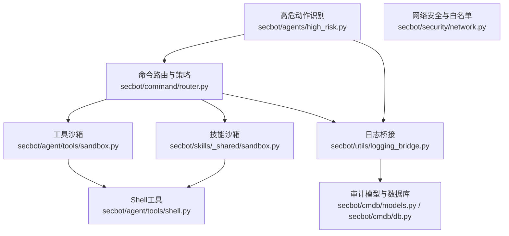
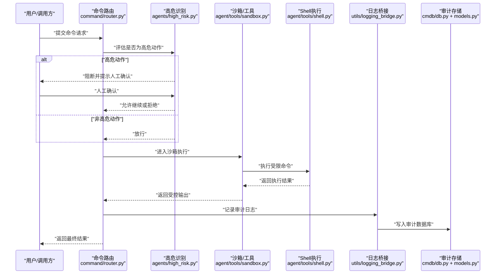
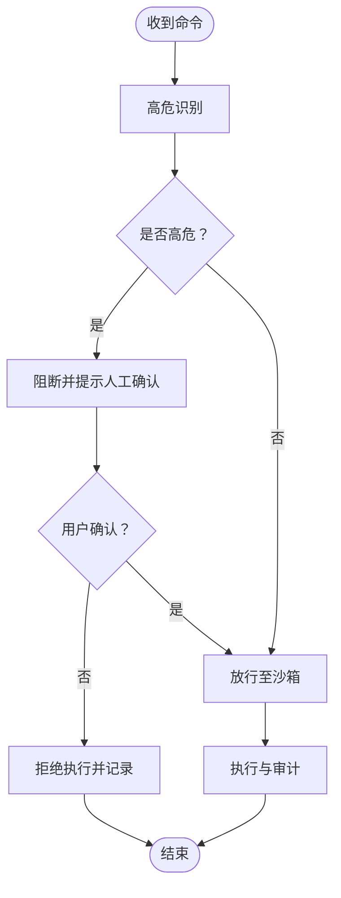
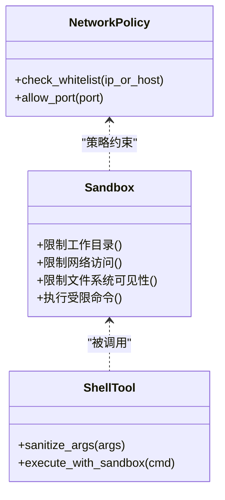
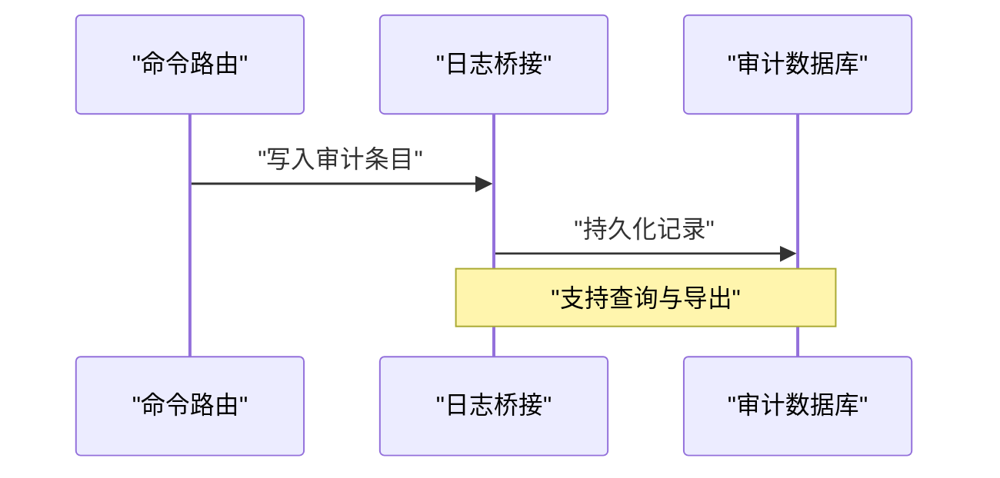
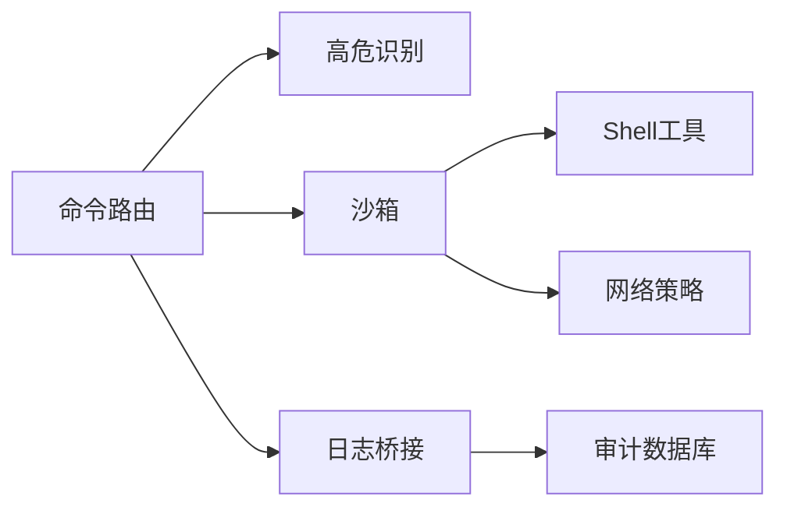

# 安全与合规

<cite>
**本文引用的文件**
- [secbot/agents/high_risk.py](file://secbot/agents/high_risk.py)
- [secbot/security/network.py](file://secbot/security/network.py)
- [secbot/agent/tools/sandbox.py](file://secbot/agent/tools/sandbox.py)
- [secbot/skills/_shared/sandbox.py](file://secbot/skills/_shared/sandbox.py)
- [secbot/agent/tools/shell.py](file://secbot/agent/tools/shell.py)
- [secbot/command/router.py](file://secbot/command/router.py)
- [secbot/cmdb/models.py](file://secbot/cmdb/models.py)
- [secbot/cmdb/db.py](file://secbot/cmdb/db.py)
- [secbot/utils/logging_bridge.py](file://secbot/utils/logging_bridge.py)
- [tests/test_high_risk_gate.py](file://tests/test_high_risk_gate.py)
- [tests/security/test_sandbox.py](file://tests/security/test_sandbox.py)
- [tests/security/test_security_network.py](file://tests/security/test_security_network.py)
- [tests/tools/test_exec_security.py](file://tests/tools/test_exec_security.py)
- [tests/tools/test_exec_allow_patterns.py](file://tests/tools/test_exec_allow_patterns.py)
- [tests/tools/test_sandbox.py](file://tests/tools/test_sandbox.py)
- [tests/tools/test_web_fetch_security.py](file://tests/tools/test_web_fetch_security.py)
- [tests/tools/test_web_fetch_url_sanitization.py](file://tests/tools/test_web_fetch_url_sanitization.py)
- [docs/configuration.md](file://docs/configuration.md)
- [docs/deployment.md](file://docs/deployment.md)
- [docs/quick-start.md](file://docs/quick-start.md)
</cite>

## 目录
1. [引言](#引言)
2. [项目结构](#项目结构)
3. [核心组件](#核心组件)
4. [架构总览](#架构总览)
5. [详细组件分析](#详细组件分析)
6. [依赖关系分析](#依赖关系分析)
7. [性能考虑](#性能考虑)
8. [故障排查指南](#故障排查指南)
9. [结论](#结论)
10. [附录](#附录)

## 引言
本文件聚焦于代码库中的安全与合规体系，围绕“高危操作护栏机制”“权限沙箱设计”“审计日志系统”“合规要求与最佳实践”“安全配置建议”“安全事件响应流程”以及“安全测试与漏洞扫描”等方面进行系统化梳理与说明。目标是帮助技术与非技术读者理解如何在该系统中实现对高风险动作的识别、阻断与审计，并建立可落地的安全治理与运维流程。

## 项目结构
安全相关的代码主要分布在以下模块：
- 高危动作识别与阻断：secbot/agents/high_risk.py
- 网络安全与白名单：secbot/security/network.py
- 执行沙箱与工具安全：secbot/agent/tools/sandbox.py、secbot/skills/_shared/sandbox.py、secbot/agent/tools/shell.py
- 命令路由与安全策略：secbot/command/router.py
- 审计与持久化：secbot/cmdb/models.py、secbot/cmdb/db.py、secbot/utils/logging_bridge.py
- 测试用例：tests/test_high_risk_gate.py、tests/security/test_sandbox.py、tests/security/test_security_network.py、tests/tools/test_exec_security.py、tests/tools/test_exec_allow_patterns.py、tests/tools/test_sandbox.py、tests/tools/test_web_fetch_security.py、tests/tools/test_web_fetch_url_sanitization.py
- 文档参考：docs/configuration.md、docs/deployment.md、docs/quick-start.md

图表来源
- [secbot/agents/high_risk.py](file://secbot/agents/high_risk.py)
- [secbot/security/network.py](file://secbot/security/network.py)
- [secbot/command/router.py](file://secbot/command/router.py)
- [secbot/agent/tools/sandbox.py](file://secbot/agent/tools/sandbox.py)
- [secbot/skills/_shared/sandbox.py](file://secbot/skills/_shared/sandbox.py)
- [secbot/agent/tools/shell.py](file://secbot/agent/tools/shell.py)
- [secbot/utils/logging_bridge.py](file://secbot/utils/logging_bridge.py)
- [secbot/cmdb/models.py](file://secbot/cmdb/models.py)
- [secbot/cmdb/db.py](file://secbot/cmdb/db.py)

章节来源
- [secbot/agents/high_risk.py](file://secbot/agents/high_risk.py)
- [secbot/security/network.py](file://secbot/security/network.py)
- [secbot/command/router.py](file://secbot/command/router.py)
- [secbot/agent/tools/sandbox.py](file://secbot/agent/tools/sandbox.py)
- [secbot/skills/_shared/sandbox.py](file://secbot/skills/_shared/sandbox.py)
- [secbot/agent/tools/shell.py](file://secbot/agent/tools/shell.py)
- [secbot/utils/logging_bridge.py](file://secbot/utils/logging_bridge.py)
- [secbot/cmdb/models.py](file://secbot/cmdb/models.py)
- [secbot/cmdb/db.py](file://secbot/cmdb/db.py)

## 核心组件
- 高危动作识别与阻断：通过规则或策略判定高风险动作，触发人工确认或直接阻断。
- 权限沙箱：限制执行环境、命令注入防护、网段白名单校验等。
- 审计日志系统：统一记录操作行为、上下文与结果，支持查询与导出。
- 合规与最佳实践：授权管理、责任追踪、数据保护与最小权限原则。
- 安全配置建议：网络隔离、访问控制、监控告警与变更审批。
- 安全事件响应：事件分级、处置流程、回溯与修复。
- 安全测试与漏洞扫描：单元测试覆盖、安全专项测试与持续集成加固。

章节来源
- [secbot/agents/high_risk.py](file://secbot/agents/high_risk.py)
- [secbot/security/network.py](file://secbot/security/network.py)
- [secbot/agent/tools/sandbox.py](file://secbot/agent/tools/sandbox.py)
- [secbot/skills/_shared/sandbox.py](file://secbot/skills/_shared/sandbox.py)
- [secbot/agent/tools/shell.py](file://secbot/agent/tools/shell.py)
- [secbot/utils/logging_bridge.py](file://secbot/utils/logging_bridge.py)
- [secbot/cmdb/models.py](file://secbot/cmdb/models.py)
- [secbot/cmdb/db.py](file://secbot/cmdb/db.py)

## 架构总览
下图展示了从命令进入系统到执行与审计的关键路径，以及安全护栏在其中的位置。

图表来源
- [secbot/command/router.py](file://secbot/command/router.py)
- [secbot/agents/high_risk.py](file://secbot/agents/high_risk.py)
- [secbot/agent/tools/sandbox.py](file://secbot/agent/tools/sandbox.py)
- [secbot/agent/tools/shell.py](file://secbot/agent/tools/shell.py)
- [secbot/utils/logging_bridge.py](file://secbot/utils/logging_bridge.py)
- [secbot/cmdb/db.py](file://secbot/cmdb/db.py)
- [secbot/cmdb/models.py](file://secbot/cmdb/models.py)

## 详细组件分析

### 高危操作护栏机制
- 动作识别：基于预定义规则或动态策略判断是否属于高危动作（如系统级命令、敏感路径写入、跨域资源访问等）。
- 人工确认流程：当识别为高危时，系统阻断执行并提示用户进行二次确认；确认后方可继续，否则终止。
- 阻断策略：在路由层拦截，不进入沙箱或执行阶段；同时记录阻断原因与上下文。

图表来源
- [secbot/agents/high_risk.py](file://secbot/agents/high_risk.py)
- [secbot/command/router.py](file://secbot/command/router.py)

章节来源
- [secbot/agents/high_risk.py](file://secbot/agents/high_risk.py)
- [tests/test_high_risk_gate.py](file://tests/test_high_risk_gate.py)

### 权限沙箱设计
- 网段白名单校验：仅允许访问白名单内的网络地址或服务端口，防止横向移动与外联风险。
- 命令注入防护：对输入参数进行严格校验与转义，避免命令拼接导致的注入攻击。
- 执行环境隔离：通过沙箱限制工作目录、环境变量、文件系统可见性与网络访问范围。

图表来源
- [secbot/agent/tools/sandbox.py](file://secbot/agent/tools/sandbox.py)
- [secbot/skills/_shared/sandbox.py](file://secbot/skills/_shared/sandbox.py)
- [secbot/agent/tools/shell.py](file://secbot/agent/tools/shell.py)
- [secbot/security/network.py](file://secbot/security/network.py)

章节来源
- [secbot/agent/tools/sandbox.py](file://secbot/agent/tools/sandbox.py)
- [secbot/skills/_shared/sandbox.py](file://secbot/skills/_shared/sandbox.py)
- [secbot/agent/tools/shell.py](file://secbot/agent/tools/shell.py)
- [secbot/security/network.py](file://secbot/security/network.py)
- [tests/security/test_sandbox.py](file://tests/security/test_sandbox.py)
- [tests/tools/test_exec_security.py](file://tests/tools/test_exec_security.py)
- [tests/tools/test_exec_allow_patterns.py](file://tests/tools/test_exec_allow_patterns.py)

### 审计日志系统
- 日志记录格式：统一字段包括时间戳、用户标识、命令内容、执行结果、沙箱策略、阻断原因（如有）、会话ID等。
- 查询方法：通过审计数据库模型与接口进行条件过滤、分页与聚合统计。
- 导出功能：支持按时间段与维度导出CSV/JSON等格式，便于合规检查与取证。

图表来源
- [secbot/utils/logging_bridge.py](file://secbot/utils/logging_bridge.py)
- [secbot/cmdb/models.py](file://secbot/cmdb/models.py)
- [secbot/cmdb/db.py](file://secbot/cmdb/db.py)

章节来源
- [secbot/utils/logging_bridge.py](file://secbot/utils/logging_bridge.py)
- [secbot/cmdb/models.py](file://secbot/cmdb/models.py)
- [secbot/cmdb/db.py](file://secbot/cmdb/db.py)

### 合规要求与最佳实践
- 授权管理：最小权限原则、职责分离、定期权限复核。
- 责任追踪：实名制登录、操作签名、不可否认性。
- 数据保护：敏感数据脱敏、传输加密、存储加密与访问审计。
- 变更审批：重大变更需双人复核与升级审批。

章节来源
- [docs/configuration.md](file://docs/configuration.md)
- [docs/deployment.md](file://docs/deployment.md)
- [docs/quick-start.md](file://docs/quick-start.md)

### 安全配置建议
- 网络隔离：VPC/子网划分、安全组与防火墙策略、出口代理与DNS白名单。
- 访问控制：多因子认证、IP白名单、会话超时与强制轮换。
- 监控告警：异常登录、高危命令、失败率突增、资源使用异常等阈值告警。

章节来源
- [docs/configuration.md](file://docs/configuration.md)
- [docs/deployment.md](file://docs/deployment.md)
- [docs/quick-start.md](file://docs/quick-start.md)

### 安全事件响应流程
- 分级与上报：根据影响面与暴露面分级，明确上报路径与时限。
- 处置步骤：隔离受影响实例、封禁高危账户、回滚可疑变更、修复漏洞。
- 回溯与修复：审计日志回溯、根因分析、补丁与加固发布。
- 复盘与改进：更新策略、完善测试与演练。

章节来源
- [secbot/utils/logging_bridge.py](file://secbot/utils/logging_bridge.py)
- [secbot/cmdb/models.py](file://secbot/cmdb/models.py)
- [secbot/cmdb/db.py](file://secbot/cmdb/db.py)

### 安全测试与漏洞扫描
- 单元测试覆盖：针对沙箱、网络白名单、命令安全、URL清洗等模块的测试用例。
- 漏洞扫描：静态分析（SAST）、依赖扫描、容器镜像扫描、渗透测试与红蓝对抗。

章节来源
- [tests/security/test_sandbox.py](file://tests/security/test_sandbox.py)
- [tests/security/test_security_network.py](file://tests/security/test_security_network.py)
- [tests/tools/test_exec_security.py](file://tests/tools/test_exec_security.py)
- [tests/tools/test_exec_allow_patterns.py](file://tests/tools/test_exec_allow_patterns.py)
- [tests/tools/test_sandbox.py](file://tests/tools/test_sandbox.py)
- [tests/tools/test_web_fetch_security.py](file://tests/tools/test_web_fetch_security.py)
- [tests/tools/test_web_fetch_url_sanitization.py](file://tests/tools/test_web_fetch_url_sanitization.py)

## 依赖关系分析
- 命令路由依赖高危识别与沙箱模块，确保在执行前完成风险评估与环境隔离。
- 沙箱模块依赖网络策略与Shell工具，以实现网络白名单与命令注入防护。
- 审计日志贯穿所有关键节点，依赖数据库模型与桥接模块完成持久化。

图表来源
- [secbot/command/router.py](file://secbot/command/router.py)
- [secbot/agents/high_risk.py](file://secbot/agents/high_risk.py)
- [secbot/agent/tools/sandbox.py](file://secbot/agent/tools/sandbox.py)
- [secbot/agent/tools/shell.py](file://secbot/agent/tools/shell.py)
- [secbot/security/network.py](file://secbot/security/network.py)
- [secbot/utils/logging_bridge.py](file://secbot/utils/logging_bridge.py)
- [secbot/cmdb/db.py](file://secbot/cmdb/db.py)

章节来源
- [secbot/command/router.py](file://secbot/command/router.py)
- [secbot/agents/high_risk.py](file://secbot/agents/high_risk.py)
- [secbot/agent/tools/sandbox.py](file://secbot/agent/tools/sandbox.py)
- [secbot/agent/tools/shell.py](file://secbot/agent/tools/shell.py)
- [secbot/security/network.py](file://secbot/security/network.py)
- [secbot/utils/logging_bridge.py](file://secbot/utils/logging_bridge.py)
- [secbot/cmdb/db.py](file://secbot/cmdb/db.py)

## 性能考虑
- 沙箱与高危识别的开销应尽量降低，避免成为执行瓶颈；可通过缓存策略与异步审计减轻延迟。
- 审计日志采用批量写入与异步落盘，减少对主流程的影响。
- 网络白名单查询使用高效索引与内存缓存，缩短决策时间。

## 故障排查指南
- 高危动作误报：检查高危规则配置，必要时调整阈值或例外列表。
- 沙箱执行失败：核对工作目录、环境变量与网络策略，确认白名单与允许模式。
- 审计缺失：检查日志桥接与数据库连接状态，确认导出任务未被中断。
- 网络策略异常：验证白名单配置与端口开放策略，排查DNS解析与代理设置。

章节来源
- [tests/test_high_risk_gate.py](file://tests/test_high_risk_gate.py)
- [tests/security/test_sandbox.py](file://tests/security/test_sandbox.py)
- [tests/security/test_security_network.py](file://tests/security/test_security_network.py)
- [tests/tools/test_exec_security.py](file://tests/tools/test_exec_security.py)
- [tests/tools/test_exec_allow_patterns.py](file://tests/tools/test_exec_allow_patterns.py)
- [tests/tools/test_sandbox.py](file://tests/tools/test_sandbox.py)
- [tests/tools/test_web_fetch_security.py](file://tests/tools/test_web_fetch_security.py)
- [tests/tools/test_web_fetch_url_sanitization.py](file://tests/tools/test_web_fetch_url_sanitization.py)

## 结论
本系统通过“高危动作识别—人工确认—阻断策略”的护栏机制，结合“权限沙箱—命令注入防护—网络白名单”的执行安全设计，配合“统一审计—可查询—可导出”的日志体系，形成了较为完整的安全与合规闭环。建议在生产环境中进一步强化访问控制、监控告警与安全测试，持续完善事件响应与合规治理流程。

## 附录
- 参考文档：配置、部署与快速开始指南
  - [docs/configuration.md](file://docs/configuration.md)
  - [docs/deployment.md](file://docs/deployment.md)
  - [docs/quick-start.md](file://docs/quick-start.md)