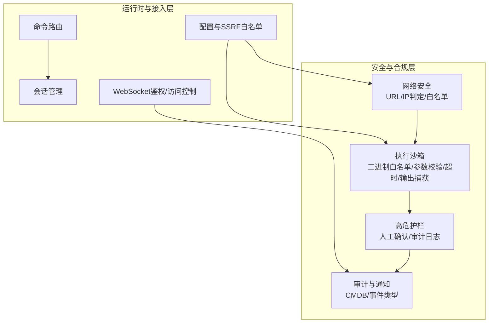
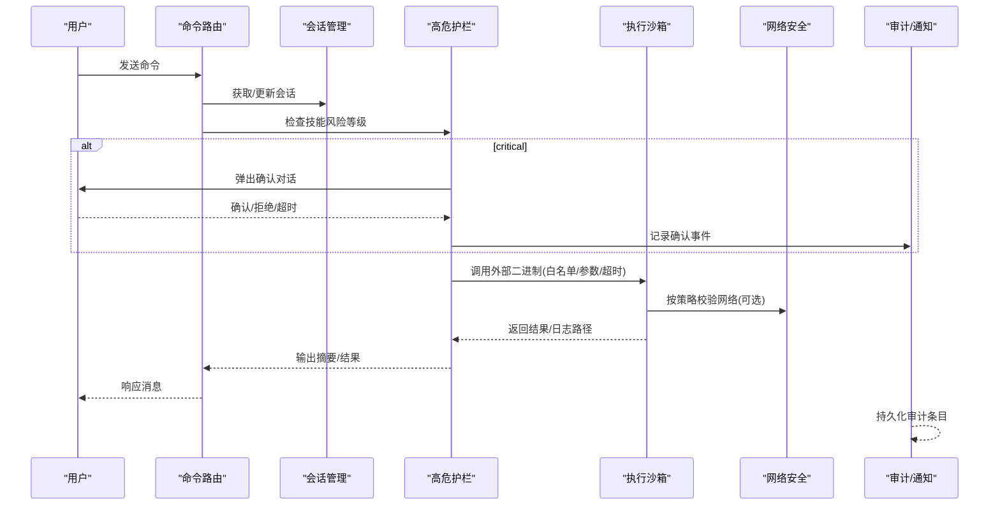
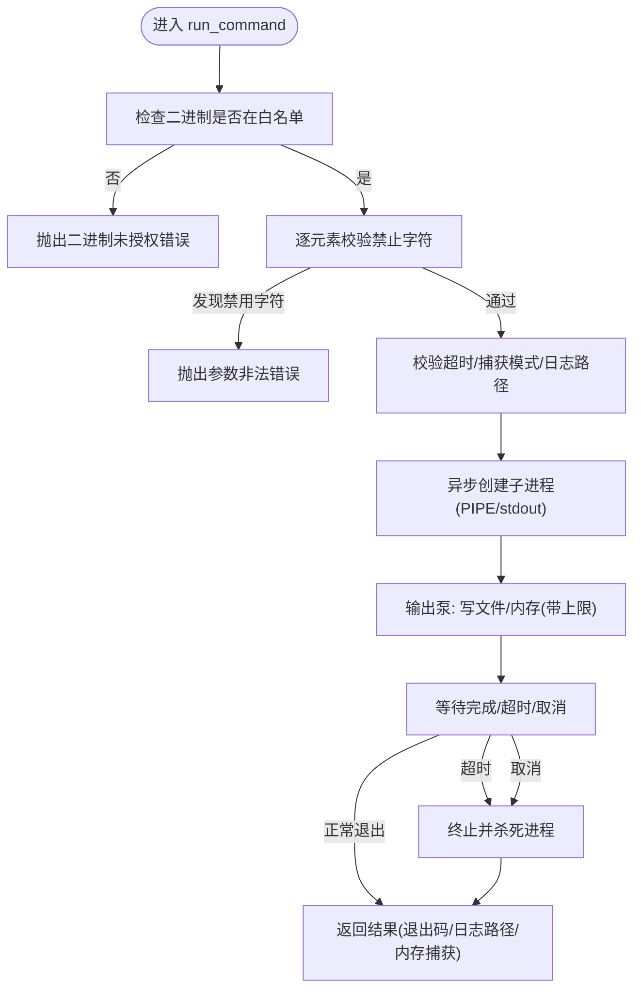
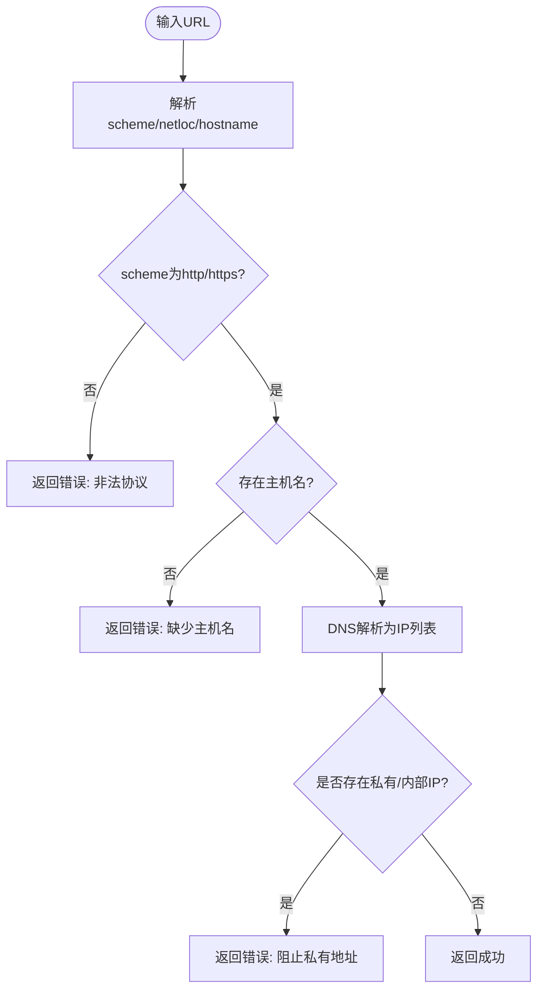
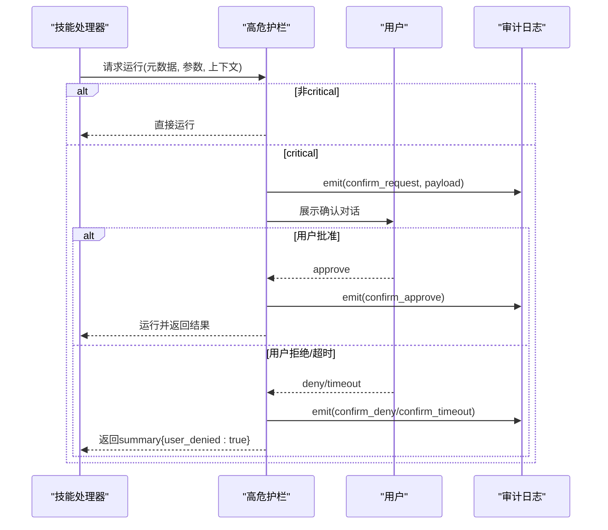
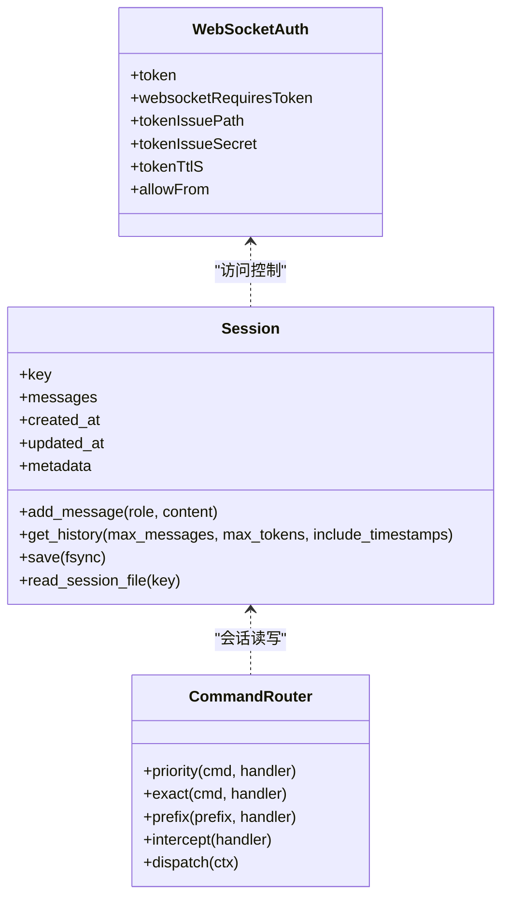
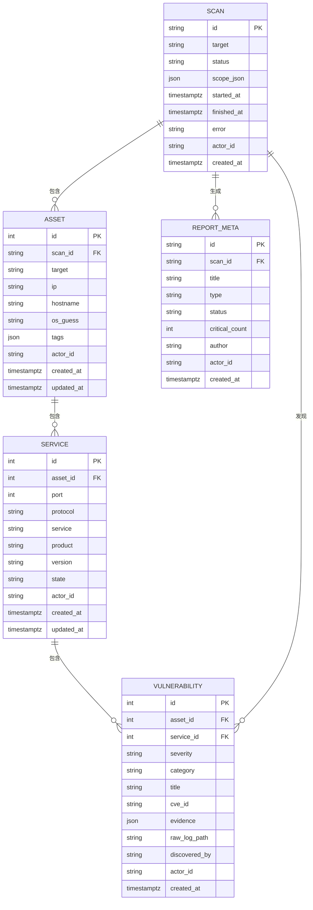
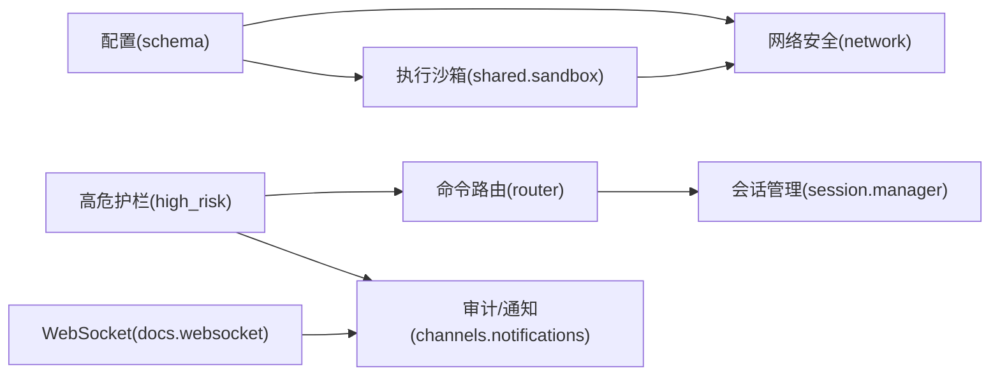

# 安全与合规

<cite>
**本文引用的文件**
- [secbot/security/network.py](file://secbot/security/network.py)
- [secbot/agent/tools/sandbox.py](file://secbot/agent/tools/sandbox.py)
- [secbot/skills/_shared/sandbox.py](file://secbot/skills/_shared/sandbox.py)
- [secbot/agents/high_risk.py](file://secbot/agents/high_risk.py)
- [secbot/session/manager.py](file://secbot/session/manager.py)
- [secbot/command/router.py](file://secbot/command/router.py)
- [secbot/utils/helpers.py](file://secbot/utils/helpers.py)
- [.trellis/spec/backend/tool-invocation-safety.md](file://.trellis/spec/backend/tool-invocation-safety.md)
- [tests/security/test_sandbox.py](file://tests/security/test_sandbox.py)
- [tests/security/test_security_network.py](file://tests/security/test_security_network.py)
- [secbot/cmdb/models.py](file://secbot/cmdb/models.py)
- [secbot/config/schema.py](file://secbot/config/schema.py)
- [docker-compose.yml](file://docker-compose.yml)
- [webui/src/gap/audit-log.md](file://webui/src/gap/audit-log.md)
- [docs/websocket.md](file://docs/websocket.md)
- [tests/agent/test_high_risk_gate.py](file://tests/agent/test_high_risk_gate.py)
- [tests/agent/tools/test_self_tool.py](file://tests/agent/tools/test_self_tool.py)
- [tests/config/test_config_migration.py](file://tests/config/test_config_migration.py)
- [secbot/channels/notifications.py](file://secbot/channels/notifications.py)
</cite>

## 目录
1. [简介](#简介)
2. [项目结构](#项目结构)
3. [核心组件](#核心组件)
4. [架构总览](#架构总览)
5. [详细组件分析](#详细组件分析)
6. [依赖分析](#依赖分析)
7. [性能考虑](#性能考虑)
8. [故障排查指南](#故障排查指南)
9. [结论](#结论)
10. [附录](#附录)

## 简介
本文件面向VAPT3/secbot的安全与合规体系，围绕以下目标展开：沙箱机制设计与实现（命令注入防护、网络白名单校验、资源限制）、高危操作护栏机制（识别、人工确认、审计日志）、权限控制系统（认证、会话管理、访问控制）、审计日志系统（记录格式、存储策略、查询接口）、安全配置最佳实践（网络隔离、最小权限、监控）、潜在威胁与防护、安全测试与漏洞扫描实施指南、合规检查清单与评估方法，以及数据隐私与敏感信息处理策略。

## 项目结构
secbot在多处模块中内置了安全与合规能力：
- 网络安全：通过URL解析与IP地址判定，阻断SSRF与内网探测；支持白名单CIDR放行。
- 执行沙箱：统一外部二进制调用入口，白名单+参数校验+超时/取消+输出捕获+网络策略。
- 高危护栏：对“critical”风险技能强制人工确认，记录审计事件。
- 会话与命令路由：会话持久化与读取、命令分发与拦截。
- 配置与容器：工具链配置、SSRF白名单、WebSocket鉴权与访问控制、容器安全选项。
- 审计与通知：CMDB表结构承载审计元数据，通知通道定义事件类型与级别。

**图表来源**
- [secbot/security/network.py:1-120](file://secbot/security/network.py#L1-L120)
- [secbot/skills/_shared/sandbox.py:1-192](file://secbot/skills/_shared/sandbox.py#L1-L192)
- [secbot/agents/high_risk.py:1-139](file://secbot/agents/high_risk.py#L1-L139)
- [secbot/config/schema.py:264-265](file://secbot/config/schema.py#L264-L265)
- [docs/websocket.md:181-208](file://docs/websocket.md#L181-L208)

**章节来源**
- [secbot/security/network.py:1-120](file://secbot/security/network.py#L1-L120)
- [secbot/skills/_shared/sandbox.py:1-192](file://secbot/skills/_shared/sandbox.py#L1-L192)
- [secbot/agents/high_risk.py:1-139](file://secbot/agents/high_risk.py#L1-L139)
- [secbot/config/schema.py:264-265](file://secbot/config/schema.py#L264-L265)
- [docs/websocket.md:181-208](file://docs/websocket.md#L181-L208)

## 核心组件
- 网络安全模块：提供URL目标验证、已解析URL二次验证、内联URL检测与SSRF白名单配置，阻断私有/回环/链路本地等内部地址访问。
- 执行沙箱：统一外部二进制调用入口，强制白名单、禁止字符过滤、超时与取消、输出捕获策略、网络策略声明与落地。
- 高危护栏：对“critical”风险技能触发人工确认流程，记录确认请求、批准、拒绝、超时等审计事件。
- 会话管理：JSONL持久化、历史截断与归档、原子落盘、只读读取修复、列表预览与归档标记。
- 命令路由：优先级/精确匹配/前缀最长匹配/拦截器，保证命令分发可控。
- 配置与容器：工具链配置含SSRF白名单字段；Docker Compose启用AppArmor/Seccomp放宽以支持bwrap；WebSocket鉴权与访问控制参数。

**章节来源**
- [secbot/security/network.py:1-120](file://secbot/security/network.py#L1-L120)
- [secbot/skills/_shared/sandbox.py:1-192](file://secbot/skills/_shared/sandbox.py#L1-L192)
- [secbot/agents/high_risk.py:1-139](file://secbot/agents/high_risk.py#L1-L139)
- [secbot/session/manager.py:1-659](file://secbot/session/manager.py#L1-L659)
- [secbot/command/router.py:1-99](file://secbot/command/router.py#L1-L99)
- [secbot/config/schema.py:264-265](file://secbot/config/schema.py#L264-L265)
- [docker-compose.yml:1-55](file://docker-compose.yml#L1-L55)
- [docs/websocket.md:181-208](file://docs/websocket.md#L181-L208)

## 架构总览
下图展示从命令到执行的关键安全路径：命令路由进入会话管理，高危护栏拦截critical技能，执行沙箱进行二进制白名单与参数校验，网络安全模块在需要时进行网络策略校验，审计日志记录确认事件，最终通过通知通道或API对外呈现。

**图表来源**
- [secbot/command/router.py:74-99](file://secbot/command/router.py#L74-L99)
- [secbot/session/manager.py:265-284](file://secbot/session/manager.py#L265-L284)
- [secbot/agents/high_risk.py:103-139](file://secbot/agents/high_risk.py#L103-L139)
- [secbot/skills/_shared/sandbox.py:70-192](file://secbot/skills/_shared/sandbox.py#L70-L192)
- [secbot/security/network.py:45-119](file://secbot/security/network.py#L45-L119)
- [secbot/channels/notifications.py:43-60](file://secbot/channels/notifications.py#L43-L60)

## 详细组件分析

### 沙箱机制：命令注入防护、网络白名单与资源限制
- 设计原则
  - 单一入口：所有外部二进制调用必须经由统一入口，避免直接子进程调用绕过安全约束。
  - 白名单策略：仅允许受控二进制（如nmap、fscan、nuclei、hydra、masscan、weasyprint、python3、git）。
  - 参数校验：argv元素禁止特定字符集；按字段正则校验；拒绝字符串拼接作为参数。
  - 超时与取消：必填超时；支持取消令牌；超时/取消后终止子进程。
  - 输出捕获：默认持久化大体量输出；内存上限捕获用于小量输出；丢弃模式用于副作用。
  - 网络策略：REQUIRED/OPTIONAL/NONE三态，NONE时平台侧阻断外联。
- 实现要点
  - 统一入口函数负责参数校验、二进制存在性检查、捕获模式与日志路径校验、超时与取消监听、输出泵与内存上限。
  - 平台侧通过网络安全模块在NONE策略下阻断外联。
- 测试覆盖
  - 白名单拒绝非白名单二进制、禁止字符注入、缺失二进制定位异常、零/负超时拒绝、捕获模式校验、Python运行与日志落盘、超时与取消行为。

**图表来源**
- [.trellis/spec/backend/tool-invocation-safety.md:1-128](file://.trellis/spec/backend/tool-invocation-safety.md#L1-L128)
- [secbot/skills/_shared/sandbox.py:70-192](file://secbot/skills/_shared/sandbox.py#L70-L192)

**章节来源**
- [.trellis/spec/backend/tool-invocation-safety.md:1-128](file://.trellis/spec/backend/tool-invocation-safety.md#L1-L128)
- [secbot/skills/_shared/sandbox.py:1-192](file://secbot/skills/_shared/sandbox.py#L1-L192)
- [tests/security/test_sandbox.py:1-153](file://tests/security/test_sandbox.py#L1-L153)

### 网络安全：SSRF防护与CIDR白名单
- 功能概述
  - URL目标验证：协议、主机名、解析IP；阻断私有/回环/链路本地/云元数据等内部地址。
  - 已解析URL二次验证：重定向后的目标同样进行IP判定。
  - 内联URL检测：在命令字符串中扫描潜在内网URL。
  - CIDR白名单：允许特定范围（如CGNAT/Tailscale）豁免，默认仍阻断。
- 关键常量与逻辑
  - 阻断网络段集合（IPv4/IPv6）。
  - 允许网络集合（全局变量，支持动态配置）。
  - URL正则匹配与解析，DNS解析后逐一判定。
- 测试覆盖
  - 非HTTP协议拒绝、缺少域名/主机名、私有/回环/链路本地/云元数据IP阻断、公网IP允许、命令内URL检测、白名单生效与不影响其他阻断、无效CIDR忽略。

**图表来源**
- [secbot/security/network.py:45-119](file://secbot/security/network.py#L45-L119)

**章节来源**
- [secbot/security/network.py:1-120](file://secbot/security/network.py#L1-L120)
- [tests/security/test_security_network.py:1-146](file://tests/security/test_security_network.py#L1-L146)

### 高危护栏：风险识别、人工确认与审计
- 风险识别
  - 技能元数据包含风险等级；仅对“critical”等级触发护栏。
- 人工确认流程
  - 构造确认载荷（技能名、显示名、风险等级、参数摘要、估计时长、扫描ID等）。
  - 调用上下文确认接口，支持超时（默认120秒）。
  - 超时/拒绝均记录为“用户拒绝”，并返回摘要。
- 审计日志
  - 记录“确认请求/批准/拒绝/超时”四类事件，包含时间戳与载荷快照。
  - 单元测试覆盖超时短路、载荷形状与未知动作拒绝。

**图表来源**
- [secbot/agents/high_risk.py:103-139](file://secbot/agents/high_risk.py#L103-L139)

**章节来源**
- [secbot/agents/high_risk.py:1-139](file://secbot/agents/high_risk.py#L1-L139)
- [tests/agent/test_high_risk_gate.py:100-140](file://tests/agent/test_high_risk_gate.py#L100-L140)

### 权限控制系统：认证、会话管理与访问控制
- 认证与会话
  - 会话管理采用JSONL持久化，支持原子写入、目录fsync、损坏修复、只读读取修复、归档与列表预览。
  - 提供安全文件名转换、消息边界合法性裁剪、时间戳注解等辅助能力。
- 访问控制
  - WebSocket鉴权：静态共享密钥、令牌签发路径与密钥、TTL、客户端ID白名单。
  - 通知通道：限定事件类型与级别，确保告警语义一致。
- 配置与容器
  - 工具链配置含SSRF白名单字段；Docker Compose启用AppArmor/Seccomp放宽以支持bwrap；限制容器能力集。

**图表来源**
- [secbot/session/manager.py:26-158](file://secbot/session/manager.py#L26-L158)
- [secbot/command/router.py:27-99](file://secbot/command/router.py#L27-L99)
- [docs/websocket.md:181-208](file://docs/websocket.md#L181-L208)

**章节来源**
- [secbot/session/manager.py:1-659](file://secbot/session/manager.py#L1-L659)
- [secbot/command/router.py:1-99](file://secbot/command/router.py#L1-L99)
- [docs/websocket.md:181-208](file://docs/websocket.md#L181-L208)
- [secbot/config/schema.py:264-265](file://secbot/config/schema.py#L264-L265)
- [docker-compose.yml:1-55](file://docker-compose.yml#L1-L55)

### 审计日志系统：记录格式、存储策略与查询接口
- 记录格式
  - 高危护栏使用统一审计事件类型（确认请求/批准/拒绝/超时），包含扫描ID、技能名、动作、载荷与时间戳。
- 存储策略
  - CMDB表结构定义了扫描、资产、服务、漏洞、报告元数据等业务表，支持actor_id多租户预留。
  - 通知通道定义事件类型与级别，便于前端展示与筛选。
- 查询接口
  - 前端缺口文档定义了审计日志查询端点（分页、筛选、角色门）与数据模型，后端尚未实现。
  - 建议结合CMDB与事件缓冲区实现后端查询接口，并设定日志保留策略。

**图表来源**
- [secbot/cmdb/models.py:38-200](file://secbot/cmdb/models.py#L38-L200)
- [webui/src/gap/audit-log.md:1-29](file://webui/src/gap/audit-log.md#L1-L29)

**章节来源**
- [secbot/agents/high_risk.py:30-63](file://secbot/agents/high_risk.py#L30-L63)
- [secbot/channels/notifications.py:43-60](file://secbot/channels/notifications.py#L43-L60)
- [secbot/cmdb/models.py:1-200](file://secbot/cmdb/models.py#L1-L200)
- [webui/src/gap/audit-log.md:1-29](file://webui/src/gap/audit-log.md#L1-L29)

### 安全配置最佳实践
- 网络隔离
  - 默认阻断私有/回环/链路本地/云元数据等内部地址；必要时通过SSRF白名单放行特定CIDR。
  - WebSocket鉴权开启，客户端ID白名单限制，令牌签发与TTL合理设置。
- 最小权限
  - 容器能力集降级（cap_drop: ALL），仅授予必要能力（如SYS_ADMIN以支持bwrap）。
  - 工具链配置限制环境变量透传与允许/拒绝模式，避免越权执行。
- 安全监控
  - 高危护栏强制确认与审计日志；通知通道限定事件类型与级别，便于集中监控。
  - 配置迁移测试覆盖SSRF白名单重置场景，确保配置变更不会引入安全退化。

**章节来源**
- [secbot/security/network.py:11-36](file://secbot/security/network.py#L11-L36)
- [docs/websocket.md:181-208](file://docs/websocket.md#L181-L208)
- [docker-compose.yml:7-13](file://docker-compose.yml#L7-L13)
- [secbot/config/schema.py:226-236](file://secbot/config/schema.py#L226-L236)
- [tests/config/test_config_migration.py:208-225](file://tests/config/test_config_migration.py#L208-L225)

### 潜在安全威胁与防护
- 命令注入
  - 通过argv白名单与禁止字符集、严格参数构造（列表而非字符串）、统一入口与参数校验，有效降低注入风险。
- SSRF与内网探测
  - URL解析与IP判定阻断私有/内部地址；CIDR白名单仅放行明确可信范围。
- 超时与资源滥用
  - 必填超时、内存捕获上限、取消令牌、输出落盘，防止长时间占用与内存膨胀。
- 配置漂移与回归
  - 配置迁移测试确保白名单清空后恢复阻断；单元测试覆盖沙箱与网络策略关键路径。

**章节来源**
- [.trellis/spec/backend/tool-invocation-safety.md:77-86](file://.trellis/spec/backend/tool-invocation-safety.md#L77-L86)
- [tests/security/test_sandbox.py:26-101](file://tests/security/test_sandbox.py#L26-L101)
- [tests/security/test_security_network.py:108-146](file://tests/security/test_security_network.py#L108-L146)

### 安全测试与漏洞扫描实施指南
- 单元测试
  - 沙箱：二进制白名单拒绝、禁止字符注入、缺失二进制、超时/取消、捕获模式校验、日志落盘。
  - 网络：协议/主机名校验、私有/内部IP阻断、公网IP允许、命令内URL检测、CIDR白名单。
  - 高危护栏：超时短路、载荷形状、未知动作拒绝。
- 集成测试
  - 使用真实外部二进制（nmap/fscan/nuclei等）进行端到端验证，覆盖超时、取消、输出捕获与日志路径。
- 漏洞扫描
  - 对配置文件与运行时环境进行扫描，确保未开启不必要的能力与权限。
  - 定期审查工具链配置与SSRF白名单，防止误放行。

**章节来源**
- [tests/security/test_sandbox.py:1-153](file://tests/security/test_sandbox.py#L1-L153)
- [tests/security/test_security_network.py:1-146](file://tests/security/test_security_network.py#L1-L146)
- [tests/agent/test_high_risk_gate.py:100-140](file://tests/agent/test_high_risk_gate.py#L100-L140)

### 合规性检查清单与评估方法
- 合规检查清单
  - 是否仅允许白名单二进制？是否强制超时与取消？是否启用网络策略？是否记录高危确认审计？
  - 是否启用WebSocket鉴权与客户端ID白名单？是否限制通知事件类型与级别？
  - 是否配置SSRF白名单并定期复核？容器能力集是否最小化？
- 评估方法
  - 代码评审：对照工具调用安全规范与高危护栏要求。
  - 自动化测试：运行安全相关测试套件，关注失败与覆盖率。
  - 渗透测试：模拟命令注入、SSRF、超时滥用等场景，验证防护有效性。

**章节来源**
- [.trellis/spec/backend/tool-invocation-safety.md:25-46](file://.trellis/spec/backend/tool-invocation-safety.md#L25-L46)
- [secbot/agents/high_risk.py:1-139](file://secbot/agents/high_risk.py#L1-L139)
- [docs/websocket.md:181-208](file://docs/websocket.md#L181-L208)
- [secbot/config/schema.py:264-265](file://secbot/config/schema.py#L264-L265)

### 数据隐私与敏感信息处理策略
- 敏感属性保护
  - 自检工具对敏感顶层键（如api_key）与关键开关（如restrict_to_workspace）进行保护，禁止修改。
- 会话与日志
  - 会话持久化采用JSONL与原子写入，支持fsync；只读读取具备损坏修复能力。
  - 高危护栏事件与通知通道事件类型受限，避免泄露敏感内容。
- 配置与白名单
  - SSRF白名单通过配置加载，迁移测试确保清空后恢复阻断，避免配置漂移导致隐私与安全风险。

**章节来源**
- [tests/agent/tools/test_self_tool.py:974-1008](file://tests/agent/tools/test_self_tool.py#L974-L1008)
- [secbot/session/manager.py:403-448](file://secbot/session/manager.py#L403-L448)
- [tests/config/test_config_migration.py:208-225](file://tests/config/test_config_migration.py#L208-L225)

## 依赖分析
- 组件耦合
  - 执行沙箱依赖网络安全模块在网络策略为NONE时阻断外联。
  - 高危护栏依赖会话与命令路由以获取上下文与确认接口。
  - 配置模块提供SSRF白名单与工具链参数，影响沙箱与网络安全的行为。
- 外部依赖
  - Docker Compose启用AppArmor/Seccomp放宽以支持bwrap；容器能力集降级。
  - WebSocket鉴权与访问控制参数由配置驱动。

**图表来源**
- [secbot/config/schema.py:264-265](file://secbot/config/schema.py#L264-L265)
- [secbot/security/network.py:1-120](file://secbot/security/network.py#L1-L120)
- [secbot/skills/_shared/sandbox.py:1-192](file://secbot/skills/_shared/sandbox.py#L1-L192)
- [secbot/command/router.py:1-99](file://secbot/command/router.py#L1-L99)
- [secbot/session/manager.py:1-659](file://secbot/session/manager.py#L1-L659)
- [secbot/agents/high_risk.py:1-139](file://secbot/agents/high_risk.py#L1-L139)
- [secbot/channels/notifications.py:43-60](file://secbot/channels/notifications.py#L43-L60)
- [docs/websocket.md:181-208](file://docs/websocket.md#L181-L208)

**章节来源**
- [secbot/config/schema.py:264-265](file://secbot/config/schema.py#L264-L265)
- [docker-compose.yml:1-55](file://docker-compose.yml#L1-L55)

## 性能考虑
- 输出捕获策略
  - 大体量输出使用文件捕获并流式写入，避免内存峰值；内存捕获上限用于小量输出。
- 超时与取消
  - 必须设置超时，超时后先终止再杀死，减少僵尸进程与资源占用。
- 会话持久化
  - 原子写入与fsync保障数据一致性；损坏修复与只读读取修复提升可用性。
- 网络策略
  - 在不需要外联时启用NONE策略，减少DNS解析与网络开销。

[本节为通用指导，无需具体文件分析]

## 故障排查指南
- 沙箱报错“二进制未授权”
  - 检查是否在白名单中；确认二进制安装路径与PATH。
- 沙箱报错“参数包含禁用字符”
  - 检查argv元素是否包含分号、管道、美元符号、反引号、尖括号、换行符、反斜杠、引号等。
- 超时/取消
  - 检查超时设置是否合理；确认取消令牌是否被正确触发。
- SSRF被阻断
  - 检查URL协议与主机名；确认是否需要配置SSRF白名单；验证解析IP是否为私有/内部地址。
- 高危护栏超时
  - 检查确认对话是否超时；查看审计日志中的confirm_timeout记录。
- 会话读取失败
  - 查看只读读取修复日志；确认JSONL文件是否损坏并尝试修复。

**章节来源**
- [tests/security/test_sandbox.py:26-101](file://tests/security/test_sandbox.py#L26-L101)
- [tests/security/test_security_network.py:26-102](file://tests/security/test_security_network.py#L26-L102)
- [tests/agent/test_high_risk_gate.py:100-118](file://tests/agent/test_high_risk_gate.py#L100-L118)
- [secbot/session/manager.py:503-544](file://secbot/session/manager.py#L503-L544)

## 结论
secbot在安全与合规方面形成了“单一入口+白名单+参数校验+超时/取消+网络策略+人工确认+审计日志”的闭环。通过严格的工具调用安全规范、SSRF防护与CIDR白名单、高危护栏与审计事件、会话持久化与只读修复、WebSocket鉴权与访问控制，以及容器能力集最小化与配置迁移测试，系统在功能完备的同时兼顾了安全性与可维护性。建议持续完善后端审计查询接口与日志保留策略，并加强自动化测试与渗透测试覆盖面。

[本节为总结，无需具体文件分析]

## 附录
- 相关规范与文档
  - 工具调用安全规范：.trellis/spec/backend/tool-invocation-safety.md
  - 审计日志查询缺口：webui/src/gap/audit-log.md
  - WebSocket鉴权与访问控制：docs/websocket.md
- 关键实现参考
  - 执行沙箱：secbot/skills/_shared/sandbox.py
  - 网络安全：secbot/security/network.py
  - 高危护栏：secbot/agents/high_risk.py
  - 会话管理：secbot/session/manager.py
  - 命令路由：secbot/command/router.py
  - 配置与SSRF白名单：secbot/config/schema.py
  - 容器安全选项：docker-compose.yml
  - 敏感属性保护：tests/agent/tools/test_self_tool.py
  - 配置迁移测试：tests/config/test_config_migration.py

[本节为补充说明，无需具体文件分析]