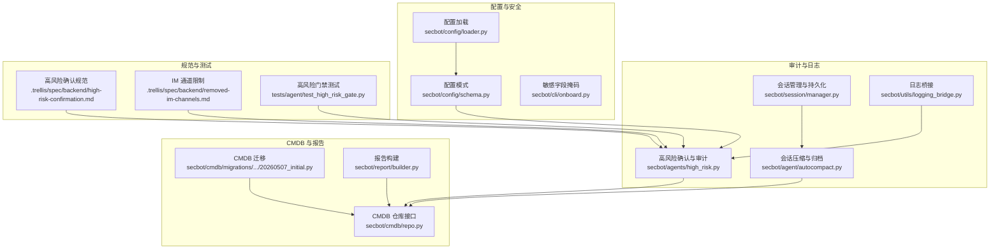
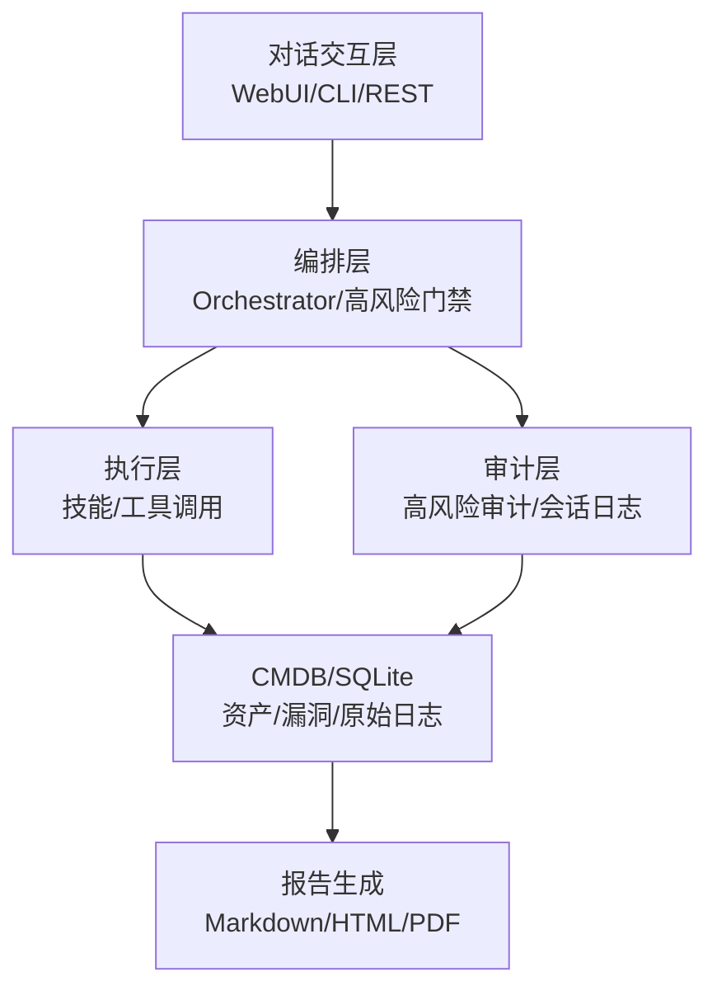
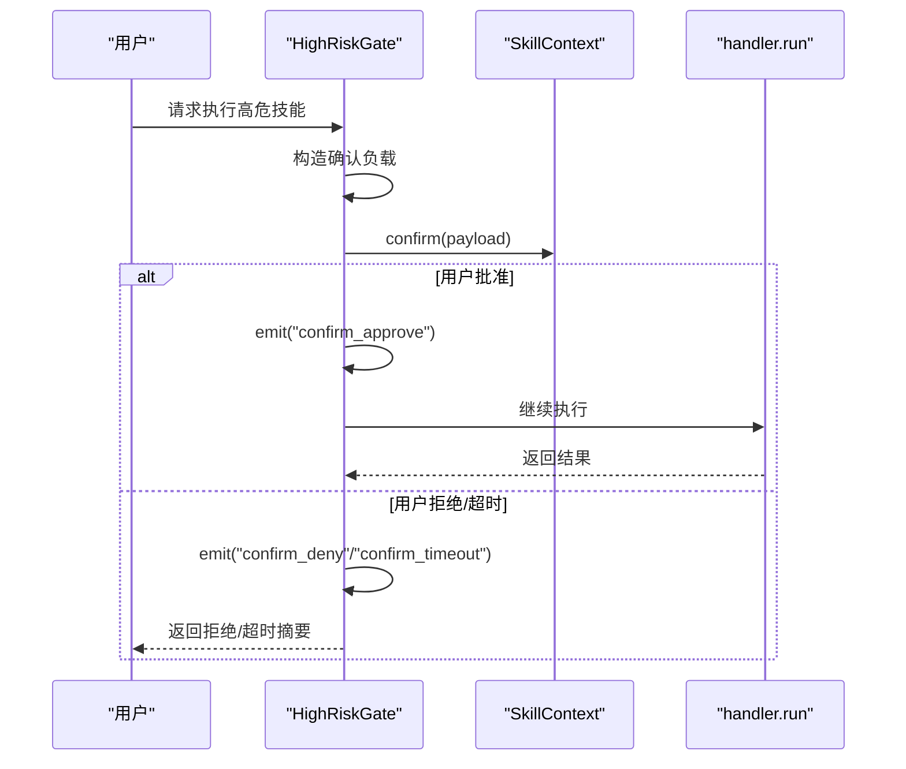
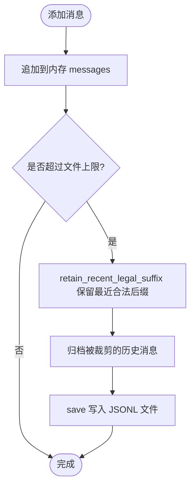
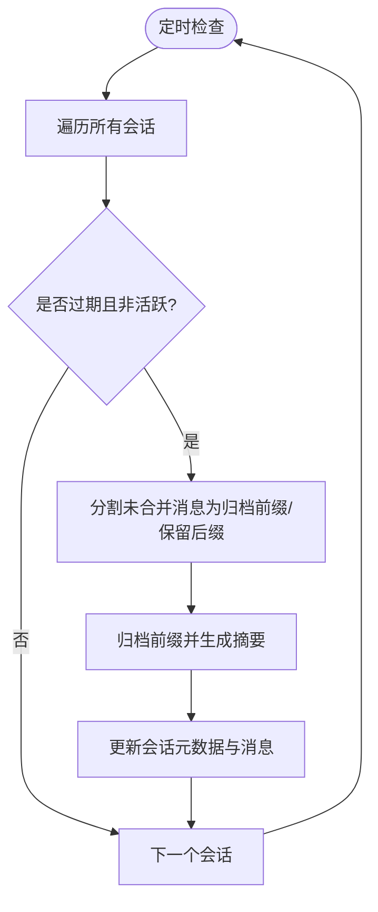
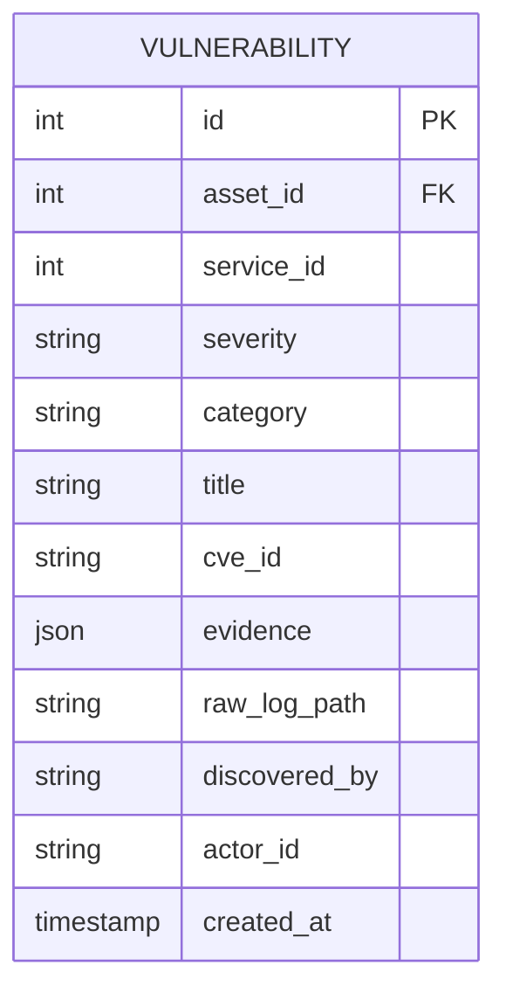
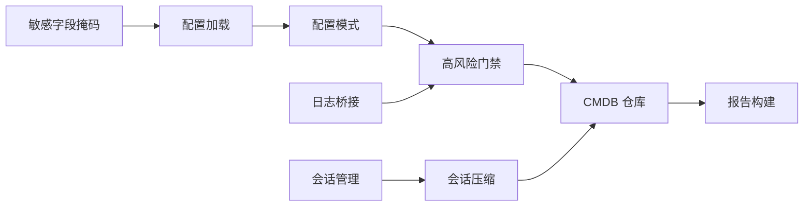

# 审计日志系统

<cite>
**本文引用的文件**
- [README.md](file://README.md)
- [high_risk.py](file://secbot/agents/high_risk.py)
- [manager.py](file://secbot/session/manager.py)
- [autocompact.py](file://secbot/agent/autocompact.py)
- [loader.py](file://secbot/config/loader.py)
- [schema.py](file://secbot/config/schema.py)
- [20260507_initial.py](file://secbot/cmdb/migrations/versions/20260507_initial.py)
- [repo.py](file://secbot/cmdb/repo.py)
- [builder.py](file://secbot/report/builder.py)
- [logging_bridge.py](file://secbot/utils/logging_bridge.py)
- [onboard.py](file://secbot/cli/onboard.py)
- [task_context.py](file://.trellis/scripts/common/task_context.py)
- [high-risk-confirmation.md](file://.trellis/spec/backend/high-risk-confirmation.md)
- [removed-im-channels.md](file://.trellis/spec/backend/removed-im-channels.md)
- [cybersec-ui-patterns.md](file://.trellis/tasks/archive/2026-05/05-07-cybersec-agent-platform/research/cybersec-ui-patterns.md)
- [test_high_risk_gate.py](file://tests/agent/test_high_risk_gate.py)
</cite>

## 目录
1. [简介](#简介)
2. [项目结构](#项目结构)
3. [核心组件](#核心组件)
4. [架构总览](#架构总览)
5. [详细组件分析](#详细组件分析)
6. [依赖分析](#依赖分析)
7. [性能考虑](#性能考虑)
8. [故障排查指南](#故障排查指南)
9. [结论](#结论)
10. [附录](#附录)

## 简介
本文件为审计日志系统的详细使用文档，聚焦于系统如何记录与追踪高风险操作、会话历史、以及与 CMDB 漏洞记录相关的审计线索。文档覆盖日志记录格式与结构、查询与过滤方法、导出能力、审计事件类型、分析与可视化方案、保留策略与存储优化、隐私保护与配置调优。

## 项目结构
围绕审计日志的关键模块与文件如下：
- 高风险确认与审计：secbot/agents/high_risk.py
- 会话与消息持久化：secbot/session/manager.py
- 会话压缩与归档：secbot/agent/autocompact.py
- 配置加载与敏感字段掩码：secbot/config/loader.py、secbot/config/schema.py、secbot/cli/onboard.py
- CMDB 漏洞与原始日志路径：secbot/cmdb/migrations/versions/20260507_initial.py、secbot/cmdb/repo.py
- 报告与证据摘要：secbot/report/builder.py
- 日志桥接与输出：secbot/utils/logging_bridge.py
- 任务上下文与 JSONL：.trellis/scripts/common/task_context.py
- 规范与约束：.trellis/spec/backend/high-risk-confirmation.md、.trellis/spec/backend/removed-im-channels.md
- UI 参考与可视化思路：.trellis/tasks/archive/2026-05/05-07-cybersec-agent-platform/research/cybersec-ui-patterns.md
- 测试与行为验证：tests/agent/test_high_risk_gate.py

图表来源
- [high_risk.py:30-139](file://secbot/agents/high_risk.py#L30-L139)
- [manager.py:26-576](file://secbot/session/manager.py#L26-L576)
- [autocompact.py:16-124](file://secbot/agent/autocompact.py#L16-L124)
- [loader.py:32-81](file://secbot/config/loader.py#L32-L81)
- [schema.py:267-376](file://secbot/config/schema.py#L267-L376)
- [20260507_initial.py:109-144](file://secbot/cmdb/migrations/versions/20260507_initial.py#L109-L144)
- [repo.py:351-369](file://secbot/cmdb/repo.py#L351-L369)
- [builder.py:108-146](file://secbot/report/builder.py#L108-L146)
- [logging_bridge.py](file://secbot/utils/logging_bridge.py)
- [high-risk-confirmation.md:64-77](file://.trellis/spec/backend/high-risk-confirmation.md#L64-L77)
- [removed-im-channels.md:136-160](file://.trellis/spec/backend/removed-im-channels.md#L136-L160)
- [test_high_risk_gate.py:100-140](file://tests/agent/test_high_risk_gate.py#L100-L140)

章节来源
- [README.md:19-28](file://README.md#L19-L28)
- [high_risk.py:1-139](file://secbot/agents/high_risk.py#L1-L139)
- [manager.py:1-576](file://secbot/session/manager.py#L1-L576)
- [autocompact.py:1-124](file://secbot/agent/autocompact.py#L1-L124)
- [loader.py:1-173](file://secbot/config/loader.py#L1-L173)
- [schema.py:1-376](file://secbot/config/schema.py#L1-L376)
- [20260507_initial.py:109-144](file://secbot/cmdb/migrations/versions/20260507_initial.py#L109-L144)
- [repo.py:351-369](file://secbot/cmdb/repo.py#L351-L369)
- [builder.py:1-64](file://secbot/report/builder.py#L1-L64)
- [logging_bridge.py](file://secbot/utils/logging_bridge.py)
- [onboard.py:210-248](file://secbot/cli/onboard.py#L210-L248)
- [task_context.py:46-90](file://.trellis/scripts/common/task_context.py#L46-L90)
- [high-risk-confirmation.md:32-77](file://.trellis/spec/backend/high-risk-confirmation.md#L32-L77)
- [removed-im-channels.md:136-160](file://.trellis/spec/backend/removed-im-channels.md#L136-L160)
- [cybersec-ui-patterns.md:1-49](file://.trellis/tasks/archive/2026-05/05-07-cybersec-agent-platform/research/cybersec-ui-patterns.md#L1-L49)
- [test_high_risk_gate.py:100-140](file://tests/agent/test_high_risk_gate.py#L100-L140)

## 核心组件
- 高风险确认与审计（AuditLogger/HighRiskGate）
  - 记录 confirm_request、confirm_approve、confirm_deny、confirm_timeout 四类事件，包含 scan_id、skill、action、payload、时间戳等字段。
  - 通过规范约束，确保高危动作必须经人工确认，且全链路留痕。
- 会话管理与持久化（Session/SessionManager）
  - 每条消息包含 role、content、timestamp 等字段；支持将会话历史保存为 JSONL 文件，便于离线分析与导出。
  - 提供保留最近合法后缀、强制文件上限、归档旧消息等机制，控制存储增长。
- 会话压缩与归档（AutoCompact）
  - 对闲置会话进行自动压缩，保留少量“最近消息”，其余历史通过归档摘要替代，降低存储与延迟成本。
- CMDB 漏洞与原始日志（CMDB 迁移与仓库）
  - 漏洞实体包含 severity、category、title、evidence、raw_log_path、discovered_by 等字段；支持按 actor、严重度、资产等条件查询。
- 报告与证据摘要（Report Builder）
  - 从 CMDB 读取漏洞与证据摘要，支持导出 Markdown/HTML/PDF 报告，其中 raw_log_path 可作为原始日志引用。
- 配置与敏感信息处理（Config Loader/Onboard）
  - 加载配置、解析环境变量、应用 SSRF 白名单；对敏感字段进行掩码显示，避免在日志中泄露。
- 日志桥接（Logging Bridge）
  - 将内部日志输出桥接到统一日志系统，便于集中采集与分析。

章节来源
- [high_risk.py:30-139](file://secbot/agents/high_risk.py#L30-L139)
- [manager.py:26-576](file://secbot/session/manager.py#L26-L576)
- [autocompact.py:16-124](file://secbot/agent/autocompact.py#L16-L124)
- [20260507_initial.py:109-144](file://secbot/cmdb/migrations/versions/20260507_initial.py#L109-L144)
- [repo.py:351-369](file://secbot/cmdb/repo.py#L351-L369)
- [builder.py:108-146](file://secbot/report/builder.py#L108-L146)
- [loader.py:32-81](file://secbot/config/loader.py#L32-L81)
- [schema.py:267-376](file://secbot/config/schema.py#L267-L376)
- [onboard.py:210-248](file://secbot/cli/onboard.py#L210-L248)
- [logging_bridge.py](file://secbot/utils/logging_bridge.py)

## 架构总览
审计日志贯穿“交互层→编排层→执行层→CMDB/审计层”的全链路，关键审计点包括：
- 高风险动作的人工确认与审计事件
- 会话历史的持久化与归档
- 漏洞扫描结果与原始日志路径
- 报告生成与证据摘要

图表来源
- [README.md:29-63](file://README.md#L29-L63)
- [high_risk.py:94-139](file://secbot/agents/high_risk.py#L94-L139)
- [manager.py:239-576](file://secbot/session/manager.py#L239-L576)
- [20260507_initial.py:109-144](file://secbot/cmdb/migrations/versions/20260507_initial.py#L109-L144)
- [builder.py:108-146](file://secbot/report/builder.py#L108-L146)

## 详细组件分析

### 高风险确认与审计（AuditLogger/HighRiskGate）
- 事件类型与字段
  - 类型：confirm_request、confirm_approve、confirm_deny、confirm_timeout
  - 字段：scan_id、skill、action、payload（结构化）、ts（时间戳）
- 触发条件
  - 当技能风险等级为 critical 时，触发确认流程；超时或拒绝均记录相应审计事件。
- 规范约束
  - 确认负载包含 type、skill、display_name、risk_level、summary_for_user、args、estimated_duration_sec、destructive_action、scan_id 等字段，确保可审计性与可解释性。

图表来源
- [high_risk.py:103-139](file://secbot/agents/high_risk.py#L103-L139)
- [high-risk-confirmation.md:32-77](file://.trellis/spec/backend/high-risk-confirmation.md#L32-L77)
- [test_high_risk_gate.py:100-140](file://tests/agent/test_high_risk_gate.py#L100-L140)

章节来源
- [high_risk.py:30-139](file://secbot/agents/high_risk.py#L30-L139)
- [high-risk-confirmation.md:32-77](file://.trellis/spec/backend/high-risk-confirmation.md#L32-L77)
- [test_high_risk_gate.py:100-140](file://tests/agent/test_high_risk_gate.py#L100-L140)

### 会话管理与持久化（Session/SessionManager）
- 消息结构
  - 每条消息包含 role、content、timestamp 等字段；支持附加工具调用、思考内容等上下文字段。
- 持久化格式
  - 使用 JSONL 文件存储，首行为 metadata（包含 key、created_at、updated_at、metadata、last_consolidated），后续每行一条消息。
- 存储控制
  - retain_recent_legal_suffix：保留最近合法后缀，避免截断中间工具结果。
  - enforce_file_cap：达到上限时归档旧消息并修剪，防止无限增长。
- 读写与恢复
  - 支持修复损坏文件、只读读取、目录遍历列出会话等能力。

图表来源
- [manager.py:63-237](file://secbot/session/manager.py#L63-L237)

章节来源
- [manager.py:26-576](file://secbot/session/manager.py#L26-L576)

### 会话压缩与归档（AutoCompact）
- 目标
  - 对闲置会话进行自动压缩，减少 token 成本与延迟。
- 流程
  - 检查过期：根据 session_ttl_minutes 判断是否过期。
  - 分割尾部：将未合并的消息分为可归档前缀与保留后缀。
  - 归档摘要：对可归档部分生成摘要并写回会话元数据。
  - 更新状态：清空已归档消息，更新时间戳与元数据。

图表来源
- [autocompact.py:61-107](file://secbot/agent/autocompact.py#L61-L107)

章节来源
- [autocompact.py:16-124](file://secbot/agent/autocompact.py#L16-L124)

### CMDB 漏洞与原始日志
- 数据模型
  - 漏洞实体包含 severity、category、title、cve_id、evidence、raw_log_path、discovered_by、actor_id、created_at 等字段。
  - 提供按 actor、资产、严重度等条件的查询接口。
- 原始日志路径
  - raw_log_path 用于指向原始扫描日志文件，便于审计回溯与取证。

图表来源
- [20260507_initial.py:109-144](file://secbot/cmdb/migrations/versions/20260507_initial.py#L109-L144)

章节来源
- [20260507_initial.py:109-144](file://secbot/cmdb/migrations/versions/20260507_initial.py#L109-L144)
- [repo.py:351-369](file://secbot/cmdb/repo.py#L351-L369)

### 报告与证据摘要
- 报告模型
  - 包含资产、服务、发现项等结构化数据；支持从 CMDB 读取漏洞与证据摘要。
- 原始日志引用
  - 若漏洞记录包含 raw_log_path，则可在报告中引用，便于审计与复核。

章节来源
- [builder.py:1-64](file://secbot/report/builder.py#L1-L64)
- [builder.py:108-146](file://secbot/report/builder.py#L108-L146)

### 配置与敏感信息处理
- 配置加载
  - 支持从默认路径加载配置，解析环境变量，应用 SSRF 白名单。
- 敏感字段掩码
  - 对包含敏感关键字的字段进行掩码显示，仅保留末尾若干字符，避免日志泄露。

章节来源
- [loader.py:32-81](file://secbot/config/loader.py#L32-L81)
- [schema.py:267-376](file://secbot/config/schema.py#L267-L376)
- [onboard.py:210-248](file://secbot/cli/onboard.py#L210-L248)

### 日志桥接与输出
- 日志桥接
  - 将内部日志输出桥接到统一日志系统，便于集中采集与分析。
- 输出建议
  - 结合会话 JSONL、高风险审计事件、CMDB 原始日志路径，形成完整的审计证据链。

章节来源
- [logging_bridge.py](file://secbot/utils/logging_bridge.py)

## 依赖分析
- 组件耦合
  - 高风险门禁依赖技能元数据与上下文确认；会话管理负责消息持久化；CMDB 提供漏洞与证据数据；报告模块消费 CMDB 数据。
- 外部依赖
  - 配置系统提供环境变量解析与安全策略（SSRF 白名单）；任务上下文脚本提供 JSONL 文件维护能力。

图表来源
- [high_risk.py:94-139](file://secbot/agents/high_risk.py#L94-L139)
- [manager.py:239-576](file://secbot/session/manager.py#L239-L576)
- [autocompact.py:61-107](file://secbot/agent/autocompact.py#L61-L107)
- [repo.py:351-369](file://secbot/cmdb/repo.py#L351-L369)
- [builder.py:108-146](file://secbot/report/builder.py#L108-L146)
- [loader.py:32-81](file://secbot/config/loader.py#L32-L81)
- [schema.py:267-376](file://secbot/config/schema.py#L267-L376)
- [onboard.py:210-248](file://secbot/cli/onboard.py#L210-L248)
- [logging_bridge.py](file://secbot/utils/logging_bridge.py)

章节来源
- [high_risk.py:1-139](file://secbot/agents/high_risk.py#L1-L139)
- [manager.py:1-576](file://secbot/session/manager.py#L1-L576)
- [autocompact.py:1-124](file://secbot/agent/autocompact.py#L1-L124)
- [repo.py:351-369](file://secbot/cmdb/repo.py#L351-L369)
- [builder.py:1-64](file://secbot/report/builder.py#L1-L64)
- [loader.py:1-173](file://secbot/config/loader.py#L1-L173)
- [schema.py:1-376](file://secbot/config/schema.py#L1-L376)
- [onboard.py:210-248](file://secbot/cli/onboard.py#L210-L248)
- [logging_bridge.py](file://secbot/utils/logging_bridge.py)

## 性能考虑
- 会话容量控制
  - 通过 retain_recent_legal_suffix 与 enforce_file_cap 控制消息数量与文件大小，避免无限增长。
- 自动压缩
  - AutoCompact 在闲置阈值后归档历史消息，减少内存与磁盘占用。
- 查询优化
  - CMDB 漏洞查询支持按 actor、资产、严重度过滤，并建立索引以提升查询效率。
- 日志输出
  - 使用日志桥接统一输出，结合 JSONL 文件便于流式处理与外部分析工具接入。

章节来源
- [manager.py:166-237](file://secbot/session/manager.py#L166-L237)
- [autocompact.py:61-107](file://secbot/agent/autocompact.py#L61-L107)
- [20260507_initial.py:139-144](file://secbot/cmdb/migrations/versions/20260507_initial.py#L139-L144)
- [repo.py:351-369](file://secbot/cmdb/repo.py#L351-L369)

## 故障排查指南
- 高风险确认超时
  - 现象：confirm_timeout 审计事件被记录，技能短路返回。
  - 排查：检查确认超时时间、用户响应速度、UI/CLI 通道可用性。
- 会话文件损坏
  - 现象：读取会话失败或部分丢失。
  - 排查：利用修复逻辑尝试恢复，必要时手动清理或重建。
- CMDB 查询异常
  - 现象：按严重度过滤时报错。
  - 排查：确认过滤参数是否在允许集合内，检查索引是否存在。
- 日志泄露风险
  - 现象：敏感字段在日志中可见。
  - 排查：启用敏感字段掩码，避免在日志中输出完整密钥或密码。

章节来源
- [test_high_risk_gate.py:100-140](file://tests/agent/test_high_risk_gate.py#L100-L140)
- [manager.py:338-391](file://secbot/session/manager.py#L338-L391)
- [repo.py:351-369](file://secbot/cmdb/repo.py#L351-L369)
- [onboard.py:210-248](file://secbot/cli/onboard.py#L210-L248)

## 结论
本审计日志系统通过“高风险确认审计 + 会话持久化与压缩 + CMDB 漏洞与原始日志 + 报告证据摘要”的组合，实现了从操作到结果的全链路可追溯。配合配置与安全策略、日志桥接与导出能力，能够满足合规与运营审计需求。

## 附录

### 审计日志记录格式与结构
- 高风险确认事件
  - 字段：scan_id、skill、action ∈ {confirm_request, confirm_approve, confirm_deny, confirm_timeout}、payload（结构化）、ts（时间戳）
- 会话消息
  - 字段：role、content、timestamp、附加工具调用/思考等上下文字段
  - 存储：JSONL 文件，首行 metadata，后续逐行消息
- CMDB 漏洞
  - 字段：severity、category、title、cve_id、evidence、raw_log_path、discovered_by、actor_id、created_at

章节来源
- [high_risk.py:40-62](file://secbot/agents/high_risk.py#L40-L62)
- [manager.py:63-126](file://secbot/session/manager.py#L63-L126)
- [20260507_initial.py:109-144](file://secbot/cmdb/migrations/versions/20260507_initial.py#L109-L144)

### 日志查询与过滤方法
- 关键词搜索
  - 在会话 JSONL 中按 content 字段进行全文检索；在 CMDB 中对 title/evidence/raw_log_path 进行 LIKE 查询。
- 时间范围筛选
  - 使用 created_at/updated_at 字段进行范围过滤；高风险事件使用 ts 字段。
- 操作类型分类
  - 高风险事件按 action 分类；CMDB 漏洞按 severity/category 分类；会话按 role（user/assistant/tool）分类。

章节来源
- [manager.py:314-330](file://secbot/session/manager.py#L314-L330)
- [repo.py:351-369](file://secbot/cmdb/repo.py#L351-L369)
- [high_risk.py:40-62](file://secbot/agents/high_risk.py#L40-L62)

### 日志导出功能
- CSV/JSON 导出
  - 将会话 JSONL 与高风险审计事件转换为 CSV/JSON；支持自定义字段选择（如仅导出时间戳、操作类型、结果状态）。
- 原始日志引用
  - 报告中引用 raw_log_path，便于导出原始扫描日志以便离线分析。

章节来源
- [builder.py:108-146](file://secbot/report/builder.py#L108-L146)
- [task_context.py:46-90](file://.trellis/scripts/common/task_context.py#L46-L90)

### 审计事件类型
- 登录事件
  - 通过会话管理中的消息时间戳与角色标注，可还原用户交互时间线。
- 操作记录
  - 高风险确认事件与技能执行摘要构成操作记录。
- 错误日志
  - 会话修复与 CMDB 查询异常可作为错误日志来源。
- 安全告警
  - 高危动作超时/拒绝、CMDB 中 critical/高危漏洞命中等可作为安全告警信号。

章节来源
- [high_risk.py:103-139](file://secbot/agents/high_risk.py#L103-L139)
- [manager.py:338-391](file://secbot/session/manager.py#L338-L391)
- [repo.py:351-369](file://secbot/cmdb/repo.py#L351-L369)

### 日志分析工具与可视化方案
- 工具建议
  - 使用日志收集器（如 Fluent Bit/Fluentd/OpenTelemetry）采集 JSONL 与审计事件；结合 ELK/ClickHouse/Lakehouse 进行聚合分析。
- 可视化思路
  - 参考行业产品 UI 模式：严重度色块映射、时间线展示、多维过滤器、报告导出（Word/HTML）。
- UI 参考
  - 攻击面管理平台的树形资产视图与严重度色块；漏洞管理平台的大表格与柱状/饼图。

章节来源
- [cybersec-ui-patterns.md:11-49](file://.trellis/tasks/archive/2026-05/05-07-cybersec-agent-platform/research/cybersec-ui-patterns.md#L11-L49)

### 日志保留策略、存储优化与隐私保护
- 保留策略
  - 会话文件上限与自动压缩策略；高风险审计事件与 CMDB 数据按业务周期保留。
- 存储优化
  - 会话裁剪与归档、CMDB 索引优化、日志桥接统一输出。
- 隐私保护
  - 敏感字段掩码；SSRF 白名单；最小权限原则；仅导出必要字段。

章节来源
- [autocompact.py:61-107](file://secbot/agent/autocompact.py#L61-L107)
- [manager.py:208-237](file://secbot/session/manager.py#L208-L237)
- [loader.py:59-64](file://secbot/config/loader.py#L59-L64)
- [onboard.py:210-248](file://secbot/cli/onboard.py#L210-L248)

### 配置选项与性能调优建议
- 配置项
  - 会话 TTL、最大消息数、合并比例、提供者与 API 基础地址、SSRF 白名单等。
- 调优建议
  - 合理设置 session_ttl_minutes 与 max_messages；开启 fsync 保障关闭时的数据落盘；在高并发场景下增加日志缓冲与批量写入。

章节来源
- [schema.py:95-112](file://secbot/config/schema.py#L95-L112)
- [schema.py:277-376](file://secbot/config/schema.py#L277-L376)
- [manager.py:403-449](file://secbot/session/manager.py#L403-L449)