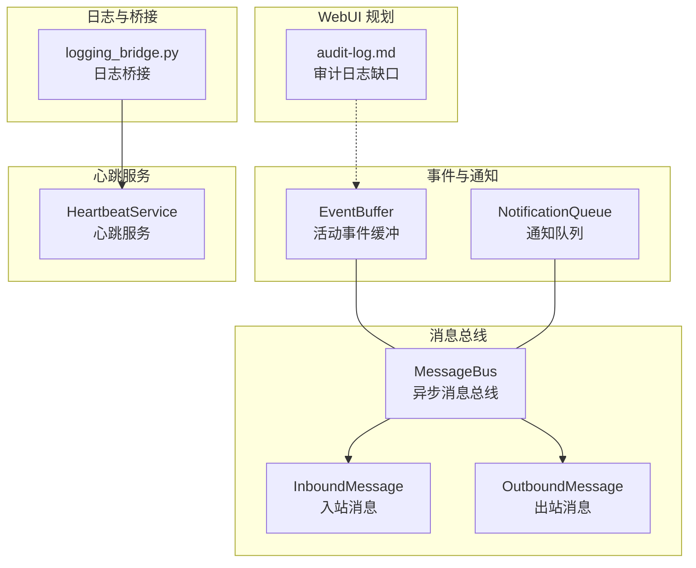
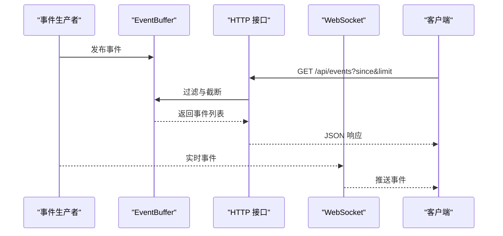
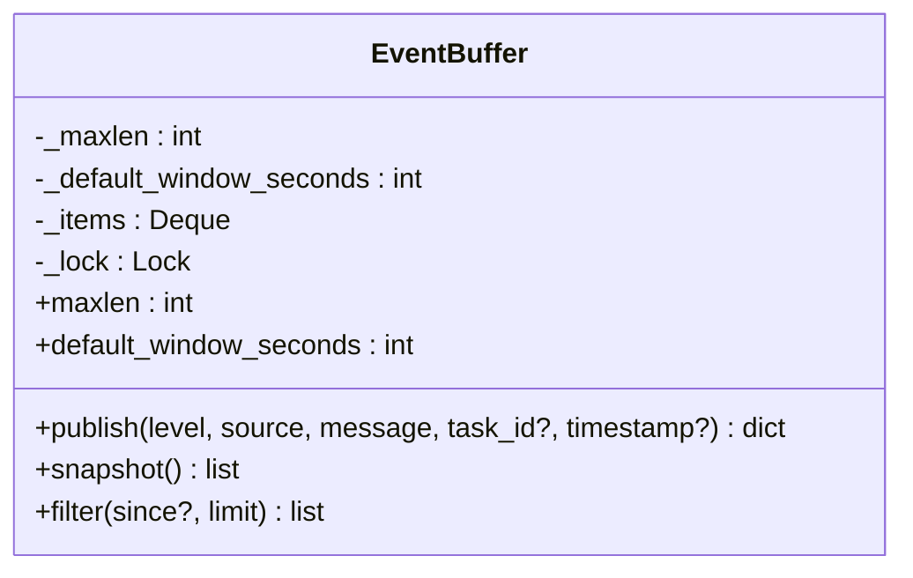
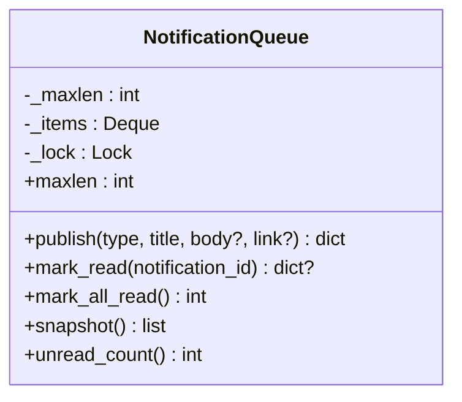
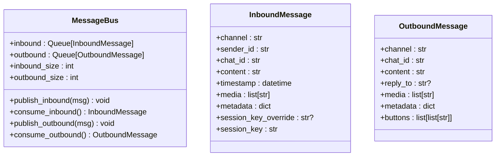
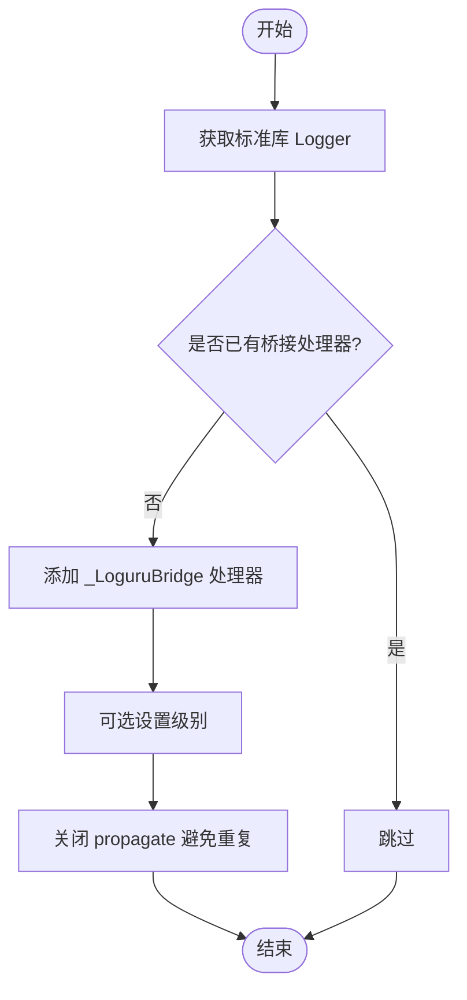
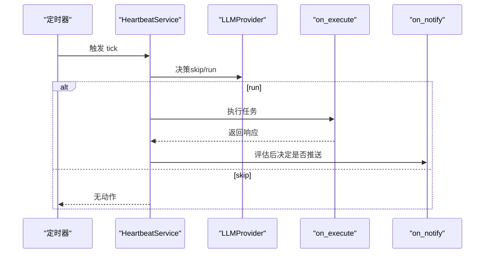
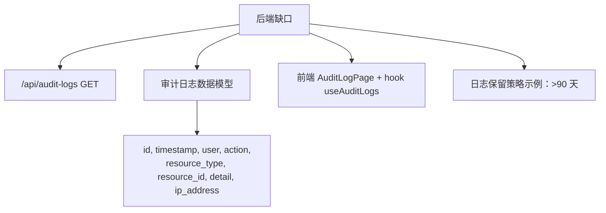
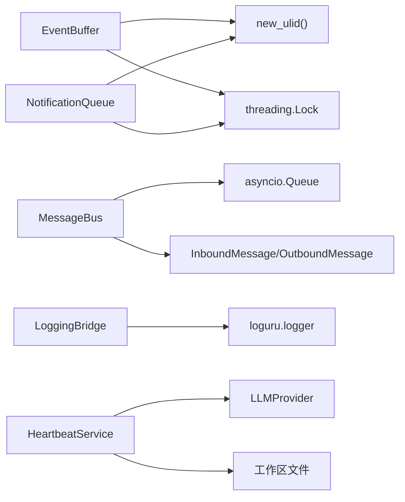

# 审计日志系统

<cite>
**本文引用的文件**
- [secbot/channels/notifications.py](file://secbot/channels/notifications.py)
- [tests/api/test_events.py](file://tests/api/test_events.py)
- [webui/src/gap/audit-log.md](file://webui/src/gap/audit-log.md)
- [secbot/bus/events.py](file://secbot/bus/events.py)
- [secbot/bus/queue.py](file://secbot/bus/queue.py)
- [secbot/utils/logging_bridge.py](file://secbot/utils/logging_bridge.py)
- [secbot/heartbeat/service.py](file://secbot/heartbeat/service.py)
- [.trellis/tasks/05-10-webui-p2-notification-activity/prd.md](file://.trellis/tasks/05-10-webui-p2-notification-activity/prd.md)
</cite>

## 目录
1. [简介](#简介)
2. [项目结构](#项目结构)
3. [核心组件](#核心组件)
4. [架构总览](#架构总览)
5. [组件详解](#组件详解)
6. [依赖关系分析](#依赖关系分析)
7. [性能考量](#性能考量)
8. [故障排查指南](#故障排查指南)
9. [结论](#结论)
10. [附录](#附录)

## 简介
本文件面向 VAPT3 的审计日志系统，系统性梳理其设计架构与实现原理，覆盖以下方面：
- 日志事件类型、记录格式与存储策略
- 事件生成与传播机制（事件捕获、消息队列、异步处理）
- 结构化数据设计（字段定义、数据类型、索引策略建议）
- 查询与检索能力（接口、过滤条件、排序机制）
- 配置与管理（日志级别、存储容量、清理策略）
- 安全与隐私（敏感信息脱敏、访问控制、加密存储）
- 在安全监控与合规审计中的应用

## 项目结构
围绕审计日志相关的关键模块如下：
- 通知与活动事件缓冲：用于在内存中缓存通知与活动事件，支持窗口过滤与限制返回数量
- 事件类型与消息总线：定义事件数据结构与通道间的消息传递
- 日志桥接：将标准库日志重定向至更强大的日志框架
- 心跳服务：周期性检查并触发任务，便于纳入审计范围
- WebUI 缺口：前端审计日志页面与后端接口规划

**图表来源**
- [secbot/channels/notifications.py:258-385](file://secbot/channels/notifications.py#L258-L385)
- [secbot/bus/queue.py:8-45](file://secbot/bus/queue.py#L8-L45)
- [secbot/bus/events.py:8-39](file://secbot/bus/events.py#L8-L39)
- [secbot/utils/logging_bridge.py:9-48](file://secbot/utils/logging_bridge.py#L9-L48)
- [secbot/heartbeat/service.py:40-237](file://secbot/heartbeat/service.py#L40-L237)
- [webui/src/gap/audit-log.md:1-29](file://webui/src/gap/audit-log.md#L1-L29)

**章节来源**
- [secbot/channels/notifications.py:1-385](file://secbot/channels/notifications.py#L1-L385)
- [secbot/bus/events.py:1-39](file://secbot/bus/events.py#L1-L39)
- [secbot/bus/queue.py:1-45](file://secbot/bus/queue.py#L1-L45)
- [secbot/utils/logging_bridge.py:1-48](file://secbot/utils/logging_bridge.py#L1-L48)
- [secbot/heartbeat/service.py:1-237](file://secbot/heartbeat/service.py#L1-L237)
- [webui/src/gap/audit-log.md:1-29](file://webui/src/gap/audit-log.md#L1-L29)

## 核心组件
- 活动事件缓冲 EventBuffer：内存环形缓冲，支持按时间窗口过滤与限制返回条数，适合仪表盘实时展示与短期审计
- 通知队列 NotificationQueue：内存 FIFO，支持标记已读、统计未读数，适合导航栏铃铛通知
- 消息总线 MessageBus：解耦聊天通道与代理核心，承载入站/出站消息
- 事件数据结构 InboundMessage/OutboundMessage：统一消息契约
- 日志桥接 logging_bridge：将标准库日志接入 loguru，便于集中化处理
- 心跳服务 HeartbeatService：周期性决策与执行，便于纳入审计范围
- WebUI 审计日志缺口：规划后端审计日志查询接口与前端页面

**章节来源**
- [secbot/channels/notifications.py:258-385](file://secbot/channels/notifications.py#L258-L385)
- [secbot/bus/queue.py:8-45](file://secbot/bus/queue.py#L8-L45)
- [secbot/bus/events.py:8-39](file://secbot/bus/events.py#L8-L39)
- [secbot/utils/logging_bridge.py:9-48](file://secbot/utils/logging_bridge.py#L9-L48)
- [secbot/heartbeat/service.py:40-237](file://secbot/heartbeat/service.py#L40-L237)
- [webui/src/gap/audit-log.md:1-29](file://webui/src/gap/audit-log.md#L1-L29)

## 架构总览
审计日志系统采用“事件生产—缓冲—查询/推送”的分层架构：
- 事件生产：各子系统（扫描、确认、心跳等）通过统一接口发布事件或通知
- 缓冲层：EventBuffer/NotificationQueue 提供内存环形缓冲，支持时间窗口与数量限制
- 查询与推送：HTTP 接口提供分页与过滤；WebSocket 支持实时推送
- 日志桥接：统一日志输出，便于集中化采集与分析

**图表来源**
- [secbot/channels/notifications.py:280-351](file://secbot/channels/notifications.py#L280-L351)
- [tests/api/test_events.py:236-371](file://tests/api/test_events.py#L236-L371)
- [.trellis/tasks/05-10-webui-p2-notification-activity/prd.md:147-156](file://.trellis/tasks/05-10-webui-p2-notification-activity/prd.md#L147-L156)

**章节来源**
- [secbot/channels/notifications.py:258-385](file://secbot/channels/notifications.py#L258-L385)
- [tests/api/test_events.py:1-371](file://tests/api/test_events.py#L1-L371)
- [.trellis/tasks/05-10-webui-p2-notification-activity/prd.md:147-156](file://.trellis/tasks/05-10-webui-p2-notification-activity/prd.md#L147-L156)

## 组件详解

### 活动事件缓冲 EventBuffer
- 设计要点
  - 内存环形缓冲，支持最大容量与默认窗口秒数配置
  - 发布时自动归一化时间到 UTC，保证比较一致性
  - 过滤按时间窗口 newest-first，支持 limit 截断
- 字段与类型
  - id: 字符串（ULID 前缀 evt-）
  - timestamp: ISO-8601 字符串（UTC 显式时区偏移）
  - level: 字符串（允许值集合）
  - source: 字符串（允许值集合）
  - task_id: 字符串（可选）
  - message: 字符串
- 过滤与限制
  - 默认窗口：5 分钟（可环境变量覆盖）
  - limit 默认 50，最大 500
  - since 缺省使用默认窗口，显式传入则按指定时间过滤
- 线程安全
  - 使用锁保护所有写/读路径，避免并发竞争

**图表来源**
- [secbot/channels/notifications.py:258-364](file://secbot/channels/notifications.py#L258-L364)

**章节来源**
- [secbot/channels/notifications.py:258-385](file://secbot/channels/notifications.py#L258-L385)
- [tests/api/test_events.py:71-210](file://tests/api/test_events.py#L71-L210)

### 通知队列 NotificationQueue
- 设计要点
  - 内存 FIFO，支持随机访问标记已读
  - 环形缓冲，溢出丢弃最旧项
  - 单例模式，支持测试重置
- 字段与类型
  - id: 字符串（ULID 前缀 n-）
  - type: 字符串（允许值集合）
  - title/body/link: 字符串
  - read: 布尔
  - created_at: ISO-8601 字符串（UTC）
- 线程安全
  - 写/读均加锁，保证并发安全

**图表来源**
- [secbot/channels/notifications.py:127-225](file://secbot/channels/notifications.py#L127-L225)

**章节来源**
- [secbot/channels/notifications.py:1-253](file://secbot/channels/notifications.py#L1-L253)

### 消息总线与事件数据结构
- MessageBus
  - 入站/出站异步队列，支持阻塞消费与队列长度查询
- InboundMessage/OutboundMessage
  - 统一消息契约，包含渠道、会话键、内容、媒体、元数据等

**图表来源**
- [secbot/bus/queue.py:8-45](file://secbot/bus/queue.py#L8-L45)
- [secbot/bus/events.py:8-39](file://secbot/bus/events.py#L8-L39)

**章节来源**
- [secbot/bus/queue.py:1-45](file://secbot/bus/queue.py#L1-L45)
- [secbot/bus/events.py:1-39](file://secbot/bus/events.py#L1-L39)

### 日志桥接与集中化
- 将标准库 logging 重定向至 loguru，统一格式与层级
- 可按库名添加桥接处理器，避免重复输出

**图表来源**
- [secbot/utils/logging_bridge.py:34-48](file://secbot/utils/logging_bridge.py#L34-L48)

**章节来源**
- [secbot/utils/logging_bridge.py:1-48](file://secbot/utils/logging_bridge.py#L1-L48)

### 心跳服务与审计范围
- 周期性读取工作区文件并决策是否执行任务
- 可选回调用于执行与通知，便于纳入审计范围

**图表来源**
- [secbot/heartbeat/service.py:184-237](file://secbot/heartbeat/service.py#L184-L237)

**章节来源**
- [secbot/heartbeat/service.py:1-237](file://secbot/heartbeat/service.py#L1-L237)

### WebUI 审计日志缺口
- 后端缺口：计划提供 /api/audit-logs GET 接口，支持分页与多维过滤
- 数据模型：包含 id、timestamp、user、action、resource_type、resource_id、detail、ip_address
- 前端预期：表格布局、筛选栏、分页、角色门限（仅管理员）

**图表来源**
- [webui/src/gap/audit-log.md:1-29](file://webui/src/gap/audit-log.md#L1-L29)

**章节来源**
- [webui/src/gap/audit-log.md:1-29](file://webui/src/gap/audit-log.md#L1-L29)

## 依赖关系分析
- EventBuffer 依赖 ULID 生成器（来自 CMDB 模块）与线程锁
- NotificationQueue 依赖 ULID 生成器与线程锁
- MessageBus 依赖 asyncio 队列与事件数据结构
- logging_bridge 依赖 loguru 与标准库 logging
- 心跳服务依赖 LLM 提供商与工作区文件

**图表来源**
- [secbot/channels/notifications.py:30-385](file://secbot/channels/notifications.py#L30-L385)
- [secbot/bus/queue.py:3-45](file://secbot/bus/queue.py#L3-L45)
- [secbot/bus/events.py:3-39](file://secbot/bus/events.py#L3-L39)
- [secbot/utils/logging_bridge.py:4-48](file://secbot/utils/logging_bridge.py#L4-L48)
- [secbot/heartbeat/service.py:11-13](file://secbot/heartbeat/service.py#L11-L13)

**章节来源**
- [secbot/channels/notifications.py:1-385](file://secbot/channels/notifications.py#L1-L385)
- [secbot/bus/queue.py:1-45](file://secbot/bus/queue.py#L1-L45)
- [secbot/bus/events.py:1-39](file://secbot/bus/events.py#L1-L39)
- [secbot/utils/logging_bridge.py:1-48](file://secbot/utils/logging_bridge.py#L1-L48)
- [secbot/heartbeat/service.py:1-237](file://secbot/heartbeat/service.py#L1-L237)

## 性能考量
- 内存环形缓冲
  - EventBuffer/NotificationQueue 均采用双端队列，插入/删除为 O(1)，适合高吞吐场景
  - 溢出策略为“丢弃最旧”，避免内存膨胀
- 时间窗口与限制
  - 默认窗口 5 分钟，limit 最大 500，兼顾实时性与响应大小
- 线程安全
  - 关键区仅涉及队列操作，锁粒度小，竞争低
- 异步消息总线
  - 入站/出站队列基于 asyncio，适合高并发 I/O 场景

[本节为通用性能讨论，不直接分析具体文件]

## 故障排查指南
- 事件未显示
  - 检查默认窗口是否过短（默认 5 分钟），可通过 since 参数调整
  - 确认 limit 是否被截断（默认 50，最大 500）
- 环境变量无效
  - SECBOT_EVENTS_BUFFER_SIZE/SECBOT_EVENTS_WINDOW_SECONDS 无效或非正数时会回退到默认值
- 通知类型未知
  - unknown_type/unknown_level/source 会被记录但不会拒绝，便于向前兼容
- 日志未集中化
  - 确认是否已调用日志桥接函数，避免重复输出与格式不一致

**章节来源**
- [secbot/channels/notifications.py:63-120](file://secbot/channels/notifications.py#L63-L120)
- [tests/api/test_events.py:103-123](file://tests/api/test_events.py#L103-L123)

## 结论
VAPT3 的审计日志系统以内存环形缓冲为核心，结合统一事件数据结构与异步消息总线，实现了高吞吐、低延迟的事件收集与查询能力。通过时间窗口与数量限制，既满足仪表盘实时展示，又避免资源占用。配合日志桥接与心跳服务，可进一步完善审计覆盖面。WebUI 审计日志缺口明确了后续后端接口与前端页面的建设方向。

[本节为总结性内容，不直接分析具体文件]

## 附录

### 查询与检索接口（HTTP）
- 端点：GET /api/events
- 查询参数
  - since: ISO-8601 时间戳（UTC），缺省使用默认窗口
  - limit: 数量限制，默认 50，最大 500
- 返回字段
  - id、timestamp、level、source、task_id、message
- 错误码
  - 400：since/limit 参数非法
  - 401：未认证

**章节来源**
- [tests/api/test_events.py:236-371](file://tests/api/test_events.py#L236-L371)

### 配置与管理
- 环境变量
  - SECBOT_EVENTS_BUFFER_SIZE：事件缓冲容量
  - SECBOT_EVENTS_WINDOW_SECONDS：默认时间窗口（秒）
- 存储策略
  - 当前为内存环形缓冲，进程重启清空
  - 建议：结合 WebUI 审计日志缺口，引入持久化存储与定期清理
- 清理策略（建议）
  - 示例：超过 90 天的日志自动清理

**章节来源**
- [secbot/channels/notifications.py:63-120](file://secbot/channels/notifications.py#L63-L120)
- [webui/src/gap/audit-log.md:24-29](file://webui/src/gap/audit-log.md#L24-L29)

### 安全与隐私
- 敏感信息脱敏
  - 对事件 message 字段进行脱敏处理（建议）
- 访问控制
  - /api/events 需要认证令牌
  - 审计日志查询接口建议仅管理员可访问
- 加密存储
  - 建议将审计日志落库时采用传输与静态加密（建议）

**章节来源**
- [tests/api/test_events.py:236-240](file://tests/api/test_events.py#L236-L240)
- [webui/src/gap/audit-log.md:17-18](file://webui/src/gap/audit-log.md#L17-L18)