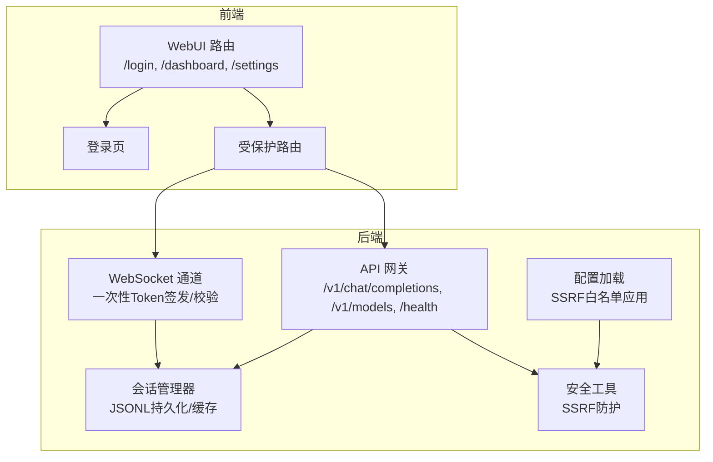
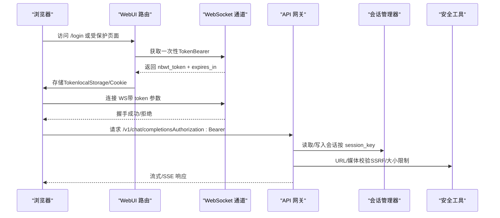
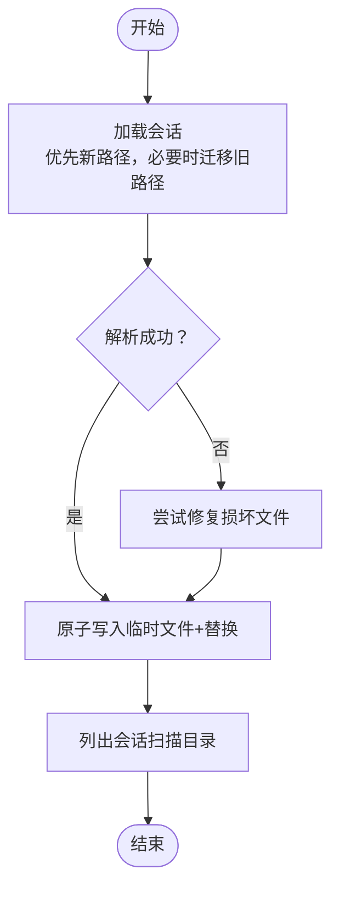
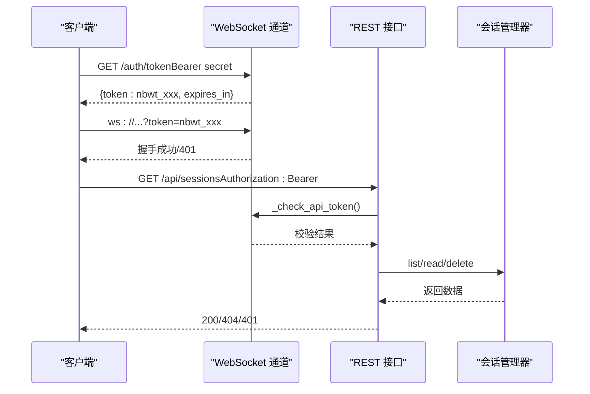
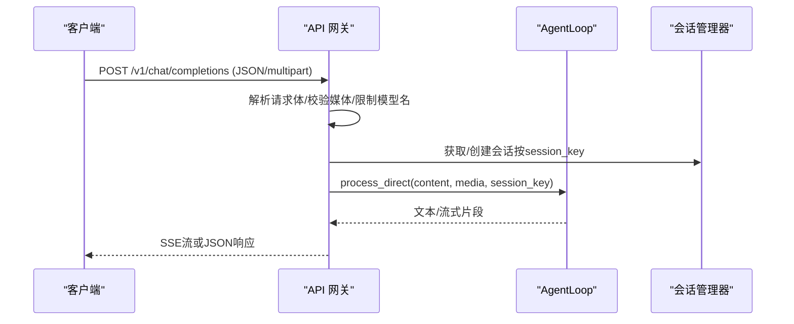
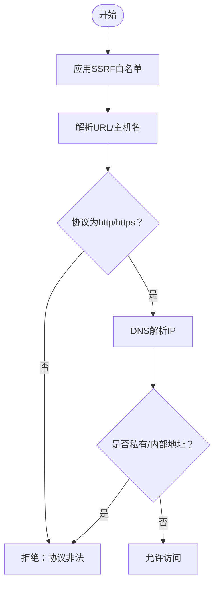
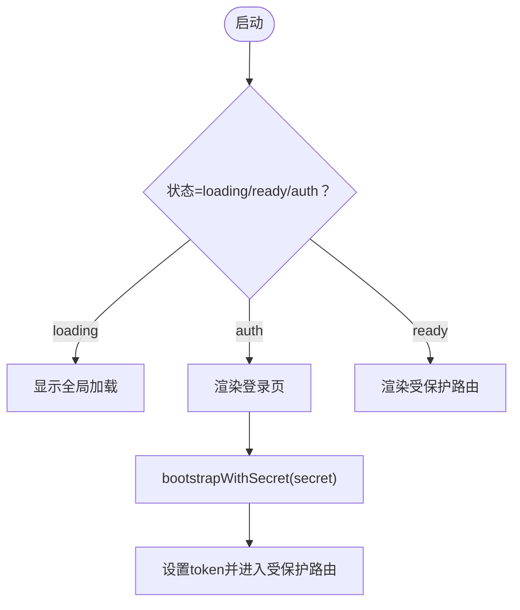
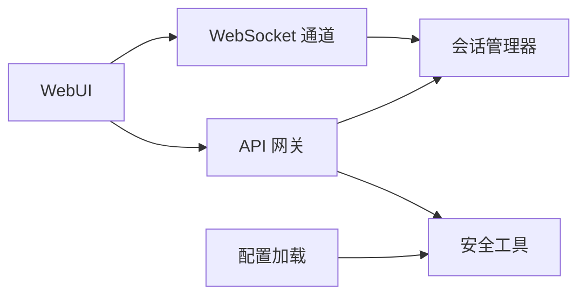

# 权限控制系统

<cite>
**本文档引用的文件**
- [secbot/session/manager.py](file://secbot/session/manager.py)
- [secbot/api/server.py](file://secbot/api/server.py)
- [secbot/channels/websocket.py](file://secbot/channels/websocket.py)
- [secbot/security/network.py](file://secbot/security/network.py)
- [secbot/config/loader.py](file://secbot/config/loader.py)
- [secbot/utils/helpers.py](file://secbot/utils/helpers.py)
- [tests/channels/test_websocket_http_routes.py](file://tests/channels/test_websocket_http_routes.py)
- [tests/channels/test_websocket_channel.py](file://tests/channels/test_websocket_channel.py)
- [webui/src/pages/LoginPage.tsx](file://webui/src/pages/LoginPage.tsx)
- [webui/src/App.tsx](file://webui/src/App.tsx)
</cite>

## 目录
1. [简介](#简介)
2. [项目结构](#项目结构)
3. [核心组件](#核心组件)
4. [架构总览](#架构总览)
5. [详细组件分析](#详细组件分析)
6. [依赖关系分析](#依赖关系分析)
7. [性能考虑](#性能考虑)
8. [故障排除指南](#故障排除指南)
9. [结论](#结论)
10. [附录](#附录)

## 简介
本文件面向VAPT3的权限控制系统，系统性梳理并解释其认证与授权机制、会话管理、API访问控制、安全加固与与其他安全组件的集成方式。文档以代码为依据，结合测试用例与前端路由，帮助读者从架构到实现细节全面理解权限体系。

## 项目结构
围绕权限控制的关键模块与文件如下：
- 会话管理：基于JSONL文件的会话持久化与缓存，支持历史截断、归档与原子写入
- WebSocket通道：提供一次性Token签发、多租户会话隔离、客户端白名单与容量限制
- API网关：OpenAI兼容接口，支持流式与非流式响应，请求解析与超时控制
- 安全工具：SSRF防护与内部地址检测，配置驱动的CIDR白名单
- 配置加载：将配置中的SSRF白名单应用到安全模块
- 前端路由：登录页、受保护路由与令牌持有策略（localStorage或Cookie）

**图表来源**
- [secbot/channels/websocket.py:119-195](file://secbot/channels/websocket.py#L119-L195)
- [secbot/api/server.py:381-401](file://secbot/api/server.py#L381-L401)
- [secbot/session/manager.py:239-659](file://secbot/session/manager.py#L239-L659)
- [secbot/security/network.py:29-37](file://secbot/security/network.py#L29-L37)
- [secbot/config/loader.py:59-64](file://secbot/config/loader.py#L59-L64)

**章节来源**
- [secbot/session/manager.py:1-659](file://secbot/session/manager.py#L1-L659)
- [secbot/api/server.py:1-401](file://secbot/api/server.py#L1-L401)
- [secbot/channels/websocket.py:1-2376](file://secbot/channels/websocket.py#L1-L2376)
- [secbot/security/network.py:1-120](file://secbot/security/network.py#L1-L120)
- [secbot/config/loader.py:1-173](file://secbot/config/loader.py#L1-L173)

## 核心组件
- 会话管理器（SessionManager）
  - 负责会话的创建、加载、保存、删除与列表展示；支持原子写入与目录fsync；提供历史截断与归档能力
  - 关键方法：get_or_create、save、delete_session、list_sessions、read_session_file
- WebSocket通道（WebSocketChannel）
  - 提供一次性Token签发（nbwt_前缀）、TTL过期清理、多租户会话隔离（websocket:前缀）、客户端ID白名单
  - 关键方法：_check_api_token、_handle_sessions_list、_handle_session_messages
- API网关（OpenAI兼容）
  - 支持JSON与multipart/form-data两种请求体；流式SSE响应；请求超时与锁粒度控制
  - 关键方法：handle_chat_completions、handle_models、create_app
- 安全工具（SSRF防护）
  - 通过CIDR白名单与私有地址检测，阻止对内网目标的访问
  - 关键函数：configure_ssrf_whitelist、validate_url_target、validate_resolved_url
- 配置加载（SSRF白名单应用）
  - 将配置中的tools.ssrf_whitelist应用到安全模块
  - 关键函数：_apply_ssrf_whitelist

**章节来源**
- [secbot/session/manager.py:239-659](file://secbot/session/manager.py#L239-L659)
- [secbot/channels/websocket.py:798-816](file://secbot/channels/websocket.py#L798-L816)
- [secbot/api/server.py:194-351](file://secbot/api/server.py#L194-L351)
- [secbot/security/network.py:29-120](file://secbot/security/network.py#L29-L120)
- [secbot/config/loader.py:59-64](file://secbot/config/loader.py#L59-L64)

## 架构总览
下图展示了权限控制在系统中的交互关系：前端通过受保护路由访问WS与API；WS负责一次性Token签发与校验；API依赖AgentLoop进行消息处理；会话管理器负责会话持久化；安全模块负责SSRF防护；配置加载负责将SSRF白名单注入安全模块。

**图表来源**
- [secbot/channels/websocket.py:840-854](file://secbot/channels/websocket.py#L840-L854)
- [secbot/api/server.py:194-351](file://secbot/api/server.py#L194-L351)
- [secbot/session/manager.py:265-451](file://secbot/session/manager.py#L265-L451)
- [secbot/security/network.py:45-120](file://secbot/security/network.py#L45-L120)

## 详细组件分析

### 会话管理系统
- 设计要点
  - 会话以JSONL格式存储，首行存放元数据（含created_at、updated_at、metadata、last_consolidated），后续行为消息行
  - 提供原子写入（临时文件+替换）与目录fsync，确保崩溃不丢数据
  - 支持历史截断与归档，避免无限增长；提供“合法消息边界”保证工具调用链完整性
  - 缓存策略：内存缓存+磁盘迁移（兼容旧路径），修复损坏文件后恢复
- 关键流程
  - 读取：优先新路径，不存在则尝试迁移旧路径；解析失败时尝试修复
  - 写入：先写临时文件，再原子替换；可选fsync目录
  - 列表：扫描sessions目录，提取元数据与首条用户消息预览
- 复杂度与性能
  - 读取/写入为O(n)（n为消息数），截断与归档在阈值触发时执行
  - fsync开关用于高可靠场景（如远程挂载）

**图表来源**
- [secbot/session/manager.py:285-451](file://secbot/session/manager.py#L285-L451)

**章节来源**
- [secbot/session/manager.py:239-659](file://secbot/session/manager.py#L239-L659)

### WebSocket通道与一次性Token
- 设计要点
  - 一次性Token（nbwt_前缀）签发：携带过期时间，同时注册到两个池（_issued_tokens与_api_tokens），握手与REST均可用
  - Token校验：支持Authorization头或查询参数token；过期自动清理
  - 会话隔离：只允许websocket:前缀的会话被WebUI读取，避免泄露CLI/Slack等会话
  - 白名单与容量限制：allowFrom限制client_id；issued token池容量上限防止滥用
- 关键流程
  - 签发：校验secret后生成token并登记过期时间
  - 校验：清理过期项，匹配token有效性
  - 路由：/api/sessions与/messages仅对Bearer有效且限定websocket:前缀

**图表来源**
- [secbot/channels/websocket.py:840-854](file://secbot/channels/websocket.py#L840-L854)
- [secbot/channels/websocket.py:798-816](file://secbot/channels/websocket.py#L798-L816)
- [secbot/channels/websocket.py:856-870](file://secbot/channels/websocket.py#L856-L870)
- [secbot/channels/websocket.py:1689-1710](file://secbot/channels/websocket.py#L1689-L1710)

**章节来源**
- [secbot/channels/websocket.py:798-816](file://secbot/channels/websocket.py#L798-L816)
- [secbot/channels/websocket.py:840-854](file://secbot/channels/websocket.py#L840-L854)
- [secbot/channels/websocket.py:856-870](file://secbot/channels/websocket.py#L856-L870)
- [secbot/channels/websocket.py:1689-1710](file://secbot/channels/websocket.py#L1689-L1710)
- [tests/channels/test_websocket_http_routes.py:98-132](file://tests/channels/test_websocket_http_routes.py#L98-L132)
- [tests/channels/test_websocket_channel.py:858-899](file://tests/channels/test_websocket_channel.py#L858-L899)

### API访问控制与请求处理
- 设计要点
  - OpenAI兼容接口：/v1/chat/completions与/v1/models；支持JSON与multipart/form-data
  - 会话键：默认api:default，可通过session_id覆盖；每个会话键独立锁，避免并发冲突
  - 超时与重试：请求超时返回504；空响应自动重试一次
  - 媒体与URL：仅支持base64 data URL或multipart上传；禁止远程图片URL
- 关键流程
  - 解析：根据Content-Type选择解析路径；校验单条用户消息
  - 执行：在会话锁内调用agent_loop.process_direct；流式SSE或直接JSON
  - 错误：参数错误、文件过大、超时、服务异常分别返回不同状态码

**图表来源**
- [secbot/api/server.py:194-351](file://secbot/api/server.py#L194-L351)
- [secbot/api/server.py:381-401](file://secbot/api/server.py#L381-L401)

**章节来源**
- [secbot/api/server.py:194-351](file://secbot/api/server.py#L194-L351)
- [secbot/api/server.py:381-401](file://secbot/api/server.py#L381-L401)

### SSRF防护与URL校验
- 设计要点
  - 默认阻断私有/环回/链路本地等网络段；支持通过tools.ssrf_whitelist配置白名单CIDR
  - 两阶段校验：DNS解析阶段（validate_url_target）与重定向阶段（validate_resolved_url）
  - 命令中URL检测：contains_internal_url用于命令字符串中的URL识别
- 关键流程
  - 配置应用：load_config时调用_apply_ssrf_whitelist
  - 请求校验：在下载/抓取前调用validate_url_target/validate_resolved_url

**图表来源**
- [secbot/security/network.py:45-120](file://secbot/security/network.py#L45-L120)
- [secbot/config/loader.py:59-64](file://secbot/config/loader.py#L59-L64)

**章节来源**
- [secbot/security/network.py:1-120](file://secbot/security/network.py#L1-L120)
- [secbot/config/loader.py:59-64](file://secbot/config/loader.py#L59-L64)

### 前端登录与受保护路由
- 设计要点
  - 登录页：/login，支持从?next=解析重定向目标（相对路径保护）
  - 受保护路由：仅在已认证状态下渲染；认证状态来自后端bootstrap
  - 令牌持有：建议使用httpOnly Cookie或localStorage持有Bearer Token
- 关键流程
  - 加载：App根据状态切换登录页或受保护页面
  - 登录：提交secret换取Token，随后进入受保护路由

**图表来源**
- [webui/src/App.tsx:174-232](file://webui/src/App.tsx#L174-L232)
- [webui/src/pages/LoginPage.tsx:26-36](file://webui/src/pages/LoginPage.tsx#L26-L36)

**章节来源**
- [webui/src/App.tsx:174-232](file://webui/src/App.tsx#L174-L232)
- [webui/src/pages/LoginPage.tsx:1-36](file://webui/src/pages/LoginPage.tsx#L1-L36)

## 依赖关系分析
- 组件耦合
  - WebSocket通道依赖会话管理器进行会话读写；API网关同样依赖会话管理器
  - 安全模块通过配置加载应用SSRF白名单，API层在处理媒体与外部请求时调用安全工具
- 外部依赖
  - websockets、aiohttp、loguru、pydantic、tiktoken等
- 潜在循环依赖
  - 当前模块间为单向依赖，未见循环导入迹象

**图表来源**
- [secbot/channels/websocket.py:1-2376](file://secbot/channels/websocket.py#L1-L2376)
- [secbot/api/server.py:1-401](file://secbot/api/server.py#L1-L401)
- [secbot/session/manager.py:1-659](file://secbot/session/manager.py#L1-L659)
- [secbot/security/network.py:1-120](file://secbot/security/network.py#L1-L120)
- [secbot/config/loader.py:1-173](file://secbot/config/loader.py#L1-L173)

**章节来源**
- [secbot/channels/websocket.py:1-2376](file://secbot/channels/websocket.py#L1-L2376)
- [secbot/api/server.py:1-401](file://secbot/api/server.py#L1-L401)
- [secbot/session/manager.py:1-659](file://secbot/session/manager.py#L1-L659)
- [secbot/security/network.py:1-120](file://secbot/security/network.py#L1-L120)
- [secbot/config/loader.py:1-173](file://secbot/config/loader.py#L1-L173)

## 性能考虑
- 会话持久化
  - 原子写入与fsync提升可靠性，但在高吞吐场景下可能影响I/O；建议在优雅停机时启用fsync
  - 历史截断与归档降低文件体积，避免读放大
- 并发控制
  - API层按session_key加锁，避免并发写入；锁粒度适中，减少争用
- SSRF防护
  - DNS解析与地址判定为O(n)（n为解析记录），建议在高频场景下缓存解析结果
- 前端路由
  - 受保护路由仅在认证后渲染，避免不必要的资源消耗

[本节为通用指导，无需特定文件来源]

## 故障排除指南
- 401 未授权（Bearer）
  - 确认Authorization头或查询参数token存在且未过期；WebSocket通道会清理过期token
  - 参考测试用例：未认证访问/api/sessions返回401
- 403 拒绝（allowFrom）
  - client_id不在allowFrom白名单；调整配置或更换client_id
- 429 令牌签发受限
  - issued token池达到容量上限；等待过期或增加容量
- 413 文件过大
  - multipart上传超过MAX_FILE_SIZE；改用base64 data URL或分块上传
- 504 超时
  - 请求超过request_timeout；适当增大超时或优化Agent处理逻辑
- 会话读取失败
  - JSONL损坏时尝试修复；若修复失败，检查文件权限与磁盘空间

**章节来源**
- [tests/channels/test_websocket_http_routes.py:98-132](file://tests/channels/test_websocket_http_routes.py#L98-L132)
- [tests/channels/test_websocket_channel.py:858-899](file://tests/channels/test_websocket_channel.py#L858-L899)
- [secbot/api/server.py:217-223](file://secbot/api/server.py#L217-L223)
- [secbot/api/server.py:341-348](file://secbot/api/server.py#L341-L348)
- [secbot/session/manager.py:338-391](file://secbot/session/manager.py#L338-L391)

## 结论
VAPT3的权限控制以“一次性Token + 会话隔离 + SSRF防护 + 配置驱动”为核心设计，既满足多租户场景下的会话隔离，又通过白名单与地址检测强化对外部请求的安全性。前端采用受保护路由与Bearer Token持有策略，形成完整的认证与授权闭环。建议在生产环境中启用httpOnly Cookie、缩短Token TTL、严格限制allowFrom白名单，并定期审查SSRF白名单配置。

[本节为总结，无需特定文件来源]

## 附录

### 最佳实践清单
- 用户与会话
  - 使用websocket:前缀的会话键，避免跨渠道会话泄露
  - 合理设置request_timeout与会话文件上限，防止资源耗尽
- 权限与授权
  - 严格限制allowFrom白名单；对公网开放时必须设置token或token_issue_secret
  - 一次性Token TTL建议不超过10分钟，降低泄露风险
- 安全加固
  - 启用SSRF白名单，仅放行可信CIDR；定期审计白名单变更
  - 对外请求前调用validate_url_target/validate_resolved_url
- 审计与运维
  - 记录401/403/429事件；监控会话文件数量与大小
  - 在优雅停机时启用fsync，确保数据落盘

[本节为通用指导，无需特定文件来源]