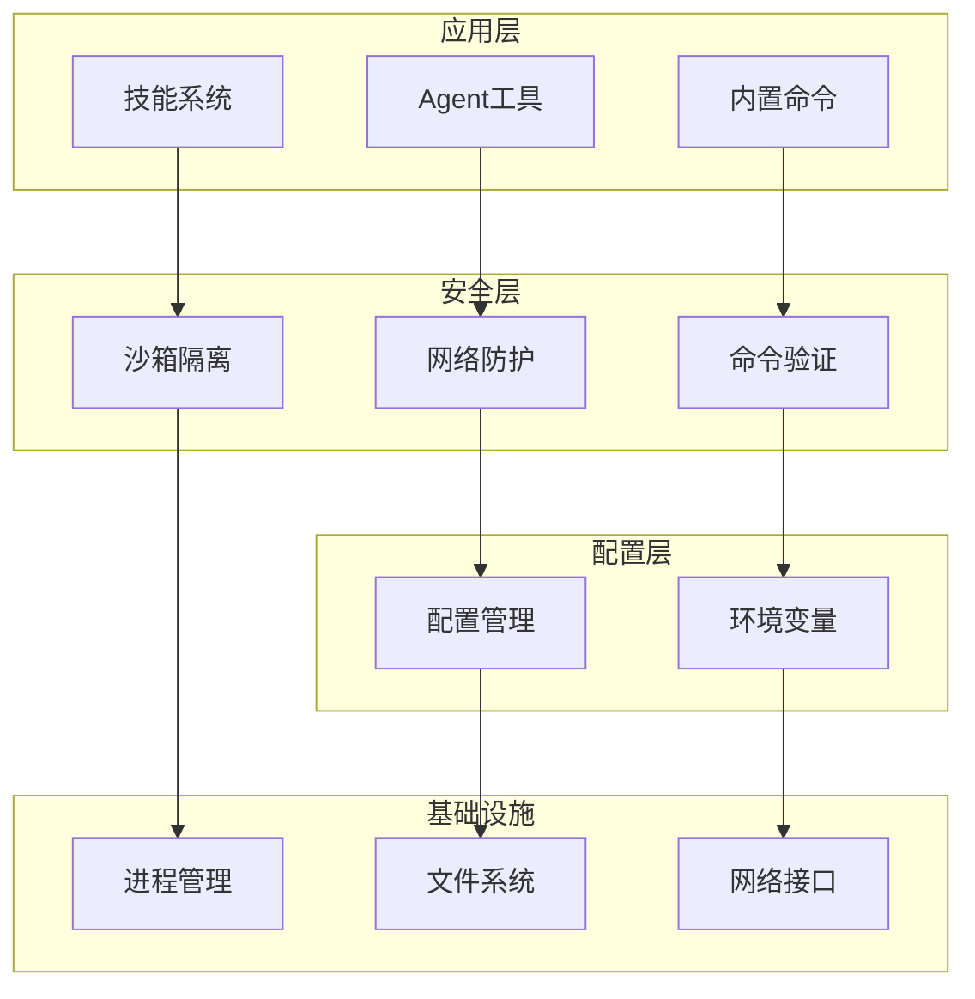
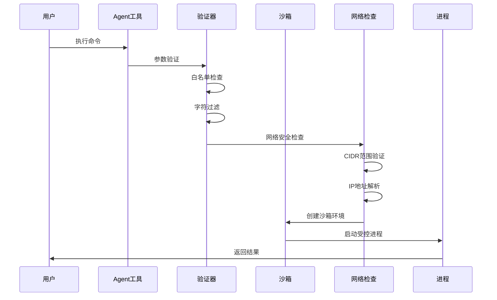
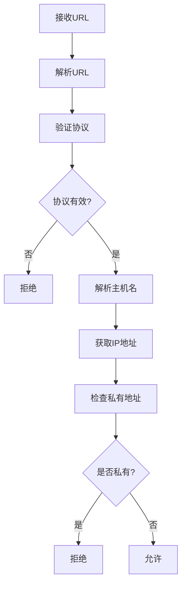
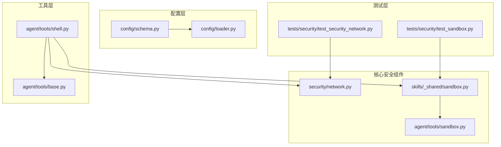

# 权限沙箱控制系统

<cite>
**本文档引用的文件**
- [network.py](file://secbot/security/network.py)
- [sandbox.py](file://secbot/skills/_shared/sandbox.py)
- [shell.py](file://secbot/agent/tools/shell.py)
- [sandbox_backend.py](file://secbot/agent/tools/sandbox.py)
- [schema.py](file://secbot/config/schema.py)
- [loader.py](file://secbot/config/loader.py)
- [test_sandbox.py](file://tests/security/test_sandbox.py)
- [test_security_network.py](file://tests/security/test_security_network.py)
- [base.py](file://secbot/agent/tools/base.py)
- [builtin.py](file://secbot/command/builtin.py)
</cite>

## 目录
1. [简介](#简介)
2. [项目结构](#项目结构)
3. [核心组件](#核心组件)
4. [架构概览](#架构概览)
5. [详细组件分析](#详细组件分析)
6. [依赖关系分析](#依赖关系分析)
7. [性能考虑](#性能考虑)
8. [故障排除指南](#故障排除指南)
9. [结论](#结论)

## 简介

权限沙箱控制系统是一个多层次的安全框架，旨在为AI代理提供受控的执行环境。该系统通过严格的输入验证、命令注入防护、网络访问控制和进程隔离等机制，确保在开放环境中安全地执行外部命令和工具。

系统的核心目标是防止恶意输入、命令注入攻击、内部网络访问和资源滥用，同时保持必要的功能性和可用性。通过分层的安全设计，系统能够在保证安全性的同时，为用户提供灵活的工具使用能力。

## 项目结构

系统采用模块化架构，主要分为以下几个核心层次：

**图表来源**
- [shell.py:1-380](file://secbot/agent/tools/shell.py#L1-L380)
- [network.py:1-120](file://secbot/security/network.py#L1-L120)
- [sandbox.py:1-192](file://secbot/skills/_shared/sandbox.py#L1-L192)

**章节来源**
- [shell.py:1-380](file://secbot/agent/tools/shell.py#L1-L380)
- [network.py:1-120](file://secbot/security/network.py#L1-L120)
- [sandbox.py:1-192](file://secbot/skills/_shared/sandbox.py#L1-L192)

## 核心组件

### 网络安全组件

网络安全组件负责防止服务器端请求伪造(SSRF)攻击，通过CIDR范围配置和IP地址验证来控制网络访问。

### 沙箱执行组件

沙箱执行组件提供受控的进程执行环境，支持多种后端（如bubblewrap），实现进程隔离和资源限制。

### 命令验证组件

命令验证组件通过白名单机制和字符过滤来防止命令注入攻击，确保只有安全的命令能够被执行。

### 配置管理系统

配置管理系统提供集中化的安全策略配置，包括SSRF白名单、工具权限和执行限制等设置。

**章节来源**
- [network.py:29-120](file://secbot/security/network.py#L29-L120)
- [sandbox.py:70-192](file://secbot/skills/_shared/sandbox.py#L70-L192)
- [shell.py:32-380](file://secbot/agent/tools/shell.py#L32-L380)
- [schema.py:226-265](file://secbot/config/schema.py#L226-L265)

## 架构概览

系统采用分层架构设计，每层都有明确的安全职责：

**图表来源**
- [shell.py:123-216](file://secbot/agent/tools/shell.py#L123-L216)
- [network.py:45-119](file://secbot/security/network.py#L45-L119)
- [sandbox.py:109-184](file://secbot/skills/_shared/sandbox.py#L109-L184)

## 详细组件分析

### 网络白名单校验机制

网络白名单机制通过CIDR范围配置来控制允许的网络访问：

#### CIDR范围配置

系统维护一个默认的阻止网络列表，包括：
- 私有网络范围：10.0.0.0/8, 172.16.0.0/12, 192.168.0.0/16
- 回环地址：127.0.0.0/8, ::1/128
- 特殊用途网络：169.254.0.0/16, 100.64.0.0/10
- 本地链接：169.254.0.0/16, fe80::/10

#### IP地址验证流程

**图表来源**
- [network.py:45-119](file://secbot/security/network.py#L45-L119)

#### 访问控制策略

系统提供灵活的访问控制策略：
- REQUIRED：强制需要网络访问
- OPTIONAL：可选网络访问
- NONE：完全禁止网络访问

**章节来源**
- [network.py:11-22](file://secbot/security/network.py#L11-L22)
- [network.py:29-77](file://secbot/security/network.py#L29-L77)
- [network.py:80-119](file://secbot/security/network.py#L80-L119)

### 命令注入防护技术

命令注入防护通过多层验证机制来防止恶意输入：

#### 输入验证机制

系统实施严格的数据类型验证和长度限制：
- JSON Schema验证确保参数类型正确
- 最小长度和最大长度约束
- 枚举值限制和范围检查
- 对象属性的递归验证

#### 参数过滤系统

字符过滤系统阻止危险字符组合：
- 禁止字符集合：;&|$`<>\n\r\\\"'
- 字符串参数的严格验证
- 数字参数的范围检查
- 布尔参数的格式验证

#### 恶意代码检测

系统使用正则表达式模式检测潜在的恶意命令：
- 文件删除操作检测
- 系统管理命令检测
- 网络攻击载荷检测
- 内部网络访问尝试检测

**章节来源**
- [base.py:41-94](file://secbot/agent/tools/base.py#L41-L94)
- [base.py:187-223](file://secbot/agent/tools/base.py#L187-L223)
- [sandbox.py:59-67](file://secbot/skills/_shared/sandbox.py#L59-L67)
- [shell.py:65-83](file://secbot/agent/tools/shell.py#L65-L83)

### 执行环境隔离方案

沙箱执行提供多层隔离保护：

#### 进程隔离

系统支持多种沙箱后端：
- bubblewrap (bwrap)：Linux容器化沙箱
- 完整的进程隔离和命名空间分离
- 只读根文件系统
- 限制的设备访问

#### 资源限制

资源使用受到严格监控和限制：
- 内存使用上限（默认2MB）
- CPU时间限制
- 文件描述符数量限制
- 网络连接超时

#### 文件系统保护

文件系统访问受到精细控制：
- 工作目录绑定挂载
- 媒体目录只读访问
- 配置目录隐藏
- 临时文件系统隔离

**章节来源**
- [sandbox_backend.py:14-45](file://secbot/agent/tools/sandbox.py#L14-L45)
- [sandbox.py:124-139](file://secbot/skills/_shared/sandbox.py#L124-L139)
- [shell.py:153-162](file://secbot/agent/tools/shell.py#L153-L162)

### 沙箱运行时安全配置

运行时安全配置确保沙箱环境的安全性：

#### 用户权限管理

最小权限原则的应用：
- 限制环境变量传递
- 受控的PATH变量设置
- 禁止敏感系统调用
- 限制文件系统访问

#### 网络访问控制

网络流量的严格控制：
- 默认阻断所有出站连接
- 可选的网络访问策略
- DNS查询的IP地址验证
- 重定向目标的安全检查

#### 系统调用限制

系统调用的精细控制：
- 只允许必要的系统调用
- 禁止危险的系统调用
- 文件系统操作的白名单
- 网络操作的严格限制

**章节来源**
- [sandbox.py:109-116](file://secbot/skills/_shared/sandbox.py#L109-L116)
- [shell.py:257-301](file://secbot/agent/tools/shell.py#L257-L301)
- [network.py:29-36](file://secbot/security/network.py#L29-L36)

## 依赖关系分析

系统组件之间的依赖关系清晰且有序：

**图表来源**
- [shell.py:14-17](file://secbot/agent/tools/shell.py#L14-L17)
- [sandbox.py:15-20](file://secbot/skills/_shared/sandbox.py#L15-L20)
- [schema.py:267-275](file://secbot/config/schema.py#L267-L275)

**章节来源**
- [shell.py:14-17](file://secbot/agent/tools/shell.py#L14-L17)
- [sandbox.py:15-20](file://secbot/skills/_shared/sandbox.py#L15-L20)
- [schema.py:267-275](file://secbot/config/schema.py#L267-L275)

## 性能考虑

系统在保证安全性的同时，也考虑了性能优化：

### 并发控制

- 工具执行的并发限制
- 资源使用的监控和限制
- 异步操作的合理调度
- 缓存机制的使用

### 内存管理

- 输出缓冲区的大小限制
- 内存使用的动态监控
- 大输出的流式处理
- 超时机制的及时响应

### 网络优化

- DNS查询的缓存机制
- 连接池的复用
- 超时值的合理设置
- 错误重试的限制

## 故障排除指南

### 常见问题诊断

#### 命令执行失败

当命令执行失败时，系统会返回详细的错误信息：
- 参数验证失败：检查输入参数的类型和格式
- 权限不足：确认工具的执行权限
- 超时错误：调整超时设置或优化命令
- 路径访问错误：检查工作目录和文件路径

#### 网络访问被拒绝

网络访问被拒绝通常由以下原因造成：
- 目标地址属于私有网络范围
- DNS解析到内部IP地址
- SSRF白名单未配置
- 网络策略设置过于严格

#### 沙箱启动失败

沙箱启动失败的可能原因：
- bubblewrap工具不可用
- 文件系统权限问题
- 资源限制过严
- 配置参数错误

**章节来源**
- [test_sandbox.py:26-153](file://tests/security/test_sandbox.py#L26-L153)
- [test_security_network.py:25-146](file://tests/security/test_security_network.py#L25-L146)

## 结论

权限沙箱控制系统通过多层次的安全设计，为AI代理提供了可靠的执行环境。系统的核心优势包括：

1. **全面的安全防护**：从网络访问到命令执行的全方位保护
2. **灵活的配置选项**：支持不同场景下的安全策略调整
3. **高效的性能表现**：在保证安全性的前提下优化执行效率
4. **完善的监控机制**：提供详细的日志和错误报告

该系统为AI应用的安全执行提供了坚实的基础，能够有效防范各种常见的安全威胁，同时保持必要的功能性和可用性。通过持续的安全审计和更新，系统能够适应不断变化的安全挑战。