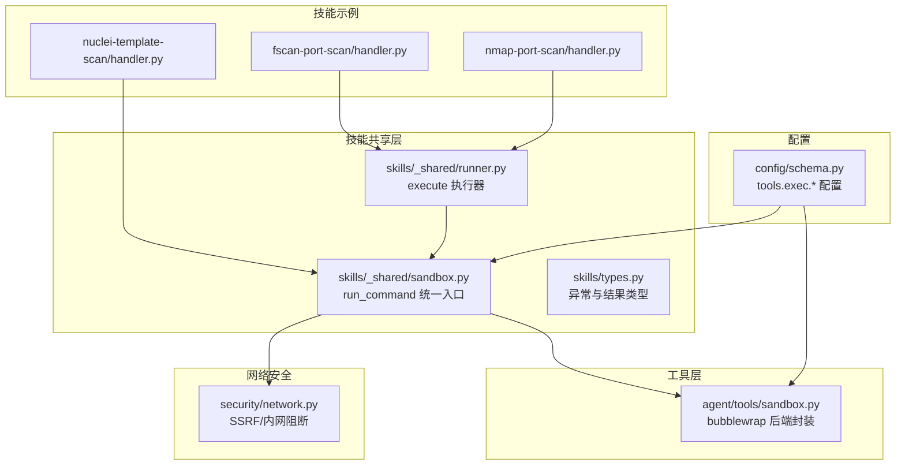
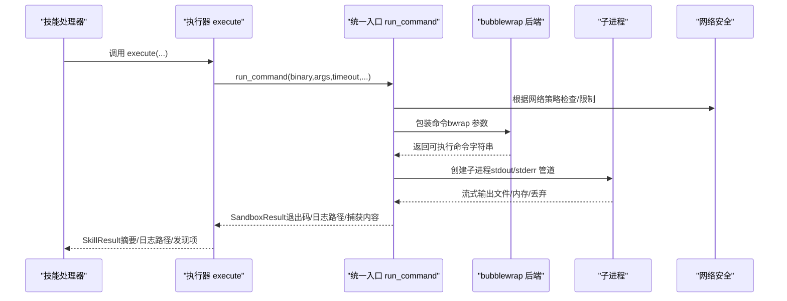
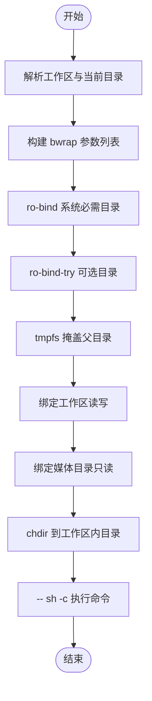
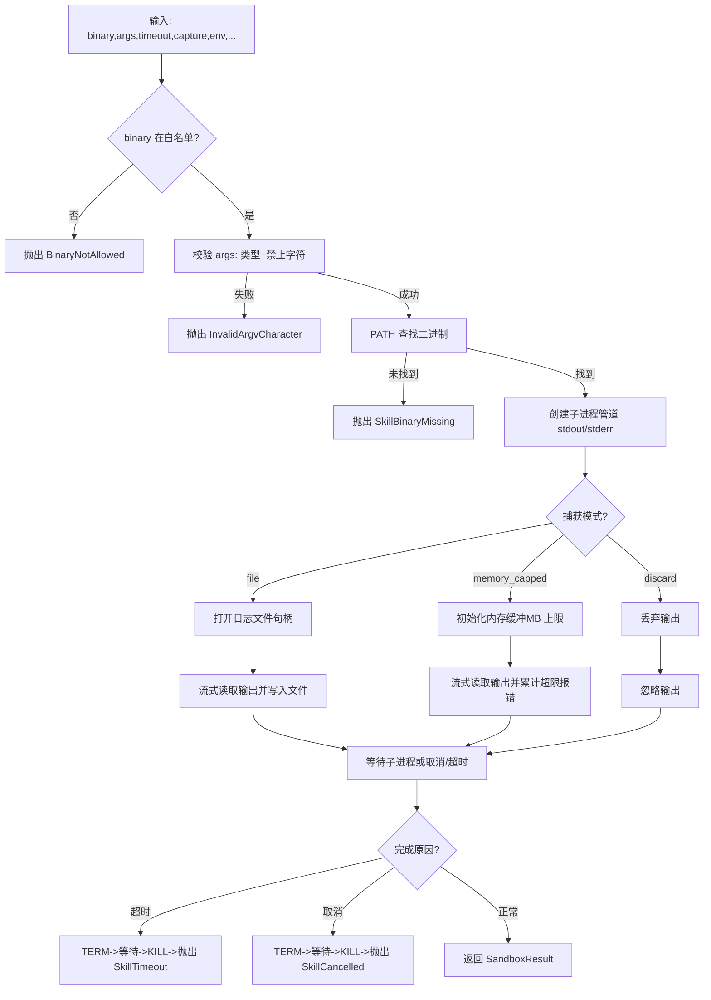
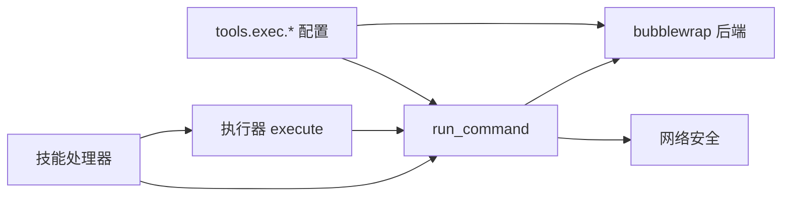
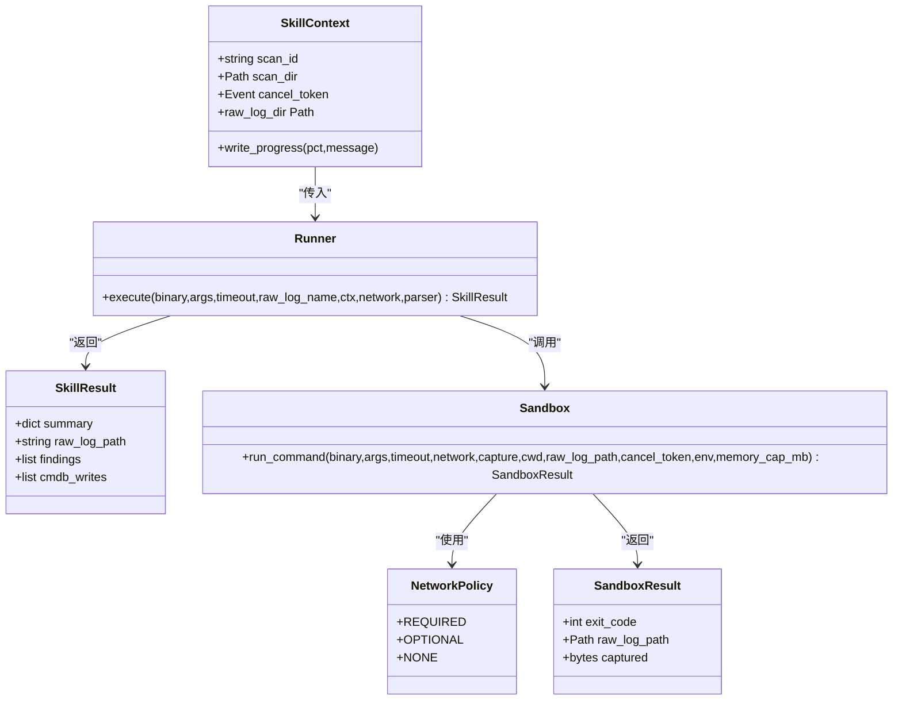

# 沙箱机制

<cite>
**本文引用的文件**
- [secbot/agent/tools/sandbox.py](file://secbot/agent/tools/sandbox.py)
- [secbot/skills/_shared/sandbox.py](file://secbot/skills/_shared/sandbox.py)
- [secbot/skills/_shared/runner.py](file://secbot/skills/_shared/runner.py)
- [secbot/skills/types.py](file://secbot/skills/types.py)
- [secbot/security/network.py](file://secbot/security/network.py)
- [secbot/config/schema.py](file://secbot/config/schema.py)
- [tests/security/test_sandbox.py](file://tests/security/test_sandbox.py)
- [tests/tools/test_sandbox.py](file://tests/tools/test_sandbox.py)
- [.trellis/spec/backend/tool-invocation-safety.md](file://.trellis/spec/backend/tool-invocation-safety.md)
- [secbot/skills/fscan-port-scan/handler.py](file://secbot/skills/fscan-port-scan/handler.py)
- [secbot/skills/nuclei-template-scan/handler.py](file://secbot/skills/nuclei-template-scan/handler.py)
- [secbot/skills/nmap-port-scan/handler.py](file://secbot/skills/nmap-port-scan/handler.py)
</cite>

## 目录
1. [引言](#引言)
2. [项目结构](#项目结构)
3. [核心组件](#核心组件)
4. [架构总览](#架构总览)
5. [详细组件分析](#详细组件分析)
6. [依赖关系分析](#依赖关系分析)
7. [性能考量](#性能考量)
8. [故障排除指南](#故障排除指南)
9. [结论](#结论)
10. [附录](#附录)

## 引言
本文件系统性阐述 VAPT3 的沙箱机制，聚焦于进程隔离、资源限制、文件系统隔离与网络安全策略；详述命令执行的安全控制（二进制白名单、参数校验、禁止字符拦截、超时与取消）；给出配置项与自定义设置（资源配额、时间限制、网络访问控制）；解释沙箱与技能系统的集成（执行流程、错误处理、资源清理）；并提供最佳实践、性能优化与故障排除方法，以及跨平台兼容性与限制说明。

## 项目结构
围绕沙箱的关键代码分布在以下模块：
- 工具层：提供 bubblewrap 后端封装，将任意命令包装为受控可执行字符串
- 技能共享层：统一的外部命令执行入口，负责白名单、参数校验、超时与取消、输出捕获、结果封装
- 网络安全：SSRF 阻断与内部地址检测
- 配置：工具执行配置（启用开关、超时、沙箱后端、环境变量透传、正则放行/拦截）
- 技能示例：展示如何通过共享执行器调用外部扫描器，并解析结果

**图表来源**
- [secbot/agent/tools/sandbox.py:1-56](file://secbot/agent/tools/sandbox.py#L1-L56)
- [secbot/skills/_shared/sandbox.py:1-192](file://secbot/skills/_shared/sandbox.py#L1-L192)
- [secbot/skills/_shared/runner.py:1-83](file://secbot/skills/_shared/runner.py#L1-L83)
- [secbot/skills/types.py:1-87](file://secbot/skills/types.py#L1-L87)
- [secbot/security/network.py:1-120](file://secbot/security/network.py#L1-L120)
- [secbot/config/schema.py:226-265](file://secbot/config/schema.py#L226-L265)
- [secbot/skills/fscan-port-scan/handler.py:1-45](file://secbot/skills/fscan-port-scan/handler.py#L1-L45)
- [secbot/skills/nuclei-template-scan/handler.py:1-154](file://secbot/skills/nuclei-template-scan/handler.py#L1-L154)
- [secbot/skills/nmap-port-scan/handler.py:1-48](file://secbot/skills/nmap-port-scan/handler.py#L1-L48)

**章节来源**
- [secbot/agent/tools/sandbox.py:1-56](file://secbot/agent/tools/sandbox.py#L1-L56)
- [secbot/skills/_shared/sandbox.py:1-192](file://secbot/skills/_shared/sandbox.py#L1-L192)
- [secbot/skills/_shared/runner.py:1-83](file://secbot/skills/_shared/runner.py#L1-L83)
- [secbot/skills/types.py:1-87](file://secbot/skills/types.py#L1-L87)
- [secbot/security/network.py:1-120](file://secbot/security/network.py#L1-L120)
- [secbot/config/schema.py:226-265](file://secbot/config/schema.py#L226-L265)
- [secbot/skills/fscan-port-scan/handler.py:1-45](file://secbot/skills/fscan-port-scan/handler.py#L1-L45)
- [secbot/skills/nuclei-template-scan/handler.py:1-154](file://secbot/skills/nuclei-template-scan/handler.py#L1-L154)
- [secbot/skills/nmap-port-scan/handler.py:1-48](file://secbot/skills/nmap-port-scan/handler.py#L1-L48)

## 核心组件
- bubblewrap 后端封装：将命令包装为受控的 bubblewrap 调用，限定工作目录、挂载点、只读路径、临时文件系统与媒体目录挂载策略
- 统一执行入口 run_command：二进制白名单、参数禁止字符校验、PATH 查找、超时与取消、输出捕获（文件/内存上限/丢弃）、结果封装
- 执行器 execute：面向技能的便捷封装，自动选择“文件”捕获模式，解析原始日志并生成结构化摘要
- 网络安全策略：SSRF 白名单与内网地址阻断，结合技能声明的网络策略进行强制约束
- 配置项：工具执行开关、超时、沙箱后端、允许的环境变量键、放行/拦截正则

**章节来源**
- [secbot/agent/tools/sandbox.py:14-55](file://secbot/agent/tools/sandbox.py#L14-L55)
- [secbot/skills/_shared/sandbox.py:70-192](file://secbot/skills/_shared/sandbox.py#L70-L192)
- [secbot/skills/_shared/runner.py:38-83](file://secbot/skills/_shared/runner.py#L38-L83)
- [secbot/security/network.py:29-120](file://secbot/security/network.py#L29-L120)
- [secbot/config/schema.py:226-265](file://secbot/config/schema.py#L226-L265)

## 架构总览
下图展示了从技能到外部二进制的完整调用链路与安全控制点。

**图表来源**
- [secbot/skills/_shared/runner.py:38-83](file://secbot/skills/_shared/runner.py#L38-L83)
- [secbot/skills/_shared/sandbox.py:70-192](file://secbot/skills/_shared/sandbox.py#L70-L192)
- [secbot/agent/tools/sandbox.py:14-55](file://secbot/agent/tools/sandbox.py#L14-L55)
- [secbot/security/network.py:29-120](file://secbot/security/network.py#L29-L120)

## 详细组件分析

### bubblewrap 后端封装
- 设计要点
  - 进程隔离：新会话、父进程退出即终止
  - 文件系统隔离：仅工作区读写挂载；父目录以 tmpfs 掩盖，隐藏配置文件
  - 只读挂载：系统关键目录（如 /usr、/bin 等）按需 ro-bind 或 ro-bind-try
  - 媒体目录：只读挂载到沙箱内，供读取上传附件
  - 当前目录：在工作区内解析 chdir，越界则回退到工作区根
  - 最终以 sh -c 执行用户命令
- 关键行为由单元测试覆盖：基本结构、工作区挂载、父目录 tmpfs 掩盖、cwd 解析、系统目录 ro 绑定、媒体目录 ro 绑定、未知后端报错等

**图表来源**
- [secbot/agent/tools/sandbox.py:14-55](file://secbot/agent/tools/sandbox.py#L14-L55)

**章节来源**
- [secbot/agent/tools/sandbox.py:14-55](file://secbot/agent/tools/sandbox.py#L14-L55)
- [tests/tools/test_sandbox.py:15-122](file://tests/tools/test_sandbox.py#L15-L122)

### 统一执行入口 run_command
- 安全控制
  - 二进制白名单：仅允许预置列表中的外部二进制
  - 参数校验：禁止字符集拦截；每个 argv 元素必须为字符串且不含禁用字符
  - PATH 校验：未找到二进制时报错
  - 输出捕获：支持文件持久化、内存上限缓冲、丢弃三种模式
  - 超时与取消：超时发送 TERM，等待 5s 后 KILL；取消事件触发终止
- 结果封装：返回退出码、原始日志路径、内存捕获内容（仅限 memory_capped）

**图表来源**
- [.trellis/spec/backend/tool-invocation-safety.md:102-128](file://.trellis/spec/backend/tool-invocation-safety.md#L102-L128)
- [secbot/skills/_shared/sandbox.py:70-192](file://secbot/skills/_shared/sandbox.py#L70-L192)

**章节来源**
- [secbot/skills/_shared/sandbox.py:70-192](file://secbot/skills/_shared/sandbox.py#L70-L192)
- [.trellis/spec/backend/tool-invocation-safety.md:1-128](file://.trellis/spec/backend/tool-invocation-safety.md#L1-L128)
- [tests/security/test_sandbox.py:26-153](file://tests/security/test_sandbox.py#L26-L153)

### 执行器 execute
- 用途：简化技能侧调用，自动选择“文件”捕获模式，解析原始日志并生成摘要
- 行为：捕获异常（超时/取消/二进制缺失），记录耗时，根据退出码补充错误信息

**章节来源**
- [secbot/skills/_shared/runner.py:38-83](file://secbot/skills/_shared/runner.py#L38-L83)

### 网络安全策略
- SSRF 白名单：可配置允许的 CIDR，绕过默认内网阻断
- 内部地址阻断：对 http/https URL 解析 IP，命中私有/环回/链路本地网段则拒绝
- 与沙箱协作：技能声明的网络策略（REQUIRED/OPTIONAL/NONE）决定是否应用网络限制

**章节来源**
- [secbot/security/network.py:29-120](file://secbot/security/network.py#L29-L120)
- [.trellis/spec/backend/tool-invocation-safety.md:89-99](file://.trellis/spec/backend/tool-invocation-safety.md#L89-L99)

### 配置项与自定义设置
- 工具执行配置（tools.exec.*）
  - enable：是否启用工具执行
  - timeout：默认超时秒数
  - sandbox：沙箱后端名称（空串表示禁用，当前实现为 "bwrap"）
  - allowed_env_keys：允许透传的环境变量键
  - allow_patterns/deny_patterns：正则放行/拦截规则
- 配置加载与别名：支持驼峰/蛇形字段互换，提供默认值与校验

**章节来源**
- [secbot/config/schema.py:226-265](file://secbot/config/schema.py#L226-L265)

### 与技能系统的集成
- 规范约束：所有技能外部命令调用必须通过统一入口，禁止直接使用 subprocess/os.system 等
- 示例技能
  - fscan-port-scan：使用 execute 封装，自动文件捕获与解析
  - nmap-port-scan：使用 execute 封装，自动文件捕获与解析
  - nuclei-template-scan：直接调用 run_command，自行管理目标文件与解析
- 错误处理：超时/取消/二进制缺失等异常被转换为结构化摘要或重新抛出

**章节来源**
- [.trellis/spec/backend/tool-invocation-safety.md:8-26](file://.trellis/spec/backend/tool-invocation-safety.md#L8-L26)
- [secbot/skills/fscan-port-scan/handler.py:31-45](file://secbot/skills/fscan-port-scan/handler.py#L31-L45)
- [secbot/skills/nmap-port-scan/handler.py:32-48](file://secbot/skills/nmap-port-scan/handler.py#L32-L48)
- [secbot/skills/nuclei-template-scan/handler.py:98-154](file://secbot/skills/nuclei-template-scan/handler.py#L98-L154)

## 依赖关系分析
- 组件耦合
  - 技能处理器依赖执行器 execute 或直接依赖 run_command
  - 执行器依赖统一入口 run_command
  - 统一入口依赖 bubblewrap 后端与网络安全模块
  - 配置影响后端启用、超时、环境变量透传与网络策略
- 外部依赖
  - bubblewrap（bwrap）用于进程与文件系统隔离
  - 系统 PATH 用于二进制查找
  - 网络库用于 URL 解析与地址判定

**图表来源**
- [secbot/skills/_shared/runner.py:38-83](file://secbot/skills/_shared/runner.py#L38-L83)
- [secbot/skills/_shared/sandbox.py:70-192](file://secbot/skills/_shared/sandbox.py#L70-L192)
- [secbot/agent/tools/sandbox.py:14-55](file://secbot/agent/tools/sandbox.py#L14-L55)
- [secbot/security/network.py:29-120](file://secbot/security/network.py#L29-L120)
- [secbot/config/schema.py:226-265](file://secbot/config/schema.py#L226-L265)

**章节来源**
- [secbot/skills/_shared/runner.py:1-83](file://secbot/skills/_shared/runner.py#L1-L83)
- [secbot/skills/_shared/sandbox.py:1-192](file://secbot/skills/_shared/sandbox.py#L1-L192)
- [secbot/agent/tools/sandbox.py:1-56](file://secbot/agent/tools/sandbox.py#L1-L56)
- [secbot/security/network.py:1-120](file://secbot/security/network.py#L1-L120)
- [secbot/config/schema.py:226-265](file://secbot/config/schema.py#L226-L265)

## 性能考量
- 输出捕获
  - 文件捕获适合大型结构化输出，避免内存占用
  - 内存上限捕获适合短小输出，防止 OOM
  - 丢弃模式适合副作用操作，不关心输出
- 超时与取消
  - 明确的超时与取消语义确保长时间任务不会无限占用资源
- I/O 与解析
  - 建议在技能侧对大文件输出采用流式解析，减少峰值内存
- 网络策略
  - 对于不需要外联的技能，声明 NONE 并启用网络安全模块，避免不必要的连接开销

[本节为通用指导，无需列出具体文件来源]

## 故障排除指南
- 常见问题与定位
  - 二进制不在白名单：确认 binary 是否在白名单中，必要时提交规范修订
  - 参数包含禁止字符：检查输入校验与正则，避免注入风险
  - 超时：适当提高 timeout_sec，或优化外部二进制参数
  - 取消：确认取消事件触发时机，确保快速终止
  - 网络策略：NONE 技能不应建立外联，否则会被网络安全模块阻断
- 单元测试参考
  - 沙箱白名单与 argv 注入测试覆盖了关键安全边界
  - 工具层 bwrap 行为测试覆盖了挂载、tmpfs、cwd、系统目录 ro 绑定等

**章节来源**
- [tests/security/test_sandbox.py:26-153](file://tests/security/test_sandbox.py#L26-L153)
- [tests/tools/test_sandbox.py:15-122](file://tests/tools/test_sandbox.py#L15-L122)

## 结论
VAPT3 的沙箱机制通过“统一入口 + bubblewrap 后端 + 网络安全策略”的组合，实现了严格的进程与文件系统隔离、参数注入防护、超时与取消控制、以及可配置的网络访问策略。技能系统通过执行器与统一入口无缝集成，既保证了安全性，又提供了良好的开发体验。建议在新增外部二进制时严格遵循白名单与参数校验规范，并根据场景合理选择输出捕获模式与超时配置。

[本节为总结性内容，无需列出具体文件来源]

## 附录

### 配置项速查表
- tools.exec.enable：是否启用工具执行
- tools.exec.timeout：默认超时秒数
- tools.exec.sandbox：沙箱后端（空串禁用，当前实现为 "bwrap"）
- tools.exec.allowed_env_keys：允许透传的环境变量键列表
- tools.exec.allow_patterns/deny_patterns：正则放行/拦截规则

**章节来源**
- [secbot/config/schema.py:226-265](file://secbot/config/schema.py#L226-L265)

### 技能执行流程（类图）

**图表来源**
- [secbot/skills/_shared/runner.py:38-83](file://secbot/skills/_shared/runner.py#L38-L83)
- [secbot/skills/_shared/sandbox.py:70-192](file://secbot/skills/_shared/sandbox.py#L70-L192)
- [secbot/skills/types.py:44-82](file://secbot/skills/types.py#L44-L82)