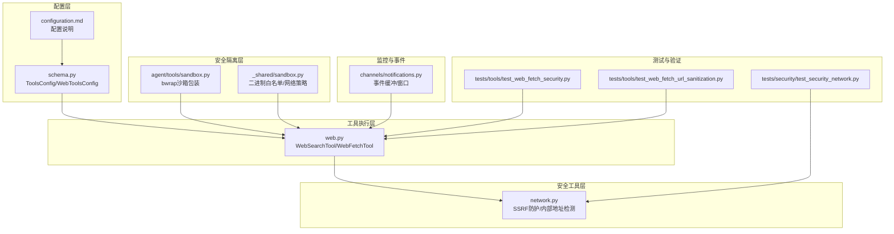
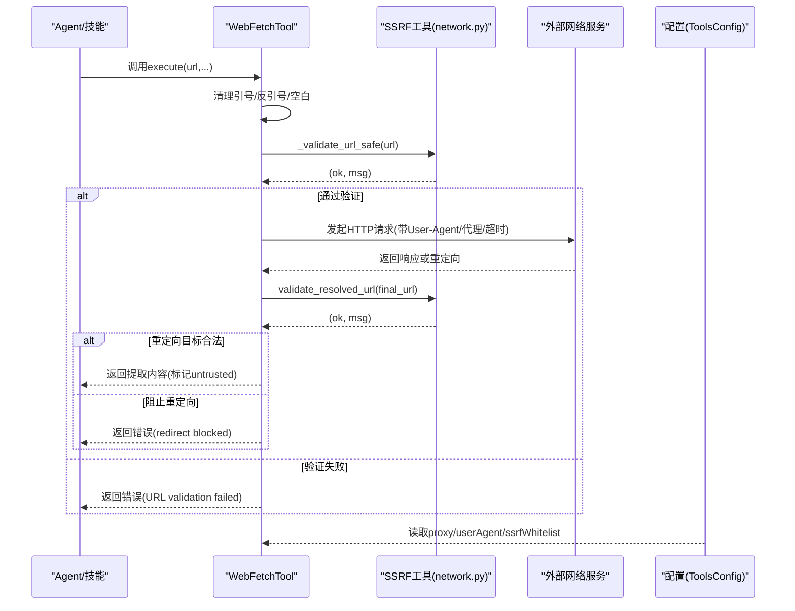
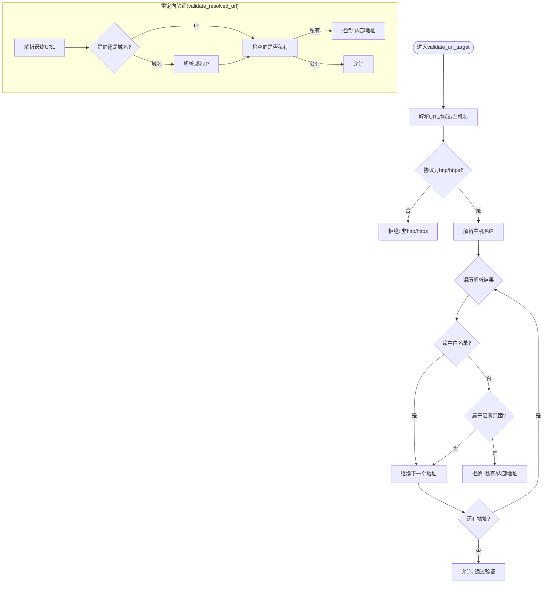
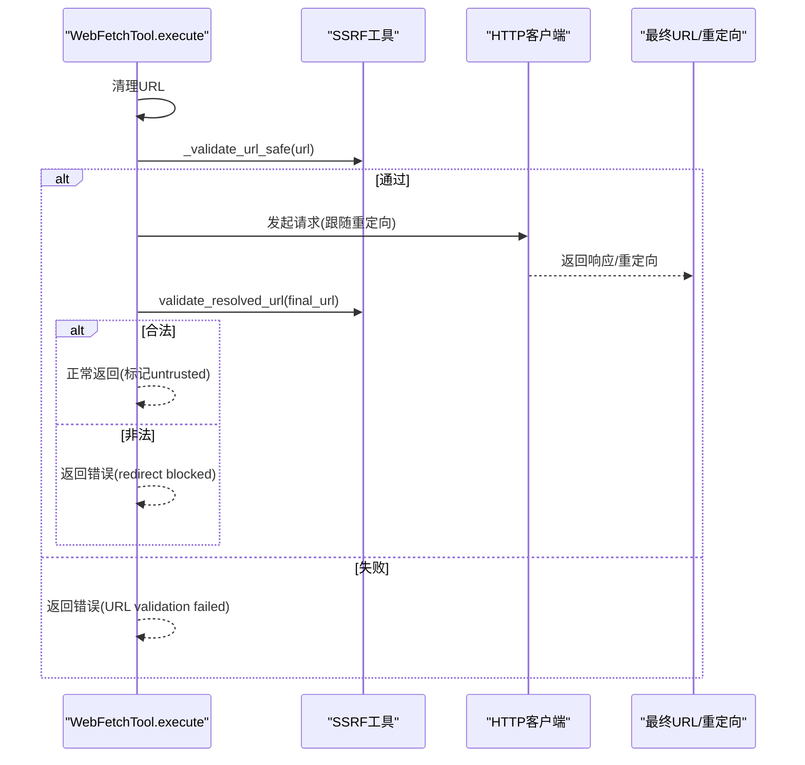
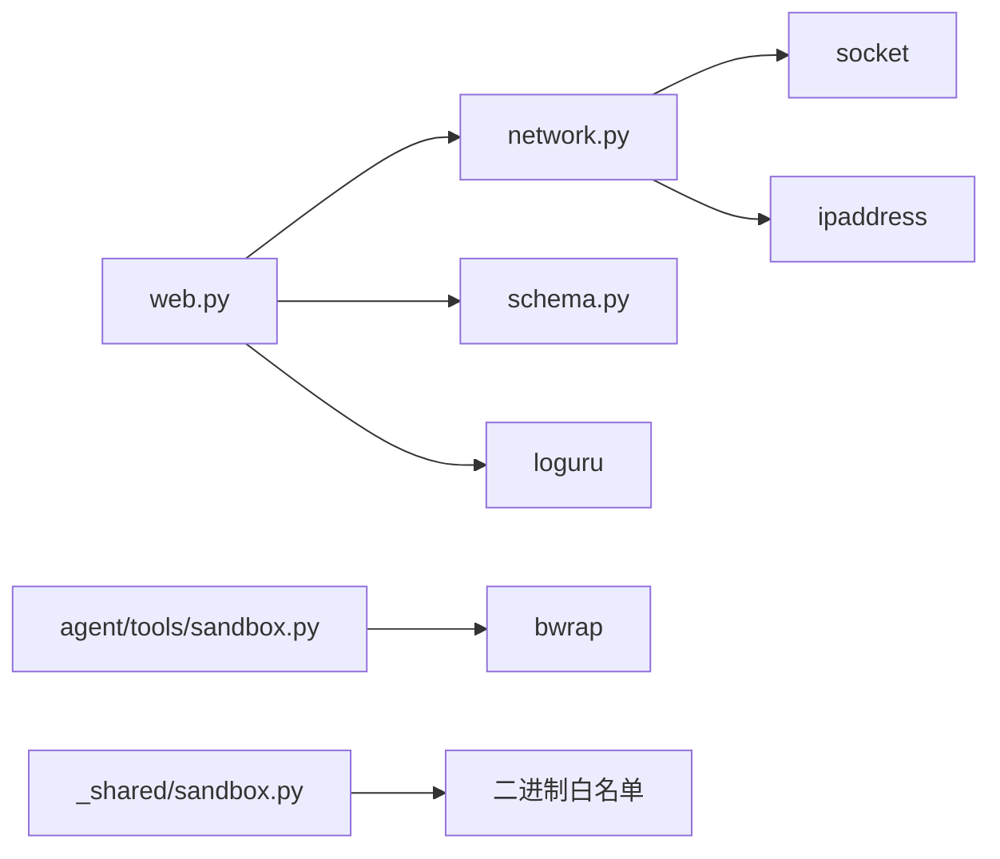

# 网络安全防护

<cite>
**本文引用的文件**
- [network.py](file://secbot/security/network.py)
- [web.py](file://secbot/agent/tools/web.py)
- [schema.py](file://secbot/config/schema.py)
- [configuration.md](file://docs/configuration.md)
- [test_security_network.py](file://tests/security/test_security_network.py)
- [test_web_fetch_security.py](file://tests/tools/test_web_fetch_security.py)
- [test_web_fetch_url_sanitization.py](file://tests/tools/test_web_fetch_url_sanitization.py)
- [sandbox.py](file://secbot/agent/tools/sandbox.py)
- [sandbox.py](file://secbot/skills/_shared/sandbox.py)
- [notifications.py](file://secbot/channels/notifications.py)
- [task-detail.ts](file://webui/src/data/mock/task-detail.ts)
</cite>

## 目录
1. [简介](#简介)
2. [项目结构](#项目结构)
3. [核心组件](#核心组件)
4. [架构总览](#架构总览)
5. [详细组件分析](#详细组件分析)
6. [依赖分析](#依赖分析)
7. [性能考虑](#性能考虑)
8. [故障排查指南](#故障排查指南)
9. [结论](#结论)
10. [附录](#附录)

## 简介
本文件面向VAPT3网络安全防护系统，围绕SSRF（服务器端请求伪造）防护、URL安全验证、网络白名单配置、内部网络检测、与外部网络服务交互的安全策略进行系统化技术文档说明。内容涵盖设计原理、实现细节、最佳实践与威胁分析，并通过代码级图示与测试用例路径帮助读者快速定位实现位置与验证方法。

## 项目结构
VAPT3在网络安全方面主要由以下模块协同工作：
- 安全工具层：网络安全工具（SSRF防护、URL验证、内部地址检测）
- 工具执行层：Web搜索与抓取工具（WebSearchTool、WebFetchTool）
- 配置层：全局配置与工具配置（含SSRF白名单、代理、用户代理等）
- 安全隔离层：进程沙箱与二进制白名单
- 监控与事件：通知缓冲与事件窗口
- 测试与验证：针对SSRF、URL清理、重定向拦截的单元测试

图表来源
- [network.py:1-120](file://secbot/security/network.py#L1-L120)
- [web.py:1-519](file://secbot/agent/tools/web.py#L1-L519)
- [schema.py:256-265](file://secbot/config/schema.py#L256-L265)
- [configuration.md:748-756](file://docs/configuration.md#L748-L756)
- [sandbox.py:1-55](file://secbot/agent/tools/sandbox.py#L1-L55)
- [sandbox.py:1-56](file://secbot/skills/_shared/sandbox.py#L1-L56)
- [notifications.py:30-69](file://secbot/channels/notifications.py#L30-L69)
- [test_security_network.py:1-145](file://tests/security/test_security_network.py#L1-L145)
- [test_web_fetch_security.py:1-175](file://tests/tools/test_web_fetch_security.py#L1-L175)
- [test_web_fetch_url_sanitization.py:1-157](file://tests/tools/test_web_fetch_url_sanitization.py#L1-L157)

章节来源
- [network.py:1-120](file://secbot/security/network.py#L1-L120)
- [web.py:1-519](file://secbot/agent/tools/web.py#L1-L519)
- [schema.py:256-265](file://secbot/config/schema.py#L256-L265)
- [configuration.md:748-756](file://docs/configuration.md#L748-L756)

## 核心组件
- 网络安全工具（SSRF防护与内部地址检测）
  - 提供URL目标验证、解析后IP检查、重定向目标二次验证、命令中URL扫描等功能
- Web工具（WebSearchTool/WebFetchTool）
  - 在发起外部请求前执行URL安全验证，支持代理、用户代理、最大重定向次数限制、图片直取等
- 配置系统（ToolsConfig/WebToolsConfig）
  - 支持SSRF白名单（CIDR）、代理、用户代理、Web抓取偏好等
- 安全隔离（沙箱与二进制白名单）
  - 通过bwrap对子进程进行最小权限挂载，限制可访问目录并隐藏敏感配置
- 监控与事件
  - 事件缓冲与时间窗口，用于聚合与过滤告警事件

章节来源
- [network.py:29-120](file://secbot/security/network.py#L29-L120)
- [web.py:362-519](file://secbot/agent/tools/web.py#L362-L519)
- [schema.py:208-224](file://secbot/config/schema.py#L208-L224)
- [sandbox.py:14-55](file://secbot/agent/tools/sandbox.py#L14-L55)
- [sandbox.py:23-50](file://secbot/skills/_shared/sandbox.py#L23-L50)
- [notifications.py:30-69](file://secbot/channels/notifications.py#L30-L69)

## 架构总览
下图展示从工具调用到外部服务交互的完整链路，以及SSRF防护的关键节点。

图表来源
- [web.py:384-421](file://secbot/agent/tools/web.py#L384-L421)
- [network.py:45-109](file://secbot/security/network.py#L45-L109)
- [schema.py:256-265](file://secbot/config/schema.py#L256-L265)

## 详细组件分析

### SSRF防护与内部地址检测（network.py）
- 阻断网络范围
  - 默认阻断：0.0.0.0/8、10.0.0.0/8、100.64.0.0/10、127.0.0.0/8、169.254.0.0/16、172.16.0.0/12、192.168.0.0/16、IPv6 ::1、fc00::/7、fe80::/10
- 白名单机制
  - 通过configure_ssrf_whitelist加载CIDR列表，命中白名单的地址不视为私有
- URL目标验证
  - 协议检查：仅允许http/https
  - 主机名解析：使用getaddrinfo解析所有IP，逐一判断是否属于阻断范围
- 重定向目标验证
  - 对最终URL或解析后的IP再次检查，防止中间人重定向至内网
- 命令内URL扫描
  - 使用正则匹配命令中的URL，逐个验证以发现潜在内网探测

图表来源
- [network.py:45-109](file://secbot/security/network.py#L45-L109)

章节来源
- [network.py:11-42](file://secbot/security/network.py#L11-L42)
- [network.py:29-42](file://secbot/security/network.py#L29-L42)
- [network.py:45-109](file://secbot/security/network.py#L45-L109)
- [test_security_network.py:26-145](file://tests/security/test_security_network.py#L26-L145)

### URL安全验证流程（web.py）
- URL清理
  - 去除首尾空白与反引号/引号等危险字符
- 协议与域名基础校验
  - 仅允许http/https，必须包含netloc
- SSRF保护
  - 调用validate_url_target进行协议、域名与解析IP的综合检查
- 重定向拦截
  - 使用validate_resolved_url对最终URL进行二次验证
- 图片直取优化
  - 若Content-Type为image/*，直接下载并返回图像块，避免第三方解析
- 错误处理
  - 代理错误、网络异常、重定向被阻等均返回结构化错误信息

图表来源
- [web.py:384-421](file://secbot/agent/tools/web.py#L384-L421)
- [web.py:459-507](file://secbot/agent/tools/web.py#L459-L507)
- [network.py:45-109](file://secbot/security/network.py#L45-L109)

章节来源
- [web.py:391-421](file://secbot/agent/tools/web.py#L391-L421)
- [web.py:400-406](file://secbot/agent/tools/web.py#L400-L406)
- [web.py:408-413](file://secbot/agent/tools/web.py#L408-L413)
- [web.py:416-421](file://secbot/agent/tools/web.py#L416-L421)
- [web.py:459-507](file://secbot/agent/tools/web.py#L459-L507)
- [test_web_fetch_security.py:23-175](file://tests/tools/test_web_fetch_security.py#L23-L175)
- [test_web_fetch_url_sanitization.py:134-157](file://tests/tools/test_web_fetch_url_sanitization.py#L134-L157)

### 网络白名单配置系统（ToolsConfig）
- 配置项
  - tools.ssrfWhitelist：CIDR列表，允许特定私有范围绕过默认阻断
  - tools.web.proxy：统一代理设置
  - tools.web.userAgent：统一User-Agent
- 动态更新机制
  - 通过配置加载生效，Web工具在执行前读取当前配置
- 最佳实践
  - 仅添加必要且可信的CIDR（如Tailscale的100.64.0.0/10）
  - 保持默认阻断不变，避免扩大攻击面

章节来源
- [schema.py:256-265](file://secbot/config/schema.py#L256-L265)
- [configuration.md:748-756](file://docs/configuration.md#L748-L756)
- [test_security_network.py:108-145](file://tests/security/test_security_network.py#L108-L145)

### 内部网络检测算法
- IPv4/IPv6私有地址识别
  - 0.0.0.0/8、10.0.0.0/8、172.16.0.0/12、192.168.0.0/16
  - IPv6 ::1、fc00::/7、fe80::/10
- 链路本地与云元数据
  - 169.254.0.0/16（链路本地/云元数据）
  - 100.64.0.0/10（CGNAT/Tailscale）
- 命令行内URL扫描
  - 使用正则匹配命令中的URL，逐一验证，发现内网探测行为

章节来源
- [network.py:11-22](file://secbot/security/network.py#L11-L22)
- [network.py:39-42](file://secbot/security/network.py#L39-L42)
- [test_security_network.py:41-63](file://tests/security/test_security_network.py#L41-L63)

### 与外部网络服务的交互安全策略
- 代理与超时
  - 统一代理设置，请求超时与最大重定向次数限制，防止DoS
- 用户代理与头部
  - 可配置User-Agent，避免被简单识别为自动化脚本
- 第三方解析降级
  - Jina Reader失败时回退本地readability解析
- 重定向拦截
  - 严格验证重定向目标，阻止指向内部地址的跳转

章节来源
- [web.py:24-26](file://secbot/agent/tools/web.py#L24-L26)
- [web.py:215-224](file://secbot/agent/tools/web.py#L215-L224)
- [web.py:430-435](file://secbot/agent/tools/web.py#L430-L435)
- [web.py:464-469](file://secbot/agent/tools/web.py#L464-L469)
- [web.py:473-476](file://secbot/agent/tools/web.py#L473-L476)

### 安全隔离与访问控制
- 进程沙箱（bwrap）
  - 仅挂载工作区（读写）与媒体目录（只读），隐藏配置目录
  - 通过tmpfs遮蔽父目录，避免泄露密钥与配置
- 二进制白名单
  - 仅允许白名单内的二进制执行，降低供应链风险
- 网络策略枚举
  - required/optional/none，按需启用网络访问

章节来源
- [sandbox.py:14-55](file://secbot/agent/tools/sandbox.py#L14-L55)
- [sandbox.py:23-50](file://secbot/skills/_shared/sandbox.py#L23-L50)

### 安全监控与事件
- 事件缓冲
  - 固定容量环形缓冲，支持环境变量覆盖缓冲大小
- 时间窗口
  - 默认5分钟窗口，支持环境变量覆盖
- 类型与级别
  - 允许类型与事件级别受控，未知值记录但不拒绝

章节来源
- [notifications.py:30-69](file://secbot/channels/notifications.py#L30-L69)

## 依赖分析
- 组件耦合
  - Web工具依赖SSRF工具进行URL验证与重定向验证
  - 配置系统为Web工具提供代理、User-Agent与SSRF白名单
  - 沙箱与二进制白名单为系统提供进程级隔离
- 外部依赖
  - httpx用于HTTP请求与流式下载
  - socket/ipaddress用于DNS解析与IP分类
  - loguru用于日志记录

图表来源
- [web.py:13-18](file://secbot/agent/tools/web.py#L13-L18)
- [network.py:5-9](file://secbot/security/network.py#L5-L9)
- [schema.py:256-265](file://secbot/config/schema.py#L256-L265)
- [sandbox.py:14-55](file://secbot/agent/tools/sandbox.py#L14-L55)
- [sandbox.py:23-50](file://secbot/skills/_shared/sandbox.py#L23-L50)

## 性能考虑
- DNS解析成本
  - validate_url_target会解析所有A/AAAA记录，建议在批量场景中缓存解析结果
- 重定向限制
  - MAX_REDIRECTS=5，避免无限重定向导致资源耗尽
- 超时控制
  - Web工具设置合理超时，避免长时间阻塞
- 事件窗口
  - 合理设置事件窗口与缓冲大小，平衡内存占用与实时性

## 故障排查指南
- URL验证失败
  - 检查协议是否为http/https，域名是否存在
  - 使用测试用例验证：[test_web_fetch_url_sanitization.py:134-157](file://tests/tools/test_web_fetch_url_sanitization.py#L134-L157)
- 私有地址被阻
  - 确认是否需要加入tools.ssrfWhitelist
  - 使用测试用例验证白名单行为：[test_security_network.py:115-134](file://tests/security/test_security_network.py#L115-L134)
- 重定向被阻
  - 检查validate_resolved_url逻辑，确认最终URL是否指向内部地址
  - 使用测试用例验证：[test_web_fetch_security.py:135-175](file://tests/tools/test_web_fetch_security.py#L135-L175)
- 代理错误
  - 检查代理配置与连通性，查看Web工具的代理错误处理
  - 参考：[web.py:502-507](file://secbot/agent/tools/web.py#L502-L507)

章节来源
- [test_web_fetch_url_sanitization.py:134-157](file://tests/tools/test_web_fetch_url_sanitization.py#L134-L157)
- [test_security_network.py:115-134](file://tests/security/test_security_network.py#L115-L134)
- [test_web_fetch_security.py:135-175](file://tests/tools/test_web_fetch_security.py#L135-L175)
- [web.py:502-507](file://secbot/agent/tools/web.py#L502-L507)

## 结论
VAPT3通过“协议与域名基础校验 + DNS解析后IP分类 + 白名单豁免 + 重定向二次验证”的多层防护，有效抵御SSRF攻击；结合代理、超时、重定向限制与事件监控，形成完整的外部交互安全体系。配合进程沙箱与二进制白名单，进一步降低系统级风险。建议生产部署时开启工具沙箱、合理配置SSRF白名单，并持续监控事件缓冲中的异常流量。

## 附录
- 最佳实践清单
  - 仅在必要时添加SSRF白名单，优先使用更窄的CIDR
  - 为Web工具配置代理与合理的User-Agent
  - 启用工具沙箱，限制进程可见范围
  - 设置事件缓冲与时间窗口，定期审查告警
- 威胁场景与缓解
  - SSRF：通过validate_url_target与validate_resolved_url双重拦截
  - 内部探测：通过contains_internal_url与白名单控制
  - 重定向攻击：通过MAX_REDIRECTS与validate_resolved_url拦截
  - 供应链风险：通过二进制白名单与沙箱限制