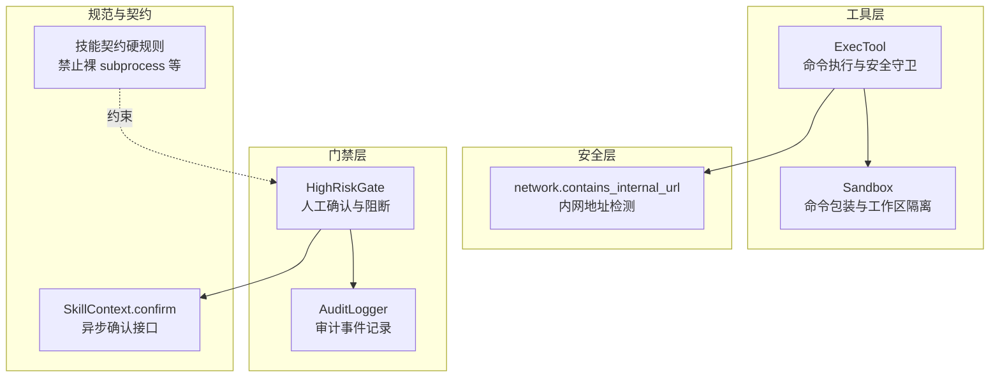
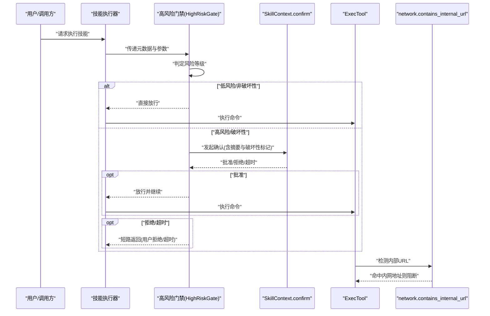
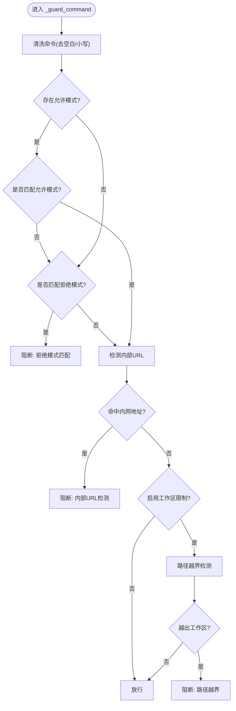
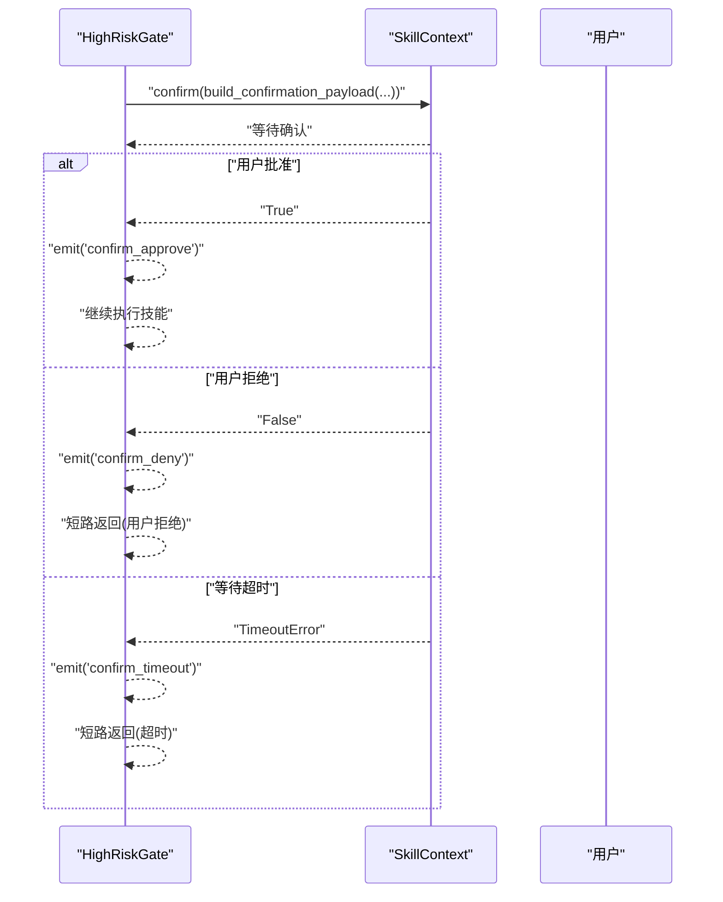
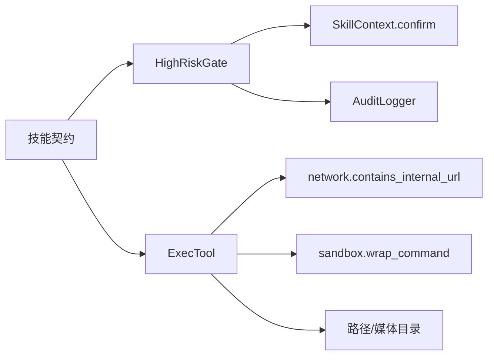

# 高危操作护栏

<cite>
**本文引用的文件**
- [shell.py](file://secbot/agent/tools/shell.py)
- [network.py](file://secbot/security/network.py)
- [high_risk.py](file://secbot/agents/high_risk.py)
- [test_high_risk_gate.py](file://tests/agent/test_high_risk_gate.py)
- [test_exec_security.py](file://tests/tools/test_exec_security.py)
- [sandbox.py](file://secbot/agent/tools/sandbox.py)
- [skill-contract.md](file://.trellis/spec/backend/skill-contract.md)
</cite>

## 目录
1. [引言](#引言)
2. [项目结构](#项目结构)
3. [核心组件](#核心组件)
4. [架构总览](#架构总览)
5. [详细组件分析](#详细组件分析)
6. [依赖分析](#依赖分析)
7. [性能考虑](#性能考虑)
8. [故障排查指南](#故障排查指南)
9. [结论](#结论)
10. [附录](#附录)

## 引言
本文件系统性阐述“高危操作护栏”机制的设计与实现，覆盖高风险动作识别算法（命令解析、威胁评估、风险评分）、人工确认流程（用户提示、确认界面、阻断策略）、高危操作类型清单、阻断策略原理（操作拦截、异常检测、自动保护）、配置示例与自定义规则方法，以及常见高危场景的处理方案与最佳实践。目标是帮助开发者与运维人员在不牺牲可用性的前提下，构建稳健的自动化工具安全边界。

## 项目结构
围绕高危操作护栏的关键模块分布如下：
- 工具层：执行工具与沙箱封装，负责命令执行、路径与URL安全检查、输出截断与超时控制。
- 安全层：网络内网地址检测，用于识别潜在的内网探测或数据外泄风险。
- 门禁层：高风险技能门禁，负责根据风险等级触发人工确认、审计记录与短路执行。
- 合同与规范：技能契约对“高风险确认”的约束，确保统一的交互与安全边界。

**图表来源**
- [shell.py:303-363](file://secbot/agent/tools/shell.py#L303-L363)
- [network.py](file://secbot/security/network.py)
- [high_risk.py:122-138](file://secbot/agents/high_risk.py#L122-L138)
- [sandbox.py](file://secbot/agent/tools/sandbox.py)
- [skill-contract.md:80-100](file://.trellis/spec/backend/skill-contract.md#L80-L100)

**章节来源**
- [shell.py:303-363](file://secbot/agent/tools/shell.py#L303-L363)
- [network.py](file://secbot/security/network.py)
- [high_risk.py:122-138](file://secbot/agents/high_risk.py#L122-L138)
- [skill-contract.md:80-100](file://.trellis/spec/backend/skill-contract.md#L80-L100)

## 核心组件
- 命令执行与安全守卫（ExecTool）
  - 拒绝模式与允许模式：通过正则匹配拒绝高危命令；允许模式优先级更高，便于白名单豁免。
  - 内部URL检测：阻断可能指向内网/元数据服务的URL。
  - 路径越界保护：在启用工作区限制时，阻止相对路径穿越与绝对路径越出工作区。
  - 输出截断与超时：限制最大输出长度与执行时间，避免资源滥用。
  - 沙箱包装：可选的命令包装以增强隔离。
- 网络内网地址检测（network.contains_internal_url）
  - 将命令中的URL解析为IP，判断是否属于私有/保留范围，从而阻断潜在的内网探测或数据回传。
- 高风险门禁（HighRiskGate）
  - 根据技能元数据的风险等级决定是否需要人工确认。
  - 提供异步确认接口调用，支持超时、拒绝与批准三种分支，并记录审计事件。
- 技能契约与确认接口（SkillContext.confirm）
  - 规定“高风险确认”必须通过上下文提供的异步确认接口完成，且关键参数需包含破坏性标记与摘要信息。

**章节来源**
- [shell.py:65-83](file://secbot/agent/tools/shell.py#L65-L83)
- [shell.py:303-363](file://secbot/agent/tools/shell.py#L303-L363)
- [network.py](file://secbot/security/network.py)
- [high_risk.py:122-138](file://secbot/agents/high_risk.py#L122-L138)
- [skill-contract.md:80-100](file://.trellis/spec/backend/skill-contract.md#L80-L100)

## 架构总览
下图展示了从技能调用到最终执行的完整链路，重点标注了“高危操作护栏”的关键节点与决策点。

**图表来源**
- [high_risk.py:122-138](file://secbot/agents/high_risk.py#L122-L138)
- [shell.py:322-325](file://secbot/agent/tools/shell.py#L322-L325)
- [skill-contract.md:80-100](file://.trellis/spec/backend/skill-contract.md#L80-L100)

## 详细组件分析

### 组件A：命令解析与威胁评估（ExecTool）
- 命令解析与预处理
  - 对输入命令进行去空白、转小写等基础处理，降低误报与漏报。
  - 支持允许/拒绝模式双轨制：若存在允许模式，则仅允许匹配的命令；否则拒绝所有匹配拒绝模式的命令。
- 威胁评估与阻断
  - 拒绝模式覆盖：文件系统破坏（递归删除、格式化、设备写入）、系统关机/重启、fork炸弹、历史状态文件写入等。
  - 内部URL检测：对命令中出现的URL进行地址解析，若命中私有/保留网段则阻断。
  - 路径越界保护：在启用工作区限制时，阻止路径穿越与绝对路径越出工作区；对内核设备文件路径做白名单豁免。
- 执行与输出
  - 通过沙箱包装增强隔离；限制最大输出长度与超时；平台差异处理（Windows/cmd 与类Unix/bash）。
  - 返回标准化结果，包含退出码与可选的错误信息。

**图表来源**
- [shell.py:303-363](file://secbot/agent/tools/shell.py#L303-L363)

**章节来源**
- [shell.py:65-83](file://secbot/agent/tools/shell.py#L65-L83)
- [shell.py:303-363](file://secbot/agent/tools/shell.py#L303-L363)
- [network.py](file://secbot/security/network.py)

### 组件B：人工确认流程（HighRiskGate 与 SkillContext.confirm）
- 确认触发条件
  - 当技能元数据的风险等级为“critical”时，门禁强制要求人工确认。
- 用户提示与确认界面
  - 通过上下文提供的异步确认接口传递结构化负载，包含技能名、风险等级、破坏性标记、扫描ID、摘要与参数。
- 阻断策略
  - 超时：等待确认超时即短路返回，标记为“confirm_timeout”。
  - 拒绝：用户明确拒绝即短路返回，标记为“denied”。
  - 批准：记录“confirm_approve”，继续执行技能。
- 审计日志
  - 记录“confirm_request/confirm_approve/confirm_deny/confirm_timeout”等事件，便于追踪与合规。

**图表来源**
- [high_risk.py:122-138](file://secbot/agents/high_risk.py#L122-L138)
- [test_high_risk_gate.py:61-97](file://tests/agent/test_high_risk_gate.py#L61-L97)
- [skill-contract.md:80-100](file://.trellis/spec/backend/skill-contract.md#L80-L100)

**章节来源**
- [high_risk.py:122-138](file://secbot/agents/high_risk.py#L122-L138)
- [test_high_risk_gate.py:61-97](file://tests/agent/test_high_risk_gate.py#L61-L97)

### 组件C：阻断策略与自动保护机制
- 操作拦截
  - 拒绝模式与允许模式：通过正则精确拦截高危命令。
  - 内部URL检测：阻断可能泄露内网信息或探测内网的服务。
  - 路径越界保护：防止命令访问工作区之外的路径，结合内核设备文件白名单避免误伤。
- 异常检测
  - 路径穿越检测：识别“../”或“..\"等穿越序列。
  - 绝对路径越界：对解析后的绝对路径进行归属校验。
- 自动保护
  - 输出截断与超时：限制输出长度与执行时间，避免资源耗尽。
  - 沙箱包装：在支持平台上对命令进行工作区隔离与权限收敛。

**章节来源**
- [shell.py:303-363](file://secbot/agent/tools/shell.py#L303-L363)
- [test_exec_security.py:54-70](file://tests/tools/test_exec_security.py#L54-L70)

## 依赖分析
- ExecTool 依赖
  - 安全网络模块：用于内部URL检测。
  - 沙箱模块：用于命令包装与工作区隔离。
  - 路径工具：用于媒体目录与工作区边界计算。
- HighRiskGate 依赖
  - 技能上下文：提供异步确认接口。
  - 审计日志：记录确认事件。
- 技能契约
  - 硬规则约束：禁止裸 subprocess，要求通过受控工具执行外部命令。

**图表来源**
- [shell.py:322-325](file://secbot/agent/tools/shell.py#L322-L325)
- [high_risk.py:122-138](file://secbot/agents/high_risk.py#L122-L138)
- [skill-contract.md:94-95](file://.trellis/spec/backend/skill-contract.md#L94-L95)

**章节来源**
- [shell.py:322-325](file://secbot/agent/tools/shell.py#L322-L325)
- [high_risk.py:122-138](file://secbot/agents/high_risk.py#L122-L138)
- [skill-contract.md:94-95](file://.trellis/spec/backend/skill-contract.md#L94-L95)

## 性能考虑
- 正则匹配复杂度：拒绝/允许模式数量与正则复杂度直接影响守卫开销。建议：
  - 使用尽可能具体的正则，减少回溯。
  - 将高频匹配项置于列表前部。
- URL解析成本：内网地址检测涉及DNS解析或地址映射，建议：
  - 缓存解析结果（在进程生命周期内）。
  - 对已知公共域名使用白名单快速放行。
- I/O 与超时：输出截断与超时可有效避免长时间阻塞；建议：
  - 根据任务特性调整超时阈值。
  - 对长任务采用分阶段输出与进度上报。
- 沙箱开销：在支持平台上启用沙箱会带来额外开销，建议：
  - 仅在高风险命令或跨信任域场景启用。
  - 合理复用沙箱环境。

## 故障排查指南
- 命令被错误阻断
  - 检查是否命中拒绝模式或允许模式未正确配置。
  - 若确需豁免，使用允许模式正则精确放行，避免放宽拒绝模式。
  - 参考测试用例验证公共URL放行逻辑。
- 内部URL误报
  - 确认URL是否确实指向私有/保留网段。
  - 在可信场景下，可通过允许模式或网络白名单规避。
- 路径越界告警
  - 确认工作区根目录与当前工作目录解析是否正确。
  - 检查是否存在符号链接绕过，必要时关闭允许模式或收紧策略。
- 确认超时或拒绝
  - 检查确认接口是否在超时时间内返回。
  - 若频繁拒绝，优化用户提示与参数摘要，提升透明度。
- 审计缺失
  - 确认审计事件名称是否符合规范（confirm_request/confirm_approve/confirm_deny/confirm_timeout）。

**章节来源**
- [test_exec_security.py:54-70](file://tests/tools/test_exec_security.py#L54-L70)
- [test_high_risk_gate.py:100-117](file://tests/agent/test_high_risk_gate.py#L100-L117)
- [high_risk.py:122-138](file://secbot/agents/high_risk.py#L122-L138)

## 结论
高危操作护栏通过“命令解析与威胁评估 + 人工确认 + 自动阻断与保护”的三层机制，实现了对破坏性与高风险操作的强约束。ExecTool 的多维守卫、network 的内网检测、HighRiskGate 的确认与审计，共同构成可配置、可观测、可追溯的安全边界。遵循技能契约与最佳实践，可在保障自动化效率的同时，显著降低误操作与恶意利用的风险。

## 附录

### 高危操作类型清单（示例）
- 文件系统破坏
  - 递归删除、格式化磁盘、写入系统设备、修改/删除历史状态文件
- 系统控制
  - 关机/重启/休眠
- 安全破坏
  - fork炸弹、内网探测与数据回传
- 路径与环境
  - 路径穿越、越出工作区、重定向至内核设备文件

**章节来源**
- [shell.py:65-83](file://secbot/agent/tools/shell.py#L65-L83)
- [shell.py:327-361](file://secbot/agent/tools/shell.py#L327-L361)

### 配置示例与自定义规则
- 允许/拒绝模式
  - 在工具初始化时传入允许/拒绝正则列表，允许模式优先于拒绝模式。
  - 示例参考：[shell.py:65-83](file://secbot/agent/tools/shell.py#L65-L83)
- 工作区限制
  - 启用 restrict_to_workspace，确保命令只能作用于工作区根及其子目录。
  - 示例参考：[shell.py:134-147](file://secbot/agent/tools/shell.py#L134-L147)
- 超时与输出截断
  - 通过工具参数设置超时与最大输出长度，避免资源滥用。
  - 示例参考：[shell.py:93-95](file://secbot/agent/tools/shell.py#L93-L95)
- 沙箱包装
  - 在支持平台上启用沙箱，对命令进行工作区隔离与权限收敛。
  - 示例参考：[sandbox.py](file://secbot/agent/tools/sandbox.py)

**章节来源**
- [shell.py:65-83](file://secbot/agent/tools/shell.py#L65-L83)
- [shell.py:134-147](file://secbot/agent/tools/shell.py#L134-L147)
- [shell.py:93-95](file://secbot/agent/tools/shell.py#L93-L95)
- [sandbox.py](file://secbot/agent/tools/sandbox.py)

### 常见高危场景与最佳实践
- 场景一：批量删除构建产物
  - 使用允许模式精确放行特定目录下的删除命令，避免放宽拒绝模式。
  - 参考：[shell.py:311-320](file://secbot/agent/tools/shell.py#L311-L320)
- 场景二：内网服务探测
  - 通过内网地址检测阻断可疑URL，必要时在可信代理后执行。
  - 参考：[shell.py:322-325](file://secbot/agent/tools/shell.py#L322-L325)，[network.py](file://secbot/security/network.py)
- 场景三：跨目录访问
  - 启用工作区限制并严格校验工作目录解析，防止路径穿越。
  - 参考：[shell.py:327-361](file://secbot/agent/tools/shell.py#L327-L361)
- 场景四：高风险扫描技能
  - 将风险等级设为“critical”，在门禁处强制人工确认，记录审计事件。
  - 参考：[high_risk.py:122-138](file://secbot/agents/high_risk.py#L122-L138)，[test_high_risk_gate.py:61-97](file://tests/agent/test_high_risk_gate.py#L61-L97)

**章节来源**
- [shell.py:311-320](file://secbot/agent/tools/shell.py#L311-L320)
- [shell.py:322-325](file://secbot/agent/tools/shell.py#L322-L325)
- [shell.py:327-361](file://secbot/agent/tools/shell.py#L327-L361)
- [high_risk.py:122-138](file://secbot/agents/high_risk.py#L122-L138)
- [test_high_risk_gate.py:61-97](file://tests/agent/test_high_risk_gate.py#L61-L97)