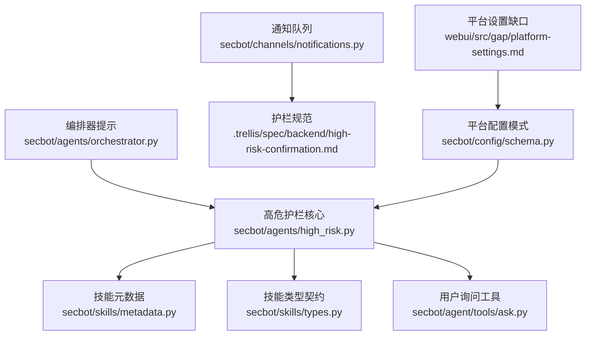
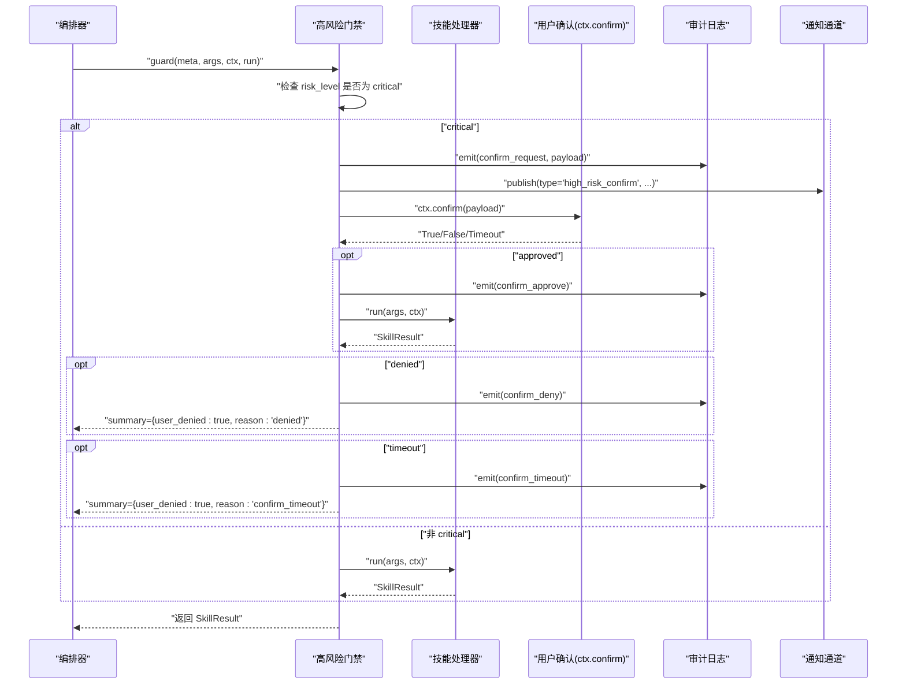
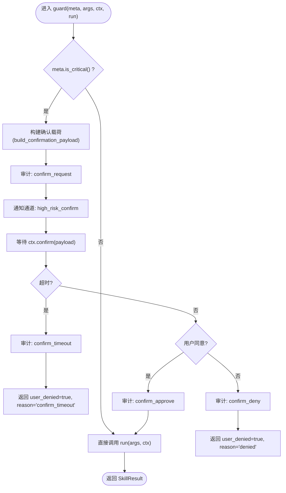
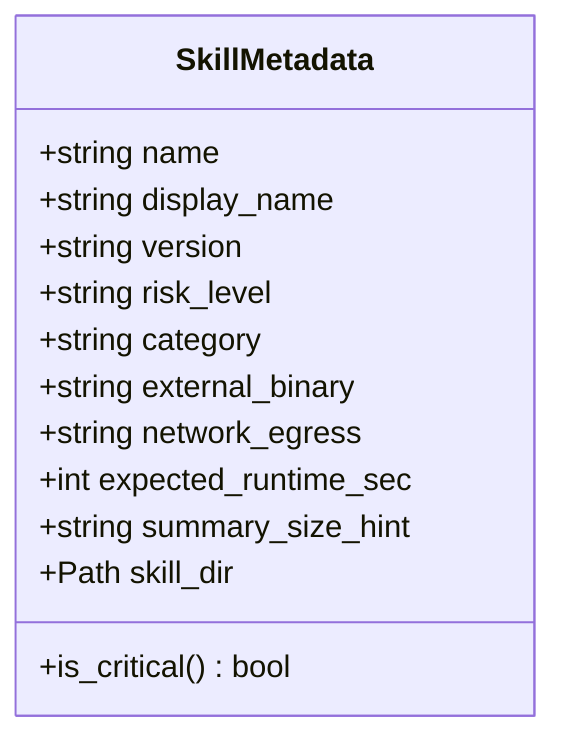
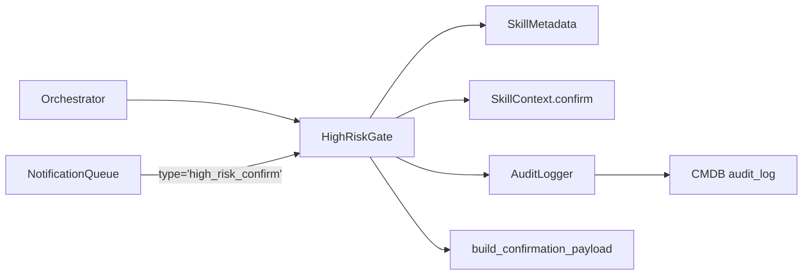

# 高危操作护栏

<cite>
**本文引用的文件**
- [secbot/agents/high_risk.py](file://secbot/agents/high_risk.py)
- [.trellis/spec/backend/high-risk-confirmation.md](file://.trellis/spec/backend/high-risk-confirmation.md)
- [secbot/skills/metadata.py](file://secbot/skills/metadata.py)
- [secbot/skills/types.py](file://secbot/skills/types.py)
- [secbot/agent/tools/ask.py](file://secbot/agent/tools/ask.py)
- [secbot/agents/orchestrator.py](file://secbot/agents/orchestrator.py)
- [secbot/channels/notifications.py](file://secbot/channels/notifications.py)
- [tests/agent/test_high_risk_gate.py](file://tests/agent/test_high_risk_gate.py)
- [secbot/config/schema.py](file://secbot/config/schema.py)
- [webui/src/gap/platform-settings.md](file://webui/src/gap/platform-settings.md)
- [.trellis/spec/backend/cmdb-schema.md](file://.trellis/spec/backend/cmdb-schema.md)
- [secbot/cmdb/models.py](file://secbot/cmdb/models.py)
- [secbot/cmdb/migrations/versions/20260507_initial.py](file://secbot/cmdb/migrations/versions/20260507_initial.py)
- [secbot/cmdb/migrations/versions/20260510_report_meta.py](file://secbot/cmdb/migrations/versions/20260510_report_meta.py)
</cite>

## 目录
1. [引言](#引言)
2. [项目结构](#项目结构)
3. [核心组件](#核心组件)
4. [架构总览](#架构总览)
5. [详细组件分析](#详细组件分析)
6. [依赖分析](#依赖分析)
7. [性能考虑](#性能考虑)
8. [故障排查指南](#故障排查指南)
9. [结论](#结论)
10. [附录](#附录)

## 引言
本技术文档围绕 VAPT3 的“高危操作护栏”系统，系统性阐述高危操作识别机制、人工确认流程、审计日志记录、权限与审批控制、配置与定制、监控与告警，以及在不同场景下的应用与效果。该护栏以“风险等级”为核心判定依据，对关键风险技能（critical）在执行前强制进行用户确认，并通过结构化事件与审计日志确保可追溯、可观测、可治理。

## 项目结构
高危护栏涉及后端核心逻辑、技能元数据、前端通知通道、配置与迁移等多个模块。下图给出与高危护栏直接相关的文件与职责概览：

图表来源
- [secbot/agents/high_risk.py:1-139](file://secbot/agents/high_risk.py#L1-L139)
- [secbot/skills/metadata.py:1-147](file://secbot/skills/metadata.py#L1-L147)
- [secbot/skills/types.py:1-87](file://secbot/skills/types.py#L1-L87)
- [secbot/agent/tools/ask.py:1-137](file://secbot/agent/tools/ask.py#L1-L137)
- [secbot/agents/orchestrator.py:1-70](file://secbot/agents/orchestrator.py#L1-L70)
- [secbot/channels/notifications.py:1-385](file://secbot/channels/notifications.py#L1-L385)
- [.trellis/spec/backend/high-risk-confirmation.md:1-94](file://.trellis/spec/backend/high-risk-confirmation.md#L1-L94)
- [secbot/config/schema.py:1-376](file://secbot/config/schema.py#L1-L376)
- [webui/src/gap/platform-settings.md:1-28](file://webui/src/gap/platform-settings.md#L1-L28)

章节来源
- [secbot/agents/high_risk.py:1-139](file://secbot/agents/high_risk.py#L1-L139)
- [.trellis/spec/backend/high-risk-confirmation.md:1-94](file://.trellis/spec/backend/high-risk-confirmation.md#L1-L94)

## 核心组件
- 高风险门禁（HighRiskGate）：在 critical 技能执行前发起用户确认，支持超时与审计记录；低风险技能直接放行。
- 审计日志（AuditLogger）：记录确认请求、批准、拒绝、超时等事件，支持内存态或生产落地（CMDB）。
- 确认载荷构建（build_confirmation_payload）：生成结构化的 high_risk_confirm 事件，包含技能名、风险等级、摘要、参数、预估时长等。
- 技能元数据（SkillMetadata）：提供 risk_level 判定与 expected_runtime_sec 等运行时信息。
- 用户确认接口（SkillContext.confirm）：由运行时注入，等待用户响应（阻塞直到确认或超时）。
- 编排器规则：明确要求在调用 critical 技能前必须请求高危确认，不得绕过。
- 通知通道：允许将 high_risk_confirm 事件作为通知类型广播至前端（Navbar 钟铃）。

章节来源
- [secbot/agents/high_risk.py:93-139](file://secbot/agents/high_risk.py#L93-L139)
- [secbot/skills/metadata.py:23-37](file://secbot/skills/metadata.py#L23-L37)
- [secbot/skills/types.py:57-87](file://secbot/skills/types.py#L57-L87)
- [secbot/agents/orchestrator.py:22-32](file://secbot/agents/orchestrator.py#L22-L32)
- [secbot/channels/notifications.py:43-48](file://secbot/channels/notifications.py#L43-L48)

## 架构总览
下图展示从专家代理到技能执行的高危护栏流程，包括确认触发、用户交互、结果回传与审计记录：

图表来源
- [secbot/agents/high_risk.py:103-139](file://secbot/agents/high_risk.py#L103-L139)
- [secbot/channels/notifications.py:143-171](file://secbot/channels/notifications.py#L143-L171)
- [secbot/agents/orchestrator.py:27-29](file://secbot/agents/orchestrator.py#L27-L29)

## 详细组件分析

### 组件A：高风险门禁与确认流程
- 设计要点
  - 仅对 risk_level=critical 的技能触发确认；低/中/高风险直接放行。
  - 构建结构化确认载荷，包含技能名、显示名、风险等级、摘要、参数、预估时长、破坏性标记、扫描ID等。
  - 记录 confirm_request；根据用户响应分别记录 confirm_approve、confirm_deny；超时记录 confirm_timeout。
  - 默认超时时间为 120 秒，可通过 gate.timeout_sec 调整。
- 用户交互
  - 通过 ctx.confirm(payload) 阻塞等待用户确认；支持超时与拒绝两种路径。
  - 编排器明确禁止绕过确认，必须由专家代理调用前请求确认。
- 审计与日志
  - 内存态审计器默认记录；生产环境可对接 CMDB audit_log 表（见 CMDB 规范）。
- 单元测试覆盖
  - 低风险技能直接通过、critical 审核记录 approve/deny/timeout 三类路径均被测试覆盖。

图表来源
- [secbot/agents/high_risk.py:103-139](file://secbot/agents/high_risk.py#L103-L139)
- [secbot/channels/notifications.py:143-171](file://secbot/channels/notifications.py#L143-L171)

章节来源
- [secbot/agents/high_risk.py:93-139](file://secbot/agents/high_risk.py#L93-L139)
- [tests/agent/test_high_risk_gate.py:42-118](file://tests/agent/test_high_risk_gate.py#L42-L118)
- [.trellis/spec/backend/high-risk-confirmation.md:23-61](file://.trellis/spec/backend/high-risk-confirmation.md#L23-L61)

### 组件B：技能元数据与风险等级
- 元数据来源
  - 从 SKILL.md YAML Front Matter 解析技能元数据，包含 name、display_name、version、risk_level、category、external_binary、network_egress、expected_runtime_sec、summary_size_hint、skill_dir。
- 风险等级校验
  - 仅允许 low/medium/high/critical 四个值；is_critical() 用于快速判定。
- 运行时信息
  - expected_runtime_sec 用于确认载荷中的预估时长字段。

图表来源
- [secbot/skills/metadata.py:23-37](file://secbot/skills/metadata.py#L23-L37)

章节来源
- [secbot/skills/metadata.py:19-114](file://secbot/skills/metadata.py#L19-L114)

### 组件C：确认载荷与通知类型
- 载荷字段
  - type: high_risk_confirm
  - skill/display_name/risk_level/summary_for_user/args/estimated_duration_sec/destructive_action/scan_id
- 通知类型
  - ALLOWED_TYPES 包含 "high_risk_confirm"，可用于前端通知面板展示。

章节来源
- [secbot/agents/high_risk.py:65-86](file://secbot/agents/high_risk.py#L65-L86)
- [secbot/channels/notifications.py:43-48](file://secbot/channels/notifications.py#L43-L48)
- [.trellis/spec/backend/high-risk-confirmation.md:32-46](file://.trellis/spec/backend/high-risk-confirmation.md#L32-L46)

### 组件D：编排器规则与专家代理
- 编排器硬规则明确：在调用 critical 技能前必须请求高危确认，且不得由编排器自行构造技能调用绕过确认。
- 专家代理负责实际调用与门禁拦截，确保每次 critical 技能执行前均经过用户确认。

章节来源
- [secbot/agents/orchestrator.py:22-32](file://secbot/agents/orchestrator.py#L22-L32)

### 组件E：审计日志与 CMDB 存储
- 审计记录字段
  - scan_id、skill、action（confirm_request/approve/deny/timeout）、payload、ts
- CMDB 规范
  - 规范中定义了 audit_log 表的字段与约束，护栏当前使用内存态审计器；生产落地可替换为 CMDB 持久化。
- 迁移与模型
  - 初始迁移与 report_meta 迁移文件存在，表明 CMDB 支持持续演进。

章节来源
- [secbot/agents/high_risk.py:30-63](file://secbot/agents/high_risk.py#L30-L63)
- [.trellis/spec/backend/high-risk-confirmation.md:64-75](file://.trellis/spec/backend/high-risk-confirmation.md#L64-L75)
- [.trellis/spec/backend/cmdb-schema.md:1-37](file://.trellis/spec/backend/cmdb-schema.md#L1-L37)
- [secbot/cmdb/models.py:177-219](file://secbot/cmdb/models.py#L177-L219)
- [secbot/cmdb/migrations/versions/20260507_initial.py:23-42](file://secbot/cmdb/migrations/versions/20260507_initial.py#L23-L42)
- [secbot/cmdb/migrations/versions/20260510_report_meta.py:1-21](file://secbot/cmdb/migrations/versions/20260510_report_meta.py#L1-L21)

### 组件F：配置与定制
- 平台配置模式
  - 提供统一的配置模式（Pydantic），可扩展平台级开关（如 require_approval_for_critical）。
- 平台设置缺口
  - 前端缺口文档建议提供 /api/platform/config 的读写端点，支持编辑扫描并发、默认超时、是否需要对 critical 技能强制审批等。
- 高危护栏可定制点
  - 超时时间（gate.timeout_sec）
  - 确认摘要函数（gate.summary_fn）
  - 风险等级阈值（由 SKILL.md risk_level 决定）

章节来源
- [secbot/config/schema.py:267-376](file://secbot/config/schema.py#L267-L376)
- [webui/src/gap/platform-settings.md:10-27](file://webui/src/gap/platform-settings.md#L10-L27)
- [secbot/agents/high_risk.py:97-101](file://secbot/agents/high_risk.py#L97-L101)

## 依赖分析
- 组件耦合
  - HighRiskGate 依赖 SkillMetadata（风险判定）、SkillContext（确认回调）、AuditLogger（审计）、build_confirmation_payload（载荷）。
  - 编排器通过硬规则约束专家代理必须请求确认。
  - 通知通道与护栏事件类型强关联。
- 外部依赖
  - CMDB 为审计日志提供持久化能力（当前内存态，可替换）。
  - 前端通过通知通道接收 high_risk_confirm 事件。

图表来源
- [secbot/agents/high_risk.py:93-139](file://secbot/agents/high_risk.py#L93-L139)
- [secbot/agents/orchestrator.py:27-29](file://secbot/agents/orchestrator.py#L27-L29)
- [secbot/channels/notifications.py:143-171](file://secbot/channels/notifications.py#L143-L171)

## 性能考虑
- 确认等待为阻塞 I/O，会占用一次循环的处理时间；建议合理设置超时（默认 120s）。
- 通知队列为有界环形缓冲，避免内存膨胀；可通过环境变量调节容量与窗口。
- 审计日志默认内存态，高频场景建议接入 CMDB 持久化，避免丢失。

## 故障排查指南
- 症状：critical 技能未触发确认即执行
  - 排查：确认 SKILL.md 中 risk_level 是否为 critical；编排器是否绕过了 gate。
- 症状：确认界面未出现
  - 排查：确认 ctx.confirm 是否被正确注入；前端通知通道是否订阅 high_risk_confirm 类型。
- 症状：审计日志缺失
  - 排查：确认 AuditLogger 是否被替换为 CMDB 实现；gate.audit.emit 是否被调用。
- 症状：超时频繁
  - 排查：适当提高 gate.timeout_sec；优化技能预期时长（expected_runtime_sec）。

章节来源
- [tests/agent/test_high_risk_gate.py:42-118](file://tests/agent/test_high_risk_gate.py#L42-L118)
- [secbot/agents/high_risk.py:122-131](file://secbot/agents/high_risk.py#L122-L131)

## 结论
VAPT3 的高危护栏以“风险等级”为入口，结合编排器规则、结构化确认载荷与审计日志，形成闭环的安全控制链路。通过可配置的超时与摘要函数、可扩展的通知通道与平台配置，系统既满足 MVP 的可审计与可视化需求，也为未来多租户、审批流与更细粒度的权限控制预留了空间。

## 附录

### 风险等级与触发条件对照
- low/medium：无需确认，直接执行
- high：记录日志（非阻塞）
- critical：必须确认，阻塞执行，支持 approve/deny/timeout 三种结果

章节来源
- [.trellis/spec/backend/high-risk-confirmation.md:8-18](file://.trellis/spec/backend/high-risk-confirmation.md#L8-L18)

### 审计日志字段定义（CMDB 规范）
- 字段：id、scan_id、skill、action、payload_json、created_at
- 约束：action ∈ {confirm_request, confirm_approve, confirm_deny, confirm_timeout}

章节来源
- [.trellis/spec/backend/high-risk-confirmation.md:68-72](file://.trellis/spec/backend/high-risk-confirmation.md#L68-L72)

### 通知类型与前端集成
- 允许类型：critical_vuln、scan_failed、scan_completed、high_risk_confirm
- 前端缺口：提供 /api/platform/config 读写端点，支持编辑平台全局配置（如是否强制审批 critical 技能）

章节来源
- [secbot/channels/notifications.py:43-48](file://secbot/channels/notifications.py#L43-L48)
- [webui/src/gap/platform-settings.md:10-27](file://webui/src/gap/platform-settings.md#L10-L27)