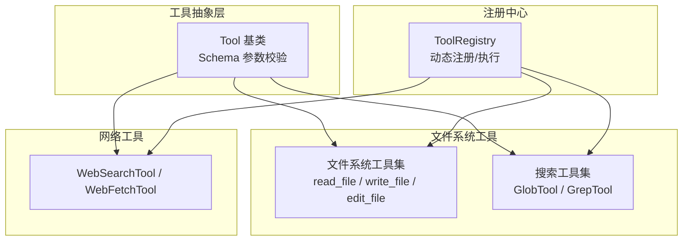
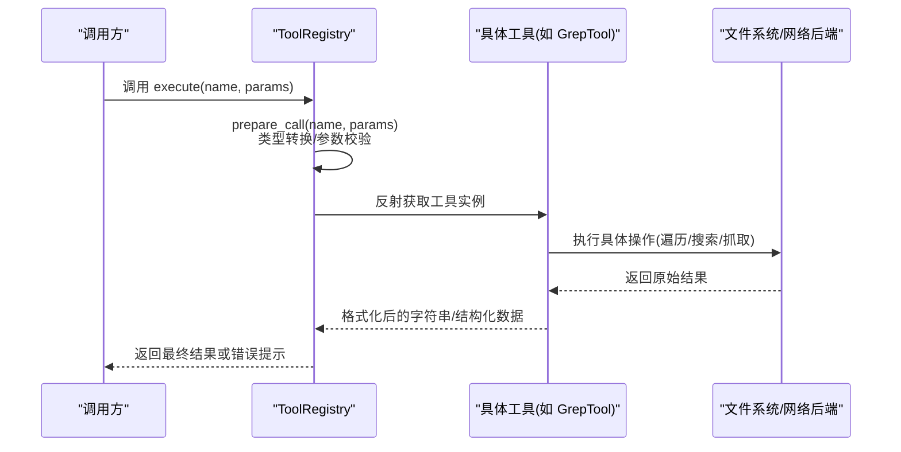
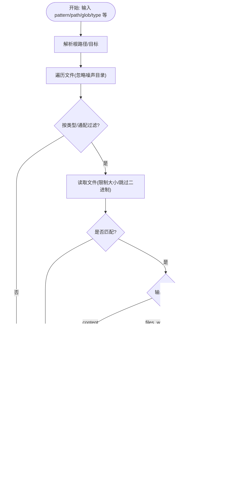
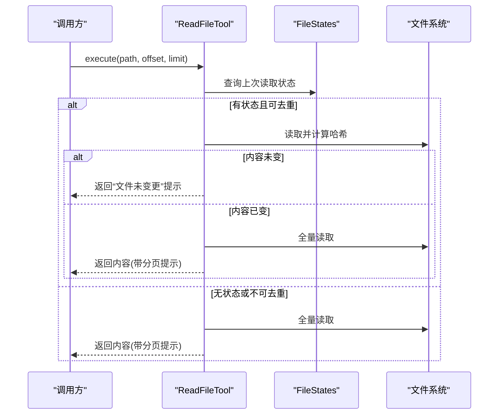
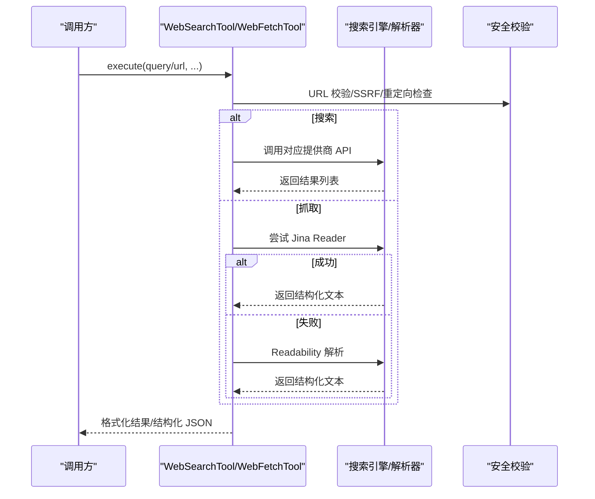
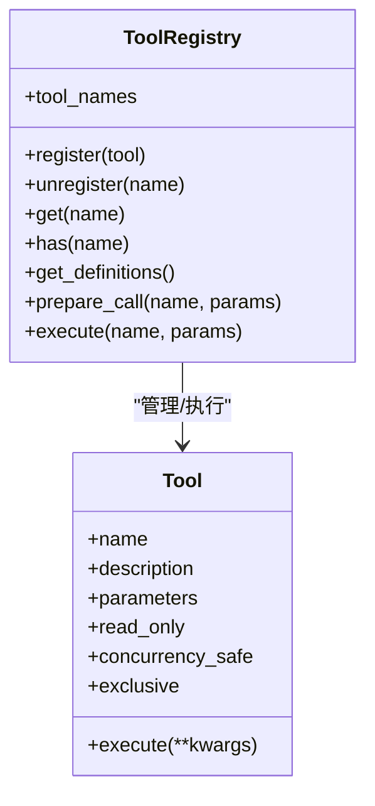
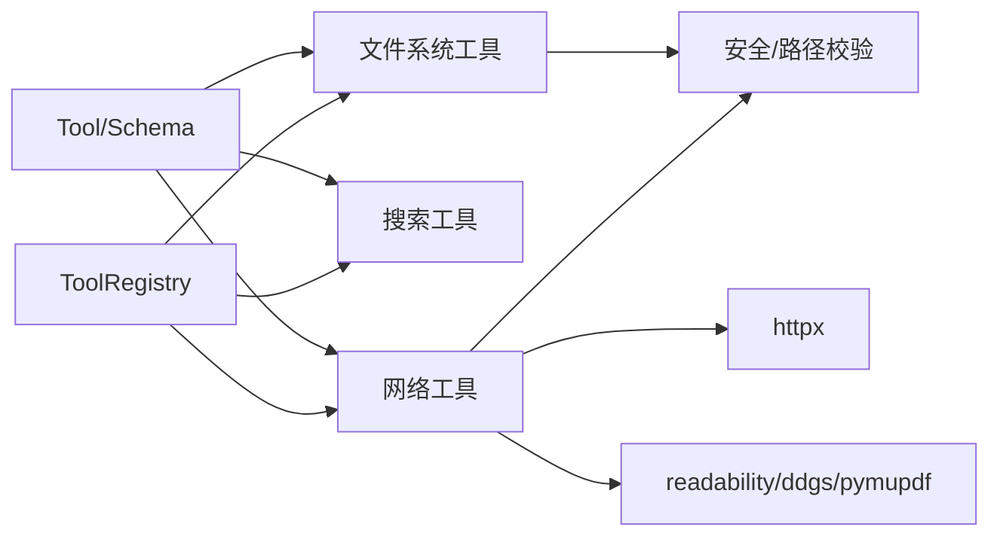

# 信息收集工具

<cite>
**本文引用的文件**
- [search.py](file://secbot/agent/tools/search.py)
- [base.py](file://secbot/agent/tools/base.py)
- [filesystem.py](file://secbot/agent/tools/filesystem.py)
- [web.py](file://secbot/agent/tools/web.py)
- [registry.py](file://secbot/agent/tools/registry.py)
- [SKILL.md（天气）](file://secbot/skills/weather/SKILL.md)
- [SKILL.md（GitHub）](file://secbot/skills/github/SKILL.md)
</cite>

## 目录
1. [简介](#简介)
2. [项目结构](#项目结构)
3. [核心组件](#核心组件)
4. [架构总览](#架构总览)
5. [详细组件分析](#详细组件分析)
6. [依赖分析](#依赖分析)
7. [性能考虑](#性能考虑)
8. [故障排查指南](#故障排查指南)
9. [结论](#结论)
10. [附录](#附录)

## 简介
本文件系统化梳理“信息收集工具”的功能与实现，重点覆盖以下方面：
- 文件系统检索：基于通配符与内容匹配的搜索能力
- 网络信息采集：网页搜索与页面抓取
- 工具注册与调用：统一的工具定义、参数校验与执行框架
- 缓存与去重：文件读取的去重策略与状态记录
- 异常与安全：URL 校验、SSRF 防护、权限与边界控制
- 使用示例与最佳实践：参数配置、结果过滤与排序、输出格式转换

## 项目结构
围绕“信息收集”目标，相关模块主要分布在 secbot/agent/tools 下，采用“抽象基类 + 具体工具 + 注册中心”的分层设计：
- 抽象层：工具接口与参数校验
- 工具层：文件系统工具、网络工具、搜索工具
- 注册层：动态注册、参数准备与执行调度

图表来源
- [base.py:117-280](file://secbot/agent/tools/base.py#L117-L280)
- [filesystem.py:54-800](file://secbot/agent/tools/filesystem.py#L54-L800)
- [search.py:91-555](file://secbot/agent/tools/search.py#L91-L555)
- [web.py:83-519](file://secbot/agent/tools/web.py#L83-L519)
- [registry.py:8-126](file://secbot/agent/tools/registry.py#L8-L126)

章节来源
- [base.py:1-280](file://secbot/agent/tools/base.py#L1-L280)
- [filesystem.py:1-930](file://secbot/agent/tools/filesystem.py#L1-L930)
- [search.py:1-555](file://secbot/agent/tools/search.py#L1-L555)
- [web.py:1-519](file://secbot/agent/tools/web.py#L1-L519)
- [registry.py:1-126](file://secbot/agent/tools/registry.py#L1-L126)

## 核心组件
- 工具抽象与参数校验
  - Tool 抽象类定义工具名称、描述、参数模式、只读属性、并发特性与执行接口
  - Schema 提供 JSON Schema 验证与类型转换，支持整数/数字/布尔/字符串/数组/对象等
- 文件系统工具
  - ReadFileTool：文本、图片、PDF、Office 文档读取；支持行号分页与大小限制；具备读取去重与状态记录
  - WriteFileTool/EditFileTool：写入与编辑文件，支持多级匹配与缩进/引号风格保留
- 搜索工具
  - GlobTool：基于 glob 模式匹配文件路径，按修改时间倒序返回
  - GrepTool：基于正则或纯文本在文件内容中搜索，支持按类型/通配过滤、上下文行、计数模式与分页
- 网络工具
  - WebSearchTool：聚合多个搜索引擎（Brave/DuckDuckGo/Tavily/SearXNG/Jina/Kagi/OloStep），自动回退与限流
  - WebFetchTool：从 URL 抓取并抽取可读内容（Markdown/纯文本），支持 Jina Reader 与本地 Readability 解析
- 工具注册中心
  - ToolRegistry：动态注册/注销工具；参数类型转换与校验；统一执行入口与错误提示

章节来源
- [base.py:117-280](file://secbot/agent/tools/base.py#L117-L280)
- [filesystem.py:148-800](file://secbot/agent/tools/filesystem.py#L148-L800)
- [search.py:134-555](file://secbot/agent/tools/search.py#L134-L555)
- [web.py:83-519](file://secbot/agent/tools/web.py#L83-L519)
- [registry.py:8-126](file://secbot/agent/tools/registry.py#L8-L126)

## 架构总览
信息收集工具通过统一的工具接口与注册中心进行编排，形成“参数解析 → 工具选择 → 执行 → 结果返回”的闭环。

图表来源
- [registry.py:73-126](file://secbot/agent/tools/registry.py#L73-L126)
- [base.py:117-280](file://secbot/agent/tools/base.py#L117-L280)
- [search.py:378-555](file://secbot/agent/tools/search.py#L378-L555)
- [web.py:136-519](file://secbot/agent/tools/web.py#L136-L519)
- [filesystem.py:174-800](file://secbot/agent/tools/filesystem.py#L174-L800)

## 详细组件分析

### 文件系统搜索：GlobTool 与 GrepTool
- 功能与特性
  - GlobTool：支持相对路径与递归目录扫描，按修改时间倒序返回匹配项；支持跳过噪声目录；支持分页与偏移
  - GrepTool：支持正则/纯文本、大小写敏感、固定字符串模式；支持按类型/通配过滤；支持三种输出模式（仅文件、匹配行块、计数）
- 数据获取流程
  - 解析路径与过滤条件 → 遍历文件 → 过滤二进制/超大文件 → 正则匹配 → 上下文拼接/计数统计 → 分页与截断
- 排序与过滤
  - GlobTool：按 mtime 倒序；文件名字典序次序
  - GrepTool：files_with_matches/count 按 mtime 倒序；content 模式按出现顺序与上下文块
- 输出格式与截断
  - GlobTool：路径列表 + 分页注释
  - GrepTool：content 模式为“文件:行号”块；files_with_matches/count 模式为路径/计数列表；超过最大字符数时截断
- 安全与健壮性
  - 忽略二进制与超大文件；捕获权限错误与通用异常；提供“跳过二进制/大文件”统计注释

图表来源
- [search.py:194-555](file://secbot/agent/tools/search.py#L194-L555)

章节来源
- [search.py:134-555](file://secbot/agent/tools/search.py#L134-L555)

### 文件系统读取与编辑：ReadFileTool / EditFileTool
- 读取去重策略
  - 基于上次读取的 offset/limit/mtime/content_hash 判断是否可复用；若外部修改则强制全量读取
  - 对相同路径+范围+未变 mtime 的情况，返回“文件未变更”提示
- 多格式支持
  - 文本：UTF-8 解码，CRLF 规范化为 LF；支持行号编号与长度截断
  - 图片：直接返回图像内容块
  - PDF/Office：通过第三方库提取文本，限制最大页数与字符数
- 编辑策略
  - 多级匹配回退（精确/去空白/智能引号/去空白对比），支持替换全部或指定位置
  - 保持缩进与引号风格一致性，避免破坏源码风格

图表来源
- [filesystem.py:174-286](file://secbot/agent/tools/filesystem.py#L174-L286)

章节来源
- [filesystem.py:148-800](file://secbot/agent/tools/filesystem.py#L148-L800)

### 网络搜索与抓取：WebSearchTool / WebFetchTool
- 搜索工具
  - 支持多提供商自动选择与回退（Brave/DuckDuckGo/Tavily/SearXNG/Jina/Kagi/OloStep）
  - DuckDuckGo 搜索串行以规避并发问题；其他提供商并发安全
  - 统一结果格式：标题/链接/摘要
- 抓取工具
  - 首先尝试 Jina Reader；失败则使用本地 Readability 解析
  - 对图片直取并返回图像内容块；对 JSON/HTML/纯文本分别处理
  - SSRF 与重定向校验；代理支持与最大重定向次数限制
  - 输出为结构化 JSON（包含 URL、最终 URL、状态码、提取器、截断标记、文本）

图表来源
- [web.py:136-519](file://secbot/agent/tools/web.py#L136-L519)

章节来源
- [web.py:83-519](file://secbot/agent/tools/web.py#L83-L519)

### 工具注册与调用：ToolRegistry
- 动态注册/注销工具，保持定义缓存以稳定提示顺序
- 执行前进行参数类型转换与 JSON Schema 校验，异常时返回可读错误
- 统一异常包装，追加提示建议

图表来源
- [base.py:117-280](file://secbot/agent/tools/base.py#L117-L280)
- [registry.py:8-126](file://secbot/agent/tools/registry.py#L8-L126)

章节来源
- [registry.py:1-126](file://secbot/agent/tools/registry.py#L1-L126)
- [base.py:1-280](file://secbot/agent/tools/base.py#L1-L280)

## 依赖分析
- 组件内聚与耦合
  - 工具层均继承自 Tool 抽象类，参数校验由 Schema 统一处理，降低重复逻辑
  - 文件系统工具共享 _FsTool 基类，统一路径解析与工作区边界控制
  - 网络工具依赖 httpx 与第三方解析库，内部封装了错误处理与回退策略
- 外部依赖与集成点
  - 搜索提供商：Brave、DuckDuckGo、Tavily、SearXNG、Jina、Kagi、OloStep
  - 解析库：readability、ddgs、pymupdf、httpx
  - 安全模块：网络地址校验与 SSRF 防护
- 循环依赖
  - 未发现循环导入；模块间通过工具接口与注册中心解耦

图表来源
- [base.py:117-280](file://secbot/agent/tools/base.py#L117-L280)
- [filesystem.py:54-800](file://secbot/agent/tools/filesystem.py#L54-L800)
- [search.py:91-555](file://secbot/agent/tools/search.py#L91-L555)
- [web.py:83-519](file://secbot/agent/tools/web.py#L83-L519)
- [registry.py:8-126](file://secbot/agent/tools/registry.py#L8-L126)

章节来源
- [web.py:1-519](file://secbot/agent/tools/web.py#L1-L519)
- [filesystem.py:1-930](file://secbot/agent/tools/filesystem.py#L1-L930)
- [search.py:1-555](file://secbot/agent/tools/search.py#L1-L555)
- [registry.py:1-126](file://secbot/agent/tools/registry.py#L1-L126)

## 性能考虑
- IO 与遍历
  - GlobTool 与 GrepTool 在大仓库中可能产生大量 IO；建议优先使用类型/通配过滤缩小范围
  - GrepTool 对二进制/超大文件进行快速跳过，减少无效 IO
- 并发与限流
  - DuckDuckGo 搜索串行；其他提供商并发安全但需注意 API 限速与配额
  - WebFetchTool 对 Jina Reader 429 限流进行回退
- 输出截断
  - 文件读取与搜索结果均设置最大字符数，避免单次输出过大
- 去重与缓存
  - ReadFileTool 基于 mtime 与内容哈希的去重显著减少重复读取成本

[本节为通用指导，无需列出章节来源]

## 故障排查指南
- 权限与路径
  - 文件系统工具报错多与路径越界或设备路径有关；检查工作区边界与路径解析
- 搜索失败
  - WebSearchTool 会在缺少密钥或配置不当时回退到 DuckDuckGo；确认环境变量与提供商可用性
- 抓取异常
  - WebFetchTool 对代理错误与未知异常返回结构化错误 JSON；检查代理、网络与 SSRF 校验
- 参数错误
  - ToolRegistry 在参数类型不符或缺失必填项时返回明确错误；根据提示修正参数

章节来源
- [filesystem.py:174-286](file://secbot/agent/tools/filesystem.py#L174-L286)
- [web.py:384-519](file://secbot/agent/tools/web.py#L384-L519)
- [registry.py:73-126](file://secbot/agent/tools/registry.py#L73-L126)

## 结论
该信息收集工具体系以统一抽象与注册中心为核心，结合文件系统与网络两大能力域，提供了从本地文件检索到网络信息抓取的完整链路。通过严格的参数校验、安全校验与回退策略，以及读取去重与结果截断等优化，能够在复杂场景下稳定高效地完成信息收集任务。

[本节为总结性内容，无需列出章节来源]

## 附录

### 实际使用示例与集成指南
- 文件系统搜索
  - GlobTool：用于定位特定类型/命名模式的文件，配合 head_limit/offset 实现分页浏览
  - GrepTool：用于在代码库中检索关键词，支持正则/大小写/固定字符串；content 模式可查看上下文
- 网络搜索
  - WebSearchTool：输入查询词与结果数量，自动选择可用提供商；适合快速获取外部资料
  - WebFetchTool：对特定 URL 抓取并抽取正文，适合深入阅读与二次加工
- 工具注册与调用
  - 通过 ToolRegistry 动态注册工具，统一以函数式调用方式执行；参数自动校验与类型转换

章节来源
- [search.py:134-555](file://secbot/agent/tools/search.py#L134-L555)
- [web.py:83-519](file://secbot/agent/tools/web.py#L83-L519)
- [registry.py:1-126](file://secbot/agent/tools/registry.py#L1-L126)

### 辅助工具与技能参考
- 天气信息技能
  - 参考路径：[SKILL.md（天气）](file://secbot/skills/weather/SKILL.md)
- GitHub 相关技能
  - 参考路径：[SKILL.md（GitHub）](file://secbot/skills/github/SKILL.md)

章节来源
- [SKILL.md（天气）](file://secbot/skills/weather/SKILL.md)
- [SKILL.md（GitHub）](file://secbot/skills/github/SKILL.md)