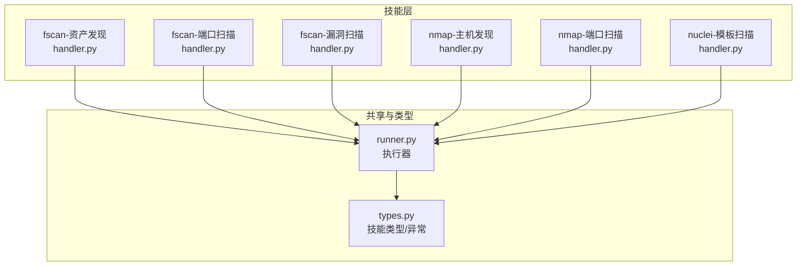
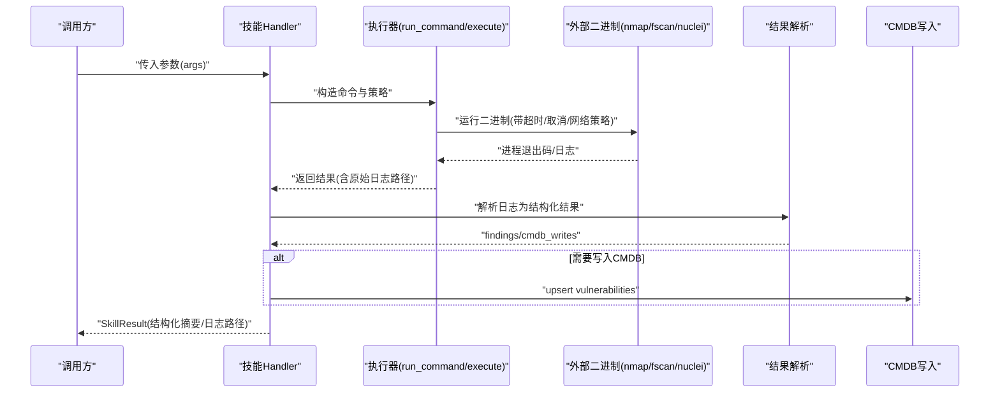
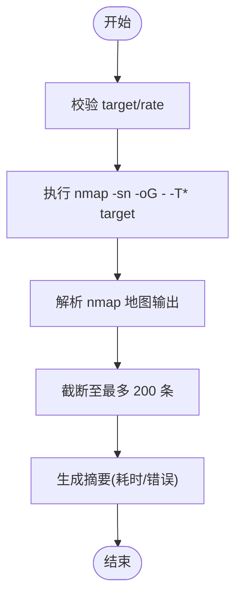
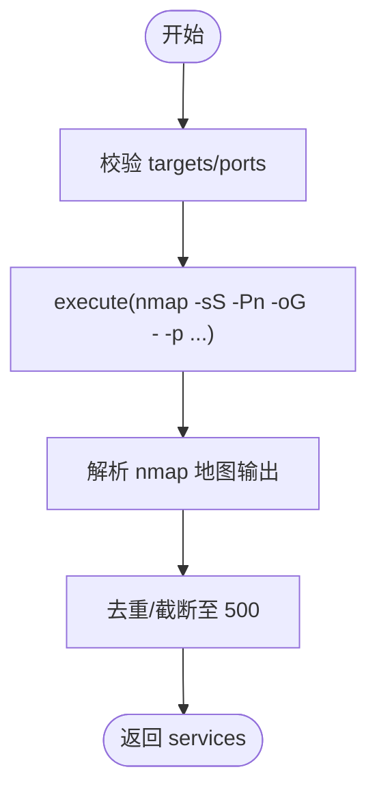
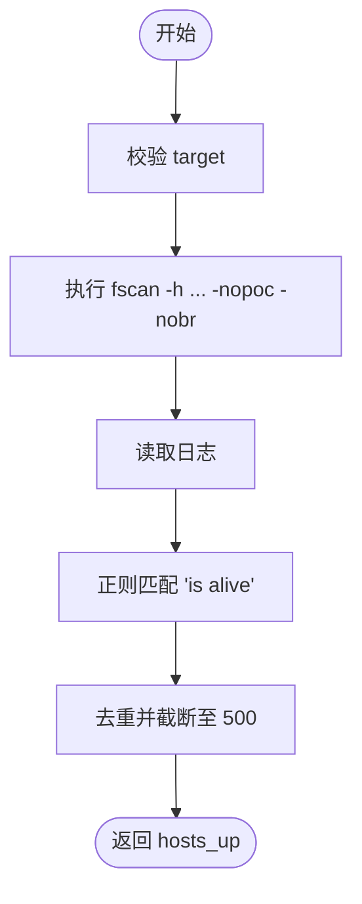
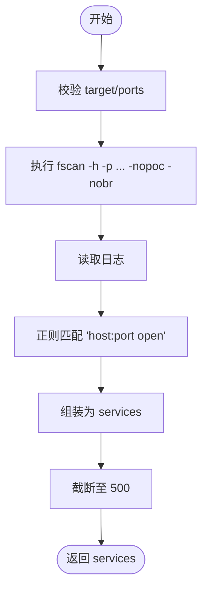
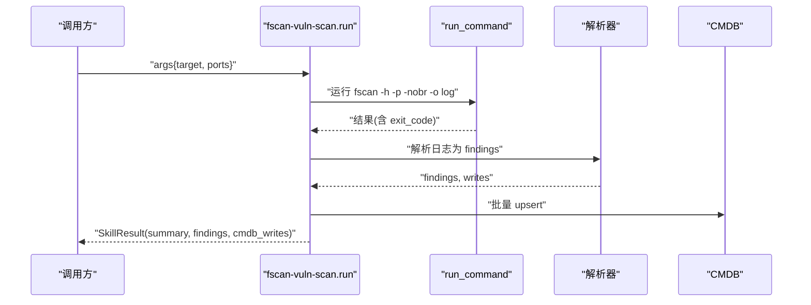
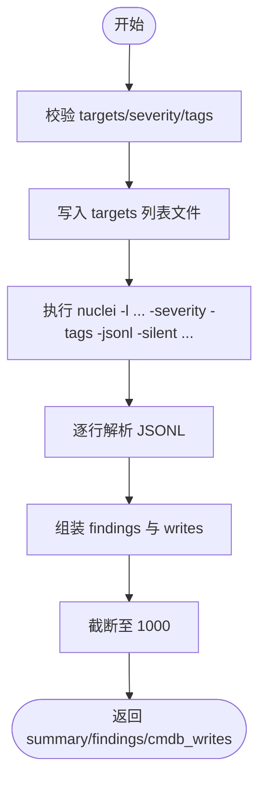
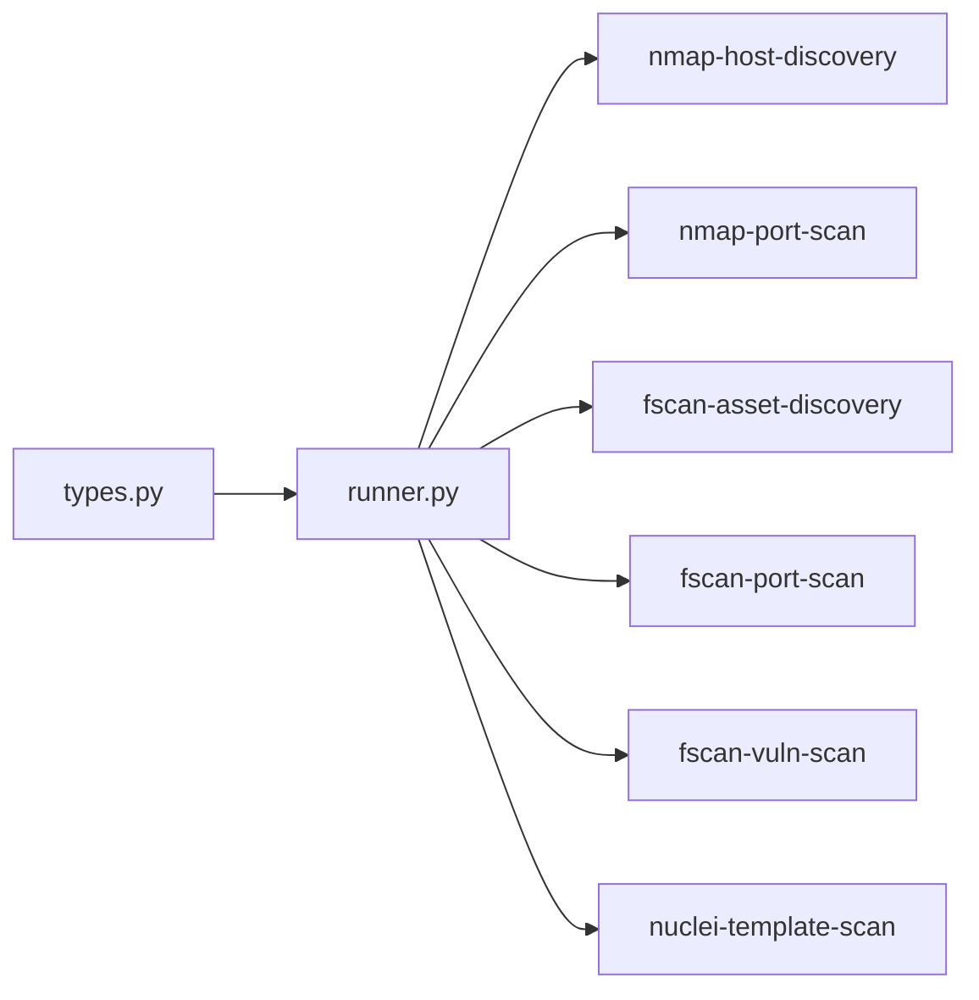

# 内置安全工具详解

<cite>
**本文引用的文件**
- [secbot/skills/fscan-asset-discovery/handler.py](file://secbot/skills/fscan-asset-discovery/handler.py)
- [secbot/skills/fscan-asset-discovery/input.schema.json](file://secbot/skills/fscan-asset-discovery/input.schema.json)
- [secbot/skills/fscan-asset-discovery/output.schema.json](file://secbot/skills/fscan-asset-discovery/output.schema.json)
- [secbot/skills/fscan-port-scan/handler.py](file://secbot/skills/fscan-port-scan/handler.py)
- [secbot/skills/fscan-port-scan/input.schema.json](file://secbot/skills/fscan-port-scan/input.schema.json)
- [secbot/skills/fscan-port-scan/output.schema.json](file://secbot/skills/fscan-port-scan/output.schema.json)
- [secbot/skills/fscan-vuln-scan/handler.py](file://secbot/skills/fscan-vuln-scan/handler.py)
- [secbot/skills/nmap-host-discovery/handler.py](file://secbot/skills/nmap-host-discovery/handler.py)
- [secbot/skills/nmap-host-discovery/input.schema.json](file://secbot/skills/nmap-host-discovery/input.schema.json)
- [secbot/skills/nmap-host-discovery/output.schema.json](file://secbot/skills/nmap-host-discovery/output.schema.json)
- [secbot/skills/nmap-port-scan/handler.py](file://secbot/skills/nmap-port-scan/handler.py)
- [secbot/skills/nmap-port-scan/input.schema.json](file://secbot/skills/nmap-port-scan/input.schema.json)
- [secbot/skills/nmap-port-scan/output.schema.json](file://secbot/skills/nmap-port-scan/output.schema.json)
- [secbot/skills/nuclei-template-scan/handler.py](file://secbot/skills/nuclei-template-scan/handler.py)
- [secbot/skills/nuclei-template-scan/input.schema.json](file://secbot/skills/nuclei-template-scan/input.schema.json)
- [secbot/skills/nuclei-template-scan/output.schema.json](file://secbot/skills/nuclei-template-scan/output.schema.json)
- [secbot/skills/_shared/runner.py](file://secbot/skills/_shared/runner.py)
- [secbot/skills/types.py](file://secbot/skills/types.py)
</cite>

## 目录
1. [简介](#简介)
2. [项目结构](#项目结构)
3. [核心组件](#核心组件)
4. [架构总览](#架构总览)
5. [详细组件分析](#详细组件分析)
6. [依赖分析](#依赖分析)
7. [性能考量](#性能考量)
8. [故障排除指南](#故障排除指南)
9. [结论](#结论)
10. [附录](#附录)

## 简介
本文件系统性梳理并讲解内置安全工具集，覆盖以下核心能力：
- 主机发现：nmap 主机发现
- 端口扫描：nmap 端口扫描、fscan 端口扫描
- 资产发现：fscan 资产发现
- 漏洞扫描：fscan 漏洞扫描（基于模板）
- 模板化扫描：nuclei 模板扫描
- 结果解析与 CMDB 写入：统一的结构化输出与写入策略
- 安全与稳定性：输入校验、超时控制、取消令牌、网络策略、二进制缺失处理

目标是帮助使用者理解各工具的输入参数、输出格式、错误处理机制，并给出参数优化、性能调优与安全限制的最佳实践，以及工具间的协作与组合使用方法。

## 项目结构
内置安全工具以“技能（Skill）”为单位组织，每个技能包含：
- handler.py：实际执行逻辑与结果解析
- input.schema.json：输入参数的 JSON Schema 校验
- output.schema.json：输出结构的 JSON Schema 描述
- SKILL.md：技能说明与使用建议（部分）

图表来源
- [secbot/skills/fscan-asset-discovery/handler.py:1-36](file://secbot/skills/fscan-asset-discovery/handler.py#L1-L36)
- [secbot/skills/fscan-port-scan/handler.py:1-45](file://secbot/skills/fscan-port-scan/handler.py#L1-L45)
- [secbot/skills/fscan-vuln-scan/handler.py:1-116](file://secbot/skills/fscan-vuln-scan/handler.py#L1-L116)
- [secbot/skills/nmap-host-discovery/handler.py:1-81](file://secbot/skills/nmap-host-discovery/handler.py#L1-L81)
- [secbot/skills/nmap-port-scan/handler.py:1-48](file://secbot/skills/nmap-port-scan/handler.py#L1-L48)
- [secbot/skills/nuclei-template-scan/handler.py:1-154](file://secbot/skills/nuclei-template-scan/handler.py#L1-L154)
- [secbot/skills/_shared/runner.py](file://secbot/skills/_shared/runner.py)
- [secbot/skills/types.py](file://secbot/skills/types.py)

章节来源
- [secbot/skills/fscan-asset-discovery/handler.py:1-36](file://secbot/skills/fscan-asset-discovery/handler.py#L1-L36)
- [secbot/skills/fscan-port-scan/handler.py:1-45](file://secbot/skills/fscan-port-scan/handler.py#L1-L45)
- [secbot/skills/fscan-vuln-scan/handler.py:1-116](file://secbot/skills/fscan-vuln-scan/handler.py#L1-L116)
- [secbot/skills/nmap-host-discovery/handler.py:1-81](file://secbot/skills/nmap-host-discovery/handler.py#L1-L81)
- [secbot/skills/nmap-port-scan/handler.py:1-48](file://secbot/skills/nmap-port-scan/handler.py#L1-L48)
- [secbot/skills/nuclei-template-scan/handler.py:1-154](file://secbot/skills/nuclei-template-scan/handler.py#L1-L154)

## 核心组件
- 执行器与安全策略
  - 统一通过共享执行器封装命令运行、日志捕获、超时与取消、网络策略声明与二进制可用性检查。
  - 错误类型涵盖超时、取消、二进制缺失、无效参数等，便于上层统一处理。
- 输入/输出模式
  - 每个技能均提供严格的 JSON Schema，确保输入参数合法与输出结构稳定。
- 结果解析与 CMDB 写入
  - 针对不同工具输出格式进行解析，生成统一的结构化结果，并按需写入 CMDB 表 vulnerabilities。

章节来源
- [secbot/skills/_shared/runner.py](file://secbot/skills/_shared/runner.py)
- [secbot/skills/types.py](file://secbot/skills/types.py)

## 架构总览
下图展示内置安全工具的调用链与数据流：技能 handler 调用执行器，执行器根据网络策略与超时设置运行外部二进制；工具输出被解析为结构化结果，并可选地写入 CMDB。

图表来源
- [secbot/skills/nmap-host-discovery/handler.py:35-81](file://secbot/skills/nmap-host-discovery/handler.py#L35-L81)
- [secbot/skills/nmap-port-scan/handler.py:32-48](file://secbot/skills/nmap-port-scan/handler.py#L32-L48)
- [secbot/skills/fscan-asset-discovery/handler.py:24-36](file://secbot/skills/fscan-asset-discovery/handler.py#L24-L36)
- [secbot/skills/fscan-port-scan/handler.py:31-45](file://secbot/skills/fscan-port-scan/handler.py#L31-L45)
- [secbot/skills/fscan-vuln-scan/handler.py:75-116](file://secbot/skills/fscan-vuln-scan/handler.py#L75-L116)
- [secbot/skills/nuclei-template-scan/handler.py:98-154](file://secbot/skills/nuclei-template-scan/handler.py#L98-L154)

## 详细组件分析

### nmap 主机发现（nmap-host-discovery）
- 功能概述
  - 使用 nmap 的主机发现模式扫描目标，提取“存活主机”列表。
- 输入参数
  - target：支持 IPv4、IPv6、域名；长度限制与正则约束见输入模式。
  - rate：扫描速率（slow/normal/fast），映射到 nmap 时间模板参数。
- 输出结构
  - hosts_up：最多 200 个主机；可包含 elapsed_sec、error 等摘要字段。
- 错误处理
  - 超时/取消：返回空列表并标记 error/cancelled。
  - 二进制缺失：抛出特定异常交由上层处理。
  - 进程退出码非零：在无解析结果时附加错误信息。
- 性能与安全
  - 速率参数影响扫描速度与隐蔽性；默认超时约 120 秒。
  - 严格的目标正则匹配，避免非法字符注入。

图表来源
- [secbot/skills/nmap-host-discovery/handler.py:35-81](file://secbot/skills/nmap-host-discovery/handler.py#L35-L81)

章节来源
- [secbot/skills/nmap-host-discovery/handler.py:1-81](file://secbot/skills/nmap-host-discovery/handler.py#L1-L81)
- [secbot/skills/nmap-host-discovery/input.schema.json:1-19](file://secbot/skills/nmap-host-discovery/input.schema.json#L1-L19)
- [secbot/skills/nmap-host-discovery/output.schema.json:1-16](file://secbot/skills/nmap-host-discovery/output.schema.json#L1-L16)

### nmap 端口扫描（nmap-port-scan）
- 功能概述
  - 对指定主机或多个目标进行 TCP/UDP 端口扫描，解析开放端口与服务名。
- 输入参数
  - targets：数组，最多 256 项；每项为 IPv4/域名；支持端口范围。
  - ports：端口范围字符串，默认 1-1024。
- 输出结构
  - services：最多 500 项，包含 host/port/protocol/service；可包含 elapsed_sec/error。
- 错误处理
  - 超时/取消：返回空列表并标记。
  - 二进制缺失：抛出异常。
  - 退出码非零：附加错误信息。
- 性能与安全
  - 默认超时约 600 秒；解析阶段提前截断以控制内存与传输量。

图表来源
- [secbot/skills/nmap-port-scan/handler.py:32-48](file://secbot/skills/nmap-port-scan/handler.py#L32-L48)

章节来源
- [secbot/skills/nmap-port-scan/handler.py:1-48](file://secbot/skills/nmap-port-scan/handler.py#L1-L48)
- [secbot/skills/nmap-port-scan/input.schema.json:1-11](file://secbot/skills/nmap-port-scan/input.schema.json#L1-L11)
- [secbot/skills/nmap-port-scan/output.schema.json:1-24](file://secbot/skills/nmap-port-scan/output.schema.json#L1-L24)

### fscan 资产发现（fscan-asset-discovery）
- 功能概述
  - 使用 fscan 的主机发现能力，解析“存活主机”文本输出。
- 输入参数
  - target：字符串，长度限制。
- 输出结构
  - hosts_up：最多 500 个主机；可包含 elapsed_sec/error。
- 错误处理
  - 日志不存在：返回空列表。
  - 超时/取消：返回空列表并记录错误。
  - 二进制缺失：抛出异常。
- 性能与安全
  - 超时约 300 秒；解析仅提取前 500 个唯一主机。

图表来源
- [secbot/skills/fscan-asset-discovery/handler.py:16-36](file://secbot/skills/fscan-asset-discovery/handler.py#L16-L36)

章节来源
- [secbot/skills/fscan-asset-discovery/handler.py:1-36](file://secbot/skills/fscan-asset-discovery/handler.py#L1-L36)
- [secbot/skills/fscan-asset-discovery/input.schema.json:1-10](file://secbot/skills/fscan-asset-discovery/input.schema.json#L1-L10)
- [secbot/skills/fscan-asset-discovery/output.schema.json:1-11](file://secbot/skills/fscan-asset-discovery/output.schema.json#L1-L11)

### fscan 端口扫描（fscan-port-scan）
- 功能概述
  - 使用 fscan 扫描指定目标的开放端口，解析输出并生成服务列表。
- 输入参数
  - target：字符串，长度限制。
  - ports：端口范围字符串，默认 1-65535。
- 输出结构
  - services：最多 500 项，包含 host/port/protocol/service；可包含 elapsed_sec/error。
- 错误处理
  - 日志不存在：返回空列表。
  - 超时/取消：返回空列表并记录错误。
  - 二进制缺失：抛出异常。
- 性能与安全
  - 超时约 900 秒；解析阶段限制最大条目数。

图表来源
- [secbot/skills/fscan-port-scan/handler.py:17-45](file://secbot/skills/fscan-port-scan/handler.py#L17-L45)

章节来源
- [secbot/skills/fscan-port-scan/handler.py:1-45](file://secbot/skills/fscan-port-scan/handler.py#L1-L45)
- [secbot/skills/fscan-port-scan/input.schema.json:1-11](file://secbot/skills/fscan-port-scan/input.schema.json#L1-L11)
- [secbot/skills/fscan-port-scan/output.schema.json:1-24](file://secbot/skills/fscan-port-scan/output.schema.json#L1-L24)

### fscan 漏洞扫描（fscan-vuln-scan）
- 功能概述
  - 使用 fscan 执行默认 POC 检查，解析“发现”文本输出，生成结构化漏洞清单并写入 CMDB。
- 输入参数
  - target：字符串，长度限制。
  - ports：端口范围字符串，默认 80,443,8080,8443。
- 输出结构
  - summary：findings_count、elapsed_sec、error/cancelled。
  - findings：最多 1000 条，包含 host/port/title/severity 等。
  - cmdb_writes：批量 upsert 到 vulnerabilities 表。
- 错误处理
  - 超时/取消：返回摘要并保留原始日志。
  - 二进制缺失：抛出异常。
  - 退出码非零且无解析结果：附加错误信息。
- 性能与安全
  - 超时约 900 秒；解析上限 1000 条；明确声明网络策略 REQUIRED。

图表来源
- [secbot/skills/fscan-vuln-scan/handler.py:75-116](file://secbot/skills/fscan-vuln-scan/handler.py#L75-L116)

章节来源
- [secbot/skills/fscan-vuln-scan/handler.py:1-116](file://secbot/skills/fscan-vuln-scan/handler.py#L1-L116)

### nuclei 模板扫描（nuclei-template-scan）
- 功能概述
  - 使用 nuclei 对目标列表执行模板扫描，过滤严重级别与标签，解析 JSONL 输出并写入 CMDB。
- 输入参数
  - targets：数组，最多 256 项；支持 http/https、IPv4、域名；长度与格式约束。
  - severity：枚举，允许 medium,high,critical 或更高集合。
  - tags：逗号分隔的标签字符串，限制长度与字符集。
- 输出结构
  - summary：findings_count、elapsed_sec、error/cancelled。
  - findings：最多 1000 条，包含 template_id/severity/host/matched_at/name。
  - cmdb_writes：批量 upsert 到 vulnerabilities 表。
- 错误处理
  - 超时/取消：返回摘要并保留原始日志。
  - 二进制缺失：抛出异常。
  - 退出码非零且无解析结果：附加错误信息。
- 性能与安全
  - 超时约 900 秒；解析上限 1000 条；显式声明网络策略 REQUIRED。

图表来源
- [secbot/skills/nuclei-template-scan/handler.py:98-154](file://secbot/skills/nuclei-template-scan/handler.py#L98-L154)

章节来源
- [secbot/skills/nuclei-template-scan/handler.py:1-154](file://secbot/skills/nuclei-template-scan/handler.py#L1-L154)
- [secbot/skills/nuclei-template-scan/input.schema.json:1-31](file://secbot/skills/nuclei-template-scan/input.schema.json#L1-L31)
- [secbot/skills/nuclei-template-scan/output.schema.json:1-34](file://secbot/skills/nuclei-template-scan/output.schema.json#L1-L34)

## 依赖分析
- 组件耦合
  - 各技能依赖共享执行器与类型系统，保持一致的错误处理与生命周期管理。
  - 解析器与 CMDB 写入策略在多技能中复用，降低重复实现。
- 外部依赖
  - nmap、fscan、nuclei 二进制需在运行环境中可用。
- 可能的循环依赖
  - 技能之间无直接导入循环；执行器与类型模块位于共享层，避免环状依赖。

图表来源
- [secbot/skills/_shared/runner.py](file://secbot/skills/_shared/runner.py)
- [secbot/skills/types.py](file://secbot/skills/types.py)
- [secbot/skills/nmap-host-discovery/handler.py:1-81](file://secbot/skills/nmap-host-discovery/handler.py#L1-L81)
- [secbot/skills/nmap-port-scan/handler.py:1-48](file://secbot/skills/nmap-port-scan/handler.py#L1-L48)
- [secbot/skills/fscan-asset-discovery/handler.py:1-36](file://secbot/skills/fscan-asset-discovery/handler.py#L1-L36)
- [secbot/skills/fscan-port-scan/handler.py:1-45](file://secbot/skills/fscan-port-scan/handler.py#L1-L45)
- [secbot/skills/fscan-vuln-scan/handler.py:1-116](file://secbot/skills/fscan-vuln-scan/handler.py#L1-L116)
- [secbot/skills/nuclei-template-scan/handler.py:1-154](file://secbot/skills/nuclei-template-scan/handler.py#L1-L154)

章节来源
- [secbot/skills/_shared/runner.py](file://secbot/skills/_shared/runner.py)
- [secbot/skills/types.py](file://secbot/skills/types.py)

## 性能考量
- 超时与并发
  - 不同工具设置不同超时（nmap-host-discovery~120s、nmap-port-scan~600s、fscan~900s、nuclei~900s），应结合目标规模与网络状况调整。
- 输出截断
  - 多处限制最大条目数（如 hosts_up≤200、services≤500、findings≤1000），避免内存与传输压力。
- 扫描粒度
  - nmap 支持多目标与端口范围；fscan 默认端口范围更广；nuclei 通过 severity/tags 精简结果。
- 网络策略
  - 明确声明网络策略 REQUIRED，确保扫描过程具备外网访问能力。
- 最佳实践
  - 先用 nmap-host-discovery 或 fscan-asset-discovery 获取存活主机，再对存活主机执行端口扫描与漏洞扫描。
  - 在高风险目标上优先使用较低端口范围与较严格 severity/tags，减少误报与资源消耗。
  - 对大规模目标，拆分批次执行并设置合理的取消令牌以支持中断。

## 故障排除指南
- 常见错误与定位
  - 二进制缺失：抛出“二进制缺失”异常，检查 PATH 与安装状态。
  - 超时：返回摘要并保留原始日志，检查网络延迟、目标可达性与超时阈值。
  - 取消：返回摘要并标记 cancelled，确认是否触发了取消令牌。
  - 参数无效：输入模式校验失败，检查 target/targets/ports/severity/tags 是否符合约束。
  - 退出码非零：若无解析结果，摘要中会包含错误信息，结合原始日志定位问题。
- 日志与诊断
  - 各技能均生成原始日志文件，路径位于扫描目录；建议保留并归档以便复盘。
- 安全限制
  - 目标与参数均经过严格正则/长度/数量限制，避免注入与滥用；如需放宽，请在受控环境下评估风险。

章节来源
- [secbot/skills/nmap-host-discovery/handler.py:57-62](file://secbot/skills/nmap-host-discovery/handler.py#L57-L62)
- [secbot/skills/nmap-port-scan/handler.py:36-38](file://secbot/skills/nmap-port-scan/handler.py#L36-L38)
- [secbot/skills/fscan-asset-discovery/handler.py:28-35](file://secbot/skills/fscan-asset-discovery/handler.py#L28-L35)
- [secbot/skills/fscan-port-scan/handler.py:37-44](file://secbot/skills/fscan-port-scan/handler.py#L37-L44)
- [secbot/skills/fscan-vuln-scan/handler.py:93-98](file://secbot/skills/fscan-vuln-scan/handler.py#L93-L98)
- [secbot/skills/nuclei-template-scan/handler.py:131-136](file://secbot/skills/nuclei-template-scan/handler.py#L131-L136)

## 结论
内置安全工具通过统一的执行器、严格的输入输出模式与结构化结果解析，实现了从主机发现、端口扫描到漏洞扫描的闭环。配合 CMDB 写入与完善的错误处理，既保证了扫描效率，也兼顾了安全性与可观测性。建议在实际使用中遵循参数优化、性能调优与安全限制的最佳实践，并结合工具间的协作关系制定扫描策略。

## 附录
- 工具协作与组合使用建议
  - 阶段一：主机发现（nmap-host-discovery 或 fscan-asset-discovery）→ 得到存活主机列表。
  - 阶段二：端口扫描（nmap-port-scan 或 fscan-port-scan）→ 获取开放端口与服务。
  - 阶段三：漏洞扫描（fscan-vuln-scan 或 nuclei-template-scan）→ 结构化发现并写入 CMDB。
- 关键参数速查
  - nmap-host-discovery：target、rate（slow/normal/fast）
  - nmap-port-scan：targets[]、ports
  - fscan-asset-discovery：target
  - fscan-port-scan：target、ports
  - fscan-vuln-scan：target、ports
  - nuclei-template-scan：targets[]、severity、tags