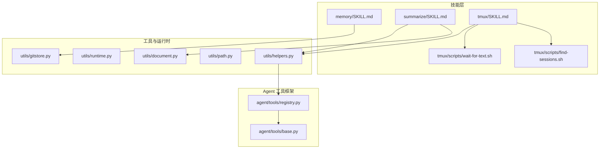
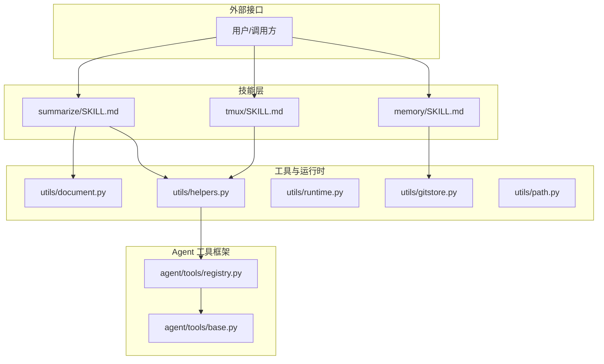
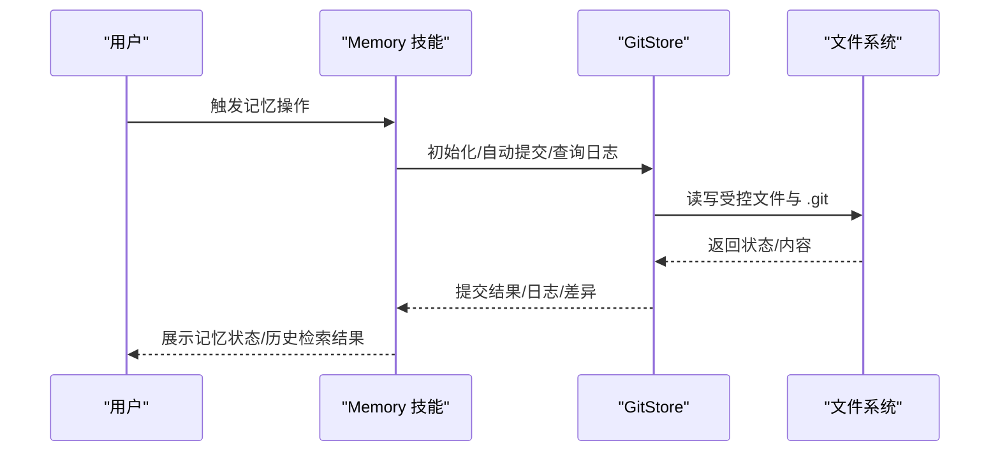
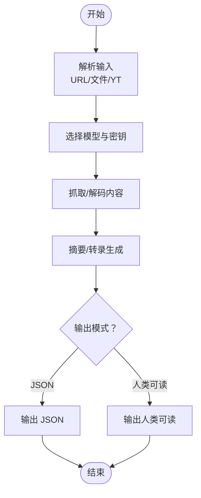
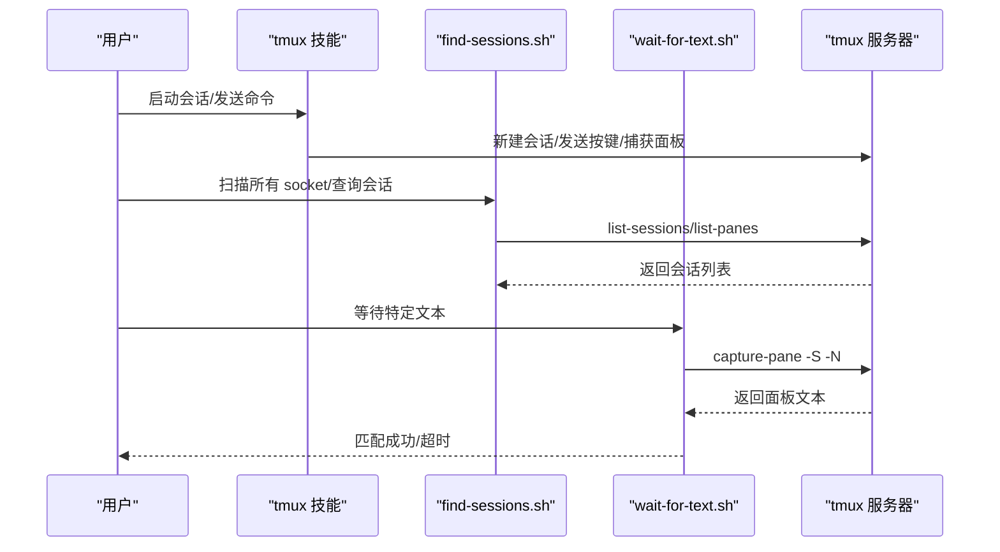
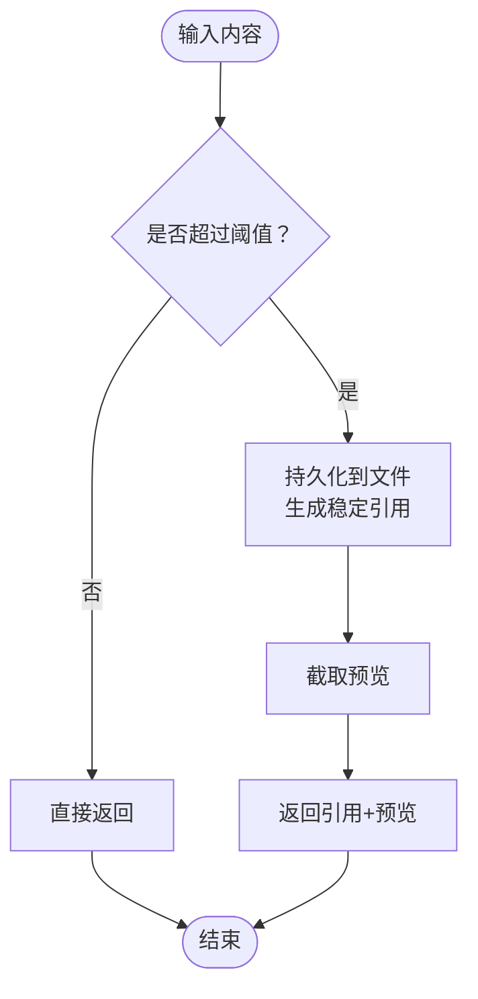
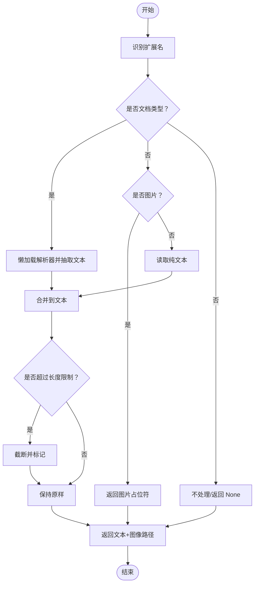
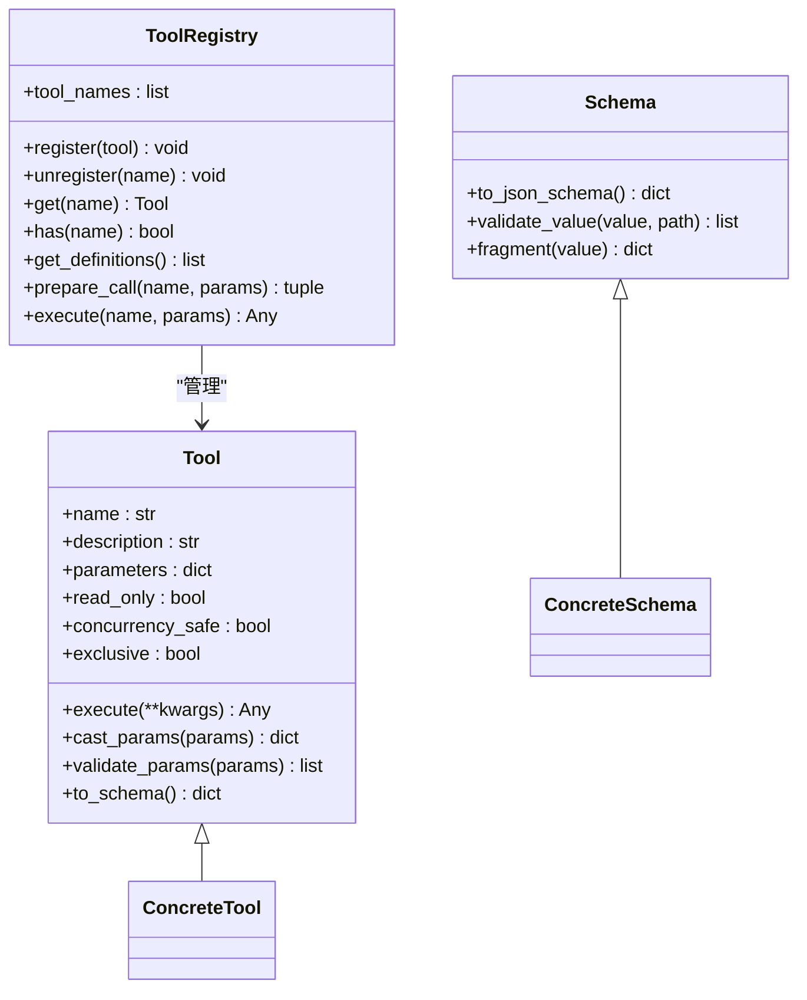
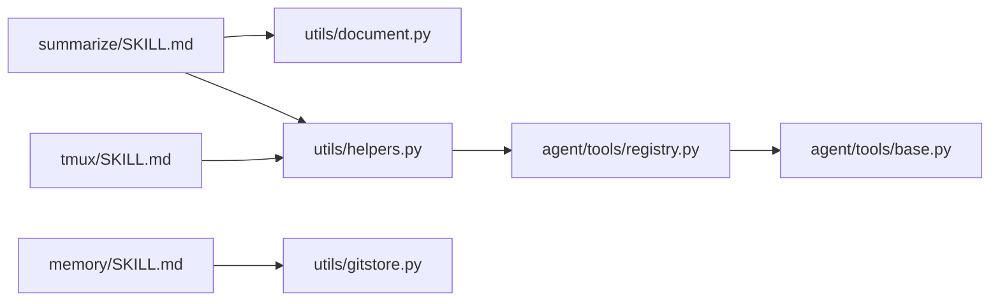

# 实用工具集合

<cite>
**本文引用的文件**
- [secbot/skills/memory/SKILL.md](file://secbot/skills/memory/SKILL.md)
- [secbot/skills/summarize/SKILL.md](file://secbot/skills/summarize/SKILL.md)
- [secbot/skills/tmux/SKILL.md](file://secbot/skills/tmux/SKILL.md)
- [secbot/skills/tmux/scripts/find-sessions.sh](file://secbot/skills/tmux/scripts/find-sessions.sh)
- [secbot/skills/tmux/scripts/wait-for-text.sh](file://secbot/skills/tmux/scripts/wait-for-text.sh)
- [secbot/utils/helpers.py](file://secbot/utils/helpers.py)
- [secbot/utils/runtime.py](file://secbot/utils/runtime.py)
- [secbot/utils/document.py](file://secbot/utils/document.py)
- [secbot/utils/path.py](file://secbot/utils/path.py)
- [secbot/utils/gitstore.py](file://secbot/utils/gitstore.py)
- [secbot/agent/tools/registry.py](file://secbot/agent/tools/registry.py)
- [secbot/agent/tools/base.py](file://secbot/agent/tools/base.py)
</cite>

## 目录
1. [简介](#简介)
2. [项目结构](#项目结构)
3. [核心组件](#核心组件)
4. [架构总览](#架构总览)
5. [详细组件分析](#详细组件分析)
6. [依赖分析](#依赖分析)
7. [性能考虑](#性能考虑)
8. [故障排除指南](#故障排除指南)
9. [结论](#结论)
10. [附录](#附录)

## 简介
本文件为“实用工具集合”的综合文档，聚焦三类关键能力：内存管理（两层记忆体系与版本控制）、文本摘要（多来源内容抽取与总结）与 tmux 会话管理（远程交互式命令行控制）。文档从设计目标、使用场景、技术实现、参数配置、执行流程、输出格式到最佳实践、性能调优与故障排除进行系统化阐述，并说明这些工具与主系统（Agent 工具链、运行时策略、文档解析与路径处理）的集成关系。

## 项目结构
围绕“实用工具集合”，仓库中与之直接相关的模块主要分布在以下位置：
- 技能层（Skills）：memory、summarize、tmux 及其脚本
- 工具与运行时（Utils）：通用工具函数、运行时策略、文档解析、路径缩略、Git 版本控制
- Agent 工具框架（Agent Tools）：工具注册表、工具基类与参数校验

**图示来源**
- [secbot/skills/memory/SKILL.md](file://secbot/skills/memory/SKILL.md)
- [secbot/skills/summarize/SKILL.md](file://secbot/skills/summarize/SKILL.md)
- [secbot/skills/tmux/SKILL.md](file://secbot/skills/tmux/SKILL.md)
- [secbot/skills/tmux/scripts/find-sessions.sh](file://secbot/skills/tmux/scripts/find-sessions.sh)
- [secbot/skills/tmux/scripts/wait-for-text.sh](file://secbot/skills/tmux/scripts/wait-for-text.sh)
- [secbot/utils/helpers.py](file://secbot/utils/helpers.py)
- [secbot/utils/runtime.py](file://secbot/utils/runtime.py)
- [secbot/utils/document.py](file://secbot/utils/document.py)
- [secbot/utils/path.py](file://secbot/utils/path.py)
- [secbot/utils/gitstore.py](file://secbot/utils/gitstore.py)
- [secbot/agent/tools/registry.py](file://secbot/agent/tools/registry.py)
- [secbot/agent/tools/base.py](file://secbot/agent/tools/base.py)

**章节来源**
- [secbot/skills/memory/SKILL.md](file://secbot/skills/memory/SKILL.md)
- [secbot/skills/summarize/SKILL.md](file://secbot/skills/summarize/SKILL.md)
- [secbot/skills/tmux/SKILL.md](file://secbot/skills/tmux/SKILL.md)
- [secbot/skills/tmux/scripts/find-sessions.sh](file://secbot/skills/tmux/scripts/find-sessions.sh)
- [secbot/skills/tmux/scripts/wait-for-text.sh](file://secbot/skills/tmux/scripts/wait-for-text.sh)
- [secbot/utils/helpers.py](file://secbot/utils/helpers.py)
- [secbot/utils/runtime.py](file://secbot/utils/runtime.py)
- [secbot/utils/document.py](file://secbot/utils/document.py)
- [secbot/utils/path.py](file://secbot/utils/path.py)
- [secbot/utils/gitstore.py](file://secbot/utils/gitstore.py)
- [secbot/agent/tools/registry.py](file://secbot/agent/tools/registry.py)
- [secbot/agent/tools/base.py](file://secbot/agent/tools/base.py)

## 核心组件
- 内存管理（Memory）
  - 设计目的：通过两层记忆体系（Dream 管理的知识文件）与历史记录（append-only JSONL）实现长期知识沉淀与可检索性。
  - 使用场景：需要稳定的历史检索、知识更新与版本回溯；避免手动编辑受控文件。
  - 关键点：禁止直接编辑受控文件；使用内置 grep 工具进行高效检索；history.jsonl 采用 JSONL 结构便于分页与上下文检索。
- 文本摘要（Summarize）
  - 设计目的：快速对 URL、本地文件或视频链接进行摘要或转录提取，作为“转录/总结”的通用入口。
  - 使用场景：用户请求链接/视频内容概要、长文本提炼、大体量内容的初步理解。
  - 关键点：支持多种模型与密钥；提供长度、输出令牌上限、仅提取、JSON 输出、站点抓取与 YouTube 回退等选项；可配置默认模型与服务令牌。
- tmux 会话管理（Tmux）
  - 设计目的：在远程环境中以交互式 TTY 控制会话，发送按键、捕获面板输出、轮询提示符，支撑并行编码代理与任务编排。
  - 使用场景：需要与交互式 CLI 深度协作的任务（如 REPL、调试器、IDE 辅助），以及并行化多任务流水线。
  - 关键点：隔离 socket、命名会话与窗格、安全发送输入、监控输出、等待文本模式、清理与扫描会话；提供并行代理编排示例。

**章节来源**
- [secbot/skills/memory/SKILL.md](file://secbot/skills/memory/SKILL.md)
- [secbot/skills/summarize/SKILL.md](file://secbot/skills/summarize/SKILL.md)
- [secbot/skills/tmux/SKILL.md](file://secbot/skills/tmux/SKILL.md)

## 架构总览
下图展示“实用工具集合”在系统中的角色与交互：技能层负责对外暴露能力（memory/summarize/tmux），工具与运行时层提供通用能力（文档解析、路径处理、运行时策略、Git 版本控制），Agent 工具框架提供统一的工具注册与参数校验。

**图示来源**
- [secbot/skills/memory/SKILL.md](file://secbot/skills/memory/SKILL.md)
- [secbot/skills/summarize/SKILL.md](file://secbot/skills/summarize/SKILL.md)
- [secbot/skills/tmux/SKILL.md](file://secbot/skills/tmux/SKILL.md)
- [secbot/utils/document.py](file://secbot/utils/document.py)
- [secbot/utils/helpers.py](file://secbot/utils/helpers.py)
- [secbot/utils/runtime.py](file://secbot/utils/runtime.py)
- [secbot/utils/gitstore.py](file://secbot/utils/gitstore.py)
- [secbot/utils/path.py](file://secbot/utils/path.py)
- [secbot/agent/tools/registry.py](file://secbot/agent/tools/registry.py)
- [secbot/agent/tools/base.py](file://secbot/agent/tools/base.py)

## 详细组件分析

### 组件一：内存管理（Memory）
- 设计目的
  - 通过受控文件（SOUL.md、USER.md、MEMORY.md）与 append-only 历史记录（history.jsonl）形成“两层记忆”：受控知识与事件历史。
  - 由 Dream 自动维护受控文件，用户仅能通过内置搜索工具检索历史。
- 使用场景
  - 需要长期知识沉淀与检索（如项目背景、重要事件）；需要版本回溯与变更审计。
- 技术实现
  - 受控文件由 GitStore 进行初始化与自动提交，.gitignore 仅跟踪受控文件，确保最小化版本控制范围。
  - 历史记录采用 JSONL，每行包含游标、时间戳与内容，支持按需分页与上下文检索。
- 参数与配置
  - 受控文件列表：SOUL.md、USER.md、MEMORY.md。
  - 搜索模式：支持按内容、按计数、按固定字符串、分页头限制与偏移。
- 执行流程
  - 初始化：同步模板到工作区，创建受控文件并首次提交。
  - 日常：自动提交受控文件变更；查询日志与差异；按需回滚。
- 输出格式
  - 历史记录：每行 JSON 对象（包含 cursor、timestamp、content）。
  - Git 日志：简化后的提交信息列表，含短 SHA、消息与时间。
- 最佳实践
  - 不要直接编辑受控文件；通过内置搜索工具检索历史；定期查看 Dream 日志确认活动。
- 与主系统的集成
  - 与 GitStore 协作完成版本控制；与工具链配合进行持久化与检索。

**图示来源**
- [secbot/skills/memory/SKILL.md](file://secbot/skills/memory/SKILL.md)
- [secbot/utils/gitstore.py](file://secbot/utils/gitstore.py)

**章节来源**
- [secbot/skills/memory/SKILL.md](file://secbot/skills/memory/SKILL.md)
- [secbot/utils/gitstore.py](file://secbot/utils/gitstore.py)

### 组件二：文本摘要（Summarize）
- 设计目的
  - 快速从 URL、本地文件、YouTube 链接抽取与总结内容，作为“转录/总结”的通用入口。
- 使用场景
  - 用户请求链接/视频内容概要、长文本提炼、大体量内容的初步理解。
- 技术实现
  - 支持多种模型与密钥；提供长度、输出令牌上限、仅提取、JSON 输出、站点抓取与 YouTube 回退等选项。
  - 可配置默认模型与服务令牌（如 Firecrawl、Apify）。
- 参数与配置
  - 模型与密钥：OPENAI_API_KEY、ANTHROPIC_API_KEY、xAI_API_KEY、GEMINI_API_KEY 等。
  - 常用标志：--length、--max-output-tokens、--extract-only、--json、--firecrawl、--youtube。
  - 配置文件：~/.summarize/config.json。
- 执行流程
  - 解析输入（URL/文件/YT）→ 选择模型与密钥 → 调用外部服务（必要时）→ 生成摘要/转录 → 输出 JSON 或人类可读格式。
- 输出格式
  - 默认人类可读；--json 输出机器可读 JSON。
- 最佳实践
  - 大体量转录先给摘要再展开特定段落；合理设置长度与令牌上限；优先使用内置搜索工具定位历史信息。

**图示来源**
- [secbot/skills/summarize/SKILL.md](file://secbot/skills/summarize/SKILL.md)

**章节来源**
- [secbot/skills/summarize/SKILL.md](file://secbot/skills/summarize/SKILL.md)
- [secbot/utils/document.py](file://secbot/utils/document.py)
- [secbot/utils/helpers.py](file://secbot/utils/helpers.py)

### 组件三：tmux 会话管理（Tmux）
- 设计目的
  - 在远程环境中以交互式 TTY 控制会话，发送按键、捕获面板输出、轮询提示符，支撑并行编码代理与任务编排。
- 使用场景
  - 需要与交互式 CLI 深度协作的任务（REPL、调试器、IDE 辅助）；并行化多任务流水线。
- 技术实现
  - 隔离 socket、命名会话与窗格、安全发送输入、监控输出、等待文本模式、清理与扫描会话。
  - 提供并行代理编排示例（多会话、不同工作目录、轮询完成、捕获输出）。
- 参数与配置
  - 环境变量：SECBOT_TMUX_SOCKET_DIR（默认 socket 路径）。
  - 目标格式：session:window.pane（默认 :0.0）。
  - 辅助脚本：find-sessions.sh（扫描 socket/查询过滤）、wait-for-text.sh（轮询匹配文本）。
- 执行流程
  - 创建 socket 与会话 → 发送命令 → 捕获输出/等待提示符 → 轮询完成 → 清理会话。
- 输出格式
  - 监视命令输出（最近历史、附加/分离、会话列表）。
- 最佳实践
  - 使用非基础 REPL（如 PYTHON_BASIC_REPL=1）保证 send-keys 流程稳定；用单独 git worktree 并行修复；检查提示符（如 ❯/$）判断完成；Codex 使用 --yolo/--full-auto 非交互模式。

**图示来源**
- [secbot/skills/tmux/SKILL.md](file://secbot/skills/tmux/SKILL.md)
- [secbot/skills/tmux/scripts/find-sessions.sh](file://secbot/skills/tmux/scripts/find-sessions.sh)
- [secbot/skills/tmux/scripts/wait-for-text.sh](file://secbot/skills/tmux/scripts/wait-for-text.sh)

**章节来源**
- [secbot/skills/tmux/SKILL.md](file://secbot/skills/tmux/SKILL.md)
- [secbot/skills/tmux/scripts/find-sessions.sh](file://secbot/skills/tmux/scripts/find-sessions.sh)
- [secbot/skills/tmux/scripts/wait-for-text.sh](file://secbot/skills/tmux/scripts/wait-for-text.sh)

### 组件四：通用工具与运行时策略（Helpers/Runtime）
- 设计目的
  - 提供通用工具函数（文本截断、路径缩略、工具结果持久化、令牌估算、状态构建等）与运行时策略（空结果占位、重复外部查找与越界访问限制）。
- 使用场景
  - 在工具链中统一处理输出大小、消息拆分、令牌预算、运行时错误恢复与安全边界。
- 技术实现
  - 工具结果持久化：超过阈值时写入文件并返回稳定引用，保留预览与完整路径。
  - 令牌估算：基于 tiktoken 的估算与提供方计数器回退。
  - 运行时策略：对外部查找与工作区越界访问进行节流与升级处理。
- 参数与配置
  - 工具结果阈值、预览长度、保留周期、最大桶数量。
  - 令牌估算缓存与回退策略。
- 执行流程
  - 输入预处理 → 估算令牌 → 分块/截断 → 持久化（必要时）→ 构建最终消息。
- 输出格式
  - 文本块列表、稳定引用字符串、状态快照文本。
- 最佳实践
  - 合理设置工具结果阈值与预览长度；利用运行时策略避免重复外部查找与越界尝试。

**图示来源**
- [secbot/utils/helpers.py](file://secbot/utils/helpers.py)
- [secbot/utils/runtime.py](file://secbot/utils/runtime.py)

**章节来源**
- [secbot/utils/helpers.py](file://secbot/utils/helpers.py)
- [secbot/utils/runtime.py](file://secbot/utils/runtime.py)

### 组件五：文档解析与路径处理（Document/Path）
- 设计目的
  - 从多格式文档中抽取文本（PDF/DOCX/XLSX/PPTX/纯文本等），并对媒体与路径进行处理。
- 使用场景
  - 需要从复杂文档中提取结构化信息或全文；在 UI 中显示缩略路径。
- 技术实现
  - 懒加载解析器（避免启动时加载重型库）；对图片文件返回占位符；对超大文件进行跳过警告。
  - 路径缩略：保留协议域名与文件名，向右保留关键父级目录。
- 参数与配置
  - 支持扩展名集合；最大文本长度；最大文件大小阈值。
- 执行流程
  - 判断扩展名 → 选择解析器 → 抽取文本/图像 → 合并文档文本与保留图像路径。
- 输出格式
  - 合并后的文本与图像路径列表。
- 最佳实践
  - 控制单次处理文件大小，避免内存/CPU 泄漏；对图片文件采用占位符减少上下文膨胀。

**图示来源**
- [secbot/utils/document.py](file://secbot/utils/document.py)
- [secbot/utils/path.py](file://secbot/utils/path.py)

**章节来源**
- [secbot/utils/document.py](file://secbot/utils/document.py)
- [secbot/utils/path.py](file://secbot/utils/path.py)

### 组件六：Agent 工具框架（Registry/Base）
- 设计目的
  - 提供统一的工具注册、参数校验与执行调度，支持内置工具与 MCP 工具混合排序与缓存。
- 使用场景
  - 动态注册/注销工具；统一参数类型转换与验证；异步执行工具并处理异常。
- 技术实现
  - 工具注册表：按名称注册/注销，缓存定义，稳定排序（内置前缀 + MCP 排序）。
  - 工具基类：参数 schema 定义与验证、类型转换、OpenAI 函数 schema 输出。
- 参数与配置
  - JSON Schema 参数定义；布尔/整数/数值/数组/对象类型映射；枚举、最小/最大值、最小/最大项等约束。
- 执行流程
  - 解析调用 → 类型转换与参数验证 → 执行工具 → 异常包装与提示。
- 输出格式
  - 工具定义（OpenAI function schema）、执行结果或错误信息。
- 最佳实践
  - 使用装饰器注入参数 schema；在工具类中覆盖并发属性以提升吞吐；对可能失败的工具提供明确错误提示。

**图示来源**
- [secbot/agent/tools/registry.py](file://secbot/agent/tools/registry.py)
- [secbot/agent/tools/base.py](file://secbot/agent/tools/base.py)

**章节来源**
- [secbot/agent/tools/registry.py](file://secbot/agent/tools/registry.py)
- [secbot/agent/tools/base.py](file://secbot/agent/tools/base.py)

## 依赖分析
- 组件耦合
  - Memory 依赖 GitStore 完成版本控制；Summarize 依赖文档解析与通用工具；Tmux 依赖 Bash 脚本与 tmux 服务器；Agent 工具框架为上层技能提供统一抽象。
- 外部依赖
  - Summarize：外部服务（Firecrawl、Apify、模型提供商 API）。
  - Tmux：tmux 命令行工具与 Bash 环境。
  - GitStore：dulwich（Git 操作）。
  - 文档解析：pypdf、python-docx、openpyxl、python-pptx（懒加载）。
- 循环依赖
  - 未发现循环导入；工具注册表与工具基类解耦良好。

**图示来源**
- [secbot/skills/summarize/SKILL.md](file://secbot/skills/summarize/SKILL.md)
- [secbot/skills/tmux/SKILL.md](file://secbot/skills/tmux/SKILL.md)
- [secbot/skills/memory/SKILL.md](file://secbot/skills/memory/SKILL.md)
- [secbot/utils/document.py](file://secbot/utils/document.py)
- [secbot/utils/helpers.py](file://secbot/utils/helpers.py)
- [secbot/utils/gitstore.py](file://secbot/utils/gitstore.py)
- [secbot/agent/tools/registry.py](file://secbot/agent/tools/registry.py)
- [secbot/agent/tools/base.py](file://secbot/agent/tools/base.py)

**章节来源**
- [secbot/skills/summarize/SKILL.md](file://secbot/skills/summarize/SKILL.md)
- [secbot/skills/tmux/SKILL.md](file://secbot/skills/tmux/SKILL.md)
- [secbot/skills/memory/SKILL.md](file://secbot/skills/memory/SKILL.md)
- [secbot/utils/document.py](file://secbot/utils/document.py)
- [secbot/utils/helpers.py](file://secbot/utils/helpers.py)
- [secbot/utils/gitstore.py](file://secbot/utils/gitstore.py)
- [secbot/agent/tools/registry.py](file://secbot/agent/tools/registry.py)
- [secbot/agent/tools/base.py](file://secbot/agent/tools/base.py)

## 性能考虑
- 文本摘要
  - 合理设置 --length 与 --max-output-tokens，避免超长输出导致上下文膨胀。
  - 使用 --firecrawl 与 --youtube 回退时注意网络延迟与令牌消耗。
- 文档解析
  - 控制单次处理文件大小，避免超大文件占用内存；对图片采用占位符减少上下文开销。
- tmux 会话
  - 使用非基础 REPL 与固定提示符，提高轮询效率；并行会话时注意资源竞争与清理。
- 工具结果持久化
  - 设置合理的阈值与预览长度，平衡可观测性与上下文成本。
- 令牌估算
  - 优先使用提供方计数器，回退到 tiktoken；结合运行时策略避免重复外部查找与越界访问。

## 故障排除指南
- tmux 会话无法连接
  - 检查 socket 路径与环境变量 SECBOT_TMUX_SOCKET_DIR；使用 find-sessions.sh 扫描所有 socket。
- 等待文本超时
  - 调整 -T（超时秒）、-i（轮询间隔）、-l（历史行数）；确认目标 pane 是否存在。
- 重复外部查找被阻断
  - 运行时策略限制重复外部查找；请改用已有结果或更换来源。
- 工作区越界访问被拒绝
  - 系统对同一目标越界尝试进行节流与升级；请切换工具或调整工作区策略。
- Git 版本控制初始化失败
  - 检查工作区是否已处于 Git 仓库内；确认 dulwich 可用与权限正确。

**章节来源**
- [secbot/skills/tmux/scripts/find-sessions.sh](file://secbot/skills/tmux/scripts/find-sessions.sh)
- [secbot/skills/tmux/scripts/wait-for-text.sh](file://secbot/skills/tmux/scripts/wait-for-text.sh)
- [secbot/utils/runtime.py](file://secbot/utils/runtime.py)
- [secbot/utils/gitstore.py](file://secbot/utils/gitstore.py)

## 结论
“实用工具集合”通过内存管理、文本摘要与 tmux 会话管理三大支柱，覆盖了知识沉淀、内容理解与交互式任务编排的核心需求。借助通用工具与运行时策略，系统在安全性、可观测性与性能之间取得平衡；通过 Agent 工具框架实现统一抽象与扩展。建议在实际使用中遵循最佳实践，结合工具组合优化工作流，并根据场景调优参数与阈值。

## 附录
- 工具组合使用建议
  - 先用 Summarize 获取概要/转录，再用 Memory 检索历史，最后用 Tmux 执行交互式任务。
  - 并行代理：使用 Tmux 多会话并行执行不同项目修复，结合 wait-for-text.sh 轮询完成状态。
- 集成要点
  - 将工具结果持久化与令牌估算纳入工作流；在工具定义中声明并发属性；在运行时策略中处理重复查找与越界访问。