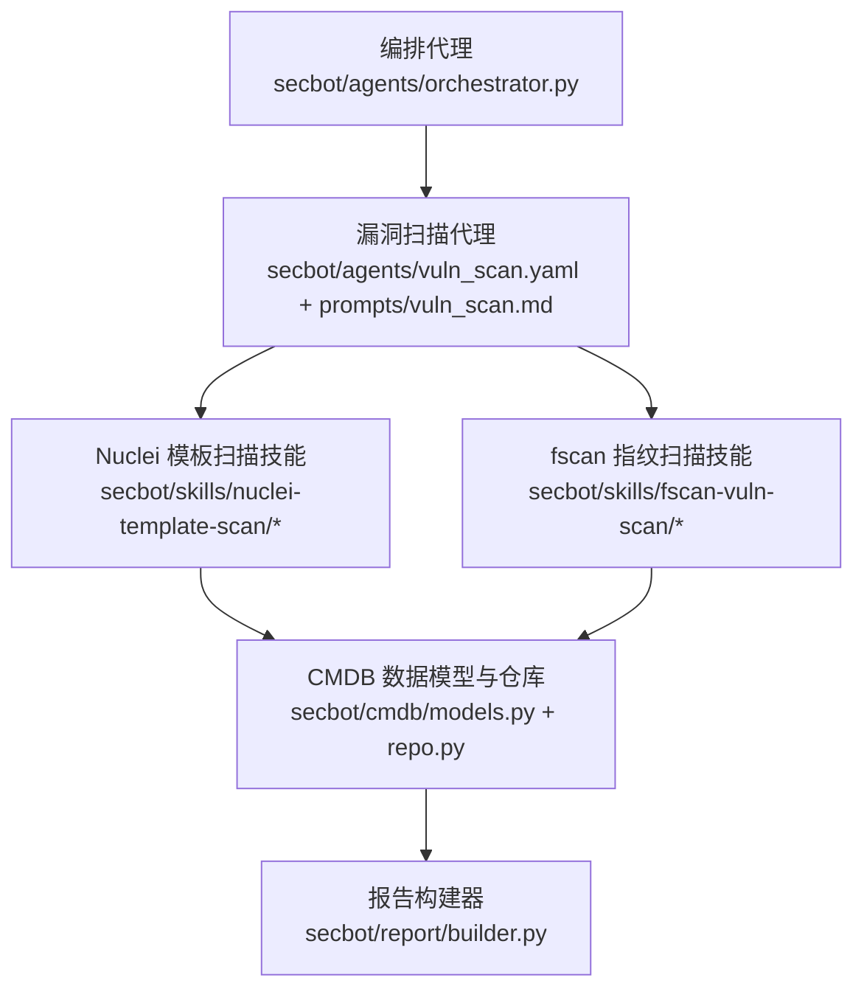
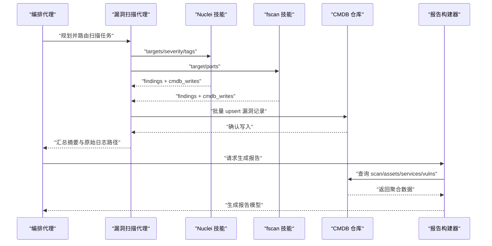
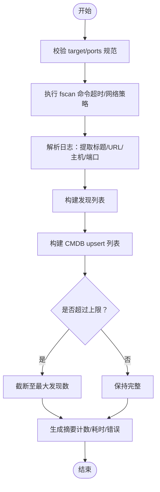
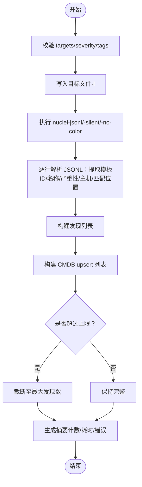
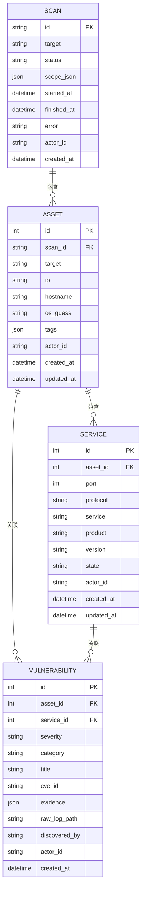
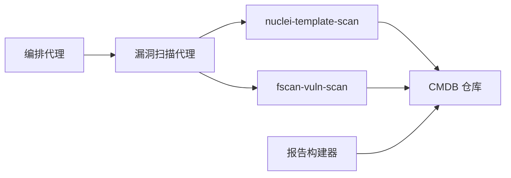

# 漏洞检测工具

<cite>
**本文引用的文件**
- [secbot/agents/vuln_scan.yaml](file://secbot/agents/vuln_scan.yaml)
- [secbot/agents/prompts/vuln_scan.md](file://secbot/agents/prompts/vuln_scan.md)
- [secbot/skills/fscan-vuln-scan/SKILL.md](file://secbot/skills/fscan-vuln-scan/SKILL.md)
- [secbot/skills/fscan-vuln-scan/handler.py](file://secbot/skills/fscan-vuln-scan/handler.py)
- [secbot/skills/nuclei-template-scan/SKILL.md](file://secbot/skills/nuclei-template-scan/SKILL.md)
- [secbot/skills/nuclei-template-scan/handler.py](file://secbot/skills/nuclei-template-scan/handler.py)
- [secbot/skills/nuclei-template-scan/input.schema.json](file://secbot/skills/nuclei-template-scan/input.schema.json)
- [secbot/skills/_shared/runner.py](file://secbot/skills/_shared/runner.py)
- [secbot/skills/types.py](file://secbot/skills/types.py)
- [secbot/cmdb/models.py](file://secbot/cmdb/models.py)
- [secbot/cmdb/repo.py](file://secbot/cmdb/repo.py)
- [secbot/cmdb/db.py](file://secbot/cmdb/db.py)
- [secbot/report/builder.py](file://secbot/report/builder.py)
- [secbot/agents/orchestrator.py](file://secbot/agents/orchestrator.py)
- [tests/skills/test_handlers.py](file://tests/skills/test_handlers.py)
- [tests/report/test_report.py](file://tests/report/test_report.py)
- [.trellis/tasks/archive/2026-05/05-07-cybersec-agent-platform/research/security-tool-functions.md](file://.trellis/tasks/archive/2026-05/05-07-cybersec-agent-platform/research/security-tool-functions.md)
</cite>

## 目录
1. [简介](#简介)
2. [项目结构](#项目结构)
3. [核心组件](#核心组件)
4. [架构总览](#架构总览)
5. [详细组件分析](#详细组件分析)
6. [依赖分析](#依赖分析)
7. [性能考虑](#性能考虑)
8. [故障排查指南](#故障排查指南)
9. [结论](#结论)
10. [附录](#附录)

## 简介
本文件面向“漏洞检测工具”的使用者与维护者，系统化阐述基于 fscan 的指纹型漏洞扫描与基于 Nuclei 的模板化扫描在本项目中的技术实现、算法与匹配机制、风险评估与严重性分级、扫描配置与输出规范，以及与 CMDB 的集成与漏洞跟踪流程。文档同时给出典型检测案例与结果分析思路，并提供可操作的排障建议。

## 项目结构
本项目采用“代理 + 技能（Skill）”的模块化设计：上层由编排代理负责工作流编排与策略决策，具体扫描任务通过独立技能实现，扫描结果统一写入本地 CMDB，并最终由报告构建器汇总生成报告。

图表来源
- [secbot/agents/orchestrator.py:1-70](file://secbot/agents/orchestrator.py#L1-L70)
- [secbot/agents/vuln_scan.yaml:1-53](file://secbot/agents/vuln_scan.yaml#L1-L53)
- [secbot/agents/prompts/vuln_scan.md:1-24](file://secbot/agents/prompts/vuln_scan.md#L1-L24)
- [secbot/skills/nuclei-template-scan/handler.py:1-154](file://secbot/skills/nuclei-template-scan/handler.py#L1-L154)
- [secbot/skills/fscan-vuln-scan/handler.py:1-116](file://secbot/skills/fscan-vuln-scan/handler.py#L1-L116)
- [secbot/cmdb/models.py:1-178](file://secbot/cmdb/models.py#L1-L178)
- [secbot/report/builder.py:1-178](file://secbot/report/builder.py#L1-L178)

章节来源
- [secbot/agents/orchestrator.py:1-70](file://secbot/agents/orchestrator.py#L1-L70)
- [secbot/agents/vuln_scan.yaml:1-53](file://secbot/agents/vuln_scan.yaml#L1-L53)
- [secbot/agents/prompts/vuln_scan.md:1-24](file://secbot/agents/prompts/vuln_scan.md#L1-L24)

## 核心组件
- 编排代理与工作流
  - 编排代理定义了安全运营助手的角色、硬性规则、可用专家代理表与工作风格，确保扫描按资产发现 → 端口扫描 → 漏洞扫描 → 报告的顺序执行。
  - 漏洞扫描代理负责筛选服务、选择合适的扫描技能（优先 Nuclei，必要时叠加 fscan），并以 CMDB 写入作为输出归宿。
- 扫描技能
  - fscan 指纹扫描技能：调用外部二进制 fscan，解析文本日志中的“漏洞命中”行，提取主机/端口/标题，生成结构化发现并写入 CMDB。
  - Nuclei 模板扫描技能：调用外部二进制 nuclei，读取 JSONL 输出，解析模板 ID、严重性、主机与匹配位置，生成结构化发现并写入 CMDB。
- CMDB 集成
  - 定义了 scan、asset、service、vulnerability 等核心表及枚举约束（严重性、扫描状态、漏洞类别）。
  - 提供 upsert 语义与查询接口，支持按严重性过滤与幂等更新（如高危重发现自动提升严重性）。
- 报告构建
  - 从 CMDB 一次性聚合资产、服务与漏洞，统计严重性分布，生成报告模型并支持多种渲染格式。

章节来源
- [secbot/agents/orchestrator.py:17-69](file://secbot/agents/orchestrator.py#L17-L69)
- [secbot/agents/vuln_scan.yaml:1-53](file://secbot/agents/vuln_scan.yaml#L1-L53)
- [secbot/agents/prompts/vuln_scan.md:1-24](file://secbot/agents/prompts/vuln_scan.md#L1-L24)
- [secbot/skills/fscan-vuln-scan/handler.py:1-116](file://secbot/skills/fscan-vuln-scan/handler.py#L1-L116)
- [secbot/skills/nuclei-template-scan/handler.py:1-154](file://secbot/skills/nuclei-template-scan/handler.py#L1-L154)
- [secbot/cmdb/models.py:139-178](file://secbot/cmdb/models.py#L139-L178)
- [secbot/report/builder.py:87-178](file://secbot/report/builder.py#L87-L178)

## 架构总览
下图展示从编排到技能执行、CMDB 写入与报告生成的端到端流程。

图表来源
- [secbot/agents/orchestrator.py:52-69](file://secbot/agents/orchestrator.py#L52-L69)
- [secbot/agents/vuln_scan.yaml:10-16](file://secbot/agents/vuln_scan.yaml#L10-L16)
- [secbot/skills/nuclei-template-scan/handler.py:98-154](file://secbot/skills/nuclei-template-scan/handler.py#L98-L154)
- [secbot/skills/fscan-vuln-scan/handler.py:75-116](file://secbot/skills/fscan-vuln-scan/handler.py#L75-L116)
- [secbot/cmdb/repo.py:322-369](file://secbot/cmdb/repo.py#L322-L369)
- [secbot/report/builder.py:87-178](file://secbot/report/builder.py#L87-L178)

## 详细组件分析

### fscan 指纹扫描技能
- 技术实现
  - 外部二进制调用：使用统一的命令执行封装，设置超时、网络策略与取消令牌。
  - 日志解析：正则匹配“[+] poc-...”风格的命中行，提取标题与 URL，再从 URL 中解析主机与端口。
  - 结果生成：构造发现列表与 CMDB upsert 写入，限制最大发现数量，避免过量输出。
- 输入/输出与配置
  - 输入参数：目标（CIDR/IP/域名）、端口列表（默认常用端口组合）。
  - 输出：发现列表（含 host/port/title/severity）、CMDB 写入（vulnerabilities 表）、摘要统计与原始日志路径。
- 错误处理
  - 超时、取消、二进制缺失等异常均被转换为结构化摘要返回，便于上层感知。
- 与 CMDB 的集成
  - 通过统一的 cmdb_writes 列表，将每条发现转换为 vulnerabilities 表的 upsert 操作，字段包括模板 ID、严重性、目标、证据与标题。

图表来源
- [secbot/skills/fscan-vuln-scan/handler.py:35-72](file://secbot/skills/fscan-vuln-scan/handler.py#L35-L72)
- [secbot/skills/fscan-vuln-scan/handler.py:75-116](file://secbot/skills/fscan-vuln-scan/handler.py#L75-L116)
- [secbot/skills/_shared/runner.py:38-83](file://secbot/skills/_shared/runner.py#L38-L83)

章节来源
- [secbot/skills/fscan-vuln-scan/SKILL.md:1-16](file://secbot/skills/fscan-vuln-scan/SKILL.md#L1-L16)
- [secbot/skills/fscan-vuln-scan/handler.py:1-116](file://secbot/skills/fscan-vuln-scan/handler.py#L1-L116)
- [secbot/skills/_shared/runner.py:1-83](file://secbot/skills/_shared/runner.py#L1-L83)
- [tests/skills/test_handlers.py:206-234](file://tests/skills/test_handlers.py#L206-L234)

### Nuclei 模板扫描技能
- 技术实现
  - 外部二进制调用：将目标列表写入临时文件，传给 nuclei 的 -l 参数，启用 JSONL 输出与静默模式。
  - 输出解析：逐行读取 JSONL，提取模板 ID、信息块（名称/严重性）、主机与匹配位置，生成发现与 CMDB upsert。
  - 参数校验：对 targets 数量、格式、severity 选项与 tags 字符集进行严格校验。
- 输入/输出与配置
  - 输入参数：targets（数组，最多 256 项）、severity（限定集合）、tags（字符串，允许字母、数字、逗号、下划线、连字符）。
  - 输出：发现列表（含 template_id/severity/host/matched_at/name）、CMDB 写入、摘要统计与原始日志路径。
- 错误处理
  - 超时、取消、二进制缺失等异常均被转换为结构化摘要返回。
- 与 CMDB 的集成
  - 通过统一的 cmdb_writes 列表，将每条发现转换为 vulnerabilities 表的 upsert 操作，字段包括模板 ID、严重性、目标、证据与标题。

图表来源
- [secbot/skills/nuclei-template-scan/handler.py:36-48](file://secbot/skills/nuclei-template-scan/handler.py#L36-L48)
- [secbot/skills/nuclei-template-scan/handler.py:50-96](file://secbot/skills/nuclei-template-scan/handler.py#L50-L96)
- [secbot/skills/nuclei-template-scan/handler.py:98-154](file://secbot/skills/nuclei-template-scan/handler.py#L98-L154)
- [secbot/skills/nuclei-template-scan/input.schema.json:1-30](file://secbot/skills/nuclei-template-scan/input.schema.json#L1-L30)

章节来源
- [secbot/skills/nuclei-template-scan/SKILL.md:1-17](file://secbot/skills/nuclei-template-scan/SKILL.md#L1-L17)
- [secbot/skills/nuclei-template-scan/handler.py:1-154](file://secbot/skills/nuclei-template-scan/handler.py#L1-L154)
- [secbot/skills/nuclei-template-scan/input.schema.json:1-30](file://secbot/skills/nuclei-template-scan/input.schema.json#L1-L30)
- [tests/skills/test_handlers.py:163-204](file://tests/skills/test_handlers.py#L163-L204)

### 漏洞扫描代理与编排策略
- 代理职责
  - 对来自端口扫描的服务列表进行筛选：优先 HTTP/HTTPS 与易受攻击协议，避免对无模板覆盖的纯 TCP 服务发起扫描。
  - 默认优先 Nuclei 模板扫描；当服务列表包含 Nuclei 覆盖不足的协议（如 SMB/RDP/内部 RPC）时，叠加 fscan 指纹扫描。
  - 应用严重性门槛（默认 medium），避免噪声。
  - 将发现以 CMDB 写入的形式暴露给上游，不直接操作数据库。
- 输出规范
  - 返回结构化的 findings 列表，限制最大数量，对字段进行长度裁剪，保证输出可控。

章节来源
- [secbot/agents/prompts/vuln_scan.md:1-24](file://secbot/agents/prompts/vuln_scan.md#L1-L24)
- [secbot/agents/vuln_scan.yaml:10-16](file://secbot/agents/vuln_scan.yaml#L10-L16)
- [secbot/agents/vuln_scan.yaml:37-53](file://secbot/agents/vuln_scan.yaml#L37-L53)

### CMDB 数据模型与漏洞跟踪
- 数据模型
  - scan、asset、service、vulnerability 四张核心表，支持多租户 actor_id、索引优化与外键约束。
  - 漏洞表包含严重性、类别、标题、CVE 编号、证据、原始日志路径、发现来源等字段。
- 写入与幂等
  - upsert 逻辑：若相同资产/服务组合重复发现，自动提升严重性并合并证据，保证历史不丢失。
  - 查询接口支持按严重性过滤与分页。
- 集成点
  - 技能通过 cmdb_writes 列表提交写入；仓库层负责持久化与一致性保障。

图表来源
- [secbot/cmdb/models.py:38-171](file://secbot/cmdb/models.py#L38-L171)

章节来源
- [secbot/cmdb/models.py:1-178](file://secbot/cmdb/models.py#L1-L178)
- [secbot/cmdb/repo.py:322-369](file://secbot/cmdb/repo.py#L322-L369)
- [tests/cmdb/test_repo.py:147-184](file://tests/cmdb/test_repo.py#L147-L184)

### 报告生成与可视化
- 报告模型
  - 从 CMDB 一次性聚合 scan、asset、service、vulnerability，计算严重性计数与统计摘要。
  - 支持按严重性排序、收集原始日志路径以便溯源。
- 渲染与导出
  - 报告构建器提供结构化模型，后续可对接多种渲染器（Markdown/PDF/DOCX）生成最终报告。

章节来源
- [secbot/report/builder.py:87-178](file://secbot/report/builder.py#L87-L178)
- [tests/report/test_report.py:59-90](file://tests/report/test_report.py#L59-L90)

## 依赖分析
- 组件耦合
  - 漏洞扫描代理与两类扫描技能松耦合：通过输入/输出约定与 CMDB 写入契约交互。
  - 技能与外部二进制强耦合，但通过统一的命令执行封装屏蔽差异。
  - CMDB 作为唯一事实源，被报告构建器与技能共同消费。
- 可能的循环依赖
  - 当前结构清晰，无明显循环依赖迹象。
- 外部依赖与集成点
  - fscan 与 nuclei 为外部二进制，需确保环境可用与版本兼容。
  - CMDB 使用 SQLite（异步 SQLAlchemy），默认路径位于用户主目录下的 .secbot 目录。

图表来源
- [secbot/agents/vuln_scan.yaml:10-12](file://secbot/agents/vuln_scan.yaml#L10-L12)
- [secbot/skills/nuclei-template-scan/handler.py:98-154](file://secbot/skills/nuclei-template-scan/handler.py#L98-L154)
- [secbot/skills/fscan-vuln-scan/handler.py:75-116](file://secbot/skills/fscan-vuln-scan/handler.py#L75-L116)
- [secbot/report/builder.py:87-178](file://secbot/report/builder.py#L87-L178)

章节来源
- [secbot/cmdb/db.py:64-93](file://secbot/cmdb/db.py#L64-L93)
- [.trellis/tasks/archive/2026-05/05-07-cybersec-agent-platform/research/security-tool-functions.md:247-290](file://.trellis/tasks/archive/2026-05/05-07-cybersec-agent-platform/research/security-tool-functions.md#L247-L290)

## 性能考虑
- 超时与并发
  - 技能统一设置超时（约 900 秒），避免长时间阻塞；取消令牌支持中止长耗时任务。
- 输出规模控制
  - 发现列表上限与字段裁剪，防止大体积输出影响下游处理。
- 数据库并发
  - SQLite 启用 WAL 模式与连接级 pragma，提升多读场景下的吞吐与稳定性。
- 解析效率
  - Nuclei 使用 JSONL 流式解析，减少内存占用；fscan 使用正则逐行扫描，复杂度与日志大小线性相关。

章节来源
- [secbot/skills/fscan-vuln-scan/handler.py:84-92](file://secbot/skills/fscan-vuln-scan/handler.py#L84-L92)
- [secbot/skills/nuclei-template-scan/handler.py:122-130](file://secbot/skills/nuclei-template-scan/handler.py#L122-L130)
- [secbot/skills/_shared/runner.py:38-83](file://secbot/skills/_shared/runner.py#L38-L83)
- [secbot/cmdb/db.py:51-61](file://secbot/cmdb/db.py#L51-L61)

## 故障排查指南
- 常见问题与定位
  - 外部二进制缺失：抛出特定异常，检查 PATH 与安装状态。
  - 超时或取消：查看摘要中的 error/cancelled 字段，确认资源与网络状况。
  - 参数非法：输入校验失败会抛出参数异常，核对 targets/severity/tags 格式。
  - CMDB 写入幂等异常：若严重性未提升或证据未合并，检查 upsert 逻辑与字段映射。
- 建议步骤
  - 查看技能摘要与原始日志路径，定位具体阶段。
  - 在测试环境中复现（参考单元测试），逐步缩小范围。
  - 校验 CMDB 表结构与枚举值，确保与模型定义一致。

章节来源
- [secbot/skills/types.py:19-37](file://secbot/skills/types.py#L19-L37)
- [tests/skills/test_handlers.py:163-234](file://tests/skills/test_handlers.py#L163-L234)
- [tests/cmdb/test_repo.py:187-212](file://tests/cmdb/test_repo.py#L187-L212)

## 结论
本漏洞检测工具通过“编排代理 + 技能 + CMDB + 报告”的分层架构，实现了对 HTTP/HTTPS 与特定协议的模板化与指纹化双重扫描能力。技能侧以严格的参数校验、统一的命令执行封装与结构化输出契约，确保扫描过程的可控与可观测；CMDB 提供幂等写入与查询能力，支撑漏洞跟踪与报告生成。整体设计兼顾易用性与扩展性，适合在企业内网与受控环境中部署与迭代。

## 附录

### 扫描配置参数与输出格式
- Nuclei 模板扫描
  - 输入参数
    - targets：数组，最多 256 项，支持 URL 或 IP/域名带可选端口。
    - severity：限定集合（如 medium,high,critical 等）。
    - tags：字符串，允许字母、数字、逗号、下划线、连字符。
  - 输出字段
    - findings：包含 template_id、severity、host、matched_at、name。
    - cmdb_writes：vulnerabilities 表 upsert 条目。
- fscan 指纹扫描
  - 输入参数
    - target：CIDR/IP/域名。
    - ports：端口规范字符串（数字、逗号、短横线）。
  - 输出字段
    - findings：包含 host、port、title、severity。
    - cmdb_writes：vulnerabilities 表 upsert 条目。

章节来源
- [secbot/skills/nuclei-template-scan/input.schema.json:1-30](file://secbot/skills/nuclei-template-scan/input.schema.json#L1-L30)
- [secbot/skills/nuclei-template-scan/handler.py:98-154](file://secbot/skills/nuclei-template-scan/handler.py#L98-L154)
- [secbot/skills/fscan-vuln-scan/handler.py:75-116](file://secbot/skills/fscan-vuln-scan/handler.py#L75-L116)

### 漏洞分类、严重性评级与修复建议处理流程
- 分类与严重性
  - 分类：cve、weak_password、misconfig、exposure。
  - 严重性：critical、high、medium、low、info。
- 修复建议处理
  - 建议在 evidence 字段中沉淀证据与建议摘要，报告构建器可据此生成摘要字段，便于审阅与追踪。
  - 对于重复发现，遵循“严重性提升、证据合并”的幂等策略，确保历史可追溯。

章节来源
- [secbot/cmdb/models.py:173-177](file://secbot/cmdb/models.py#L173-L177)
- [secbot/cmdb/repo.py:322-369](file://secbot/cmdb/repo.py#L322-L369)
- [secbot/report/builder.py:130-146](file://secbot/report/builder.py#L130-L146)

### 实际检测案例与结果分析示例
- Nuclei 案例
  - 输入：targets 包含两个 URL。
  - 输出：findings 计数为 2，分别对应不同模板 ID 与严重性；CMDB 写入两条记录。
  - 校验：单元测试模拟 JSONL 输出并断言 findings 与 cmdb_writes。
- fscan 案例
  - 输入：target 为 CIDR。
  - 输出：findings 计数为 2，分别对应不同主机；CMDB 写入两条记录。
  - 校验：单元测试模拟日志输出并断言 findings 与 cmdb_writes。

章节来源
- [tests/skills/test_handlers.py:163-234](file://tests/skills/test_handlers.py#L163-L234)
- [tests/report/test_report.py:59-90](file://tests/report/test_report.py#L59-L90)

### 与 CMDB 的集成方式与漏洞跟踪机制
- 集成方式
  - 技能通过 cmdb_writes 列表提交写入，仓库层负责 upsert 与一致性。
  - 报告构建器从 CMDB 一次性聚合数据，生成报告模型。
- 跟踪机制
  - 通过 discovered_by 字段标识发现来源，结合 severity 与 category 进行分类统计与趋势分析。
  - 支持按严重性过滤与分页查询，便于审计与回溯。

章节来源
- [secbot/skills/nuclei-template-scan/handler.py:80-92](file://secbot/skills/nuclei-template-scan/handler.py#L80-L92)
- [secbot/skills/fscan-vuln-scan/handler.py:57-69](file://secbot/skills/fscan-vuln-scan/handler.py#L57-L69)
- [secbot/report/builder.py:108-146](file://secbot/report/builder.py#L108-L146)
- [tests/cmdb/test_repo.py:147-184](file://tests/cmdb/test_repo.py#L147-L184)