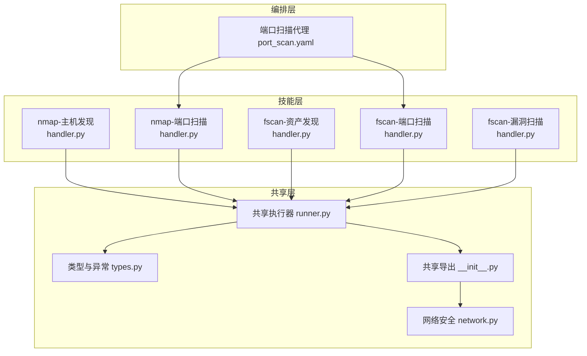
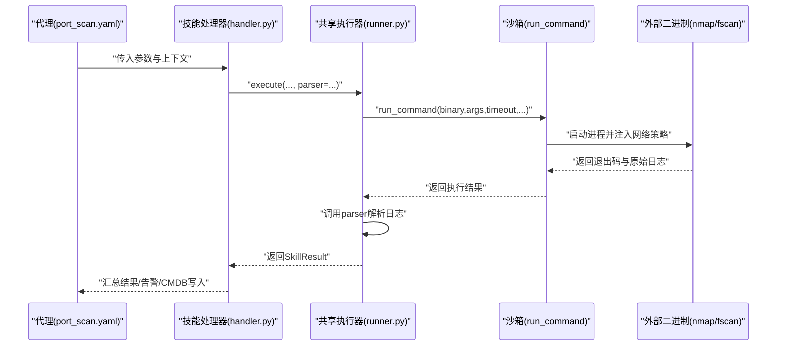
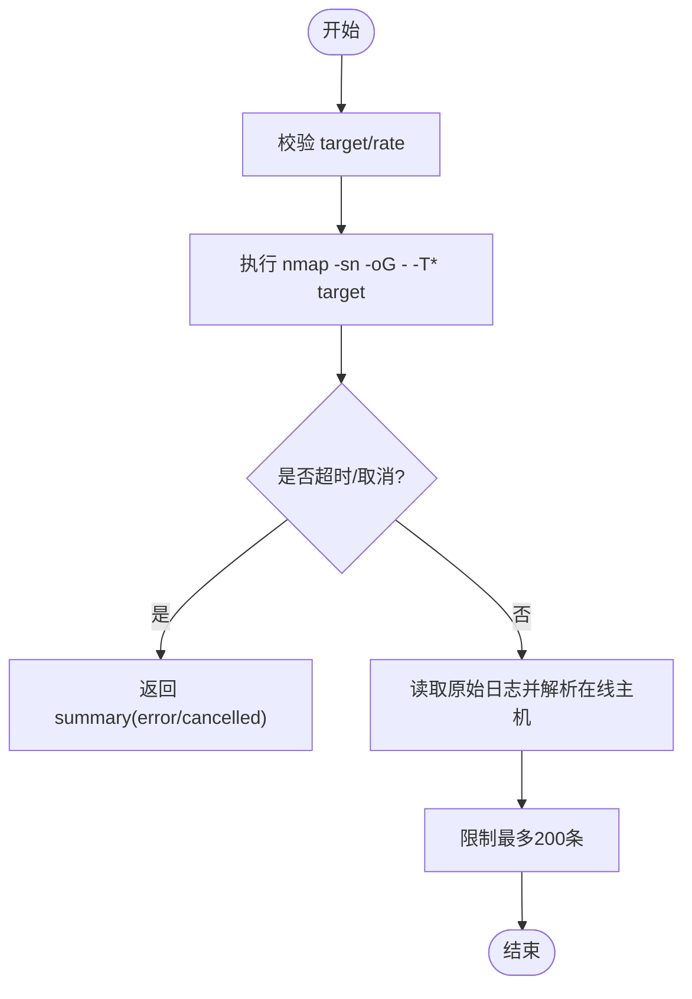
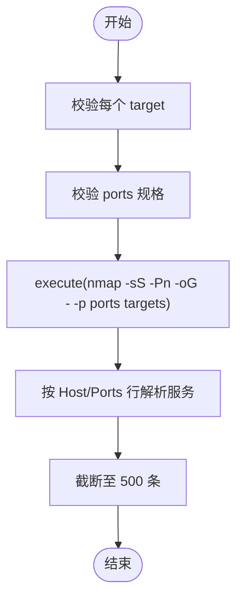
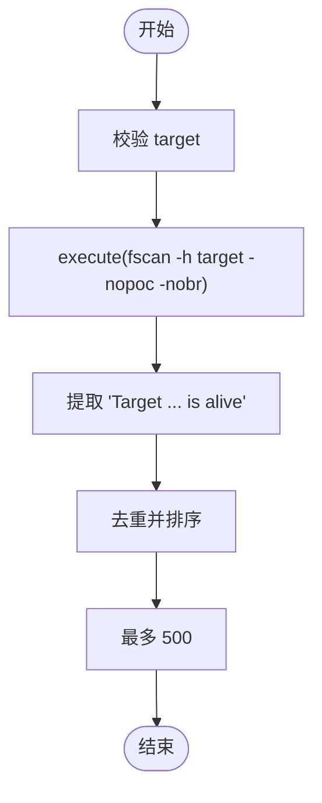
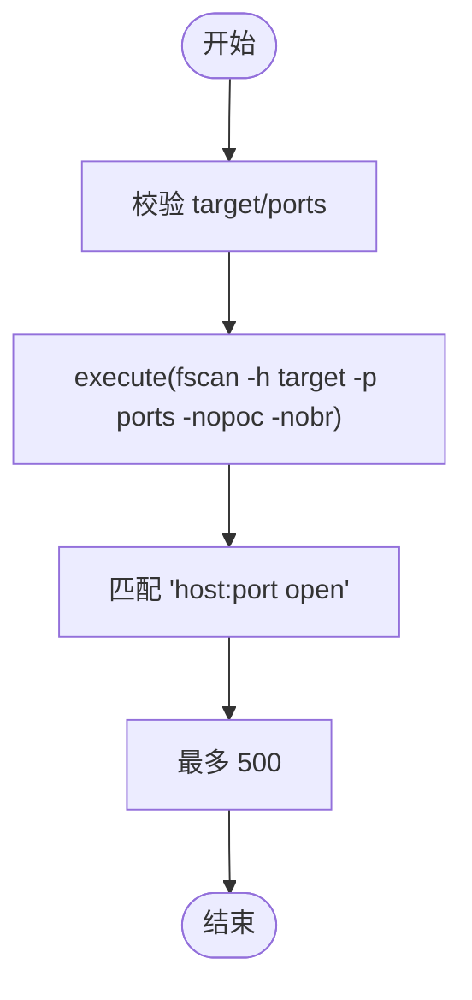
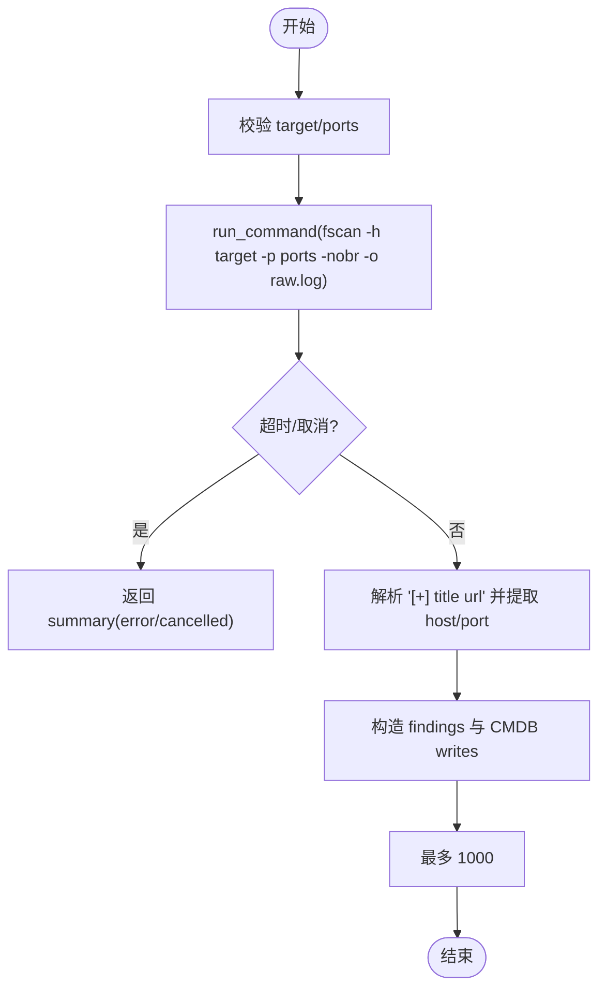
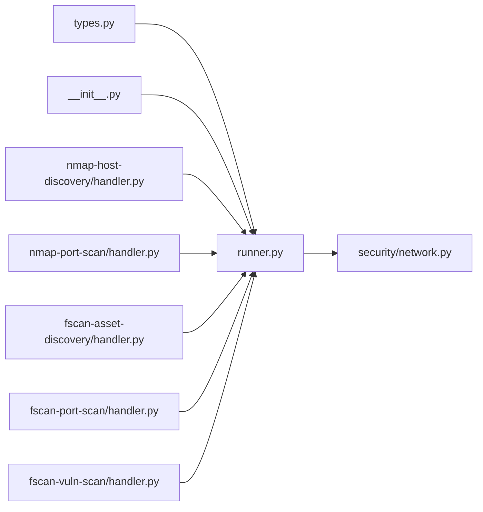

# 网络扫描工具

<cite>
**本文引用的文件**
- [secbot/skills/nmap-host-discovery/handler.py](file://secbot/skills/nmap-host-discovery/handler.py)
- [secbot/skills/nmap-host-discovery/input.schema.json](file://secbot/skills/nmap-host-discovery/input.schema.json)
- [secbot/skills/nmap-host-discovery/output.schema.json](file://secbot/skills/nmap-host-discovery/output.schema.json)
- [secbot/skills/nmap-port-scan/handler.py](file://secbot/skills/nmap-port-scan/handler.py)
- [secbot/skills/nmap-port-scan/input.schema.json](file://secbot/skills/nmap-port-scan/input.schema.json)
- [secbot/skills/nmap-port-scan/output.schema.json](file://secbot/skills/nmap-port-scan/output.schema.json)
- [secbot/skills/fscan-asset-discovery/handler.py](file://secbot/skills/fscan-asset-discovery/handler.py)
- [secbot/skills/fscan-asset-discovery/input.schema.json](file://secbot/skills/fscan-asset-discovery/input.schema.json)
- [secbot/skills/fscan-asset-discovery/output.schema.json](file://secbot/skills/fscan-asset-discovery/output.schema.json)
- [secbot/skills/fscan-port-scan/handler.py](file://secbot/skills/fscan-port-scan/handler.py)
- [secbot/skills/fscan-port-scan/input.schema.json](file://secbot/skills/fscan-port-scan/input.schema.json)
- [secbot/skills/fscan-port-scan/output.schema.json](file://secbot/skills/fscan-port-scan/output.schema.json)
- [secbot/skills/fscan-vuln-scan/handler.py](file://secbot/skills/fscan-vuln-scan/handler.py)
- [secbot/skills/fscan-vuln-scan/input.schema.json](file://secbot/skills/fscan-vuln-scan/input.schema.json)
- [secbot/skills/fscan-vuln-scan/output.schema.json](file://secbot/skills/fscan-vuln-scan/output.schema.json)
- [secbot/skills/_shared/runner.py](file://secbot/skills/_shared/runner.py)
- [secbot/skills/_shared/__init__.py](file://secbot/skills/_shared/__init__.py)
- [secbot/skills/types.py](file://secbot/skills/types.py)
- [secbot/security/network.py](file://secbot/security/network.py)
- [secbot/agents/port_scan.yaml](file://secbot/agents/port_scan.yaml)
</cite>

## 目录
1. [简介](#简介)
2. [项目结构](#项目结构)
3. [核心组件](#核心组件)
4. [架构总览](#架构总览)
5. [详细组件分析](#详细组件分析)
6. [依赖分析](#依赖分析)
7. [性能考虑](#性能考虑)
8. [故障排查指南](#故障排查指南)
9. [结论](#结论)
10. [附录：使用示例与最佳实践](#附录使用示例与最佳实践)

## 简介
本文件系统性梳理仓库中的网络扫描能力，覆盖 nmap 与 fscan 两大系列工具的技能实现与使用方法。内容包括：
- 主机发现与端口扫描的工作原理与参数配置
- 目标地址验证规则、扫描速率控制与超时机制
- 网络策略配置、权限控制与安全限制（含SSRF防护）
- 输出解析、错误处理与性能优化建议
- 面向不同扫描场景的完整使用示例与最佳实践

## 项目结构
本项目以“技能（Skill）”为最小可执行单元，围绕 nmap 与 fscan 的主机发现、端口扫描、漏洞扫描等能力构建。核心目录与职责如下：
- secbot/skills：各扫描技能的实现与输入/输出模式定义
- secbot/skills/_shared：通用执行器、校验器与沙箱封装
- secbot/security：网络与URL安全校验（SSRF防护）
- secbot/agents：编排扫描流程的代理配置（如端口扫描代理）

图表来源
- [secbot/skills/nmap-host-discovery/handler.py:35-81](file://secbot/skills/nmap-host-discovery/handler.py#L35-L81)
- [secbot/skills/nmap-port-scan/handler.py:32-48](file://secbot/skills/nmap-port-scan/handler.py#L32-L48)
- [secbot/skills/fscan-asset-discovery/handler.py:24-36](file://secbot/skills/fscan-asset-discovery/handler.py#L24-L36)
- [secbot/skills/fscan-port-scan/handler.py:31-45](file://secbot/skills/fscan-port-scan/handler.py#L31-L45)
- [secbot/skills/fscan-vuln-scan/handler.py:75-116](file://secbot/skills/fscan-vuln-scan/handler.py#L75-L116)
- [secbot/skills/_shared/runner.py:38-83](file://secbot/skills/_shared/runner.py#L38-L83)
- [secbot/skills/_shared/__init__.py:1-20](file://secbot/skills/_shared/__init__.py#L1-L20)
- [secbot/skills/types.py:44-87](file://secbot/skills/types.py#L44-L87)
- [secbot/security/network.py:1-120](file://secbot/security/network.py#L1-L120)
- [secbot/agents/port_scan.yaml:1-50](file://secbot/agents/port_scan.yaml#L1-L50)

章节来源
- [secbot/skills/nmap-host-discovery/handler.py:1-81](file://secbot/skills/nmap-host-discovery/handler.py#L1-L81)
- [secbot/skills/nmap-port-scan/handler.py:1-48](file://secbot/skills/nmap-port-scan/handler.py#L1-L48)
- [secbot/skills/fscan-asset-discovery/handler.py:1-36](file://secbot/skills/fscan-asset-discovery/handler.py#L1-L36)
- [secbot/skills/fscan-port-scan/handler.py:1-45](file://secbot/skills/fscan-port-scan/handler.py#L1-L45)
- [secbot/skills/fscan-vuln-scan/handler.py:1-116](file://secbot/skills/fscan-vuln-scan/handler.py#L1-L116)
- [secbot/skills/_shared/runner.py:1-83](file://secbot/skills/_shared/runner.py#L1-L83)
- [secbot/skills/_shared/__init__.py:1-20](file://secbot/skills/_shared/__init__.py#L1-L20)
- [secbot/skills/types.py:1-87](file://secbot/skills/types.py#L1-L87)
- [secbot/security/network.py:1-120](file://secbot/security/network.py#L1-L120)
- [secbot/agents/port_scan.yaml:1-50](file://secbot/agents/port_scan.yaml#L1-L50)

## 核心组件
- 共享执行器与校验器
  - 统一的 execute 封装，负责二进制调用、超时、取消、日志捕获与结果解析
  - 目标与端口规格的正则校验，避免非法输入
- 类型与异常体系
  - 定义 SkillResult/SkillContext 以及 SkillTimeout、SkillCancelled、InvalidSkillArg 等异常
- 沙箱与网络策略
  - run_command 基于白名单二进制与网络策略执行外部命令
  - network.py 提供SSRF白名单与内部地址阻断能力

章节来源
- [secbot/skills/_shared/runner.py:20-36](file://secbot/skills/_shared/runner.py#L20-L36)
- [secbot/skills/_shared/runner.py:38-83](file://secbot/skills/_shared/runner.py#L38-L83)
- [secbot/skills/types.py:19-37](file://secbot/skills/types.py#L19-L37)
- [secbot/skills/types.py:44-87](file://secbot/skills/types.py#L44-L87)
- [secbot/skills/_shared/__init__.py:3-19](file://secbot/skills/_shared/__init__.py#L3-L19)
- [secbot/security/network.py:29-37](file://secbot/security/network.py#L29-L37)

## 架构总览
下图展示了从代理到技能、再到共享执行器与沙箱的整体调用链路。

图表来源
- [secbot/agents/port_scan.yaml:10-16](file://secbot/agents/port_scan.yaml#L10-L16)
- [secbot/skills/nmap-port-scan/handler.py:32-48](file://secbot/skills/nmap-port-scan/handler.py#L32-L48)
- [secbot/skills/fscan-port-scan/handler.py:31-45](file://secbot/skills/fscan-port-scan/handler.py#L31-L45)
- [secbot/skills/_shared/runner.py:38-83](file://secbot/skills/_shared/runner.py#L38-L83)
- [secbot/skills/_shared/__init__.py:3-19](file://secbot/skills/_shared/__init__.py#L3-L19)

## 详细组件分析

### nmap-主机发现（nmap-host-discovery）
- 功能概述
  - 使用 nmap 进行主机发现（-sn），输出为 grepable 格式，解析“主机在线”列表
- 关键参数
  - target：支持IPv4、域名、IPv6（含CIDR）
  - rate：slow/normal/fast 对应 nmap -T2/-T3/-T4
- 超时与日志
  - 超时 120 秒；将原始日志写入 nmap-host-discovery.log
- 输出与限制
  - hosts_up 最多 200 条；附加 elapsed_sec 或 error 字段
- 错误处理
  - 超时返回 summary.error；取消返回 cancelled；二进制缺失抛出特定异常

图表来源
- [secbot/skills/nmap-host-discovery/handler.py:35-81](file://secbot/skills/nmap-host-discovery/handler.py#L35-L81)

章节来源
- [secbot/skills/nmap-host-discovery/handler.py:24-28](file://secbot/skills/nmap-host-discovery/handler.py#L24-L28)
- [secbot/skills/nmap-host-discovery/handler.py:47-56](file://secbot/skills/nmap-host-discovery/handler.py#L47-L56)
- [secbot/skills/nmap-host-discovery/handler.py:67-70](file://secbot/skills/nmap-host-discovery/handler.py#L67-L70)
- [secbot/skills/nmap-host-discovery/input.schema.json:6-16](file://secbot/skills/nmap-host-discovery/input.schema.json#L6-L16)
- [secbot/skills/nmap-host-discovery/output.schema.json:6-14](file://secbot/skills/nmap-host-discovery/output.schema.json#L6-L14)

### nmap-端口扫描（nmap-port-scan）
- 功能概述
  - 使用 nmap 扫描指定目标的开放端口，解析 grepable 输出中的“Host: ... Ports: ...”
- 关键参数
  - targets：数组，最多 256 个
  - ports：端口规格字符串，默认 1-1024
- 解析逻辑
  - 支持 tcp/udp 协议识别；最多返回 500 条服务记录
- 超时与日志
  - 超时 600 秒；通过 execute 统一封装与解析

图表来源
- [secbot/skills/nmap-port-scan/handler.py:32-48](file://secbot/skills/nmap-port-scan/handler.py#L32-L48)
- [secbot/skills/nmap-port-scan/handler.py:17-29](file://secbot/skills/nmap-port-scan/handler.py#L17-L29)

章节来源
- [secbot/skills/nmap-port-scan/handler.py:12-14](file://secbot/skills/nmap-port-scan/handler.py#L12-L14)
- [secbot/skills/nmap-port-scan/handler.py:32-48](file://secbot/skills/nmap-port-scan/handler.py#L32-L48)
- [secbot/skills/nmap-port-scan/input.schema.json:6-9](file://secbot/skills/nmap-port-scan/input.schema.json#L6-L9)
- [secbot/skills/nmap-port-scan/output.schema.json:5-22](file://secbot/skills/nmap-port-scan/output.schema.json#L5-L22)

### fscan-资产发现（fscan-asset-discovery）
- 功能概述
  - 使用 fscan 对单个目标进行存活探测，解析“Target X.X.X.X is alive”
- 关键参数
  - target：单个目标（IP/域名/CIDR）
- 解析逻辑
  - 去重后最多返回 500 个在线主机
- 超时与日志
  - 超时 300 秒；通过 execute 统一封装

图表来源
- [secbot/skills/fscan-asset-discovery/handler.py:24-36](file://secbot/skills/fscan-asset-discovery/handler.py#L24-L36)
- [secbot/skills/fscan-asset-discovery/handler.py:16-21](file://secbot/skills/fscan-asset-discovery/handler.py#L16-L21)

章节来源
- [secbot/skills/fscan-asset-discovery/handler.py:12-13](file://secbot/skills/fscan-asset-discovery/handler.py#L12-L13)
- [secbot/skills/fscan-asset-discovery/handler.py:24-36](file://secbot/skills/fscan-asset-discovery/handler.py#L24-L36)
- [secbot/skills/fscan-asset-discovery/input.schema.json:6-8](file://secbot/skills/fscan-asset-discovery/input.schema.json#L6-L8)
- [secbot/skills/fscan-asset-discovery/output.schema.json:5-8](file://secbot/skills/fscan-asset-discovery/output.schema.json#L5-L8)

### fscan-端口扫描（fscan-port-scan）
- 功能概述
  - 使用 fscan 对单个目标进行端口扫描，解析 “X.X.X.X:YYYY open”
- 关键参数
  - target：单个目标
  - ports：默认 1-65535
- 解析逻辑
  - 默认协议为 tcp；最多返回 500 条
- 超时与日志
  - 超时 900 秒；通过 execute 统一封装

图表来源
- [secbot/skills/fscan-port-scan/handler.py:31-45](file://secbot/skills/fscan-port-scan/handler.py#L31-L45)
- [secbot/skills/fscan-port-scan/handler.py:17-28](file://secbot/skills/fscan-port-scan/handler.py#L17-L28)

章节来源
- [secbot/skills/fscan-port-scan/handler.py:12-14](file://secbot/skills/fscan-port-scan/handler.py#L12-L14)
- [secbot/skills/fscan-port-scan/handler.py:31-45](file://secbot/skills/fscan-port-scan/handler.py#L31-L45)
- [secbot/skills/fscan-port-scan/input.schema.json:6-8](file://secbot/skills/fscan-port-scan/input.schema.json#L6-L8)
- [secbot/skills/fscan-port-scan/output.schema.json:5-18](file://secbot/skills/fscan-port-scan/output.schema.json#L5-L18)

### fscan-漏洞扫描（fscan-vuln-scan）
- 功能概述
  - 使用 fscan 执行默认POC检测，解析形如 “[+] poc-xxx http://host:port/...” 的命中行
- 关键参数
  - target：单个目标
  - ports：默认 80,443,8080,8443
- 解析与CMDB写入
  - 提取 host/port/title；生成 findings 与 CMDB upsert 写入
  - 最多 1000 条
- 超时与日志
  - 超时 900 秒；直接捕获原始日志用于后续解析

图表来源
- [secbot/skills/fscan-vuln-scan/handler.py:75-116](file://secbot/skills/fscan-vuln-scan/handler.py#L75-L116)
- [secbot/skills/fscan-vuln-scan/handler.py:35-72](file://secbot/skills/fscan-vuln-scan/handler.py#L35-L72)

章节来源
- [secbot/skills/fscan-vuln-scan/handler.py:24-31](file://secbot/skills/fscan-vuln-scan/handler.py#L24-L31)
- [secbot/skills/fscan-vuln-scan/handler.py:75-116](file://secbot/skills/fscan-vuln-scan/handler.py#L75-L116)
- [secbot/skills/fscan-vuln-scan/input.schema.json:6-8](file://secbot/skills/fscan-vuln-scan/input.schema.json#L6-L8)
- [secbot/skills/fscan-vuln-scan/output.schema.json:5-10](file://secbot/skills/fscan-vuln-scan/output.schema.json#L5-L10)

## 依赖分析
- 技能对共享执行器的依赖
  - 所有技能均通过 execute 或 run_command 统一发起外部命令调用
- 输入/输出模式
  - 各技能均提供 JSON Schema 的输入/输出约束，确保参数合法性与结果结构化
- 网络安全与权限
  - run_command 通过 NetworkPolicy 控制网络访问；network.py 提供SSRF白名单与内部地址阻断

图表来源
- [secbot/skills/_shared/runner.py:10-18](file://secbot/skills/_shared/runner.py#L10-L18)
- [secbot/skills/_shared/__init__.py:3-19](file://secbot/skills/_shared/__init__.py#L3-L19)
- [secbot/security/network.py:29-37](file://secbot/security/network.py#L29-L37)
- [secbot/skills/nmap-host-discovery/handler.py:47-56](file://secbot/skills/nmap-host-discovery/handler.py#L47-L56)
- [secbot/skills/nmap-port-scan/handler.py:40-47](file://secbot/skills/nmap-port-scan/handler.py#L40-L47)
- [secbot/skills/fscan-asset-discovery/handler.py:28-35](file://secbot/skills/fscan-asset-discovery/handler.py#L28-L35)
- [secbot/skills/fscan-port-scan/handler.py:37-44](file://secbot/skills/fscan-port-scan/handler.py#L37-L44)
- [secbot/skills/fscan-vuln-scan/handler.py:85-92](file://secbot/skills/fscan-vuln-scan/handler.py#L85-L92)

章节来源
- [secbot/skills/_shared/runner.py:38-83](file://secbot/skills/_shared/runner.py#L38-L83)
- [secbot/skills/_shared/__init__.py:1-20](file://secbot/skills/_shared/__init__.py#L1-L20)
- [secbot/security/network.py:1-120](file://secbot/security/network.py#L1-L120)

## 性能考虑
- 扫描速率控制
  - nmap 主机发现通过 -T2/-T3/-T4 控制扫描速度；在大规模网段时建议使用 slow
- 超时设置
  - 不同技能设置不同超时：主机发现 120s、端口扫描 600s、资产/漏洞扫描 300s/900s
- 日志与解析上限
  - 在解析阶段对结果集进行上限控制（如最多 200/500/1000），避免内存与带宽压力
- 并发与批量
  - nmap 端口扫描支持 targets 数组，建议按子网或业务域拆分，避免单次请求过大
- 网络策略
  - 通过 NetworkPolicy 与 SSRF 白名单，减少不必要的网络往返与潜在风险

## 故障排查指南
- 常见错误与定位
  - InvalidSkillArg：target/ports 校验失败；检查输入格式与长度
  - SkillTimeout：超过设定超时；调整速率或扩大超时，或缩小扫描范围
  - SkillCancelled：任务被取消；检查取消令牌状态
  - SkillBinaryMissing：未找到 nmap/fscan；确认二进制安装与 PATH
- 日志与诊断
  - 所有技能均生成原始日志文件（如 nmap-host-discovery.log），便于人工复核
  - 结果中包含 elapsed_sec，有助于评估性能瓶颈
- 安全相关
  - 若出现 blocked/private 地址错误，检查 SSRF 白名单配置与目标解析结果

章节来源
- [secbot/skills/types.py:23-37](file://secbot/skills/types.py#L23-L37)
- [secbot/skills/_shared/runner.py:62-67](file://secbot/skills/_shared/runner.py#L62-L67)
- [secbot/security/network.py:45-77](file://secbot/security/network.py#L45-L77)

## 结论
本项目以“技能”为粒度组织网络扫描能力，统一了执行、校验、解析与安全策略，既保证了灵活性（nmap/fscan 双栈），也兼顾了安全性与可观测性。通过合理的速率控制、超时设置与结果上限，可在复杂环境中稳定运行；结合代理编排与CMDB写入，可形成从发现到漏洞验证的闭环。

## 附录：使用示例与最佳实践
- 主机发现（nmap）
  - 目标：单个网段或域名
  - 参数：target、rate（推荐 slow）
  - 输出：hosts_up 列表（最多 200）
- 端口扫描（nmap）
  - 目标：多个目标 targets（最多 256）
  - 参数：ports（默认 1-1024），rate（可选）
  - 输出：services（host/port/protocol/service，最多 500）
- 资产发现（fscan）
  - 目标：单个目标
  - 参数：target
  - 输出：hosts_up（最多 500）
- 端口扫描（fscan）
  - 目标：单个目标
  - 参数：target、ports（默认 1-65535）
  - 输出：services（最多 500）
- 漏洞扫描（fscan）
  - 目标：单个目标
  - 参数：target、ports（默认 80,443,8080,8443）
  - 输出：findings 与 CMDB writes（最多 1000）

最佳实践
- 大规模扫描优先使用 slow 速率，分批执行
- 端口扫描前先做资产发现，缩小目标范围
- 合理设置超时，避免长时间占用资源
- 开启原始日志以便审计与复盘
- 对内网/私网地址使用 SSRF 白名单放行，避免误判