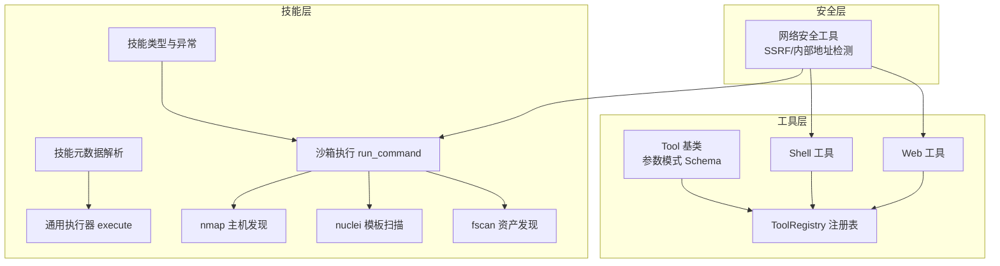
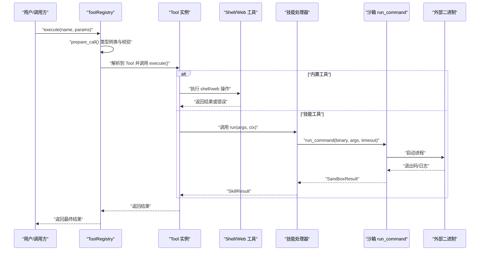
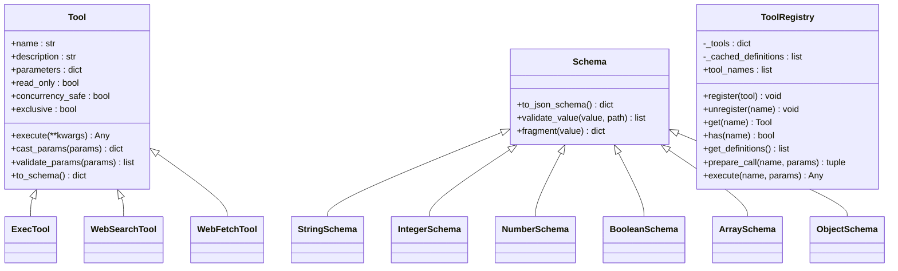
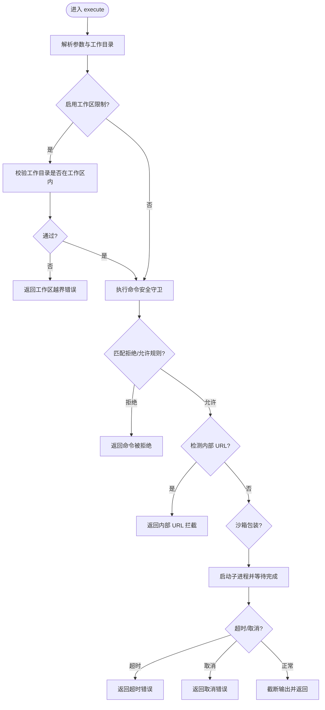
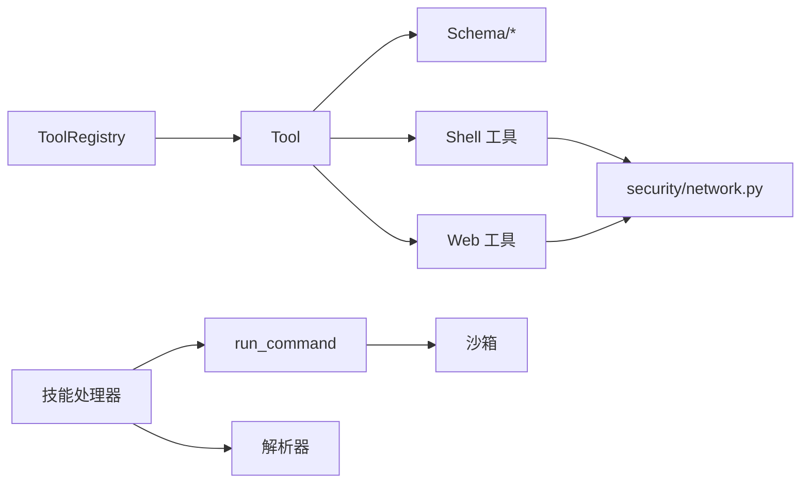

# 工具和技能系统

<cite>
**本文引用的文件**
- [secbot/agent/tools/registry.py](file://secbot/agent/tools/registry.py)
- [secbot/agent/tools/base.py](file://secbot/agent/tools/base.py)
- [secbot/agent/tools/schema.py](file://secbot/agent/tools/schema.py)
- [secbot/agent/tools/shell.py](file://secbot/agent/tools/shell.py)
- [secbot/agent/tools/web.py](file://secbot/agent/tools/web.py)
- [secbot/skills/types.py](file://secbot/skills/types.py)
- [secbot/skills/metadata.py](file://secbot/skills/metadata.py)
- [secbot/skills/_shared/runner.py](file://secbot/skills/_shared/runner.py)
- [secbot/skills/_shared/sandbox.py](file://secbot/skills/_shared/sandbox.py)
- [secbot/skills/nmap-host-discovery/handler.py](file://secbot/skills/nmap-host-discovery/handler.py)
- [secbot/skills/nuclei-template-scan/handler.py](file://secbot/skills/nuclei-template-scan/handler.py)
- [secbot/skills/fscan-asset-discovery/handler.py](file://secbot/skills/fscan-asset-discovery/handler.py)
- [secbot/security/network.py](file://secbot/security/network.py)
- [docs/my-tool.md](file://docs/my-tool.md)
</cite>

## 目录
1. [简介](#简介)
2. [项目结构](#项目结构)
3. [核心组件](#核心组件)
4. [架构总览](#架构总览)
5. [详细组件分析](#详细组件分析)
6. [依赖分析](#依赖分析)
7. [性能考虑](#性能考虑)
8. [故障排查指南](#故障排查指南)
9. [结论](#结论)
10. [附录](#附录)

## 简介
本文件系统性阐述“工具与技能”体系的设计与实现，覆盖以下主题：
- 工具注册与执行机制：ToolRegistry 的工作原理、工具接口规范、参数校验与类型转换。
- 内置安全工具：nmap 主机发现、nuclei 模板扫描、fscan 资产发现的实现要点与使用方法。
- 自定义工具开发指南：工具类继承、参数定义、错误处理与安全约束。
- 技能（Skill）与工具的区别与联系，以及如何创建可复用的技能模块。
- 工具配置、环境变量设置与安全限制。
- 最佳实践与性能优化技巧。
- 完整的调用流程图、类图与数据流图，并提供调试方法。

## 项目结构
围绕“工具与技能”的核心目录与文件如下：
- 工具层：抽象基类、参数模式、注册表与具体工具实现。
- 技能层：技能元数据、执行沙箱、通用运行器与内置技能处理器。
- 安全层：网络访问控制与 URL/路径安全检测。

**图表来源**
- [secbot/agent/tools/base.py:117-244](file://secbot/agent/tools/base.py#L117-L244)
- [secbot/agent/tools/registry.py:8-126](file://secbot/agent/tools/registry.py#L8-L126)
- [secbot/agent/tools/shell.py:48-380](file://secbot/agent/tools/shell.py#L48-L380)
- [secbot/agent/tools/web.py:83-519](file://secbot/agent/tools/web.py#L83-L519)
- [secbot/skills/types.py:44-87](file://secbot/skills/types.py#L44-L87)
- [secbot/skills/metadata.py:56-147](file://secbot/skills/metadata.py#L56-L147)
- [secbot/skills/_shared/sandbox.py:70-192](file://secbot/skills/_shared/sandbox.py#L70-L192)
- [secbot/skills/_shared/runner.py:38-83](file://secbot/skills/_shared/runner.py#L38-L83)
- [secbot/skills/nmap-host-discovery/handler.py:35-81](file://secbot/skills/nmap-host-discovery/handler.py#L35-L81)
- [secbot/skills/nuclei-template-scan/handler.py:98-154](file://secbot/skills/nuclei-template-scan/handler.py#L98-L154)
- [secbot/skills/fscan-asset-discovery/handler.py:24-36](file://secbot/skills/fscan-asset-discovery/handler.py#L24-L36)
- [secbot/security/network.py:45-120](file://secbot/security/network.py#L45-L120)

**章节来源**
- [secbot/agent/tools/registry.py:1-126](file://secbot/agent/tools/registry.py#L1-L126)
- [secbot/agent/tools/base.py:1-280](file://secbot/agent/tools/base.py#L1-L280)
- [secbot/agent/tools/schema.py:1-233](file://secbot/agent/tools/schema.py#L1-L233)
- [secbot/agent/tools/shell.py:1-380](file://secbot/agent/tools/shell.py#L1-L380)
- [secbot/agent/tools/web.py:1-519](file://secbot/agent/tools/web.py#L1-L519)
- [secbot/skills/types.py:1-87](file://secbot/skills/types.py#L1-L87)
- [secbot/skills/metadata.py:1-147](file://secbot/skills/metadata.py#L1-L147)
- [secbot/skills/_shared/runner.py:1-83](file://secbot/skills/_shared/runner.py#L1-L83)
- [secbot/skills/_shared/sandbox.py:1-192](file://secbot/skills/_shared/sandbox.py#L1-L192)
- [secbot/skills/nmap-host-discovery/handler.py:1-81](file://secbot/skills/nmap-host-discovery/handler.py#L1-L81)
- [secbot/skills/nuclei-template-scan/handler.py:1-154](file://secbot/skills/nuclei-template-scan/handler.py#L1-L154)
- [secbot/skills/fscan-asset-discovery/handler.py:1-36](file://secbot/skills/fscan-asset-discovery/handler.py#L1-L36)
- [secbot/security/network.py:1-120](file://secbot/security/network.py#L1-L120)

## 核心组件
- 工具抽象与参数模式
  - Tool 抽象类定义工具名称、描述、参数模式与执行接口；支持类型转换与 JSON Schema 参数校验。
  - Schema 及其子类（String/Integer/Number/Boolean/Array/Object）提供统一的参数约束与校验能力。
- 工具注册与执行
  - ToolRegistry 提供动态注册、查找、定义缓存与执行入口；封装参数类型转换、校验与异常提示。
- 安全工具
  - Shell 工具：严格的命令过滤、路径边界保护、超时与输出截断、环境变量最小化。
  - Web 工具：多提供商搜索与内容抓取，SSRF 防护与重定向校验。
- 技能系统
  - 类型与异常：SkillResult/SkillContext 与各类运行期异常。
  - 元数据：从 SKILL.md 解析技能元信息并进行字段校验。
  - 沙箱：run_command 统一的二进制白名单、参数字符检查、超时与取消、日志捕获。
  - 通用执行器：execute 封装二进制调用、解析器与结果汇总。
- 内置技能
  - nmap 主机发现：目标与速率校验、网络策略、正则解析、超时/取消处理。
  - nuclei 模板扫描：目标列表生成、CLI 参数构建、JSONL 解析与 CMDB 写入。
  - fscan 资产发现：目标校验、超时控制、存活主机提取。

**章节来源**
- [secbot/agent/tools/base.py:117-280](file://secbot/agent/tools/base.py#L117-L280)
- [secbot/agent/tools/schema.py:20-233](file://secbot/agent/tools/schema.py#L20-L233)
- [secbot/agent/tools/registry.py:8-126](file://secbot/agent/tools/registry.py#L8-L126)
- [secbot/agent/tools/shell.py:48-380](file://secbot/agent/tools/shell.py#L48-L380)
- [secbot/agent/tools/web.py:83-519](file://secbot/agent/tools/web.py#L83-L519)
- [secbot/skills/types.py:44-87](file://secbot/skills/types.py#L44-L87)
- [secbot/skills/metadata.py:56-147](file://secbot/skills/metadata.py#L56-L147)
- [secbot/skills/_shared/sandbox.py:70-192](file://secbot/skills/_shared/sandbox.py#L70-L192)
- [secbot/skills/_shared/runner.py:38-83](file://secbot/skills/_shared/runner.py#L38-L83)
- [secbot/skills/nmap-host-discovery/handler.py:35-81](file://secbot/skills/nmap-host-discovery/handler.py#L35-L81)
- [secbot/skills/nuclei-template-scan/handler.py:98-154](file://secbot/skills/nuclei-template-scan/handler.py#L98-L154)
- [secbot/skills/fscan-asset-discovery/handler.py:24-36](file://secbot/skills/fscan-asset-discovery/handler.py#L24-L36)

## 架构总览
下图展示工具与技能在系统中的交互关系与数据流：

**图表来源**
- [secbot/agent/tools/registry.py:100-126](file://secbot/agent/tools/registry.py#L100-L126)
- [secbot/agent/tools/shell.py:123-216](file://secbot/agent/tools/shell.py#L123-L216)
- [secbot/agent/tools/web.py:384-507](file://secbot/agent/tools/web.py#L384-L507)
- [secbot/skills/_shared/sandbox.py:70-192](file://secbot/skills/_shared/sandbox.py#L70-L192)
- [secbot/skills/nmap-host-discovery/handler.py:35-81](file://secbot/skills/nmap-host-discovery/handler.py#L35-L81)
- [secbot/skills/nuclei-template-scan/handler.py:98-154](file://secbot/skills/nuclei-template-scan/handler.py#L98-L154)
- [secbot/skills/fscan-asset-discovery/handler.py:24-36](file://secbot/skills/fscan-asset-discovery/handler.py#L24-L36)

## 详细组件分析

### 工具注册与执行机制
- ToolRegistry
  - 动态注册/注销工具，按稳定顺序缓存工具定义（内置优先、MCP 后补），避免重复序列化开销。
  - prepare_call 负责参数类型转换、Schema 校验与错误拼接，确保后续 execute 的安全性与一致性。
  - execute 统一封装异常与提示，对字符串型结果追加引导建议。
- Tool 接口与参数模式
  - Tool 抽象属性：name/description/parameters；可选 read_only/concurrency_safe/exclusive 控制并发与安全。
  - cast_params/validate_params 基于 JSON Schema 进行类型转换与约束校验，支持嵌套对象、数组与枚举。
  - tool_parameters 装饰器简化参数 Schema 定义，自动注入不可变副本。
- Schema 子类
  - StringSchema/IntegerSchema/NumberSchema/BooleanSchema/ArraySchema/ObjectSchema 提供长度、范围、枚举、必填等约束。
  - 支持 nullable 与默认值，便于与 Tool.parameters 对齐。

**图表来源**
- [secbot/agent/tools/base.py:117-280](file://secbot/agent/tools/base.py#L117-L280)
- [secbot/agent/tools/registry.py:8-126](file://secbot/agent/tools/registry.py#L8-L126)
- [secbot/agent/tools/shell.py:48-380](file://secbot/agent/tools/shell.py#L48-L380)
- [secbot/agent/tools/web.py:83-519](file://secbot/agent/tools/web.py#L83-L519)
- [secbot/agent/tools/schema.py:20-233](file://secbot/agent/tools/schema.py#L20-L233)

**章节来源**
- [secbot/agent/tools/registry.py:8-126](file://secbot/agent/tools/registry.py#L8-L126)
- [secbot/agent/tools/base.py:117-280](file://secbot/agent/tools/base.py#L117-L280)
- [secbot/agent/tools/schema.py:20-233](file://secbot/agent/tools/schema.py#L20-L233)

### 内置安全工具详解

#### Shell 工具（exec）
- 安全特性
  - 拒绝高危命令模式（删除、格式化、关机、写入内部状态文件等）。
  - 路径边界保护：当启用 restrict_to_workspace 时，拒绝工作区外绝对路径与相对穿越。
  - 内部 URL 检测：阻断包含私有/内部地址的命令。
  - 环境变量最小化：仅转发必要变量，Windows 下保留系统路径与变量。
- 执行流程
  - 参数校验与类型转换后，执行 _guard_command 进行安全检查。
  - 可选沙箱包装（非 Windows），随后以平台适配方式启动子进程。
  - 超时与取消处理，输出截断与合并标准输出/错误输出。
- 使用建议
  - 优先使用只读工具替代 shell；需要时设置合理 timeout 与工作目录。
  - 如需扩展 PATH，使用 path_append 或 allowed_env_keys 明确放行键。

**图表来源**
- [secbot/agent/tools/shell.py:123-216](file://secbot/agent/tools/shell.py#L123-L216)
- [secbot/agent/tools/shell.py:303-380](file://secbot/agent/tools/shell.py#L303-L380)
- [secbot/security/network.py:112-120](file://secbot/security/network.py#L112-L120)

**章节来源**
- [secbot/agent/tools/shell.py:48-380](file://secbot/agent/tools/shell.py#L48-L380)
- [secbot/security/network.py:1-120](file://secbot/security/network.py#L1-L120)

#### Web 工具（web_search/web_fetch）
- 搜索工具
  - 多提供商支持（Brave/Tavily/SearXNG/Jina/Kagi/DuckDuckGo），自动回退与凭据检测。
  - 结果格式化为统一文本，限制最大条数与字符数。
- 抓取工具
  - SSRF 防护：先验证 URL 与解析 IP，再发起请求；支持代理与最大重定向。
  - 图片直取：识别图片类型直接返回媒体块，避免不必要的文本抽取。
  - 输出标记为“不受信任”，并限制最大长度。
- 使用建议
  - 优先使用 web_search 获取概览，再用 web_fetch 抓取详情。
  - 设置合理的超时与代理，避免被限速或阻断。

**章节来源**
- [secbot/agent/tools/web.py:83-519](file://secbot/agent/tools/web.py#L83-L519)
- [secbot/security/network.py:45-120](file://secbot/security/network.py#L45-L120)

### 技能系统与内置安全技能

#### 技能类型与上下文
- SkillResult：summary/raw_log_path/findings/cmdb_writes。
- SkillContext：scan_id/scan_dir/cancel_token/confirm/progress/raw_log_dir。
- 异常体系：BinaryNotAllowed/InvalidArgvCharacter/SkillBinaryMissing/SkillTimeout/SkillCancelled/InvalidSkillArg 等。

**章节来源**
- [secbot/skills/types.py:44-87](file://secbot/skills/types.py#L44-L87)

#### 技能元数据
- 从 SKILL.md 解析 name/display_name/version/risk_level/category/external_binary/network_egress/expected_runtime_sec/summary_size_hint。
- 字段校验与目录名一致性检查，支持严格模式跳过不合规项。

**章节来源**
- [secbot/skills/metadata.py:56-147](file://secbot/skills/metadata.py#L56-L147)

#### 沙箱执行（run_command）
- 白名单二进制（nmap/fscan/nuclei/hydra/masscan/weasyprint/python3/git）。
- argv 字符检查与超时/取消/日志捕获；内存捕获上限防止溢出。
- 返回 SandboxResult（退出码、原始日志路径、可选内存捕获）。

**章节来源**
- [secbot/skills/_shared/sandbox.py:70-192](file://secbot/skills/_shared/sandbox.py#L70-L192)

#### 通用执行器（execute）
- 统一封装二进制调用、解析器与结果汇总；失败时记录错误与耗时；支持自定义解析函数。

**章节来源**
- [secbot/skills/_shared/runner.py:38-83](file://secbot/skills/_shared/runner.py#L38-L83)

#### nmap 主机发现
- 目标与速率校验、网络策略 REQUIRED、正则解析存活主机。
- 超时/取消/二进制缺失异常处理，返回前 200 条结果。

**章节来源**
- [secbot/skills/nmap-host-discovery/handler.py:35-81](file://secbot/skills/nmap-host-discovery/handler.py#L35-L81)

#### nuclei 模板扫描
- 目标列表生成、CLI 参数构建、JSONL 解析、CMDB 写入。
- 严重级别与标签过滤、最大发现数量限制、错误与耗时统计。

**章节来源**
- [secbot/skills/nuclei-template-scan/handler.py:98-154](file://secbot/skills/nuclei-template-scan/handler.py#L98-L154)

#### fscan 资产发现
- 目标校验、超时控制、存活主机提取（最多 500）。

**章节来源**
- [secbot/skills/fscan-asset-discovery/handler.py:24-36](file://secbot/skills/fscan-asset-discovery/handler.py#L24-L36)

## 依赖分析
- 工具层依赖
  - ToolRegistry 依赖 Tool 抽象与 Schema 校验。
  - Shell/Web 工具依赖安全网络模块进行 URL/路径检测。
- 技能层依赖
  - 沙箱依赖二进制白名单与参数字符集。
  - 技能处理器依赖 run_command 与解析器。
- 耦合与内聚
  - 工具与技能通过统一的执行入口（ToolRegistry/Tool.execute/run_command）解耦。
  - 参数模式与校验在 base/schema 层集中实现，提升内聚性与可维护性。

**图表来源**
- [secbot/agent/tools/registry.py:8-126](file://secbot/agent/tools/registry.py#L8-L126)
- [secbot/agent/tools/base.py:117-280](file://secbot/agent/tools/base.py#L117-L280)
- [secbot/agent/tools/shell.py:303-380](file://secbot/agent/tools/shell.py#L303-L380)
- [secbot/agent/tools/web.py:400-421](file://secbot/agent/tools/web.py#L400-L421)
- [secbot/security/network.py:45-120](file://secbot/security/network.py#L45-L120)
- [secbot/skills/_shared/sandbox.py:70-192](file://secbot/skills/_shared/sandbox.py#L70-L192)
- [secbot/skills/_shared/runner.py:38-83](file://secbot/skills/_shared/runner.py#L38-L83)

**章节来源**
- [secbot/agent/tools/registry.py:8-126](file://secbot/agent/tools/registry.py#L8-L126)
- [secbot/agent/tools/base.py:117-280](file://secbot/agent/tools/base.py#L117-L280)
- [secbot/agent/tools/shell.py:303-380](file://secbot/agent/tools/shell.py#L303-L380)
- [secbot/agent/tools/web.py:400-421](file://secbot/agent/tools/web.py#L400-L421)
- [secbot/security/network.py:45-120](file://secbot/security/network.py#L45-L120)
- [secbot/skills/_shared/sandbox.py:70-192](file://secbot/skills/_shared/sandbox.py#L70-L192)
- [secbot/skills/_shared/runner.py:38-83](file://secbot/skills/_shared/runner.py#L38-L83)

## 性能考虑
- 工具层
  - Shell 工具输出截断与超时控制，避免长时间阻塞；合理设置 timeout 与工作目录。
  - Web 工具限制最大结果数与字符数，减少传输与解析成本。
- 技能层
  - run_command 的内存捕获上限与日志落盘策略平衡资源占用与可观测性。
  - 技能处理器对结果数量进行上限控制（如 nuclei 的最大发现数），降低下游处理压力。
- 并发与安全
  - read_only 与 concurrency_safe 属性用于并行安全调度；exclusive 工具避免与其他工具并发执行。

[本节为通用指导，无需特定文件分析]

## 故障排查指南
- 工具执行错误
  - 参数类型不符：检查 Tool.parameters 与传入参数，确认 cast_params/validate_params 的报错信息。
  - 工具未找到：确认 ToolRegistry.register 是否正确注册，或检查工具名大小写。
  - Shell 命令被拒绝：查看 deny_patterns/allow_patterns 与路径边界保护规则。
  - Web 请求失败：检查 URL 校验、代理设置与提供商凭据。
- 技能执行错误
  - BinaryNotAllowed：确认二进制是否在白名单中。
  - InvalidArgvCharacter：检查 argv 中是否包含非法字符。
  - SkillTimeout/SkillCancelled：调整 timeout 或取消令牌触发原因。
  - InvalidSkillArg：核对目标/端口/严重级别/标签等输入合法性。
- 安全拦截
  - 内部 URL 检测：避免在命令或 URL 中包含私有/内部地址。
  - 路径越界：确保工作目录与绝对路径在工作区内。

**章节来源**
- [secbot/agent/tools/registry.py:73-126](file://secbot/agent/tools/registry.py#L73-L126)
- [secbot/agent/tools/shell.py:303-380](file://secbot/agent/tools/shell.py#L303-L380)
- [secbot/agent/tools/web.py:400-507](file://secbot/agent/tools/web.py#L400-L507)
- [secbot/skills/_shared/sandbox.py:59-104](file://secbot/skills/_shared/sandbox.py#L59-L104)
- [secbot/skills/_shared/runner.py:28-83](file://secbot/skills/_shared/runner.py#L28-L83)
- [secbot/security/network.py:112-120](file://secbot/security/network.py#L112-L120)

## 结论
本系统通过“工具层 + 技能层 + 安全层”的分层设计，实现了：
- 可扩展的工具注册与执行框架，统一参数模式与校验。
- 安全可控的外部二进制调用与网络访问，保障运行时安全。
- 可复用的技能模块，支持目标校验、超时/取消、日志解析与结构化输出。
推荐在生产环境中：
- 优先使用只读与并发安全工具，谨慎启用 shell。
- 为技能设置合理的超时与日志策略，限制输出规模。
- 严格管理二进制白名单与 argv 字符集，配合 URL/IP 地址检测。

[本节为总结，无需特定文件分析]

## 附录

### 自定义工具开发指南
- 继承 Tool 并实现 name/description/parameters/execute。
- 使用 tool_parameters 装饰器或重写 parameters 属性，定义 JSON Schema。
- 在 execute 中进行必要的参数校验与类型转换，必要时抛出异常以便上层捕获。
- 如需安全执行外部命令，优先使用 run_command（技能侧）或遵循 Shell 工具的安全策略（工具侧）。

**章节来源**
- [secbot/agent/tools/base.py:246-280](file://secbot/agent/tools/base.py#L246-L280)
- [secbot/agent/tools/shell.py:123-216](file://secbot/agent/tools/shell.py#L123-L216)
- [secbot/skills/_shared/sandbox.py:70-192](file://secbot/skills/_shared/sandbox.py#L70-L192)

### 技能与工具的区别与联系
- 工具：面向单一能力（读写文件、执行 shell、网络请求），强调参数模式与安全执行。
- 技能：面向复杂任务（主机发现、漏洞扫描），强调生命周期管理、日志解析与结构化输出。
- 联系：两者均通过统一的执行入口与安全约束接入系统；技能可复用工具能力。

**章节来源**
- [secbot/skills/types.py:44-87](file://secbot/skills/types.py#L44-L87)
- [secbot/skills/metadata.py:56-147](file://secbot/skills/metadata.py#L56-L147)

### 工具配置与环境变量
- Shell 工具
  - timeout/working_dir/deny_patterns/allow_patterns/restrict_to_workspace/path_append/allowed_env_keys。
  - Windows 下 PATH 与系统变量转发；Unix 下最小化环境变量。
- Web 工具
  - provider/api_key/base_url/proxy/user_agent/max_results。
  - 支持多种提供商与凭据检测，自动回退。
- 技能执行
  - 二进制白名单、argv 字符集、超时/取消/日志捕获策略。

**章节来源**
- [secbot/agent/tools/shell.py:51-90](file://secbot/agent/tools/shell.py#L51-L90)
- [secbot/agent/tools/web.py:93-126](file://secbot/agent/tools/web.py#L93-L126)
- [secbot/skills/_shared/sandbox.py:23-50](file://secbot/skills/_shared/sandbox.py#L23-L50)

### 最佳实践与性能优化
- 参数与类型
  - 使用 tool_parameters 与 Schema 子类明确参数约束，减少运行时校验开销。
- 并发与安全
  - 合理设置 read_only/concurrency_safe/exclusive，避免阻塞与竞态。
- I/O 与日志
  - 技能侧使用“文件捕获”与“内存捕获上限”平衡可观测性与资源占用。
- 超时与取消
  - 为长耗时操作设置合理 timeout，及时响应取消令牌。

**章节来源**
- [secbot/agent/tools/base.py:154-167](file://secbot/agent/tools/base.py#L154-L167)
- [secbot/skills/_shared/sandbox.py:124-140](file://secbot/skills/_shared/sandbox.py#L124-L140)

### 调试方法
- 工具层
  - 通过 ToolRegistry.get_definitions 获取工具定义，核对参数模式与描述。
  - 在 execute 中打印关键参数与返回值，结合安全拦截提示定位问题。
- 技能层
  - 检查 raw_log 文件与 parse_error 字段，确认解析器逻辑与 CLI 参数。
  - 使用 cancel_token 触发取消，观察取消后的清理行为。
- 安全层
  - 使用 contains_internal_url 检测命令中的内部 URL，或 validate_url_target/validate_resolved_url 校验 URL/IP。

**章节来源**
- [secbot/agent/tools/registry.py:48-71](file://secbot/agent/tools/registry.py#L48-L71)
- [secbot/skills/_shared/runner.py:71-83](file://secbot/skills/_shared/runner.py#L71-L83)
- [secbot/security/network.py:112-120](file://secbot/security/network.py#L112-L120)