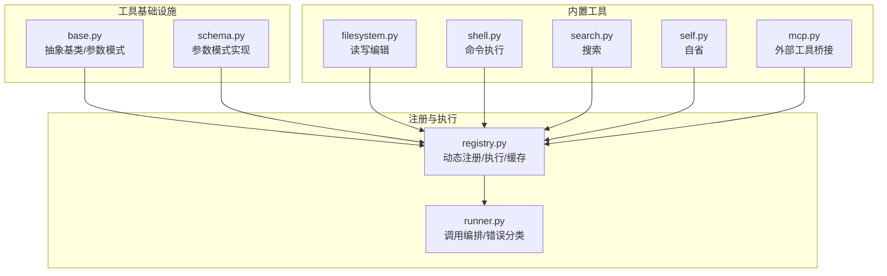
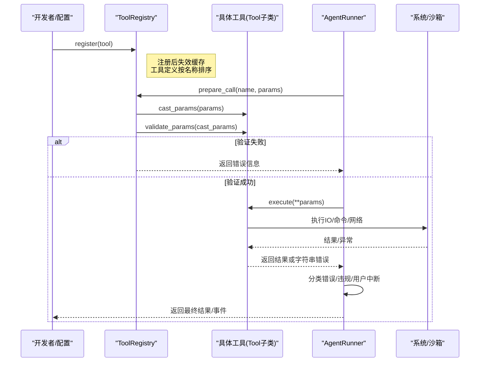
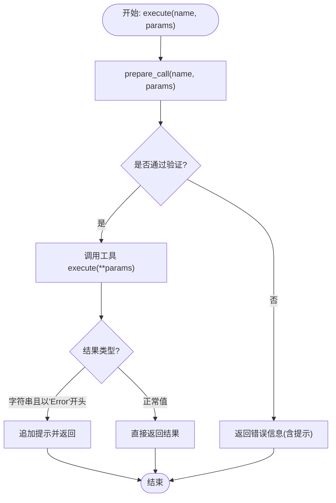
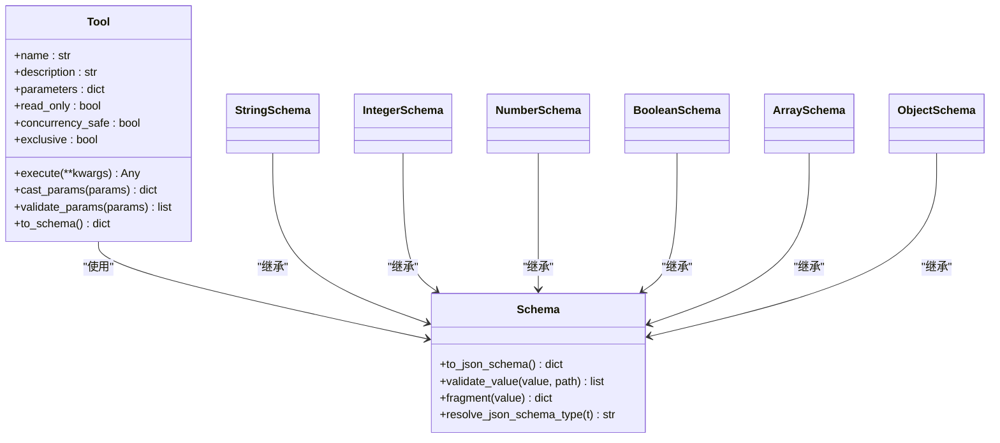
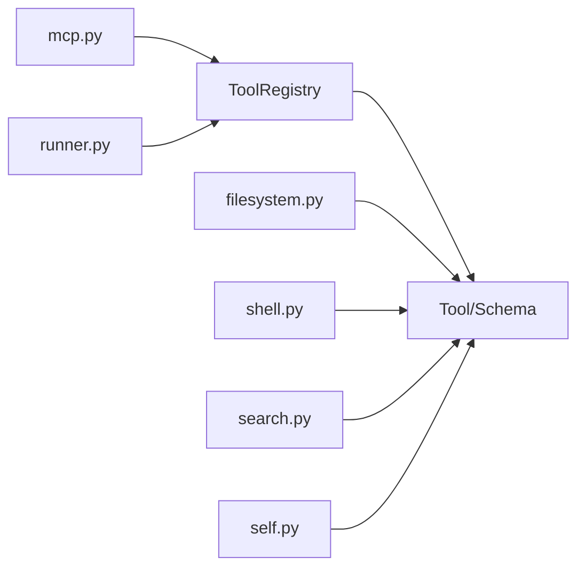

# 工具注册与执行机制

<cite>
**本文档引用的文件**
- [secbot/agent/tools/base.py](file://secbot/agent/tools/base.py)
- [secbot/agent/tools/registry.py](file://secbot/agent/tools/registry.py)
- [secbot/agent/tools/schema.py](file://secbot/agent/tools/schema.py)
- [secbot/agent/tools/filesystem.py](file://secbot/agent/tools/filesystem.py)
- [secbot/agent/tools/self.py](file://secbot/agent/tools/self.py)
- [secbot/agent/tools/shell.py](file://secbot/agent/tools/shell.py)
- [secbot/agent/tools/search.py](file://secbot/agent/tools/search.py)
- [secbot/agent/tools/mcp.py](file://secbot/agent/tools/mcp.py)
- [secbot/agent/runner.py](file://secbot/agent/runner.py)
- [tests/tools/test_tool_registry.py](file://tests/tools/test_tool_registry.py)
- [tests/tools/test_tool_validation.py](file://tests/tools/test_tool_validation.py)
- [tests/tools/test_mcp_tool.py](file://tests/tools/test_mcp_tool.py)
</cite>

## 目录
1. [简介](#简介)
2. [项目结构](#项目结构)
3. [核心组件](#核心组件)
4. [架构总览](#架构总览)
5. [详细组件分析](#详细组件分析)
6. [依赖关系分析](#依赖关系分析)
7. [性能考量](#性能考量)
8. [故障排查指南](#故障排查指南)
9. [结论](#结论)
10. [附录](#附录)

## 简介
本文件系统性阐述工具注册与执行机制，围绕 ToolRegistry 的核心架构与工作原理展开，涵盖工具注册流程、生命周期管理、依赖注入与安全策略，以及工具基类 BaseTool 的设计模式（接口规范、参数验证、错误处理）。文档还给出工具执行的完整流程（从注册到调用再到结果返回），并提供最佳实践建议（命名规范、权限控制、性能优化）与常见问题的解决方案。

## 项目结构
工具体系位于 secbot/agent/tools 目录，核心文件包括：
- 基础设施：base.py（抽象基类与参数模式）、schema.py（参数模式定义）
- 注册中心：registry.py（动态注册、执行与缓存）
- 典型工具：filesystem.py（文件系统读写编辑）、shell.py（命令执行）、search.py（搜索）、self.py（自省工具）、mcp.py（外部工具桥接）
- 执行编排：runner.py（工具调用与错误分类）
- 测试覆盖：tests/tools 下的各类单元测试

**图表来源**
- [secbot/agent/tools/base.py:117-280](file://secbot/agent/tools/base.py#L117-L280)
- [secbot/agent/tools/schema.py:1-233](file://secbot/agent/tools/schema.py#L1-L233)
- [secbot/agent/tools/registry.py:1-126](file://secbot/agent/tools/registry.py#L1-L126)
- [secbot/agent/runner.py:742-845](file://secbot/agent/runner.py#L742-L845)

**章节来源**
- [secbot/agent/tools/base.py:1-280](file://secbot/agent/tools/base.py#L1-L280)
- [secbot/agent/tools/schema.py:1-233](file://secbot/agent/tools/schema.py#L1-L233)
- [secbot/agent/tools/registry.py:1-126](file://secbot/agent/tools/registry.py#L1-L126)

## 核心组件
- 抽象基类 Tool 与 Schema
  - Tool 定义工具的统一接口：name/description/parameters（JSON Schema）、execute 异步执行方法，以及参数类型转换与验证能力。
  - Schema 提供 JSON Schema 片段的通用验证逻辑，支持嵌套对象、数组、枚举、范围等约束。
- 参数装饰器 tool_parameters
  - 通过类装饰器为 Tool 子类注入 parameters 属性，避免重复实现属性 getter，并保证每次访问返回深拷贝以避免副作用。
- ToolRegistry
  - 动态注册/注销工具；按名称检索；生成 OpenAI 函数调用格式的工具定义；缓存与失效策略；执行前的参数解析、类型转换与验证。
- 典型工具实现
  - 文件系统工具（读/写/编辑）：路径解析、设备黑名单、内容去重、多格式支持。
  - 命令执行工具：沙箱封装、路径白名单/黑名单、超时控制、输出截断。
  - 搜索工具：通配符匹配、二进制检测、分页与提示。
  - 自省工具：运行时状态检查与受控修改，敏感字段保护。
  - MCP 工具桥接：远程工具/资源的发现、包装与注册。

**章节来源**
- [secbot/agent/tools/base.py:117-280](file://secbot/agent/tools/base.py#L117-L280)
- [secbot/agent/tools/schema.py:1-233](file://secbot/agent/tools/schema.py#L1-L233)
- [secbot/agent/tools/registry.py:1-126](file://secbot/agent/tools/registry.py#L1-L126)
- [secbot/agent/tools/filesystem.py:1-930](file://secbot/agent/tools/filesystem.py#L1-L930)
- [secbot/agent/tools/shell.py:1-380](file://secbot/agent/tools/shell.py#L1-L380)
- [secbot/agent/tools/search.py:1-555](file://secbot/agent/tools/search.py#L1-L555)
- [secbot/agent/tools/self.py:1-452](file://secbot/agent/tools/self.py#L1-L452)
- [secbot/agent/tools/mcp.py:518-572](file://secbot/agent/tools/mcp.py#L518-L572)

## 架构总览
工具注册与执行的关键流程如下：

**图表来源**
- [secbot/agent/tools/registry.py:73-126](file://secbot/agent/tools/registry.py#L73-L126)
- [secbot/agent/runner.py:742-845](file://secbot/agent/runner.py#L742-L845)

**章节来源**
- [secbot/agent/tools/registry.py:73-126](file://secbot/agent/tools/registry.py#L73-L126)
- [secbot/agent/runner.py:742-845](file://secbot/agent/runner.py#L742-L845)

## 详细组件分析

### ToolRegistry：动态注册与执行
- 注册/注销
  - 使用字典存储工具实例，键为工具名；注册/注销会清空定义缓存，确保后续 get_definitions 返回最新列表。
- 定义生成与缓存
  - get_definitions 将内置工具与 MCP 工具分别排序并拼接，缓存结果直到下次变更。
- 调用准备与执行
  - prepare_call：类型守卫（如 read_file/write_file 必须是对象参数）、查找工具、类型转换、参数验证；返回工具实例、转换后的参数与错误信息。
  - execute：若 prepare_call 返回错误则直接返回；否则异步调用工具 execute，对字符串错误进行提示追加，捕获异常并返回统一格式。

**图表来源**
- [secbot/agent/tools/registry.py:73-126](file://secbot/agent/tools/registry.py#L73-L126)

**章节来源**
- [secbot/agent/tools/registry.py:1-126](file://secbot/agent/tools/registry.py#L1-L126)
- [tests/tools/test_tool_registry.py:1-104](file://tests/tools/test_tool_registry.py#L1-L104)

### BaseTool 与参数模式：接口规范、参数验证与错误处理
- 接口规范
  - 必须实现 name/description/parameters（JSON Schema）与 execute(**kwargs)。
- 参数验证
  - cast_params：基于 JSON Schema 对参数进行安全类型转换（字符串到整数/浮点/布尔/数组/对象）。
  - validate_params：基于 Schema.validate_json_schema_value 进行深度校验（类型、枚举、范围、长度、嵌套对象/数组等）。
- 错误处理
  - 统一返回字符串错误（以“Error”开头），由上层执行器追加分析提示；异常被捕获并格式化为可读消息。

**图表来源**
- [secbot/agent/tools/base.py:117-280](file://secbot/agent/tools/base.py#L117-L280)
- [secbot/agent/tools/schema.py:1-233](file://secbot/agent/tools/schema.py#L1-L233)

**章节来源**
- [secbot/agent/tools/base.py:117-280](file://secbot/agent/tools/base.py#L117-L280)
- [secbot/agent/tools/schema.py:1-233](file://secbot/agent/tools/schema.py#L1-L233)
- [tests/tools/test_tool_validation.py:1-701](file://tests/tools/test_tool_validation.py#L1-L701)

### 文件系统工具：路径解析与安全策略
- 路径解析与边界保护
  - 支持相对路径与工作区绑定；严格限制在允许目录范围内；媒体目录例外放行；设备路径黑名单阻断。
- 内容去重与一致性
  - 基于 mtime/hash 的读取去重，避免重复输出；支持 PDF/Office 文档提取文本。
- 错误处理
  - 权限错误、非法路径、二进制文件读取等场景均返回明确错误信息。

**章节来源**
- [secbot/agent/tools/filesystem.py:1-930](file://secbot/agent/tools/filesystem.py#L1-L930)

### 命令执行工具：沙箱与安全
- 安全策略
  - 黑名单模式（rm -rf、格式化、dd、系统关机等危险命令）；白名单补充；设备文件安全重定向例外；工作区限制。
- 执行细节
  - 超时控制（默认60秒，上限600秒）；输出截断（最多10000字符）；环境变量可控；可选沙箱封装。
- 错误处理
  - 超时、取消、异常均被格式化为统一错误消息。

**章节来源**
- [secbot/agent/tools/shell.py:1-380](file://secbot/agent/tools/shell.py#L1-L380)

### 搜索工具：通配符与分页
- 匹配策略
  - 支持 POSIX 风格通配符与递归模式；忽略噪声目录；二进制文件快速判定；按修改时间排序。
- 分页与提示
  - 支持 head_limit/offset；提供分页提示；限制最大结果数量。

**章节来源**
- [secbot/agent/tools/search.py:1-555](file://secbot/agent/tools/search.py#L1-L555)

### 自省工具：受控运行时检查与修改
- 受控访问
  - 敏感字段/路径黑名单；只读字段保护；禁止访问内部状态与凭据。
- 修改限制
  - 仅允许有限类型与范围；对受限键进行数值范围校验；运行时变量存储有容量限制。
- 格式化输出
  - 对复杂对象进行友好格式化，便于人类阅读。

**章节来源**
- [secbot/agent/tools/self.py:1-452](file://secbot/agent/tools/self.py#L1-L452)

### MCP 工具桥接：远程工具与资源注册
- 发现与过滤
  - 列出远端工具/资源；支持 enabledTools 白名单（原始名称与“mcp_{server}_{tool}”包装名称）。
- 注册与告警
  - 将远端工具包装为本地工具并注册；未命中的 enabledTools 条目发出警告。
- 资源与提示
  - 同步注册远端资源与提示，扩展工具集。

**章节来源**
- [secbot/agent/tools/mcp.py:518-572](file://secbot/agent/tools/mcp.py#L518-L572)
- [tests/tools/test_mcp_tool.py:361-822](file://tests/tools/test_mcp_tool.py#L361-L822)

## 依赖关系分析
- 组件耦合
  - ToolRegistry 依赖 Tool 与 Schema；具体工具实现依赖基础抽象与参数模式；Runner 依赖 Registry 与工具实例。
- 外部集成
  - MCP 工具桥接引入远端会话与工具定义；文件系统工具依赖路径解析与媒体目录；命令执行工具依赖沙箱与系统进程。
- 循环依赖
  - 当前结构清晰，未见循环导入；工具与注册中心解耦良好。

**图表来源**
- [secbot/agent/tools/registry.py:1-126](file://secbot/agent/tools/registry.py#L1-L126)
- [secbot/agent/tools/base.py:117-280](file://secbot/agent/tools/base.py#L117-L280)
- [secbot/agent/tools/filesystem.py:1-930](file://secbot/agent/tools/filesystem.py#L1-L930)
- [secbot/agent/tools/shell.py:1-380](file://secbot/agent/tools/shell.py#L1-L380)
- [secbot/agent/tools/search.py:1-555](file://secbot/agent/tools/search.py#L1-L555)
- [secbot/agent/tools/self.py:1-452](file://secbot/agent/tools/self.py#L1-L452)
- [secbot/agent/tools/mcp.py:518-572](file://secbot/agent/tools/mcp.py#L518-L572)
- [secbot/agent/runner.py:742-845](file://secbot/agent/runner.py#L742-L845)

**章节来源**
- [secbot/agent/tools/registry.py:1-126](file://secbot/agent/tools/registry.py#L1-L126)
- [secbot/agent/tools/base.py:117-280](file://secbot/agent/tools/base.py#L117-L280)
- [secbot/agent/tools/filesystem.py:1-930](file://secbot/agent/tools/filesystem.py#L1-L930)
- [secbot/agent/tools/shell.py:1-380](file://secbot/agent/tools/shell.py#L1-L380)
- [secbot/agent/tools/search.py:1-555](file://secbot/agent/tools/search.py#L1-L555)
- [secbot/agent/tools/self.py:1-452](file://secbot/agent/tools/self.py#L1-L452)
- [secbot/agent/tools/mcp.py:518-572](file://secbot/agent/tools/mcp.py#L518-L572)
- [secbot/agent/runner.py:742-845](file://secbot/agent/runner.py#L742-L845)

## 性能考量
- 缓存与排序
  - ToolRegistry 对工具定义进行缓存并在注册/注销时失效；定义按名称稳定排序，有利于提示词缓存友好性。
- 参数转换与验证
  - cast_params 与 validate_params 在执行前完成，避免无效调用带来的 IO 成本；嵌套对象/数组的深度验证防止极端输入导致的开销。
- 输出截断与超时
  - 命令执行工具对输出进行截断，防止大体量响应影响吞吐；超时控制避免长时间阻塞。
- 并发与独占
  - 工具可通过 read_only/concurrency_safe/exclusive 控制并发与独占执行，平衡吞吐与一致性。

[本节为通用指导，无需特定文件引用]

## 故障排查指南
- 参数错误
  - 现象：返回“Invalid parameters”类错误；可能原因：类型不匹配、缺少必填字段、越界、枚举不合法。
  - 处理：根据错误提示修正参数；必要时使用 tool_parameters 装饰器或 tool_parameters_schema 构建参数模式。
- 工具未找到
  - 现象：返回“Tool 'xxx' not found”。
  - 处理：确认工具已注册；核对工具名大小写与拼写；检查注册顺序与缓存失效。
- 路径越界/权限错误
  - 现象：文件系统工具报错“outside allowed directory”或权限不足。
  - 处理：调整工作区/允许目录；避免设备路径与符号链接陷阱；遵循只读/可写策略。
- 命令超时/失败
  - 现象：命令执行超时或返回非零退出码。
  - 处理：增加超时；检查黑名单规则；确认沙箱与环境变量设置。
- MCP 工具未注册
  - 现象：enabledTools 中指定的工具未生效。
  - 处理：核对 enabledTools 是否包含原始名称或包装名称；检查远端服务器可用性与工具清单。

**章节来源**
- [tests/tools/test_tool_validation.py:142-172](file://tests/tools/test_tool_validation.py#L142-L172)
- [tests/tools/test_tool_registry.py:52-74](file://tests/tools/test_tool_registry.py#L52-L74)
- [secbot/agent/tools/filesystem.py:1-930](file://secbot/agent/tools/filesystem.py#L1-L930)
- [secbot/agent/tools/shell.py:1-380](file://secbot/agent/tools/shell.py#L1-L380)
- [tests/tools/test_mcp_tool.py:361-434](file://tests/tools/test_mcp_tool.py#L361-L434)

## 结论
该工具注册与执行机制通过抽象基类与参数模式统一了工具接口与参数约束，借助 ToolRegistry 实现动态注册、缓存与执行前的类型转换与验证，结合 Runner 的错误分类与提示增强，形成一套安全、可扩展、可观测的工具体系。MCP 工具桥接进一步拓展了工具生态，配合严格的路径与命令安全策略，满足生产级使用需求。

[本节为总结，无需特定文件引用]

## 附录

### 最佳实践
- 命名规范
  - 工具名应简洁、语义明确，避免特殊字符；MCP 工具采用“mcp_{server}_{tool}”包装命名，便于识别与过滤。
- 参数模式
  - 使用 tool_parameters 或 tool_parameters_schema 明确参数类型、范围与必填项；嵌套对象与数组需提供清晰的子模式。
- 权限控制
  - 文件系统工具优先使用只读工具；命令执行工具启用沙箱与工作区限制；对敏感字段与路径进行黑名单保护。
- 性能优化
  - 合理设置超时与输出截断；利用 read_only/concurrency_safe/exclusive 控制并发；缓存工具定义以减少重复构建。
- 错误处理
  - 工具内部返回字符串错误时，保持格式一致；上层统一追加分析提示；对用户可操作的错误提供修复建议。

### 代码示例（路径指引）
- 注册一个装饰器参数的工具
  - 示例路径：[tests/tools/test_tool_validation.py:56-74](file://tests/tools/test_tool_validation.py#L56-L74)
- 执行工具并处理参数错误
  - 示例路径：[tests/tools/test_tool_validation.py:142-151](file://tests/tools/test_tool_validation.py#L142-L151)
- 注册 MCP 工具并验证启用列表
  - 示例路径：[tests/tools/test_mcp_tool.py:365-410](file://tests/tools/test_mcp_tool.py#L365-L410)

[本节为参考指引，无需特定文件引用]