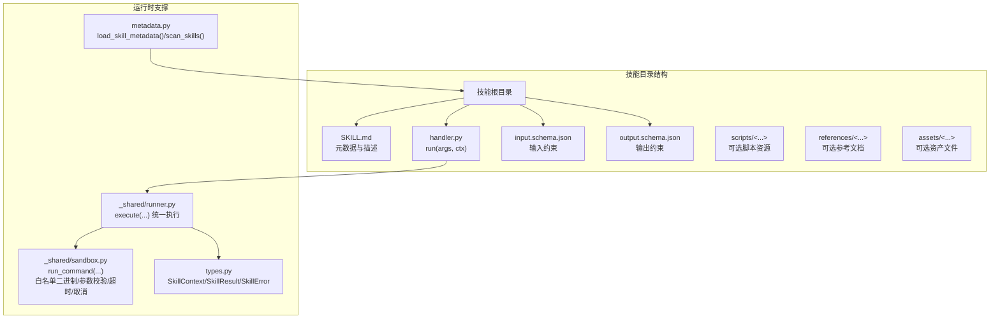
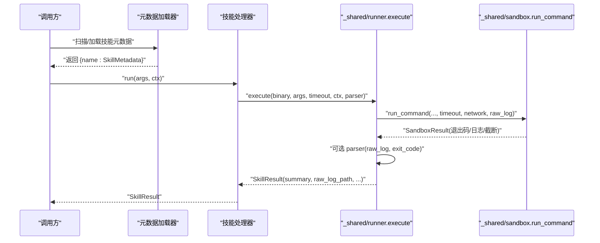
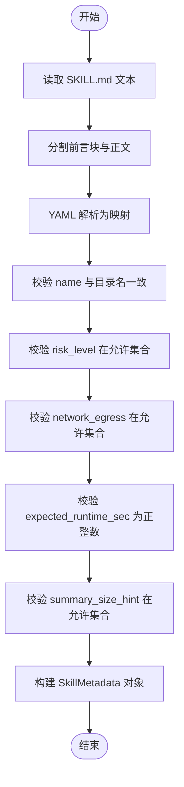
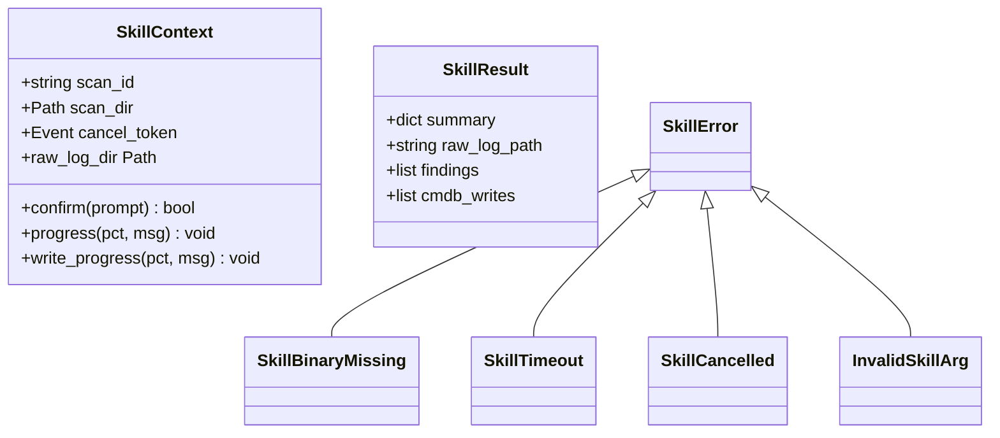
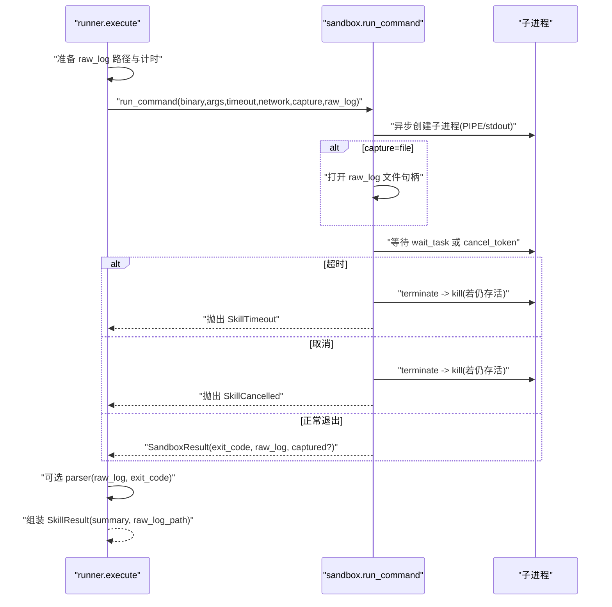
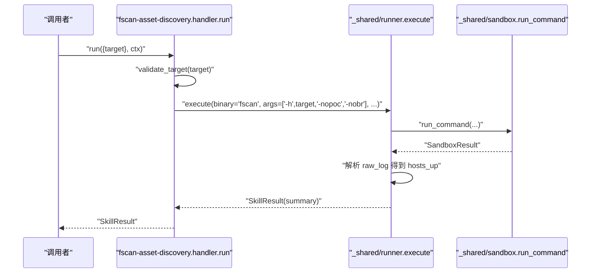
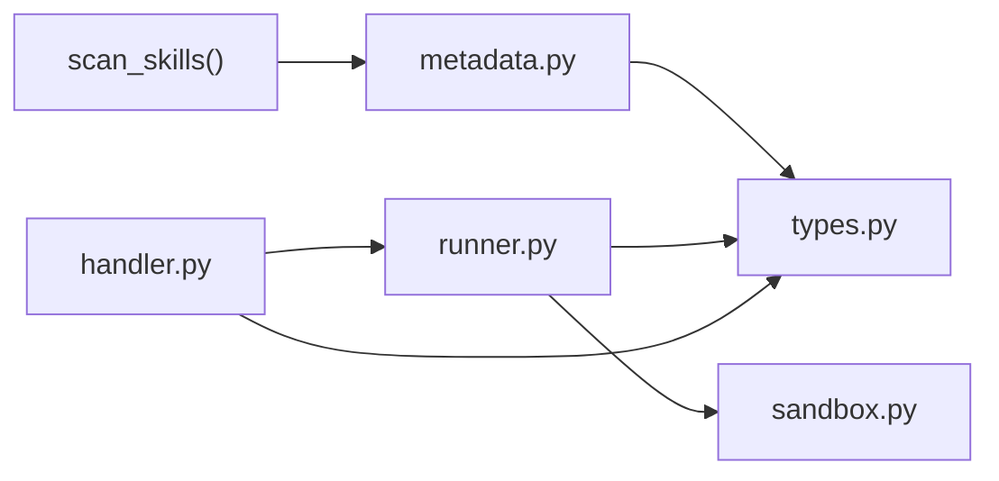

# 技能管理系统

<cite>
**本文引用的文件**
- [metadata.py](file://secbot/skills/metadata.py)
- [types.py](file://secbot/skills/types.py)
- [runner.py](file://secbot/skills/_shared/runner.py)
- [sandbox.py](file://secbot/skills/_shared/sandbox.py)
- [init_skill.py](file://secbot/skills/skill-creator/scripts/init_skill.py)
- [fscan-asset-discovery/SKILL.md](file://secbot/skills/fscan-asset-discovery/SKILL.md)
- [fscan-asset-discovery/handler.py](file://secbot/skills/fscan-asset-discovery/handler.py)
- [fscan-asset-discovery/input.schema.json](file://secbot/skills/fscan-asset-discovery/input.schema.json)
- [fscan-asset-discovery/output.schema.json](file://secbot/skills/fscan-asset-discovery/output.schema.json)
- [my/SKILL.md](file://secbot/skills/my/SKILL.md)
</cite>

## 目录
1. [引言](#引言)
2. [项目结构](#项目结构)
3. [核心组件](#核心组件)
4. [架构总览](#架构总览)
5. [详细组件分析](#详细组件分析)
6. [依赖关系分析](#依赖关系分析)
7. [性能考量](#性能考量)
8. [故障排查指南](#故障排查指南)
9. [结论](#结论)
10. [附录](#附录)

## 引言
本文件系统化阐述技能（Skill）与工具（Tool）的区别与联系，覆盖技能的定义、特性与使用场景；详解元数据管理（描述信息、参数定义、依赖关系）；解释技能的加载机制与运行时管理（缓存策略、生命周期控制）；给出技能开发标准流程（目录结构、配置文件与代码组织）；说明版本管理与兼容性处理；并提供最佳实践、性能优化与完整开发示例及调试方法。

## 项目结构
技能系统围绕“技能目录 + 元数据 + 处理器 + 约束校验 + 运行沙箱”展开，典型技能由以下要素构成：
- 元数据文件：每个技能根目录包含 SKILL.md，采用 YAML 前言块声明元数据字段
- 参数约束：input.schema.json 定义输入参数结构
- 输出约束：output.schema.json 定义输出结构
- 执行处理器：handler.py 实现 run(args, ctx) 并返回标准化结果
- 运行时支持：_shared 下的 runner 与 sandbox 提供统一执行与安全沙箱

图表来源
- [fscan-asset-discovery/handler.py:1-36](file://secbot/skills/fscan-asset-discovery/handler.py#L1-L36)
- [fscan-asset-discovery/input.schema.json:1-10](file://secbot/skills/fscan-asset-discovery/input.schema.json#L1-L10)
- [fscan-asset-discovery/output.schema.json:1-11](file://secbot/skills/fscan-asset-discovery/output.schema.json#L1-L11)
- [runner.py:1-83](file://secbot/skills/_shared/runner.py#L1-L83)
- [sandbox.py:1-192](file://secbot/skills/_shared/sandbox.py#L1-L192)
- [types.py:1-87](file://secbot/skills/types.py#L1-L87)
- [metadata.py:1-147](file://secbot/skills/metadata.py#L1-L147)

章节来源
- [fscan-asset-discovery/SKILL.md:1-15](file://secbot/skills/fscan-asset-discovery/SKILL.md#L1-L15)
- [fscan-asset-discovery/handler.py:1-36](file://secbot/skills/fscan-asset-discovery/handler.py#L1-L36)
- [fscan-asset-discovery/input.schema.json:1-10](file://secbot/skills/fscan-asset-discovery/input.schema.json#L1-L10)
- [fscan-asset-discovery/output.schema.json:1-11](file://secbot/skills/fscan-asset-discovery/output.schema.json#L1-L11)
- [metadata.py:1-147](file://secbot/skills/metadata.py#L1-L147)
- [types.py:1-87](file://secbot/skills/types.py#L1-L87)
- [runner.py:1-83](file://secbot/skills/_shared/runner.py#L1-L83)
- [sandbox.py:1-192](file://secbot/skills/_shared/sandbox.py#L1-L192)

## 核心组件
- 元数据加载与扫描：从 SKILL.md 解析 YAML 前言块，校验必填字段与取值范围，并提供扫描能力以批量发现有效技能
- 类型与异常体系：统一的上下文、结果与错误类型，便于在循环/编排中一致化处理
- 执行器与沙箱：封装二进制调用、参数校验、网络策略、超时与取消信号、日志捕获与解析
- 开发脚手架：初始化模板与资源目录，帮助快速生成符合规范的技能骨架

章节来源
- [metadata.py:56-147](file://secbot/skills/metadata.py#L56-L147)
- [types.py:19-87](file://secbot/skills/types.py#L19-L87)
- [runner.py:38-83](file://secbot/skills/_shared/runner.py#L38-L83)
- [sandbox.py:70-192](file://secbot/skills/_shared/sandbox.py#L70-L192)
- [init_skill.py:255-318](file://secbot/skills/skill-creator/scripts/init_skill.py#L255-L318)

## 架构总览
技能系统通过“元数据驱动 + 沙箱执行 + 结果归一”的方式，将外部二进制或脚本封装为可被平台统一调度与治理的原子能力单元。

图表来源
- [metadata.py:117-147](file://secbot/skills/metadata.py#L117-L147)
- [fscan-asset-discovery/handler.py:24-36](file://secbot/skills/fscan-asset-discovery/handler.py#L24-L36)
- [runner.py:38-83](file://secbot/skills/_shared/runner.py#L38-L83)
- [sandbox.py:70-192](file://secbot/skills/_shared/sandbox.py#L70-L192)

## 详细组件分析

### 元数据管理（metadata.py）
- 职责：解析 SKILL.md 的 YAML 前言块，校验字段类型与取值域，构造不可变的 SkillMetadata 对象；提供扫描函数以批量发现有效技能
- 关键字段与约束：
  - 必填：name、display_name、version、risk_level、category、network_egress、expected_runtime_sec、summary_size_hint
  - 取值约束：risk_level ∈ {low, medium, high, critical}；network_egress ∈ {required, optional, none}；summary_size_hint ∈ {small, medium, large}
  - 一致性约束：name 必须等于目录名
- 错误模型：SkillMetadataError 用于报告前言块缺失、格式不合法、字段缺失或类型不符等错误
- 扫描策略：默认宽松模式跳过不合规目录，严格模式抛出异常，便于新旧技能共存过渡

图表来源
- [metadata.py:40-114](file://secbot/skills/metadata.py#L40-L114)

章节来源
- [metadata.py:19-114](file://secbot/skills/metadata.py#L19-L114)
- [metadata.py:117-147](file://secbot/skills/metadata.py#L117-L147)

### 类型与异常体系（types.py）
- SkillContext：最小化运行时上下文，包含扫描标识、扫描目录、取消事件、确认回调、进度回调与 raw 日志目录派生属性
- SkillResult：标准化返回值，包含摘要、原始日志路径、发现项列表、CMDB 写入项列表
- 异常族：SkillError 为基类，涵盖二进制缺失、超时、取消、非法参数等场景，便于在循环中统一识别为工具错误

图表来源
- [types.py:44-87](file://secbot/skills/types.py#L44-L87)

章节来源
- [types.py:19-87](file://secbot/skills/types.py#L19-L87)

### 执行器与沙箱（runner.py 与 sandbox.py）
- runner.execute：统一入口，负责：
  - 计算耗时、写入 raw 日志
  - 调用沙箱执行二进制，捕获超时/取消/二进制缺失等异常
  - 可选解析器解析 raw 日志与退出码，产出 summary
  - 返回标准化 SkillResult
- sandbox.run_command：安全执行核心，负责：
  - 白名单二进制校验
  - argv 字符集与类型校验
  - 超时与取消信号处理（终止/强制杀死）
  - 日志落盘或内存截断捕获
  - 返回 SandboxResult（退出码、日志路径、可选截断字节）

图表来源
- [runner.py:38-83](file://secbot/skills/_shared/runner.py#L38-L83)
- [sandbox.py:70-192](file://secbot/skills/_shared/sandbox.py#L70-L192)

章节来源
- [runner.py:28-83](file://secbot/skills/_shared/runner.py#L28-L83)
- [sandbox.py:23-192](file://secbot/skills/_shared/sandbox.py#L23-L192)

### 技能开发脚手架（skill-creator）
- init_skill.py：提供命令行工具，按模板生成技能目录与 SKILL.md，并可选择创建 scripts/references/assets 子目录与示例文件
- 规范建议：在 SKILL.md 中完善 TODO 项，明确用途、何时使用、工作流或任务结构；必要时补充 input/output schema

章节来源
- [init_skill.py:255-318](file://secbot/skills/skill-creator/scripts/init_skill.py#L255-L318)

### 示例：fscan 资产发现技能
- 元数据：声明外部二进制、风险等级、网络策略、预期运行时与摘要大小提示
- 输入/输出约束：通过 JSON Schema 明确 target 字段与 hosts_up 等输出字段
- 处理器：校验目标合法性，调用 execute 执行 fscan，解析日志提取存活主机

图表来源
- [fscan-asset-discovery/handler.py:24-36](file://secbot/skills/fscan-asset-discovery/handler.py#L24-L36)
- [fscan-asset-discovery/SKILL.md:1-15](file://secbot/skills/fscan-asset-discovery/SKILL.md#L1-L15)
- [fscan-asset-discovery/input.schema.json:1-10](file://secbot/skills/fscan-asset-discovery/input.schema.json#L1-L10)
- [fscan-asset-discovery/output.schema.json:1-11](file://secbot/skills/fscan-asset-discovery/output.schema.json#L1-L11)

章节来源
- [fscan-asset-discovery/SKILL.md:1-15](file://secbot/skills/fscan-asset-discovery/SKILL.md#L1-L15)
- [fscan-asset-discovery/handler.py:16-36](file://secbot/skills/fscan-asset-discovery/handler.py#L16-L36)
- [fscan-asset-discovery/input.schema.json:1-10](file://secbot/skills/fscan-asset-discovery/input.schema.json#L1-L10)
- [fscan-asset-discovery/output.schema.json:1-11](file://secbot/skills/fscan-asset-discovery/output.schema.json#L1-L11)

### 示例：自省技能（my）
- 该技能以文档为主，强调“自省与临时状态调整”，展示技能文档与元数据在非二进制执行场景中的价值
- 元数据包含 description 与 always 标记，体现其在工作流中的触发策略

章节来源
- [my/SKILL.md:1-73](file://secbot/skills/my/SKILL.md#L1-L73)

## 依赖关系分析
- 元数据层：metadata.py 依赖 YAML 解析与 pathlib，面向所有技能目录进行扫描与校验
- 类型层：types.py 为上层处理器与执行器提供契约
- 执行层：runner.py 依赖 sandbox.py 与 types.py，负责统一执行与结果组装
- 开发层：skill-creator 脚本生成模板与资源目录，辅助规范化

图表来源
- [metadata.py:117-147](file://secbot/skills/metadata.py#L117-L147)
- [types.py:44-87](file://secbot/skills/types.py#L44-L87)
- [runner.py:10-18](file://secbot/skills/_shared/runner.py#L10-L18)
- [sandbox.py:15-21](file://secbot/skills/_shared/sandbox.py#L15-L21)

章节来源
- [metadata.py:117-147](file://secbot/skills/metadata.py#L117-L147)
- [types.py:44-87](file://secbot/skills/types.py#L44-L87)
- [runner.py:10-18](file://secbot/skills/_shared/runner.py#L10-L18)
- [sandbox.py:15-21](file://secbot/skills/_shared/sandbox.py#L15-L21)

## 性能考量
- 预期运行时与摘要大小提示：通过元数据的 expected_runtime_sec 与 summary_size_hint，平台可进行队列调度与资源分配
- 超时与取消：沙箱在超时与取消时主动终止进程，避免僵尸进程与资源泄漏
- 日志捕获策略：支持文件落盘与内存截断两种模式，兼顾可观测性与内存占用
- 输出解析：解析器仅在成功后执行，失败时快速返回错误摘要，减少无效计算
- 二进制白名单：限制可执行二进制，降低注入风险并稳定性能边界

章节来源
- [metadata.py:93-101](file://secbot/skills/metadata.py#L93-L101)
- [sandbox.py:93-104](file://secbot/skills/_shared/sandbox.py#L93-L104)
- [runner.py:62-82](file://secbot/skills/_shared/runner.py#L62-L82)

## 故障排查指南
- 元数据错误
  - 缺失或未闭合的前言块、字段类型不符、取值不在允许集合、name 与目录名不一致
  - 排查：检查 SKILL.md 前言块格式与字段取值
- 执行失败
  - 二进制缺失：确认 PATH 中存在指定外部二进制
  - 超时：适当提高 expected_runtime_sec 或优化二进制参数
  - 取消：检查取消信号是否被正确传递
  - 非法参数：检查 argv 是否包含禁止字符或类型不匹配
- 日志与解析
  - raw 日志路径可在 SkillResult 中获取；解析器异常会被记录为 parse_error
- 建议
  - 使用输入/输出 schema 约束参数与结果，便于早期发现问题
  - 在 handler 中对关键参数做显式校验（如 validate_target），提升健壮性

章节来源
- [metadata.py:40-114](file://secbot/skills/metadata.py#L40-L114)
- [sandbox.py:87-104](file://secbot/skills/_shared/sandbox.py#L87-L104)
- [runner.py:62-82](file://secbot/skills/_shared/runner.py#L62-L82)

## 结论
技能系统通过“元数据 + 约束 + 沙箱执行 + 统一结果”的设计，实现了对外部能力的安全封装与可治理调度。开发者只需遵循目录结构、编写 handler 与 schema，并在 SKILL.md 中声明元数据，即可快速接入平台生态。配合脚手架工具与严格的运行时约束，系统在安全性、可观测性与可维护性之间取得平衡。

## 附录

### 技能与工具的区别与联系
- 工具（Tool）：更偏向通用的外部能力调用接口，通常由平台注册与路由；技能（Skill）：是具备明确元数据、输入输出约束与执行处理器的能力单元，强调“可发现、可治理、可复用”
- 联系：二者均可通过平台编排组合；技能可视为“带元数据与约束的工具”

### 技能开发标准流程
- 目录结构
  - 必需：SKILL.md、handler.py、input.schema.json、output.schema.json
  - 可选：scripts/、references/、assets/
- 配置文件
  - SKILL.md：声明 name、display_name、version、risk_level、category、external_binary、network_egress、expected_runtime_sec、summary_size_hint 等
  - input/output.schema.json：约束参数与输出结构
- 代码组织
  - handler.run(args, ctx)：实现业务逻辑，调用 execute(...) 执行二进制，必要时提供解析器
  - 使用 types.SkillContext/SkillResult 保持结果一致性
  - 使用 runner.validate_target/validate_portspec 等校验工具

章节来源
- [fscan-asset-discovery/SKILL.md:1-15](file://secbot/skills/fscan-asset-discovery/SKILL.md#L1-L15)
- [fscan-asset-discovery/handler.py:24-36](file://secbot/skills/fscan-asset-discovery/handler.py#L24-L36)
- [fscan-asset-discovery/input.schema.json:1-10](file://secbot/skills/fscan-asset-discovery/input.schema.json#L1-L10)
- [fscan-asset-discovery/output.schema.json:1-11](file://secbot/skills/fscan-asset-discovery/output.schema.json#L1-L11)
- [init_skill.py:255-318](file://secbot/skills/skill-creator/scripts/init_skill.py#L255-L318)

### 版本管理与兼容性
- 版本字段：SKILL.md 中的 version 用于标识技能版本
- 兼容性建议：
  - 保持输入/输出 schema 向后兼容，新增字段应设为可选
  - 外部二进制变更时更新 external_binary 与 risk_level
  - 通过 scan_skills(strict=True) 在升级窗口内强制校验

章节来源
- [metadata.py:103-114](file://secbot/skills/metadata.py#L103-L114)
- [metadata.py:117-147](file://secbot/skills/metadata.py#L117-L147)

### 最佳实践与性能优化
- 明确元数据：合理设置 risk_level、network_egress、expected_runtime_sec、summary_size_hint
- 参数约束：使用 JSON Schema 精确描述输入输出，减少运行时错误
- 安全执行：依赖沙箱白名单与参数校验，避免危险字符与路径穿越
- 超时与取消：根据任务复杂度设定合理超时，确保取消信号及时响应
- 日志与解析：优先文件落盘以便审计，必要时使用内存截断捕获
- 结果聚合：在解析器中合并关键指标（如 elapsed_sec、error），便于上层统计

章节来源
- [metadata.py:81-101](file://secbot/skills/metadata.py#L81-L101)
- [runner.py:62-82](file://secbot/skills/_shared/runner.py#L62-L82)
- [sandbox.py:93-104](file://secbot/skills/_shared/sandbox.py#L93-L104)

### 完整开发示例与调试方法
- 初始化技能
  - 使用 init_skill.py 生成目录与模板，编辑 SKILL.md 与 handler.py
- 调试步骤
  - 先验证元数据：确保 SKILL.md 通过扫描与校验
  - 再验证 schema：确保输入/输出符合约束
  - 单元测试：构造 SkillContext，调用 handler.run(args, ctx)，断言 SkillResult
  - 观察 raw 日志：定位解析器与二进制输出问题
- 参考示例
  - fscan-asset-discovery：二进制执行 + 日志解析
  - my：文档型技能，强调触发策略与使用场景

章节来源
- [init_skill.py:255-318](file://secbot/skills/skill-creator/scripts/init_skill.py#L255-L318)
- [fscan-asset-discovery/handler.py:24-36](file://secbot/skills/fscan-asset-discovery/handler.py#L24-L36)
- [fscan-asset-discovery/output.schema.json:1-11](file://secbot/skills/fscan-asset-discovery/output.schema.json#L1-L11)