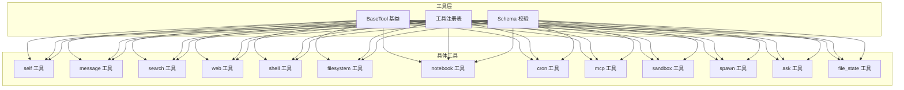
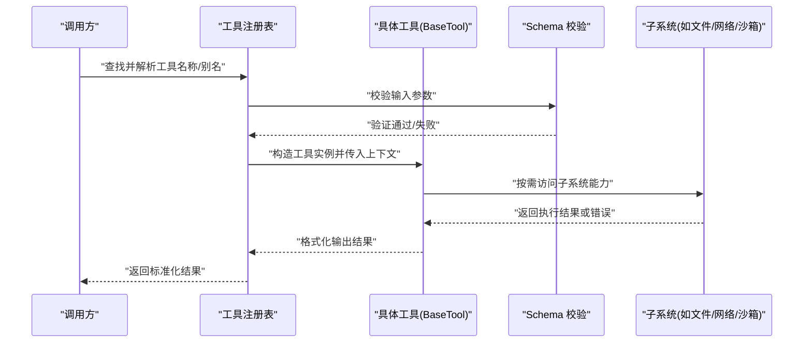
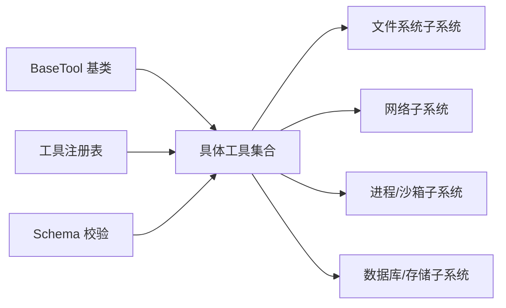

# 自定义工具开发指南

<cite>
**本文引用的文件**
- [secbot/agent/tools/base.py](file://secbot/agent/tools/base.py)
- [secbot/agent/tools/schema.py](file://secbot/agent/tools/schema.py)
- [secbot/agent/tools/registry.py](file://secbot/agent/tools/registry.py)
- [secbot/agent/tools/self.py](file://secbot/agent/tools/self.py)
- [secbot/agent/tools/message.py](file://secbot/agent/tools/message.py)
- [secbot/agent/tools/search.py](file://secbot/agent/tools/search.py)
- [secbot/agent/tools/web.py](file://secbot/agent/tools/web.py)
- [secbot/agent/tools/shell.py](file://secbot/agent/tools/shell.py)
- [secbot/agent/tools/filesystem.py](file://secbot/agent/tools/filesystem.py)
- [secbot/agent/tools/notebook.py](file://secbot/agent/tools/notebook.py)
- [secbot/agent/tools/cron.py](file://secbot/agent/tools/cron.py)
- [secbot/agent/tools/mcp.py](file://secbot/agent/tools/mcp.py)
- [secbot/agent/tools/sandbox.py](file://secbot/agent/tools/sandbox.py)
- [secbot/agent/tools/spawn.py](file://secbot/agent/tools/spawn.py)
- [secbot/agent/tools/ask.py](file://secbot/agent/tools/ask.py)
- [secbot/agent/tools/file_state.py](file://secbot/agent/tools/file_state.py)
- [docs/my-tool.md](file://docs/my-tool.md)
- [tests/tools/test_tool_validation.py](file://tests/tools/test_tool_validation.py)
- [tests/tools/test_tool_registry.py](file://tests/tools/test_tool_registry.py)
- [tests/tools/test_exec_security.py](file://tests/tools/test_exec_security.py)
- [tests/tools/test_web_fetch_security.py](file://tests/tools/test_web_fetch_security.py)
- [tests/tools/test_sandbox.py](file://tests/tools/test_sandbox.py)
- [tests/tools/test_message_tool.py](file://tests/tools/test_message_tool.py)
- [tests/tools/test_search_tools.py](file://tests/tools/test_search_tools.py)
- [tests/tools/test_filesystem_tools.py](file://tests/tools/test_filesystem_tools.py)
- [tests/tools/test_exec_allow_patterns.py](file://tests/tools/test_exec_allow_patterns.py)
- [tests/tools/test_mcp_tool.py](file://tests/tools/test_mcp_tool.py)
- [tests/tools/test_notebook_tool.py](file://tests/tools/test_notebook_tool.py)
</cite>

## 目录
1. [简介](#简介)
2. [项目结构](#项目结构)
3. [核心组件](#核心组件)
4. [架构总览](#架构总览)
5. [详细组件分析](#详细组件分析)
6. [依赖关系分析](#依赖关系分析)
7. [性能考虑](#性能考虑)
8. [故障排查指南](#故障排查指南)
9. [结论](#结论)
10. [附录](#附录)

## 简介
本指南面向希望在 Nanobot 平台上开发“自定义工具”的工程师与研究者。文档以现有工具系统为蓝本，系统讲解如何继承 BaseTool 基类创建新工具，明确方法实现、参数与返回值规范，解释工具 Schema 的设计原则与验证机制，并提供从设计、编码到测试验证的全流程实践。同时，文档总结了安全编程最佳实践（输入验证、权限控制、资源管理），并给出调试技巧与性能优化建议，最后通过多个真实工具示例帮助快速上手。

## 项目结构
工具系统位于 secbot/agent/tools 目录下，采用“按功能分模块”的组织方式：每个工具独立为一个模块，统一由注册表集中管理；Schema 定义与校验逻辑集中在 schema 模块；基础能力由 base 模块提供；部分工具还涉及安全沙箱、网络访问、文件系统等子系统。

图表来源
- [secbot/agent/tools/base.py](file://secbot/agent/tools/base.py)
- [secbot/agent/tools/schema.py](file://secbot/agent/tools/schema.py)
- [secbot/agent/tools/registry.py](file://secbot/agent/tools/registry.py)
- [secbot/agent/tools/self.py](file://secbot/agent/tools/self.py)
- [secbot/agent/tools/message.py](file://secbot/agent/tools/message.py)
- [secbot/agent/tools/search.py](file://secbot/agent/tools/search.py)
- [secbot/agent/tools/web.py](file://secbot/agent/tools/web.py)
- [secbot/agent/tools/shell.py](file://secbot/agent/tools/shell.py)
- [secbot/agent/tools/filesystem.py](file://secbot/agent/tools/filesystem.py)
- [secbot/agent/tools/notebook.py](file://secbot/agent/tools/notebook.py)
- [secbot/agent/tools/cron.py](file://secbot/agent/tools/cron.py)
- [secbot/agent/tools/mcp.py](file://secbot/agent/tools/mcp.py)
- [secbot/agent/tools/sandbox.py](file://secbot/agent/tools/sandbox.py)
- [secbot/agent/tools/spawn.py](file://secbot/agent/tools/spawn.py)
- [secbot/agent/tools/ask.py](file://secbot/agent/tools/ask.py)
- [secbot/agent/tools/file_state.py](file://secbot/agent/tools/file_state.py)

章节来源
- [secbot/agent/tools/base.py](file://secbot/agent/tools/base.py)
- [secbot/agent/tools/schema.py](file://secbot/agent/tools/schema.py)
- [secbot/agent/tools/registry.py](file://secbot/agent/tools/registry.py)

## 核心组件
- BaseTool 基类：定义工具的标准接口、生命周期钩子、上下文注入、执行器封装等通用能力。所有自定义工具需继承该基类并实现必要方法。
- Schema 校验：提供输入/输出模式定义与验证机制，确保工具调用参数与返回结果符合预期。
- 工具注册表：集中管理工具的元数据、启用状态、别名映射与动态加载。
- 具体工具实现：覆盖常见场景（消息、搜索、网络、文件系统、笔记本、定时任务、MCP、沙箱、进程派生、询问等）。

章节来源
- [secbot/agent/tools/base.py](file://secbot/agent/tools/base.py)
- [secbot/agent/tools/schema.py](file://secbot/agent/tools/schema.py)
- [secbot/agent/tools/registry.py](file://secbot/agent/tools/registry.py)

## 架构总览
工具系统遵循“基类抽象 + 注册表调度 + Schema 验证 + 子系统集成”的架构。调用链路通常为：外部请求 -> 注册表解析 -> 参数校验 -> 调用工具执行器 -> 返回结果。

图表来源
- [secbot/agent/tools/registry.py](file://secbot/agent/tools/registry.py)
- [secbot/agent/tools/schema.py](file://secbot/agent/tools/schema.py)
- [secbot/agent/tools/base.py](file://secbot/agent/tools/base.py)

## 详细组件分析

### BaseTool 基类与继承规范
- 必需方法与职责
  - 初始化与上下文注入：接收运行时上下文、配置、日志等基础设施。
  - 执行入口：统一的调用入口负责参数解析、权限检查、执行与结果封装。
  - 生命周期钩子：如准备/清理阶段的钩子，便于资源管理与幂等控制。
  - 异常处理：对工具内部异常进行捕获与标准化输出，避免泄露敏感信息。
- 参数与返回值规范
  - 输入参数：使用 Schema 进行强类型与范围约束；支持嵌套对象与可选字段。
  - 输出结果：统一包装为结构化对象，包含状态码、消息与数据体；错误路径需包含错误码与可追踪信息。
- 权限与隔离
  - 工具应声明最小权限集合；对敏感操作（如文件写入、网络外联、进程派生）进行显式授权与审计。
  - 对外部系统调用（如 HTTP、数据库、文件系统）进行白名单与路径限制。

章节来源
- [secbot/agent/tools/base.py](file://secbot/agent/tools/base.py)

### Schema 设计原则与验证机制
- 设计原则
  - 明确输入/输出模式：区分必填字段、可选字段、默认值与类型约束。
  - 可扩展性：允许在不破坏兼容的前提下新增字段；对未知字段采取严格策略。
  - 可读性：字段命名清晰、注释完整；复杂结构提供示例与约束说明。
- 验证机制
  - 类型与范围校验：整数范围、字符串长度、枚举值、正则匹配等。
  - 结构一致性：嵌套对象的层级校验、数组元素约束。
  - 动态校验：根据上下文动态决定某些字段是否生效或需要额外校验。
- 实践要点
  - 在工具实现前先完成 Schema 设计，确保前后端一致。
  - 将 Schema 作为契约文档的一部分，便于自动化测试与集成。

章节来源
- [secbot/agent/tools/schema.py](file://secbot/agent/tools/schema.py)

### 工具注册表与发现机制
- 职责
  - 工具元数据管理：名称、别名、描述、启用状态、版本等。
  - 动态加载：按需加载工具模块，避免启动时的全量导入。
  - 别名解析：支持多语言/多形态的别名映射，提升可用性。
  - 访问控制：基于角色/会话的权限矩阵，限制工具可见性与调用范围。
- 与基类的协作
  - 注册表在调用前负责参数校验与上下文注入，再委派给具体工具实例执行。

章节来源
- [secbot/agent/tools/registry.py](file://secbot/agent/tools/registry.py)

### 典型工具实现与对比
- 自省工具（self）
  - 能力：查看/设置自身运行时状态（如模型、迭代次数、令牌用量、工作目录等）。
  - 安全：默认只读，敏感字段不可见；受内存态保护，重启恢复默认。
  - 示例参考：[docs/my-tool.md](file://docs/my-tool.md)
- 消息工具（message）
  - 能力：向用户发送消息、支持富文本与附件。
  - 安全：消息内容需经审核，防止注入与越权。
  - 测试参考：[tests/tools/test_message_tool.py](file://tests/tools/test_message_tool.py)
- 搜索工具（search）
  - 能力：检索知识库、代码库或外部索引。
  - 安全：查询参数白名单、结果过滤与去重。
  - 测试参考：[tests/tools/test_search_tools.py](file://tests/tools/test_search_tools.py)
- 网络工具（web）
  - 能力：HTTP 请求、URL 规范化与超时控制。
  - 安全：URL 白名单、协议限制、Host 解析限制、CORS 与代理策略。
  - 测试参考：[tests/tools/test_web_fetch_security.py](file://tests/tools/test_web_fetch_security.py)
- Shell 工具（shell）
  - 能力：执行受限命令行指令。
  - 安全：命令白名单、路径限制、超时与资源配额、输出截断。
  - 测试参考：[tests/tools/test_exec_security.py](file://tests/tools/test_exec_security.py)、[tests/tools/test_exec_allow_patterns.py](file://tests/tools/test_exec_allow_patterns.py)
- 文件系统工具（filesystem）
  - 能力：读写文件、遍历目录、权限检查。
  - 安全：工作区隔离、路径规范化、只读模式切换。
  - 测试参考：[tests/tools/test_filesystem_tools.py](file://tests/tools/test_filesystem_tools.py)
- 笔记本工具（notebook）
  - 能力：执行 Jupyter Notebook 片段或单元格。
  - 安全：沙箱隔离、内核白名单、输出截断与超时。
  - 测试参考：[tests/tools/test_notebook_tool.py](file://tests/tools/test_notebook_tool.py)
- 定时工具（cron）
  - 能力：周期性触发任务。
  - 安全：调度权限控制、并发与重入防护。
  - 测试参考：[tests/cron/test_cron_service.py](file://tests/cron/test_cron_service.py)
- MCP 工具（mcp）
  - 能力：与 MCP 服务器交互。
  - 安全：连接认证、消息签名、通道隔离。
  - 测试参考：[tests/tools/test_mcp_tool.py](file://tests/tools/test_mcp_tool.py)
- 沙箱工具（sandbox）
  - 能力：在受限环境中执行高风险操作。
  - 安全：资源配额、网络隔离、文件系统只读视图。
  - 测试参考：[tests/tools/test_sandbox.py](file://tests/tools/test_sandbox.py)
- 进程派生工具（spawn）
  - 能力：派生子进程执行外部程序。
  - 安全：进程白名单、环境变量清理、超时与信号处理。
  - 测试参考：[tests/tools/test_spawn.py](file://tests/tools/test_spawn.py)
- 询问工具（ask）
  - 能力：向用户提问并等待回答。
  - 安全：问题内容审核、会话绑定、超时与取消。
  - 测试参考：[tests/tools/test_ask_user.py](file://tests/tools/test_ask_user.py)
- 文件状态工具（file_state）
  - 能力：记录与读取文件状态快照。
  - 安全：仅允许在工作区内读写，防止路径穿越。
  - 测试参考：[tests/tools/test_file_state.py](file://tests/tools/test_file_state.py)

章节来源
- [docs/my-tool.md](file://docs/my-tool.md)
- [secbot/agent/tools/self.py](file://secbot/agent/tools/self.py)
- [secbot/agent/tools/message.py](file://secbot/agent/tools/message.py)
- [secbot/agent/tools/search.py](file://secbot/agent/tools/search.py)
- [secbot/agent/tools/web.py](file://secbot/agent/tools/web.py)
- [secbot/agent/tools/shell.py](file://secbot/agent/tools/shell.py)
- [secbot/agent/tools/filesystem.py](file://secbot/agent/tools/filesystem.py)
- [secbot/agent/tools/notebook.py](file://secbot/agent/tools/notebook.py)
- [secbot/agent/tools/cron.py](file://secbot/agent/tools/cron.py)
- [secbot/agent/tools/mcp.py](file://secbot/agent/tools/mcp.py)
- [secbot/agent/tools/sandbox.py](file://secbot/agent/tools/sandbox.py)
- [secbot/agent/tools/spawn.py](file://secbot/agent/tools/spawn.py)
- [secbot/agent/tools/ask.py](file://secbot/agent/tools/ask.py)
- [secbot/agent/tools/file_state.py](file://secbot/agent/tools/file_state.py)
- [tests/tools/test_message_tool.py](file://tests/tools/test_message_tool.py)
- [tests/tools/test_search_tools.py](file://tests/tools/test_search_tools.py)
- [tests/tools/test_web_fetch_security.py](file://tests/tools/test_web_fetch_security.py)
- [tests/tools/test_exec_security.py](file://tests/tools/test_exec_security.py)
- [tests/tools/test_exec_allow_patterns.py](file://tests/tools/test_exec_allow_patterns.py)
- [tests/tools/test_filesystem_tools.py](file://tests/tools/test_filesystem_tools.py)
- [tests/tools/test_notebook_tool.py](file://tests/tools/test_notebook_tool.py)
- [tests/tools/test_mcp_tool.py](file://tests/tools/test_mcp_tool.py)
- [tests/tools/test_sandbox.py](file://tests/tools/test_sandbox.py)
- [tests/tools/test_spawn.py](file://tests/tools/test_spawn.py)
- [tests/tools/test_ask_user.py](file://tests/tools/test_ask_user.py)
- [tests/tools/test_file_state.py](file://tests/tools/test_file_state.py)

### 开发流程（从设计到测试）
- 工具设计
  - 明确目标与边界：确定工具要解决的问题域、输入输出、副作用与安全要求。
  - 设计 Schema：先定义输入/输出模式，再编写工具实现；确保字段命名与约束清晰。
  - 权限与隔离：列出所需权限、可选的沙箱/隔离策略与审计需求。
- 编码实现
  - 继承 BaseTool：实现初始化、执行入口、生命周期钩子与异常处理。
  - 参数校验：在进入业务逻辑前完成 Schema 校验与参数归一化。
  - 子系统集成：按需访问文件系统、网络、进程、数据库等子系统，严格遵守白名单与配额。
  - 结果封装：统一返回结构化结果，错误路径包含可诊断信息。
- 单元测试与集成测试
  - 使用现有测试用例风格：覆盖正常路径、边界条件、异常路径与安全场景。
  - 参考测试样例：消息、搜索、网络、文件系统、沙箱、MCP、笔记本等工具的测试文件。
- 文档与发布
  - 补充使用文档与示例，确保可复现。
  - 提交变更并通过注册表测试，确认工具可被正确发现与调用。

章节来源
- [tests/tools/test_tool_validation.py](file://tests/tools/test_tool_validation.py)
- [tests/tools/test_tool_registry.py](file://tests/tools/test_tool_registry.py)

### 安全编程最佳实践
- 输入验证
  - 使用 Schema 对输入进行强类型与范围校验；拒绝未知字段与非法类型。
  - 对用户可控输入进行转义与裁剪，避免注入攻击。
- 权限控制
  - 最小权限原则：仅授予工具完成任务所需的最小权限。
  - 角色与会话绑定：根据调用者身份动态调整可用工具集。
- 资源管理
  - 超时与配额：为网络、文件、进程等操作设置超时与资源上限。
  - 资源回收：在生命周期钩子中释放文件句柄、网络连接、临时文件等。
- 隔离与审计
  - 沙箱与工作区隔离：限制文件系统与网络访问范围。
  - 审计日志：记录关键操作、参数与结果摘要，便于回溯。
- 安全测试
  - 参考现有安全测试用例：网络抓包、命令执行、文件系统越权、沙箱逃逸等。

章节来源
- [tests/tools/test_exec_security.py](file://tests/tools/test_exec_security.py)
- [tests/tools/test_web_fetch_security.py](file://tests/tools/test_web_fetch_security.py)
- [tests/tools/test_sandbox.py](file://tests/tools/test_sandbox.py)
- [tests/tools/test_exec_allow_patterns.py](file://tests/tools/test_exec_allow_patterns.py)

### 调试技巧与性能优化
- 调试技巧
  - 分层定位：先确认注册表解析与参数校验是否通过，再进入工具执行路径。
  - 日志分级：区分 info/warn/error，关键路径增加上下文信息（如工具名、参数摘要、耗时）。
  - 复现最小化：构造最小输入集与环境，快速复现问题。
- 性能优化
  - 缓存与去重：对重复请求进行缓存与去重（如搜索结果、文件读取）。
  - 异步与并发：对 I/O 密集型操作采用异步与并发策略，但注意线程/进程安全。
  - 资源池：对昂贵资源（如数据库连接、网络连接）使用连接池与复用。
  - 超时与重试：合理设置超时与指数退避重试，避免雪崩效应。

## 依赖关系分析
工具系统内部依赖清晰，耦合度低，主要体现在以下方面：
- 基类与工具：所有工具共享 BaseTool 接口，降低上层调用复杂度。
- 注册表与工具：注册表负责发现与调度，工具专注业务实现。
- Schema 与工具：Schema 作为契约，贯穿工具的输入/输出校验。
- 子系统与工具：工具通过统一接口访问文件系统、网络、进程、沙箱等子系统，避免直接耦合。

图表来源
- [secbot/agent/tools/base.py](file://secbot/agent/tools/base.py)
- [secbot/agent/tools/registry.py](file://secbot/agent/tools/registry.py)
- [secbot/agent/tools/schema.py](file://secbot/agent/tools/schema.py)

章节来源
- [secbot/agent/tools/base.py](file://secbot/agent/tools/base.py)
- [secbot/agent/tools/registry.py](file://secbot/agent/tools/registry.py)
- [secbot/agent/tools/schema.py](file://secbot/agent/tools/schema.py)

## 性能考虑
- I/O 优化：批量读写、流式处理、压缩传输。
- 计算优化：预计算与缓存、向量化与并行化。
- 网络优化：长连接、连接池、DNS 缓存、CDN 加速。
- 内存优化：对象池、弱引用、及时释放。
- 调度优化：优先级队列、负载均衡、限流与熔断。

## 故障排查指南
- 常见问题
  - 工具未被发现：检查注册表配置与模块导入路径。
  - 参数校验失败：对照 Schema 字段与类型，修正输入。
  - 权限不足：确认工具权限与会话角色，必要时调整白名单。
  - 超时与资源耗尽：调整超时阈值与配额，优化算法或引入缓存。
- 排查步骤
  - 启用详细日志，定位失败阶段（解析/校验/执行/封装）。
  - 使用最小化输入复现实例，逐步扩大范围。
  - 对比安全测试用例，确认是否存在越权或逃逸行为。
- 参考测试
  - 工具验证与注册：[tests/tools/test_tool_validation.py](file://tests/tools/test_tool_validation.py)、[tests/tools/test_tool_registry.py](file://tests/tools/test_tool_registry.py)
  - 安全与隔离：[tests/tools/test_exec_security.py](file://tests/tools/test_exec_security.py)、[tests/tools/test_web_fetch_security.py](file://tests/tools/test_web_fetch_security.py)、[tests/tools/test_sandbox.py](file://tests/tools/test_sandbox.py)
  - 功能覆盖：消息、搜索、文件系统、MCP、笔记本等工具测试文件。

章节来源
- [tests/tools/test_tool_validation.py](file://tests/tools/test_tool_validation.py)
- [tests/tools/test_tool_registry.py](file://tests/tools/test_tool_registry.py)
- [tests/tools/test_exec_security.py](file://tests/tools/test_exec_security.py)
- [tests/tools/test_web_fetch_security.py](file://tests/tools/test_web_fetch_security.py)
- [tests/tools/test_sandbox.py](file://tests/tools/test_sandbox.py)
- [tests/tools/test_message_tool.py](file://tests/tools/test_message_tool.py)
- [tests/tools/test_search_tools.py](file://tests/tools/test_search_tools.py)
- [tests/tools/test_filesystem_tools.py](file://tests/tools/test_filesystem_tools.py)
- [tests/tools/test_mcp_tool.py](file://tests/tools/test_mcp_tool.py)
- [tests/tools/test_notebook_tool.py](file://tests/tools/test_notebook_tool.py)

## 结论
通过继承 BaseTool 并结合 Schema 校验与注册表调度，开发者可以快速构建安全、可维护、可测试的自定义工具。遵循最小权限、资源配额与隔离审计的原则，配合完善的测试与日志体系，能够有效降低风险并提升稳定性。建议在实现过程中始终以“契约先行、安全优先、可观测为本”的理念指导开发与评审。

## 附录
- 实际示例参考
  - 自省工具（my）：用于查看与设置自身运行时状态，具备只读与受控写入能力。参考：[docs/my-tool.md](file://docs/my-tool.md)
  - 消息工具（message）：向用户发送消息，支持富文本与附件。参考：[tests/tools/test_message_tool.py](file://tests/tools/test_message_tool.py)
  - 搜索工具（search）：检索知识库或代码库，支持结果过滤与去重。参考：[tests/tools/test_search_tools.py](file://tests/tools/test_search_tools.py)
  - 网络工具（web）：HTTP 请求与 URL 规范化，具备严格的白名单与超时控制。参考：[tests/tools/test_web_fetch_security.py](file://tests/tools/test_web_fetch_security.py)
  - Shell 工具（shell）：受限命令行执行，具备路径限制与超时配额。参考：[tests/tools/test_exec_security.py](file://tests/tools/test_exec_security.py)、[tests/tools/test_exec_allow_patterns.py](file://tests/tools/test_exec_allow_patterns.py)
  - 文件系统工具（filesystem）：读写文件与目录，严格的工作区隔离。参考：[tests/tools/test_filesystem_tools.py](file://tests/tools/test_filesystem_tools.py)
  - 笔记本工具（notebook）：执行 Jupyter Notebook 片段，具备沙箱与输出截断。参考：[tests/tools/test_notebook_tool.py](file://tests/tools/test_notebook_tool.py)
  - 定时工具（cron）：周期性触发任务，具备调度权限与并发控制。参考：[tests/cron/test_cron_service.py](file://tests/cron/test_cron_service.py)
  - MCP 工具（mcp）：与 MCP 服务器交互，具备连接认证与消息签名。参考：[tests/tools/test_mcp_tool.py](file://tests/tools/test_mcp_tool.py)
  - 沙箱工具（sandbox）：在受限环境中执行高风险操作，具备资源配额与网络隔离。参考：[tests/tools/test_sandbox.py](file://tests/tools/test_sandbox.py)
  - 进程派生工具（spawn）：派生子进程执行外部程序，具备白名单与超时控制。参考：[tests/tools/test_spawn.py](file://tests/tools/test_spawn.py)
  - 询问工具（ask）：向用户提问并等待回答，具备会话绑定与超时处理。参考：[tests/tools/test_ask_user.py](file://tests/tools/test_ask_user.py)
  - 文件状态工具（file_state）：记录与读取文件状态快照，仅允许在工作区内读写。参考：[tests/tools/test_file_state.py](file://tests/tools/test_file_state.py)