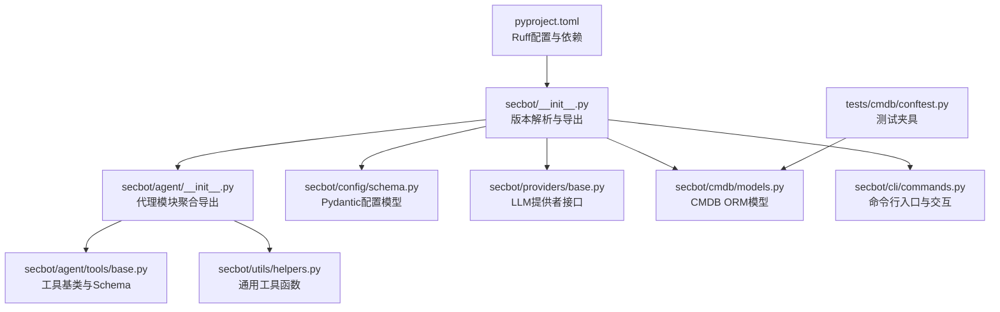
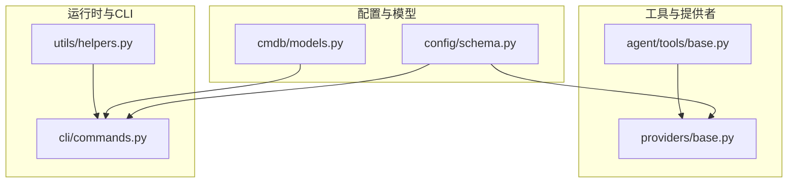
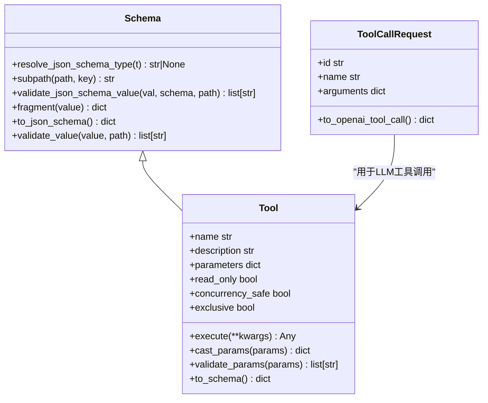
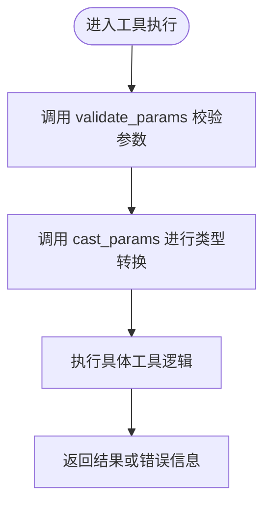

# Python编码规范

<cite>
**本文档引用的文件**
- [pyproject.toml](file://pyproject.toml)
- [secbot/__init__.py](file://secbot/__init__.py)
- [secbot/agent/__init__.py](file://secbot/agent/__init__.py)
- [secbot/agent/tools/base.py](file://secbot/agent/tools/base.py)
- [secbot/utils/helpers.py](file://secbot/utils/helpers.py)
- [secbot/cli/commands.py](file://secbot/cli/commands.py)
- [secbot/config/schema.py](file://secbot/config/schema.py)
- [secbot/providers/base.py](file://secbot/providers/base.py)
- [secbot/cmdb/models.py](file://secbot/cmdb/models.py)
- [tests/cmdb/conftest.py](file://tests/cmdb/conftest.py)
- [secbot/agent/tools/filesystem.py](file://secbot/agent/tools/filesystem.py)
</cite>

## 目录
1. [简介](#简介)
2. [项目结构](#项目结构)
3. [核心组件](#核心组件)
4. [架构总览](#架构总览)
5. [详细组件分析](#详细组件分析)
6. [依赖分析](#依赖分析)
7. [性能考虑](#性能考虑)
8. [故障排除指南](#故障排除指南)
9. [结论](#结论)
10. [附录](#附录)

## 简介
本文件基于项目中的pyproject.toml配置与实际代码实现，系统性梳理VAPT3项目的Python编码规范与最佳实践。重点覆盖以下方面：
- 基于Ruff的PEP8遵循情况：缩进、空行、行长度（100字符限制）、选择性忽略项等
- 命名约定：类名PascalCase、函数与变量snake_case、常量UPPER_CASE
- 导入顺序与组织：标准库、第三方库、项目内模块的分层导入
- 注释与docstring格式：函数注释、类注释、模块文档的标准格式
- 代码格式化工具Ruff的配置与使用指南
- 类型注解最佳实践：结合Pydantic模型与typing模块的实际应用
- 常见代码模式与反模式示例：帮助开发者编写高质量的Python代码

## 项目结构
VAPT3采用按功能域划分的包结构，核心模块包括：
- secbot：主应用包，包含代理、工具、配置、提供者、通道、会话、报告等子模块
- secbot/agent：代理核心逻辑，含工具基类、上下文、钩子、循环、记忆、技能等
- secbot/utils：通用工具函数与辅助方法
- secbot/config：配置加载与Pydantic模型定义
- secbot/providers：多提供商抽象与实现
- secbot/cmdb：本地CMDB的ORM模型与数据库操作
- tests：测试用例，覆盖各模块的功能与边界场景

**图表来源**
- [pyproject.toml:145-151](file://pyproject.toml#L145-L151)
- [secbot/__init__.py:1-33](file://secbot/__init__.py#L1-L33)
- [secbot/agent/__init__.py:1-21](file://secbot/agent/__init__.py#L1-L21)
- [secbot/agent/tools/base.py:1-280](file://secbot/agent/tools/base.py#L1-L280)
- [secbot/utils/helpers.py:1-546](file://secbot/utils/helpers.py#L1-L546)
- [secbot/config/schema.py:1-376](file://secbot/config/schema.py#L1-L376)
- [secbot/providers/base.py:1-792](file://secbot/providers/base.py#L1-L792)
- [secbot/cmdb/models.py:1-263](file://secbot/cmdb/models.py#L1-L263)
- [secbot/cli/commands.py:1-800](file://secbot/cli/commands.py#L1-L800)
- [tests/cmdb/conftest.py:1-37](file://tests/cmdb/conftest.py#L1-L37)

**章节来源**
- [pyproject.toml:145-151](file://pyproject.toml#L145-L151)
- [secbot/__init__.py:1-33](file://secbot/__init__.py#L1-L33)
- [secbot/agent/__init__.py:1-21](file://secbot/agent/__init__.py#L1-L21)

## 核心组件
本节从编码规范角度，对关键组件进行深入分析，并给出可直接参考的实现路径。

- 模块级docstring与导出控制
  - 模块顶部使用三引号字符串作为模块级docstring，清晰描述模块职责
  - 使用__all__显式声明对外导出的公共API，避免隐式导出
  - 参考路径：[secbot/__init__.py:1-33](file://secbot/__init__.py#L1-L33)、[secbot/agent/__init__.py:1-21](file://secbot/agent/__init__.py#L1-L21)

- 工具基类与Schema设计
  - 抽象基类与具体Schema分离，统一验证入口，便于扩展与复用
  - 参数校验与类型转换逻辑集中，减少重复代码
  - 参考路径：[secbot/agent/tools/base.py:21-280](file://secbot/agent/tools/base.py#L21-L280)

- 通用工具函数
  - 函数职责单一，参数与返回值类型明确，注释详尽
  - 正则表达式、时间处理、文件路径等常见场景有统一处理策略
  - 参考路径：[secbot/utils/helpers.py:18-546](file://secbot/utils/helpers.py#L18-L546)

- 配置模型与类型注解
  - 使用Pydantic BaseModel定义配置结构，支持驼峰与蛇形字段互转
  - 字段默认值、范围约束、序列化别名等通过装饰器与Field实现
  - 参考路径：[secbot/config/schema.py:13-376](file://secbot/config/schema.py#L13-L376)

- 提供者接口与数据类
  - 使用dataclass定义请求/响应载体，统一错误元数据与重试策略
  - 异步调用与流式输出抽象，便于不同提供商适配
  - 参考路径：[secbot/providers/base.py:19-792](file://secbot/providers/base.py#L19-L792)

- CMDB ORM模型
  - 使用SQLAlchemy 2.x DeclarativeBase，字段类型与索引约束明确
  - 多表关系与外键约束清晰，便于维护与查询优化
  - 参考路径：[secbot/cmdb/models.py:34-263](file://secbot/cmdb/models.py#L34-L263)

- 命令行入口与交互
  - Typer命令定义清晰，日志格式统一，终端兼容性处理完善
  - 交互式输入与富文本渲染分离，保证跨平台一致性
  - 参考路径：[secbot/cli/commands.py:1-800](file://secbot/cli/commands.py#L1-L800)

**章节来源**
- [secbot/__init__.py:1-33](file://secbot/__init__.py#L1-L33)
- [secbot/agent/__init__.py:1-21](file://secbot/agent/__init__.py#L1-L21)
- [secbot/agent/tools/base.py:21-280](file://secbot/agent/tools/base.py#L21-L280)
- [secbot/utils/helpers.py:18-546](file://secbot/utils/helpers.py#L18-L546)
- [secbot/config/schema.py:13-376](file://secbot/config/schema.py#L13-L376)
- [secbot/providers/base.py:19-792](file://secbot/providers/base.py#L19-L792)
- [secbot/cmdb/models.py:34-263](file://secbot/cmdb/models.py#L34-L263)
- [secbot/cli/commands.py:1-800](file://secbot/cli/commands.py#L1-L800)

## 架构总览
下图展示与编码规范相关的关键组件交互关系，体现模块间职责分离与依赖方向。

**图表来源**
- [secbot/config/schema.py:13-376](file://secbot/config/schema.py#L13-L376)
- [secbot/cmdb/models.py:34-263](file://secbot/cmdb/models.py#L34-L263)
- [secbot/agent/tools/base.py:21-280](file://secbot/agent/tools/base.py#L21-L280)
- [secbot/providers/base.py:19-792](file://secbot/providers/base.py#L19-L792)
- [secbot/cli/commands.py:1-800](file://secbot/cli/commands.py#L1-L800)
- [secbot/utils/helpers.py:18-546](file://secbot/utils/helpers.py#L18-L546)

## 详细组件分析

### 组件A：工具基类与Schema（PEP8与命名规范）
- 缩进与空行
  - 统一使用4空格缩进；类与函数之间保留两个空行；方法内部根据需要使用单个空行分隔逻辑块
  - 参考路径：[secbot/agent/tools/base.py:1-280](file://secbot/agent/tools/base.py#L1-L280)

- 行长度与Ruff规则
  - Ruff配置line-length=100；项目中严格遵守，必要时拆分为多行并保持对齐
  - 参考路径：[pyproject.toml:146](file://pyproject.toml#L146)

- 命名约定
  - 类名：Schema、Tool、ToolCallRequest等采用PascalCase
  - 函数与变量：resolve_json_schema_type、validate_json_schema_value等采用snake_case
  - 常量：_JSON_TYPE_MAP、_BOOL_TRUE、_BOOL_FALSE等采用UPPER_CASE
  - 参考路径：[secbot/agent/tools/base.py:11-18](file://secbot/agent/tools/base.py#L11-L18)、[secbot/agent/tools/base.py:120-129](file://secbot/agent/tools/base.py#L120-L129)

- 导入顺序与组织
  - 标准库在前（如abc、collections.abc、typing），第三方库次之（如loguru、tiktoken），项目内模块最后（如secbot.utils.helpers）
  - 同一层级内按字母序排列，避免无序导入
  - 参考路径：[secbot/agent/tools/base.py:3-6](file://secbot/agent/tools/base.py#L3-L6)

- 注释与docstring
  - 模块级docstring位于文件顶部，简洁描述用途
  - 类与方法均提供简明docstring，参数与返回值说明清晰
  - 参考路径：[secbot/agent/tools/base.py:1-280](file://secbot/agent/tools/base.py#L1-L280)

- 类图（映射到实际源码）

**图表来源**
- [secbot/agent/tools/base.py:21-280](file://secbot/agent/tools/base.py#L21-L280)

**章节来源**
- [secbot/agent/tools/base.py:1-280](file://secbot/agent/tools/base.py#L1-L280)
- [pyproject.toml:146](file://pyproject.toml#L146)

### 组件B：配置模型（Pydantic与类型注解）
- 类型注解最佳实践
  - 使用Literal、Union、Optional等精确标注字段类型
  - 使用Field设置默认值、范围约束与序列化别名
  - 使用AliasChoices与validation_alias实现多字段别名
  - 参考路径：[secbot/config/schema.py:13-376](file://secbot/config/schema.py#L13-L376)

- 命名约定与导入组织
  - 类名PascalCase（Base、AgentDefaults、ProvidersConfig等）
  - 字段snake_case（如model_override、idleCompactAfterMinutes）
  - 导入顺序：标准库（pathlib、typing）、第三方（pydantic、pydantic-settings）、项目内（secbot.cron.types）
  - 参考路径：[secbot/config/schema.py:3-8](file://secbot/config/schema.py#L3-L8)

- 注释与docstring
  - 类与字段提供简要说明，复杂字段补充约束条件与默认值
  - 参考路径：[secbot/config/schema.py:13-376](file://secbot/config/schema.py#L13-L376)

**章节来源**
- [secbot/config/schema.py:13-376](file://secbot/config/schema.py#L13-L376)

### 组件C：提供者接口（异步与数据类）
- 数据类与异常处理
  - 使用dataclass定义ToolCallRequest、LLMResponse等，统一结构化数据
  - 异步调用封装为_safe_chat/_safe_chat_stream，异常转为错误响应
  - 参考路径：[secbot/providers/base.py:19-792](file://secbot/providers/base.py#L19-L792)

- 命名约定与导入组织
  - 类名PascalCase（LLMProvider、GenerationSettings等）
  - 函数与变量snake_case（如chat_stream_with_retry、_run_with_retry）
  - 导入顺序：标准库（abc、asyncio、json、re）、第三方（loguru）、项目内（secbot.utils.helpers）
  - 参考路径：[secbot/providers/base.py:1-17](file://secbot/providers/base.py#L1-L17)

- 注释与docstring
  - 方法docstring包含参数说明、返回值与行为约束
  - 参考路径：[secbot/providers/base.py:266-291](file://secbot/providers/base.py#L266-L291)

**章节来源**
- [secbot/providers/base.py:19-792](file://secbot/providers/base.py#L19-L792)

### 组件D：通用工具函数（正则与路径处理）
- 函数职责单一与类型注解
  - 函数参数与返回值类型明确，必要时使用Any进行兼容
  - 正则表达式编译后复用，避免重复编译开销
  - 参考路径：[secbot/utils/helpers.py:18-546](file://secbot/utils/helpers.py#L18-L546)

- 命名约定与导入组织
  - 函数snake_case（如strip_think、detect_image_mime）
  - 常量UPPER_CASE（如_TOOLS_RESULT_DIR、_TOOL_RESULT_RETENTION_SECS）
  - 导入顺序：标准库（base64、json、re、time、uuid、contextlib、datetime、pathlib）、第三方（tiktoken、loguru）、项目内（secbot.utils.helpers）
  - 参考路径：[secbot/utils/helpers.py:1-16](file://secbot/utils/helpers.py#L1-L16)

- 注释与docstring
  - 函数docstring详述输入、输出与行为边界，必要时列出覆盖场景
  - 参考路径：[secbot/utils/helpers.py:18-72](file://secbot/utils/helpers.py#L18-L72)

**章节来源**
- [secbot/utils/helpers.py:18-546](file://secbot/utils/helpers.py#L18-L546)

### 组件E：命令行入口（Typer与交互）
- 命名约定与导入组织
  - 类名PascalCase（SafeFileHistory）
  - 函数与变量snake_case（如store_string、_flush_pending_tty_input）
  - 导入顺序：标准库（os、select、signal、sys、contextlib、pathlib）、第三方（typer、loguru、prompt_toolkit、rich）、项目内（secbot、secbot.cli.stream、secbot.config.schema）
  - 参考路径：[secbot/cli/commands.py:1-800](file://secbot/cli/commands.py#L1-L800)

- 注释与docstring
  - 类与方法提供简要说明，交互流程通过注释与日志输出清晰表达
  - 参考路径：[secbot/cli/commands.py:53-64](file://secbot/cli/commands.py#L53-L64)

**章节来源**
- [secbot/cli/commands.py:1-800](file://secbot/cli/commands.py#L1-L800)

### 组件F：CMDB ORM模型（SQLAlchemy）
- 命名约定与导入组织
  - 类名PascalCase（Base、Scan、Asset、Service、Vulnerability、ReportMeta）
  - 字段snake_case（如scan_id、actor_id、created_at）
  - 导入顺序：标准库（datetime、typing）、第三方（sqlalchemy.*）、项目内（无）
  - 参考路径：[secbot/cmdb/models.py:10-263](file://secbot/cmdb/models.py#L10-L263)

- 注释与docstring
  - 模块docstring说明业务表契约与多租户设计
  - 类与字段提供简要说明，索引与约束注释清晰
  - 参考路径：[secbot/cmdb/models.py:1-8](file://secbot/cmdb/models.py#L1-L8)

**章节来源**
- [secbot/cmdb/models.py:1-263](file://secbot/cmdb/models.py#L1-L263)

### 组件G：测试夹具（隔离与一致性）
- 测试夹具设计
  - 使用tmp_cmdb确保每个测试用例在独立SQLite数据库中执行，避免共享状态污染
  - 通过pytest_asyncio管理异步会话生命周期
  - 参考路径：[tests/cmdb/conftest.py:23-37](file://tests/cmdb/conftest.py#L23-L37)

**章节来源**
- [tests/cmdb/conftest.py:1-37](file://tests/cmdb/conftest.py#L1-L37)

### 概念性概述
以下为概念性工作流图，展示“工具参数校验与类型转换”的典型流程，帮助理解代码中的数据流转与约束。

[此图为概念性流程图，不直接映射到具体源码文件，故不提供图表来源]

## 依赖分析
- Ruff配置与Lint规则
  - 选择器：E（错误）、F（故障）、I（导入排序）、N（命名约定）、W（警告）
  - 忽略项：E501（行长度），但项目仍遵循line-length=100的限制
  - 目标版本：py311
  - 参考路径：[pyproject.toml:149-151](file://pyproject.toml#L149-L151)、[pyproject.toml:146](file://pyproject.toml#L146)、[pyproject.toml:147](file://pyproject.toml#L147)

- 依赖与可选特性
  - 项目依赖：typer、anthropic、pydantic、websockets、httpx、loguru、rich、sqlalchemy[asyncio]、alembic等
  - 可选依赖：aiohttp、wecom、weixin、msteams、matrix、discord、langsmith、pdf、olostep等
  - 开发依赖：pytest、pytest-asyncio、ruff、pymupdf等
  - 参考路径：[pyproject.toml:25-110](file://pyproject.toml#L25-L110)

- 覆盖率与测试
  - 覆盖率源目录：secbot
  - 排除路径：tests/*
  - 参考路径：[pyproject.toml:157-169](file://pyproject.toml#L157-L169)

**章节来源**
- [pyproject.toml:149-151](file://pyproject.toml#L149-L151)
- [pyproject.toml:146](file://pyproject.toml#L146)
- [pyproject.toml:147](file://pyproject.toml#L147)
- [pyproject.toml:25-110](file://pyproject.toml#L25-L110)
- [pyproject.toml:157-169](file://pyproject.toml#L157-L169)

## 性能考虑
- 正则表达式预编译与缓存
  - 在工具函数中对常用正则进行预编译，减少重复编译开销
  - 参考路径：[secbot/utils/helpers.py:18-72](file://secbot/utils/helpers.py#L18-L72)

- 异步I/O与连接池
  - 提供者接口统一使用异步调用，配合连接池与重试机制提升稳定性
  - 参考路径：[secbot/providers/base.py:483-527](file://secbot/providers/base.py#L483-L527)

- 文件系统访问控制
  - 严格限制文件系统访问范围，避免阻塞设备与越界路径
  - 参考路径：[secbot/agent/tools/filesystem.py:24-43](file://secbot/agent/tools/filesystem.py#L24-L43)、[secbot/agent/tools/filesystem.py:96-117](file://secbot/agent/tools/filesystem.py#L96-L117)

[本节提供一般性指导，未直接分析具体文件]

## 故障排除指南
- 常见问题定位
  - 导入顺序违规：Ruff选择器I会检测导入顺序问题，需按标准库、第三方、项目内顺序组织
  - 行长度超限：尽管忽略E501，仍应遵守100字符限制，必要时拆分行并保持对齐
  - 命名不一致：类名需PascalCase，函数与变量需snake_case，常量需UPPER_CASE
  - 类型注解缺失：Pydantic模型字段建议使用明确类型注解，配合Field设置约束
  - 注释不完整：函数与类需提供简明docstring，复杂逻辑需补充注释说明

- Ruff使用建议
  - 安装与运行：在开发环境中安装ruff，执行ruff check与ruff format
  - 集成CI：在CI流水线中加入Ruff检查步骤，确保提交代码符合规范
  - 参考路径：[pyproject.toml:108](file://pyproject.toml#L108)

**章节来源**
- [pyproject.toml:149-151](file://pyproject.toml#L149-L151)
- [pyproject.toml:146](file://pyproject.toml#L146)
- [pyproject.toml:108](file://pyproject.toml#L108)

## 结论
VAPT3项目在编码规范上体现了以下特点：
- 严格遵循PEP8与Ruff配置，统一缩进、空行与行长度标准
- 明确的命名约定与导入组织，提升代码可读性与可维护性
- 类型注解与Pydantic模型广泛应用，增强静态分析与运行时安全性
- 注释与docstring规范，便于新成员快速理解与贡献
- 常见代码模式（如工具基类、提供者接口、ORM模型）形成可复用模板

建议在后续开发中持续：
- 将Ruff检查纳入CI流程
- 对新增模块遵循现有命名与注释规范
- 保持类型注解的完整性与准确性
- 在复杂逻辑处补充必要的注释与测试

[本节为总结性内容，不直接分析具体文件]

## 附录

### A. PEP8与Ruff配置对照
- 行长度：100字符（line-length=100）
- 缩进：4空格
- 空行：模块级docstring后两个空行，类与函数间两个空行，方法内按需一个空行
- 导入顺序：标准库→第三方→项目内
- 命名约定：类名PascalCase、函数与变量snake_case、常量UPPER_CASE
- 忽略规则：E501（行长度）

**章节来源**
- [pyproject.toml:146](file://pyproject.toml#L146)
- [pyproject.toml:149-151](file://pyproject.toml#L149-L151)

### B. 类型注解最佳实践清单
- 使用Literal、Union、Optional等精确标注字段类型
- 使用Field设置默认值、范围约束与序列化别名
- 使用AliasChoices与validation_alias实现多字段别名
- 函数参数与返回值尽量提供类型注解
- 数据类用于结构化数据传递

**章节来源**
- [secbot/config/schema.py:13-376](file://secbot/config/schema.py#L13-L376)

### C. 常见代码模式与反模式
- 推荐模式
  - 工具基类：抽象Schema与Tool分离，统一验证入口
  - 提供者接口：dataclass承载数据，统一错误元数据与重试策略
  - 配置模型：Pydantic BaseModel + Field约束 + 别名支持
- 反模式
  - 忽视导入顺序导致模块耦合度上升
  - 缺少类型注解导致IDE与静态分析能力受限
  - 过长行与不一致缩进降低可读性

**章节来源**
- [secbot/agent/tools/base.py:21-280](file://secbot/agent/tools/base.py#L21-L280)
- [secbot/providers/base.py:19-792](file://secbot/providers/base.py#L19-L792)
- [secbot/config/schema.py:13-376](file://secbot/config/schema.py#L13-L376)