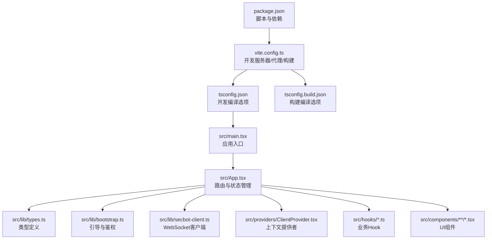
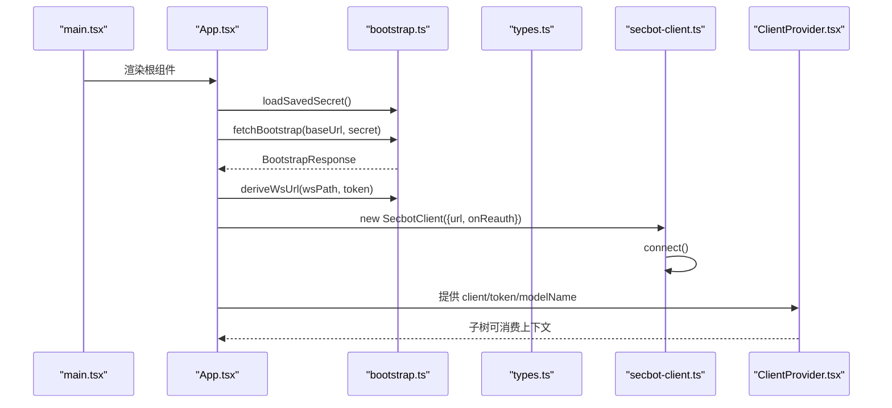
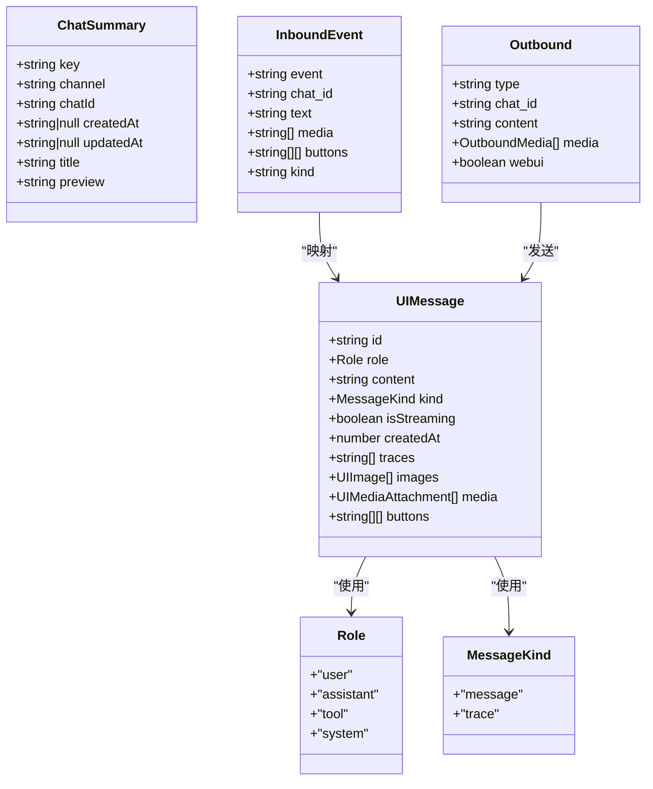
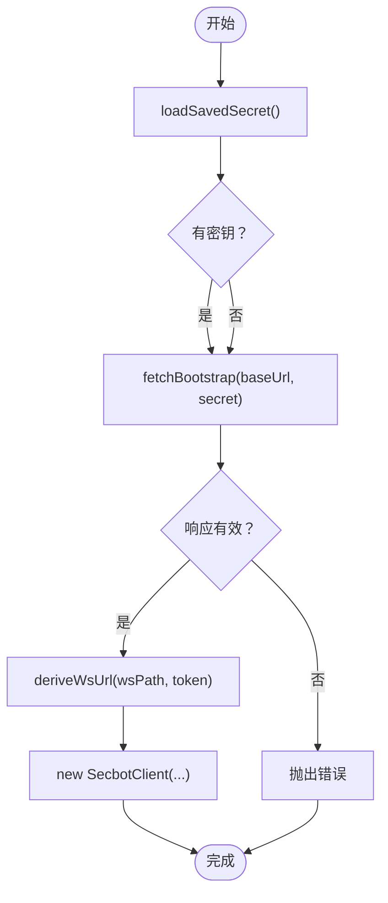
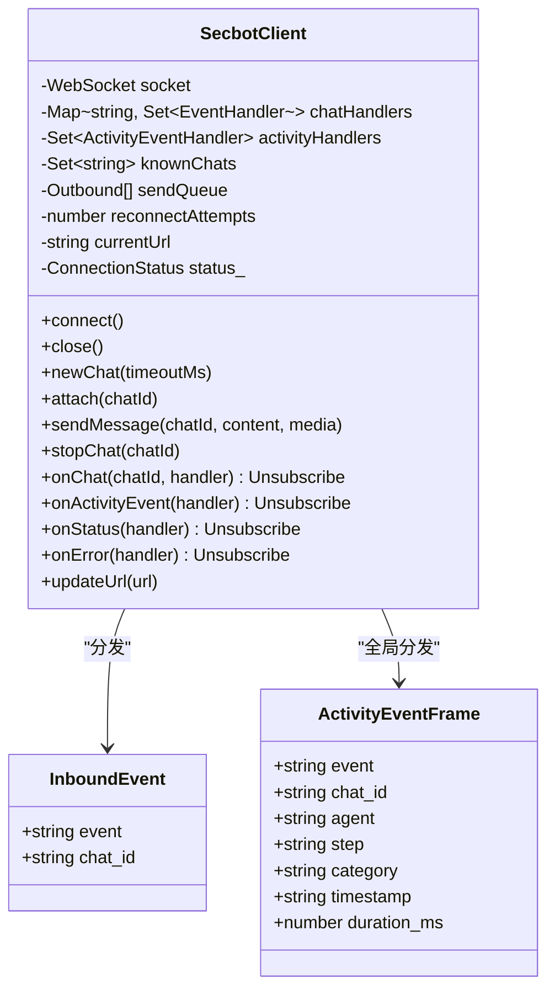
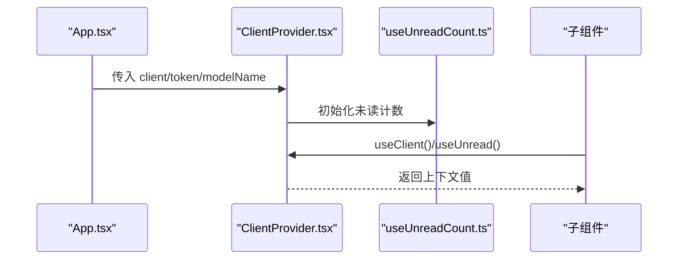
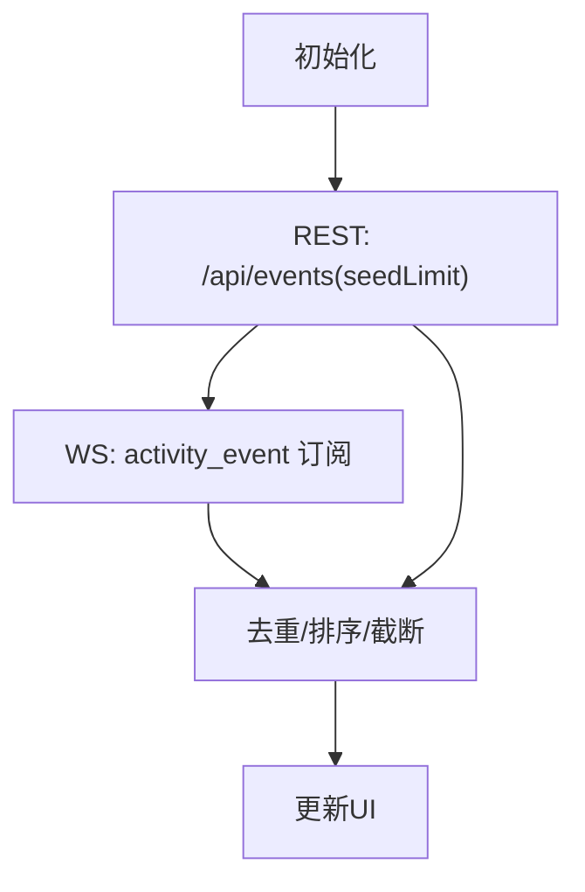
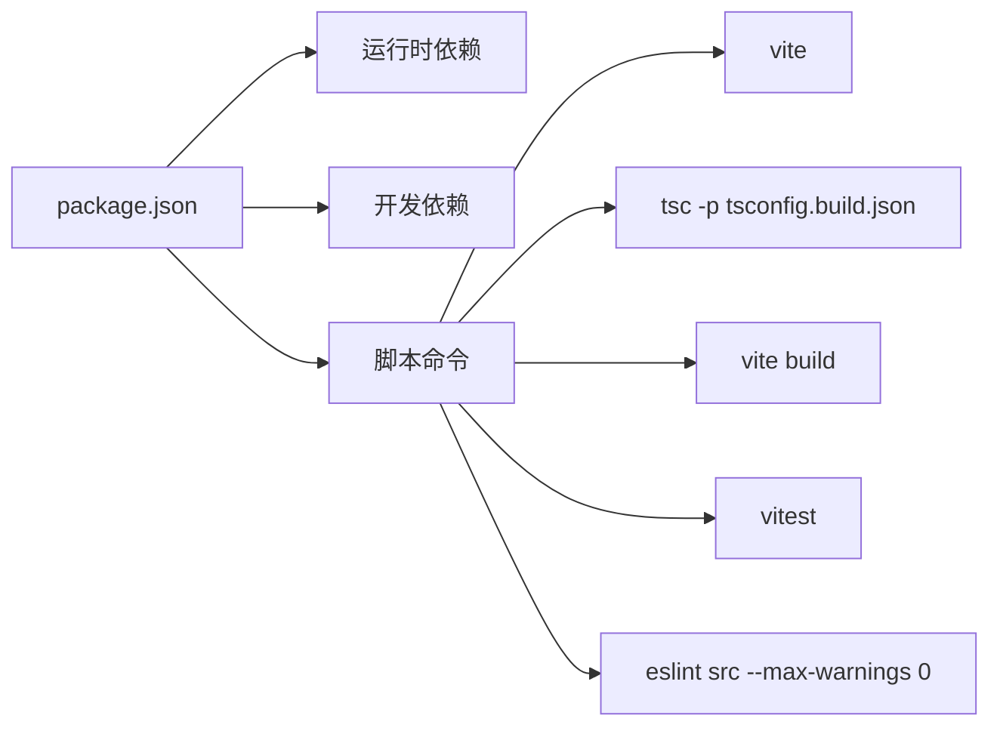

# TypeScript/JavaScript编码规范

<cite>
**本文档引用的文件**
- [webui/package.json](file://webui/package.json)
- [webui/tsconfig.json](file://webui/tsconfig.json)
- [webui/tsconfig.build.json](file://webui/tsconfig.build.json)
- [webui/vite.config.ts](file://webui/vite.config.ts)
- [webui/src/main.tsx](file://webui/src/main.tsx)
- [webui/src/App.tsx](file://webui/src/App.tsx)
- [webui/src/lib/types.ts](file://webui/src/lib/types.ts)
- [webui/src/lib/bootstrap.ts](file://webui/src/lib/bootstrap.ts)
- [webui/src/lib/secbot-client.ts](file://webui/src/lib/secbot-client.ts)
- [webui/src/providers/ClientProvider.tsx](file://webui/src/providers/ClientProvider.tsx)
- [webui/src/hooks/useActivityStream.ts](file://webui/src/hooks/useActivityStream.ts)
- [webui/src/components/thread/ThreadShell.tsx](file://webui/src/components/thread/ThreadShell.tsx)
</cite>

## 目录
1. [简介](#简介)
2. [项目结构](#项目结构)
3. [核心组件](#核心组件)
4. [架构总览](#架构总览)
5. [详细组件分析](#详细组件分析)
6. [依赖关系分析](#依赖关系分析)
7. [性能考虑](#性能考虑)
8. [故障排查指南](#故障排查指南)
9. [结论](#结论)
10. [附录](#附录)

## 简介
本规范面向VAPT3项目的前端团队，聚焦于webui子项目的TypeScript/JavaScript编码与工程化实践。内容涵盖类型系统设计（联合类型、字面量类型、接口）、命名约定、模块导入导出、React函数组件与Hooks使用、Vite构建与TypeScript编译配置、以及基于现有依赖的代码风格与测试策略建议。本文档以仓库中实际文件为依据，避免臆造信息，并通过图示帮助读者快速理解。

## 项目结构
webui采用Vite + React + TypeScript技术栈，源码位于src目录，TypeScript配置分为开发与构建两套tsconfig，Vite负责开发服务器、代理与打包，package.json定义了运行脚本与依赖生态。

**图表来源**
- [webui/package.json:1-67](file://webui/package.json#L1-L67)
- [webui/vite.config.ts:1-66](file://webui/vite.config.ts#L1-L66)
- [webui/tsconfig.json:1-33](file://webui/tsconfig.json#L1-L33)
- [webui/tsconfig.build.json:1-8](file://webui/tsconfig.build.json#L1-L8)
- [webui/src/main.tsx:1-16](file://webui/src/main.tsx#L1-L16)
- [webui/src/App.tsx:1-233](file://webui/src/App.tsx#L1-L233)

**章节来源**
- [webui/package.json:1-67](file://webui/package.json#L1-L67)
- [webui/vite.config.ts:1-66](file://webui/vite.config.ts#L1-L66)
- [webui/tsconfig.json:1-33](file://webui/tsconfig.json#L1-L33)
- [webui/tsconfig.build.json:1-8](file://webui/tsconfig.build.json#L1-L8)
- [webui/src/main.tsx:1-16](file://webui/src/main.tsx#L1-L16)
- [webui/src/App.tsx:1-233](file://webui/src/App.tsx#L1-L233)

## 核心组件
- 类型系统：以联合类型与字面量类型表达协议约束，接口用于数据契约与事件模型，确保前后端交互的强类型安全。
- 引导流程：从本地存储读取密钥，调用后端引导接口获取短期令牌与WS路径，推导WS地址并建立连接。
- 客户端：封装WebSocket连接、重连、订阅分发、消息队列与错误上报，支持多聊天会话复用单连接。
- 上下文：通过React Context向组件树注入客户端实例、令牌与未读计数等共享状态。
- Hooks：如活动流Hook负责REST种子拉取与WS实时订阅合并，保证UI一致性与性能。
- 组件：函数组件配合Hooks实现渲染逻辑，Props使用严格类型定义，避免不必要重渲染。

**章节来源**
- [webui/src/lib/types.ts:1-306](file://webui/src/lib/types.ts#L1-L306)
- [webui/src/lib/bootstrap.ts:1-77](file://webui/src/lib/bootstrap.ts#L1-L77)
- [webui/src/lib/secbot-client.ts:1-377](file://webui/src/lib/secbot-client.ts#L1-L377)
- [webui/src/providers/ClientProvider.tsx:1-58](file://webui/src/providers/ClientProvider.tsx#L1-L58)
- [webui/src/hooks/useActivityStream.ts:1-198](file://webui/src/hooks/useActivityStream.ts#L1-L198)

## 架构总览
下图展示应用启动到组件渲染的关键流程：入口初始化、引导与鉴权、WebSocket连接、上下文注入与页面路由。

**图表来源**
- [webui/src/main.tsx:1-16](file://webui/src/main.tsx#L1-L16)
- [webui/src/App.tsx:54-107](file://webui/src/App.tsx#L54-L107)
- [webui/src/lib/bootstrap.ts:37-77](file://webui/src/lib/bootstrap.ts#L37-L77)
- [webui/src/lib/secbot-client.ts:59-93](file://webui/src/lib/secbot-client.ts#L59-L93)
- [webui/src/providers/ClientProvider.tsx:24-43](file://webui/src/providers/ClientProvider.tsx#L24-L43)

## 详细组件分析

### 类型系统与接口设计
- 联合类型与字面量类型：用于角色、消息种类、连接状态、通知类型等，确保值域收敛与编译期校验。
- 接口契约：UIMessage、ChatSummary、ActivityEvent等接口明确字段含义与可选性，便于组件与Hook消费。
- 事件模型：InboundEvent、Outbound、ActivityEventFrame等描述WebSocket协议与UI渲染所需的数据形态。
- 记录类型：provider_configs使用Record<string, {...}>表达动态键值对配置。

**图表来源**
- [webui/src/lib/types.ts:1-61](file://webui/src/lib/types.ts#L1-L61)
- [webui/src/lib/types.ts:141-208](file://webui/src/lib/types.ts#L141-L208)

**章节来源**
- [webui/src/lib/types.ts:1-306](file://webui/src/lib/types.ts#L1-L306)

### 引导与鉴权流程
- 本地存储：保存/读取/清理共享密钥，避免重复输入。
- 引导接口：调用后端/webui/bootstrap，返回token与ws_path。
- WS地址推导：根据当前协议与主机生成wss/ws，保留服务端注册的路径段。

**图表来源**
- [webui/src/lib/bootstrap.ts:6-58](file://webui/src/lib/bootstrap.ts#L6-L58)

**章节来源**
- [webui/src/lib/bootstrap.ts:1-77](file://webui/src/lib/bootstrap.ts#L1-L77)

### WebSocket客户端（SecbotClient）
- 单例连接：多聊天复用同一WebSocket，自动重连与重新attach。
- 事件分发：按chat_id分发消息；全局订阅activity_event。
- 错误上报：结构化传输层错误（如消息过大）。
- 发送队列：连接未就绪时入队，OPEN后批量发送。

**图表来源**
- [webui/src/lib/secbot-client.ts:59-377](file://webui/src/lib/secbot-client.ts#L59-L377)

**章节来源**
- [webui/src/lib/secbot-client.ts:1-377](file://webui/src/lib/secbot-client.ts#L1-L377)

### 上下文与状态共享
- ClientProvider：在根部注入SecbotClient、token、model名称与未读计数。
- useClient/useUnread：组件内消费上下文，避免跨层级传递。

**图表来源**
- [webui/src/providers/ClientProvider.tsx:24-58](file://webui/src/providers/ClientProvider.tsx#L24-L58)

**章节来源**
- [webui/src/providers/ClientProvider.tsx:1-58](file://webui/src/providers/ClientProvider.tsx#L1-L58)

### Hooks与数据流
- useActivityStream：REST种子+WS实时订阅，去重排序并限制长度，暴露刷新方法。
- ThreadShell：组合历史消息、实时流、用户输入与快捷操作，协调会话切换与缓存。

**图表来源**
- [webui/src/hooks/useActivityStream.ts:139-198](file://webui/src/hooks/useActivityStream.ts#L139-L198)

**章节来源**
- [webui/src/hooks/useActivityStream.ts:1-198](file://webui/src/hooks/useActivityStream.ts#L1-L198)
- [webui/src/components/thread/ThreadShell.tsx:1-267](file://webui/src/components/thread/ThreadShell.tsx#L1-L267)

## 依赖关系分析
- 运行时依赖：React、React Router、Radix UI、TanStack React Query、i18n、图表库等。
- 开发依赖：Vite、React插件、Tailwind、TypeScript、Vitest、Testing Library等。
- 构建脚本：dev/build/preview/test/lint，分别对应开发、构建、预览、测试与ESLint检查。

**图表来源**
- [webui/package.json:6-12](file://webui/package.json#L6-L12)

**章节来源**
- [webui/package.json:1-67](file://webui/package.json#L1-L67)

## 性能考虑
- 依赖预优化：Vite配置排除特定包以稳定热更新与chunk路径。
- 构建输出：关闭SourceMap，清空输出目录，减少体积与冗余。
- 内存控制：活动流限制环形缓冲大小，避免长会话内存膨胀。
- 渲染优化：useMemo/useCallback稳定引用，避免不必要的重渲染。

**章节来源**
- [webui/vite.config.ts:17-28](file://webui/vite.config.ts#L17-L28)
- [webui/src/hooks/useActivityStream.ts:15-16](file://webui/src/hooks/useActivityStream.ts#L15-L16)

## 故障排查指南
- 引导失败：检查HTTP状态与响应完整性，确认密钥与同源凭据。
- 连接异常：关注状态回调与错误上报，区分应用层错误与传输层错误。
- 测试环境：使用happy-dom与全局设置，确保DOM相关测试稳定。
- 代理冲突：开发服务器HMR与WebSocket升级在同一根路径时，需区分代理行为。

**章节来源**
- [webui/src/lib/bootstrap.ts:37-58](file://webui/src/lib/bootstrap.ts#L37-L58)
- [webui/src/lib/secbot-client.ts:316-338](file://webui/src/lib/secbot-client.ts#L316-L338)
- [webui/vite.config.ts:59-63](file://webui/vite.config.ts#L59-L63)
- [webui/vite.config.ts:41-57](file://webui/vite.config.ts#L41-L57)

## 结论
本规范基于仓库现有配置与代码，总结了VAPT3前端的TypeScript与React开发范式：以严格的类型系统保障契约清晰，以Hook与Context解耦状态与UI，以Vite与TypeScript配置提升开发体验与构建质量。建议在后续迭代中持续遵循这些约定，保持代码一致性与可维护性。

## 附录

### TypeScript/JavaScript编码规范要点
- 类型声明
  - 使用联合类型与字面量类型表达有限取值集合，增强可读性与安全性。
  - 接口用于复杂对象契约，尽量拆分小接口并组合使用。
  - 可选属性与非空断言谨慎使用，优先通过类型守卫与默认值规避运行时错误。
- 命名约定
  - 类型名：大驼峰（如UIMessage、ConnectionStatus）。
  - 变量/函数：小驼峰（如loadSavedSecret、deriveWsUrl）。
  - 常量：全大写下划线（如ACTIVITY_STREAM_LIMIT）。
  - 文件名：功能模块使用小写短横线或按目录语义组织。
- 模块导入与导出
  - 优先使用ES6模块语法，统一相对路径与别名（如@/*）。
  - 避免循环依赖，拆分职责，按功能域组织导出。
- React组件开发
  - 函数组件为主，合理拆分子组件，Props显式标注类型。
  - Hooks使用：将副作用与状态分离，useMemo/useCallback稳定引用，避免闭包陷阱。
  - 事件处理：统一在组件顶层声明并memo化，减少渲染成本。
- Vite与TypeScript配置
  - 开发：启用严格模式与未使用检查，禁用emit，启用JSX转换。
  - 构建：扩展开发配置，排除测试目录，仅保留Node类型。
  - 别名：通过tsconfig与vite.resolve.alias保持一致。
- 代码格式化与Lint
  - 使用ESLint进行静态检查，设置最大警告阈值，保证质量门禁。
  - 配置文件建议放置于项目根目录，结合pre-commit钩子自动化执行。
- 常见模式与错误处理
  - 引导与鉴权：先加载本地密钥，再请求后端，失败时提示并回退登录。
  - WebSocket：区分应用层错误与传输层错误，提供结构化错误上报。
  - 数据流：REST种子+WS增量，去重排序并限制长度，保证UI一致性。
  - 错误边界：在组件层捕获并展示错误，避免整页崩溃。

**章节来源**
- [webui/tsconfig.json:2-30](file://webui/tsconfig.json#L2-L30)
- [webui/tsconfig.build.json:1-8](file://webui/tsconfig.build.json#L1-L8)
- [webui/vite.config.ts:10-16](file://webui/vite.config.ts#L10-L16)
- [webui/package.json:12-12](file://webui/package.json#L12-L12)