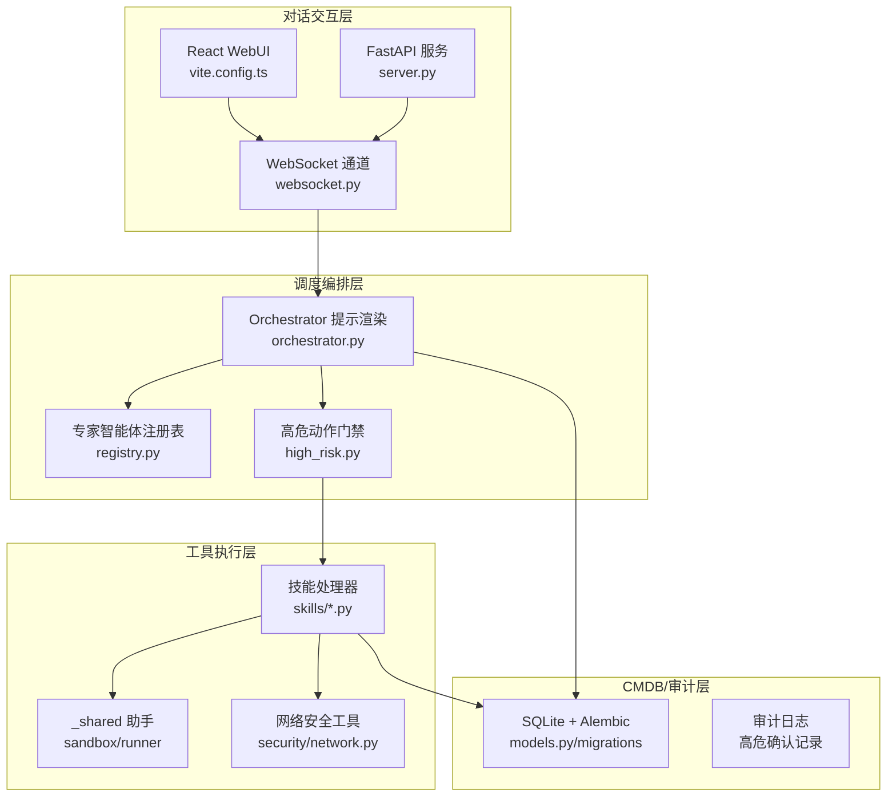
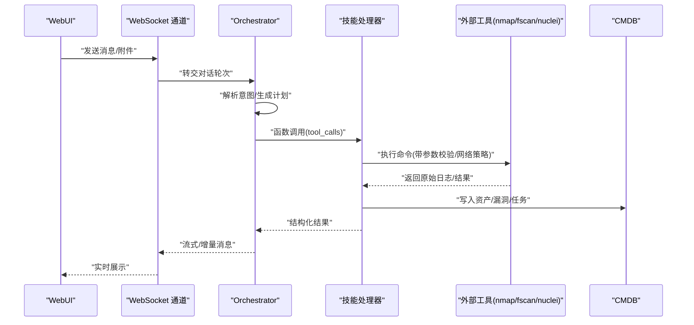
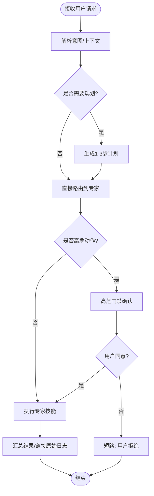
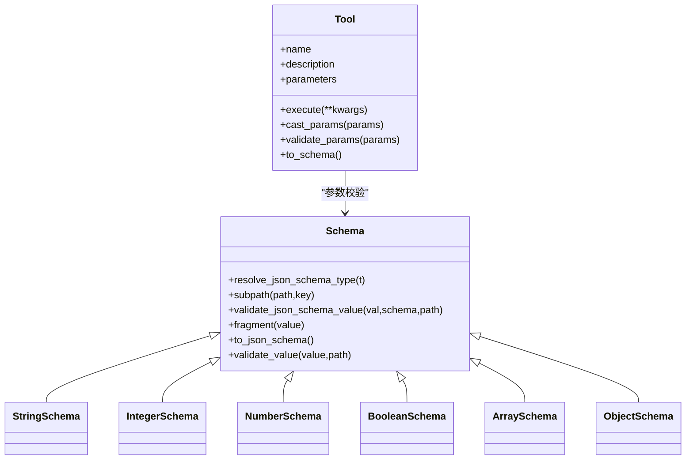
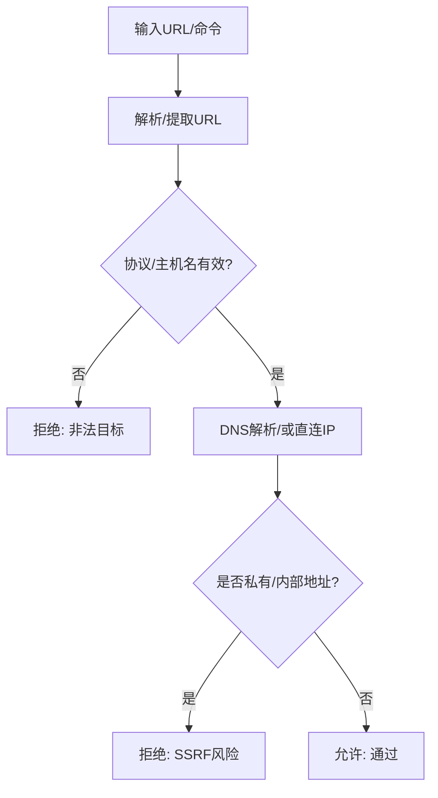
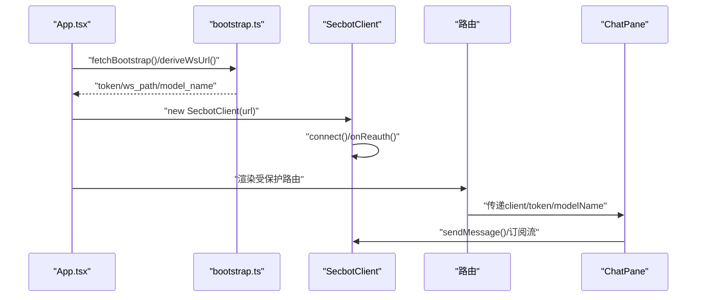
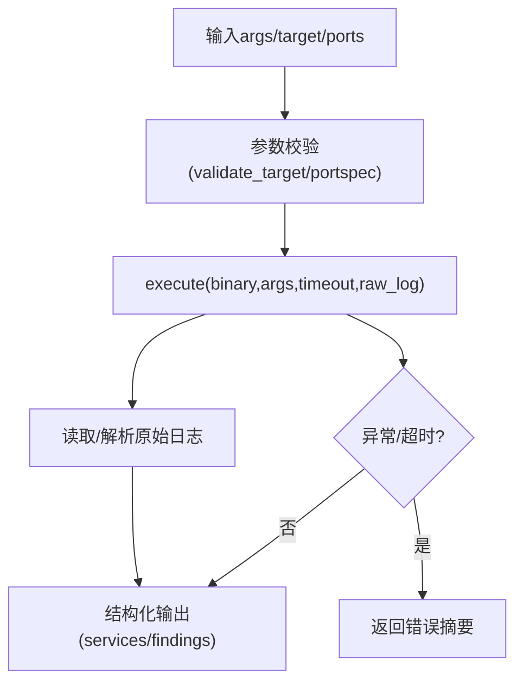
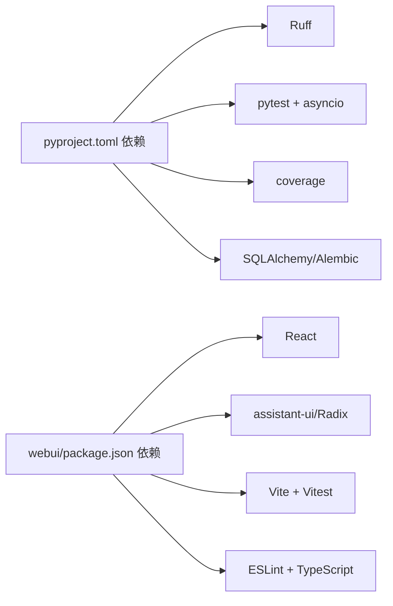

# 代码审查检查清单

<cite>
**本文引用的文件**
- [README.md](file://README.md)
- [pyproject.toml](file://pyproject.toml)
- [webui/package.json](file://webui/package.json)
- [secbot/agents/orchestrator.py](file://secbot/agents/orchestrator.py)
- [secbot/agent/tools/base.py](file://secbot/agent/tools/base.py)
- [secbot/agent/tools/schema.py](file://secbot/agent/tools/schema.py)
- [secbot/security/network.py](file://secbot/security/network.py)
- [webui/src/lib/types.ts](file://webui/src/lib/types.ts)
- [webui/vite.config.ts](file://webui/vite.config.ts)
- [webui/src/App.tsx](file://webui/src/App.tsx)
- [webui/src/components/ChatPane.tsx](file://webui/src/components/ChatPane.tsx)
- [secbot/skills/fscan-port-scan/handler.py](file://secbot/skills/fscan-port-scan/handler.py)
- [tests/agent/test_high_risk_gate.py](file://tests/agent/test_high_risk_gate.py)
- [tests/skills/test_handlers.py](file://tests/skills/test_handlers.py)
- [tests/tools/test_web_fetch_url_sanitization.py](file://tests/tools/test_web_fetch_url_sanitization.py)
- [.trellis/spec/backend/tool-invocation-safety.md](file://.trellis/spec/backend/tool-invocation-safety.md)
</cite>

## 目录
1. [简介](#简介)
2. [项目结构](#项目结构)
3. [核心组件](#核心组件)
4. [架构总览](#架构总览)
5. [详细组件分析](#详细组件分析)
6. [依赖关系分析](#依赖关系分析)
7. [性能考量](#性能考量)
8. [故障排查指南](#故障排查指南)
9. [结论](#结论)
10. [附录](#附录)

## 简介
本检查清单面向VAPT3（secbot）项目，聚焦于功能性验证、安全性、性能与代码质量评估，并提供Python与TypeScript特定的审查要点、常见问题识别与修复建议，以及自动化工具辅助审查的方法与配置。

## 项目结构
VAPT3采用分层架构：对话交互层（WebUI/REST/WebSocket）、调度编排层（Orchestrator/专家智能体）、工具执行层（nmap/fscan/nuclei/hydra等外部工具）、CMDB/审计层（SQLite/Alembic）。前端采用React + Vite + Tailwind，后端以FastAPI为主，配合nanobot通道与WebSocket。

图表来源
- [README.md:29-63](file://README.md#L29-L63)
- [webui/vite.config.ts:1-66](file://webui/vite.config.ts#L1-L66)
- [secbot/agents/orchestrator.py:1-70](file://secbot/agents/orchestrator.py#L1-L70)
- [secbot/security/network.py:1-120](file://secbot/security/network.py#L1-L120)

章节来源
- [README.md:29-63](file://README.md#L29-L63)
- [webui/vite.config.ts:1-66](file://webui/vite.config.ts#L1-L66)

## 核心组件
- 调度编排层：Orchestrator系统提示渲染，约束硬规则与工作风格；专家智能体注册表动态注入可用工具。
- 工具与参数校验：Tool基类与Schema体系，提供JSON Schema驱动的参数类型、边界与枚举校验。
- 安全护栏：高危动作门禁（确认/审计），网络SSRF防护与内部地址检测，命令行参数构造安全规范。
- 技能执行：各技能handler封装外部工具调用、超时、日志解析与结果聚合。
- 前端类型与路由：WebUI类型定义与路由保护，WebSocket连接与消息流。

章节来源
- [secbot/agents/orchestrator.py:1-70](file://secbot/agents/orchestrator.py#L1-L70)
- [secbot/agent/tools/base.py:1-280](file://secbot/agent/tools/base.py#L1-L280)
- [secbot/agent/tools/schema.py:1-233](file://secbot/agent/tools/schema.py#L1-L233)
- [secbot/security/network.py:1-120](file://secbot/security/network.py#L1-L120)
- [webui/src/lib/types.ts:1-306](file://webui/src/lib/types.ts#L1-L306)

## 架构总览
VAPT3通过LLM函数调用实现动态规划与专家智能体编排，工具执行层严格遵循参数校验与网络策略，前端通过WebSocket实时接收事件流，后端提供REST与WebSocket通道。

图表来源
- [README.md:29-63](file://README.md#L29-L63)
- [secbot/agents/orchestrator.py:52-70](file://secbot/agents/orchestrator.py#L52-L70)
- [secbot/skills/fscan-port-scan/handler.py:31-45](file://secbot/skills/fscan-port-scan/handler.py#L31-L45)

## 详细组件分析

### 组件A：Orchestrator系统提示与硬规则
- 功能完整性：锁定角色、硬规则、可用专家表、工作风格，确保跨版本一致性与可复现提示。
- 边界条件：自然顺序约束、高危动作必须经确认、拒绝越权请求。
- 异常处理：未覆盖的场景通过“拒绝”与“回退”策略保障安全。

图表来源
- [secbot/agents/orchestrator.py:17-40](file://secbot/agents/orchestrator.py#L17-L40)
- [secbot/agents/orchestrator.py:52-70](file://secbot/agents/orchestrator.py#L52-L70)

章节来源
- [secbot/agents/orchestrator.py:1-70](file://secbot/agents/orchestrator.py#L1-L70)

### 组件B：工具与参数Schema校验
- 数据结构与复杂度：Schema.validate_json_schema_value递归遍历对象/数组，复杂度O(N)（N为值树节点数）。
- 依赖链：Tool.cast_params/validate_params依赖Schema体系，支持类型转换与边界检查。
- 优化机会：批量参数校验可合并为一次性遍历，减少重复开销。
- 错误处理：非法类型/越界/缺失必填字段均返回明确错误列表。

图表来源
- [secbot/agent/tools/base.py:21-115](file://secbot/agent/tools/base.py#L21-L115)
- [secbot/agent/tools/base.py:117-280](file://secbot/agent/tools/base.py#L117-L280)
- [secbot/agent/tools/schema.py:20-233](file://secbot/agent/tools/schema.py#L20-L233)

章节来源
- [secbot/agent/tools/base.py:1-280](file://secbot/agent/tools/base.py#L1-L280)
- [secbot/agent/tools/schema.py:1-233](file://secbot/agent/tools/schema.py#L1-L233)

### 组件C：网络与命令行安全
- SSRF防护：域名解析后检查私有/环回/云元数据地址，支持白名单CIDR。
- 命令行安全：argv元素列表化、禁止字符集过滤、不依赖shell转义。
- 网络策略：根据技能声明的egress策略决定是否允许外联。

图表来源
- [secbot/security/network.py:45-120](file://secbot/security/network.py#L45-L120)
- [.trellis/spec/backend/tool-invocation-safety.md:49-101](file://.trellis/spec/backend/tool-invocation-safety.md#L49-L101)

章节来源
- [secbot/security/network.py:1-120](file://secbot/security/network.py#L1-L120)
- [.trellis/spec/backend/tool-invocation-safety.md:49-101](file://.trellis/spec/backend/tool-invocation-safety.md#L49-L101)

### 组件D：前端类型与路由
- 类型安全：UIMessage/InboundEvent/Outbound等接口定义清晰，便于TS静态检查。
- 路由与状态：App.tsx集中引导启动、认证与路由切换；ChatPane负责历史消息与流式消息管理。
- WebSocket集成：deriveWsUrl与SecbotClient封装连接生命周期与重认证。

图表来源
- [webui/src/App.tsx:54-102](file://webui/src/App.tsx#L54-L102)
- [webui/src/components/ChatPane.tsx:23-60](file://webui/src/components/ChatPane.tsx#L23-L60)
- [webui/src/lib/types.ts:63-124](file://webui/src/lib/types.ts#L63-L124)

章节来源
- [webui/src/lib/types.ts:1-306](file://webui/src/lib/types.ts#L1-L306)
- [webui/src/App.tsx:1-233](file://webui/src/App.tsx#L1-L233)
- [webui/src/components/ChatPane.tsx:1-116](file://webui/src/components/ChatPane.tsx#L1-L116)

### 组件E：技能执行与结果解析
- 示例：fscan-port-scan处理器对输出进行正则解析，限制最大条目数量，统一结构化输出。
- 超时与错误：统一通过SkillResult与异常类型表达失败原因（超时/参数无效）。
- 测试覆盖：单测覆盖happy路径与关键失败分支（输入校验/超时）。

图表来源
- [secbot/skills/fscan-port-scan/handler.py:17-45](file://secbot/skills/fscan-port-scan/handler.py#L17-L45)
- [tests/skills/test_handlers.py:138-161](file://tests/skills/test_handlers.py#L138-L161)

章节来源
- [secbot/skills/fscan-port-scan/handler.py:1-45](file://secbot/skills/fscan-port-scan/handler.py#L1-L45)
- [tests/skills/test_handlers.py:1-235](file://tests/skills/test_handlers.py#L1-L235)

## 依赖关系分析
- Python依赖：Ruff（lint）、pytest（测试）、pytest-asyncio（异步）、coverage（覆盖率）、SQLAlchemy/Alembic（CMDB）。
- 前端依赖：React 18、assistant-ui、Radix UI、Tailwind、Vitest、ESLint、TypeScript。
- 工具链：Vite开发代理、HappyDOM测试环境、PostCSS/TailwindCSS。

图表来源
- [pyproject.toml:25-68](file://pyproject.toml#L25-L68)
- [pyproject.toml:145-169](file://pyproject.toml#L145-L169)
- [webui/package.json:14-66](file://webui/package.json#L14-L66)

章节来源
- [pyproject.toml:1-169](file://pyproject.toml#L1-L169)
- [webui/package.json:1-67](file://webui/package.json#L1-L67)

## 性能考量
- 算法效率：参数校验与日志解析为线性复杂度；建议对大规模数组/对象分页处理。
- 内存使用：避免一次性加载超大日志；对匹配结果设置上限（如端口扫描最多500条）。
- 并发处理：只对只读且无独占资源的工具并行；通过Tool.read_only/concurrency_safe标识。
- 资源管理：WebSocket连接池与重连策略；前端消息去重与空闲预热（requestIdleCallback）。

章节来源
- [secbot/skills/fscan-port-scan/handler.py:26-28](file://secbot/skills/fscan-port-scan/handler.py#L26-L28)
- [webui/src/App.tsx:110-124](file://webui/src/App.tsx#L110-L124)

## 故障排查指南
- 高危动作未确认：检查高危门禁是否触发、确认payload是否正确、审计日志是否记录。
- 技能参数错误：核对输入schema与正则限制，定位InvalidSkillArg抛出点。
- 网络访问被拒：检查SSRF白名单配置、内部地址检测逻辑、URL合法性。
- 前端连接失败：确认WebSocket端口/代理配置、共享密钥、路由保护与重认证流程。

章节来源
- [tests/agent/test_high_risk_gate.py:1-141](file://tests/agent/test_high_risk_gate.py#L1-L141)
- [tests/skills/test_handlers.py:61-72](file://tests/skills/test_handlers.py#L61-L72)
- [tests/tools/test_web_fetch_url_sanitization.py:1-49](file://tests/tools/test_web_fetch_url_sanitization.py#L1-L49)
- [webui/vite.config.ts:41-58](file://webui/vite.config.ts#L41-L58)

## 结论
本检查清单从功能、安全、性能与质量四个维度梳理了VAPT3的关键控制点。建议在评审中重点关注：参数Schema一致性、高危动作门禁与审计闭环、网络与命令行安全策略、前端路由与状态一致性，以及测试覆盖率与自动化工具配置。

## 附录

### 功能性验证清单
- 功能完整性
  - 是否覆盖所有专家智能体的输入/输出契约
  - 是否满足自然顺序与跳过规则
  - 是否正确生成计划与总结
- 边界条件
  - 参数最小/最大长度、数值范围、枚举集合
  - 空输入/None值处理
  - 超时/中断/重试策略
- 异常情况
  - 高危动作拒绝/超时
  - 网络解析失败/内部地址命中
  - 技能执行失败与错误传播

章节来源
- [secbot/agents/orchestrator.py:22-40](file://secbot/agents/orchestrator.py#L22-L40)
- [secbot/agent/tools/schema.py:38-123](file://secbot/agent/tools/schema.py#L38-L123)
- [tests/agent/test_high_risk_gate.py:79-118](file://tests/agent/test_high_risk_gate.py#L79-L118)
- [tests/tools/test_web_fetch_url_sanitization.py:13-49](file://tests/tools/test_web_fetch_url_sanitization.py#L13-L49)

### 安全性检查要点
- 输入验证
  - JSON Schema + 正则双重校验
  - argv元素列表化与禁止字符过滤
- 权限控制
  - 高危动作门禁与审计日志
  - 网络策略与SSRF白名单
- 敏感信息处理
  - API Key掩码显示与不落盘存储
  - WebSocket令牌与重认证
- 安全漏洞防护
  - SSRF/命令注入/内部地址检测
  - 仅允许必要网络出口

章节来源
- [.trellis/spec/backend/tool-invocation-safety.md:49-101](file://.trellis/spec/backend/tool-invocation-safety.md#L49-L101)
- [secbot/security/network.py:29-120](file://secbot/security/network.py#L29-L120)
- [webui/src/lib/types.ts:70-124](file://webui/src/lib/types.ts#L70-L124)

### 性能考虑因素
- 算法效率：线性校验与解析，避免二次扫描
- 内存使用：日志分块/截断、对象属性懒加载
- 并发处理：只读工具并行、独占资源串行
- 资源管理：连接池、空闲预热、去重与缓存

章节来源
- [secbot/skills/fscan-port-scan/handler.py:17-28](file://secbot/skills/fscan-port-scan/handler.py#L17-L28)
- [webui/src/App.tsx:110-124](file://webui/src/App.tsx#L110-L124)

### 代码质量评估标准
- 可读性：模块职责单一、函数短小、注释与契约清晰
- 模块化：工具/技能/安全模块边界明确
- 测试覆盖率：单元测试覆盖happy路径与关键失败分支
- 文档完整性：README/API契约/前端类型定义

章节来源
- [pyproject.toml:153-169](file://pyproject.toml#L153-L169)
- [tests/skills/test_handlers.py:1-235](file://tests/skills/test_handlers.py#L1-L235)
- [webui/src/lib/types.ts:1-306](file://webui/src/lib/types.ts#L1-L306)

### Python特定审查要点
- 类型安全：使用pydantic v2与类型注解，避免Any泛滥
- 异步编程：统一async/await，避免阻塞IO；测试中启用asyncio_mode
- 资源管理：上下文管理器与异常安全；日志与数据库事务
- 参数校验：Schema.validate_json_schema_value与正则双重保障

章节来源
- [pyproject.toml:25-68](file://pyproject.toml#L25-L68)
- [pyproject.toml:153-155](file://pyproject.toml#L153-L155)
- [secbot/agent/tools/base.py:41-95](file://secbot/agent/tools/base.py#L41-L95)

### TypeScript/React特定审查要点
- 类型安全：接口定义完整，避免any；事件帧与UI模型一致
- 异步编程正确性：useEffect依赖稳定、回调memo化、取消竞态
- React组件性能：useMemo/useCallback、消息去重、空闲预热
- WebSocket集成：代理配置、升级路径、重连与错误提示

章节来源
- [webui/src/lib/types.ts:133-182](file://webui/src/lib/types.ts#L133-L182)
- [webui/src/App.tsx:126-144](file://webui/src/App.tsx#L126-L144)
- [webui/vite.config.ts:41-58](file://webui/vite.config.ts#L41-L58)

### 常见问题与修复建议
- 问题：WebSocket连接失败
  - 建议：检查channels配置、代理端口、共享密钥；确认启动的是gateway而非serve
- 问题：技能超时/参数无效
  - 建议：增加超时阈值与重试；完善输入schema与正则限制
- 问题：SSRF绕过
  - 建议：启用白名单CIDR；加强URL解析与IP判定

章节来源
- [README.md:127-170](file://README.md#L127-L170)
- [tests/skills/test_handlers.py:67-72](file://tests/skills/test_handlers.py#L67-L72)
- [tests/tools/test_web_fetch_url_sanitization.py:85-98](file://tests/tools/test_web_fetch_url_sanitization.py#L85-L98)

### 自动化工具辅助审查
- Python
  - Ruff：行长度、选择规则、忽略规则
  - pytest：异步模式、测试路径、覆盖率配置
- 前端
  - ESLint：严格警告阈值
  - Vitest：HappyDOM环境、全局setup

章节来源
- [pyproject.toml:145-169](file://pyproject.toml#L145-L169)
- [webui/package.json:12-12](file://webui/package.json#L12-L12)