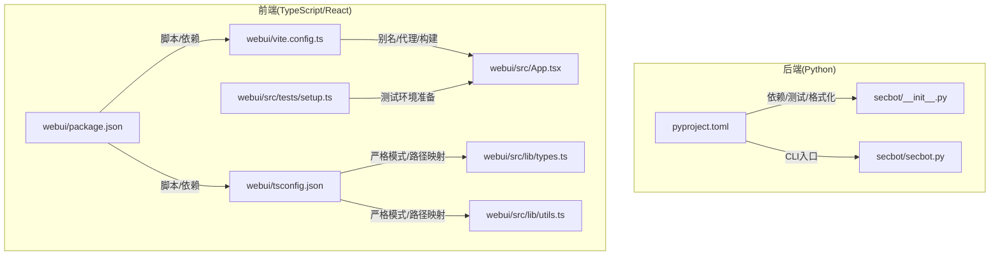
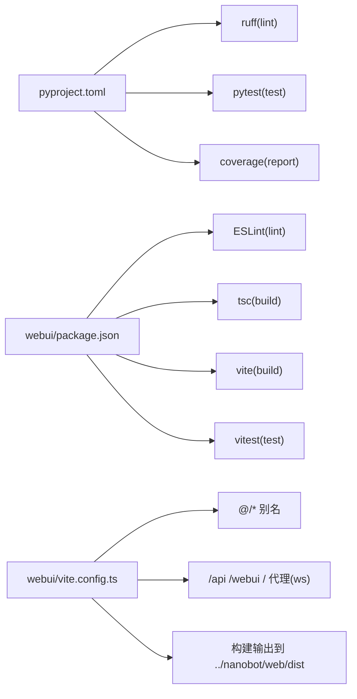

# 代码规范与约定

<cite>
**本文引用的文件**
- [pyproject.toml](file://pyproject.toml)
- [package.json](file://webui/package.json)
- [tsconfig.json](file://webui/tsconfig.json)
- [vite.config.ts](file://webui/vite.config.ts)
- [__init__.py](file://secbot/__init__.py)
- [secbot.py](file://secbot/secbot.py)
- [types.ts](file://webui/src/lib/types.ts)
- [utils.ts](file://webui/src/lib/utils.ts)
- [App.tsx](file://webui/src/App.tsx)
- [setup.ts](file://webui/src/tests/setup.ts)
- [python-sdk.md](file://docs/python-sdk.md)
</cite>

## 目录
1. [引言](#引言)
2. [项目结构](#项目结构)
3. [核心组件](#核心组件)
4. [架构总览](#架构总览)
5. [详细组件分析](#详细组件分析)
6. [依赖关系分析](#依赖关系分析)
7. [性能考量](#性能考量)
8. [故障排查指南](#故障排查指南)
9. [结论](#结论)
10. [附录](#附录)

## 引言
本文件为 VAPT3/secbot 项目的“代码规范与约定”文档，面向 Python 后端与 TypeScript/React 前端团队，系统性地给出编码规范、命名约定、导入顺序、注释与 docstring 格式、项目特定的组织原则、代码审查清单、注释与文档编写规范、格式化工具配置与使用指南，以及常见模式与反模式示例。目标是统一团队开发体验，提升可维护性与协作效率。

## 项目结构
- 后端（Python）位于 secbot/，采用包结构化组织，按功能域划分子包（agent、api、bus、channels、cli、cmdb、command、config、cron、heartbeat、providers、report、security、session、skills、templates、utils、web 等），便于职责分离与扩展。
- 前端（TypeScript/React）位于 webui/，采用 Vite + React + TypeScript 构建，源码集中在 src/，遵循 src/components、src/pages、src/lib、src/providers、src/hooks、src/tests 等目录分工。
- 工程根配置：
  - Python 使用 pyproject.toml 管理依赖、脚本入口、构建与测试配置，并通过 ruff 进行静态检查。
  - 前端使用 package.json 定义脚本与依赖，tsconfig.json 指定严格编译选项，vite.config.ts 提供开发服务器、代理与构建配置。



图表来源
- [pyproject.toml:145-169](file://pyproject.toml#L145-L169)
- [secbot/__init__.py:1-33](file://secbot/__init__.py#L1-L33)
- [secbot/secbot.py:1-132](file://secbot/secbot.py#L1-L132)
- [webui/package.json:1-67](file://webui/package.json#L1-L67)
- [webui/tsconfig.json:1-33](file://webui/tsconfig.json#L1-L33)
- [webui/vite.config.ts:1-66](file://webui/vite.config.ts#L1-L66)
- [webui/src/lib/types.ts:1-306](file://webui/src/lib/types.ts#L1-L306)
- [webui/src/lib/utils.ts:1-34](file://webui/src/lib/utils.ts#L1-L34)
- [webui/src/App.tsx:1-233](file://webui/src/App.tsx#L1-L233)
- [webui/src/tests/setup.ts:1-83](file://webui/src/tests/setup.ts#L1-L83)

章节来源
- [pyproject.toml:1-169](file://pyproject.toml#L1-L169)
- [webui/package.json:1-67](file://webui/package.json#L1-L67)
- [webui/tsconfig.json:1-33](file://webui/tsconfig.json#L1-L33)
- [webui/vite.config.ts:1-66](file://webui/vite.config.ts#L1-L66)

## 核心组件
- Python 版本与工具链
  - Python >= 3.11；使用 ruff 进行 lint，pytest 进行测试，coverage 报告过滤。
  - CLI 入口：secbot = "secbot.cli.commands:app"。
- 前端技术栈
  - React 18、TypeScript、Vite、TailwindCSS、Radix UI 组件库、Testing Library + Vitest。
  - 严格编译选项（strict、noUnusedLocals/Parameters、noFallthroughCasesInSwitch 等）。
- 关键运行时与数据契约
  - 后端导出版本与主入口，前段通过 App.tsx 初始化引导、路由与客户端连接。

章节来源
- [pyproject.toml:6, 112-114, 145-169:6-6](file://pyproject.toml#L6-L6)
- [pyproject.toml:112-114](file://pyproject.toml#L112-L114)
- [pyproject.toml:145-169](file://pyproject.toml#L145-L169)
- [webui/package.json:1-67](file://webui/package.json#L1-L67)
- [webui/tsconfig.json:17-22](file://webui/tsconfig.json#L17-L22)
- [webui/src/App.tsx:54-233](file://webui/src/App.tsx#L54-L233)
- [secbot/__init__.py:19-33](file://secbot/__init__.py#L19-L33)

## 架构总览
下图展示后端与前端在启动阶段的关键交互：前端通过 App.tsx 发起引导请求，解析返回的 WebSocket 路径与令牌，建立客户端连接；后端由 secbot.py 的入口与配置装配 AgentLoop 与消息总线。

```mermaid
sequenceDiagram
participant FE as "前端(App.tsx)"
participant API as "后端API(待实现)"
participant CFG as "配置加载(待实现)"
participant LOOP as "AgentLoop(待实现)"
participant BUS as "MessageBus(待实现)"
FE->>FE : "fetchBootstrap()/deriveWsUrl()"
FE->>API : "HTTP 请求获取引导信息"
API->>CFG : "load_config()/resolve_config_env_vars()"
CFG-->>API : "Config 对象"
API->>LOOP : "构造 AgentLoop(bus, provider, workspace, ...)"
LOOP->>BUS : "初始化消息总线"
API-->>FE : "{token, ws_path, model_name}"
FE->>FE : "SecbotClient.connect()"
```

图表来源
- [webui/src/App.tsx:57-102](file://webui/src/App.tsx#L57-L102)
- [webui/src/App.tsx:161-171](file://webui/src/App.tsx#L161-L171)
- [secbot/secbot.py:36-91](file://secbot/secbot.py#L36-L91)

章节来源
- [webui/src/App.tsx:54-233](file://webui/src/App.tsx#L54-L233)
- [secbot/secbot.py:1-132](file://secbot/secbot.py#L1-L132)

## 详细组件分析

### Python 编码规范与约定
- 版本与工具
  - Python >= 3.11；ruff 配置：line-length=100，target-version=py311，选择 E/F/I/N/W 规则集，忽略 E501。
  - pytest 配置：asyncio_mode=auto，testpaths=tests。
- 导入顺序与风格
  - 优先标准库，再第三方库，最后项目内相对导入；保持清晰分组与字母序。
  - 使用 from __future__ annotations 以支持前向引用；使用 dataclass(slots=True) 优化内存占用。
- 命名约定
  - 模块与包：全小写，必要时以下划线分隔。
  - 类：PascalCase；函数/方法：snake_case；常量：UPPER_CASE；受保护成员：单下划线前缀；私有成员：双下划线前缀。
  - 类型变量：使用 typing 中的泛型约束与协议。
- 注释与 docstring
  - 函数/类/模块顶部使用三引号 docstring；参数与返回值使用 Google/NumPy 风格的简明描述。
  - 复杂逻辑处添加行内注释，解释“为什么”而非“是什么”。
- 错误处理
  - 显式抛出具体异常；对外暴露错误信息时避免泄露敏感上下文。
- 并发与异步
  - 使用 asyncio；在需要时使用锁或队列保证并发安全。
- 测试与覆盖率
  - 使用 pytest + pytest-asyncio；覆盖率排除测试与 TYPE_CHECKING 分支。

章节来源
- [pyproject.toml:145-169](file://pyproject.toml#L145-L169)
- [secbot/secbot.py:14-31](file://secbot/secbot.py#L14-L31)
- [secbot/secbot.py:36-91](file://secbot/secbot.py#L36-L91)
- [secbot/secbot.py:93-124](file://secbot/secbot.py#L93-L124)

### TypeScript/JavaScript 开发规范
- 语言与编译
  - TypeScript 严格模式：strict、noUnusedLocals、noUnusedParameters、noFallthroughCasesInSwitch。
  - 路径别名 baseUrl 与 paths，如 "@/*" 指向 "./src/*"。
- 命名约定
  - 接口与类型：PascalCase；枚举与联合类型：语义化命名；常量：UPPER_SNAKE_CASE。
  - 变量与函数：camelCase；组件：PascalCase；文件名：PascalCase.ts 或 *.tsx。
- 接口与类型声明
  - 使用明确的接口与联合类型表达协议；对可选字段使用 ? 标记；对只读属性使用 readonly。
  - 将跨组件共享的类型集中于 src/lib/types.ts，便于统一维护。
- React 组件与状态
  - 使用 React Hooks 管理状态与副作用；避免在渲染期间产生副作用。
  - 使用 useCallback/useMemo 保持稳定引用，减少重渲染。
- 事件流与 WebSocket
  - 在 App.tsx 中集中处理引导、认证与连接生命周期；将事件帧转换为 UI 友好的结构。
- 测试
  - 使用 Vitest + Testing Library；在 setup.ts 中补齐缺失的全局对象（crypto.randomUUID、localStorage、window.alert）。

章节来源
- [webui/tsconfig.json:17-22](file://webui/tsconfig.json#L17-L22)
- [webui/tsconfig.json:24-29](file://webui/tsconfig.json#L24-L29)
- [webui/src/lib/types.ts:1-306](file://webui/src/lib/types.ts#L1-L306)
- [webui/src/App.tsx:1-233](file://webui/src/App.tsx#L1-L233)
- [webui/src/tests/setup.ts:1-83](file://webui/src/tests/setup.ts#L1-L83)

### 项目特定的代码组织原则
- 目录与文件命名
  - Python 包：按功能域拆分，如 agent、api、bus、channels、cli、cmdb、command、config、cron、heartbeat、providers、report、security、session、skills、templates、utils、web。
  - 前端：components、pages、lib、providers、hooks、tests；组件文件以 PascalCase.ts(x)，样式与资源按需放置。
- 模块划分
  - 后端：将业务能力封装为独立模块（如 tools、providers、skills），通过工厂/注册表解耦。
  - 前端：将 UI、状态、网络请求、国际化等按关注点分层。
- 配置与入口
  - Python：通过 pyproject.toml 的 scripts 定义 CLI 入口；__init__.py 暴露版本与主类。
  - 前端：package.json 定义脚本；vite.config.ts 配置代理与构建输出；main.tsx 渲染根节点。

章节来源
- [pyproject.toml:112-114](file://pyproject.toml#L112-L114)
- [secbot/__init__.py:19-33](file://secbot/__init__.py#L19-L33)
- [webui/package.json:6-13](file://webui/package.json#L6-L13)
- [webui/vite.config.ts:24-28](file://webui/vite.config.ts#L24-L28)
- [webui/src/main.tsx:1-16](file://webui/src/main.tsx#L1-L16)

### 代码审查检查清单
- 功能性
  - 是否满足需求与用例；边界条件是否覆盖；错误分支是否清晰。
  - 前后端协议一致性（如 WebSocket 事件、HTTP 响应结构）。
- 安全性
  - 输入校验与参数净化；敏感信息不泄露（令牌、密钥掩码显示）。
  - 文件操作限制在工作区范围内；URL/媒体附件白名单。
- 性能
  - 避免不必要的重渲染；合理使用缓存与去抖；长任务拆分与并发控制。
  - 严格模式下的编译警告不得忽略。
- 可维护性
  - 命名清晰、职责单一；注释解释动机与复杂度；类型完整。
  - 单元测试与集成测试覆盖关键路径。
- 文档与注释
  - API 文档与类型定义同步更新；复杂算法提供流程图或伪代码说明。

[本节为通用指导，无需列出章节来源]

### 注释与文档编写规范
- Python
  - 模块/类/函数使用三引号 docstring；参数与返回值使用简洁描述；复杂逻辑在函数内部添加行内注释。
  - 示例参考：RunResult、Secbot.from_config、Secbot.run 的 docstring 结构。
- TypeScript
  - 类型定义与接口注释明确字段含义与取值范围；对跨组件共享的类型集中管理。
  - 示例参考：UIMessage、ChatSummary、BootstrapResponse、SettingsPayload、InboundEvent、Outbound 等类型注释。
- API 文档
  - 参考 docs/python-sdk.md 的 API 表格与示例，确保参数、返回值与异常说明一致。

章节来源
- [secbot/secbot.py:14-31](file://secbot/secbot.py#L14-L31)
- [secbot/secbot.py:36-91](file://secbot/secbot.py#L36-L91)
- [secbot/secbot.py:93-124](file://secbot/secbot.py#L93-L124)
- [webui/src/lib/types.ts:1-306](file://webui/src/lib/types.ts#L1-L306)
- [docs/python-sdk.md:63-122](file://docs/python-sdk.md#L63-L122)

### 代码格式化工具配置与使用指南
- Python
  - 使用 ruff 进行 lint，命令行执行：ruff check secbot/ --fix；ruff format secbot/。
  - 配置项：line-length=100，target-version=py311，规则集 E/F/I/N/W，忽略 E501。
  - 测试：pytest tests/；覆盖率：coverage run -m pytest；coverage report。
- 前端
  - ESLint：npm run lint（检查 src/，max-warnings=0）。
  - TypeScript：tsc -p tsconfig.build.json；Vite 构建：npm run build。
  - 测试：npm test；测试监听：npm run test:watch。

章节来源
- [pyproject.toml:145-169](file://pyproject.toml#L145-L169)
- [webui/package.json:6-13](file://webui/package.json#L6-L13)
- [webui/tsconfig.json:1-33](file://webui/tsconfig.json#L1-L33)

### 常见代码模式与反模式示例
- 模式
  - 依赖注入与工厂：后端通过工厂创建 LLM 提供者；前端通过 ClientProvider 注入客户端实例。
  - 生命周期钩子：后端 AgentHook 支持 before_iteration、on_stream、before_execute_tools、finalize_content 等。
  - 严格类型：前端使用联合类型与接口表达事件与消息结构。
- 反模式
  - 在渲染期间发起副作用；未处理的 Promise 拒绝；在组件中直接操作 DOM；忽略严格模式编译警告。
  - 忽视输入校验与权限控制；在 UI 中直接暴露敏感令牌或密钥。

章节来源
- [webui/src/App.tsx:126-144](file://webui/src/App.tsx#L126-L144)
- [webui/src/lib/utils.ts:8-33](file://webui/src/lib/utils.ts#L8-L33)
- [docs/python-sdk.md:94-122](file://docs/python-sdk.md#L94-L122)

## 依赖关系分析
- Python
  - 依赖管理：pyproject.toml 的 dependencies 与 optional-dependencies；脚本入口 secbot 指向 secbot.cli.commands:app。
  - 测试与覆盖率：pytest.ini_options、coverage.run/report。
- 前端
  - 依赖：package.json 的 dependencies/devDependencies；脚本：dev/build/test/lint。
  - 编译与路径：tsconfig.json 的 strict/noUnused* 与 paths；vite.config.ts 的代理与构建输出。



图表来源
- [pyproject.toml:145-169](file://pyproject.toml#L145-L169)
- [webui/package.json:6-13](file://webui/package.json#L6-L13)
- [webui/vite.config.ts:10-28](file://webui/vite.config.ts#L10-L28)
- [webui/vite.config.ts:41-57](file://webui/vite.config.ts#L41-L57)

章节来源
- [pyproject.toml:1-169](file://pyproject.toml#L1-L169)
- [webui/package.json:1-67](file://webui/package.json#L1-L67)
- [webui/vite.config.ts:1-66](file://webui/vite.config.ts#L1-L66)

## 性能考量
- 前端
  - 严格模式开启 unused/local 参数检查，减少无用计算；合理拆分组件与懒加载；避免在渲染期间进行昂贵操作。
  - 使用 memo 化与稳定的回调引用，降低重渲染频率。
- 后端
  - 使用 dataclass(slots=True) 降低内存占用；在工具调用与消息处理中避免阻塞；合理设置并发与超时。
- 构建与打包
  - Vite 构建关闭 sourcemap 以减小体积；按需引入第三方库，避免打包冗余。

[本节为通用指导，无需列出章节来源]

## 故障排查指南
- 前端
  - 若出现随机 ID 相关问题，检查 utils.ts 中的 randomId 实现与浏览器上下文兼容性。
  - 测试环境缺少全局对象时，确认 setup.ts 的 shim 是否生效。
- 后端
  - 版本解析失败时，检查 __init__.py 中的版本回退逻辑与 pyproject.toml 的版本字段。
  - 运行异常时，查看 Secbot.from_config 与 AgentLoop 的装配参数是否正确。

章节来源
- [webui/src/lib/utils.ts:8-33](file://webui/src/lib/utils.ts#L8-L33)
- [webui/src/tests/setup.ts:1-83](file://webui/src/tests/setup.ts#L1-L83)
- [secbot/__init__.py:10-24](file://secbot/__init__.py#L10-L24)
- [secbot/secbot.py:36-91](file://secbot/secbot.py#L36-L91)

## 结论
本规范以项目现有配置与代码为依据，结合最佳实践，形成统一的 Python 与 TypeScript 开发约定。建议在日常开发中：
- 严格遵守命名与注释规范；
- 使用 ruff 与 ESLint 保障代码质量；
- 通过类型系统与测试提升健壮性；
- 在变更时同步更新文档与类型定义。

[本节为总结性内容，无需列出章节来源]

## 附录
- Python SDK 文档参考：docs/python-sdk.md，涵盖 API 表格、Hook 生命周期与示例。
- 前端类型参考：webui/src/lib/types.ts，包含消息、设置、通知、活动事件等核心类型定义。

章节来源
- [docs/python-sdk.md:1-220](file://docs/python-sdk.md#L1-L220)
- [webui/src/lib/types.ts:1-306](file://webui/src/lib/types.ts#L1-L306)