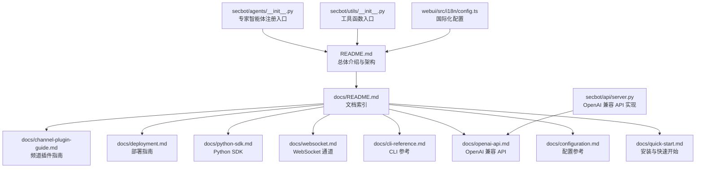
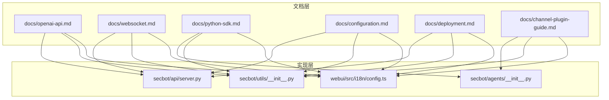
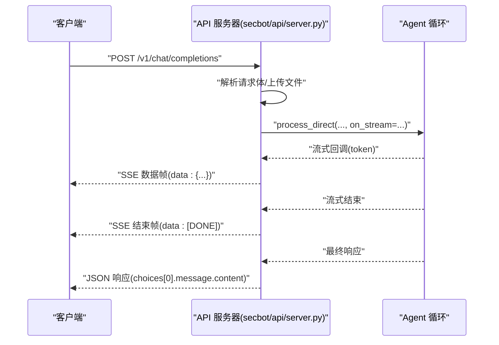
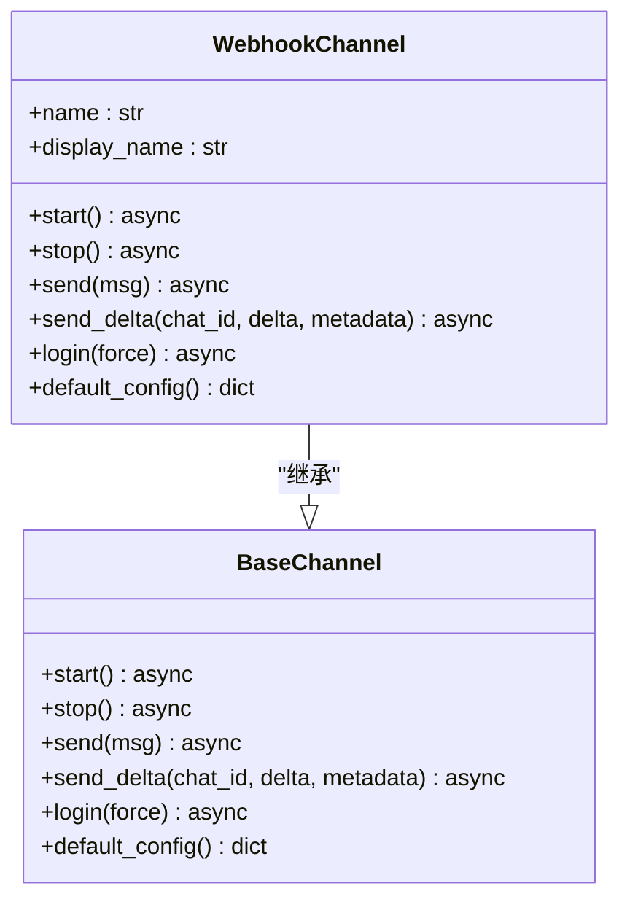
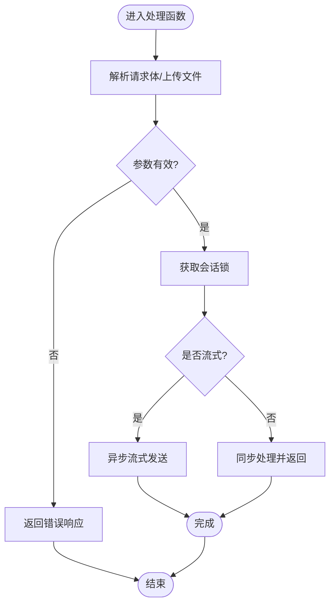
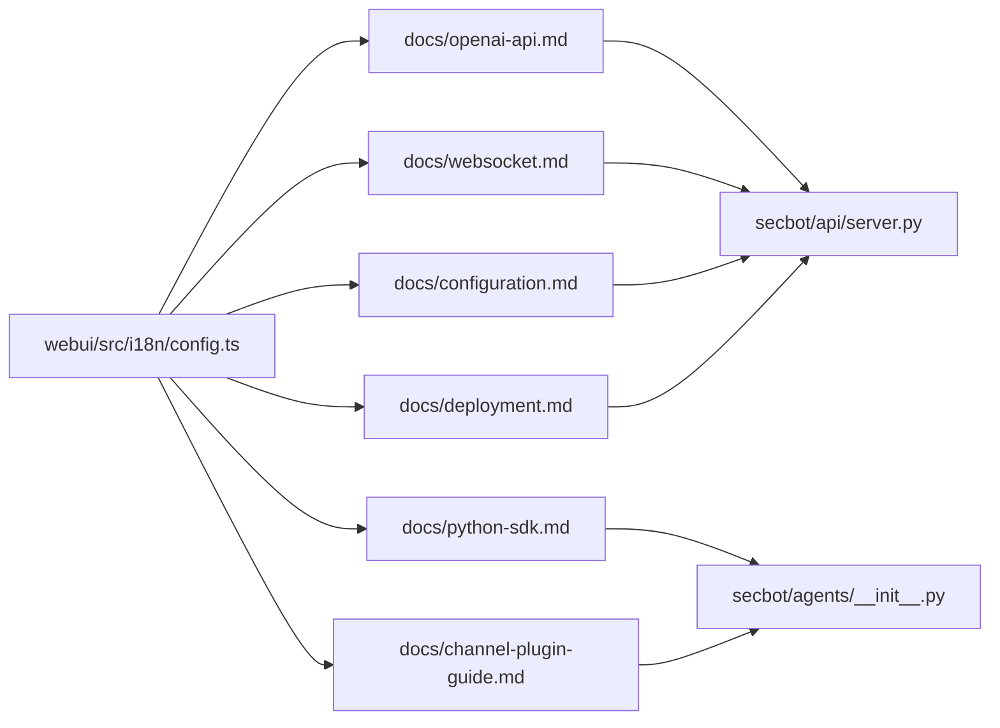

# 文档编写规范

<cite>
**本文引用的文件**   
- [README.md](file://README.md)
- [docs/README.md](file://docs/README.md)
- [docs/quick-start.md](file://docs/quick-start.md)
- [docs/configuration.md](file://docs/configuration.md)
- [docs/cli-reference.md](file://docs/cli-reference.md)
- [docs/openai-api.md](file://docs/openai-api.md)
- [docs/websocket.md](file://docs/websocket.md)
- [docs/python-sdk.md](file://docs/python-sdk.md)
- [docs/deployment.md](file://docs/deployment.md)
- [docs/channel-plugin-guide.md](file://docs/channel-plugin-guide.md)
- [secbot/api/server.py](file://secbot/api/server.py)
- [secbot/agents/__init__.py](file://secbot/agents/__init__.py)
- [secbot/utils/__init__.py](file://secbot/utils/__init__.py)
- [webui/src/i18n/config.ts](file://webui/src/i18n/config.ts)
</cite>

## 目录
1. [引言](#引言)
2. [项目结构](#项目结构)
3. [核心组件](#核心组件)
4. [架构总览](#架构总览)
5. [详细组件分析](#详细组件分析)
6. [依赖关系分析](#依赖关系分析)
7. [性能考量](#性能考量)
8. [故障排查指南](#故障排查指南)
9. [结论](#结论)
10. [附录](#附录)

## 引言
本规范旨在为 VAPT3 项目建立统一、可维护、可扩展的文档编写标准，覆盖以下方面：
- API 文档编写标准：接口描述、参数说明、返回值格式、错误处理等标准化格式
- 类与方法注释规范：docstring 格式、参数类型说明、异常抛出说明等
- 复杂逻辑说明规范：算法解释、流程图引用、伪代码示例等
- Markdown 文档格式标准：标题层级、列表格式、代码块标记、链接规范等
- 技术文档组织结构：概念解释、使用示例、最佳实践、故障排查等内容层次
- 多语言文档支持规范：基于项目国际化配置的文档翻译标准
- 文档版本管理与维护流程：确保文档与代码同步更新

## 项目结构
VAPT3 项目采用模块化分层设计，文档主要分布在以下区域：
- 顶层 README：总体介绍、架构概览、快速开始与扩展说明
- docs 目录：官方文档集合，涵盖安装、配置、CLI、API、WebSocket、SDK、部署、频道插件等主题
- secbot 子系统：核心业务逻辑，包含 API 服务器、Agent 编排、技能工具、安全与沙箱、报告生成等
- webui：前端界面与国际化配置，支撑多语言展示

**图表来源**
- [README.md:1-298](file://README.md#L1-L298)
- [docs/README.md:1-35](file://docs/README.md#L1-L35)
- [docs/openai-api.md:1-122](file://docs/openai-api.md#L1-L122)
- [docs/websocket.md:1-397](file://docs/websocket.md#L1-L397)
- [docs/python-sdk.md:1-220](file://docs/python-sdk.md#L1-L220)
- [docs/configuration.md:1-800](file://docs/configuration.md#L1-L800)
- [docs/deployment.md:1-171](file://docs/deployment.md#L1-L171)
- [docs/channel-plugin-guide.md:1-442](file://docs/channel-plugin-guide.md#L1-L442)
- [secbot/api/server.py:1-401](file://secbot/api/server.py#L1-L401)
- [secbot/agents/__init__.py:1-22](file://secbot/agents/__init__.py#L1-L22)
- [secbot/utils/__init__.py:1-7](file://secbot/utils/__init__.py#L1-L7)
- [webui/src/i18n/config.ts](file://webui/src/i18n/config.ts)

**章节来源**
- [README.md:29-75](file://README.md#L29-L75)
- [docs/README.md:7-35](file://docs/README.md#L7-L35)

## 核心组件
- API 文档与接口规范：OpenAI 兼容 API 的端点、请求/响应格式、流式传输、文件上传、错误码等
- 配置与运行：Provider、Channel、Web 工具、SSRF 白名单、重试策略等
- 通道与集成：WebSocket 通道协议、令牌签发、多聊天复用、媒体文件处理
- SDK 与插件：Python SDK 使用模式、Hook 生命周期、频道插件开发流程
- 部署与运维：Docker、systemd、LaunchAgent 等部署方式与注意事项
- 国际化与本地化：前端 i18n 配置与多语言资源

**章节来源**
- [docs/openai-api.md:33-122](file://docs/openai-api.md#L33-L122)
- [docs/websocket.md:80-397](file://docs/websocket.md#L80-L397)
- [docs/python-sdk.md:63-220](file://docs/python-sdk.md#L63-L220)
- [docs/configuration.md:10-800](file://docs/configuration.md#L10-L800)
- [docs/deployment.md:1-171](file://docs/deployment.md#L1-L171)
- [webui/src/i18n/config.ts](file://webui/src/i18n/config.ts)

## 架构总览
下图展示了 VAPT3 的文档与实现层面的映射关系，帮助读者从“文档如何描述”到“代码如何实现”的双向理解。

**图表来源**
- [docs/openai-api.md:1-122](file://docs/openai-api.md#L1-L122)
- [docs/websocket.md:1-397](file://docs/websocket.md#L1-L397)
- [docs/python-sdk.md:1-220](file://docs/python-sdk.md#L1-L220)
- [docs/configuration.md:1-800](file://docs/configuration.md#L1-L800)
- [docs/deployment.md:1-171](file://docs/deployment.md#L1-L171)
- [docs/channel-plugin-guide.md:1-442](file://docs/channel-plugin-guide.md#L1-L442)
- [secbot/api/server.py:1-401](file://secbot/api/server.py#L1-L401)
- [secbot/agents/__init__.py:1-22](file://secbot/agents/__init__.py#L1-L22)
- [secbot/utils/__init__.py:1-7](file://secbot/utils/__init__.py#L1-L7)
- [webui/src/i18n/config.ts](file://webui/src/i18n/config.ts)

## 详细组件分析

### API 文档编写标准
- 接口描述
  - 明确端点路径、HTTP 方法、行为说明（如会话隔离、单消息输入、固定模型、流式传输、文件上传）
  - 示例请求与响应，包含关键字段与含义
- 参数说明
  - 请求体字段：名称、类型、是否必填、默认值、取值范围或约束
  - 查询参数：名称、类型、是否必填、默认值
  - 文件上传：支持的 MIME/扩展名、大小限制、编码方式（base64 与 multipart）
- 返回值格式
  - 成功响应：对象结构、字段含义、示例
  - 错误响应：状态码、错误类型、错误信息、错误码
- 错误处理
  - 常见错误场景与对应状态码（如 400、401、403、413、504、500）
  - 错误字段命名一致性与语义化描述
- 流式传输
  - SSE 数据帧格式、结束标记、流式片段字段
  - 客户端处理建议（缓冲、拼接、错误恢复）

**图表来源**
- [docs/openai-api.md:33-122](file://docs/openai-api.md#L33-L122)
- [secbot/api/server.py:194-351](file://secbot/api/server.py#L194-L351)

**章节来源**
- [docs/openai-api.md:12-122](file://docs/openai-api.md#L12-L122)
- [secbot/api/server.py:194-351](file://secbot/api/server.py#L194-L351)

### 类与方法注释规范
- docstring 格式
  - 使用简洁清晰的中文描述，首行概述用途，空一行后详述参数、返回值、异常
  - 参数与返回值使用表格形式列出字段名、类型、是否必填、说明
- 参数类型说明
  - 明确类型（如 str、list、dict、bool、float 等），必要时给出取值范围或约束
  - 对于可选参数，标注默认值
- 异常抛出说明
  - 列举可能抛出的异常类型与触发条件
  - 对于外部依赖（如网络、文件系统）的异常，明确错误码与恢复建议
- 示例与用法
  - 提供简短示例，展示典型调用方式与预期结果

**图表来源**
- [docs/channel-plugin-guide.md:40-129](file://docs/channel-plugin-guide.md#L40-L129)
- [docs/channel-plugin-guide.md:191-247](file://docs/channel-plugin-guide.md#L191-L247)

**章节来源**
- [docs/channel-plugin-guide.md:39-129](file://docs/channel-plugin-guide.md#L39-L129)
- [docs/channel-plugin-guide.md:191-247](file://docs/channel-plugin-guide.md#L191-L247)

### 复杂逻辑说明规范
- 算法解释
  - 对关键流程（如文件上传解析、流式传输、令牌签发、会话隔离）提供步骤说明
  - 结合代码注释与流程图，帮助读者理解实现细节
- 流程图引用
  - 使用 Mermaid 流程图展示决策点、循环与异常处理
- 伪代码示例
  - 对难以用自然语言表达的逻辑，提供伪代码以辅助理解

**图表来源**
- [secbot/api/server.py:194-351](file://secbot/api/server.py#L194-L351)

**章节来源**
- [secbot/api/server.py:194-351](file://secbot/api/server.py#L194-L351)

### Markdown 文档格式标准
- 标题层级
  - 使用 #、##、### 表示层级，避免跳级
- 列表格式
  - 有序与无序列表混用时保持一致风格；嵌套层级不超过三级
- 代码块标记
  - 使用三反引号包裹代码块，明确语言类型（如 bash、json、python、mermaid）
- 链接规范
  - 内部链接使用相对路径，跨文件引用时提供文件路径与行号
  - 外部链接使用完整 URL 并在末尾标注来源
- 表格与图示
  - 表格使用对齐与分隔线，字段说明清晰；图示使用 mermaid，图下方标注来源

**章节来源**
- [docs/README.md:7-35](file://docs/README.md#L7-L35)
- [docs/quick-start.md:1-105](file://docs/quick-start.md#L1-L105)

### 技术文档组织结构
- 概念解释
  - 提供术语定义与背景知识，帮助初学者理解系统设计
- 使用示例
  - 提供最小可行示例（如 curl、Python requests/openai SDK），展示关键参数与期望输出
- 最佳实践
  - 配置安全与性能优化建议（如 Provider 选择、超时设置、重试策略）
- 故障排查
  - 常见问题与解决步骤，结合日志与错误码定位问题

**章节来源**
- [docs/configuration.md:10-800](file://docs/configuration.md#L10-L800)
- [docs/deployment.md:1-171](file://docs/deployment.md#L1-L171)
- [docs/websocket.md:311-397](file://docs/websocket.md#L311-L397)

### 多语言文档支持规范
- 国际化配置
  - 前端 i18n 配置集中管理，支持多种语言资源文件
- 文档翻译标准
  - 优先使用英文原文，中文翻译遵循术语一致与上下文贴切
  - 图表与代码示例中的文本尽量抽取为可翻译键值
- 本地化测试
  - 在不同语言环境下验证链接、路径与资源加载

**章节来源**
- [webui/src/i18n/config.ts](file://webui/src/i18n/config.ts)

### 文档版本管理与维护流程
- 版本与分支
  - 主分支用于稳定发布，功能与破坏性变更通过特性分支提交
- 同步更新
  - 代码变更与文档变更同步推进，重要改动要求同时更新相关文档
- 审查与合并
  - 文档变更纳入代码审查流程，确保准确性与一致性
- 发布与追踪
  - 通过变更日志与标签追踪文档版本，便于回溯与对比

**章节来源**
- [README.md:284-289](file://README.md#L284-L289)

## 依赖关系分析
- 文档与实现的映射
  - API 文档与实现层的端点与处理逻辑一一对应
  - 配置文档与实现层的配置项与默认值保持一致
  - 插件与 SDK 文档与实现层的接口契约保持一致
- 外部依赖
  - 第三方 Provider 与频道插件通过统一注册机制接入
  - 前端 i18n 与后端配置协同，确保多语言体验一致

**图表来源**
- [docs/openai-api.md:1-122](file://docs/openai-api.md#L1-L122)
- [docs/websocket.md:1-397](file://docs/websocket.md#L1-L397)
- [docs/python-sdk.md:1-220](file://docs/python-sdk.md#L1-L220)
- [docs/configuration.md:1-800](file://docs/configuration.md#L1-L800)
- [docs/deployment.md:1-171](file://docs/deployment.md#L1-L171)
- [docs/channel-plugin-guide.md:1-442](file://docs/channel-plugin-guide.md#L1-L442)
- [secbot/api/server.py:1-401](file://secbot/api/server.py#L1-L401)
- [secbot/agents/__init__.py:1-22](file://secbot/agents/__init__.py#L1-L22)
- [webui/src/i18n/config.ts](file://webui/src/i18n/config.ts)

**章节来源**
- [docs/openai-api.md:1-122](file://docs/openai-api.md#L1-L122)
- [docs/websocket.md:1-397](file://docs/websocket.md#L1-L397)
- [docs/python-sdk.md:1-220](file://docs/python-sdk.md#L1-L220)
- [docs/configuration.md:1-800](file://docs/configuration.md#L1-L800)
- [docs/deployment.md:1-171](file://docs/deployment.md#L1-L171)
- [docs/channel-plugin-guide.md:1-442](file://docs/channel-plugin-guide.md#L1-L442)
- [secbot/api/server.py:1-401](file://secbot/api/server.py#L1-L401)
- [secbot/agents/__init__.py:1-22](file://secbot/agents/__init__.py#L1-L22)
- [webui/src/i18n/config.ts](file://webui/src/i18n/config.ts)

## 性能考量
- 超时与并发
  - API 请求超时设置合理，避免长时间占用资源；会话级锁保障并发安全
- 流式传输
  - SSE 流式传输减少等待时间，提升用户体验；注意客户端缓冲与拼接策略
- 文件上传
  - 限制文件大小与类型，避免内存与磁盘压力过大
- 配置优化
  - Provider 与频道配置的合理选择与缓存策略，降低延迟与失败率

**章节来源**
- [docs/openai-api.md:12-122](file://docs/openai-api.md#L12-L122)
- [docs/websocket.md:311-397](file://docs/websocket.md#L311-L397)
- [docs/configuration.md:10-800](file://docs/configuration.md#L10-L800)

## 故障排查指南
- 常见错误与处理
  - 400：请求参数无效或格式错误，检查消息结构与必填字段
  - 401/403：认证失败或未授权，检查令牌与访问控制配置
  - 413：文件过大或上传无效，调整大小限制或改用 multipart
  - 504：请求超时，检查超时设置与后端负载
  - 500：内部错误，查看日志并重试
- WebSocket 连接问题
  - 校验握手参数与令牌；确认 allowFrom 与路径配置；TLS 证书与最低版本要求
- 部署问题
  - Docker 权限与目录挂载；systemd 用户服务与开机自启；macOS LaunchAgent 生命周期

**章节来源**
- [docs/openai-api.md:12-122](file://docs/openai-api.md#L12-L122)
- [docs/websocket.md:311-397](file://docs/websocket.md#L311-L397)
- [docs/deployment.md:1-171](file://docs/deployment.md#L1-L171)

## 结论
本规范为 VAPT3 项目提供了统一的文档编写标准与最佳实践，涵盖 API 文档、类与方法注释、复杂逻辑说明、Markdown 格式、技术文档组织、多语言支持与版本管理等方面。通过严格遵循本规范，可以显著提升文档质量与可维护性，确保文档与代码同步演进，为用户提供一致、准确、易用的技术文档体验。

## 附录
- 快速参考
  - 安装与快速开始：[docs/quick-start.md](file://docs/quick-start.md)
  - 配置参考：[docs/configuration.md](file://docs/configuration.md)
  - CLI 参考：[docs/cli-reference.md](file://docs/cli-reference.md)
  - OpenAI 兼容 API：[docs/openai-api.md](file://docs/openai-api.md)
  - WebSocket 通道：[docs/websocket.md](file://docs/websocket.md)
  - Python SDK：[docs/python-sdk.md](file://docs/python-sdk.md)
  - 部署指南：[docs/deployment.md](file://docs/deployment.md)
  - 频道插件指南：[docs/channel-plugin-guide.md](file://docs/channel-plugin-guide.md)
- 实现参考
  - API 服务器：[secbot/api/server.py](file://secbot/api/server.py)
  - 专家智能体注册：[secbot/agents/__init__.py](file://secbot/agents/__init__.py)
  - 工具函数入口：[secbot/utils/__init__.py](file://secbot/utils/__init__.py)
  - 国际化配置：[webui/src/i18n/config.ts](file://webui/src/i18n/config.ts)