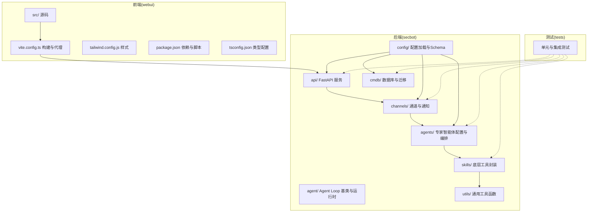
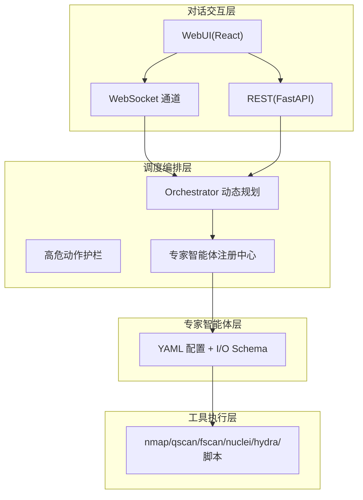
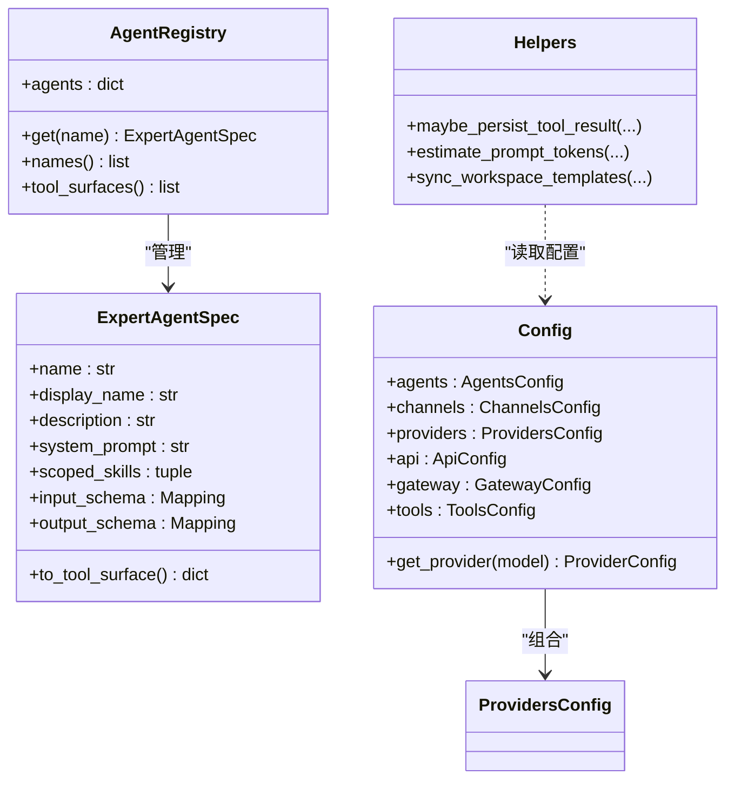
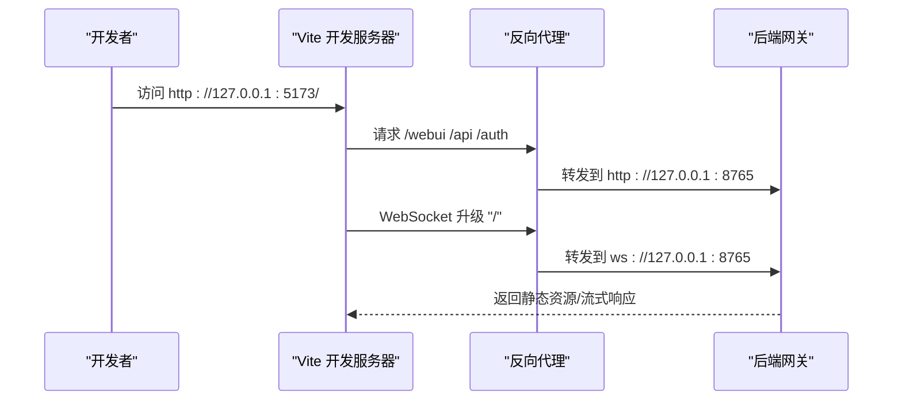
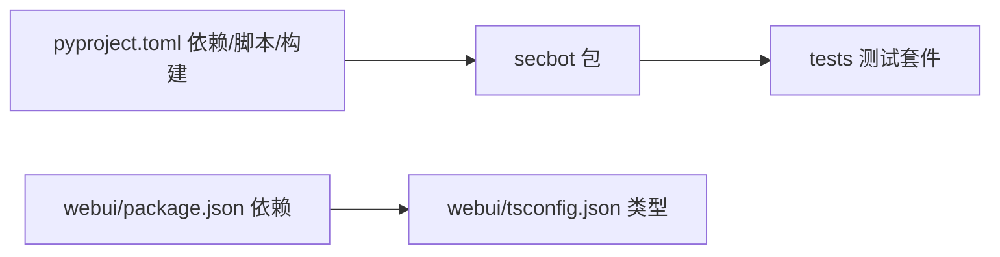

# 项目组织原则

<cite>
**本文引用的文件**
- [README.md](file://README.md)
- [pyproject.toml](file://pyproject.toml)
- [secbot/__init__.py](file://secbot/__init__.py)
- [secbot/config/loader.py](file://secbot/config/loader.py)
- [secbot/config/schema.py](file://secbot/config/schema.py)
- [secbot/agents/registry.py](file://secbot/agents/registry.py)
- [secbot/utils/helpers.py](file://secbot/utils/helpers.py)
- [webui/package.json](file://webui/package.json)
- [webui/vite.config.ts](file://webui/vite.config.ts)
- [webui/tailwind.config.js](file://webui/tailwind.config.js)
- [webui/tsconfig.json](file://webui/tsconfig.json)
- [webui/src/main.tsx](file://webui/src/main.tsx)
- [.trellis/config.yaml](file://.trellis/config.yaml)
</cite>

## 目录
1. [引言](#引言)
2. [项目结构](#项目结构)
3. [核心组件](#核心组件)
4. [架构总览](#架构总览)
5. [详细组件分析](#详细组件分析)
6. [依赖分析](#依赖分析)
7. [性能考虑](#性能考虑)
8. [故障排查指南](#故障排查指南)
9. [结论](#结论)
10. [附录](#附录)

## 引言
本文件系统化阐述 VAPT3 项目的组织原则，聚焦后端 secbot/、前端 webui/、测试 tests/ 的职责划分与协作边界；明确 Python/TypeScript 文件命名规范与配置文件组织方式；总结模块划分原则、接口设计规范、代码复用与模块化最佳实践；并给出版本管理与分支策略建议，帮助团队建立高效一致的开发流程。

## 项目结构
VAPT3 采用“后端 Python + 前端 TypeScript + 测试独立”的三层组织方式：
- 后端 secbot/：核心业务域（专家智能体、工具封装、通道、API、CMDB、报告、安全沙箱等），通过包结构清晰分层，便于维护与扩展。
- 前端 webui/：React + Vite + Tailwind 构建的 WebUI，独立于后端，通过反向代理对接后端网关。
- 测试 tests/：覆盖后端各模块与前端组件，确保质量与回归稳定性。
- 配置与工作流：.trellis/ 提供工作流与会话记录配置；pyproject.toml/webui/package.json 管理依赖与构建脚本。

图表来源
- [README.md:259-275](file://README.md#L259-L275)
- [pyproject.toml:112-113](file://pyproject.toml#L112-L113)
- [webui/vite.config.ts:1-66](file://webui/vite.config.ts#L1-L66)

章节来源
- [README.md:259-275](file://README.md#L259-L275)
- [pyproject.toml:112-113](file://pyproject.toml#L112-L113)
- [webui/vite.config.ts:1-66](file://webui/vite.config.ts#L1-L66)

## 核心组件
- 专家智能体注册中心：负责加载、校验、去重与工具表面生成，确保编排层只消费标准化的工具描述。
- 配置系统：集中式 Schema + 加载器 + 环境变量解析 + 迁移兼容，支持运行时 SSRF 白名单注入。
- 通用工具库：消息处理、令牌估算、持久化工具输出、模板同步等，支撑上层编排与报告。
- 前端工程：Vite + React + Tailwind，通过代理将 /webui、/api、/auth、WebSocket 转发至后端网关。

章节来源
- [secbot/agents/registry.py:1-248](file://secbot/agents/registry.py#L1-L248)
- [secbot/config/loader.py:1-173](file://secbot/config/loader.py#L1-L173)
- [secbot/config/schema.py:1-376](file://secbot/config/schema.py#L1-L376)
- [secbot/utils/helpers.py:1-546](file://secbot/utils/helpers.py#L1-L546)
- [webui/vite.config.ts:1-66](file://webui/vite.config.ts#L1-L66)

## 架构总览
后端四层职责清晰：对话交互层、调度编排层、专家智能体层、工具执行层。前端通过网关与通道与后端交互，形成“前端-网关-后端”的松耦合架构。

图表来源
- [README.md:29-63](file://README.md#L29-L63)
- [README.md:64-74](file://README.md#L64-L74)
- [secbot/agents/registry.py:1-248](file://secbot/agents/registry.py#L1-L248)

章节来源
- [README.md:29-63](file://README.md#L29-L63)
- [README.md:64-74](file://README.md#L64-L74)

## 详细组件分析

### 后端 secbot/ 组件分析
- 专家智能体注册中心
  - 职责：加载 YAML、校验字段与 JSON Schema、禁止技能共享、生成工具表面。
  - 关键点：名称与文件名一致性、必需字段、scoped_skills 唯一性、输入输出 Schema 校验。
- 配置系统
  - 职责：加载/保存配置、环境变量解析、SSRF 白名单应用、配置迁移。
  - 关键点：camelCase/snake_case 兼容、Provider 自动匹配、工具配置分层。
- 通用工具库
  - 职责：消息清洗、令牌估算、工具输出持久化、模板同步、运行状态摘要。
  - 关键点：原子写入、预览截断、目录清理、Git 版本控制初始化。

图表来源
- [secbot/agents/registry.py:65-92](file://secbot/agents/registry.py#L65-L92)
- [secbot/agents/registry.py:37-63](file://secbot/agents/registry.py#L37-L63)
- [secbot/config/schema.py:267-376](file://secbot/config/schema.py#L267-L376)
- [secbot/utils/helpers.py:240-287](file://secbot/utils/helpers.py#L240-L287)

章节来源
- [secbot/agents/registry.py:1-248](file://secbot/agents/registry.py#L1-L248)
- [secbot/config/schema.py:1-376](file://secbot/config/schema.py#L1-L376)
- [secbot/utils/helpers.py:1-546](file://secbot/utils/helpers.py#L1-L546)

### 前端 webui/ 组件分析
- 构建与代理
  - Vite 将 /webui、/api、/auth、WebSocket 代理到后端网关；SPA 路由与 WebSocket 升级分离。
- 样式与主题
  - Tailwind 配置主题色系与动画，支持深色模式与多语言字体。
- 类型与路径别名
  - TS 严格模式、路径别名 @/*，统一源码组织。

图表来源
- [webui/vite.config.ts:41-58](file://webui/vite.config.ts#L41-L58)
- [webui/src/main.tsx:1-16](file://webui/src/main.tsx#L1-L16)

章节来源
- [webui/vite.config.ts:1-66](file://webui/vite.config.ts#L1-L66)
- [webui/tailwind.config.js:1-166](file://webui/tailwind.config.js#L1-L166)
- [webui/tsconfig.json:1-33](file://webui/tsconfig.json#L1-L33)
- [webui/src/main.tsx:1-16](file://webui/src/main.tsx#L1-L16)

### 测试 tests/ 组件分析
- 覆盖范围：agent、api、channels、cli、cmdb、command、config、cron、heartbeat、providers、report、security、session、skills、tools、utils 等。
- 目标：保障编排正确性、通道稳定性、工具安全性、配置兼容性与报告一致性。

章节来源
- [README.md:284-289](file://README.md#L284-L289)

## 依赖分析
- 后端依赖管理
  - 使用 hatchling 构建，wheel/sdist 包含 secbot 模块与模板/技能资源。
  - pytest、ruff、覆盖率配置集中于 pyproject.toml。
- 前端依赖管理
  - package.json 管理运行时与开发依赖，Vitest/Jest DOM 环境用于测试。
- 版本与入口
  - 后端通过脚本 secbot 指向 CLI 命令入口；版本优先从包元数据读取，回退到 pyproject.toml。

图表来源
- [pyproject.toml:25-68](file://pyproject.toml#L25-L68)
- [pyproject.toml:103-110](file://pyproject.toml#L103-L110)
- [pyproject.toml:112-113](file://pyproject.toml#L112-L113)
- [webui/package.json:14-45](file://webui/package.json#L14-L45)

章节来源
- [pyproject.toml:1-169](file://pyproject.toml#L1-L169)
- [webui/package.json:1-67](file://webui/package.json#L1-L67)

## 性能考虑
- 令牌估算与上下文预算：通过工具函数估算提示词与消息令牌，结合上下文窗口与预算计算，避免超限。
- 工具输出持久化：对超长工具输出进行预览截断与原子落盘，减少内存压力与 IO 风险。
- 代理与并发：Vite 优化依赖排除与 HMR 独立端口，降低开发期抖动；后端通道与 API 并行提供服务。

章节来源
- [secbot/utils/helpers.py:338-438](file://secbot/utils/helpers.py#L338-L438)
- [secbot/utils/helpers.py:240-287](file://secbot/utils/helpers.py#L240-L287)
- [webui/vite.config.ts:17-40](file://webui/vite.config.ts#L17-L40)

## 故障排查指南
- 配置加载失败或默认配置：检查 ~/.secbot/config.json 是否存在、JSON 是否合法、字段是否符合 Schema。
- 环境变量未解析：确认 ${VAR} 引用的变量是否设置，解析失败会抛出异常。
- SSRF 白名单：若访问受限，检查 tools.ssrf_whitelist 是否包含目标网段。
- 前端无法连接后端：确认 channels.websocket.enabled=true，后端以 gateway 启动，Vite 代理目标地址正确。

章节来源
- [secbot/config/loader.py:32-56](file://secbot/config/loader.py#L32-L56)
- [secbot/config/loader.py:86-147](file://secbot/config/loader.py#L86-L147)
- [secbot/config/schema.py:264-265](file://secbot/config/schema.py#L264-L265)
- [README.md:127-170](file://README.md#L127-L170)

## 结论
VAPT3 通过清晰的模块边界、强约束的配置 Schema、可扩展的智能体注册机制与前后端分离的工程化组织，实现了安全编排系统的可维护性与可扩展性。遵循本文的命名规范、模块划分原则与最佳实践，可显著提升团队协作效率与系统稳定性。

## 附录

### 目录结构设计理念
- 后端 secbot/：按领域与层次划分，避免循环依赖，接口通过 YAML/Schema 明确契约。
- 前端 webui/：独立工程，通过代理与后端解耦，便于演进与替换。
- 测试 tests/：与被测模块一一对应，保证质量门禁。

章节来源
- [README.md:259-275](file://README.md#L259-L275)

### 文件命名规范
- Python 模块
  - 模块名使用小写与下划线，避免复杂符号；包内 __init__.py 聚合导出。
  - 示例参考：secbot/config/schema.py、secbot/utils/helpers.py。
- TypeScript 组件
  - 组件文件使用 PascalCase.tsx，样式与工具文件分别命名，路径别名统一为 @/*。
  - 示例参考：webui/src/components/thread/ThreadShell.tsx、webui/src/lib/api.ts。
- 配置文件
  - 后端：config.json（用户配置）、pyproject.toml（项目元数据与构建）、.trellis/config.yaml（工作流）。
  - 前端：package.json（依赖与脚本）、tsconfig.json（类型）、tailwind.config.js（样式）、vite.config.ts（构建与代理）。

章节来源
- [secbot/config/schema.py:1-17](file://secbot/config/schema.py#L1-L17)
- [webui/src/main.tsx:1-16](file://webui/src/main.tsx#L1-L16)
- [webui/tsconfig.json:27-29](file://webui/tsconfig.json#L27-L29)
- [webui/package.json:14-45](file://webui/package.json#L14-L45)
- [webui/tailwind.config.js:1-166](file://webui/tailwind.config.js#L1-L166)
- [webui/vite.config.ts:1-66](file://webui/vite.config.ts#L1-L66)
- [.trellis/config.yaml:1-60](file://.trellis/config.yaml#L1-L60)

### 模块划分原则与接口设计规范
- 功能边界
  - 专家智能体：通过 YAML 描述输入输出与工具集合，注册中心统一校验与去重。
  - 工具封装：面向安全工具的最小可用抽象，暴露稳定 I/O Schema。
  - 通道与 API：统一接入层，屏蔽协议差异。
- 依赖关系
  - 上层编排依赖注册中心提供的工具表面；工具层依赖安全与沙箱策略。
  - 配置系统为全局单例，通过 Schema 与加载器提供一致的契约。
- 接口设计
  - 专家智能体：name/display_name/description/system_prompt_file/scoped_skills/input_schema/output_schema。
  - 工具：输入输出 JSON Schema，错误与超时处理明确。
  - 配置：camelCase/snake_case 兼容，环境变量前缀 SECBOT_。

章节来源
- [secbot/agents/registry.py:20-31](file://secbot/agents/registry.py#L20-L31)
- [secbot/agents/registry.py:37-63](file://secbot/agents/registry.py#L37-L63)
- [secbot/config/schema.py:13-17](file://secbot/config/schema.py#L13-L17)
- [secbot/config/schema.py:267-376](file://secbot/config/schema.py#L267-L376)

### 配置文件组织方式
- 环境配置
  - 用户配置：~/.secbot/config.json，Schema 校验与默认值。
  - 环境变量：SECBOT_ 前缀，支持 ${VAR} 占位符解析。
- 构建配置
  - 后端：pyproject.toml（依赖、脚本、构建、测试、覆盖率）。
  - 前端：package.json（依赖与脚本）、tsconfig.json（类型）、tailwind.config.js（样式）、vite.config.ts（代理与构建）。
- 开发配置
  - .trellis/config.yaml：会话记录、任务钩子、多包工作区等项目级工作流配置。

章节来源
- [secbot/config/loader.py:32-56](file://secbot/config/loader.py#L32-L56)
- [secbot/config/loader.py:86-147](file://secbot/config/loader.py#L86-L147)
- [secbot/config/schema.py:267-376](file://secbot/config/schema.py#L267-L376)
- [pyproject.toml:145-169](file://pyproject.toml#L145-L169)
- [webui/vite.config.ts:1-66](file://webui/vite.config.ts#L1-L66)
- [.trellis/config.yaml:1-60](file://.trellis/config.yaml#L1-L60)

### 代码复用与模块化最佳实践
- 通用工具函数
  - 消息清洗、令牌估算、工具输出持久化、模板同步等，作为跨模块共享能力。
- 共享组件
  - 前端 UI 组件库（Radix、Tailwind 扩展）与国际化配置，统一风格与行为。
- 公共接口
  - 专家智能体通过 YAML 与 Schema 描述契约；工具通过输入输出 JSON Schema 与错误语义约定。

章节来源
- [secbot/utils/helpers.py:18-72](file://secbot/utils/helpers.py#L18-L72)
- [secbot/utils/helpers.py:338-438](file://secbot/utils/helpers.py#L338-L438)
- [secbot/utils/helpers.py:496-546](file://secbot/utils/helpers.py#L496-L546)
- [webui/tailwind.config.js:1-166](file://webui/tailwind.config.js#L1-L166)

### 版本管理与分支策略
- 分支策略
  - 主分支 main 面向稳定迭代；重构与破坏性变更另开分支 PR。
  - 与上游 nanobot 同步：定期 fetch upstream 并 rebase 保持 Agent Loop 改进。
- 版本号
  - 后端版本来自包元数据或 pyproject.toml 回退；前端版本在 package.json 中维护。
- 入口与脚本
  - 后端 secbot 脚本指向 CLI 命令入口，便于统一调用。

章节来源
- [README.md:284-289](file://README.md#L284-L289)
- [secbot/__init__.py:10-27](file://secbot/__init__.py#L10-L27)
- [pyproject.toml:112-113](file://pyproject.toml#L112-L113)