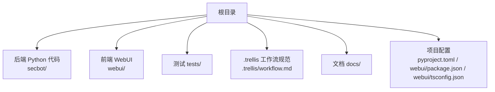
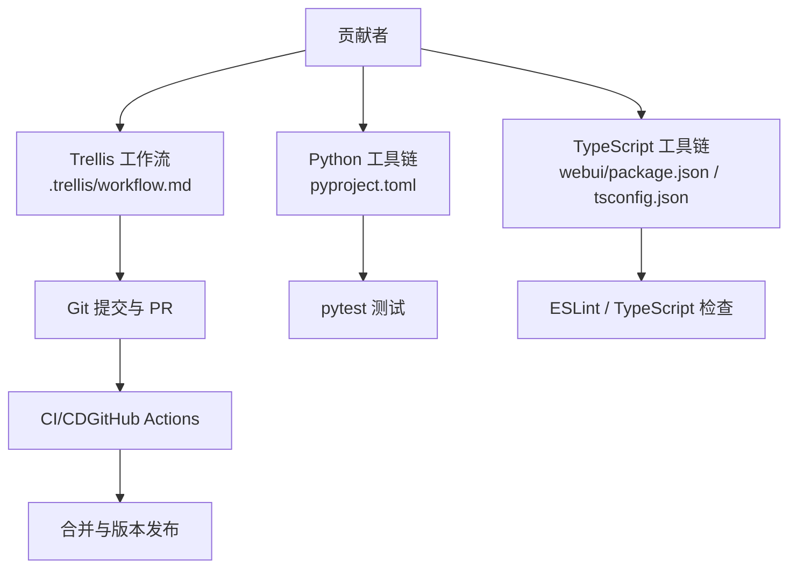
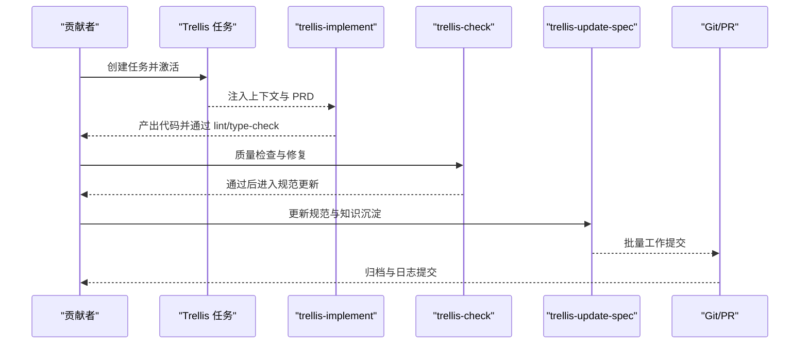
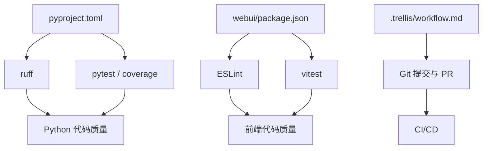

# 代码贡献规范

<cite>
**本文引用的文件**
- [README.md](file://README.md)
- [pyproject.toml](file://pyproject.toml)
- [webui/package.json](file://webui/package.json)
- [webui/tsconfig.json](file://webui/tsconfig.json)
- [.trellis/workflow.md](file://.trellis/workflow.md)
- [webui/README.md](file://webui/README.md)
- [docs/README.md](file://docs/README.md)
</cite>

## 目录
1. [引言](#引言)
2. [项目结构](#项目结构)
3. [核心组件](#核心组件)
4. [架构总览](#架构总览)
5. [详细组件分析](#详细组件分析)
6. [依赖关系分析](#依赖关系分析)
7. [性能考虑](#性能考虑)
8. [故障排查指南](#故障排查指南)
9. [结论](#结论)
10. [附录](#附录)

## 引言
本规范旨在为本仓库的贡献者提供统一的代码风格、提交与评审流程、Git 工作流以及开发工具配置建议，确保代码质量、可维护性与协作效率。规范内容来源于仓库内现有文档与配置文件，涵盖 Python、TypeScript/JavaScript 代码风格、文档编写标准、提交信息格式、分支命名约定、PR 描述要求、完整的 PR 流程、代码审查流程与质量标准、Git 分支策略与版本管理、冲突解决策略，以及 IDE 与开发工具的最佳实践。

## 项目结构
本仓库采用多语言混合工程组织方式：
- 后端与核心逻辑：Python（包名与版本约束、依赖声明、测试与覆盖率配置）
- 前端界面：TypeScript/React/Tailwind（Vite 构建、TypeScript 编译配置、测试与 ESLint）
- 工作流与规范：Trellis 工作流文档（任务生命周期、阶段划分、提交与归档流程）

图表来源
- [README.md:259-275](file://README.md#L259-L275)
- [.trellis/workflow.md:1-663](file://.trellis/workflow.md#L1-L663)
- [pyproject.toml:1-169](file://pyproject.toml#L1-L169)
- [webui/package.json:1-63](file://webui/package.json#L1-L63)
- [webui/tsconfig.json:1-33](file://webui/tsconfig.json#L1-L33)

章节来源
- [README.md:259-275](file://README.md#L259-L275)
- [.trellis/workflow.md:1-663](file://.trellis/workflow.md#L1-L663)

## 核心组件
- Python 后端
  - 依赖与版本：使用 pyproject.toml 声明核心依赖与可选依赖，包含类型校验与测试工具链。
  - 测试与覆盖率：pytest 配置与覆盖率排除规则明确。
- 前端 WebUI
  - 构建与脚本：Vite + React + TypeScript，提供开发、构建、预览与测试脚本。
  - 类型与严格模式：tsconfig.json 启用严格模式与路径别名。
- 工作流与规范
  - Trellis 工作流：定义“计划—执行—收尾”三阶段，明确任务生命周期、上下文注入、质量检查与提交流程。

章节来源
- [pyproject.toml:1-169](file://pyproject.toml#L1-L169)
- [webui/package.json:1-63](file://webui/package.json#L1-L63)
- [webui/tsconfig.json:1-33](file://webui/tsconfig.json#L1-L33)
- [.trellis/workflow.md:1-663](file://.trellis/workflow.md#L1-L663)

## 架构总览
下图展示贡献流程与工具链之间的关系：开发者在本地完成代码与测试，借助 Trellis 工作流进行任务管理与质量控制，最终通过 Git 提交与 PR 完成合并。

图表来源
- [.trellis/workflow.md:1-663](file://.trellis/workflow.md#L1-L663)
- [pyproject.toml:153-169](file://pyproject.toml#L153-L169)
- [webui/package.json:6-13](file://webui/package.json#L6-L13)
- [webui/tsconfig.json:17-24](file://webui/tsconfig.json#L17-L24)

## 详细组件分析

### Python 代码风格与质量标准
- 版本与依赖
  - Python 版本要求：≥ 3.11
  - 依赖管理：集中于 pyproject.toml，核心库覆盖 LLM、HTTP、WebSocket、数据库与报告等。
  - 可选依赖：按渠道与功能拆分，便于最小化安装。
- 代码风格与静态检查
  - 使用 ruff 进行 lint，行宽限制与规则集合已在配置中定义。
  - 测试框架：pytest，异步模式自动；测试路径 tests/。
  - 覆盖率：源码范围与排除规则明确，避免测试文件参与覆盖率统计。
- 文档与注释
  - README 中包含产品需求、开发规范与 Trellis 工作流链接，便于查阅。
- 最佳实践
  - 优先使用类型注解与 Pydantic 模型，保持接口清晰。
  - 遵循单一职责与模块化设计，减少循环依赖。
  - 在变更涉及新智能体或底层工具时，补充相应测试。

章节来源
- [pyproject.toml:1-169](file://pyproject.toml#L1-L169)
- [README.md:277-282](file://README.md#L277-L282)

### TypeScript/JavaScript 代码风格与质量标准
- 语言与构建
  - 目标与模块：ES2022 + ESNext 模块解析，bundler 模式。
  - 严格模式：开启严格模式、未使用局部变量/参数、switch 不穿透等。
  - 路径别名：@/* 映射至 src/*，提升导入一致性。
- 脚本与工具
  - 开发：vite dev
  - 构建：tsc + vite build
  - 预览：vite preview
  - 测试：vitest run / vitest watch
  - Lint：eslint src --max-warnings 0
- 文档与注释
  - webui/README.md 提供开发与部署指引，建议在 PR 中同步更新相关文档。
- 最佳实践
  - 组件拆分与状态管理遵循 React Hooks 模式，避免过度耦合。
  - 使用 Tailwind CSS 与 Radix UI 组件库，保持一致的视觉与交互体验。
  - 在变更涉及 UI 组件或路由时，补充单元测试与集成测试。

章节来源
- [webui/tsconfig.json:1-33](file://webui/tsconfig.json#L1-L33)
- [webui/package.json:1-63](file://webui/package.json#L1-L63)
- [webui/README.md:1-136](file://webui/README.md#L1-L136)

### 文档编写标准
- 文档组织
  - docs/ 目录提供核心与高级文档索引，便于查找与维护。
  - README.md 提供项目概述、架构与贡献说明，作为贡献入口。
- 更新与同步
  - Trellis 工作流中强调“持久化一切”，变更应同步更新相关文档。
  - WebUI 变更需与根 README 的文档索引保持一致。
- 最佳实践
  - 使用简洁标题与清晰层级，避免冗长段落。
  - 示例与截图配合说明，便于新贡献者理解。

章节来源
- [docs/README.md:1-35](file://docs/README.md#L1-L35)
- [README.md:277-282](file://README.md#L277-L282)

### 提交规范与分支命名约定
- 提交信息格式
  - 参考 Trellis 工作流中的“学习最近历史风格”步骤，结合仓库近期提交记录，统一前缀（如 feat: / fix: / chore: / docs: 等）、语言（中文/英文）与长度风格。
- 分支命名约定
  - 建议采用“类型/主题-任务编号”的形式，例如 feature/agent-orchestrator-123、fix/webui-auth-456、docs/readme-updates-789。
- 提交策略
  - 遵循“工作提交优先，归档与日志提交随后”的三阶段提交顺序，避免变基与混杂提交。

章节来源
- [.trellis/workflow.md:549-602](file://.trellis/workflow.md#L549-L602)

### Pull Request（PR）流程
- 任务创建与激活
  - 使用 Trellis 任务脚本创建任务目录，完成 PRD 与上下文注入后激活任务。
- 实施与质量检查
  - 通过 trellis-implement 与 trellis-check 子智能体完成编码与质量检查，必要时回滚修正。
- 规范更新与提交
  - 在 trellis-update-spec 中沉淀经验，随后进行批量工作提交，最后归档与记录。
- 合并要求
  - 提交信息清晰、测试通过、无未识别脏文件、符合仓库风格与规范。

图表来源
- [.trellis/workflow.md:158-213](file://.trellis/workflow.md#L158-L213)
- [.trellis/workflow.md:428-516](file://.trellis/workflow.md#L428-L516)
- [.trellis/workflow.md:518-602](file://.trellis/workflow.md#L518-L602)

章节来源
- [.trellis/workflow.md:158-213](file://.trellis/workflow.md#L158-L213)
- [.trellis/workflow.md:428-516](file://.trellis/workflow.md#L428-L516)
- [.trellis/workflow.md:518-602](file://.trellis/workflow.md#L518-L602)

### 代码审查流程与质量标准
- 审查范围
  - 规范符合性、代码风格、测试覆盖率、跨层一致性（当变更涉及多层）。
- 自动化检查
  - Python：ruff lint、pytest 测试、覆盖率报告。
  - TypeScript：ESLint、TypeScript 编译与 vitest 测试。
- 审查要点
  - 逻辑正确性与边界处理、错误处理与日志记录、安全性（如命令注入防护、网络白名单）。
  - 文档与注释完整性，变更影响面评估。

章节来源
- [pyproject.toml:145-169](file://pyproject.toml#L145-L169)
- [webui/package.json:6-13](file://webui/package.json#L6-L13)
- [webui/tsconfig.json:17-24](file://webui/tsconfig.json#L17-L24)

### Git 工作流程指南
- 分支策略
  - 主分支稳定，重构与破坏性变更另起分支 PR。
  - 与上游仓库保持同步，定期拉取并 rebase。
- 冲突解决
  - 优先使用 rebase 保持线性历史；冲突集中在业务分支内解决后再合并。
- 版本管理
  - 版本号与发布流程遵循项目配置与工作流规范，提交信息体现版本演进。

章节来源
- [README.md:284-289](file://README.md#L284-L289)

### 开发工具配置建议与 IDE 设置最佳实践
- Python
  - 使用 ruff 进行 lint，pytest 运行测试，VS Code 可通过 Python/Pydantic 插件增强类型提示。
  - 依赖安装：pip install -e . 与 pip install -e ".[dev]"。
- TypeScript/React
  - 使用 Vite + React + TypeScript 开发，VS Code 推荐安装 React/TS 插件与 ESLint。
  - 构建与测试：bun/npm/yarn 安装依赖后，分别执行 dev/build/test。
- WebUI
  - 开发前安装依赖，确保 TypeScript 能解析依赖；通过网关与前端联调。
- Trellis
  - 使用任务脚本管理任务生命周期，确保上下文注入与质量检查贯穿始终。

章节来源
- [pyproject.toml:103-110](file://pyproject.toml#L103-L110)
- [webui/package.json:6-13](file://webui/package.json#L6-L13)
- [webui/README.md:28-90](file://webui/README.md#L28-L90)
- [.trellis/workflow.md:40-76](file://.trellis/workflow.md#L40-L76)

## 依赖关系分析
- Python 依赖
  - 核心库：Typer、Anthropic、Pydantic、SQLAlchemy/Alembic、FastAPI 生态等。
  - 可选依赖：各渠道 SDK、PDF/文档处理、LangSmith 等。
- 前端依赖
  - React + Radix UI + Tailwind + Assistant UI，构建与测试工具链完整。
- 工具链耦合
  - Trellis 工作流与 Git 提交流程强耦合，确保每次变更都经过上下文注入、质量检查与规范更新。

图表来源
- [pyproject.toml:145-169](file://pyproject.toml#L145-L169)
- [webui/package.json:6-13](file://webui/package.json#L6-L13)
- [.trellis/workflow.md:1-663](file://.trellis/workflow.md#L1-L663)

章节来源
- [pyproject.toml:1-169](file://pyproject.toml#L1-L169)
- [webui/package.json:1-63](file://webui/package.json#L1-L63)
- [.trellis/workflow.md:1-663](file://.trellis/workflow.md#L1-L663)

## 性能考虑
- Python
  - 使用类型注解与 Pydantic 模型减少运行时错误与类型转换成本。
  - 数据库访问使用 SQLAlchemy 异步驱动，降低 I/O 阻塞。
- 前端
  - 组件拆分与懒加载，避免一次性渲染大型列表。
  - 使用 Tailwind CSS 与 Radix UI，减少自定义样式开销。
- 工作流
  - Trellis 工作流将质量检查前置，减少后期返工与 CI 时间消耗。

## 故障排查指南
- 常见问题
  - WebSocket 通道未启用导致前端无法连接：检查配置文件中 websocket.enabled 与端口。
  - 依赖缺失导致 TypeScript 报错：确保安装 webui 依赖后再打开编辑器。
  - 提交被拒绝：确认工作树干净且遵循三阶段提交顺序。
- 参考
  - WebUI 开发与部署说明、工作流脚本与任务管理命令。

章节来源
- [webui/README.md:55-111](file://webui/README.md#L55-L111)
- [.trellis/workflow.md:549-602](file://.trellis/workflow.md#L549-L602)

## 结论
本规范整合了仓库内的现有文档与配置，明确了 Python 与 TypeScript 的代码风格、提交与 PR 流程、代码审查与质量标准、Git 工作流与版本管理、以及开发工具配置建议。建议贡献者在每次变更前先阅读 Trellis 工作流与相关文档，确保变更可追溯、可审查、可维护。

## 附录
- 相关链接
  - 产品需求与开发规范：README.md 中的文档索引
  - Trellis 工作流：.trellis/workflow.md
  - WebUI 开发：webui/README.md
  - Python 工具链：pyproject.toml
  - TypeScript 工具链：webui/package.json、webui/tsconfig.json