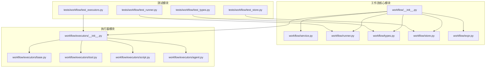
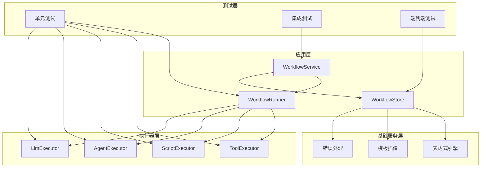
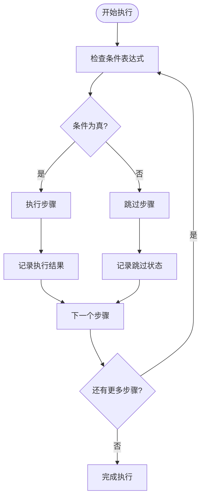
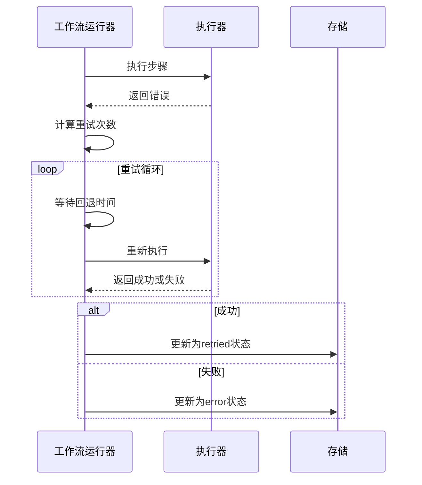
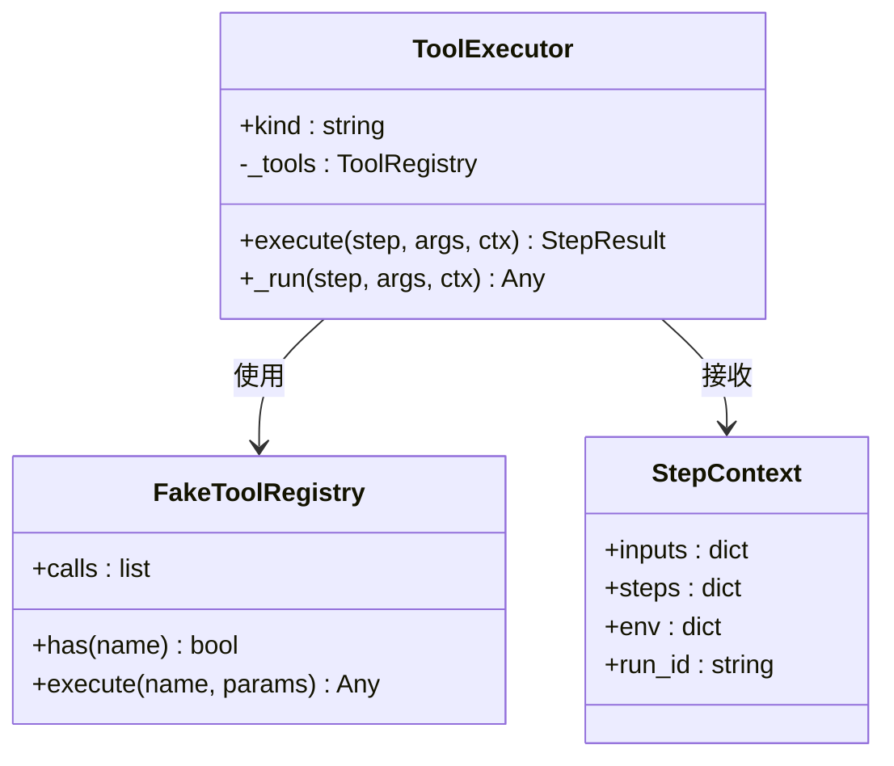
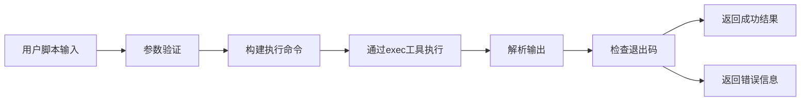
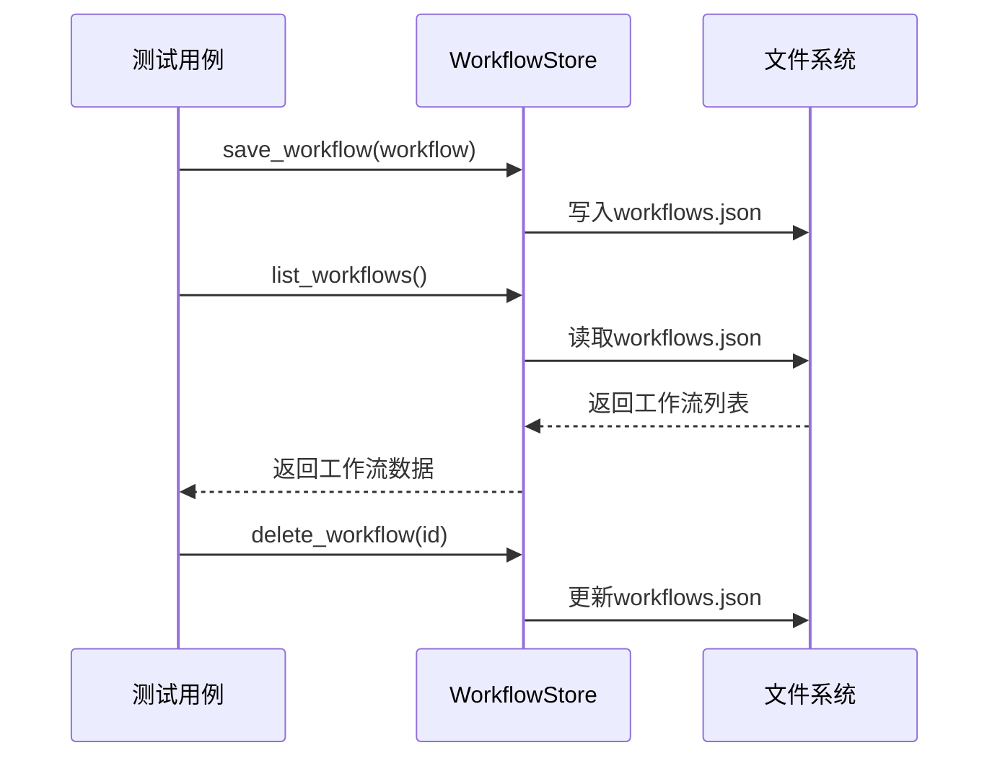
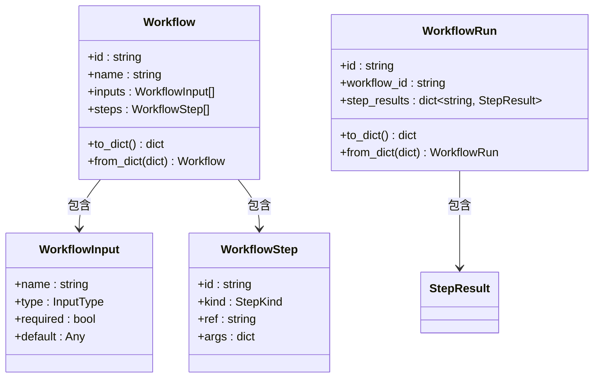
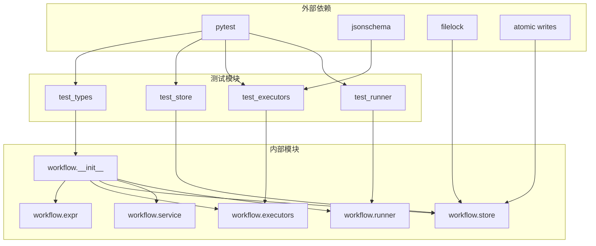

# 工作流测试基础设施

<cite>
**本文档引用的文件**
- [secbot/workflow/__init__.py](file://secbot/workflow/__init__.py)
- [secbot/workflow/service.py](file://secbot/workflow/service.py)
- [secbot/workflow/runner.py](file://secbot/workflow/runner.py)
- [secbot/workflow/types.py](file://secbot/workflow/types.py)
- [secbot/workflow/store.py](file://secbot/workflow/store.py)
- [secbot/workflow/executors/__init__.py](file://secbot/workflow/executors/__init__.py)
- [secbot/workflow/executors/base.py](file://secbot/workflow/executors/base.py)
- [secbot/workflow/executors/tool.py](file://secbot/workflow/executors/tool.py)
- [secbot/workflow/executors/script.py](file://secbot/workflow/executors/script.py)
- [secbot/workflow/executors/agent.py](file://secbot/workflow/executors/agent.py)
- [secbot/workflow/expr.py](file://secbot/workflow/expr.py)
- [tests/workflow/test_runner.py](file://tests/workflow/test_runner.py)
- [tests/workflow/test_executors.py](file://tests/workflow/test_executors.py)
- [tests/workflow/test_store.py](file://tests/workflow/test_store.py)
- [tests/workflow/test_types.py](file://tests/workflow/test_types.py)
</cite>

## 目录
1. [简介](#简介)
2. [项目结构](#项目结构)
3. [核心组件](#核心组件)
4. [架构概览](#架构概览)
5. [详细组件分析](#详细组件分析)
6. [依赖关系分析](#依赖关系分析)
7. [性能考虑](#性能考虑)
8. [故障排除指南](#故障排除指南)
9. [结论](#结论)

## 简介

工作流测试基础设施是VAPT3项目中一个重要的质量保证系统，专门用于测试和验证工作流引擎的各项功能。该基础设施提供了完整的测试框架，包括单元测试、集成测试和端到端测试，确保工作流引擎在各种场景下的稳定性和可靠性。

该测试基础设施的核心目标是：
- 验证工作流引擎的各个组件（运行器、执行器、存储等）正确实现
- 确保工作流定义的解析和执行符合预期行为
- 测试表达式求值和模板插值功能
- 验证错误处理和重试机制
- 确保数据持久化的一致性和完整性

## 项目结构

工作流测试基础设施主要分布在以下目录结构中：

**图表来源**
- [secbot/workflow/__init__.py:1-55](file://secbot/workflow/__init__.py#L1-L55)
- [secbot/workflow/service.py:1-290](file://secbot/workflow/service.py#L1-L290)
- [tests/workflow/test_runner.py:1-381](file://tests/workflow/test_runner.py#L1-L381)

**章节来源**
- [secbot/workflow/__init__.py:1-55](file://secbot/workflow/__init__.py#L1-L55)
- [secbot/workflow/service.py:1-290](file://secbot/workflow/service.py#L1-L290)
- [tests/workflow/test_runner.py:1-381](file://tests/workflow/test_runner.py#L1-L381)

## 核心组件

工作流测试基础设施包含以下核心组件：

### 数据模型层
- **Workflow**: 工作流定义的数据模型，包含输入参数、步骤定义和元数据
- **WorkflowRun**: 单次工作流执行的结果记录
- **WorkflowStep**: 工作流中的单个步骤定义
- **StepResult**: 步骤执行结果的数据封装

### 执行器层
- **StepExecutor**: 抽象执行器基类，定义所有执行器的统一接口
- **ToolExecutor**: 工具执行器，调用注册的工具函数
- **ScriptExecutor**: 脚本执行器，执行Python或Shell脚本
- **AgentExecutor**: 专家代理执行器，调用配置的AI代理
- **LlmExecutor**: 大语言模型执行器，直接与LLM提供商交互

### 运行时层
- **WorkflowRunner**: 工作流运行器，负责协调步骤执行
- **WorkflowService**: 工作流服务，提供REST/API接口
- **WorkflowStore**: 工作流存储，负责数据持久化

**章节来源**
- [secbot/workflow/types.py:1-275](file://secbot/workflow/types.py#L1-L275)
- [secbot/workflow/executors/base.py:1-116](file://secbot/workflow/executors/base.py#L1-L116)
- [secbot/workflow/runner.py:1-313](file://secbot/workflow/runner.py#L1-L313)
- [secbot/workflow/service.py:1-290](file://secbot/workflow/service.py#L1-L290)

## 架构概览

工作流测试基础设施采用分层架构设计，各层职责明确，耦合度低：

**图表来源**
- [secbot/workflow/runner.py:71-160](file://secbot/workflow/runner.py#L71-L160)
- [secbot/workflow/service.py:57-184](file://secbot/workflow/service.py#L57-L184)
- [secbot/workflow/store.py:33-159](file://secbot/workflow/store.py#L33-L159)

## 详细组件分析

### 工作流运行器测试

工作流运行器测试覆盖了核心执行逻辑：

#### 条件执行测试

**图表来源**
- [tests/workflow/test_runner.py:112-140](file://tests/workflow/test_runner.py#L112-L140)

#### 重试机制测试
工作流运行器实现了智能的重试机制，支持多种重试策略：

**图表来源**
- [tests/workflow/test_runner.py:178-222](file://tests/workflow/test_runner.py#L178-L222)

**章节来源**
- [tests/workflow/test_runner.py:1-381](file://tests/workflow/test_runner.py#L1-L381)

### 执行器测试

执行器测试确保每个执行器都正确实现其功能：

#### 工具执行器测试
工具执行器测试验证了工具调用的完整流程：

**图表来源**
- [tests/workflow/test_executors.py:30-47](file://tests/workflow/test_executors.py#L30-L47)

#### 脚本执行器测试
脚本执行器测试覆盖了Shell和Python脚本的执行：

**图表来源**
- [tests/workflow/test_executors.py:125-175](file://tests/workflow/test_executors.py#L125-L175)

**章节来源**
- [tests/workflow/test_executors.py:1-413](file://tests/workflow/test_executors.py#L1-L413)

### 存储测试

存储测试验证了数据持久化的正确性：

#### 工作流存储测试
工作流存储测试确保数据的完整性和一致性：

**图表来源**
- [tests/workflow/test_store.py:39-90](file://tests/workflow/test_store.py#L39-L90)

**章节来源**
- [tests/workflow/test_store.py:1-210](file://tests/workflow/test_store.py#L1-L210)

### 类型系统测试

类型系统测试确保数据模型的正确性和向后兼容性：

#### 数据模型测试
数据模型测试验证了类型转换和序列化功能：

**图表来源**
- [tests/workflow/test_types.py:14-41](file://tests/workflow/test_types.py#L14-L41)

**章节来源**
- [tests/workflow/test_types.py:1-119](file://tests/workflow/test_types.py#L1-L119)

## 依赖关系分析

工作流测试基础设施的依赖关系清晰且层次分明：

**图表来源**
- [secbot/workflow/__init__.py:8-29](file://secbot/workflow/__init__.py#L8-L29)
- [tests/workflow/test_runner.py:21-31](file://tests/workflow/test_runner.py#L21-L31)

**章节来源**
- [secbot/workflow/__init__.py:1-55](file://secbot/workflow/__init__.py#L1-L55)
- [tests/workflow/test_runner.py:1-381](file://tests/workflow/test_runner.py#L1-L381)

## 性能考虑

工作流测试基础设施在设计时充分考虑了性能因素：

### 异步执行优化
- 使用异步I/O操作减少阻塞
- 并发执行独立的测试用例
- 智能的资源管理避免内存泄漏

### 缓存策略
- 环境变量快照缓存避免重复读取
- 表达式求值结果缓存
- 执行器实例复用

### 存储优化
- JSON文件原子写入避免部分写入
- 文件锁机制确保并发安全
- 运行历史截断控制存储空间

## 故障排除指南

### 常见问题及解决方案

#### 测试执行失败
**症状**: 测试用例执行过程中出现异常
**解决方案**: 
1. 检查测试环境配置
2. 验证依赖包版本兼容性
3. 查看详细的错误日志

#### 数据持久化问题
**症状**: 工作流数据丢失或损坏
**解决方案**:
1. 检查文件权限设置
2. 验证磁盘空间充足
3. 确认文件锁机制正常工作

#### 执行器调用失败
**症状**: 工具或脚本执行返回错误
**解决方案**:
1. 验证工具注册表配置
2. 检查脚本语法和参数
3. 确认执行环境权限

**章节来源**
- [tests/workflow/test_runner.py:366-381](file://tests/workflow/test_runner.py#L366-L381)
- [tests/workflow/test_executors.py:177-193](file://tests/workflow/test_executors.py#L177-L193)

## 结论

工作流测试基础设施是一个设计精良、结构清晰的质量保证系统。它通过多层次的测试覆盖，确保了工作流引擎的稳定性、可靠性和可维护性。

该基础设施的主要优势包括：
- **全面的测试覆盖**: 从单元测试到集成测试的完整测试金字塔
- **清晰的架构设计**: 分层架构便于理解和维护
- **强大的错误处理**: 完善的错误检测和报告机制
- **高效的性能表现**: 异步执行和优化的存储策略

通过持续的测试驱动开发，该基础设施为VAPT3项目的稳定发展提供了坚实的技术保障。