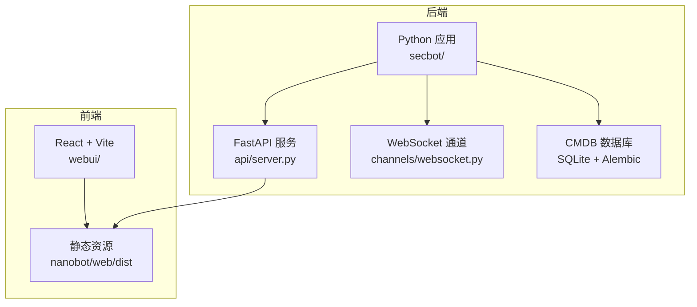
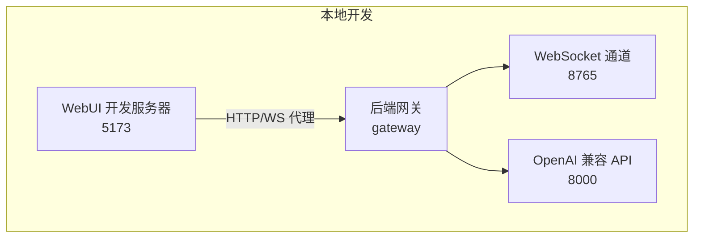
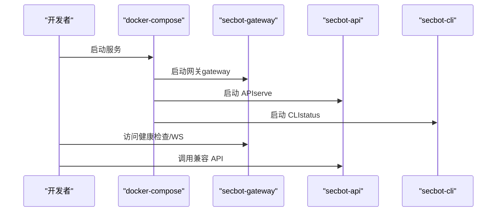
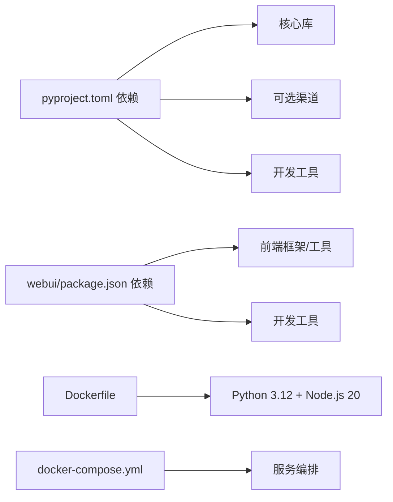

# 开发环境搭建

<cite>
**本文引用的文件**
- [README.md](file://README.md)
- [pyproject.toml](file://pyproject.toml)
- [docker-compose.yml](file://docker-compose.yml)
- [Dockerfile](file://Dockerfile)
- [entrypoint.sh](file://entrypoint.sh)
- [webui/README.md](file://webui/README.md)
- [webui/package.json](file://webui/package.json)
- [webui/vite.config.ts](file://webui/vite.config.ts)
- [.claude/settings.json](file://.claude/settings.json)
- [.claude/settings.local.json](file://.claude/settings.local.json)
</cite>

## 目录
1. [简介](#简介)
2. [项目结构](#项目结构)
3. [核心组件](#核心组件)
4. [架构总览](#架构总览)
5. [详细组件分析](#详细组件分析)
6. [依赖关系分析](#依赖关系分析)
7. [性能考虑](#性能考虑)
8. [故障排查指南](#故障排查指南)
9. [结论](#结论)
10. [附录](#附录)

## 简介
本指南面向希望在本地搭建并开发 secbot（VAPT3）项目的工程师与研究者。内容覆盖系统要求与前置依赖（Python 版本、Node.js 版本、数据库）、后端与前端本地开发配置、Docker 容器化开发与服务编排、IDE 配置建议（VS Code、PyCharm 等）、调试与日志设置、性能分析工具以及常见问题排查。

## 项目结构
- 后端（Python）：核心业务逻辑位于 secbot/，包含 Agent 编排、通道（WebSocket）、API、CMDB（SQLite + Alembic）、技能（skills）等模块。
- 前端（React + Vite）：webui/ 目录提供 WebUI 源码，构建产物输出至 nanobot/web/dist/ 并由后端网关提供静态资源。
- 配置与工具：根目录提供 Dockerfile、docker-compose.yml、pyproject.toml、README.md 等关键配置文件。

图表来源
- [README.md:29-53](file://README.md#L29-L53)
- [webui/vite.config.ts:24-28](file://webui/vite.config.ts#L24-L28)

章节来源
- [README.md:259-275](file://README.md#L259-L275)

## 核心组件
- 后端应用入口与命令行：通过 secbot 命令提供 gateway、serve、agent 等子命令，分别用于网关服务、OpenAI 兼容 API 服务与 CLI 交互。
- WebSocket 通道：WebUI 通过该通道与后端通信，需要在配置中启用。
- CMDB 数据库：基于 SQLite，使用 SQLAlchemy + Alembic 进行模型与迁移管理。
- 前端 WebUI：基于 Vite + React + TypeScript + Tailwind，开发时通过代理将 /api、/webui、/auth 与 WebSocket 请求转发至后端网关。

章节来源
- [README.md:113-120](file://README.md#L113-L120)
- [README.md:223-237](file://README.md#L223-L237)
- [webui/README.md:1-20](file://webui/README.md#L1-L20)

## 架构总览
下图展示本地开发时后端网关、WebSocket 通道、OpenAI 兼容 API 与前端 WebUI 的交互关系。

图表来源
- [README.md:115-120](file://README.md#L115-L120)
- [webui/vite.config.ts:41-57](file://webui/vite.config.ts#L41-L57)

## 详细组件分析

### 系统要求与前置依赖
- Python 版本
  - 最低版本要求：Python >= 3.11
  - 推荐版本：Python 3.12（与容器镜像一致）
- Node.js 版本
  - 前端开发使用 Vite + React + TypeScript，推荐使用 Node.js 20（与容器内安装一致）
- 数据库
  - CMDB 使用 SQLite，无需额外数据库服务；Alembic 用于迁移管理

章节来源
- [pyproject.toml:6](file://pyproject.toml#L6)
- [Dockerfile:3-13](file://Dockerfile#L3-L13)
- [README.md:223-237](file://README.md#L223-L237)

### 本地后端开发环境配置
- 安装依赖
  - 建议使用虚拟环境隔离依赖
  - 从源码安装可编辑模式：pip install -e .
- 初始化配置
  - 使用 secbot onboard 生成初始配置
  - 在用户配置文件中启用 WebSocket 通道并设置 host/port
- 启动服务
  - 网关：secbot gateway（默认监听健康检查端口 18790 与 WebSocket 端口 8765）
  - OpenAI 兼容 API：secbot serve -p 8000
  - CLI 交互：secbot agent

章节来源
- [README.md:78-92](file://README.md#L78-L92)
- [README.md:113-120](file://README.md#L113-L120)
- [README.md:127-178](file://README.md#L127-L178)

### 本地前端开发环境配置
- 安装依赖
  - 在 webui/ 目录执行 bun install 或 npm install
- 启动开发服务器
  - 在 webui/ 目录执行 bun run dev 或 npm run dev
  - 默认代理目标为 http://127.0.0.1:8765，可通过 NANOBOT_API_URL 环境变量调整
- 构建产物
  - 生产构建输出至 ../nanobot/web/dist，由网关提供静态资源

章节来源
- [webui/README.md:38-54](file://webui/README.md#L38-L54)
- [webui/README.md:71-80](file://webui/README.md#L71-L80)
- [webui/README.md:112-124](file://webui/README.md#L112-L124)
- [webui/vite.config.ts:24-28](file://webui/vite.config.ts#L24-L28)

### 数据库初始化与迁移
- 查看数据库路径：secbot cmdb path
- 执行迁移：secbot cmdb migrate
- 常用查询：列出资产、按严重级别列出漏洞等

章节来源
- [README.md:223-237](file://README.md#L223-L237)

### Docker 开发环境配置
- 构建镜像
  - 使用根目录 Dockerfile 构建镜像，容器内预装 Node.js 20
- 服务编排
  - 使用 docker-compose.yml 启动网关、API、CLI 服务
  - 端口映射：网关 18790 映射到宿主机；API 8900 映射到 127.0.0.1:8900
  - 用户与权限：容器以非 root 用户 secbot 运行，配置目录挂载至 ~/.secbot
- 权限问题排查
  - 若宿主机 ~/.secbot 不可写，entrypoint.sh 会提示修复方式（修改属主或以特定用户运行）

图表来源
- [docker-compose.yml:15-56](file://docker-compose.yml#L15-L56)

章节来源
- [docker-compose.yml:1-56](file://docker-compose.yml#L1-L56)
- [Dockerfile:1-51](file://Dockerfile#L1-L51)
- [entrypoint.sh:1-16](file://entrypoint.sh#L1-L16)

### IDE 配置建议
- VS Code
  - 推荐插件：Python（含 Pylance/Debugger）、Prettier、ESLint、Tailwind IntelliSense、TypeScript TSServer
  - Python 解释器：选择虚拟环境中的 Python 3.11+
  - 前端开发：确保在 webui/ 目录安装依赖后再打开工程
- PyCharm
  - 使用虚拟环境解释器
  - 启用 Python Console 中的“附加到外部环境”以便调试后端
- Claude（可选）
  - .claude/settings.json 与 .claude/settings.local.json 提供钩子与权限配置，便于在本地集成工作流

章节来源
- [.claude/settings.json:1-74](file://.claude/settings.json#L1-L74)
- [.claude/settings.local.json:1-8](file://.claude/settings.local.json#L1-L8)

### 调试环境设置
- 后端调试
  - 使用 Python Debugger（pdb）或 IDE 断点调试
  - 常用启动参数：gateway -v（开启详细日志）
- 前端调试
  - 在 webui/ 目录启动开发服务器，浏览器中打开 http://127.0.0.1:5173
  - 利用 Vite HMR 与 React DevTools 进行组件调试
- 日志配置
  - 后端使用 loguru，可通过命令行参数或配置文件调整日志级别
- 性能分析
  - Python：cProfile 或 py-spy
  - 前端：Chrome DevTools Performance 面板

章节来源
- [README.md:143-150](file://README.md#L143-L150)
- [webui/vite.config.ts:59-63](file://webui/vite.config.ts#L59-L63)

## 依赖关系分析
- Python 依赖
  - 核心库：FastAPI、SQLAlchemy、Alembic、websockets、anthropic、openai 等
  - 可选渠道：微信、企业微信、钉钉、Slack、Discord 等
  - 开发依赖：pytest、ruff、vite、vitest 等
- Node.js 依赖
  - 前端框架：React、TypeScript、TailwindCSS、assistant-ui
  - 构建工具：Vite、PostCSS、TailwindCSS 插件
- Docker 与容器
  - 基于 uv + Python 3.12 容器镜像，预装 Node.js 20
  - 通过 docker-compose 编排多个服务实例

图表来源
- [pyproject.toml:25-110](file://pyproject.toml#L25-L110)
- [webui/package.json:14-61](file://webui/package.json#L14-L61)
- [Dockerfile:1-51](file://Dockerfile#L1-L51)
- [docker-compose.yml:1-56](file://docker-compose.yml#L1-L56)

章节来源
- [pyproject.toml:1-169](file://pyproject.toml#L1-L169)
- [webui/package.json:1-63](file://webui/package.json#L1-L63)

## 性能考虑
- 后端
  - 使用异步 I/O（如 aiohttp、aiosqlite）提升并发处理能力
  - 合理设置数据库连接池大小与超时
- 前端
  - 构建时关闭 sourcemap（生产构建）以减少体积
  - 使用 Vite 的依赖预打包优化首次加载
- 容器
  - 限制 CPU 与内存资源，避免过度占用宿主机

章节来源
- [webui/vite.config.ts:27-28](file://webui/vite.config.ts#L27-L28)
- [docker-compose.yml:23-47](file://docker-compose.yml#L23-L47)

## 故障排查指南
- 启动后端网关失败
  - 确认已启用 WebSocket 通道并在配置中设置 host/port
  - 使用 secbot gateway -v 查看详细日志
- 前端无法连接后端
  - 检查 Vite 代理目标是否指向正确的后端地址（默认 8765）
  - 若更改端口，使用 NANOBOT_API_URL 指定新地址
- OpenAI 兼容 API 启动报错
  - 确保默认模型对应的 Provider 已配置 apiKey
- Docker 权限问题
  - ~/.secbot 不可写时，根据 entrypoint.sh 提示修复属主或以正确用户运行容器
- 前端依赖缺失导致编辑器报错
  - 在 webui/ 目录执行 bun install 或 npm install 安装依赖

章节来源
- [README.md:127-178](file://README.md#L127-L178)
- [webui/README.md:85-90](file://webui/README.md#L85-L90)
- [entrypoint.sh:1-16](file://entrypoint.sh#L1-L16)
- [webui/README.md:38-54](file://webui/README.md#L38-L54)

## 结论
通过以上步骤，您可以在本地完成 secbot 的后端与前端开发环境搭建，并使用 Docker 进行容器化开发与服务编排。建议在开发过程中结合 IDE 插件、断点调试与日志配置，配合性能分析工具持续优化体验。

## 附录
- 快速命令清单
  - 安装后端：pip install -e .
  - 初始化配置：secbot onboard
  - 启动网关：secbot gateway -v
  - 启动 API：secbot serve -p 8000
  - 启动 CLI：secbot agent
  - 启动前端：cd webui && bun run dev
  - 构建前端：cd webui && bun run build
  - Docker 启动：docker-compose up -d